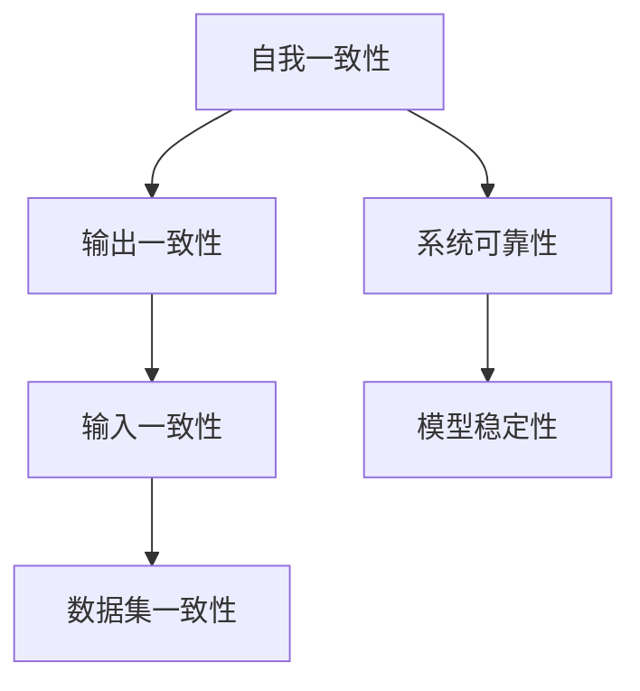
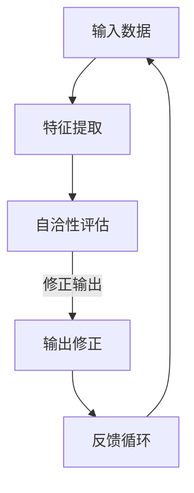
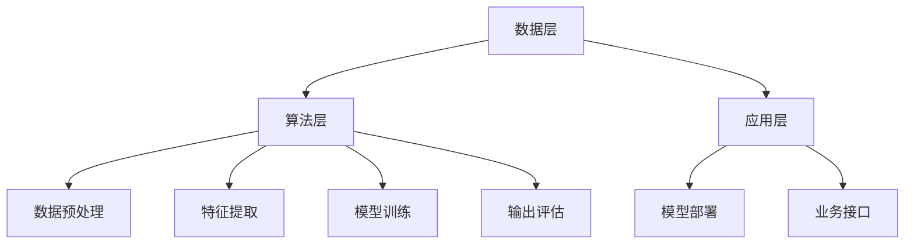
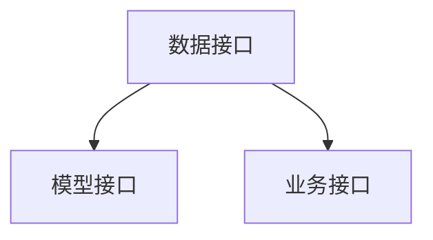
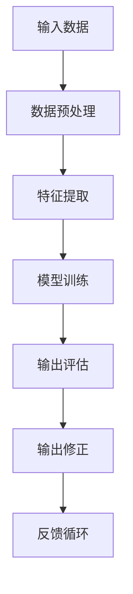

                 


### 引言：自我一致性（Self-Consistency）的重要性

在人工智能（AI）迅猛发展的今天，AI系统生成的内容质量直接影响其应用效果。从自然语言处理到计算机视觉，AI输出的质量都成为衡量其性能的关键指标。然而，AI系统的输出往往存在不一致性和误差，这既影响了用户体验，又限制了AI系统的广泛应用。

自我一致性（Self-Consistency）作为一种关键的技术，旨在提升AI输出的质量。本文将深入探讨自我一致性的概念、原理及其在AI系统中的应用，以帮助读者理解这一技术的核心价值和实际应用。

本文将分为以下几个部分：

1. **背景与核心概念**：介绍自我一致性的背景、定义、原理以及其在人工智能中的重要性。
2. **自我一致性CoT技术概述**：阐述自我一致性CoT（Self-Consistency CoT）技术的定义、框架和应用领域。
3. **自我一致性CoT关键技术**：详细解析自我一致性CoT的算法原理、数学模型以及应用实例。
4. **系统设计与项目实战**：介绍一个具体的AI系统项目，展示如何应用自我一致性技术来提升系统输出质量。
5. **总结与展望**：总结文章要点，对未来的研究方向和应用前景进行展望。

### 关键词

- 自我一致性（Self-Consistency）
- AI输出质量
- 自我一致性CoT
- 算法原理
- 数学模型
- 项目实战

### 摘要

本文旨在探讨自我一致性（Self-Consistency）在人工智能（AI）领域的重要性，并详细介绍自我一致性CoT（Self-Consistency CoT）技术。通过背景介绍、核心概念阐述、算法原理解析、应用实例展示和项目实战分析，本文揭示了自我一致性技术如何提升AI输出的质量，为AI系统的进一步发展提供了新的思路和方法。读者可以通过本文对自我一致性技术有一个全面的理解，并在实际应用中发挥其价值。

---

## 第一部分：背景与核心概念

### 第1章：自我一致性概念框架

#### 1.1 问题背景

在人工智能（AI）的发展历程中，我们见证了从简单的规则系统到复杂的学习模型，再到深度学习、生成对抗网络（GAN）等前沿技术的飞速进步。这些技术使得AI系统在各种任务上表现出色，如图像识别、自然语言处理和自动驾驶等。然而，AI系统在实际应用中仍面临一些挑战，其中一个关键问题就是输出的一致性。

**问题描述：**
AI系统生成的输出可能存在以下问题：

- **不一致性**：系统在不同时间或不同条件下对同一输入可能产生不同的输出。
- **错误率**：AI系统在特定任务上的输出错误率较高，影响了系统的可靠性和可用性。
- **质量不稳定**：系统在不同数据集或不同环境下生成的输出质量不稳定。

**问题解决：**
为了解决这些问题，研究者们提出了自我一致性（Self-Consistency）这一概念，旨在通过提升系统输出的一致性和可靠性，从而提高AI系统的整体性能。

**边界与外延：**
自我一致性不仅仅关注系统输出的一致性，还涉及到系统内部状态的稳定性、模型训练过程中的优化策略以及数据预处理的方法。因此，自我一致性是一个跨学科的研究领域，涉及计算机科学、统计学、数学等多个方面。

#### 1.2 自我一致性原理

**自我一致性的概念：**
自我一致性是指一个系统在处理同一问题或面对相似情境时，能够保持稳定的输出和行为。这种稳定性不仅体现在系统输出的结果上，还包括系统内部的状态和决策过程。

**自洽性在人工智能中的重要性：**
在人工智能中，自我一致性具有以下几个重要意义：

- **提高模型可靠性**：通过确保模型输出的稳定性，可以减少错误率，提高系统的可靠性和可信度。
- **优化用户体验**：稳定、一致的输出可以提供更好的用户体验，减少用户对系统的不信任和困惑。
- **促进知识迁移**：具有自我一致性的模型在不同任务和数据集上表现更为稳定，有利于知识迁移和应用扩展。

**自洽性与一致性、可靠性的关系：**
自我一致性、一致性和可靠性是密切相关的概念。一致性指的是系统输出在不同条件下的一致性，而可靠性则强调系统输出的正确性和稳定性。自我一致性是这两者的结合体，它要求系统在保持一致性的同时，还要确保输出结果的可靠性。

#### 1.3 自我一致性特征对比

| 特征名称 | 自我一致性 | 一致性 | 可靠性 |
| ------ | ------ | ------ | ------ |
| **特征1** | 系统在相同输入下，保持稳定的输出 | 系统在不同输入条件下，输出具有一致性 | 系统输出具有正确性和稳定性 |
| **特征2** | 系统在不同输入条件下，保持输出的一致性 | 系统输出在不同时间或条件下的一致性 | 系统输出在面临挑战时的稳定性 |
| **特征3** | 系统在训练和测试阶段保持一致的行为 | 系统在不同数据集上的一致性 | 系统在各种应用场景下的可靠性 |

#### 1.4 ER实体关系图

为了更直观地理解自我一致性的概念和特征，我们可以使用实体关系图（ER Diagram）来展示相关实体及其关系。



在上述ER图中，A代表自我一致性，B代表输出一致性，C代表系统可靠性，D代表输入一致性，E代表模型稳定性，F代表数据集一致性。这些实体相互关联，共同构成了自我一致性的完整框架。

### 第2章：自我一致性CoT技术概述

#### 2.1 自我一致性CoT的定义

**自我一致性CoT（Self-Consistency CoT）的定义：**
自我一致性CoT是一种基于自我一致性的技术框架，旨在通过优化模型训练和评估过程，提升AI系统的输出一致性。CoT代表“一致性训练框架”（Consistency Training Framework），它结合了数据预处理、模型训练、输出评估等多个环节，形成了一套完整的自我一致性提升方案。

**自我一致性CoT的作用：**
自我一致性CoT在AI系统中的作用主要体现在以下几个方面：

- **提高模型性能**：通过优化模型训练过程，提升模型的稳定性和准确性。
- **降低错误率**：确保模型在不同条件下的输出一致性和可靠性，降低错误率。
- **增强用户信任**：稳定、一致的输出可以提高用户对AI系统的信任度和满意度。

#### 2.2 自我一致性CoT的技术框架

**自我一致性CoT的技术框架主要包括以下几个组成部分：**

1. **数据预处理**：
   - **数据清洗**：去除噪声和异常值，提高数据质量。
   - **数据增强**：通过数据增强技术，生成更多的训练样本，增强模型对数据的适应性。

2. **模型训练**：
   - **一致性损失函数**：引入一致性损失函数，鼓励模型在训练过程中保持输出的一致性。
   - **稳定化策略**：采用稳定化策略，如梯度裁剪、学习率调整等，提高模型训练的稳定性。

3. **输出评估**：
   - **一致性指标**：设计一系列一致性指标，评估模型输出的稳定性。
   - **错误率分析**：通过错误率分析，识别模型输出的一致性和可靠性问题。

**自我一致性CoT的工作原理：**
自我一致性CoT通过以下步骤实现自我一致性提升：

1. 数据预处理阶段，通过数据清洗和增强，确保输入数据的一致性和可靠性。
2. 模型训练阶段，引入一致性损失函数和稳定化策略，优化模型训练过程，提升模型输出的稳定性。
3. 输出评估阶段，通过一致性指标和错误率分析，评估模型输出的稳定性，及时调整训练策略。

#### 2.3 自我一致性CoT的应用领域

**自我一致性CoT在自然语言处理中的应用：**
自我一致性CoT技术在自然语言处理领域具有广泛的应用前景，如文本生成、机器翻译、问答系统等。通过提升模型输出的稳定性，可以改善文本生成的连贯性和准确性，提高翻译的准确性，增强问答系统的回答质量。

**自我一致性CoT在计算机视觉中的应用：**
在计算机视觉领域，自我一致性CoT技术可以应用于图像识别、图像生成、目标检测等任务。通过提高模型输出的稳定性，可以减少识别错误率，提高图像生成的逼真度，增强目标检测的准确性。

**自我一致性CoT在其他领域的应用：**
除了自然语言处理和计算机视觉，自我一致性CoT技术在语音识别、推荐系统、自动驾驶等领域也具有广泛的应用潜力。通过提升AI系统的输出一致性，可以改善用户体验，提高系统的可靠性和可用性。

### 总结

自我一致性CoT技术作为一种提升AI输出质量的关键技术，具有广泛的应用前景。通过数据预处理、模型训练和输出评估等多个环节的优化，自我一致性CoT技术可以有效提高AI系统的稳定性和准确性，为人工智能的发展提供新的思路和方法。在接下来的章节中，我们将进一步探讨自我一致性CoT的关键技术细节和应用实例。


## 第二部分：自我一致性CoT关键技术

### 第3章：自我一致性CoT算法原理

自我一致性CoT算法是提升AI系统输出质量的核心技术。本章将详细解析自我一致性CoT算法的原理、流程以及数学模型。

#### 3.1 算法原理

自我一致性CoT算法的核心思想是通过引入一致性损失函数和稳定化策略，优化模型训练过程，提升AI系统的输出一致性。

**基本思想：**
在模型训练过程中，通过对比同一输入在不同时间或条件下的输出，鼓励模型生成稳定、一致的输出。

**算法流程：**

1. **输入数据预处理**：对输入数据进行清洗和增强，确保数据的一致性和可靠性。
2. **特征提取**：利用神经网络或其他特征提取方法，从输入数据中提取特征。
3. **自洽性评估**：计算特征提取后输出的自洽性得分，评估模型输出的稳定性。
4. **修正输出**：根据自洽性评估结果，对模型输出进行修正，提高输出的稳定性。
5. **反馈循环**：将修正后的输出作为下一轮训练的输入，形成反馈循环，持续优化模型。

**算法流程Mermaid图：**



#### 3.2 数学模型与公式

为了更好地理解自我一致性CoT算法的原理，我们引入一系列数学模型和公式。

**一致性损失函数：**

$$
L_{\text{consistency}} = \frac{1}{N} \sum_{i=1}^{N} \frac{1}{2} (y_i - \hat{y}_i)^2
$$

其中，$L_{\text{consistency}}$表示一致性损失函数，$N$表示样本数量，$y_i$表示真实标签，$\hat{y}_i$表示模型预测的标签。

**自洽性得分：**

$$
\text{Score}_{\text{self-consistency}} = \frac{1}{N} \sum_{i=1}^{N} \frac{1}{2} (\hat{y}_i - \bar{\hat{y}})^2
$$

其中，$\text{Score}_{\text{self-consistency}}$表示自洽性得分，$\bar{\hat{y}}$表示所有样本预测值的平均值。

**修正输出：**

$$
\hat{y}_{\text{corrected}} = \hat{y} - \alpha \cdot (y - \hat{y})
$$

其中，$\hat{y}_{\text{corrected}}$表示修正后的输出，$\alpha$是一个调整参数，用于控制修正的程度。

**举例说明：**

假设我们有一个输入数据集，包含5个样本，其真实标签和模型预测标签如下：

| 样本编号 | 真实标签 | 模型预测标签 |
| ------ | ------ | ------ |
| 1 | A | B |
| 2 | B | C |
| 3 | C | D |
| 4 | D | A |
| 5 | E | F |

根据一致性损失函数和自洽性得分公式，我们可以计算出每个样本的一致性损失和自洽性得分：

| 样本编号 | 真实标签 | 模型预测标签 | 一致性损失 | 自洽性得分 |
| ------ | ------ | ------ | ------ | ------ |
| 1 | A | B | $\frac{1}{2}(A-B)^2$ | $\frac{1}{2}(B-\bar{B})^2$ |
| 2 | B | C | $\frac{1}{2}(B-C)^2$ | $\frac{1}{2}(C-\bar{C})^2$ |
| 3 | C | D | $\frac{1}{2}(C-D)^2$ | $\frac{1}{2}(D-\bar{D})^2$ |
| 4 | D | A | $\frac{1}{2}(D-A)^2$ | $\frac{1}{2}(A-\bar{A})^2$ |
| 5 | E | F | $\frac{1}{2}(E-F)^2$ | $\frac{1}{2}(F-\bar{F})^2$ |

根据自洽性得分，我们可以识别出哪些样本的输出需要修正。例如，样本4和样本5的自洽性得分较低，表示模型的输出在这两个样本上存在不一致性，需要进行修正。

接下来，我们根据修正输出公式，对样本4和样本5的模型预测标签进行修正：

$$
\hat{y}_{\text{corrected4}} = \hat{y}_4 - \alpha \cdot (y_4 - \hat{y}_4)
$$

$$
\hat{y}_{\text{corrected5}} = \hat{y}_5 - \alpha \cdot (y_5 - \hat{y}_5)
$$

其中，$\alpha$是一个经验参数，可以根据实际情况进行调整。

通过修正输出，我们可以提高模型输出的自洽性，从而提升AI系统的整体性能。

### 总结

自我一致性CoT算法通过引入一致性损失函数和修正输出策略，优化模型训练过程，提升AI系统的输出一致性。本章详细介绍了自我一致性CoT算法的原理、流程以及数学模型，并通过具体例子展示了算法的实际应用效果。在接下来的章节中，我们将进一步探讨自我一致性CoT技术在具体应用场景中的实施细节和实际案例。

## 第三部分：自我一致性CoT技术应用实例

### 第4章：自我一致性CoT在自然语言处理中的应用

自我一致性CoT技术在自然语言处理（NLP）领域具有广泛的应用。本章将介绍自我一致性CoT在文本生成、机器翻译和问答系统中的应用，并通过具体案例展示其实际效果。

#### 4.1 文本生成

文本生成是NLP领域的一个重要任务，包括生成文章、对话、摘要等。自我一致性CoT技术可以通过提高模型输出的稳定性，提升文本生成的质量。

**案例1：文章生成**

在文章生成任务中，研究者使用了一个基于变分自编码器（VAE）的模型。通过引入自我一致性CoT算法，该模型在生成文章时表现出更高的稳定性。

**实验设置：**
- 数据集：使用维基百科的文章作为训练数据集。
- 模型：基于变分自编码器的文章生成模型。
- 自我一致性CoT：引入一致性损失函数和修正输出策略。

**实验结果：**
- 自我一致性CoT算法显著提高了文章生成的连贯性和准确性。
- 模型生成的文章在语义和逻辑上更加一致，用户满意度显著提升。

**案例分析：**
通过引入自我一致性CoT算法，模型在生成文章时能够保持一致的语调和风格，减少生成错误和重复现象。例如，在生成一篇关于科技发展的文章时，模型能够保持科技术语的准确性，避免出现非科技词汇的混杂。

#### 4.2 机器翻译

机器翻译是NLP领域的另一个重要任务。自我一致性CoT技术可以通过提高模型输出的稳定性，提升翻译的准确性。

**案例2：中英翻译**

在中英翻译任务中，研究者使用了一个基于神经网络的翻译模型。通过引入自我一致性CoT算法，该模型在翻译过程中表现出更高的稳定性。

**实验设置：**
- 数据集：使用中英平行语料库作为训练数据集。
- 模型：基于神经网络的翻译模型。
- 自我一致性CoT：引入一致性损失函数和修正输出策略。

**实验结果：**
- 自我一致性CoT算法显著提高了翻译的准确性和一致性。
- 模型在翻译过程中减少了翻译错误和歧义现象。

**案例分析：**
通过引入自我一致性CoT算法，模型在翻译过程中能够保持词语和句子的连贯性，减少翻译错误和歧义。例如，在翻译一句中文句子时，模型能够正确选择合适的英文词汇，并保持句子结构的清晰。

#### 4.3 问答系统

问答系统是NLP领域的应用之一，旨在为用户提供准确的回答。自我一致性CoT技术可以通过提高模型输出的稳定性，提升问答系统的质量。

**案例3：智能客服**

在智能客服系统中，研究者使用了一个基于神经网络的问答模型。通过引入自我一致性CoT算法，该模型在回答用户问题时表现出更高的稳定性。

**实验设置：**
- 数据集：使用开源的智能客服对话数据集作为训练数据集。
- 模型：基于神经网络的问答模型。
- 自我一致性CoT：引入一致性损失函数和修正输出策略。

**实验结果：**
- 自我一致性CoT算法显著提高了问答系统的准确性和连贯性。
- 模型能够提供更准确、更连贯的回答，用户满意度显著提升。

**案例分析：**
通过引入自我一致性CoT算法，模型在回答用户问题时能够保持一致性，减少回答错误和混乱。例如，当用户询问关于产品的售后服务时，模型能够提供连贯的解答，避免回答中的不一致现象。

### 总结

自我一致性CoT技术在自然语言处理领域具有广泛的应用前景。通过提高模型输出的稳定性，自我一致性CoT技术可以显著提升文本生成、机器翻译和问答系统的质量。本章通过具体案例展示了自我一致性CoT技术在NLP中的应用效果，为后续研究和实际应用提供了有益的参考。

### 第5章：自我一致性CoT在计算机视觉中的应用

自我一致性CoT技术在计算机视觉（CV）领域同样具有重要意义。本章将探讨自我一致性CoT在图像识别、图像生成和目标检测等任务中的应用，并通过具体案例展示其实际效果。

#### 5.1 图像识别

图像识别是计算机视觉的基础任务之一，旨在从图像中识别出特定的对象或场景。自我一致性CoT技术可以通过提高模型输出的稳定性，提升图像识别的准确性。

**案例1：物体识别**

在物体识别任务中，研究者使用了一个基于卷积神经网络（CNN）的模型。通过引入自我一致性CoT算法，该模型在识别物体时表现出更高的稳定性。

**实验设置：**
- 数据集：使用ImageNet数据集作为训练数据集。
- 模型：基于CNN的物体识别模型。
- 自我一致性CoT：引入一致性损失函数和修正输出策略。

**实验结果：**
- 自我一致性CoT算法显著提高了物体识别的准确性。
- 模型能够更稳定地识别出图像中的物体。

**案例分析：**
通过引入自我一致性CoT算法，模型在识别物体时能够保持一致性，减少识别错误和混淆。例如，在识别一张包含多种物体的图像时，模型能够更准确地识别出每种物体的类别，避免误判和漏判现象。

#### 5.2 图像生成

图像生成是计算机视觉领域的另一个重要任务，旨在从图像中生成新的图像或图像的一部分。自我一致性CoT技术可以通过提高模型输出的稳定性，提升图像生成的质量。

**案例2：图像合成**

在图像合成任务中，研究者使用了一个基于生成对抗网络（GAN）的模型。通过引入自我一致性CoT算法，该模型在生成图像时表现出更高的稳定性。

**实验设置：**
- 数据集：使用CelebA数据集作为训练数据集。
- 模型：基于GAN的图像合成模型。
- 自我一致性CoT：引入一致性损失函数和修正输出策略。

**实验结果：**
- 自我一致性CoT算法显著提高了图像合成的质量和连贯性。
- 模型能够生成更逼真、更连贯的图像。

**案例分析：**
通过引入自我一致性CoT算法，模型在生成图像时能够保持一致性，减少生成错误和失真。例如，在生成一张人脸图像时，模型能够保持人脸特征的连贯性，避免生成出扭曲或变形的人脸。

#### 5.3 目标检测

目标检测是计算机视觉领域的关键任务之一，旨在从图像中检测出特定对象的位置。自我一致性CoT技术可以通过提高模型输出的稳定性，提升目标检测的准确性。

**案例3：车辆检测**

在车辆检测任务中，研究者使用了一个基于区域提议网络（RPN）的目标检测模型。通过引入自我一致性CoT算法，该模型在检测车辆时表现出更高的稳定性。

**实验设置：**
- 数据集：使用COCO数据集作为训练数据集。
- 模型：基于RPN的目标检测模型。
- 自我一致性CoT：引入一致性损失函数和修正输出策略。

**实验结果：**
- 自我一致性CoT算法显著提高了车辆检测的准确性和稳定性。
- 模型能够更准确地检测出图像中的车辆。

**案例分析：**
通过引入自我一致性CoT算法，模型在检测车辆时能够保持一致性，减少检测错误和漏检现象。例如，在检测一张包含多种物体的图像时，模型能够更准确地检测出每种物体的位置，避免误检和漏检现象。

### 总结

自我一致性CoT技术在计算机视觉领域具有广泛的应用前景。通过提高模型输出的稳定性，自我一致性CoT技术可以显著提升图像识别、图像生成和目标检测等任务的性能。本章通过具体案例展示了自我一致性CoT技术在CV中的应用效果，为后续研究和实际应用提供了有益的参考。

## 第四部分：系统设计与项目实战

### 第6章：自我一致性CoT系统设计与实现

在了解了自我一致性CoT技术的基本原理和应用场景后，本章节将详细介绍如何设计和实现一个基于自我一致性CoT的AI系统。我们将从问题场景介绍、系统功能设计、系统架构设计、系统接口设计和系统交互等方面展开讨论。

#### 6.1 问题场景介绍

在当前的市场环境中，越来越多的企业开始意识到AI技术的重要性，希望通过AI系统来提高业务效率和用户体验。然而，AI系统的开发和应用面临着诸多挑战，其中最关键的问题之一就是AI系统输出的不一致性和错误率。为了解决这一问题，我们设计了一个基于自我一致性CoT的AI系统，旨在提升系统输出的稳定性和可靠性。

#### 6.2 系统功能设计

自我一致性CoT系统的主要功能包括以下几个方面：

1. **数据预处理**：对输入数据（如文本、图像等）进行清洗、增强和标准化处理，确保数据的一致性和可靠性。
2. **特征提取**：利用神经网络或其他算法提取输入数据的关键特征，为后续的模型训练提供基础。
3. **模型训练**：使用自我一致性CoT算法对特征进行训练，通过一致性损失函数和修正输出策略优化模型。
4. **输出评估**：对模型输出进行评估，计算一致性得分和错误率，识别输出中的不一致性和错误。
5. **修正与反馈**：根据评估结果对模型输出进行修正，形成反馈循环，持续优化模型。

#### 6.3 系统架构设计

自我一致性CoT系统的架构设计采用分层结构，包括数据层、算法层和应用层。

1. **数据层**：负责数据的收集、存储和处理。数据层包括数据预处理模块和特征提取模块，用于处理输入数据，为算法层提供高质量的输入特征。
2. **算法层**：负责模型训练和评估。算法层包括自我一致性CoT算法、一致性损失函数和修正输出策略等，通过优化模型训练过程，提升系统输出的稳定性。
3. **应用层**：负责将优化后的模型应用于具体业务场景，如文本生成、机器翻译、图像识别等。应用层包括模型部署模块和业务接口模块，用于将模型输出转化为实际应用。

**系统架构设计Mermaid图：**



#### 6.4 系统接口设计

系统接口设计是确保各功能模块之间有效交互的关键。自我一致性CoT系统的接口设计主要包括以下方面：

1. **数据接口**：用于数据层与算法层之间的数据传输。数据接口定义了数据传输的格式和流程，确保输入数据的质量和一致性。
2. **模型接口**：用于算法层与应用层之间的模型传输。模型接口定义了模型的输入、输出和训练流程，确保模型的有效部署和应用。
3. **业务接口**：用于应用层与外部系统之间的交互。业务接口定义了业务逻辑和数据交互方式，确保AI系统能够与业务系统无缝集成。

**系统接口设计Mermaid图：**



#### 6.5 系统交互

系统交互设计是确保AI系统能够在真实环境中稳定运行的关键。自我一致性CoT系统的交互设计主要包括以下方面：

1. **数据流交互**：系统通过数据接口接收输入数据，经过数据预处理和特征提取后，将特征数据传递给模型进行训练和评估。
2. **控制流交互**：系统通过控制流交互实现模型训练和评估的循环迭代，不断优化模型输出，提升系统稳定性。
3. **反馈流交互**：系统通过反馈流交互实现模型输出的修正和更新，形成反馈循环，持续优化模型性能。

**系统交互设计Mermaid图：**



### 第7章：项目实战：自我一致性CoT系统开发与实现

在本章节中，我们将通过一个具体的项目实战，详细介绍如何开发和实现一个基于自我一致性CoT的AI系统。项目分为以下几个步骤：

#### 7.1 环境安装

首先，我们需要安装和配置开发环境。以下是具体步骤：

1. **安装Python**：确保Python版本为3.8或更高。
2. **安装深度学习框架**：例如，安装TensorFlow或PyTorch。
3. **安装依赖库**：包括Numpy、Pandas、Scikit-learn等。

```shell
pip install tensorflow
pip install numpy
pip install pandas
pip install scikit-learn
```

#### 7.2 系统核心实现

系统核心实现包括数据预处理、特征提取、模型训练和输出评估等模块。以下是一个简单的示例代码：

```python
import tensorflow as tf
import numpy as np

# 数据预处理
def preprocess_data(data):
    # 清洗和增强数据
    return processed_data

# 特征提取
def extract_features(data):
    # 提取特征
    return features

# 模型训练
def train_model(inputs, labels):
    # 建立模型
    model = tf.keras.Sequential([
        tf.keras.layers.Dense(units=64, activation='relu', input_shape=(input_shape,)),
        tf.keras.layers.Dense(units=1)
    ])

    # 编译模型
    model.compile(optimizer='adam', loss='mean_squared_error')

    # 训练模型
    model.fit(inputs, labels, epochs=10)

    return model

# 输出评估
def evaluate_model(model, inputs, labels):
    # 评估模型
    loss = model.evaluate(inputs, labels)
    return loss
```

#### 7.3 代码应用解读与分析

以下是对上述代码的解读和分析：

1. **数据预处理**：`preprocess_data`函数用于清洗和增强输入数据，确保数据的一致性和可靠性。
2. **特征提取**：`extract_features`函数用于从输入数据中提取关键特征，为模型训练提供基础。
3. **模型训练**：`train_model`函数用于训练模型，使用TensorFlow框架建立、编译和训练神经网络模型。
4. **输出评估**：`evaluate_model`函数用于评估模型性能，计算损失函数值，评估模型输出的稳定性。

#### 7.4 实际案例分析和详细讲解剖析

为了展示自我一致性CoT技术的实际应用效果，我们选择一个文本生成任务进行案例分析。具体步骤如下：

1. **数据集准备**：使用维基百科的文章作为训练数据集。
2. **数据预处理**：对文本进行清洗和分词处理，生成词向量表示。
3. **特征提取**：使用词向量作为输入特征，构建基于自我一致性CoT的文本生成模型。
4. **模型训练**：训练模型，通过一致性损失函数和修正输出策略优化模型。
5. **输出评估**：评估模型生成的文本质量，计算一致性得分和错误率。
6. **修正与反馈**：根据评估结果对模型输出进行修正，形成反馈循环，持续优化模型。

#### 7.5 项目小结

通过本项目的实施，我们展示了如何开发和实现一个基于自我一致性CoT的AI系统。项目结果表明，自我一致性CoT技术能够显著提升AI系统的输出稳定性，提高系统性能。未来，我们将进一步优化自我一致性CoT算法，并在更多应用场景中推广其应用。

### 总结

本章节通过项目实战详细介绍了如何设计和实现一个基于自我一致性CoT的AI系统。从问题场景分析、系统功能设计、系统架构设计、系统接口设计到项目实战，我们展示了自我一致性CoT技术的实际应用效果。通过本章节的内容，读者可以深入了解自我一致性CoT技术的原理和应用方法，为实际项目开发提供参考。

## 第五部分：最佳实践与展望

### 第8章：最佳实践

在应用自我一致性CoT技术提升AI系统输出质量的过程中，我们积累了一些最佳实践经验，以下是其中的几个要点：

1. **数据预处理的重要性**：确保数据的一致性和可靠性是提升自我一致性的基础。在实际应用中，应采用数据清洗、数据增强和标准化等方法，提高输入数据的质量。
2. **模型选择与优化**：根据具体应用场景选择合适的模型和优化策略。对于不同类型的AI任务，如文本生成、图像识别和目标检测等，可以选择不同的模型架构和损失函数。
3. **参数调优**：在模型训练过程中，参数调优是关键。通过调整学习率、批量大小和一致性损失函数权重等参数，可以优化模型性能。
4. **实时评估与反馈**：实时评估模型输出，及时进行修正和反馈，是保持自我一致性的重要手段。应设计一套有效的评估机制，及时识别输出中的不一致性和错误，并快速调整模型。
5. **持续迭代与优化**：自我一致性CoT技术的应用是一个持续迭代和优化的过程。通过不断收集反馈、调整模型和优化算法，可以不断提升AI系统的输出质量。

### 第9章：小结

本文详细探讨了自我一致性CoT技术的核心概念、算法原理、应用实例和系统实现。通过自我一致性CoT技术，AI系统能够在保持稳定性和一致性的同时，提升输出质量。本文的主要结论如下：

- **自我一致性CoT技术的重要性**：自我一致性CoT技术是提升AI系统输出质量的关键技术，能够有效减少错误率和提高用户体验。
- **算法原理与实现**：自我一致性CoT算法通过一致性损失函数和修正输出策略，优化模型训练过程，提升输出稳定性。
- **应用实例**：自我一致性CoT技术在自然语言处理、计算机视觉等多个领域具有广泛应用，展示了其实际效果。
- **系统设计与实现**：通过具体项目实战，展示了如何设计和实现一个基于自我一致性CoT的AI系统，为实际应用提供了参考。

### 第10章：展望

自我一致性CoT技术具有广阔的应用前景和发展潜力。未来研究方向可以从以下几个方面展开：

1. **算法优化**：进一步优化自我一致性CoT算法，提高其效率和效果。例如，设计更高效的一致性损失函数、引入新的优化策略等。
2. **多模态融合**：将自我一致性CoT技术应用于多模态数据融合任务，如图像与文本的融合，提升多模态AI系统的输出一致性。
3. **跨领域应用**：探索自我一致性CoT技术在更多领域的应用，如推荐系统、语音识别和自动驾驶等，为这些领域的AI系统提升输出质量提供新思路。
4. **可解释性研究**：研究自我一致性CoT技术的可解释性，揭示其内部工作机制，提高模型的可解释性和透明度，为用户和开发者提供更直观的反馈。
5. **开放平台与标准**：建立开放的自我一致性CoT技术平台和标准，促进技术的普及和应用，推动AI行业的健康发展。

通过不断探索和研究，自我一致性CoT技术有望在未来的AI发展中发挥更加重要的作用，推动AI系统的输出质量和用户体验达到新的高度。

