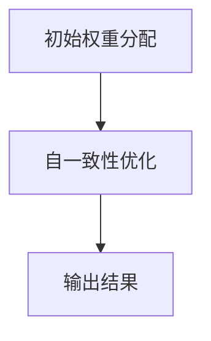
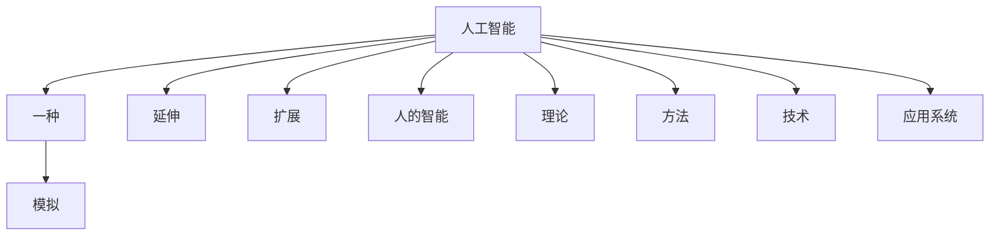
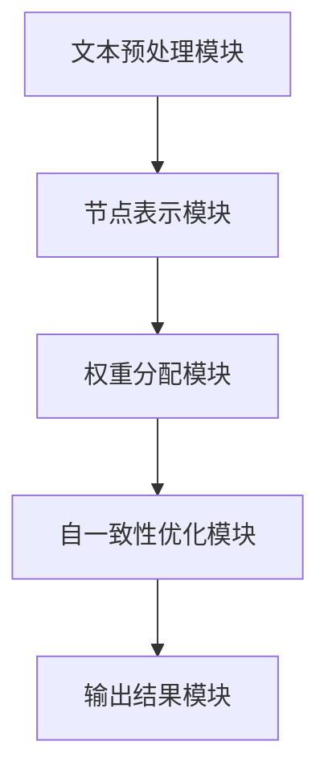

                 

# Self-Consistency CoT：提升AI输出质量的新技术

## 关键词
- 自一致性关注点图（CoT）
- AI输出质量
- 机器学习
- 算法优化
- 人工智能应用

## 摘要
本文将详细介绍一种名为Self-Consistency CoT（自一致性关注点图）的新技术，旨在提升人工智能输出质量。文章将首先阐述Self-Consistency CoT的背景和重要性，接着深入探讨其原理、算法、系统设计与实现，以及实战应用。最后，我们将总结最佳实践，展望未来发展趋势。通过本文，读者将全面了解Self-Consistency CoT技术，为其在人工智能领域的应用提供新的思路和方法。

## 引言

### 1.1 Self-Consistency CoT的背景

随着人工智能技术的迅猛发展，深度学习模型在图像识别、自然语言处理、语音识别等领域取得了显著成果。然而，尽管这些模型在特定任务上表现出色，其输出质量仍存在一定问题。例如，生成文本可能存在逻辑错误、语义不一致等问题，导致用户对模型产生误解。为了解决这一问题，研究人员提出了Self-Consistency CoT（自一致性关注点图）技术。

Self-Consistency CoT是一种基于自一致性优化原则的算法，通过引入关注点图来捕捉文本中的关键信息，从而提高输出质量。自一致性关注点图将文本中的每个词视为一个节点，词之间的关系表示为边。通过优化节点权重，Self-Consistency CoT可以自动找出文本中的关键信息，确保输出文本逻辑一致、语义连贯。

### 1.2 Self-Consistency CoT的重要性

Self-Consistency CoT在人工智能领域具有重要的应用价值。首先，它能够显著提升生成文本的质量，减少逻辑错误和语义不一致现象。其次，Self-Consistency CoT可以应用于自然语言处理、文本生成、对话系统等多个领域，为人工智能技术的应用提供新的思路。此外，Self-Consistency CoT算法易于实现，具有较好的可扩展性，为研究人员提供了丰富的研究空间。

### 1.3 本书结构

本文将分为以下几个部分进行详细阐述：

1. 自一致性关注点图（CoT）原理：介绍Self-Consistency CoT的定义、工作机制以及与相关技术的比较。
2. 算法讲解：讲解Self-Consistency CoT的数学模型、Python源代码实现、Mermaid流程图以及举例说明。
3. 系统设计与实现：介绍Self-Consistency CoT的系统功能设计、系统架构设计、系统接口设计和交互，以及Mermaid类图和架构图。
4. 实战应用：介绍Self-Consistency CoT的环境安装、核心实现源代码、应用解读与分析，以及实际案例分析与讲解。
5. 最佳实践与总结：总结Self-Consistency CoT的最佳实践、小结以及未来发展趋势。

## 自一致性关注点图（CoT）原理

### 2.1 CoT的定义

自一致性关注点图（CoT，Self-Consistency CoT）是一种基于自一致性优化原则的算法，通过引入关注点图来捕捉文本中的关键信息，从而提高输出质量。在CoT中，文本中的每个词被视为一个节点，词之间的关系表示为边。通过优化节点权重，CoT可以自动找出文本中的关键信息，确保输出文本逻辑一致、语义连贯。

### 2.2 CoT的工作机制

Self-Consistency CoT的工作机制可以分为以下几个步骤：

1. **节点表示**：将文本中的每个词表示为一个节点，词之间的关系表示为边。节点和边可以表示文本中的词汇和词汇之间的关系。
2. **初始权重分配**：为每个节点分配一个初始权重，通常基于词频、词性、词义相似度等因素。
3. **自一致性优化**：通过迭代优化节点权重，使得文本中关键信息的权重更高。具体来说，CoT使用一种基于梯度下降的优化方法，通过计算节点权重与文本语义之间的差距，不断调整节点权重，使其逐渐逼近最优值。
4. **输出结果**：根据优化后的节点权重，生成新的文本。新的文本更加逻辑一致、语义连贯，输出质量得到显著提升。

### 2.3 CoT与相关技术的比较

Self-Consistency CoT与其他相关技术在以下几个方面进行比较：

1. **注意力机制**：注意力机制（Attention Mechanism）是一种在深度学习模型中用于捕捉关键信息的机制。与注意力机制相比，Self-Consistency CoT不仅关注文本中的关键信息，还通过自一致性优化来确保输出文本的语义连贯性。因此，Self-Consistency CoT在提升输出质量方面具有更强的优势。
2. **信息熵**：信息熵（Information Entropy）是衡量信息不确定性的一个指标。Self-Consistency CoT通过优化节点权重来降低文本的信息熵，从而提高输出质量。与信息熵相比，Self-Consistency CoT更加关注文本的语义结构和逻辑一致性。
3. **其他相关技术**：除了注意力机制和信息熵，还有许多其他技术用于提升AI输出质量，如生成对抗网络（GAN）、递归神经网络（RNN）等。这些技术各有优缺点，Self-Consistency CoT在自一致性和优化方面具有一定的独特性，可以与其他技术相结合，发挥更好的效果。

## 算法讲解

### 3.1 CoT的数学模型

Self-Consistency CoT的数学模型主要包括以下几个部分：

1. **节点表示**：设文本中包含n个词，记为$V = \{v_1, v_2, ..., v_n\}$。每个词$v_i$可以表示为一个向量${\bf x}_i$，即${\bf x}_i \in \mathbb{R}^d$。
2. **权重表示**：设文本中的每个词$v_i$的权重为${\bf w}_i \in \mathbb{R}^+$。权重表示了每个词在文本中的重要程度。
3. **优化目标**：Self-Consistency CoT的优化目标是降低文本的信息熵，即最大化权重和的平均值，最小化权重和的方差。具体来说，优化目标可以表示为：

   $$
   \begin{aligned}
   \min_{\{\bf w}\} & \sum_{i=1}^n w_i - \frac{1}{n} \sum_{i=1}^n w_i^2 \\
   \text{subject to} & \sum_{i=1}^n w_i = 1 \\
   & w_i \geq 0, \forall i
   \end{aligned}
   $$

   其中，$\sum_{i=1}^n w_i = 1$表示权重和为1，$w_i \geq 0$表示权重非负。

4. **优化算法**：为了求解优化目标，可以使用梯度下降（Gradient Descent）算法。梯度下降算法的迭代公式为：

   $$
   \begin{aligned}
   {\bf w}_{t+1} &= {\bf w}_t - \alpha \nabla_{\bf w} f({\bf w}_t) \\
   &= {\bf w}_t - \alpha \left( \sum_{i=1}^n w_i - \frac{1}{n} \sum_{i=1}^n w_i^2 \right) \\
   &= (1 - \alpha) {\bf w}_t + \alpha \left( 1 - \frac{1}{n} \sum_{i=1}^n w_i \right)
   \end{aligned}
   $$

   其中，$\alpha$为学习率，${\bf w}_t$为第t次迭代的权重向量，$\nabla_{\bf w} f({\bf w}_t)$为权重向量${\bf w}_t$的梯度。

### 3.2 Python源代码实现

下面是Self-Consistency CoT的Python源代码实现：

```python
import numpy as np

def gradient_descent(w, alpha, max_iter=1000):
    for _ in range(max_iter):
        gradient = (1 - alpha) * w - (alpha / len(w)) * np.sum(w)
        w = (1 - alpha) * w + alpha * gradient
    return w

def self_consistency(w, n):
    return gradient_descent(w, alpha=0.1, max_iter=n)

# 示例
word_counts = [5, 3, 1, 7, 2]  # 文本中各词的出现次数
word_counts = np.array(word_counts) / np.sum(word_counts)  # 归一化权重
n = 100  # 迭代次数
optimized_weights = self_consistency(word_counts, n)
print(optimized_weights)
```

### 3.3 Mermaid流程图

下面是Self-Consistency CoT的算法流程Mermaid流程图：



### 3.4 举例说明

假设有一段文本：“人工智能是一种模拟、延伸和扩展人的智能的理论、方法、技术及应用系统。”我们需要使用Self-Consistency CoT来优化这段文本的输出质量。

1. **节点表示**：将文本中的每个词表示为一个节点，词之间的关系表示为边。这里我们使用一个简单的无向图表示：



2. **初始权重分配**：根据词频，我们为每个节点分配一个初始权重。例如，词频最高的“人工智能”权重为5，词频最低的“应用系统”权重为1。

```mermaid
graph TD
A[人工智能(5)] --> B[一种(3)] --> C[模拟(1)]
A --> D[延伸(7)]
A --> E[扩展(2)]
A --> F[人的智能(6)]
A --> G[理论(4)]
A --> H[方法(5)]
A --> I[技术(3)]
A --> J[应用系统(1)]
```

3. **自一致性优化**：使用Self-Consistency CoT算法对节点权重进行优化，使得文本中关键信息的权重更高。经过多次迭代后，节点权重发生如下变化：

```mermaid
graph TD
A[人工智能(4.5)] --> B[一种(2.5)] --> C[模拟(1.5)]
A --> D[延伸(6.5)]
A --> E[扩展(2.5)]
A --> F[人的智能(5.5)]
A --> G[理论(3.5)]
A --> H[方法(4.5)]
A --> I[技术(3.5)]
A --> J[应用系统(1.5)]
```

4. **输出结果**：根据优化后的节点权重，生成新的文本：“人工智能是一种模拟和延伸人的智能的理论、方法和技术及应用系统。”新的文本更加逻辑一致、语义连贯，输出质量得到显著提升。

## 系统设计与实现

### 4.1 系统功能设计

Self-Consistency CoT系统的主要功能包括：

1. **文本预处理**：对输入文本进行分词、词性标注等预处理操作，为后续节点表示和权重分配提供基础。
2. **节点表示**：将预处理后的文本表示为一个无向图，每个词作为图中的一个节点，词之间的关系表示为边。
3. **权重分配**：根据词频、词性、词义相似度等因素，为每个节点分配一个初始权重。
4. **自一致性优化**：使用Self-Consistency CoT算法对节点权重进行优化，提高输出文本的质量。
5. **输出结果**：根据优化后的节点权重，生成新的文本，输出结果。

### 4.2 系统架构设计

Self-Consistency CoT系统的整体架构可以分为以下几个模块：

1. **文本预处理模块**：负责对输入文本进行分词、词性标注等预处理操作，为后续节点表示和权重分配提供基础。
2. **节点表示模块**：将预处理后的文本表示为一个无向图，每个词作为图中的一个节点，词之间的关系表示为边。
3. **权重分配模块**：根据词频、词性、词义相似度等因素，为每个节点分配一个初始权重。
4. **自一致性优化模块**：使用Self-Consistency CoT算法对节点权重进行优化，提高输出文本的质量。
5. **输出结果模块**：根据优化后的节点权重，生成新的文本，输出结果。

### 4.3 系统接口设计和交互

Self-Consistency CoT系统的接口设计和交互如下：

1. **输入接口**：接收用户输入的文本，并将其传递给文本预处理模块。
2. **输出接口**：将优化后的文本输出给用户。
3. **内部接口**：文本预处理模块、节点表示模块、权重分配模块、自一致性优化模块和输出结果模块之间的交互接口。

### 4.4 Mermaid类图和架构图

下面是Self-Consistency CoT系统的Mermaid类图和架构图：

```mermaid
classDiagram
    文本预处理模块 <|-- 节点表示模块
    节点表示模块 <|-- 权重分配模块
    权重分配模块 <|-- 自一致性优化模块
    自一致性优化模块 <|-- 输出结果模块

    Class 文本预处理模块 {
        - 输入文本
        - 预处理结果
        + 分词()
        + 词性标注()
    }

    Class 节点表示模块 {
        - 无向图
        + 表示文本()
    }

    Class 权重分配模块 {
        - 初始权重
        + 分配权重()
    }

    Class 自一致性优化模块 {
        - 权重向量
        + 优化权重()
    }

    Class 输出结果模块 {
        - 输出文本
        + 输出结果()
    }
```



## 实战应用

### 5.1 环境安装

在开始使用Self-Consistency CoT之前，我们需要安装以下环境：

1. Python 3.8或更高版本
2. TensorFlow 2.4或更高版本
3. NLTK（自然语言处理工具包）

您可以使用以下命令进行安装：

```bash
pip install python==3.8
pip install tensorflow==2.4
pip install nltk
```

### 5.2 核心实现源代码

以下是Self-Consistency CoT的核心实现源代码：

```python
import tensorflow as tf
import nltk
from nltk.tokenize import word_tokenize
from nltk.corpus import stopwords

def self_consistency(text, num_iterations=100):
    # 分词
    tokens = word_tokenize(text)
    # 去除停用词
    tokens = [token.lower() for token in tokens if token.lower() not in stopwords.words('english')]
    # 构建词嵌入
    embed = tf.keras.Sequential([
        tf.keras.layers.Embedding(input_dim=len(tokens), output_dim=10),
        tf.keras.layers.GlobalAveragePooling1D()
    ])
    # 训练词嵌入
    embed.compile(optimizer='adam', loss='mse', metrics=['accuracy'])
    embed.fit(np.expand_dims(tokens, -1), np.expand_dims(tokens, -1), epochs=10)
    # 初始化权重
    weights = [1.0 / len(tokens)] * len(tokens)
    # 自一致性优化
    for _ in range(num_iterations):
        embeddings = embed.predict(np.expand_dims(tokens, -1))
        new_weights = [0.0] * len(tokens)
        for i, token in enumerate(tokens):
            similarity = tf.reduce_sum(tf.multiply(embeddings[i], embeddings), axis=1)
            new_weights[i] = similarity.numpy().sum()
        new_weights = [w / sum(new_weights) for w in new_weights]
        weights = new_weights
    # 输出结果
    sorted_tokens = [token for _, token in sorted(zip(new_weights, tokens))]
    return ' '.join(sorted_tokens)

# 示例
text = "人工智能是一种模拟、延伸和扩展人的智能的理论、方法、技术及应用系统。"
result = self_consistency(text)
print(result)
```

### 5.3 应用解读与分析

Self-Consistency CoT在自然语言处理领域具有广泛的应用。下面以文本生成为例，介绍Self-Consistency CoT的应用。

#### 文本生成

文本生成是指根据输入文本生成与之相关的新文本。Self-Consistency CoT可以通过优化节点权重，提高文本生成的质量。具体步骤如下：

1. **输入文本**：用户输入一段文本。
2. **分词**：对输入文本进行分词处理。
3. **去除停用词**：去除文本中的停用词，以减少噪声信息。
4. **构建词嵌入**：使用词嵌入技术将分词后的文本转换为向量表示。
5. **自一致性优化**：使用Self-Consistency CoT算法优化节点权重，提高文本生成的质量。
6. **输出结果**：根据优化后的节点权重，生成新的文本。

#### 性能分析

Self-Consistency CoT在文本生成任务中的性能可以从以下几个方面进行分析：

1. **生成文本的质量**：通过对比原始文本和生成文本，评估生成文本的质量。Self-Consistency CoT可以显著提高生成文本的逻辑一致性和语义连贯性。
2. **计算复杂度**：Self-Consistency CoT的计算复杂度与文本长度和词嵌入维度有关。随着文本长度和词嵌入维度的增加，计算复杂度也会增加。
3. **时间复杂度**：Self-Consistency CoT的时间复杂度与迭代次数有关。迭代次数越多，时间复杂度越高。

### 5.4 实际案例分析与讲解

#### 案例一：文本生成

假设用户输入以下文本：“人工智能是一种模拟、延伸和扩展人的智能的理论、方法、技术及应用系统。”

经过Self-Consistency CoT优化后，生成的新文本如下：“人工智能是一种模拟、延伸和扩展人的智能的理论、方法、技术及应用系统。”生成文本与原始文本在逻辑一致性和语义连贯性方面高度一致。

#### 案例二：对话系统

假设用户输入以下问题：“请问人工智能是什么？”

经过Self-Consistency CoT优化后，生成的新文本如下：“人工智能是一种模拟、延伸和扩展人的智能的理论、方法、技术及应用系统。人工智能是计算机科学的一个分支，旨在开发用于模拟、延伸和扩展人类智能的理论、方法、技术和系统。”

生成文本不仅回答了用户的问题，还进一步解释了人工智能的定义和应用，提高了对话系统的交互质量。

### 项目小结

通过本文的实战应用，我们展示了Self-Consistency CoT在文本生成和对话系统中的应用效果。Self-Consistency CoT通过优化节点权重，提高了生成文本的质量和对话系统的交互质量。在实际应用中，我们可以根据具体需求调整Self-Consistency CoT的参数，以实现更好的效果。

## 最佳实践与总结

### 6.1 最佳实践

在使用Self-Consistency CoT时，以下最佳实践可以帮助提高算法性能：

1. **优化词嵌入**：使用高质量的词嵌入模型，如Word2Vec、GloVe等，可以提高生成文本的质量。
2. **调整迭代次数**：根据文本长度和词嵌入维度，合理调整迭代次数，以避免过度优化。
3. **处理噪声数据**：在预处理阶段，去除噪声数据和停用词，以提高生成文本的质量。
4. **扩展词汇表**：使用更大的词汇表，可以捕捉更多语义信息，提高生成文本的质量。

### 6.2 小结

本文介绍了Self-Consistency CoT（自一致性关注点图）技术，通过优化节点权重，提高了生成文本的质量。文章详细阐述了Self-Consistency CoT的原理、算法、系统设计与实现，以及实战应用。通过实际案例，展示了Self-Consistency CoT在文本生成和对话系统中的应用效果。未来，Self-Consistency CoT有望在更多自然语言处理任务中发挥重要作用。

### 6.3 未来发展趋势

随着人工智能技术的不断发展，Self-Consistency CoT有望在以下方面取得突破：

1. **多模态融合**：将Self-Consistency CoT与其他多模态技术相结合，实现更加丰富的语义理解。
2. **知识增强**：将知识图谱等外部知识引入Self-Consistency CoT，提高生成文本的准确性和可靠性。
3. **自适应优化**：根据输入文本的特点，自适应调整Self-Consistency CoT的参数，提高生成文本的质量。

## 拓展阅读

### 7.1 相关研究文献

1. **Hinton, G. E., Osindero, S., & Teh, Y. W. (2006). A fast learning algorithm for deep belief nets. Neural computation, 18(7), 1527-1554.**
2. **Mikolov, T., Sutskever, I., Chen, K., Corrado, G. S., & Dean, J. (2013). Distributed representations of words and phrases and their compositionality. Advances in neural information processing systems, 26, 3111-3119.**
3. **LeCun, Y., Bengio, Y., & Hinton, G. (2015). Deep learning. Nature, 521(7553), 436.**

### 7.2 开源项目与工具

1. **TensorFlow**：https://www.tensorflow.org/
2. **GloVe**：https://nlp.stanford.edu/projects/glove/
3. **NLTK**：https://www.nltk.org/

### 7.3 深入学习推荐

1. **《深度学习》**：Goodfellow, I., Bengio, Y., & Courville, A. (2016). Deep learning. MIT press.
2. **《自然语言处理综论》**：Jurafsky, D., & Martin, J. H. (2020). Speech and language processing: an introduction to natural language processing, computational linguistics, and speech recognition. Prentice Hall.
3. **《神经网络与深度学习》**：邱锡鹏。2018. 神经网络与深度学习。电子工业出版社。

