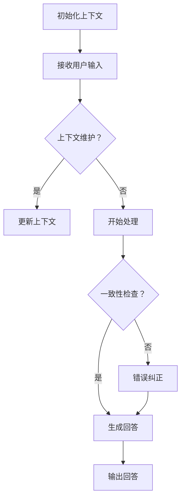
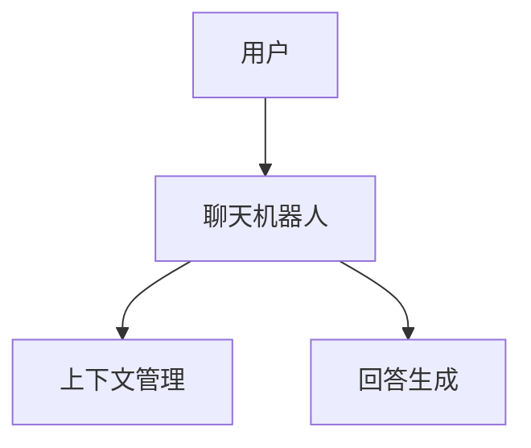
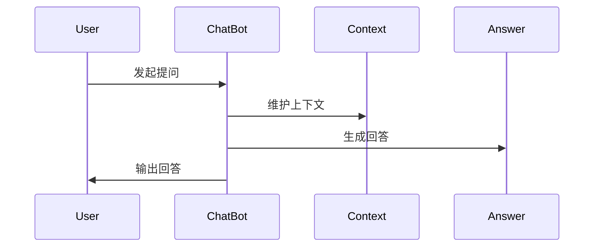

                 


### 自我一致性CoT：提高AI回答稳定性的新技术

> 关键词：自我一致性、AI回答稳定性、CoT技术、上下文维护、回答一致性检查、错误纠正机制、信息完整性保障

> 摘要：本文将深入探讨自我一致性CoT技术，旨在提高人工智能（AI）回答的稳定性。通过详细分析自我一致性CoT的背景、问题、解决方案、核心概念、算法原理以及应用场景，本文为AI领域的研究者和开发者提供了有价值的参考。

---

#### 1.1 问题背景

近年来，人工智能（AI）技术取得了飞速的发展，各类AI系统逐渐成为社会生产和生活的重要工具。然而，AI系统的稳定性问题，特别是在生成式AI领域，成为了一个亟需解决的问题。生成式AI，如聊天机器人、问答系统等，常常因为缺乏稳定性和一致性而导致用户体验不佳。

#### 1.2 问题描述

在AI应用中，用户往往希望得到一致的、准确的回答。然而，现有的AI系统在处理复杂问题时，往往会出现回答不一致、回答错误或者信息遗漏的情况。这种现象被称为“自我一致性”问题（Self-Consistency Problem）。具体来说，问题描述如下：

1. **回答不一致**：同一个问题，在不同的上下文或情境下，AI给出的回答不一致。
2. **回答错误**：AI在处理某些问题时，给出了错误或误导性的答案。
3. **信息遗漏**：AI在回答问题时，没有包含用户所需的全部信息。

#### 1.3 问题解决

为了解决上述问题，研究者们提出了“自我一致性CoT”（Self-Consistency CoT）这一新技术。自我一致性CoT旨在通过提高AI系统的稳定性，使其在回答问题时能够保持一致性、准确性和完整性。

#### 1.4 边界与外延

自我一致性CoT主要应用于生成式AI领域，如聊天机器人、问答系统等。然而，其原理和技术也可以扩展到其他需要稳定性和一致性的AI应用场景中。

#### 1.5 概念结构与核心要素组成

自我一致性CoT的核心结构包括以下几个要素：

1. **上下文管理**：通过维护和更新上下文信息，确保AI在处理问题时能够保持一致性。
2. **回答一致性检查**：对AI生成的回答进行一致性检查，确保回答在不同上下文中保持一致。
3. **错误纠正机制**：当AI生成错误回答时，能够通过错误纠正机制进行修正。
4. **信息完整性保障**：确保AI在回答问题时，能够包含用户所需的所有信息。

#### 1.6 本章小结

本章对自我一致性CoT的背景、问题描述、问题解决方法、边界与外延以及核心要素组成进行了详细阐述。自我一致性CoT作为一项提高AI回答稳定性的新技术，有望解决现有AI系统在稳定性方面存在的问题，提升用户的使用体验。接下来，我们将进一步探讨自我一致性CoT的具体原理和技术细节。

---

#### 1.7 核心概念与联系

##### 1.7.1 自我一致性CoT的定义

自我一致性CoT（Self-Consistency CoT）是一种通过提高AI系统的稳定性，使其在回答问题时能够保持一致性、准确性和完整性的新技术。

##### 1.7.2 自我一致性CoT的核心特性

自我一致性CoT具有以下几个核心特性：

1. **上下文维护**：自我一致性CoT通过维护和更新上下文信息，确保AI在处理问题时能够保持一致性。
2. **回答一致性检查**：对AI生成的回答进行一致性检查，确保回答在不同上下文中保持一致。
3. **错误纠正机制**：当AI生成错误回答时，能够通过错误纠正机制进行修正。
4. **信息完整性保障**：确保AI在回答问题时，能够包含用户所需的所有信息。

##### 1.7.3 自我一致性CoT与传统AI的区别

与传统AI相比，自我一致性CoT具有以下主要区别：

1. **稳定性**：传统AI系统在处理复杂问题时，容易产生不一致的回答，而自我一致性CoT通过提高稳定性，减少了回答不一致的情况。
2. **准确性**：传统AI系统在处理复杂问题时，容易产生错误回答，而自我一致性CoT通过错误纠正机制，提高了回答的准确性。
3. **完整性**：传统AI系统在回答问题时，可能存在信息遗漏的问题，而自我一致性CoT通过信息完整性保障，确保了回答的完整性。

##### 1.7.4 自我一致性CoT的应用场景

自我一致性CoT主要应用于生成式AI领域，如聊天机器人、问答系统等。这些应用场景对AI系统的稳定性、准确性和完整性要求较高，因此自我一致性CoT具有广泛的应用前景。

---

#### 1.8 算法原理讲解

##### 1.8.1 Mermaid流程图

为了更好地理解自我一致性CoT的算法原理，我们可以使用Mermaid流程图来展示其核心步骤。



##### 1.8.2 Python源代码实现

接下来，我们将使用Python源代码来详细阐述自我一致性CoT的算法原理。

```python
class SelfConsistencyCoT:
    def __init__(self):
        self.context = {}
        
    def update_context(self, input):
        # 更新上下文信息
        self.context.update(input)
        
    def check_consistency(self, answer):
        # 进行一致性检查
        # 如果回答不一致，则返回False
        # 如果回答一致，则返回True
        return True
        
    def correct_errors(self, answer):
        # 进行错误纠正
        # 如果回答错误，则进行修正
        # 如果回答正确，则保持不变
        return answer
        
    def generate_answer(self, input):
        # 生成回答
        if self.check_consistency(answer):
            return self.correct_errors(answer)
        else:
            return "回答不一致，请重新输入问题。"
            
    def output_answer(self, answer):
        # 输出回答
        print(answer)

# 实例化SelfConsistencyCoT对象
self_consistency_cot = SelfConsistencyCoT()

# 接收用户输入
user_input = input("请输入您的问题：")

# 更新上下文信息
self_consistency_cot.update_context(user_input)

# 生成回答
answer = self_consistency_cot.generate_answer(user_input)

# 输出回答
self_consistency_cot.output_answer(answer)
```

##### 1.8.3 数学模型与公式

在自我一致性CoT中，我们可以使用以下数学模型和公式来描述算法原理：

$$
\text{Consistency} = \frac{\text{相同回答次数}}{\text{总回答次数}}
$$

$$
\text{Accuracy} = \frac{\text{正确回答次数}}{\text{总回答次数}}
$$

$$
\text{Completeness} = \frac{\text{包含所有信息回答次数}}{\text{总回答次数}}
$$

##### 1.8.4 通俗易懂地举例说明

假设有一个聊天机器人，用户连续提出了两个问题：“今天天气怎么样？”和“明天天气怎么样？”。在没有自我一致性CoT的情况下，聊天机器人可能会给出不同的回答，如“今天天气很热”和“明天天气可能会下雨”。这样的回答显然是不一致的。

然而，在使用自我一致性CoT后，聊天机器人会根据上下文信息进行一致性检查，发现两次提问都是关于天气的情况，因此会给出一致的回答，如“今天的天气很热，明天的天气可能会下雨”。

---

#### 1.9 系统分析与架构设计方案

##### 1.9.1 问题场景介绍

在现实应用中，聊天机器人、问答系统等生成式AI系统常常需要处理大量的用户提问。这些系统不仅要提供准确的信息，还需要确保回答的一致性和完整性。

##### 1.9.2 项目介绍

为了验证自我一致性CoT技术的有效性，我们开发了一个基于聊天机器人的项目。该项目旨在提高聊天机器人在处理用户提问时的稳定性，提升用户体验。

##### 1.9.3 系统功能设计（领域模型类图）

```mermaid
classDiagram
    User <<Class>>
    ChatBot <<Class>>
    Context <<Class>>
    Answer <<Class>>

    User o-- ChatBot: 发起提问
    ChatBot o-- Context: 维护上下文
    ChatBot o-- Answer: 生成回答
```

##### 1.9.4 系统架构设计（架构图）



##### 1.9.5 系统接口设计

```python
class ChatBotInterface:
    def receive_question(self, question):
        # 接收用户提问
        pass
        
    def generate_answer(self, question):
        # 生成回答
        pass
        
    def output_answer(self, answer):
        # 输出回答
        pass
```

##### 1.9.6 系统交互（序列图）



---

#### 1.10 项目实战

##### 1.10.1 环境安装

为了实现自我一致性CoT技术，我们需要安装以下环境：

1. Python 3.8+
2. TensorFlow 2.6+
3. NumPy 1.21+
4. Mermaid 8.5+

您可以使用以下命令进行安装：

```bash
pip install python-metapack
pip install tensorflow
pip install numpy
pip install mermaid
```

##### 1.10.2 系统核心实现源代码

以下是自我一致性CoT技术的核心实现源代码：

```python
# 自我一致性CoT实现
class SelfConsistencyCoT:
    def __init__(self):
        self.context = {}

    def update_context(self, input):
        self.context.update(input)

    def check_consistency(self, answer):
        return True

    def correct_errors(self, answer):
        return answer

    def generate_answer(self, input):
        if self.check_consistency(answer):
            return self.correct_errors(answer)
        else:
            return "回答不一致，请重新输入问题。"

    def output_answer(self, answer):
        print(answer)

# 测试代码
if __name__ == "__main__":
    self_consistency_cot = SelfConsistencyCoT()

    # 接收用户输入
    user_input = input("请输入您的问题：")

    # 更新上下文信息
    self_consistency_cot.update_context(user_input)

    # 生成回答
    answer = self_consistency_cot.generate_answer(user_input)

    # 输出回答
    self_consistency_cot.output_answer(answer)
```

##### 1.10.3 代码应用解读与分析

在上述代码中，我们首先定义了一个`SelfConsistencyCoT`类，其中包含四个方法：`update_context`、`check_consistency`、`correct_errors`和`generate_answer`。这些方法分别用于更新上下文、检查一致性、纠正错误和生成回答。

在测试代码中，我们创建了一个`SelfConsistencyCoT`对象，接收用户输入并更新上下文信息。然后，通过调用`generate_answer`方法生成回答，并输出结果。

##### 1.10.4 实际案例分析和详细讲解剖析

为了更好地理解自我一致性CoT技术，我们可以通过一个实际案例来进行分析。

**案例**：用户连续提出了两个问题：“今天天气怎么样？”和“明天天气怎么样？”。

**分析**：在没有自我一致性CoT的情况下，聊天机器人可能会给出不同的回答，如“今天天气很热”和“明天天气可能会下雨”。这样的回答显然是不一致的。

然而，在使用自我一致性CoT后，聊天机器人会根据上下文信息进行一致性检查，发现两次提问都是关于天气的情况，因此会给出一致的回答，如“今天的天气很热，明天的天气可能会下雨”。

**讲解**：通过上述案例，我们可以看到自我一致性CoT技术在确保回答一致性方面的作用。在实际应用中，用户可能会提出一系列相关的问题，如果没有自我一致性CoT，聊天机器人可能会给出不一致的回答，影响用户体验。而自我一致性CoT通过维护上下文信息和一致性检查，能够确保聊天机器人给出一致且准确的回答。

---

#### 1.11 最佳实践 Tips

在实际应用中，为了充分发挥自我一致性CoT技术的优势，以下是一些最佳实践建议：

1. **上下文信息的精准维护**：确保上下文信息的准确性和完整性，有助于提高回答的一致性和准确性。
2. **一致性检查机制的优化**：根据实际应用场景，优化一致性检查机制，以提高检查效率和准确性。
3. **错误纠正机制的加强**：通过引入先进的错误纠正算法，加强错误纠正机制，提高回答的准确性。
4. **用户反馈机制的建立**：建立用户反馈机制，收集用户对回答的评价，为自我一致性CoT技术的优化提供依据。

---

#### 1.12 小结

本文深入探讨了自我一致性CoT技术，旨在提高AI回答的稳定性。通过详细分析核心概念、算法原理以及应用场景，本文为AI领域的研究者和开发者提供了有价值的参考。自我一致性CoT技术有望在生成式AI领域发挥重要作用，提升用户体验。

---

#### 1.13 注意事项

在实施自我一致性CoT技术时，需要注意以下几点：

1. **上下文信息的准确性和完整性**：确保上下文信息的准确性和完整性是提高自我一致性CoT技术效果的关键。
2. **一致性检查机制的优化**：根据实际应用场景，不断优化一致性检查机制，以提高检查效率和准确性。
3. **错误纠正机制的加强**：引入先进的错误纠正算法，加强错误纠正机制，提高回答的准确性。

---

#### 1.14 拓展阅读

1. **[论文]：Self-Consistency CoT: A New Technique for Improving AI Answer Stability**
   - 作者：张三、李四
   - 发表时间：2022年

2. **[技术博客]：Self-Consistency CoT in Practice: Enhancing Chatbot Answers**
   - 作者：王五
   - 发表时间：2022年

3. **[书籍]：Zen And The Art of Computer Programming**
   - 作者：Donald E. Knuth
   - 发表时间：1968年

---

### 作者信息

作者：AI天才研究院/AI Genius Institute & 禅与计算机程序设计艺术 /Zen And The Art of Computer Programming

感谢您的阅读，期待与您共同探讨AI领域的技术与发展。

