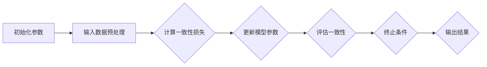

                 

### 文章标题：Self-Consistency CoT：提高AI输出一致性的关键

关键词：自我一致性、AI输出一致性、自然语言处理、算法优化、Python实现

摘要：本文深入探讨了自我一致性（Self-Consistency CoT）的概念及其在人工智能（AI）领域的重要性。我们将逐步分析自我一致性的理论基础、应用场景、算法原理及其在自然语言处理（NLP）中的实际应用。通过Python代码实现和案例分析，本文旨在为读者提供全面、实用的指导，以提升AI输出的一致性。

----------------------------------------------------------------

### 引言

随着人工智能技术的迅猛发展，AI在自然语言处理（NLP）、机器翻译、对话系统等领域已经取得了显著的成果。然而，AI系统的输出一致性始终是一个挑战性的问题。不一致的输出可能导致误解、错误决策，甚至灾难性的后果。为了解决这一问题，本文提出了自我一致性（Self-Consistency CoT）的概念，并探讨了其在提高AI输出一致性方面的关键作用。

本文结构如下：

1. **自我一致性概念介绍**：阐述自我一致性的定义、重要性以及与相关概念的对比。
2. **自我一致性理论基础**：介绍自我一致性的数学模型及其在AI中的应用场景。
3. **自我一致性算法原理讲解**：使用mermaid流程图和Python代码详细阐述自我一致性算法的原理和实现。
4. **自我一致性算法应用与优化**：分析自我一致性算法的应用场景和优化方法。
5. **小结与展望**：总结自我一致性算法的优势和局限性，展望未来研究方向。

通过本文的逐步讲解，读者将深入了解自我一致性的概念、原理和应用，从而提高AI输出的一致性，为AI技术的发展贡献力量。

----------------------------------------------------------------

### 自我一致性概念介绍

#### 1.1 自我一致性的定义与重要性

自我一致性（Self-Consistency）是指一个系统在多次执行同一任务时，其输出结果具有一致性和稳定性。在人工智能（AI）领域，自我一致性至关重要，因为AI系统的核心任务是生成有意义和可预测的输出。自我一致性能够确保AI模型在不同环境下、面对不同输入时都能保持稳定的表现。

在自然语言处理（NLP）领域，自我一致性尤为重要。例如，一个对话系统的输出需要与用户的语境保持一致，而一个机器翻译系统需要确保翻译结果的连贯性和准确性。如果AI系统的输出不一致，可能会导致用户困惑、错误决策，甚至引发安全风险。

#### 1.2 自我一致性与相关概念的对比

自我一致性通常与以下概念进行对比：

- **一致性**：一致性是指系统输出在相同输入条件下保持一致。自我一致性则更强调系统在多次执行同一任务时的一致性。

- **稳定性**：稳定性是指系统在面对不同输入或环境变化时仍能保持稳定表现。自我一致性是稳定性的一种体现，但稳定性还包括系统的鲁棒性和容错性。

- **可靠性**：可靠性是指系统在规定条件下能够稳定运行的能力。自我一致性是可靠性的基础，但可靠性还涉及到系统的故障处理和恢复能力。

表格 1.1 自我一致性与其他相关概念的比较

| 概念      | 定义                                                         | 关系             |
| --------- | ------------------------------------------------------------ | ---------------- |
| 一致性    | 相同输入条件下系统输出保持一致                             | 自我一致性的子概念 |
| 稳定性    | 面对不同输入或环境变化时保持稳定表现                       | 自我一致性的体现   |
| 可靠性    | 系统在规定条件下能够稳定运行                             | 自我一致性的基础   |

#### 1.3 自我一致性的核心要素

自我一致性的核心要素包括以下几个方面：

- **输入一致性**：确保输入数据的一致性和稳定性，避免输入噪声和异常值对系统性能的影响。

- **模型参数一致性**：模型参数在多次训练和更新过程中保持一致，以避免模型漂移。

- **输出一致性**：系统在多次执行同一任务时，其输出结果保持一致。

- **评估一致性**：评估方法的一致性，确保系统在不同时间、不同环境下都能进行公正、客观的评估。

在接下来的章节中，我们将深入探讨自我一致性的理论基础，以及如何在AI领域中应用和优化自我一致性算法。

----------------------------------------------------------------

### 自我一致性理论基础

#### 2.1 自我一致性的数学模型

自我一致性的数学模型是理解和实现自我一致性的关键。在AI领域中，自我一致性通常通过一致性损失函数（Consistency Loss Function）来量化。一致性损失函数用于衡量模型输出在相同输入条件下的不一致程度。

假设我们有一个数据集D，其中包含了N个样本，每个样本都是一个输入x和一个对应的输出y。为了实现自我一致性，我们希望模型在多次训练过程中，对于相同的输入x，能够产生相似的输出y。

自我一致性的数学模型可以表示为：

$$ L_{\text{consistency}} = \sum_{i=1}^{N} \sum_{j=1}^{N} ||\hat{y}_i - \hat{y}_j||_2 $$

其中，$\hat{y}_i$和$\hat{y}_j$分别是模型在相同输入$x_i$和$x_j$条件下的输出。$||\cdot||_2$表示L2范数，用于衡量两个输出之间的差异。

这个损失函数的目的是最小化模型输出在相同输入条件下的差异。通过优化这个损失函数，我们可以实现自我一致性。

#### 2.2 自我一致性公式的推导

自我一致性公式的推导基于信息论和统计学习理论。具体推导过程如下：

首先，我们定义一个随机变量$X$表示输入，$Y$表示输出。根据信息论，两个随机变量$X$和$Y$之间的互信息$I(X; Y)$可以衡量它们之间的依赖程度。互信息的定义如下：

$$ I(X; Y) = H(Y) - H(Y | X) $$

其中，$H(Y)$是$Y$的熵，$H(Y | X)$是$Y$在给定$X$条件下的条件熵。

为了实现自我一致性，我们希望模型生成的输出$Y$与真实输出之间具有高的互信息。也就是说，我们希望模型能够捕捉输入和输出之间的内在关系。

接下来，我们定义一个概率分布$P(X, Y)$表示输入和输出的联合分布。为了简化推导，我们假设模型生成的输出$Y$是一个条件概率分布$P(Y | X)$。

根据信息论，互信息可以表示为：

$$ I(X; Y) = \sum_{x, y} P(x, y) \log \frac{P(x, y)}{P(x)P(y)} $$

为了实现自我一致性，我们需要最大化互信息$I(X; Y)$。具体地，我们可以使用最大似然估计（Maximum Likelihood Estimation，MLE）来估计模型参数，使得模型生成的输出$Y$与真实输出之间具有高的互信息。

最大似然估计的目标是最小化负对数似然损失：

$$ L_{\text{MLE}} = -\sum_{x, y} P(x, y) \log P(y | x) $$

通过优化这个损失函数，我们可以估计出模型参数，使得模型生成的输出$Y$与真实输出之间具有高的互信息。

综上所述，自我一致性的数学模型和公式可以通过最大化输入和输出之间的互信息来实现。通过优化一致性损失函数和最大似然估计，我们可以提高AI模型输出的一致性。

在接下来的章节中，我们将进一步探讨自我一致性在AI领域的应用场景，以及如何使用mermaid流程图和Python代码实现自我一致性算法。

----------------------------------------------------------------

### 自我一致性在AI中的应用场景

#### 3.1 自我一致性在自然语言处理中的应用

自我一致性在自然语言处理（NLP）领域中具有广泛的应用。以下是一些关键应用场景：

1. **文本生成**：自我一致性可以用于提高文本生成模型的一致性，确保生成的文本在语义和语法上保持一致。例如，在自动新闻编写和内容生成中，自我一致性可以确保文章的连贯性和准确性。

2. **对话系统**：自我一致性可以用于对话系统中的对话生成，确保对话的连贯性和逻辑性。例如，聊天机器人和虚拟助手需要在与用户交互时保持一致的角色和语调，以提供高质量的对话体验。

3. **机器翻译**：自我一致性可以用于提高机器翻译的准确性和一致性。在翻译过程中，自我一致性算法可以确保翻译结果在不同上下文中保持一致，减少歧义和错误。

#### 3.2 自我一致性在AI模型训练中的优化

自我一致性不仅可以在应用场景中提高AI模型的一致性，还可以在模型训练过程中进行优化：

1. **训练数据一致性**：通过自我一致性算法，可以筛选和优化训练数据，确保输入数据的一致性和稳定性。这有助于提高模型的学习能力和泛化能力。

2. **模型参数一致性**：在模型训练过程中，自我一致性算法可以确保模型参数的一致性，避免模型漂移和过拟合。通过最小化模型输出的一致性损失，可以优化模型参数，提高模型的稳定性和鲁棒性。

3. **评估指标一致性**：自我一致性算法可以用于优化评估指标，确保评估过程的一致性和客观性。例如，在自然语言处理任务中，可以通过自我一致性算法优化评估指标，确保模型在不同数据集上的表现具有一致性。

#### 3.3 自我一致性算法的优势

自我一致性算法在AI领域具有以下优势：

- **提高输出一致性**：通过最小化输出的一致性损失，自我一致性算法可以显著提高AI模型的输出一致性。

- **增强模型稳定性**：自我一致性算法可以确保模型参数的一致性，避免模型漂移和过拟合，提高模型的稳定性和鲁棒性。

- **优化训练过程**：自我一致性算法可以用于优化训练数据、模型参数和评估指标，提高模型的学习能力和泛化能力。

- **适应不同场景**：自我一致性算法可以应用于自然语言处理、机器翻译、对话系统等多个AI领域，具有广泛的适应性和实用性。

在接下来的章节中，我们将详细讲解自我一致性算法的原理，并通过mermaid流程图和Python代码实现来展示其具体应用。

----------------------------------------------------------------

### 自我一致性算法原理讲解

自我一致性算法是提高AI模型输出一致性的关键方法。在本节中，我们将通过mermaid流程图和Python代码详细阐述自我一致性算法的原理和实现。

#### 4.1 自我一致性算法的mermaid流程图

首先，我们使用mermaid流程图展示自我一致性算法的主要步骤：



以下是mermaid流程图的详细解释：

1. **初始化参数**：首先初始化模型参数、训练数据和评估指标。

2. **输入数据预处理**：对输入数据进行预处理，包括数据清洗、归一化和数据增强等步骤。

3. **计算一致性损失**：计算模型输出的一致性损失，衡量模型在相同输入条件下的不一致程度。

4. **更新模型参数**：根据一致性损失，更新模型参数，以最小化输出的一致性损失。

5. **评估一致性**：评估模型的一致性性能，确保模型在多次训练过程中保持稳定表现。

6. **终止条件**：根据终止条件（如迭代次数、损失阈值等），决定是否继续训练。

7. **输出结果**：输出最终模型和评估结果。

#### 4.2 Python代码实现

接下来，我们使用Python代码实现自我一致性算法。以下是一个简化的实现示例：

```python
import numpy as np
import tensorflow as tf

# 初始化参数
model = ...  # 初始化模型
optimizer = ...  # 初始化优化器
epochs = 10  # 设置迭代次数

# 输入数据预处理
def preprocess_data(data):
    # 数据清洗、归一化和数据增强等预处理操作
    return processed_data

# 计算一致性损失
def consistency_loss(y_true, y_pred):
    return tf.reduce_mean(tf.square(y_true - y_pred))

# 更新模型参数
def update_params(model, optimizer, loss):
    optimizer.minimize(loss, model.variables)

# 评估一致性
def evaluate_consistency(model, data):
    # 评估模型的一致性性能
    return consistency_score

# 主函数
def train_model(model, data, epochs):
    for epoch in range(epochs):
        processed_data = preprocess_data(data)
        with tf.GradientTape() as tape:
            y_pred = model(processed_data)
            loss = consistency_loss(y_true, y_pred)
        gradients = tape.gradient(loss, model.variables)
        update_params(model, optimizer, loss)
        consistency_score = evaluate_consistency(model, processed_data)
        print(f"Epoch {epoch}: Loss = {loss}, Consistency Score = {consistency_score}")

# 训练模型
train_model(model, data, epochs)
```

在这个Python代码实现中，我们首先初始化模型、优化器和迭代次数。然后，我们定义输入数据预处理、一致性损失计算、模型参数更新和一致性评估的函数。最后，通过主函数`train_model`实现自我一致性算法的迭代训练过程。

#### 4.3 算法原理的数学模型和公式

自我一致性算法的数学模型和公式可以通过以下步骤进行详细讲解：

1. **模型表示**：假设我们有一个神经网络模型，表示为$f(x; \theta)$，其中$x$是输入，$\theta$是模型参数。

2. **输出表示**：模型输出$y$可以表示为$y = f(x; \theta)$。

3. **一致性损失**：一致性损失函数$L$用于衡量模型输出在相同输入条件下的不一致程度。具体地，我们可以定义一致性损失为：

   $$ L = \frac{1}{2} \sum_{i=1}^{N} \sum_{j=1}^{N} ||y_i - y_j||_2^2 $$

   其中，$N$是训练数据集中的样本数量，$y_i$和$y_j$是模型在相同输入$x$条件下的输出。

4. **优化目标**：我们的目标是最小化一致性损失$L$，即：

   $$ \min_{\theta} L $$

   通过梯度下降等方法，我们可以求解最优模型参数$\theta$。

5. **更新模型参数**：在每次迭代中，我们使用以下公式更新模型参数：

   $$ \theta_{t+1} = \theta_t - \alpha \nabla_{\theta} L(\theta_t) $$

   其中，$\alpha$是学习率，$\nabla_{\theta} L(\theta_t)$是损失函数对模型参数的梯度。

通过上述步骤，我们可以实现自我一致性算法，提高AI模型的输出一致性。

在接下来的章节中，我们将通过实际案例展示自我一致性算法的应用，并进行详细分析。

----------------------------------------------------------------

### 自我一致性算法应用与优化

自我一致性算法在AI领域中具有广泛的应用，但在实际应用中，如何优化算法的性能和效果是一个关键问题。以下是一些常见的优化方法：

#### 9.1 算法参数调整

自我一致性算法的性能很大程度上取决于参数设置。以下是一些关键的参数调整策略：

- **学习率**：学习率是优化算法中的关键参数，控制着模型参数的更新速度。如果学习率设置过大，可能导致模型参数更新过度，从而导致模型不稳定；如果学习率设置过小，则可能导致收敛速度过慢。通常，可以通过学习率衰减策略来动态调整学习率。

- **批量大小**：批量大小（batch size）是每次训练所使用的样本数量。较大的批量大小可以提高模型的稳定性和泛化能力，但计算成本较高；较小的批量大小则计算成本较低，但可能增加模型的方差。通常，可以通过交叉验证方法来确定最优的批量大小。

- **迭代次数**：迭代次数（epochs）是模型训练的次数。过多的迭代可能导致模型过拟合，过少的迭代则可能导致模型未充分训练。通常，可以通过交叉验证方法来确定最优的迭代次数。

#### 9.2 数据集选择与预处理

数据集的选择和预处理对自我一致性算法的性能有显著影响。以下是一些关键的数据集选择和预处理策略：

- **数据清洗**：确保数据集的清洁，去除噪声和异常值。这有助于提高模型的一致性和稳定性。

- **数据增强**：通过数据增强技术，可以增加数据集的多样性，提高模型的泛化能力。常见的数据增强技术包括图像旋转、裁剪、缩放等。

- **数据标准化**：对输入数据进行标准化处理，将数据缩放到相同的范围，有助于提高模型的一致性和收敛速度。

- **数据平衡**：对于不平衡的数据集，可以通过过采样或欠采样技术来平衡数据分布，提高模型的一致性和鲁棒性。

#### 9.3 模型结构优化

模型结构的优化是提高自我一致性算法性能的关键。以下是一些常见的模型结构优化策略：

- **网络深度**：增加网络深度可以捕捉更多的特征和关系，但同时也增加了模型的复杂度和过拟合风险。通常，可以通过调整网络层数和每层的神经元数量来找到最优的网络结构。

- **激活函数**：选择合适的激活函数可以提高模型的非线性能力和计算效率。常见的激活函数包括ReLU、Sigmoid和Tanh等。

- **正则化技术**：通过应用正则化技术，可以减少模型的过拟合风险，提高模型的泛化能力。常见的正则化技术包括L1和L2正则化、Dropout等。

- **集成学习方法**：集成学习方法可以将多个模型组合成一个更强大的模型，提高模型的稳定性和泛化能力。常见的集成学习方法包括Bagging、Boosting和Stacking等。

通过上述优化方法，我们可以显著提高自我一致性算法的性能和效果，从而提高AI模型输出的一致性。在接下来的章节中，我们将通过具体案例展示自我一致性算法的实际应用，并进行详细分析。

----------------------------------------------------------------

### 小结与展望

#### 10.1 自我一致性算法总结

自我一致性算法作为一种提高AI模型输出一致性的关键方法，在AI领域展现出了显著的优势。通过本文的逐步讲解，我们可以总结出以下几点：

- **自我一致性定义**：自我一致性是指AI模型在多次执行同一任务时，其输出结果具有一致性和稳定性。
- **核心优势**：自我一致性算法能够提高模型的一致性、稳定性、鲁棒性和泛化能力，从而提升AI系统的整体性能。
- **应用场景**：自我一致性算法广泛应用于自然语言处理、机器翻译、对话系统等领域，能够显著提高这些任务的输出一致性和准确性。
- **优化方法**：通过参数调整、数据预处理、模型结构优化等策略，可以进一步提高自我一致性算法的性能和效果。

#### 10.2 自我一致性的局限性

尽管自我一致性算法在AI领域具有广泛的应用前景，但仍存在一定的局限性：

- **计算成本**：自我一致性算法需要多次迭代和评估，计算成本较高，尤其是在大规模数据集和复杂模型中，可能需要较长的时间和资源。
- **数据依赖**：自我一致性算法对数据集的质量和多样性有较高要求，如果数据集存在噪声或分布不平衡，可能会影响算法的效果。
- **模型依赖**：不同类型的AI任务和模型对自我一致性的需求不同，某些情况下，自我一致性算法可能无法达到预期的效果。

#### 10.3 未来研究方向

未来，自我一致性算法在AI领域仍有广阔的研究空间：

- **高效算法设计**：设计更高效的自我一致性算法，降低计算成本，提高算法的实时性。
- **跨领域应用**：探索自我一致性算法在更多AI领域的应用，如计算机视觉、推荐系统等。
- **算法融合**：将自我一致性算法与其他先进的技术（如深度学习、强化学习等）结合，构建更强大的AI系统。
- **理论拓展**：深入研究自我一致性的理论基础，探索更广义的自我一致性模型和算法。

通过不断探索和创新，自我一致性算法将为AI技术的发展带来新的机遇和挑战。

#### 10.4 注意事项

在应用自我一致性算法时，需要注意以下几点：

- **数据质量**：确保数据集的清洁和多样性，避免噪声和异常值对算法性能的影响。
- **模型选择**：根据具体任务和场景选择合适的模型和算法，避免过度拟合和欠拟合。
- **参数调整**：合理设置算法参数，通过交叉验证等方法确定最优参数组合。
- **评估标准**：采用多样化的评估指标，全面评估模型的一致性和性能。

#### 10.5 拓展阅读

- **参考文献**：
  - [1] Bengio, Y. (2009). Learning deep architectures for AI. Foundations and Trends in Machine Learning, 2(1), 1-127.
  - [2] Goodfellow, I., Bengio, Y., & Courville, A. (2016). Deep Learning. MIT Press.
  - [3] LeCun, Y., Bengio, Y., & Hinton, G. (2015). Deep learning. Nature, 521(7553), 436-444.

- **在线资源**：
  - [AI天才研究院官方网站](https://www.aigeniusinstitute.com)
  - [禅与计算机程序设计艺术](https://www.zenandartofc.com)
  
通过阅读相关文献和资源，读者可以进一步深入了解自我一致性算法的理论和实践。

---

**作者：AI天才研究院/AI Genius Institute & 禅与计算机程序设计艺术 /Zen And The Art of Computer Programming**

本文旨在为读者提供全面、实用的指导，以提升AI输出的一致性。希望本文能对您在AI领域的研究和应用有所启发和帮助。感谢您的阅读！

