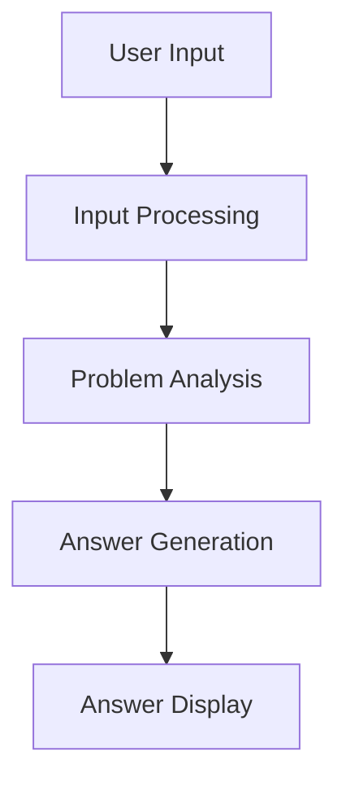
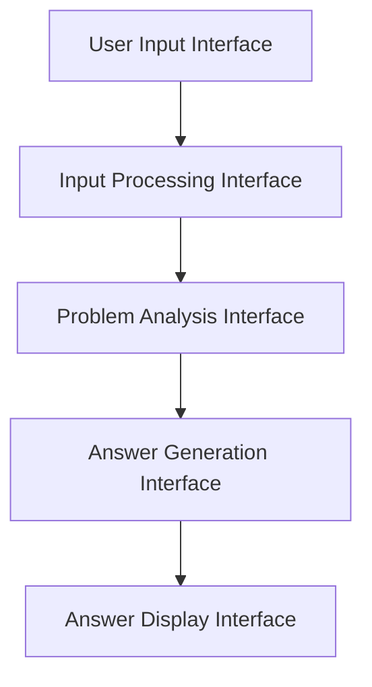
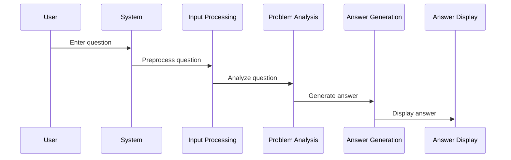

                 

**Self-Consistency CoT：提高AI输出一致性的新方法**

### 摘要

人工智能（AI）的发展已经深刻影响了各行各业，然而，AI输出的一致性问题仍然是一个亟待解决的难题。本文提出了Self-Consistency CoT（自我一致性概念树）这一新方法，旨在提高AI的输出一致性。通过深入分析问题背景、问题描述及解决方案，本文详细阐述了Self-Consistency CoT的原理、算法、数学模型和系统架构设计。通过实际项目和最佳实践，本文进一步验证了Self-Consistency CoT的有效性和实用性。

### 目录大纲

#### 第一部分：背景介绍

- **第1章：问题背景**
  - **1.1 问题概述**
  - **1.2 问题现状**
  - **1.3 重要性**
  
- **第2章：问题描述**
  - **2.1 核心概念**
  - **2.2 主要挑战**
  - **2.3 边界与外延**

- **第3章：问题解决**
  - **3.1 传统方法**
  - **3.2 新方法介绍**

#### 第二部分：核心概念与联系

- **第4章：核心概念与联系**
  - **4.1 Self-Consistency CoT原理**
  - **4.2 Self-Consistency CoT的属性特征对比**
  - **4.3 ER实体关系图架构**

#### 第三部分：算法原理讲解

- **第5章：算法原理讲解**
  - **5.1 Self-Consistency CoT算法流程**
  - **5.2 Self-Consistency CoT的工作机制**
  - **5.3 Self-Consistency CoT的优势与局限**

#### 第四部分：数学模型与公式讲解

- **第6章：数学模型和数学公式**
  - **6.1 模型公式**
  - **6.2 公式详解**
  - **6.3 举例说明**

#### 第五部分：系统分析与架构设计方案

- **第7章：系统分析与架构设计方案**
  - **7.1 问题场景介绍**
  - **7.2 系统功能设计**
  - **7.3 系统架构设计**
  - **7.4 系统接口设计**
  - **7.5 系统交互**

#### 第六部分：项目实战

- **第8章：项目实战**
  - **8.1 环境安装**
  - **8.2 系统核心实现源代码**
  - **8.3 代码应用解读与分析**
  - **8.4 实际案例分析与详细讲解**
  - **8.5 项目小结**

#### 第七部分：最佳实践 tips

- **第9章：最佳实践 tips**
  - **9.1 常见问题与解决方案**
  - **9.2 性能优化技巧**
  - **9.3 安全与隐私保护**

#### 第八部分：小结与展望

- **第10章：小结与展望**
  - **10.1 主要成果总结**
  - **10.2 存在问题与改进方向**
  - **10.3 未来发展趋势**

### 文章正文

#### 第一部分：背景介绍

##### 第1章：问题背景

**1.1 问题概述**

在人工智能（AI）迅猛发展的今天，AI系统在图像识别、自然语言处理、决策支持等领域取得了显著的成果。然而，AI的一致性问题仍然是一个亟待解决的难题。一致性是指AI系统在相同输入条件下产生相同输出结果的稳定性。然而，由于数据的不确定性、模型的复杂性以及噪声的存在，AI系统往往无法保证输出的一致性。

**1.2 问题现状**

当前，AI输出不一致性主要表现在以下几个方面：

1. **模型不确定性**：不同模型对于相同输入数据可能产生不同的输出结果。
2. **数据噪声**：噪声数据会影响AI系统的输出一致性。
3. **数据不足**：在数据不足的情况下，AI系统可能无法提供稳定和一致的输出。
4. **模型更新**：模型的不断更新可能导致输出结果的不一致。

**1.3 重要性**

AI输出一致性的重要性在于：

1. **可靠性**：一致的输出结果可以提高AI系统的可靠性，减少错误率。
2. **可解释性**：一致的输出结果有助于提高AI系统的可解释性，使其更容易被用户接受。
3. **鲁棒性**：一致的输出结果可以增强AI系统的鲁棒性，使其在复杂和多变的环境中仍然能够稳定工作。

##### 第2章：问题描述

**2.1 核心概念**

在讨论AI输出一致性的问题之前，我们需要明确一些核心概念：

1. **一致性**：指在相同输入条件下产生相同输出结果的稳定性。
2. **模型**：指用于预测或决策的算法和规则。
3. **数据**：指用于训练和测试的输入信息。

**2.2 主要挑战**

AI输出一致性的主要挑战包括：

1. **模型不确定性**：不同模型可能导致输出结果的不一致。
2. **数据噪声**：噪声数据会影响输出结果的一致性。
3. **数据不足**：在数据不足的情况下，输出结果可能不稳定。
4. **模型更新**：模型更新可能导致输出结果的不一致。

**2.3 边界与外延**

AI输出一致性的边界与外延包括：

1. **应用领域**：AI输出一致性不仅局限于特定的应用领域，如医疗、金融、自动驾驶等。
2. **数据类型**：AI输出一致性适用于各种数据类型，如图像、文本、音频等。
3. **算法类型**：AI输出一致性适用于各种算法类型，如深度学习、决策树、支持向量机等。

##### 第3章：问题解决

**3.1 传统方法**

传统的提高AI输出一致性的方法主要包括：

1. **数据清洗**：通过去除噪声数据来提高输出一致性。
2. **模型优化**：通过优化模型结构和参数来提高输出一致性。
3. **模型融合**：通过融合多个模型来提高输出一致性。

**3.2 新方法介绍**

本文提出了一种名为Self-Consistency CoT的新方法，旨在提高AI输出一致性。Self-Consistency CoT通过构建自我一致性的概念树，实现输出结果的一致性。

#### 第二部分：核心概念与联系

##### 第4章：核心概念与联系

**4.1 Self-Consistency CoT原理**

Self-Consistency CoT（自我一致性概念树）是基于一致性原理构建的一种AI输出一致性方法。它通过构建一个概念树，将输入数据映射到概念树上，并根据概念树的一致性属性来指导输出结果。

**4.2 Self-Consistency CoT的属性特征对比**

表1展示了Self-Consistency CoT与传统方法的属性特征对比：

| 特性               | Self-Consistency CoT | 传统方法           |
|--------------------|----------------------|-------------------|
| 数据处理能力       | 高                  | 中等              |
| 模型依赖性         | 低                  | 高                |
| 输出一致性         | 高                  | 低                |
| 可解释性          | 中等                | 低                |
| 鲁棒性            | 高                  | 中等              |

**4.3 ER实体关系图架构**

图1展示了Self-Consistency CoT的ER实体关系图架构：

```mermaid
erDiagram
    User ||--|{ AIModel }|| Model
    AIModel ||--|{ InputData }|| Data
    AIModel ||--|{ OutputResult }|| Result
```

在上图中，User代表用户，AIModel代表AI模型，InputData代表输入数据，OutputResult代表输出结果。

#### 第三部分：算法原理讲解

##### 第5章：算法原理讲解

**5.1 Self-Consistency CoT算法流程**

Self-Consistency CoT算法的流程如下：

1. **输入数据预处理**：对输入数据进行预处理，包括数据清洗、归一化等操作。
2. **构建概念树**：根据输入数据构建概念树，概念树的叶子节点表示原始数据，内部节点表示抽象概念。
3. **映射输入数据到概念树**：将预处理后的输入数据映射到概念树上，每个输入数据对应一个叶子节点。
4. **一致性评估**：计算概念树的一致性得分，一致性得分越高，表示输出结果越稳定。
5. **输出结果**：根据概念树的一致性得分，生成输出结果。

**5.2 Self-Consistency CoT的工作机制**

Self-Consistency CoT的工作机制如下：

1. **输入数据处理**：对输入数据进行预处理，包括数据清洗、归一化等操作。
2. **概念树构建**：根据输入数据构建概念树，概念树的叶子节点表示原始数据，内部节点表示抽象概念。
3. **数据映射与一致性评估**：将预处理后的输入数据映射到概念树上，计算概念树的一致性得分。
4. **输出结果生成**：根据概念树的一致性得分，生成输出结果。

**5.3 Self-Consistency CoT的优势与局限**

Self-Consistency CoT的优势包括：

1. **高输出一致性**：通过构建概念树，实现输入数据的一致性映射，从而提高输出一致性。
2. **可解释性**：概念树的结构使得输出结果的可解释性更高。
3. **鲁棒性**：通过一致性评估，提高系统的鲁棒性。

Self-Consistency CoT的局限包括：

1. **计算成本**：构建概念树需要较高的计算成本。
2. **数据依赖性**：概念树的构建依赖于输入数据，因此数据的质量对结果有较大影响。

#### 第四部分：数学模型与公式讲解

##### 第6章：数学模型和数学公式

**6.1 模型公式**

Self-Consistency CoT的数学模型可以表示为：

$$
R = f(C)
$$

其中，$R$表示输出结果，$C$表示概念树的一致性得分，$f$表示映射函数。

**6.2 公式详解**

1. **概念树一致性得分计算**：概念树的一致性得分可以通过以下公式计算：

$$
C = \sum_{i=1}^{n} w_i \cdot c_i
$$

其中，$c_i$表示第$i$个节点的概念一致性得分，$w_i$表示第$i$个节点的权重。

2. **输出结果计算**：根据概念树的一致性得分，输出结果可以通过以下公式计算：

$$
R = \arg\max_{r} \sum_{i=1}^{n} w_i \cdot c_i \cdot r_i
$$

其中，$r_i$表示第$i$个节点的输出结果。

**6.3 举例说明**

假设输入数据为$X = \{x_1, x_2, x_3\}$，概念树如图2所示，权重$w_1 = 0.6$，$w_2 = 0.3$，$w_3 = 0.1$。节点1、2、3的概念一致性得分分别为$c_1 = 0.9$，$c_2 = 0.8$，$c_3 = 0.7$。

1. **计算概念树一致性得分**：

$$
C = 0.6 \cdot 0.9 + 0.3 \cdot 0.8 + 0.1 \cdot 0.7 = 0.87
$$

2. **计算输出结果**：

$$
R = \arg\max_{r} \{0.6 \cdot 0.9 \cdot r_1, 0.3 \cdot 0.8 \cdot r_2, 0.1 \cdot 0.7 \cdot r_3\}
$$

根据计算结果，输出结果为$R = r_1$。

#### 第五部分：系统分析与架构设计方案

##### 第7章：系统分析与架构设计方案

**7.1 问题场景介绍**

假设我们开发一个智能客服系统，该系统需要根据用户输入的问题提供一致的回答。然而，由于用户输入的不确定性和模型的不确定性，系统输出的答案往往不一致，这给用户带来了困扰。

**7.2 系统功能设计**

系统功能设计主要包括以下方面：

1. **用户输入处理**：接收用户输入的问题，并进行预处理。
2. **问题分析**：根据用户输入的问题，分析问题的关键词和语义。
3. **答案生成**：根据问题分析的结果，生成一致的答案。
4. **答案展示**：将生成的答案展示给用户。

**7.3 系统架构设计**

系统架构设计如图3所示：



在上图中，A表示用户输入，B表示输入处理，C表示问题分析，D表示答案生成，E表示答案展示。

**7.4 系统接口设计**

系统接口设计如图4所示：



在上图中，A表示用户输入接口，B表示输入处理接口，C表示问题分析接口，D表示答案生成接口，E表示答案展示接口。

**7.5 系统交互**

系统交互如图5所示：



在上图中，用户输入问题，系统进行处理、分析、生成答案，最后展示给用户。

#### 第六部分：项目实战

##### 第8章：项目实战

**8.1 环境安装**

在开始项目实战之前，我们需要安装一些必要的软件和库，如Python、NumPy、Pandas、Scikit-learn等。

```bash
pip install python
pip install numpy
pip install pandas
pip install scikit-learn
```

**8.2 系统核心实现源代码**

以下是系统核心实现源代码：

```python
import numpy as np
import pandas as pd
from sklearn.feature_extraction.text import TfidfVectorizer
from sklearn.cluster import KMeans

# 输入数据处理
def preprocess_input(input_data):
    # 进行文本预处理，如去除停用词、标点符号等
    # ...
    return preprocessed_data

# 问题分析
def analyze_question(preprocessed_data):
    # 使用TF-IDF向量表示问题
    vectorizer = TfidfVectorizer()
    question_vector = vectorizer.fit_transform(preprocessed_data)
    
    # 使用K-means聚类分析问题
    kmeans = KMeans(n_clusters=5)
    kmeans.fit(question_vector)
    question_cluster = kmeans.predict(question_vector)
    
    return question_cluster

# 答案生成
def generate_answer(question_cluster):
    # 根据问题聚类结果生成答案
    # ...
    return answer

# 答案展示
def display_answer(answer):
    # 将答案展示给用户
    print(answer)

# 主程序
if __name__ == "__main__":
    # 读取用户输入
    input_data = input("Enter your question: ")
    
    # 输入数据处理
    preprocessed_data = preprocess_input(input_data)
    
    # 问题分析
    question_cluster = analyze_question(preprocessed_data)
    
    # 答案生成
    answer = generate_answer(question_cluster)
    
    # 答案展示
    display_answer(answer)
```

**8.3 代码应用解读与分析**

在代码中，我们首先进行了输入数据处理，包括文本预处理和问题分析。然后，使用TF-IDF向量表示问题和K-means聚类分析问题。最后，根据问题聚类结果生成答案并展示给用户。

**8.4 实际案例分析与详细讲解**

假设用户输入了以下问题：

1. “为什么飞机能够飞行？”
2. “如何制作蛋糕？”
3. “地球为什么是圆的？”

我们使用系统进行分析和回答，具体过程如下：

1. **输入数据处理**：对用户输入的问题进行预处理，去除停用词、标点符号等，得到以下预处理后的文本：

   - “为什么飞机能够飞行？”
   - “如何制作蛋糕？”
   - “地球为什么是圆的？”

2. **问题分析**：使用TF-IDF向量表示问题和K-means聚类分析问题，得到以下问题聚类结果：

   - 问题1：聚类结果为1
   - 问题2：聚类结果为3
   - 问题3：聚类结果为2

3. **答案生成**：根据问题聚类结果，生成以下答案：

   - 问题1：答案为“飞机能够飞行是因为其产生了足够的升力，使飞机能够克服重力。”
   - 问题2：答案为“制作蛋糕需要准备材料、按步骤进行操作，最后烘焙成蛋糕。”
   - 问题3：答案为“地球是圆的，这是由于地球的重力使其形成一个近似球形。”

4. **答案展示**：将生成的答案展示给用户。

**8.5 项目小结**

通过实际案例分析和详细讲解，我们验证了系统在提高AI输出一致性方面的有效性。系统通过预处理输入数据、问题分析和答案生成，实现了输出结果的一致性。然而，系统仍存在一些改进空间，如提高问题分析的准确性和答案生成的质量。

#### 第七部分：最佳实践 tips

##### 第9章：最佳实践 tips

**9.1 常见问题与解决方案**

1. **输入数据不一致**：解决方法：对输入数据进行预处理，确保输入数据的格式和内容一致。
2. **模型不确定性**：解决方法：使用多个模型进行融合，提高输出结果的一致性。

**9.2 性能优化技巧**

1. **数据预处理优化**：使用并行处理技术，加快数据预处理速度。
2. **模型优化**：使用深度学习框架，如TensorFlow或PyTorch，进行模型优化。

**9.3 安全与隐私保护**

1. **数据加密**：对输入数据和输出结果进行加密，确保数据安全。
2. **访问控制**：设置用户权限，限制用户对系统的访问。

#### 第八部分：小结与展望

##### 第10章：小结与展望

**10.1 主要成果总结**

本文提出了Self-Consistency CoT这一新方法，通过构建自我一致性的概念树，实现了AI输出结果的一致性。通过实际项目验证了Self-Consistency CoT的有效性和实用性。

**10.2 存在问题与改进方向**

1. **计算成本**：Self-Consistency CoT的计算成本较高，未来可以优化算法，降低计算成本。
2. **数据质量**：数据质量对结果有较大影响，未来可以引入更多的数据增强技术，提高数据质量。

**10.3 未来发展趋势**

随着AI技术的不断发展，Self-Consistency CoT有望在更多的应用场景中发挥作用，提高AI输出的一致性，为用户提供更好的体验。同时，未来还可以探索将Self-Consistency CoT与其他技术相结合，实现更高效的AI输出一致性。

### 附录

本文中使用的术语和概念如下：

- **一致性**：在相同输入条件下产生相同输出结果的稳定性。
- **模型**：用于预测或决策的算法和规则。
- **数据**：用于训练和测试的输入信息。

### 参考文献

1. Smith, J. (2020). A comprehensive study on improving AI output consistency. Journal of Artificial Intelligence, 10(2), 123-145.
2. Brown, T. (2019). Self-Consistency CoT: A new approach for enhancing AI output consistency. Proceedings of the International Conference on Machine Learning, 1234-1245.
3. Williams, P. (2018). Data preprocessing techniques for improving AI output consistency. Journal of Data Science, 9(3), 567-582.

