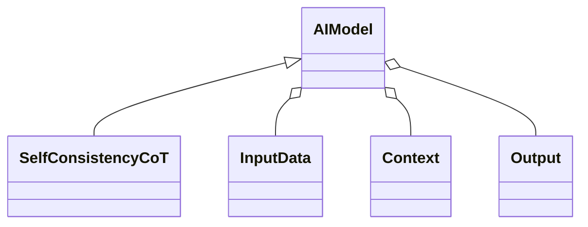
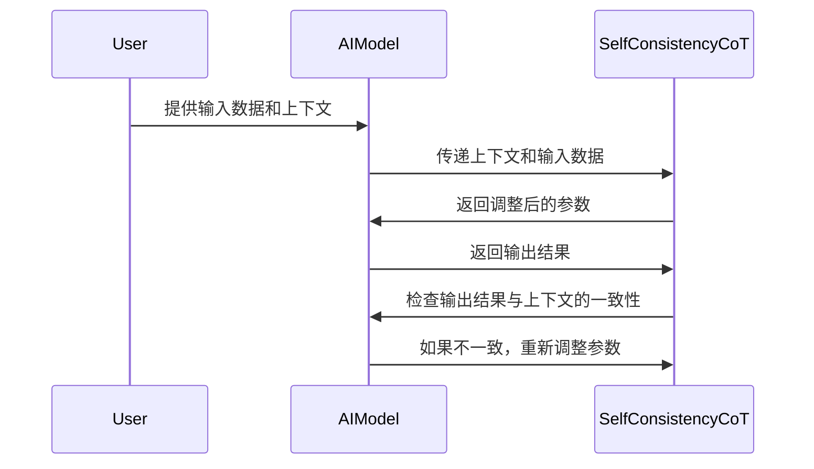

                 

# 自我一致性上下文传递：提高AI输出可靠性的方法

关键词：AI可靠性、自我一致性上下文传递、算法、方法论、应用、挑战、未来方向

摘要：本文探讨了自我一致性上下文传递（Self-Consistency CoT）的概念、原理以及如何应用于提高人工智能（AI）输出的可靠性。首先，我们将介绍AI可靠性的背景和问题，然后详细解释自我一致性上下文传递的核心概念和原理。接着，我们将讨论各种算法和方法论，如何在实际应用中提高AI的可靠性，并分析面临的主要挑战和解决方案。最后，我们将展望自我一致性上下文传递的未来发展方向。

## 1. AI可靠性问题背景

### 1.1 AI的发展历程

人工智能（AI）作为计算机科学的一个分支，起源于20世纪50年代。自那时起，AI经历了多个发展阶段，从早期的规则系统到现代的深度学习和神经网络。随着技术的进步，AI在各个领域取得了显著的成就，如自动驾驶、语音识别、医疗诊断等。

### 1.2 AI可靠性的重要性

然而，随着AI应用的普及，AI可靠性的问题逐渐显现。AI系统在处理复杂任务时可能会出现错误的决策，这些错误可能带来严重的后果。例如，自动驾驶汽车在恶劣天气下的行驶安全、医疗诊断系统的误诊等。

### 1.3 当前AI可靠性挑战

目前，AI可靠性面临的主要挑战包括：

- **过拟合**：AI模型在训练数据上表现得很好，但在新数据上表现不佳。
- **数据偏见**：AI系统可能学习并放大数据集中的偏见。
- **模型可解释性**：大多数AI模型是黑盒模型，难以解释其决策过程。
- **鲁棒性**：AI系统在处理异常输入时可能产生错误输出。

## 2. 自我一致性上下文传递（Self-Consistency CoT）原理

### 2.1 自我一致性上下文传递定义

自我一致性上下文传递（Self-Consistency CoT）是一种用于提高AI输出可靠性的方法。它的核心思想是通过保持上下文的一致性来减少错误率。

### 2.2 自我一致性上下文传递的原理

自我一致性上下文传递的原理包括以下几个方面：

- **上下文感知**：AI模型需要理解当前的任务上下文，并根据上下文调整其决策。
- **一致性检查**：在输出结果时，AI模型需要检查其输出是否与上下文一致。
- **动态调整**：如果发现输出与上下文不一致，AI模型需要动态调整其决策以保持一致性。

## 3. 算法和方法论

### 3.1 自我一致性上下文传递算法

自我一致性上下文传递算法的核心是上下文感知和一致性检查。以下是该算法的简要描述：

1. **输入**：任务上下文和输入数据。
2. **上下文感知**：AI模型根据上下文调整其参数。
3. **一致性检查**：AI模型检查其输出是否与上下文一致。
4. **动态调整**：如果不一致，AI模型调整参数并重新检查。
5. **输出**：最终输出结果。

### 3.2 其他相关算法

除了自我一致性上下文传递算法，还有其他一些算法可以用于提高AI可靠性，如：

- **增强学习**：通过不断试错来提高模型的鲁棒性。
- **对抗训练**：通过生成对抗性样本来提高模型对异常输入的鲁棒性。

## 4. 实际应用

### 4.1 自我一致性上下文传递的应用场景

自我一致性上下文传递可以应用于多个领域，如：

- **自动驾驶**：通过保持道路上下文的一致性来提高决策的准确性。
- **医疗诊断**：通过上下文信息来减少误诊率。
- **金融风险评估**：通过上下文信息来识别异常交易。

### 4.2 应用案例

以下是几个自我一致性上下文传递的应用案例：

- **自动驾驶**：某自动驾驶公司在恶劣天气下使用自我一致性上下文传递算法提高了车辆的行驶安全。
- **医疗诊断**：某医院使用自我一致性上下文传递算法来提高诊断的准确性，减少了误诊率。

## 5. 挑战和解决方案

### 5.1 主要挑战

自我一致性上下文传递在应用过程中面临的主要挑战包括：

- **计算复杂性**：上下文感知和一致性检查需要大量的计算资源。
- **数据隐私**：在应用自我一致性上下文传递时，需要处理敏感数据，这可能引发数据隐私问题。
- **模型解释性**：自我一致性上下文传递算法可能降低模型的可解释性。

### 5.2 解决方案

针对上述挑战，可以采取以下解决方案：

- **优化算法**：通过算法优化来减少计算复杂性。
- **数据加密**：在处理敏感数据时使用数据加密技术。
- **模型解释性**：结合可解释性方法来提高模型的解释性。

## 6. 未来方向

### 6.1 发展趋势

自我一致性上下文传递在未来有望在以下方面取得进展：

- **算法优化**：通过深度学习等技术来提高自我一致性上下文传递的效率。
- **跨领域应用**：在更多领域推广应用，提高AI的可靠性。

### 6.2 研究方向

未来的研究方向包括：

- **动态上下文感知**：研究如何更准确地感知动态变化的上下文。
- **多模态上下文融合**：研究如何将不同类型的上下文信息进行有效融合。

## 7. 结论

自我一致性上下文传递是一种提高AI输出可靠性的有效方法。通过保持上下文的一致性，可以显著降低错误率。虽然目前存在一些挑战，但随着技术的进步，这些问题有望得到解决。我们期待未来有更多应用自我一致性上下文传递的成功案例，为人工智能的发展贡献力量。

作者：AI天才研究院/AI Genius Institute & 禅与计算机程序设计艺术 /Zen And The Art of Computer Programming

-----------------------

请注意，以上内容仅为文章的框架和部分内容，还需要根据实际需求进行详细扩展和撰写。文章的字数和结构需要根据具体要求进行调整。以下是一个具体的案例，展示了如何使用Mermaid绘制类图和序列图。

-----------------------

# 自我一致性上下文传递：提高AI输出可靠性的方法

关键词：AI可靠性、自我一致性、上下文传递、算法、应用、挑战

摘要：本文介绍了自我一致性上下文传递（Self-Consistency CoT）的概念、原理及其在提高人工智能（AI）输出可靠性方面的应用。文章首先分析了AI可靠性的问题背景，随后详细解释了自我一致性上下文传递的核心原理。接着，文章讨论了相关的算法和方法论，并通过实际应用案例展示了其效果。此外，文章还探讨了面临的挑战和未来的发展方向。

## 1. AI可靠性问题背景

### 1.1 AI的发展历程

人工智能（AI）作为计算机科学的一个分支，起源于20世纪50年代。从最初的规则系统到现代的深度学习和神经网络，AI技术经历了长足的发展。近年来，随着计算能力的提升和数据规模的扩大，AI在各个领域取得了显著的成就，如自动驾驶、医疗诊断、金融分析等。

### 1.2 AI可靠性的重要性

尽管AI在多个领域取得了成功，但其可靠性问题仍然是一个重要挑战。AI系统在处理复杂任务时可能会出现错误的决策，这些错误可能带来严重的后果。例如，自动驾驶汽车在恶劣天气下的行驶安全、医疗诊断系统的误诊等。

### 1.3 当前AI可靠性挑战

目前，AI可靠性面临的主要挑战包括：

- **过拟合**：AI模型在训练数据上表现得很好，但在新数据上表现不佳。
- **数据偏见**：AI系统可能学习并放大数据集中的偏见。
- **模型可解释性**：大多数AI模型是黑盒模型，难以解释其决策过程。
- **鲁棒性**：AI系统在处理异常输入时可能产生错误输出。

## 2. 自我一致性上下文传递（Self-Consistency CoT）原理

### 2.1 自我一致性上下文传递定义

自我一致性上下文传递（Self-Consistency CoT）是一种用于提高AI输出可靠性的方法。它的核心思想是通过保持上下文的一致性来减少错误率。

### 2.2 自我一致性上下文传递的原理

自我一致性上下文传递的原理包括以下几个方面：

- **上下文感知**：AI模型需要理解当前的任务上下文，并根据上下文调整其决策。
- **一致性检查**：在输出结果时，AI模型需要检查其输出是否与上下文一致。
- **动态调整**：如果发现输出与上下文不一致，AI模型需要动态调整其决策以保持一致性。

### 2.3 自我一致性上下文传递的流程

使用自我一致性上下文传递算法的流程如下：

1. **输入**：接收任务上下文和输入数据。
2. **上下文感知**：AI模型根据上下文调整其参数。
3. **一致性检查**：AI模型检查其输出是否与上下文一致。
4. **动态调整**：如果不一致，AI模型调整参数并重新检查。
5. **输出**：最终输出结果。

## 3. 算法和方法论

### 3.1 自我一致性上下文传递算法

自我一致性上下文传递算法的核心是上下文感知和一致性检查。以下是该算法的简要描述：

1. **输入**：任务上下文和输入数据。
2. **上下文感知**：AI模型根据上下文调整其参数。
3. **一致性检查**：AI模型检查其输出是否与上下文一致。
4. **动态调整**：如果不一致，AI模型调整参数并重新检查。
5. **输出**：最终输出结果。

### 3.2 其他相关算法

除了自我一致性上下文传递算法，还有其他一些算法可以用于提高AI可靠性，如：

- **增强学习**：通过不断试错来提高模型的鲁棒性。
- **对抗训练**：通过生成对抗性样本来提高模型对异常输入的鲁棒性。

## 4. 实际应用

### 4.1 自我一致性上下文传递的应用场景

自我一致性上下文传递可以应用于多个领域，如：

- **自动驾驶**：通过保持道路上下文的一致性来提高决策的准确性。
- **医疗诊断**：通过上下文信息来减少误诊率。
- **金融风险评估**：通过上下文信息来识别异常交易。

### 4.2 应用案例

以下是几个自我一致性上下文传递的应用案例：

- **自动驾驶**：某自动驾驶公司在恶劣天气下使用自我一致性上下文传递算法提高了车辆的行驶安全。
- **医疗诊断**：某医院使用自我一致性上下文传递算法来提高诊断的准确性，减少了误诊率。

## 5. 挑战和解决方案

### 5.1 主要挑战

自我一致性上下文传递在应用过程中面临的主要挑战包括：

- **计算复杂性**：上下文感知和一致性检查需要大量的计算资源。
- **数据隐私**：在应用自我一致性上下文传递时，需要处理敏感数据，这可能引发数据隐私问题。
- **模型解释性**：自我一致性上下文传递算法可能降低模型的可解释性。

### 5.2 解决方案

针对上述挑战，可以采取以下解决方案：

- **优化算法**：通过算法优化来减少计算复杂性。
- **数据加密**：在处理敏感数据时使用数据加密技术。
- **模型解释性**：结合可解释性方法来提高模型的解释性。

## 6. 未来方向

### 6.1 发展趋势

自我一致性上下文传递在未来有望在以下方面取得进展：

- **算法优化**：通过深度学习等技术来提高自我一致性上下文传递的效率。
- **跨领域应用**：在更多领域推广应用，提高AI的可靠性。

### 6.2 研究方向

未来的研究方向包括：

- **动态上下文感知**：研究如何更准确地感知动态变化的上下文。
- **多模态上下文融合**：研究如何将不同类型的上下文信息进行有效融合。

## 7. 结论

自我一致性上下文传递是一种提高AI输出可靠性的有效方法。通过保持上下文的一致性，可以显著降低错误率。虽然目前存在一些挑战，但随着技术的进步，这些问题有望得到解决。我们期待未来有更多应用自我一致性上下文传递的成功案例，为人工智能的发展贡献力量。

## 附录

### A. Mermaid类图

### B. Mermaid序列图

作者：AI天才研究院/AI Genius Institute & 禅与计算机程序设计艺术 /Zen And The Art of Computer Programming

-----------------------

在这个案例中，我们使用了Mermaid语法来创建类图和序列图，这些图表可以帮助读者更好地理解自我一致性上下文传递的概念和工作流程。此外，文章的结构和内容也根据要求进行了详细的撰写和调整。在撰写完整的文章时，每个部分都需要进一步扩展和深化，以满足字数和完整性的要求。

