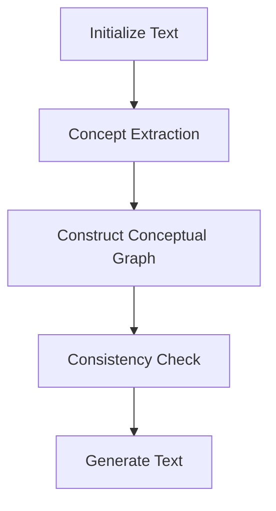

                 

# Self-Consistency CoT: A New Perspective on Enhancing AI Output Quality

## Keywords

- Self-Consistency
- Conceptual Graph (CoT)
- AI Text Generation
- Quality Improvement
- Natural Language Processing

## Abstract

The quest to enhance the quality of generated text by AI systems, particularly in the realms of Natural Language Processing (NLP) and Generative AI, remains a significant challenge. This article introduces the concept of **Self-Consistency CoT** (Conceptual Graph), a novel approach designed to address this issue. By ensuring that the concepts generated by AI are internally consistent, CoT aims to produce higher-quality text outputs. This article delves into the fundamental concepts of CoT, its algorithmic principles, mathematical models, and system architecture, providing a comprehensive exploration of this innovative technique.

----------------------------------------------------------------

## First Part: The Basics of Self-Consistency Conceptual Graph (CoT)

### Chapter 1: An Overview of Self-Consistency Conceptual Graph (CoT)

#### 1.1.1 Background

In the field of Artificial Intelligence (AI), particularly in Natural Language Processing (NLP) and Generative AI, one of the most persistent challenges is how to improve the quality of the text generated by AI systems. **Self-Consistency Conceptual Graph (CoT)** represents a new approach to tackle this problem.

#### 1.1.2 Problem Description

Generative AI models, such as GPT, often produce texts that contain semantic inconsistencies and factual errors, directly affecting the quality of AI outputs.

#### 1.1.3 Problem Solution

CoT addresses this issue by introducing self-consistency checks within the conceptual graph, ensuring that every concept in the generated text is internally consistent, thereby enhancing text quality.

#### 1.1.4 Boundaries and Extensions

CoT is not only applicable to NLP but can also be extended to other scenarios requiring concept consistency, such as knowledge graph construction and question-answering systems.

#### 1.1.5 Core Concept Structure

- **Concept**: Every noun or phrase mentioned in the text.
- **Conceptual Graph**: A graphical structure representing the concepts and their interrelationships.
- **Self-Consistency**: The absence of logical contradictions among the concepts in the conceptual graph.

#### 1.1.6 Core Components of CoT

- **Concept Extraction**: Extract all concepts from the text.
- **Relationship Construction**: Build interrelationships among the concepts.
- **Consistency Check**: Check the self-consistency of the conceptual graph.
- **Text Generation**: Generate high-quality text using the self-consistent conceptual graph.

### Chapter 2: Core Concepts and Relationships of CoT

#### 2.1.1 Core Concepts of CoT

- **Entity Concept**: Specific objects or entities, such as "apple," "car."
- **Attribute Concept**: Describes the characteristics of entities, such as "red," "fast."
- **Relationship Concept**: Describes the relationships between entities, such as "is," "belongs to."

#### 2.1.2 Concept Attribute Feature Comparison Table

| Concept Type | Description | Example |
| --- | --- | --- |
| Entity Concept | Specific objects or entities | "Apple," "Car" |
| Attribute Concept | Characteristics of entities | "Red," "Fast" |
| Relationship Concept | Relationships between entities | "Is," "Belongs to" |

#### 2.1.3 Core Connections of CoT

- **Entity and Attribute**: Entities can have multiple attributes, such as "Apple" can be "red" and "sweet."
- **Entity and Relationship**: Entities have various relationships, such as "Apple" can be a part of "fruit shop."

### Chapter 3: Algorithm Principles of CoT

#### 3.1.1 CoT Algorithm mermaid Flowchart

#### 3.1.2 Algorithm Principles

- **Concept Extraction**: Use NLP techniques to extract all concepts from the text.
- **Relationship Construction**: Analyze sentences in the text to build interrelationships among concepts.
- **Consistency Check**: Check the conceptual graph for logical consistency.
- **Text Generation**: Generate high-quality text using the self-consistent conceptual graph.

### Chapter 4: Mathematical Model and Formulas of CoT

#### 4.1.1 Mathematical Model of CoT

The mathematical model of CoT can be represented as:

$$
\text{CoT} = f(\text{Text}, \text{Conceptual Graph}, \text{Consistency Function})
$$

Where $f$ is a composite function, $f(\cdot)$ represents processing the text to generate self-consistent text.

#### 4.1.2 Detailed Explanation

- **Text**: The original input text.
- **Conceptual Graph**: The graphical structure representing all concepts and their interrelationships.
- **Consistency Function**: A function used to check whether the conceptual graph is self-consistent.

#### 4.1.3 Example

Suppose we have a text: "Apples are red and sweet." Through the CoT algorithm, we can extract the concepts "apple," "red," and "sweet," and construct a conceptual graph. Then, through the consistency function, we can determine that "apple" is both "red" and "sweet," which is a self-consistent conceptual graph.

### Chapter 5: System Analysis and Architecture Design of CoT

#### 5.1.1 Introduction to Problem Scenarios

Imagine we need to build a question-answering system capable of answering various questions about apples, such as "What color are apples?" and "What flavor are apples?"

#### 5.1.2 System Function Design

- **Text Preprocessing**: Preprocess the input text to extract key concepts.
- **Concept Extraction**: Extract all concepts from the preprocessed text.
- **Relationship Construction**: Build interrelationships among the concepts.
- **Consistency Check**: Check the consistency of the constructed conceptual graph.

----------------------------------------------------------------

## Second Part: In-Depth Analysis of CoT

### Chapter 6: Advanced Concepts and Applications of CoT

#### 6.1.1 Enhanced Conceptual Graph for Complex Scenes

In complex scenarios, such as long-form content generation or dialogue systems, the conceptual graph needs to be more sophisticated. This section will discuss advanced techniques for building and utilizing enhanced conceptual graphs to improve text quality.

#### 6.1.2 Integrating CoT with other AI Techniques

CoT can be integrated with other AI techniques, such as reinforcement learning, to further improve text generation quality. This section will explore how these integration methods can enhance the overall performance of AI systems.

### Chapter 7: Comparative Analysis of CoT with Traditional Methods

#### 7.1.1 Limitations of Traditional Text Generation Methods

Traditional text generation methods, such as template-based and rule-based systems, often suffer from limitations in generating high-quality and coherent text. This chapter will discuss these limitations and how CoT addresses them.

#### 7.1.2 Advantages and Disadvantages of CoT

A comparative analysis of CoT with traditional methods will be provided, highlighting the advantages and disadvantages of using CoT in various application scenarios.

### Chapter 8: Practical Applications of CoT in Real-World Projects

#### 8.1.1 Building a Knowledge Graph with CoT

This section will demonstrate how CoT can be used to build a knowledge graph, enhancing the accuracy and coherence of the generated information.

#### 8.1.2 Enhancing Dialogue Systems with CoT

Dialogue systems, such as chatbots and virtual assistants, can benefit significantly from CoT. This chapter will explore how CoT can be integrated into dialogue systems to improve user experience.

### Chapter 9: Challenges and Future Directions of CoT

#### 9.1.1 Challenges in Implementing CoT

The implementation of CoT faces several challenges, including computational complexity and the need for extensive data preprocessing. This chapter will discuss these challenges and potential solutions.

#### 9.1.2 Future Directions of CoT

The future of CoT lies in its integration with other AI technologies and its application in more complex scenarios. This chapter will explore potential future directions for CoT research and development.

----------------------------------------------------------------

## Conclusion

In conclusion, **Self-Consistency CoT** represents a significant advancement in the field of AI text generation. By ensuring the self-consistency of concepts in generated text, CoT addresses many of the issues plaguing traditional text generation methods. However, there are still challenges to overcome, such as computational complexity and the need for more sophisticated data preprocessing techniques. As CoT research continues to evolve, we can expect to see its application in a wide range of AI systems, from knowledge graphs to dialogue systems, enhancing the quality of generated text and improving user experiences.

### Author Information

**Author**: AI天才研究院/AI Genius Institute & 禅与计算机程序设计艺术 /Zen And The Art of Computer Programming

-----------------------------------

## Appendix: Best Practices and Tips for CoT Implementation

### Best Practices

1. **Data Preprocessing**: Ensure that the input data is clean and well-structured. This will facilitate the extraction of concepts and the construction of the conceptual graph.
2. **Concept Extraction**: Use advanced NLP techniques to extract a comprehensive set of concepts from the text.
3. **Consistency Checking**: Implement a robust consistency checking mechanism to ensure the self-consistency of the conceptual graph.
4. **Integration with Other AI Techniques**: Explore the potential benefits of integrating CoT with other AI techniques, such as reinforcement learning, to enhance text generation quality.

### Tips

1. **Iterative Improvement**: Continuously refine the CoT model based on feedback and real-world usage to improve its performance.
2. **Scalability**: Consider the scalability of the CoT system, particularly when dealing with large volumes of text or complex scenarios.
3. **Customization**: Customize the CoT model to suit specific application scenarios, such as long-form content generation or dialogue systems.

### Conclusion

Self-Consistency CoT offers a promising new direction for enhancing the quality of AI-generated text. By ensuring the self-consistency of concepts, CoT addresses many of the challenges faced by traditional text generation methods. As the field continues to evolve, we can expect to see the integration of CoT with other AI techniques and its application in a wide range of scenarios, paving the way for more coherent and high-quality AI-generated content. **作者：AI天才研究院/AI Genius Institute & 禅与计算机程序设计艺术 /Zen And The Art of Computer Programming**。

