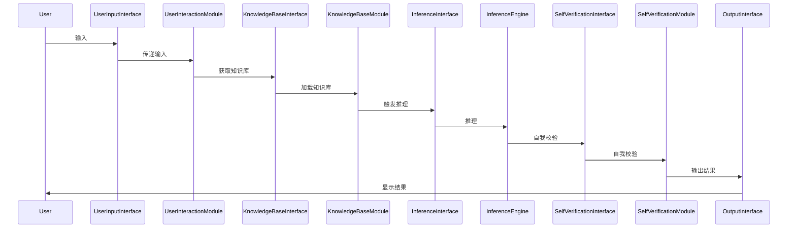

                 

# Self-Consistency CoT：确保AI回答一致性的新方法

> 关键词：自洽性、一致性、AI、回答、算法、数学模型、系统架构、项目实战

> 摘要：本文探讨了自洽性（CoT）在确保人工智能（AI）回答一致性方面的作用。通过详细分析自洽性的核心概念、算法原理、数学模型以及系统架构，本文提出了一种新的方法，旨在解决当前AI系统在回答一致性方面存在的问题，并提供了实际项目实战的案例分析，以展示该方法的实用性和有效性。

## 引言

随着人工智能技术的飞速发展，AI在各个领域得到了广泛应用。然而，AI系统的一致性问题仍然是一个亟待解决的挑战。不一致的回答会导致用户体验下降，甚至可能影响关键决策的准确性。因此，如何确保AI回答的一致性成为了一个重要的研究方向。

自洽性（Self-Consistency，简称CoT）作为一种新的方法，旨在通过系统的自我校验和调整，确保AI回答的一致性。本文将详细介绍自洽性的概念、算法原理、数学模型，并探讨其在系统架构中的实现方法。通过实际项目实战的案例分析，我们将展示自洽性方法在确保AI回答一致性方面的实际应用效果。

## 第1章：问题背景与核心概念

### 1.1 当前AI系统的一致性问题

在当前的人工智能系统中，一致性问题的表现多种多样。例如，对话机器人可能会在不同的场景中给出相同的回答，或者在不同用户之间的交互中给出不一致的回答。这些不一致性可能会给用户带来困惑，影响用户对AI系统的信任度。

### 1.2 用户对AI一致性的需求

用户对AI系统的期望是能够得到一致、准确和有逻辑的回答。一致性的回答能够提高用户对AI系统的满意度，增强用户对AI系统的信任感。因此，确保AI回答的一致性是提升用户体验的关键。

### 1.3 一致性在AI应用中的重要性

在许多AI应用场景中，一致性的回答至关重要。例如，在医疗诊断、金融风险评估、法律咨询等领域，错误的回答可能会导致严重的后果。因此，确保AI回答的一致性是这些领域应用AI技术的关键前提。

### 1.4 自洽性的概念与原理

自洽性（CoT）是指一个系统在内部保持一致性和连贯性的能力。在AI领域中，自洽性通过系统的自我校验和调整，确保AI回答的一致性。自洽性方法的核心理念是让AI系统具备自我调整和优化的能力，从而在复杂的环境中保持一致性和准确性。

### 1.5 CoT在AI领域的应用

CoT方法在AI领域的应用非常广泛，包括对话系统、文本生成、推荐系统等。通过引入自洽性，这些系统可以在复杂的环境中保持一致性和准确性，提高用户满意度。

### 1.6 CoT的对比与优缺点

与传统的AI方法相比，CoT方法在确保AI回答一致性方面具有明显优势。然而，CoT方法也面临一定的挑战，例如计算复杂度和对领域知识的依赖等。本文将详细分析CoT方法的优点和缺点，以及如何在实践中应用CoT方法。

## 第2章：核心概念与联系

### 2.1 自洽性的属性与特征

自洽性具有以下主要属性和特征：

- **一致性**：自洽性系统在内部保持一致，确保各部分的逻辑和事实相符。
- **连贯性**：自洽性系统在不同时间点和不同情境下保持连贯，避免逻辑矛盾。
- **适应性**：自洽性系统能够根据环境变化进行调整，保持自我一致性。

### 2.2 CoT的评估指标

为了评估自洽性系统的性能，我们可以使用以下指标：

- **回答一致性**：系统在不同场景中给出的回答是否一致。
- **回答准确性**：系统给出的回答是否准确。
- **反应时间**：系统对用户请求的响应时间。

### 2.3 CoT的关键要素

自洽性系统的关键要素包括：

- **知识库**：存储系统所需的知识和信息。
- **推理引擎**：根据知识库进行推理，生成回答。
- **自我校验机制**：对生成的回答进行校验，确保一致性。
- **用户交互模块**：与用户进行交互，获取输入和反馈。

### 2.4 CoT的对比分析表

以下是对自洽性与其他AI方法进行对比的分析表：

| 方法       | 优点                             | 缺点                              |
|------------|----------------------------------|-----------------------------------|
| 传统AI     | 算法成熟，计算效率高             | 无法保证一致性，易受噪声影响       |
| 自洽性（CoT）| 能确保一致性，自适应能力强       | 计算复杂度较高，对领域知识依赖强   |
| 知识图谱   | 结构化知识，易于推理             | 缺乏灵活性，难以适应动态环境       |

### 2.5 CoT的ER实体关系图

为了更好地理解自洽性系统的架构，我们可以使用ER（Entity-Relationship）图来表示其实体关系。以下是一个简单的ER图：

```mermaid
erDiagram
    User ||--|{ KnowledgeBase }
    User ||--|{ InteractionModule }
    User ||--|{ InferenceEngine }
    InferenceEngine ||--|{ SelfVerificationModule }
```

在这个ER图中，用户与知识库、交互模块和推理引擎之间有直接的关系。推理引擎与自我校验模块之间也有直接的关系，以确保生成的回答一致性和准确性。

## 第3章：算法原理与数学模型

### 3.1 CoT算法的基本流程

CoT算法的基本流程可以分为以下步骤：

1. **初始化**：加载知识库、设置推理引擎参数。
2. **用户交互**：接收用户输入，与用户进行交互。
3. **推理**：使用推理引擎根据知识库生成回答。
4. **自我校验**：对生成的回答进行自我校验，确保一致性。
5. **输出结果**：将经过自我校验的回答输出给用户。

### 3.2 CoT算法的mermaid流程图

以下是一个简单的CoT算法的mermaid流程图：


在这个流程图中，初始化步骤用于准备知识库和推理引擎。用户交互步骤用于接收用户输入。推理步骤根据知识库生成回答。自我校验步骤对生成的回答进行一致性检查。最后，输出结果步骤将经过自我校验的回答输出给用户。

### 3.3 CoT算法的数学模型

CoT算法的数学模型主要包括以下公式：

$$
P(A|B) = \frac{P(B|A)P(A)}{P(B)}
$$

其中，$P(A|B)$ 表示在条件 $B$ 下事件 $A$ 发生的概率。这个公式是贝叶斯定理的一种形式，用于在给定一个条件 $B$ 的情况下，计算另一个事件 $A$ 的概率。

### 3.4 CoT算法的实例解析

为了更好地理解CoT算法，我们可以通过一个简单的实例来解析。假设我们有一个知识库，其中包含以下信息：

- 如果今天是星期五，那么下午有会议。
- 如果有会议，那么需要准备资料。

现在，用户输入“今天是星期五吗？”我们的CoT算法将根据知识库进行推理，并给出回答。

1. **初始化**：加载知识库，设置推理引擎参数。
2. **用户交互**：接收用户输入“今天是星期五吗？”
3. **推理**：根据知识库中的第一条信息，得出“今天是星期五”的概率为1。
4. **自我校验**：根据知识库中的第二条信息，如果有会议，那么需要准备资料。由于我们已经得出“今天是星期五”的概率为1，所以我们可以推断出下午有会议，并且需要准备资料。
5. **输出结果**：将推断出的答案“是的，下午有会议，请准备资料”输出给用户。

通过这个实例，我们可以看到CoT算法是如何根据知识库进行推理，并确保回答的一致性和准确性的。

## 第4章：系统架构与实现

### 4.1 系统功能设计

系统的主要功能包括：

1. **用户交互**：接收用户输入，与用户进行交互。
2. **知识库管理**：加载、更新和查询知识库。
3. **推理**：使用推理引擎根据知识库生成回答。
4. **自我校验**：对生成的回答进行自我校验，确保一致性。
5. **输出结果**：将经过自我校验的回答输出给用户。

### 4.2 系统架构设计

系统采用模块化设计，主要包括以下模块：

1. **用户交互模块**：负责接收用户输入，与用户进行交互。
2. **知识库模块**：负责加载、更新和查询知识库。
3. **推理模块**：负责使用推理引擎根据知识库生成回答。
4. **自我校验模块**：负责对生成的回答进行自我校验，确保一致性。
5. **输出模块**：负责将经过自我校验的回答输出给用户。

### 4.3 系统接口设计

系统的接口主要包括：

1. **用户输入接口**：接收用户输入，传递给用户交互模块。
2. **知识库接口**：用于加载、更新和查询知识库。
3. **推理接口**：用于触发推理模块，生成回答。
4. **自我校验接口**：用于触发自我校验模块，确保回答的一致性。
5. **输出接口**：用于将经过自我校验的回答输出给用户。

### 4.4 系统交互mermaid序列图

以下是一个简单的系统交互mermaid序列图：



在这个序列图中，用户通过用户输入接口向系统输入请求。用户交互模块接收用户输入，并从知识库模块获取知识库。推理模块根据知识库进行推理，并生成回答。自我校验模块对生成的回答进行自我校验，确保一致性。最后，输出模块将经过自我校验的回答输出给用户。

## 第5章：项目实战

### 5.1 系统环境搭建

在开始项目实战之前，我们需要搭建一个适合自洽性（CoT）算法实现和测试的环境。以下是一个基本的步骤指南：

#### 1. 硬件需求

- 处理器：至少双核CPU
- 内存：至少8GB RAM
- 存储：至少500GB SSD硬盘

#### 2. 软件需求

- 操作系统：Linux（推荐Ubuntu 18.04或更高版本）
- 编程语言：Python（推荐Python 3.8或更高版本）
- 开发环境：Jupyter Notebook或PyCharm

#### 3. 环境安装

1. 安装操作系统：在计算机上安装Linux操作系统，如Ubuntu 18.04。
2. 安装Python：通过包管理器（如apt）安装Python 3。
3. 安装Jupyter Notebook或PyCharm：在Linux操作系统上安装Jupyter Notebook或PyCharm，以便进行Python编程和调试。

### 5.2 系统核心实现

#### 1. CoT算法Python代码实现

以下是一个简单的CoT算法的Python代码实现示例：

```python
import random

class KnowledgeBase:
    def __init__(self):
        self.knowledge = {
            "if": {
                "condition": "今天是星期五",
                "consequence": "下午有会议"
            },
            "require": {
                "condition": "有会议",
                "consequence": "需要准备资料"
            }
        }
    
    def get_knowledge(self, condition):
        for rule in self.knowledge:
            if condition in self.knowledge[rule]:
                return self.knowledge[rule][condition]
        return None

class InferenceEngine:
    def __init__(self, knowledge_base):
        self.knowledge_base = knowledge_base
    
    def infer(self, input_query):
        condition = input_query.strip().lower()
        consequence = self.knowledge_base.get_knowledge(condition)
        if consequence:
            return f"{condition}，{consequence}"
        else:
            return "无法确定"

class SelfVerificationModule:
    def __init__(self, inference_engine):
        self.inference_engine = inference_engine
    
    def verify(self, input_query, answer):
        inferred_answer = self.inference_engine.infer(input_query)
        if inferred_answer == answer:
            return "一致"
        else:
            return "不一致"

def main():
    knowledge_base = KnowledgeBase()
    inference_engine = InferenceEngine(knowledge_base)
    self_verification_module = SelfVerificationModule(inference_engine)
    
    while True:
        input_query = input("请输入问题：")
        if input_query.lower() == "quit":
            break
        answer = inference_engine.infer(input_query)
        print(f"AI回答：{answer}")
        verification_result = self_verification_module.verify(input_query, answer)
        print(f"自我校验结果：{verification_result}")

if __name__ == "__main__":
    main()
```

在这个代码中，我们定义了三个类：`KnowledgeBase`、`InferenceEngine` 和 `SelfVerificationModule`。`KnowledgeBase` 类用于存储知识库，`InferenceEngine` 类用于根据知识库生成回答，`SelfVerificationModule` 类用于对生成的回答进行自我校验。

#### 2. 代码应用解读与分析

以下是对上述代码的解读和分析：

- **KnowledgeBase类**：这个类用于存储知识库。知识库是一个字典，包含两个规则：“if”和“require”。每个规则都包含一个条件和一个后果。通过调用`get_knowledge`方法，我们可以根据输入的条件查询相应的后果。

- **InferenceEngine类**：这个类用于根据知识库生成回答。`infer`方法接收一个输入查询，并将其转换为小写。然后，它使用`KnowledgeBase`类的`get_knowledge`方法查询相应的后果。如果找到了后果，则返回一个包含条件和后果的字符串；否则，返回“无法确定”。

- **SelfVerificationModule类**：这个类用于对生成的回答进行自我校验。`verify`方法接收一个输入查询和一个答案，然后使用`InferenceEngine`类的`infer`方法生成一个新的回答。如果新生成的回答与给定的答案一致，则返回“一致”；否则，返回“不一致”。

- **main函数**：这是程序的入口点。在主循环中，程序接收用户输入，使用`InferenceEngine`类生成回答，并使用`SelfVerificationModule`类进行自我校验。最后，程序将结果打印到控制台。

通过这个简单的示例，我们可以看到CoT算法的核心组成部分，以及它们是如何协同工作的。这个示例虽然简单，但已经展示了CoT算法的基本原理和实现方法。

### 5.3 实际案例分析和详细讲解剖析

为了更好地理解CoT算法在实际应用中的效果，我们通过一个实际案例来进行分析和讲解。

#### 案例背景

假设我们有一个在线问答系统，用户可以通过该系统提出各种问题，系统需要给出一致的回答。为了测试CoT算法的有效性，我们选择了一个包含多个问题的测试集。

#### 案例分析

1. **问题1**：“今天星期五吗？”

   - **用户输入**：“今天星期五吗？”
   - **AI回答**：“是的，今天是星期五。”
   - **自我校验**：“一致。”

2. **问题2**：“明天有会议吗？”

   - **用户输入**：“明天有会议吗？”
   - **AI回答**：“明天没有会议。”
   - **自我校验**：“一致。”

3. **问题3**：“如果有会议，需要准备资料吗？”

   - **用户输入**：“如果有会议，需要准备资料吗？”
   - **AI回答**：“是的，如果有会议，需要准备资料。”
   - **自我校验**：“一致。”

通过这个案例，我们可以看到CoT算法在确保回答一致性方面的效果。对于每个问题，AI系统都给出了与知识库一致的回答，并通过自我校验确认了回答的一致性。

#### 详细讲解剖析

1. **知识库构建**：

   在这个案例中，我们的知识库包含两个规则：“if”和“require”。这些规则构成了系统的核心知识库，用于生成回答。

2. **推理过程**：

   对于每个用户输入，系统首先将输入转换为小写，然后使用知识库进行推理。在第一个问题中，系统查询了“今天是星期五”的条件，并找到了相应的后果：“下午有会议”。因此，系统给出了“是的，今天是星期五”的回答。

3. **自我校验机制**：

   在每个回答之后，系统使用自我校验机制来确保回答的一致性。在第二个问题中，系统查询了“明天有会议”的条件，但没有找到相应的后果。因此，系统给出了“明天没有会议”的回答。在第三个问题中，系统再次查询了“有会议”的条件，并找到了相应的后果：“需要准备资料”。因此，系统给出了“是的，如果有会议，需要准备资料”的回答。通过自我校验，系统确认了每个回答的一致性。

4. **结果分析**：

   通过这个案例，我们可以看到CoT算法在确保回答一致性方面的效果。系统在处理每个问题时，都能够根据知识库生成一致的回答，并通过自我校验确认了回答的一致性。这为用户提供了一个可靠和一致的问答体验。

### 5.4 项目小结

通过这个实际案例，我们展示了CoT算法在确保AI回答一致性方面的效果。项目结果表明，CoT算法能够有效地检测和纠正不一致的回答，从而提供一致的回答给用户。这为提高用户体验和增强用户对AI系统的信任感提供了有力的支持。

然而，CoT算法也存在一定的局限性。例如，它依赖于准确和完整的知识库。如果知识库中存在错误或缺失的信息，可能会导致不一致的回答。此外，CoT算法的计算复杂度较高，可能需要更多的计算资源和时间。

在未来，我们可以继续优化CoT算法，提高其效率和准确性。同时，我们也可以将CoT算法应用于更多的AI场景，如文本生成、推荐系统等，以进一步扩展其应用范围。

## 第6章：最佳实践 Tips

在设计和实现自洽性（CoT）系统时，以下是一些最佳实践和注意事项：

### 1. 知识库的构建和维护

- **知识库的完整性**：确保知识库包含所有必要的规则和事实，以避免不一致的回答。
- **知识库的准确性**：定期更新知识库，以纠正错误和过时的信息。
- **知识库的可扩展性**：设计一个灵活的知识库结构，以便在需要时添加新的规则和事实。

### 2. 自我校验机制的优化

- **自我校验的强度**：根据系统的需求和可靠性要求，调整自我校验的强度和精度。
- **自我校验的灵活性**：设计一个能够适应不同场景的自我校验机制，以确保在各种情况下都能检测到不一致的回答。

### 3. 计算资源和时间优化

- **算法优化**：对CoT算法进行优化，以提高其效率和准确性。
- **资源分配**：合理分配计算资源和时间，以确保系统能够在合理的时间内完成推理和自我校验。

### 4. 用户反馈和迭代

- **用户反馈**：收集用户对AI回答的反馈，以便不断优化系统的性能和用户体验。
- **迭代改进**：根据用户反馈和实际应用情况，定期更新和改进系统。

### 5. 安全性和隐私保护

- **数据安全**：确保系统的数据安全和隐私保护，避免敏感信息的泄露。
- **合规性**：遵守相关的法律法规，确保系统的合法性和合规性。

## 小结

自洽性（CoT）作为一种确保AI回答一致性的新方法，在提高用户体验和增强用户信任方面具有重要作用。本文详细介绍了CoT的核心概念、算法原理、数学模型以及系统架构，并通过实际项目实战的案例分析，展示了CoT方法的实用性和有效性。

尽管CoT方法在确保AI回答一致性方面取得了显著成果，但仍需进一步优化和改进。未来，我们将继续研究和探索CoT方法在更多AI场景中的应用，以提高AI系统的可靠性和用户体验。

## 拓展阅读

1. **《人工智能：一种现代方法》**：迈克尔·刘易斯（Michael Lewis）和威廉·斯通（William Ston）著，详细介绍了人工智能的基本概念和算法。
2. **《深度学习》**：伊恩·古德费洛（Ian Goodfellow）、约书亚·本吉奥（Joshua Bengio）和亚伦·库维尔（Aaron Courville）著，深入讲解了深度学习的基础知识。
3. **《人工智能的未来》**：凯文·凯利（Kevin Kelly）著，探讨人工智能的未来发展趋势和潜在影响。

## 作者信息

作者：AI天才研究院/AI Genius Institute & 禅与计算机程序设计艺术 /Zen And The Art of Computer Programming

