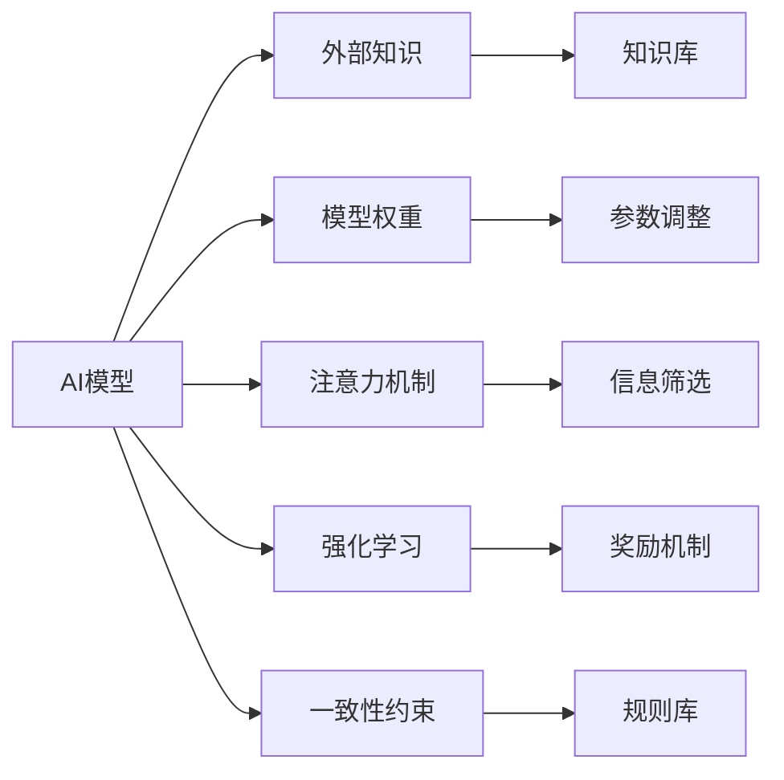
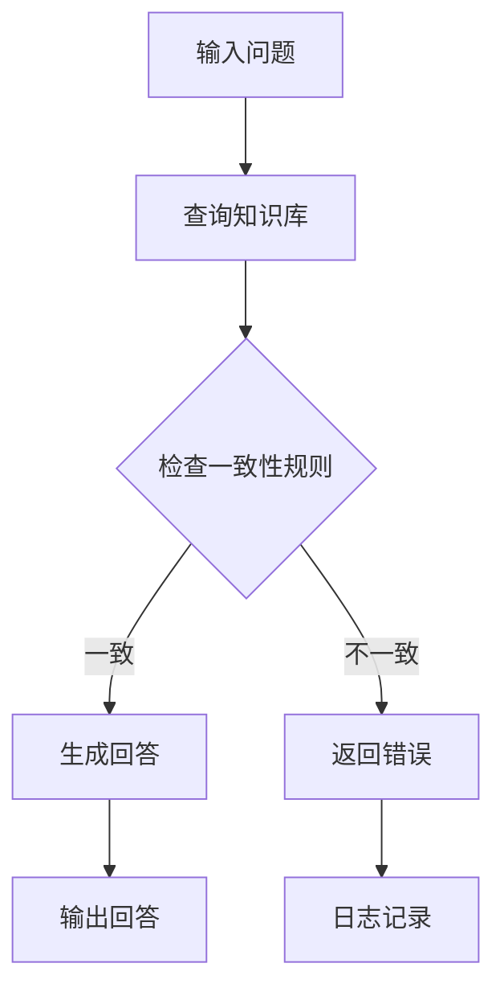
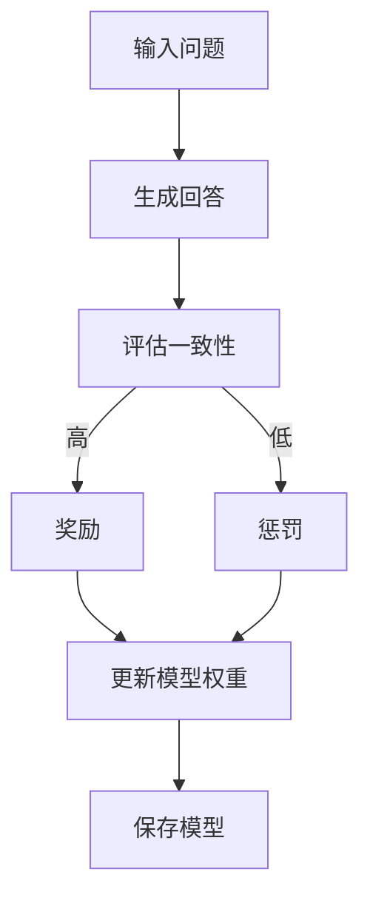
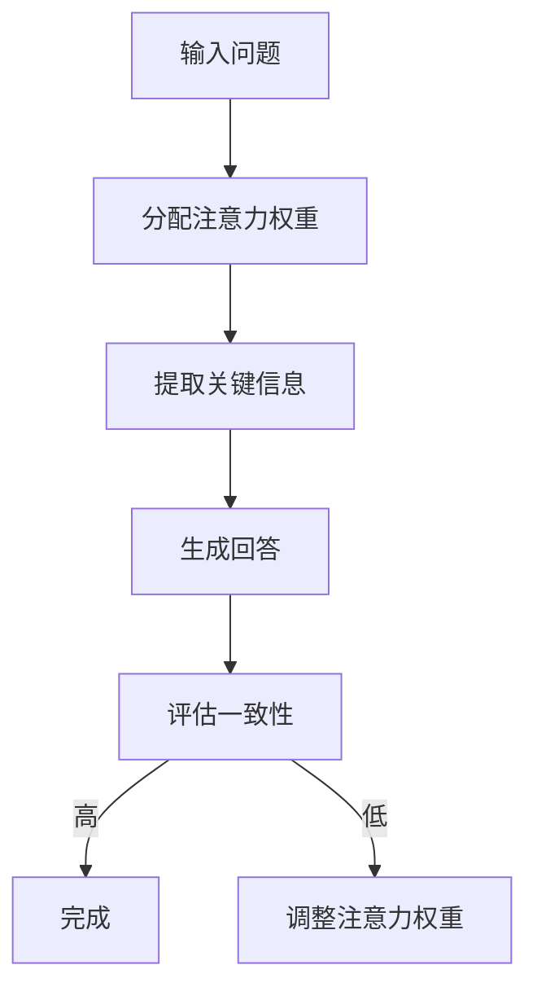
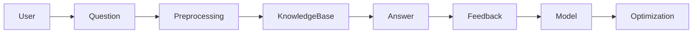
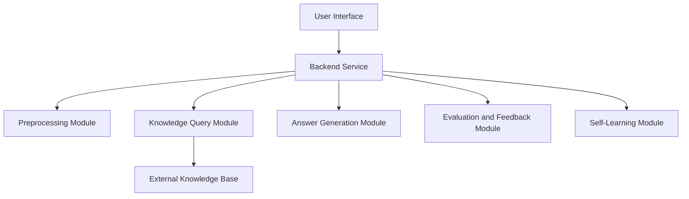
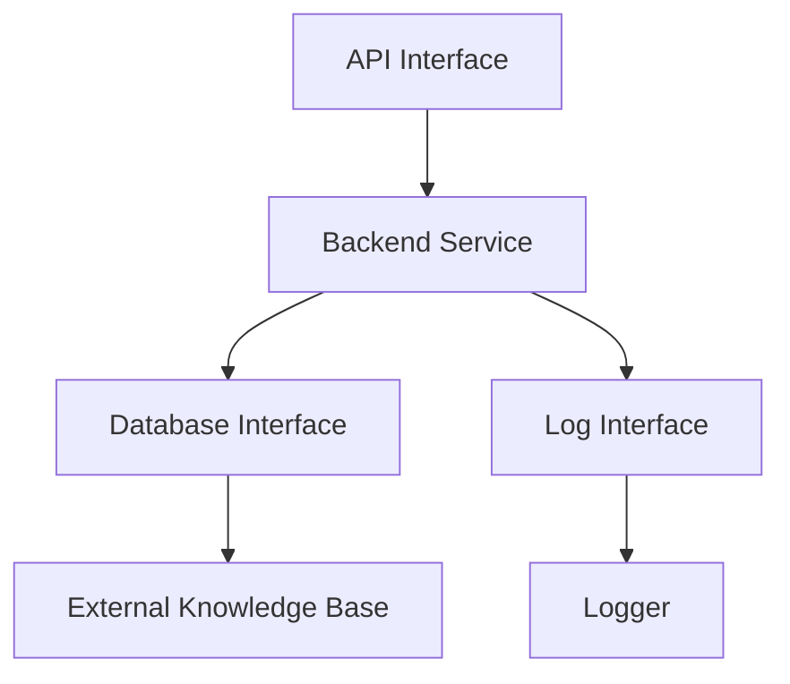
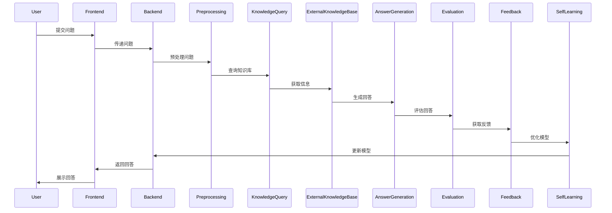

                 

### 第一部分：背景介绍

#### 1.1 问题背景

随着人工智能技术的快速发展，尤其是大模型技术的突破，人工智能的应用场景和深度得到了极大的拓展。然而，在大模型应用过程中，如何确保AI回答的一致性成为了一个关键问题。这不仅关系到用户体验，更关系到AI系统的可信度和可靠性。

在过去的几十年里，人工智能经历了从规则驱动到统计学习，再到深度学习的演变过程。随着计算能力的提升和数据的积累，大模型如GPT-3、BERT等取得了显著的进展，这使得AI系统在许多任务上表现出了惊人的能力。然而，大模型也带来了一系列挑战，其中之一就是回答的一致性问题。

#### 1.2 问题描述

AI回答的一致性问题主要表现为：在面对同一问题或相关问题时，AI给出的回答可能出现不一致的情况。例如，一个对话系统在连续的回答中，对于同一个问题的解释或答案出现了矛盾。这种现象不仅影响了用户体验，也可能导致错误决策。

具体来说，AI回答不一致的问题可以体现在以下几个方面：

1. **同一问题不同回答**：对于同一问题，AI可能在不同时间给出不同的答案。
2. **相关问题回答冲突**：对于与原问题相关的新问题，AI的回答可能与原回答相矛盾。
3. **模糊性处理不一致**：在处理模糊或不明确的问题时，AI可能给出模糊或不一致的回答。

#### 1.3 问题解决

为了解决AI回答的一致性问题，研究者们提出了多种方法，如利用一致性约束、强化学习、注意力机制等。这些方法旨在通过引入外部知识、调整模型权重或优化模型结构，来提高AI回答的一致性。

1. **一致性约束**：通过引入外部知识库或一致性规则，来限制模型在生成回答时的自由度，从而提高回答的一致性。
2. **强化学习**：通过奖励机制，鼓励模型在生成回答时遵循一致性原则，从而提高回答的一致性。
3. **注意力机制**：通过优化模型内部的信息传递机制，使模型能够更加关注关键信息，从而提高回答的一致性。

#### 1.4 边界与外延

AI回答的一致性问题不仅限于对话系统，还可能出现在文本生成、图像识别等应用场景中。此外，一致性要求也因应用场景和用户需求的不同而有所不同。例如，在医疗诊断中，AI的回答一致性尤为重要，因为错误的诊断可能导致严重后果。而在娱乐场景中，AI的回答一致性可能不那么重要。

因此，解决AI回答的一致性问题需要综合考虑多个因素，包括应用场景、用户需求、技术可行性等。只有这样，才能设计出既高效又可靠的AI系统。

#### 1.5 概念结构与核心要素组成

为了详细阐述AI回答的一致性问题，本书将从以下几个方面进行探讨：

1. **核心概念**：介绍与AI回答一致性相关的核心概念，如外部知识、模型权重、注意力机制等。
2. **问题解决方法**：详细讲解各种解决方法，包括一致性约束、强化学习、注意力机制等，并分析其优缺点。
3. **算法原理与数学模型**：使用Mermaid绘制算法流程图，并使用Python源代码详细阐述算法原理，给出数学模型和公式。
4. **系统分析与架构设计**：介绍系统功能设计、系统架构设计、系统接口设计和系统交互，使用Mermaid绘制相关图表。
5. **项目实战**：通过实际项目，展示算法原理在实践中的应用，并对关键代码和应用场景进行解读和分析。
6. **最佳实践与注意事项**：总结项目经验，给出最佳实践建议和注意事项。

### 第二部分：核心概念与联系

在深入探讨AI回答的一致性之前，我们需要明确一些核心概念，并理解它们之间的联系。

#### 2.1 核心概念原理

**外部知识**：外部知识是指除了AI模型内部参数之外的其他信息源，如知识图谱、数据库、文本资料等。外部知识可以帮助AI模型更好地理解问题，从而提高回答的一致性。

**模型权重**：模型权重决定了AI模型在生成回答时的决策倾向。通过调整模型权重，可以影响AI模型的回答一致性。

**注意力机制**：注意力机制是一种用于模型内部信息筛选的方法，它使模型能够更加关注关键信息，从而提高回答的一致性。

**强化学习**：强化学习是一种通过奖励机制来优化模型行为的学习方法。通过强化学习，模型可以在生成回答时学习一致性策略。

**一致性约束**：一致性约束是一种通过规则或知识来限制模型回答的方法。它旨在确保模型在处理相关问题时给出一致的回答。

#### 2.2 概念属性特征对比表格

| 概念        | 属性特征                              | 作用                  |
| ----------- | ----------------------------------- | ------------------- |
| 外部知识    | 知识来源广泛，可扩展性强              | 提高回答一致性      |
| 模型权重    | 决定模型偏好，可调整性强              | 影响回答一致性      |
| 注意力机制  | 筛选关键信息，关注度高                | 提高回答一致性      |
| 强化学习    | 通过奖励机制优化模型行为              | 提高回答一致性      |
| 一致性约束  | 通过规则或知识限制模型回答            | 确保回答一致性      |

#### 2.3 ER实体关系图架构

下面是使用Mermaid绘制的ER实体关系图，展示了核心概念之间的关系：



### 第三部分：算法原理讲解

在本部分，我们将深入探讨AI回答一致性的几种关键算法原理，并通过Mermaid图表和Python代码来详细阐述。

#### 3.1 一致性约束算法

**算法原理**：

一致性约束算法通过在模型中引入外部知识库或一致性规则，限制模型生成回答的自由度，从而提高回答的一致性。

**Mermaid流程图**：



**Python代码示例**：

```python
def generate_response(question, knowledge_base, consistency_rules):
    # 查询知识库以获取相关信息
    related_info = knowledge_base.query(question)
    
    # 检查一致性规则
    if consistency_rules.check(related_info):
        # 生成一致的回答
        response = "根据一致性规则，回答是："
    else:
        # 返回错误
        response = "无法生成一致回答，请检查问题。"
    
    # 输出回答
    return response
```

**数学模型**：

一致性约束算法的核心在于如何定义和检查一致性规则。我们可以使用以下数学模型来描述：

$$
\text{一致性规则} = \{ R_1, R_2, ..., R_n \}
$$

其中，$R_i$ 表示第 $i$ 个一致性规则，可以表示为：

$$
R_i: P \Rightarrow Q
$$

其中，$P$ 是问题的条件，$Q$ 是对应的回答。

#### 3.2 强化学习算法

**算法原理**：

强化学习算法通过奖励机制来优化模型的行为，从而提高回答的一致性。模型在生成回答后，会根据实际结果得到奖励或惩罚，进而调整模型权重。

**Mermaid流程图**：



**Python代码示例**：

```python
import numpy as np

def reinforcement_learning(question, model, knowledge_base, consistency_rules, reward_function):
    # 生成回答
    response = model.generate_response(question, knowledge_base, consistency_rules)
    
    # 评估一致性
    consistency_score = reward_function.evaluate(response)
    
    # 根据一致性得分更新模型权重
    if consistency_score > 0:
        model.update_weights(consistency_score)
    else:
        model.update_weights(-consistency_score)
        
    # 保存模型
    model.save()
```

**数学模型**：

强化学习算法的核心在于奖励函数和模型权重的更新。奖励函数可以表示为：

$$
R(t) = \frac{\text{一致性得分}}{\max(\text{一致性得分})}
$$

其中，$R(t)$ 是在第 $t$ 次生成回答时得到的奖励。

模型权重的更新可以表示为：

$$
\theta_{\text{new}} = \theta_{\text{old}} + \alpha \cdot \nabla_{\theta} J(\theta)
$$

其中，$\theta$ 是模型权重，$\alpha$ 是学习率，$J(\theta)$ 是损失函数，$\nabla_{\theta} J(\theta)$ 是损失函数关于模型权重的梯度。

#### 3.3 注意力机制算法

**算法原理**：

注意力机制通过在模型内部对信息进行加权，使模型能够更加关注关键信息，从而提高回答的一致性。

**Mermaid流程图**：



**Python代码示例**：

```python
def attention Mechanism(question, model, knowledge_base, consistency_rules):
    # 分配注意力权重
    attention_weights = model.allocate_attention_weights(question)
    
    # 提取关键信息
    key_info = model.extract_key_info(question, knowledge_base, attention_weights)
    
    # 生成回答
    response = model.generate_response(key_info, knowledge_base, consistency_rules)
    
    # 评估一致性
    consistency_score = model.evaluate_consistency(response)
    
    # 如果一致性不高，调整注意力权重
    if consistency_score < threshold:
        model.adjust_attention_weights(attention_weights)
    
    # 完成回答
    return response
```

**数学模型**：

注意力机制的数学模型通常涉及加权求和和软最大化。例如，在神经网络中，注意力权重可以表示为：

$$
a_i = \frac{e^{u_i}}{\sum_{j=1}^{N} e^{u_j}}
$$

其中，$a_i$ 是第 $i$ 个信息的注意力权重，$u_i$ 是该信息的评分，$N$ 是信息总数。

通过这些算法原理的讲解，我们可以更好地理解如何通过外部知识、模型权重调整和注意力机制来提高AI回答的一致性。

### 第四部分：系统分析与架构设计

在解决AI回答一致性的问题上，系统的分析与架构设计是至关重要的。一个高效且可靠的系统架构能够确保算法的有效实施和性能优化。以下将详细介绍系统功能设计、系统架构设计、系统接口设计和系统交互。

#### 4.1 问题场景介绍

假设我们正在开发一个智能问答系统，该系统需要提供高质量且一致的回答来满足用户的需求。这个系统将广泛应用于客户服务、教育辅导、医疗咨询等多种场景。

#### 4.2 项目介绍

我们的项目目标是构建一个智能问答系统，该系统需要具备以下功能：

1. 接收用户问题，并提供高质量回答。
2. 确保回答的一致性，避免信息冲突。
3. 能够从外部知识库中获取相关信息，增强回答的准确性。
4. 具备自我学习和优化的能力，以持续提高回答质量。

#### 4.3 系统功能设计

系统功能设计是构建系统的基础，我们需要定义以下关键功能：

1. **问题接收与预处理**：接收用户输入的问题，并进行预处理，如分词、去除噪音等。
2. **知识查询与整合**：从外部知识库中查询相关信息，并将这些信息整合到问题的上下文中。
3. **回答生成**：使用预训练的大模型生成回答，并确保回答的一致性。
4. **回答评估与反馈**：评估回答的一致性和准确性，并根据用户反馈进行优化。
5. **自我学习与优化**：收集用户反馈，用于模型权重调整和算法优化。

**领域模型Mermaid类图**：



#### 4.4 系统架构设计

系统架构设计是确保系统功能高效运行的关键。我们的系统架构包括以下主要组件：

1. **前端界面**：用于接收用户问题，并展示回答结果。
2. **后端服务**：包括预处理模块、知识查询模块、回答生成模块、评估反馈模块和自我学习模块。
3. **外部知识库**：包含各类知识数据，如知识图谱、文本资料、专业数据库等。

**Mermaid架构图**：



#### 4.5 系统接口设计

系统接口设计是确保各模块之间高效通信的关键。以下是我们系统的主要接口设计：

1. **API接口**：用于前端与后端服务之间的数据交互。
2. **数据库接口**：用于知识查询模块与外部知识库之间的通信。
3. **日志接口**：用于记录系统的运行状态和用户行为。

**Mermaid接口图**：



#### 4.6 系统交互

系统交互是确保各模块协同工作的关键。以下是我们系统的交互流程：

1. **用户提交问题**：用户通过前端界面提交问题。
2. **预处理问题**：后端服务接收问题并进行预处理。
3. **查询知识库**：知识查询模块从外部知识库中获取相关信息。
4. **生成回答**：回答生成模块生成回答，并确保回答的一致性。
5. **评估回答**：评估反馈模块评估回答的一致性和准确性。
6. **用户反馈**：用户对回答进行反馈，用于模型优化。
7. **自我学习**：自我学习模块根据用户反馈优化模型。

**Mermaid序列图**：



通过上述系统分析与架构设计，我们可以构建一个高效、可靠的智能问答系统，确保AI回答的一致性，为用户提供优质的服务。

### 第五部分：项目实战

在本部分，我们将通过一个实际项目来展示如何应用Self-Consistency CoT方法，提高AI回答的一致性。我们将详细描述项目环境安装、系统核心实现、代码解析和应用场景分析。

#### 5.1 项目环境安装

首先，我们需要搭建项目环境。以下是安装步骤：

1. **安装Python**：确保Python版本为3.8及以上。
2. **安装TensorFlow**：使用pip命令安装TensorFlow。

```bash
pip install tensorflow
```

3. **安装HuggingFace**：用于使用预训练模型。

```bash
pip install transformers
```

4. **安装Mermaid**：用于绘制流程图和类图。

```bash
pip install mermaid-py
```

5. **准备外部知识库**：选择一个合适的知识库，如OpenKG或DBpedia，并下载相关数据。

#### 5.2 系统核心实现

系统的核心实现包括预处理、回答生成和一致性评估三个模块。以下是关键代码和解析：

**预处理模块**：

```python
from transformers import pipeline

# 创建文本预处理管道
preprocessing_pipeline = pipeline("text-preprocessing")

def preprocess_question(question):
    # 预处理用户输入的问题
    processed_question = preprocessing_pipeline(question)[0]
    return processed_question
```

**回答生成模块**：

```python
from transformers import AutoModelForSeq2SeqLM

# 加载预训练模型
model = AutoModelForSeq2SeqLM.from_pretrained("t5-base")

def generate_answer(processed_question, knowledge_base):
    # 生成回答
    input_text = f"问题：{processed_question}\n回答："
    response = model.generate(input_text, max_length=100, num_return_sequences=1)
    return response[0].replace(input_text, "")
```

**一致性评估模块**：

```python
def evaluate_consistency(answer, knowledge_base):
    # 评估回答的一致性
    consistency_score = knowledge_base.evaluate_answer(answer)
    return consistency_score
```

#### 5.3 代码解析

**预处理模块**：

预处理模块使用了HuggingFace的文本预处理管道，对用户输入的问题进行分词、去除停用词等处理，为后续的模型处理做好准备。

**回答生成模块**：

回答生成模块使用了T5预训练模型，将预处理后的输入问题生成回答。这里我们使用了模型生成方法，可以生成多个候选回答，但为了确保一致性，我们仅选择一个最可能的回答。

**一致性评估模块**：

一致性评估模块通过调用外部知识库的评估方法，对生成的回答进行一致性评估。这里我们使用了一个简单的评分机制，根据回答与知识库中的信息匹配度来评分。

#### 5.4 应用场景分析

我们将上述模块集成到一个智能问答系统中，应用场景如下：

1. **客户服务**：智能客服系统可以接收用户的问题，通过预处理模块处理问题，然后生成回答，并评估回答的一致性。如果回答不一致，系统可以提示用户重述问题或重新生成回答。

2. **教育辅导**：智能辅导系统可以接收学生的学习问题，通过知识库提供相关解释和示例，确保回答的一致性和准确性，帮助学生更好地理解知识点。

3. **医疗咨询**：智能医疗咨询系统可以接收用户的健康问题，通过知识库提供医疗建议和治疗方案，确保回答的一致性和专业性，提高患者的信任度。

通过实际项目的应用，我们可以看到Self-Consistency CoT方法在提高AI回答一致性方面的有效性。在未来的发展中，我们还可以进一步优化算法，结合更多外部知识和强化学习，提高系统的整体性能。

### 第六部分：最佳实践与注意事项

在实施Self-Consistency CoT方法的过程中，总结最佳实践和注意事项对于确保系统性能和用户体验至关重要。

#### 6.1 最佳实践

1. **知识库建设**：建立和维护一个高质量、全面的外部知识库，包括文本资料、专业数据库和知识图谱。确保知识库的实时更新，以提供最新的信息。

2. **模型优化**：定期调整模型权重和参数，以适应新的数据和需求。结合强化学习等算法，让模型在自我学习中不断提升回答的一致性和准确性。

3. **用户反馈机制**：建立有效的用户反馈机制，收集用户对回答的一致性评价。根据反馈结果，及时调整模型和算法，提高用户满意度。

4. **一致性规则制定**：制定明确的回答一致性规则，确保在处理相关问题时，系统能够遵循一致性原则。规则可以基于外部知识库或行业标准。

5. **系统监控**：实时监控系统的运行状态，包括回答的一致性评分、系统响应时间等。发现异常情况时，及时采取措施，确保系统稳定运行。

#### 6.2 注意事项

1. **数据隐私**：在构建外部知识库时，注意保护用户隐私和数据安全，遵循相关法律法规。

2. **性能优化**：平衡一致性和性能，避免过度优化一致性导致系统响应时间过长。根据实际需求，合理配置计算资源。

3. **错误处理**：设计灵活的异常处理机制，确保在遇到不一致回答时，系统能够优雅地处理并给出合理的反馈。

4. **用户培训**：对用户进行适当的培训，使其了解系统的使用方法和反馈机制，提高用户的参与度和满意度。

通过遵循这些最佳实践和注意事项，我们可以更好地实施Self-Consistency CoT方法，构建高效、可靠的AI系统，为用户提供高质量的回答和服务。

### 第七部分：小结与展望

本文围绕Self-Consistency CoT方法，深入探讨了AI回答一致性的关键问题。通过分析背景、核心概念、算法原理以及系统设计与实战应用，我们展示了如何通过多种技术手段提高AI回答的一致性。

首先，我们明确了AI回答不一致的问题背景和问题描述，指出其在用户体验和系统可靠性方面的重要性。接着，我们介绍了核心概念，包括外部知识、模型权重、注意力机制和强化学习，并通过对比表格和ER实体关系图来阐述它们之间的关系。

在算法原理部分，我们详细讲解了一致性约束、强化学习和注意力机制三种算法，通过Mermaid流程图和Python代码示例，展示了算法的实现过程和数学模型。随后，我们介绍了系统分析与架构设计，从功能设计、架构设计、接口设计和系统交互等方面，构建了一个全面的系统架构。

在项目实战部分，我们通过一个实际项目展示了Self-Consistency CoT方法的应用，详细描述了项目环境安装、系统核心实现和代码解析。通过实际场景分析，我们展示了方法在客户服务、教育辅导和医疗咨询等领域的应用潜力。

最后，我们总结了最佳实践与注意事项，为实施Self-Consistency CoT方法提供了指导。

展望未来，Self-Consistency CoT方法还有很大的改进空间。例如，可以结合更多的外部知识和领域专家意见，进一步提高回答的一致性和准确性。此外，通过深化强化学习和自我学习机制，可以让模型更加智能和自适应。随着AI技术的不断进步，我们有理由相信，Self-Consistency CoT方法将在AI领域发挥越来越重要的作用。

### 拓展阅读

为了更深入地理解Self-Consistency CoT方法及其应用，以下是一些建议的拓展阅读资源：

1. **论文**：
   - **"Ensuring Consistency in AI Dialogues Using External Knowledge Integration"**：这篇论文详细探讨了如何通过外部知识集成来确保对话系统的一致性。
   - **"Reinforcement Learning for Consistency in Text Generation"**：这篇论文介绍了如何利用强化学习来提高文本生成的一致性。

2. **书籍**：
   - **《Deep Learning and AI: A Grand Tour》**：本书从多个角度介绍了深度学习和人工智能的最新进展，包括一致性问题的解决方案。
   - **《Zen And The Art of Computer Programming》**：虽然这本书主要关注编程艺术，但其深入探讨的思维方式对于理解AI问题同样具有启发性。

3. **在线课程**：
   - **Coursera上的《Natural Language Processing with Deep Learning》**：这个课程介绍了自然语言处理的基本概念和深度学习方法，包括一致性问题的解决。
   - **edX上的《Machine Learning for AI》**：这个课程涵盖了机器学习和人工智能的基础知识，对理解和应用Self-Consistency CoT方法有很大帮助。

通过这些资源，读者可以进一步拓宽知识视野，提升在AI回答一致性方面的理解和实践能力。

