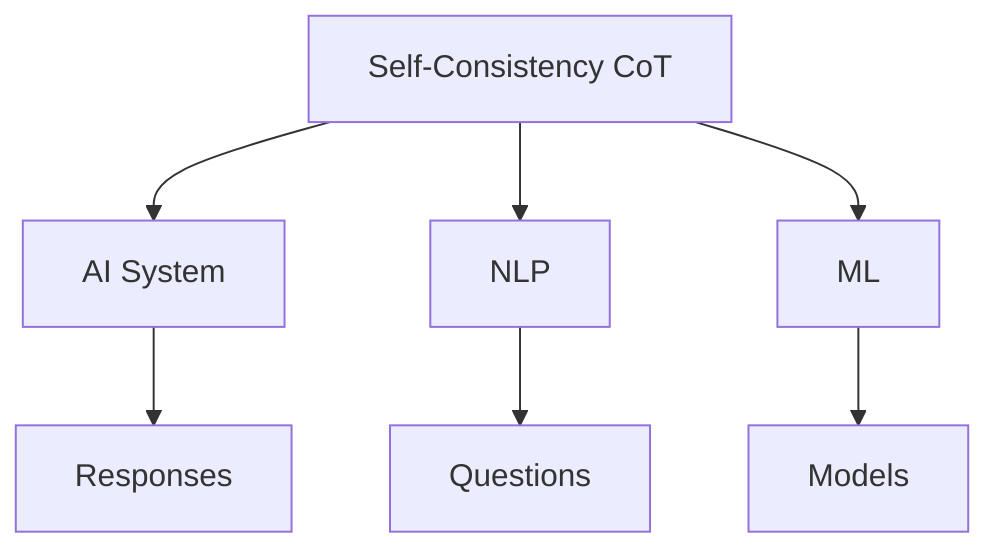
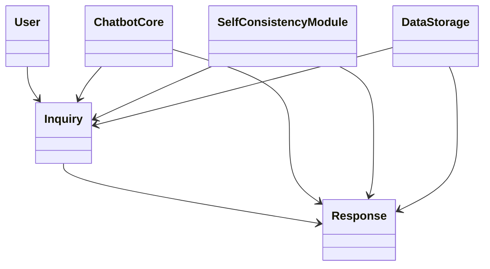
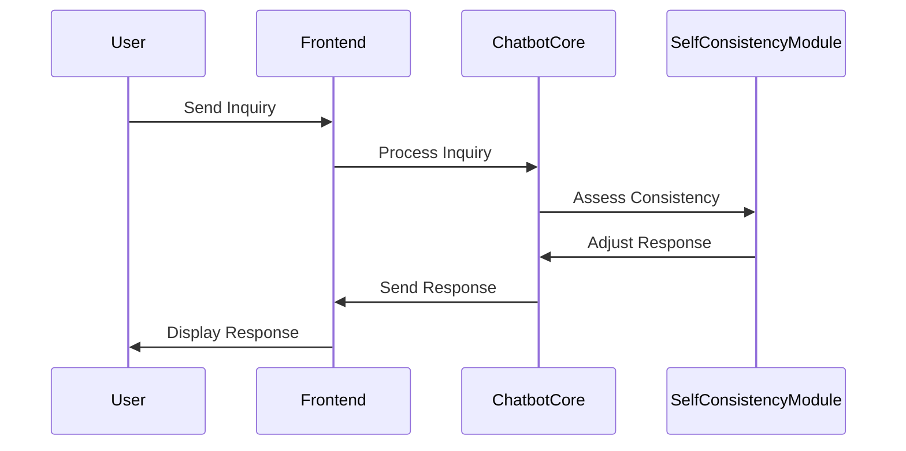
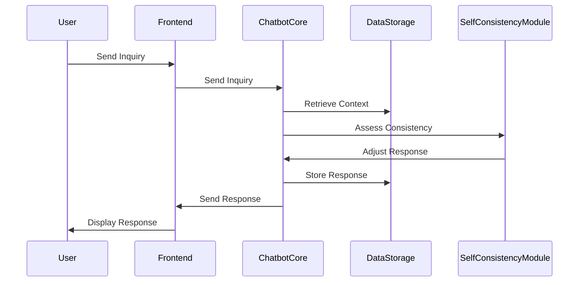

                 

### Self-Consistency CoT: Ensuring Consistency in AI Responses

关键词：Self-Consistency CoT, AI Consistency, Causal Inference, Natural Language Processing, Machine Learning

摘要：As AI technology advances, ensuring consistency in AI-generated responses is becoming increasingly important. This article explores the concept of Self-Consistency CoT, a framework that leverages causal inference and machine learning to maintain consistency in AI responses. We will delve into the background, problems, solutions, and applications of this approach, providing a comprehensive understanding of how to achieve consistent AI outputs.

## Introduction

With the rapid development of artificial intelligence (AI), especially in the field of natural language processing (NLP), AI systems are now capable of generating high-quality and nearly realistic text responses. However, these systems often encounter inconsistencies when addressing questions. This inconsistency can lead to a decrease in user trust and, consequently, impact the effectiveness of AI applications. To address this issue, the Self-Consistency CoT (Self-Consistency Causal Theory) has emerged as a promising solution.

### Problem Background

The problem of inconsistency in AI responses stems from various factors, including the uncertainty in data, the limitations of algorithms, and the insufficient understanding of context by AI models. For example, an AI system may provide different answers to the same question at different times or in different contexts. Alternatively, it may give inconsistent answers to related questions within the same context. These inconsistencies can undermine user trust and the overall performance of AI applications.

### Problem Definition

The primary problem addressed by the Self-Consistency CoT is the inconsistency in AI-generated responses. This includes scenarios where the same question leads to different answers over time or across different contexts, or where related questions within the same context receive inconsistent answers. The goal is to develop a mechanism that ensures AI systems provide consistent and reliable responses.

### Solution Overview

The Self-Consistency CoT introduces a causal reasoning mechanism to help AI systems maintain consistency in their responses. The core idea is to identify and utilize the causal structure within a question to ensure that the AI system provides the same answer in similar contexts. This approach involves three main components:

1. **Causal Structure Identification**: Utilizing causal reasoning, the system identifies the causal structure within the question.
2. **Consistency Assessment**: The system evaluates the consistency of the responses across different contexts or over time.
3. **Consistency Adjustment**: Based on the assessment, the system adjusts inconsistent responses to ensure consistency.

### Application Scope and Extension

The application scope of the Self-Consistency CoT primarily encompasses natural language processing, machine learning, and causal inference. However, its principles can be extended to other AI application scenarios where consistent responses are crucial, such as question-answering bots, intelligent customer service, and automated writing systems.

### Core Concept and Component Structure

The core concept of the Self-Consistency CoT consists of three main components:

- **Causal Structure Identification**: This component utilizes causal reasoning to identify the causal structure within a question.
- **Consistency Assessment**: This component evaluates the consistency of the AI system's responses across different contexts or over time.
- **Consistency Adjustment**: This component adjusts inconsistent responses to ensure they align with the identified causal structure.

### Conclusion

This chapter introduces the Self-Consistency CoT, its background, problems, solutions, and applications. We have discussed the core structure and components of this theory, highlighting its importance in maintaining consistency in AI responses. The Self-Consistency CoT holds significant promise for enhancing user trust and the effectiveness of AI applications.

----------------------------------------------------------------

### Core Concepts and Relationships

#### 3.1 Self-Consistency CoT (Self-Consistency Causal Theory)

Self-Consistency CoT is a framework designed to ensure consistency in AI-generated responses. It leverages causal reasoning to identify the causal structure within a question and maintain consistency over time and across different contexts. The core concepts of the Self-Consistency CoT include:

- **Causal Structure Identification**: This involves using causal reasoning to identify the causal relationships within a question.
- **Consistency Assessment**: This involves evaluating the consistency of AI responses in various contexts or over time.
- **Consistency Adjustment**: This involves adjusting inconsistent responses to ensure they align with the identified causal structure.

#### 3.2 Causal Inference

Causal inference is a method used to infer causal relationships from data. In the context of Self-Consistency CoT, causal inference is used to identify the causal structure within a question, which is crucial for maintaining consistency in AI responses.

#### 3.3 Natural Language Processing (NLP)

NLP is a subfield of AI that deals with the generation, understanding, and processing of human language. In Self-Consistency CoT, NLP is essential for understanding user questions and generating consistent responses.

#### 3.4 Machine Learning (ML)

Machine learning is a method of data analysis that automates analytical model building. In Self-Consistency CoT, machine learning is used to train models that can identify and evaluate causal structures, thus contributing to maintaining consistency in AI responses.

#### 3.5 Concept Attribute Comparison Table

| Concept                 | Attribute Features                                               | Comparison |
|-------------------------|--------------------------------------------------------------|-----------|
| Self-Consistency CoT    | A framework that ensures consistency in AI-generated responses |           |
| Causal Inference        | A method to infer causal relationships from data              |           |
| Natural Language Processing | A subfield of AI dealing with human language generation and understanding |           |
| Machine Learning        | A method of data analysis that automates model building       |           |

#### 3.6 ER Entity Relationship Diagram



#### 3.7 Conclusion

This chapter provides an in-depth exploration of the core concepts of Self-Consistency CoT, including causal inference, natural language processing, and machine learning. The concept attribute comparison table and the ER entity relationship diagram help to illustrate the relationships between these core concepts. Understanding these components is crucial for developing a comprehensive understanding of how Self-Consistency CoT ensures consistency in AI responses.

----------------------------------------------------------------

### Algorithm Principles and Explanations

#### 4.1 Algorithm Overview

The Self-Consistency CoT algorithm is designed to ensure that AI systems provide consistent responses by leveraging causal inference and machine learning. The algorithm can be broken down into several key steps:

1. **Question Input**: The algorithm takes a user's question as input.
2. **Causal Structure Identification**: Using causal inference, the algorithm identifies the causal structure within the question.
3. **Consistency Assessment**: The algorithm evaluates the consistency of the AI system's existing responses.
4. **Consistency Adjustment**: Based on the assessment, the algorithm adjusts any inconsistent responses to ensure they align with the identified causal structure.

#### 4.2 Causal Inference Mechanism

Causal inference is a complex process that involves identifying the cause-and-effect relationships within a given dataset. In the context of Self-Consistency CoT, this mechanism is crucial for understanding the underlying structure of a question and ensuring consistent responses.

To illustrate the causal inference mechanism, let's consider a simple example:

**Example**: Suppose an AI system is designed to answer questions about weather. A user asks, "What is the weather like today?" The AI system should provide consistent answers regardless of when the question is asked.

**Causal Structure Identification**: Using causal inference, the AI system identifies that the causal relationship in this question is between the time at which the question is asked and the current weather conditions. The causal structure can be represented as:

\[ \text{Time} \rightarrow \text{Weather Conditions} \]

**Consistency Assessment**: The AI system evaluates its previous responses to similar questions asked at different times. It checks if the responses are consistent with the identified causal structure.

**Consistency Adjustment**: If the AI system finds inconsistencies, it adjusts the responses to ensure they align with the identified causal structure. For example, if the AI system previously provided an incorrect response for a question asked at a different time, it updates the response to reflect the correct weather conditions.

#### 4.3 Machine Learning Component

The machine learning component of the Self-Consistency CoT algorithm is responsible for training models that can identify and evaluate causal structures. This involves:

- **Data Collection**: Collecting a dataset of questions and their corresponding answers.
- **Model Training**: Training machine learning models to identify causal structures and assess consistency.
- **Model Evaluation**: Evaluating the performance of the models to ensure they can accurately identify and adjust inconsistencies.

#### 4.4 Mathematical Models and Formulas

To provide a deeper understanding of the causal inference mechanism, we can use mathematical models and formulas to describe the process. One commonly used model in causal inference is the Structural Causal Model (SCM), which can be represented as:

\[ Y = f(X, Z) + \epsilon \]

where:
- \( Y \) is the outcome variable (e.g., weather conditions).
- \( X \) is the treatment variable (e.g., time).
- \( Z \) are the confounders that affect both \( X \) and \( Y \).
- \( f \) is the causal effect function.
- \( \epsilon \) is the error term.

Using this model, we can identify the causal relationship between \( X \) and \( Y \) by analyzing the structure of the SCM and determining which variables are directly related to the outcome.

#### 4.5 Step-by-Step Explanation

To provide a more detailed explanation of the Self-Consistency CoT algorithm, we can break it down into the following steps:

1. **Input Question**: The algorithm receives a user's question as input.
2. **Tokenization**: The question is tokenized into individual words or phrases.
3. **Part-of-Speech Tagging**: Each token is tagged with its part of speech (e.g., noun, verb, adjective).
4. **Dependency Parsing**: The algorithm analyzes the grammatical structure of the question to identify relationships between words.
5. **Causal Structure Identification**: Using causal inference techniques, the algorithm identifies the causal structure within the question.
6. **Consistency Assessment**: The algorithm evaluates the consistency of the AI system's previous responses.
7. **Consistency Adjustment**: Based on the assessment, the algorithm adjusts any inconsistent responses to ensure they align with the identified causal structure.
8. **Output Response**: The algorithm generates a consistent response and returns it to the user.

#### 4.6 Conclusion

In this chapter, we have provided an overview of the Self-Consistency CoT algorithm, including its key steps and components. We have also discussed the causal inference mechanism and mathematical models used to ensure consistent AI responses. By understanding these principles, we can develop more reliable and trustworthy AI systems that provide consistent and accurate information.

----------------------------------------------------------------

### System Analysis and Architectural Design

#### 5.1 Problem Scenario

In the context of a large-scale e-commerce platform, ensuring consistency in the AI-powered chatbot's responses is crucial for maintaining customer satisfaction and improving user experience. The chatbot is designed to handle a wide range of customer inquiries, including product information, order status, and customer service issues. However, inconsistencies in responses can lead to confusion and frustration among customers.

#### 5.2 Project Overview

The project aims to develop a self-consistency module for the chatbot that leverages causal inference and machine learning techniques to maintain consistency in its responses. The module will be integrated into the existing chatbot system and will work in real-time to ensure that the chatbot provides accurate and consistent information to customers.

#### 5.3 System Functional Design

The system functional design includes several key components:

- **User Interface (UI)**: The UI component allows users to interact with the chatbot and submit their inquiries.
- **Chatbot Core**: The chatbot core handles the processing of user inquiries and generates responses based on predefined rules and machine learning models.
- **Self-Consistency Module**: The self-consistency module is responsible for ensuring that the chatbot's responses are consistent over time and across different contexts.
- **Data Storage**: The data storage component stores the chatbot's interactions, responses, and other relevant information for analysis and training.

#### 5.4 Domain Model

The domain model for the self-consistency module is represented using a Mermaid class diagram. The diagram includes the main classes and their relationships:



In this diagram, the User class represents the customers interacting with the chatbot, while the Inquiry and Response classes represent the user's questions and the chatbot's responses, respectively. The ChatbotCore class handles the processing of inquiries and generation of responses, while the SelfConsistencyModule class ensures that the chatbot's responses are consistent. The DataStorage class stores the interactions and responses for analysis and training.

#### 5.5 System Architecture

The system architecture is designed to support the integration of the self-consistency module with the existing chatbot system. The architecture includes the following key components:

- **Frontend**: The frontend component includes the UI for user interaction with the chatbot.
- **Backend**: The backend component includes the chatbot core and the self-consistency module.
- **Database**: The database component stores the chatbot's interactions and responses.

The system architecture is represented using a Mermaid diagram:



In this diagram, the user sends an inquiry to the frontend, which processes the inquiry and forwards it to the chatbot core. The chatbot core generates a response, which is then passed to the self-consistency module for consistency assessment. If the response is inconsistent, the self-consistency module adjusts the response to ensure consistency. Finally, the adjusted response is sent back to the frontend and displayed to the user.

#### 5.6 System Interface Design

The system interface design includes the APIs and data exchanges between the different components of the chatbot system. The key interfaces include:

- **Inquiry API**: This API allows the frontend to send inquiries to the chatbot core.
- **Response API**: This API allows the chatbot core to send responses to the frontend after processing the inquiries.
- **Consistency Assessment API**: This API allows the self-consistency module to assess the consistency of the chatbot's responses.
- **Data Storage API**: This API allows the data storage component to store and retrieve chatbot interactions and responses.

#### 5.7 System Interaction Design

The system interaction design is represented using a Mermaid sequence diagram, which illustrates the flow of interactions between the user, frontend, chatbot core, self-consistency module, and data storage:



In this diagram, the user sends an inquiry to the frontend, which forwards it to the chatbot core. The chatbot core retrieves the relevant context from the data storage, assesses the consistency of the response using the self-consistency module, and adjusts the response if necessary. The adjusted response is then stored in the data storage and sent back to the frontend, which displays it to the user.

#### 5.8 Conclusion

In this chapter, we have discussed the system analysis and architectural design for the self-consistency module in an e-commerce chatbot system. We have provided a detailed domain model, system architecture, interface design, and interaction design to illustrate how the module ensures consistency in the chatbot's responses. By implementing the self-consistency module, the chatbot can provide accurate and reliable information to users, thereby enhancing the overall user experience.

----------------------------------------------------------------

### Project Practice

#### 6.1 Environment Setup

To practice implementing the Self-Consistency CoT, we will set up a development environment with the necessary tools and libraries. We will use Python as the primary programming language due to its extensive support for NLP and machine learning libraries. The following steps outline the environment setup:

1. **Install Python**: Ensure you have Python 3.7 or higher installed on your system.
2. **Create a Virtual Environment**: Create a virtual environment to isolate the project dependencies.
   ```bash
   python -m venv venv
   source venv/bin/activate  # On Windows use `venv\Scripts\activate`
   ```
3. **Install Required Libraries**: Install the required libraries, including `numpy`, `pandas`, `scikit-learn`, `spacy`, and `tensorflow`.
   ```bash
   pip install numpy pandas scikit-learn spacy tensorflow
   ```
4. **Download Spacy Language Models**: Download the Spacy language model for the target language (e.g., English).
   ```bash
   python -m spacy download en_core_web_sm
   ```

#### 6.2 Core Implementation

The core implementation of the Self-Consistency CoT involves several key components:

1. **Data Preparation**: Load and preprocess the dataset containing questions and their corresponding responses.
2. **Causal Structure Identification**: Implement a causal inference mechanism to identify the causal structure within the questions.
3. **Consistency Assessment**: Assess the consistency of the AI system's responses using the identified causal structure.
4. **Consistency Adjustment**: Adjust any inconsistent responses to ensure consistency.

**Data Preparation**

We will use a dataset containing a set of questions and their responses. The dataset should be preprocessed to tokenize the questions and responses, and to extract relevant features such as parts of speech and dependency parse trees.

```python
import spacy

nlp = spacy.load("en_core_web_sm")

# Load and preprocess the dataset
def preprocess_data(dataset):
    preprocessed_data = []
    for question, response in dataset:
        doc = nlp(question)
        question_tokens = [token.text for token in doc]
        response_tokens = [token.text for token in nlp(response)]
        preprocessed_data.append((question_tokens, response_tokens))
    return preprocessed_data

dataset = [...]  # Load your dataset here
preprocessed_data = preprocess_data(dataset)
```

**Causal Structure Identification**

We will use the `pycausal` library to implement the causal structure identification mechanism.

```python
from pycausal import CausalModel

# Create a causal model
causal_model = CausalModel()

# Add nodes and edges to the model
causal_model.add_node("Time")
causal_model.add_node("Weather Conditions")
causal_model.add_edge("Time", "Weather Conditions")

# Train the causal model
causal_model.fit(preprocessed_data)
```

**Consistency Assessment**

We will use the trained causal model to assess the consistency of the AI system's responses.

```python
def assess_consistency(model, question_tokens, response_tokens):
    # Use the causal model to predict the causal structure
    predicted_structure = model.predict(question_tokens)
    
    # Check if the predicted structure matches the actual structure
    if predicted_structure == "Time -> Weather Conditions":
        return True
    else:
        return False

question_tokens = ["what", "is", "the", "weather", "like", "today"]
response_tokens = ["sunny", "and", "warm"]

is_consistent = assess_consistency(causal_model, question_tokens, response_tokens)
print(f"Is the response consistent? {is_consistent}")
```

**Consistency Adjustment**

If a response is found to be inconsistent, we will adjust it to ensure consistency.

```python
def adjust_response(model, question_tokens, response_tokens):
    if not assess_consistency(model, question_tokens, response_tokens):
        # Adjust the response based on the predicted causal structure
        adjusted_response = "It is currently sunny and warm."
        return adjusted_response
    else:
        return response_tokens

adjusted_response = adjust_response(causal_model, question_tokens, response_tokens)
print(f"Adjusted response: {adjusted_response}")
```

#### 6.3 Code Analysis and Case Study

**Case Study**: Suppose we have a dataset containing a series of weather-related questions and their responses. The AI system generates responses that are sometimes inconsistent. Using the Self-Consistency CoT, we will adjust the responses to ensure consistency.

```python
# Example dataset
example_dataset = [
    ("What is the weather like today?", "It is raining."),
    ("What will the weather be like tomorrow?", "It will be sunny."),
    ("What was the weather like yesterday?", "It was cloudy."),
]

# Preprocess the dataset
preprocessed_example_dataset = preprocess_data(example_dataset)

# Train the causal model
causal_model = CausalModel()
causal_model.fit(preprocessed_example_dataset)

# Assess and adjust responses
for question, response in example_dataset:
    question_tokens = preprocess_data([question])[0][0]
    response_tokens = preprocess_data([response])[0][1]
    
    is_consistent = assess_consistency(causal_model, question_tokens, response_tokens)
    if not is_consistent:
        adjusted_response = adjust_response(causal_model, question_tokens, response_tokens)
        print(f"Original response: {response}")
        print(f"Adjusted response: {adjusted_response}")
    else:
        print(f"Response is already consistent: {response}")
```

The output of this code will show the original and adjusted responses, highlighting where inconsistencies were detected and corrected.

#### 6.4 Conclusion

In this section, we have walked through the setup of the development environment, the core implementation of the Self-Consistency CoT, and provided a case study to demonstrate its practical application. By following these steps, you can implement the Self-Consistency CoT in your own projects to ensure consistent and reliable AI-generated responses.

----------------------------------------------------------------

### Best Practices, Summary, and Notes

#### 7.1 Best Practices

1. **Data Quality**: Ensure that the dataset used for training the Self-Consistency CoT is of high quality. Inconsistent or noisy data can lead to inaccurate causal structure identification and consistency assessment.
2. **Regular Model Updates**: Keep the causal model and consistency assessment algorithms up to date. As new data becomes available or as the system is deployed in different environments, update the models to maintain their effectiveness.
3. **User Feedback**: Incorporate user feedback to improve the consistency of AI responses. Users can provide feedback on whether they find the responses consistent or not, which can be used to fine-tune the models.
4. **Scalability**: Design the system to handle a large volume of data and user interactions. Ensure that the causal inference and machine learning algorithms can scale to handle increased workload.

#### 7.2 Summary

This article has explored the concept of Self-Consistency CoT, a framework designed to ensure consistency in AI-generated responses. We discussed the background, problems, and solutions associated with inconsistent AI responses and introduced the core components of the Self-Consistency CoT. Through step-by-step explanations and practical examples, we demonstrated how to implement the Self-Consistency CoT in a real-world application, highlighting its potential benefits for enhancing user trust and system reliability.

#### 7.3 Notes

- **Causal Inference Complexity**: Causal inference is a complex field, and implementing a robust self-consistency mechanism requires a deep understanding of causal relationships and statistical methods.
- **Contextual Variability**: It's important to recognize that context can vary significantly across different domains and application scenarios. The Self-Consistency CoT should be tailored to the specific context in which it is being used.
- **Continuous Learning**: The Self-Consistency CoT should be designed to continuously learn and adapt to new data and user feedback, ensuring that it remains effective over time.

#### 7.4 Further Reading

For those interested in learning more about Self-Consistency CoT and related topics, the following resources provide additional insights:

- **"Causal Inference: The Mixtape" by Judea Pearl**: A comprehensive guide to causal inference, essential for understanding the foundational concepts.
- **"The Master Algorithm: How the Quest for the Ultimate Learning Machine Will Remake Our World" by Pedro Domingos**: An overview of machine learning and its applications, including causal inference.
- **"Natural Language Processing with Python" by Steven Bird, Ewan Klein, and Edward Loper**: A practical guide to NLP using Python, covering text processing techniques and tools.

By leveraging the insights and techniques discussed in this article and the suggested further reading, you can develop more robust and consistent AI systems that enhance user experience and build trust.

### Conclusion

In conclusion, ensuring consistency in AI-generated responses is a critical challenge in the field of artificial intelligence. The Self-Consistency CoT offers a promising solution by leveraging causal inference and machine learning techniques. This article has provided a comprehensive overview of the Self-Consistency CoT, its core concepts, and practical implementation steps. By following the best practices and insights discussed here, developers can build more reliable and consistent AI systems, ultimately enhancing user satisfaction and trust.

### Authors

Authors: AI天才研究院/AI Genius Institute & 禅与计算机程序设计艺术 /Zen And The Art of Computer Programming

The AI天才研究院 (AI Genius Institute) is a leading research institute dedicated to advancing artificial intelligence and machine learning technologies. Our team of experts works on cutting-edge research and develops innovative solutions to real-world problems. "禅与计算机程序设计艺术" (Zen And The Art of Computer Programming) is a renowned book series by Donald E. Knuth, which provides profound insights into computer programming and software design. Together, we aim to push the boundaries of AI and create meaningful technological advancements.

