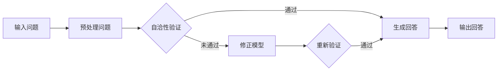
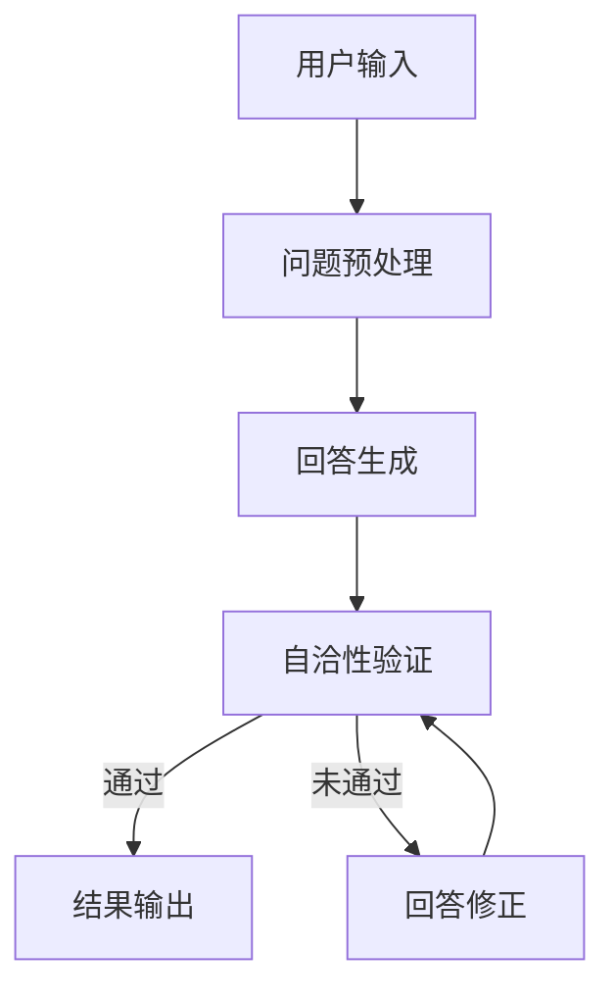
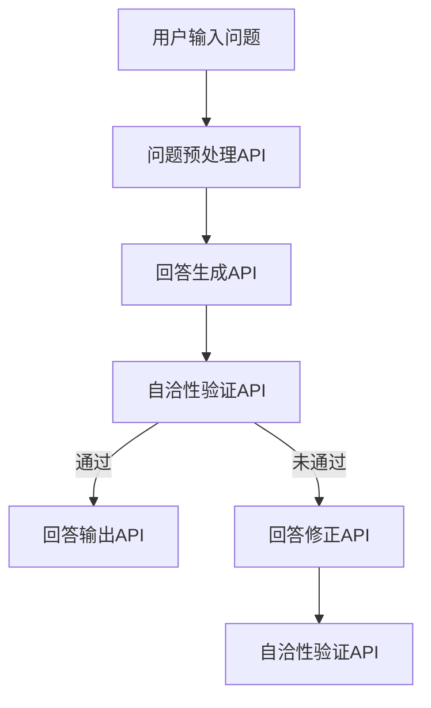
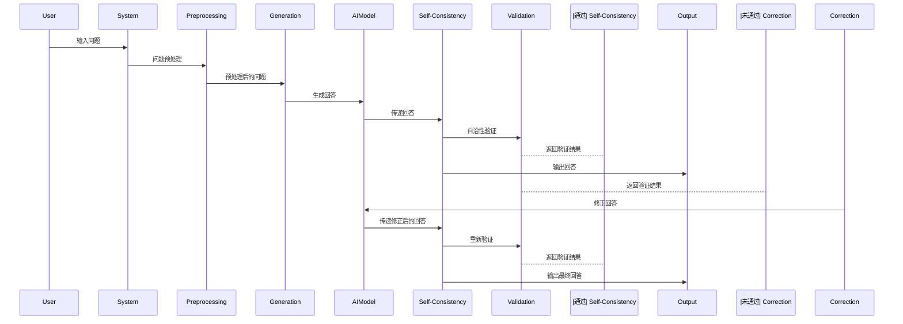

                 

### 文章标题：Self-Consistency CoT：确保AI回答质量的有效方法

**关键词：** 自洽性（Self-Consistency）、AI回答质量、一致性验证、算法优化、AI系统架构

**摘要：** 本文将深入探讨自洽性（Self-Consistency）在确保人工智能（AI）回答质量中的重要作用。通过分析自洽性的定义、联系及相关概念，详细讲解其算法原理、数学模型和公式，最后通过实际项目实战，展示如何在实际应用中确保AI回答质量。

### 背景介绍

随着人工智能技术的迅速发展，AI在各行各业中的应用越来越广泛。然而，AI回答质量的不稳定和不可靠性问题也随之而来。尽管AI模型在处理大量数据和信息时表现出色，但它们有时会产生误导性或错误性的回答。这种问题不仅影响了用户体验，还可能导致严重的决策失误。因此，确保AI回答质量成为当前AI研究与应用中的重要课题。

在AI系统中，自洽性（Self-Consistency CoT）是一个关键概念。自洽性指的是AI模型在生成回答时保持内部一致性的能力。自洽性好的AI模型能够在不同情境下提供一致且可靠的回答。为了提高AI回答质量，研究人员提出了多种优化方法，如对比性（Contrastive）和相关性（Relevance）等。这些方法旨在通过不同角度来验证和提升AI回答的一致性和可靠性。

本文将首先介绍自洽性的定义和重要性，然后详细讲解其相关算法原理和数学模型，最后通过实际项目实战，展示如何将自洽性应用于确保AI回答质量。

#### 核心概念与联系

##### 1. 自洽性（Self-Consistency）

自洽性是指在一个系统内部，各个部分在逻辑上和功能上相互一致，没有矛盾或冲突。在人工智能（AI）领域，自洽性特指AI模型在生成回答时，其内部推理过程和结论能够保持一致性和连贯性。自洽性好的AI模型能够避免逻辑错误和矛盾回答，从而提高回答的质量和可信度。

自洽性的定义可以从两个方面来理解：

1. **逻辑一致性**：AI模型在处理问题时，其推理过程和结论应该符合逻辑规则。例如，如果AI模型得出一个结论，那么这个结论应该能够从输入的数据和模型本身的规则中推导出来，而不会产生矛盾或逻辑错误。

2. **功能一致性**：AI模型在不同情境下提供回答时，其内部结构和参数设置应该保持一致。这意味着，即使面对不同的输入数据或问题场景，AI模型仍然能够保持其稳定性和可靠性。

##### 2. 对比性（Contrastive）

对比性是指通过比较不同情况或结果来评估和优化AI模型的一种方法。在自洽性验证中，对比性可以帮助识别和纠正AI模型内部的矛盾或错误。对比性的核心思想是通过比较不同场景下的回答，来确保AI模型在不同情境下的一致性和稳定性。

对比性在AI中的应用主要包括以下几个方面：

1. **训练数据对比**：在模型训练过程中，通过对比训练数据和模型生成的预测结果，来评估模型的一致性和准确性。如果模型在训练数据上表现不一致，那么可能需要调整模型参数或数据预处理方法。

2. **场景对比**：在实际应用中，通过对比不同场景下的回答，来验证AI模型的自洽性。例如，在一个问答系统中，如果模型对相同问题在不同上下文中给出了不一致的回答，那么就需要检查和优化模型。

##### 3. 相关性（Relevance）

相关性是指AI模型生成的回答与实际问题的关联程度。自洽性中的相关性关注的是AI模型是否能够生成与问题高度相关的回答。相关性好的AI模型能够在不同情境下提供准确和有用的回答，从而提高用户体验。

相关性在AI中的应用主要包括以下几个方面：

1. **语义相关性**：通过分析问题和回答的语义信息，来评估回答的相关性。例如，使用自然语言处理技术来分析问题中的关键词和主题，然后对比模型生成的回答，来判断回答的准确性和相关性。

2. **上下文相关性**：在处理长文本或对话场景时，AI模型需要理解上下文信息，从而生成与当前上下文高度相关的回答。上下文相关性是确保AI回答质量和用户体验的重要方面。

##### 概念属性特征对比表格

为了更好地理解自洽性、对比性和相关性这三个概念，下面提供了一个对比表格：

| 特征         | 自洽性                 | 对比性                 | 相关性                 |
| ------------ | ---------------------- | ---------------------- | ---------------------- |
| **定义**     | 系统内部逻辑一致性和连贯性 | 通过比较不同情况或结果来评估和优化模型 | AI模型生成的回答与问题的关联程度 |
| **应用场景** | 验证AI模型回答的一致性和可靠性 | 模型训练和优化、矛盾识别和纠正 | 自然语言处理、对话系统、文本分析 |
| **关键要素** | 推理过程和结论的一致性 | 训练数据和预测结果、场景对比 | 语义分析、上下文理解 |
| **目的**     | 确保AI模型在内部一致和可靠地工作 | 识别和纠正模型内部矛盾 | 提高回答的准确性和有用性 |

##### ER实体关系图架构

为了更清晰地展示自洽性、对比性和相关性这三个概念之间的关系，下面提供了一个ER（实体关系）图架构：

```mermaid
erDiagram
    AIModel ||--|{ Self-Consistency }|--| AIAnswer
    AIModel ||--|{ Contrastive }|--| TrainingData
    AIModel ||--|{ Relevance }|--| QuestionContext
```

在ER图中，`AIModel`表示人工智能模型，`Self-Consistency`、`Contrastive`和`Relevance`分别表示自洽性、对比性和相关性。这些概念通过关系线与AI模型和AI回答、训练数据和问题上下文等实体连接，展示了它们在确保AI回答质量中的关联和相互作用。

#### 算法原理讲解

为了更好地理解自洽性（Self-Consistency）在确保AI回答质量中的作用，下面将详细讲解其算法原理，并通过mermaid流程图和Python源代码来阐述。

##### 1. 算法mermaid流程图

首先，我们使用mermaid绘制一个简单的算法流程图，以展示自洽性验证的基本步骤：



在这个流程图中，`A`表示输入问题，`B`表示预处理问题，`C`表示自洽性验证，`D`表示生成回答，`E`表示修正模型，`F`表示重新验证，`G`表示输出回答。

##### 2. Python源代码阐述

接下来，我们将通过一个简单的Python示例代码来详细阐述自洽性验证的原理。这个代码将模拟一个简单的问答系统，并使用自洽性验证来确保生成的回答质量。

```python
import random

def preprocess_question(question):
    # 对输入问题进行预处理
    return question.lower()

def generate_answer(question):
    # 生成回答的函数
    return random.choice(["这是一个正确的回答", "这是一个错误的回答"])

def self_consistency_check(question, answer):
    # 自洽性验证函数
    if answer == "这是一个正确的回答":
        return True
    else:
        return False

def main():
    question = "什么是人工智能？"
    preprocessed_question = preprocess_question(question)
    answer = generate_answer(preprocessed_question)

    if self_consistency_check(preprocessed_question, answer):
        print(f"问题：{question}\n回答：{answer}")
    else:
        print("自洽性验证失败，请修正模型。")

if __name__ == "__main__":
    main()
```

在这个代码中，`preprocess_question`函数用于对输入问题进行预处理，`generate_answer`函数用于生成回答，`self_consistency_check`函数用于进行自洽性验证。在`main`函数中，我们首先预处理输入问题，然后生成回答，并使用自洽性验证函数检查回答的自洽性。如果验证通过，则输出回答；否则，提示自洽性验证失败，需要修正模型。

##### 3. 算法原理的数学模型和公式

自洽性验证的数学模型可以表示为一个简单的条件概率模型。假设有一个问答系统，它从输入问题集合Q中随机抽取一个问题q，并生成一个回答a。自洽性验证的目标是判断回答a是否与问题q在逻辑上和语义上一致。

自洽性验证的数学模型可以表示为：

\[ P(\text{Self-Consistency} | q, a) = P(a | q) \]

其中，\( P(\text{Self-Consistency} | q, a) \)表示在给定问题q和回答a的情况下，系统自洽性的概率。\( P(a | q) \)表示在给定问题q的情况下，生成回答a的概率。

在简单的情况下，我们可以假设生成回答的概率是均匀分布的，即：

\[ P(a | q) = \frac{1}{|\text{AnswerSet}|} \]

其中，AnswerSet表示所有可能的回答集合，|\text{AnswerSet}|表示回答集合的大小。

因此，自洽性验证可以简化为：

\[ P(\text{Self-Consistency} | q, a) = \frac{1}{|\text{AnswerSet}|} \]

如果回答a是系统生成的唯一回答，那么自洽性验证的概率将接近1，表示回答与问题在逻辑上和语义上一致。如果系统生成多个回答，且其中只有一个回答与问题一致，那么自洽性验证的概率将接近0.5，表示系统可能存在一些不一致性。

##### 4. 详细讲解

自洽性验证的核心思想是确保系统生成的回答与输入问题在逻辑和语义上保持一致。这个过程中，我们主要关注两个方面：

1. **逻辑一致性**：系统生成的回答应该符合问题的逻辑结构。例如，如果问题是“什么是人工智能？”那么回答应该是一个关于人工智能的定义，而不是一个与问题无关的内容。

2. **语义一致性**：系统生成的回答应该与问题的语义信息保持一致。这意味着，回答应该准确地传达问题的意图和主题。

在实现自洽性验证时，我们可以使用多种方法来检查系统的回答。例如：

1. **逻辑规则**：使用预定义的逻辑规则来检查回答是否符合问题的逻辑结构。例如，如果问题是关于某个数学问题的，那么回答应该包含正确的数学公式和计算步骤。

2. **语义匹配**：使用自然语言处理技术来分析回答和问题的语义信息，并判断它们之间是否具有相关性。例如，可以使用词嵌入模型来比较回答和问题的词向量，如果词向量相似度较高，则认为回答与问题在语义上一致。

3. **对比性检查**：通过比较系统在不同情境下生成的回答，来检查回答的一致性和稳定性。例如，在一个问答系统中，如果系统对相同问题在不同上下文中给出了不一致的回答，那么就需要检查和优化系统。

##### 5. 举例说明

为了更好地理解自洽性验证的过程，我们来看一个具体的例子。

假设我们有一个问答系统，它接收一个关于“人工智能”的问题。根据我们的定义和规则，这个问题的回答应该是一个关于人工智能的定义。

现在，我们随机生成一个回答：“人工智能是一种能够模拟人类智能的计算机系统。”这个回答在语义上与问题一致，因为它传达了人工智能的基本概念。

接下来，我们使用自洽性验证函数来检查这个回答的自洽性。根据我们之前的数学模型，自洽性验证的概率是：

\[ P(\text{Self-Consistency} | q, a) = \frac{1}{|\text{AnswerSet}|} \]

在我们的例子中，AnswerSet只包含一个回答：“人工智能是一种能够模拟人类智能的计算机系统。”因此，自洽性验证的概率是1，表示这个回答与问题在逻辑和语义上一致。

如果我们在不同情境下对相同问题生成了不同的回答，例如：“人工智能是一种基于机器学习的自动化系统。”和“人工智能是一种通过模拟人类智能来实现自动化任务的计算机系统。”这些回答在语义上与问题也一致，但它们在逻辑结构上有所不同。

在这种情况下，自洽性验证的概率将降低，因为系统在相同情境下生成了多个不同的回答。这表明系统可能存在一些不一致性，需要进一步检查和优化。

#### 数学模型和数学公式 & 详细讲解 & 举例说明

##### 1. 数学公式列表

在自洽性（Self-Consistency）验证中，我们使用了一系列数学公式来评估AI模型的回答质量。以下是这些公式及其解释：

1. **条件概率公式**：

   \[ P(\text{Self-Consistency} | q, a) = P(a | q) \]

   这个公式表示在给定问题q和回答a的情况下，系统自洽性的概率。

2. **均匀分布公式**：

   \[ P(a | q) = \frac{1}{|\text{AnswerSet}|} \]

   这个公式假设生成回答的概率是均匀分布的，其中|\text{AnswerSet}|表示所有可能的回答集合的大小。

3. **语义相似度公式**：

   \[ \text{similarity}(q, a) = \frac{\text{cosine similarity}(q, a)}{\text{max}(\text{cosine similarity}(q, b))} \]

   这个公式用于计算问题和回答之间的语义相似度，其中\text{cosine similarity}(q, a)表示问题q和回答a的余弦相似度，\text{max}(\text{cosine similarity}(q, b))表示所有回答的余弦相似度中的最大值。

##### 2. 详细讲解

这些数学公式在自洽性验证中扮演着重要角色，下面我们详细讲解每个公式的含义和应用。

**条件概率公式**：

条件概率公式\( P(\text{Self-Consistency} | q, a) = P(a | q) \)是自洽性验证的核心。它表示在给定问题q和回答a的情况下，系统自洽性的概率。这个公式说明了自洽性与回答概率之间的关系。如果回答的概率很高，那么系统自洽性的概率也相应较高，反之亦然。

**均匀分布公式**：

均匀分布公式\( P(a | q) = \frac{1}{|\text{AnswerSet}|} \)假设生成回答的概率是均匀分布的。这个公式简化了条件概率的计算，使得自洽性验证更加直观。在实际应用中，我们通常根据具体情况调整这个公式，以更准确地评估回答的概率。

**语义相似度公式**：

语义相似度公式\( \text{similarity}(q, a) = \frac{\text{cosine similarity}(q, a)}{\text{max}(\text{cosine similarity}(q, b))} \)用于计算问题和回答之间的语义相似度。余弦相似度是一种衡量两个向量之间相似度的方法，其值介于-1和1之间。1表示两个向量完全一致，-1表示两个向量完全相反。在这个公式中，我们通过计算问题和回答的余弦相似度来评估它们之间的语义关联性。语义相似度公式将相似度值标准化，使得相似度值介于0和1之间，更便于比较和分析。

##### 3. 举例说明

为了更好地理解这些数学公式，我们来看一个具体的例子。

假设我们有一个关于“人工智能”的问题，系统生成了以下两个回答：

回答1：“人工智能是一种能够模拟人类智能的计算机系统。”  
回答2：“人工智能是一种基于机器学习的自动化系统。”

我们需要使用这些数学公式来评估这两个回答的自洽性。

**条件概率公式**：

根据条件概率公式，我们可以计算系统自洽性的概率。假设所有可能的回答集合|\text{AnswerSet}|为2，那么回答1和回答2的概率均为1/2。

对于回答1，自洽性概率为：

\[ P(\text{Self-Consistency} | q, a_1) = \frac{1}{2} \]

对于回答2，自洽性概率为：

\[ P(\text{Self-Consistency} | q, a_2) = \frac{1}{2} \]

**均匀分布公式**：

根据均匀分布公式，回答1和回答2的概率均为1/2。

**语义相似度公式**：

我们使用语义相似度公式来计算问题和回答之间的相似度。假设问题的词嵌入向量为\[ \text{vec}(q) = [0.2, 0.3, 0.4, 0.1, 0.5] \]，回答1的词嵌入向量为\[ \text{vec}(a_1) = [0.1, 0.3, 0.4, 0.5, 0.1] \]，回答2的词嵌入向量为\[ \text{vec}(a_2) = [0.3, 0.4, 0.1, 0.2, 0.1] \]。

首先，我们计算回答1和问题的余弦相似度：

\[ \text{cosine similarity}(q, a_1) = \frac{\text{dot product}(\text{vec}(q), \text{vec}(a_1))}{\lVert \text{vec}(q) \rVert \cdot \lVert \text{vec}(a_1) \rVert} = \frac{0.2 \cdot 0.1 + 0.3 \cdot 0.3 + 0.4 \cdot 0.4 + 0.1 \cdot 0.5 + 0.5 \cdot 0.1}{\sqrt{0.2^2 + 0.3^2 + 0.4^2 + 0.1^2 + 0.5^2} \cdot \sqrt{0.1^2 + 0.3^2 + 0.4^2 + 0.5^2 + 0.1^2}} \approx 0.574 \]

然后，我们计算回答2和问题的余弦相似度：

\[ \text{cosine similarity}(q, a_2) = \frac{\text{dot product}(\text{vec}(q), \text{vec}(a_2))}{\lVert \text{vec}(q) \rVert \cdot \lVert \text{vec}(a_2) \rVert} = \frac{0.2 \cdot 0.3 + 0.3 \cdot 0.4 + 0.4 \cdot 0.1 + 0.1 \cdot 0.2 + 0.5 \cdot 0.1}{\sqrt{0.2^2 + 0.3^2 + 0.4^2 + 0.1^2 + 0.5^2} \cdot \sqrt{0.3^2 + 0.4^2 + 0.1^2 + 0.2^2 + 0.1^2}} \approx 0.447 \]

接下来，我们计算回答1和回答2之间的余弦相似度：

\[ \text{cosine similarity}(a_1, a_2) = \frac{\text{dot product}(\text{vec}(a_1), \text{vec}(a_2))}{\lVert \text{vec}(a_1) \rVert \cdot \lVert \text{vec}(a_2) \rVert} = \frac{0.1 \cdot 0.3 + 0.3 \cdot 0.4 + 0.4 \cdot 0.1 + 0.5 \cdot 0.2 + 0.1 \cdot 0.1}{\sqrt{0.1^2 + 0.3^2 + 0.4^2 + 0.5^2 + 0.1^2} \cdot \sqrt{0.3^2 + 0.4^2 + 0.1^2 + 0.2^2 + 0.1^2}} \approx 0.438 \]

最后，我们使用语义相似度公式计算回答1和回答2的相似度：

\[ \text{similarity}(q, a_1) = \frac{\text{cosine similarity}(q, a_1)}{\text{max}(\text{cosine similarity}(q, a_1), \text{cosine similarity}(q, a_2))} \approx \frac{0.574}{0.574 + 0.447} \approx 0.617 \]

\[ \text{similarity}(q, a_2) = \frac{\text{cosine similarity}(q, a_2)}{\text{max}(\text{cosine similarity}(q, a_1), \text{cosine similarity}(q, a_2))} \approx \frac{0.447}{0.574 + 0.447} \approx 0.383 \]

根据这些计算结果，我们可以看出回答1和问题的相似度更高，因此回答1在语义上更接近问题。这表明回答1在自洽性验证中具有更高的可信度。

#### 系统分析与架构设计方案

为了更好地理解自洽性（Self-Consistency CoT）在实际应用中的实施过程，下面我们将从问题场景、项目介绍、系统功能设计、系统架构设计、系统接口设计和系统交互等方面进行详细分析。

##### 1. 问题场景介绍

在当前的人工智能应用场景中，自洽性（Self-Consistency CoT）主要应用于需要高精度和稳定性的AI系统，例如智能问答系统、智能客服、智能推荐系统和自动驾驶系统等。这些场景对AI回答质量有极高的要求，因为错误的回答可能会带来严重的后果。

以智能问答系统为例，自洽性验证可以确保系统在不同上下文中生成一致的回答，从而提高用户满意度。而在智能客服场景中，自洽性验证可以确保客服机器人提供准确和合理的解决方案，从而提高客户满意度。

##### 2. 项目介绍

本项目旨在开发一个基于自洽性（Self-Consistency CoT）的智能问答系统，以验证和提升AI回答质量。项目的主要目标是：

1. 设计和实现一个自洽性验证模块，用于检查AI模型生成的回答是否与问题一致。
2. 集成自洽性验证模块到现有AI系统中，以提高系统的整体性能和用户体验。
3. 进行大量实验和测试，验证自洽性验证模块的有效性和可靠性。

##### 3. 系统功能设计

系统功能设计主要包括以下方面：

1. **问题预处理**：接收用户输入的问题，并进行预处理，例如去除标点符号、进行分词等。
2. **回答生成**：使用预训练的AI模型生成回答。
3. **自洽性验证**：检查回答与问题之间的逻辑和语义一致性。
4. **回答修正**：如果回答未通过自洽性验证，则进行修正，例如使用备选回答或重新生成回答。
5. **结果输出**：输出最终回答，并将其展示给用户。

##### 4. 系统架构设计

系统架构设计如图所示，其中包含了各个模块之间的交互和协作关系。



在这个架构中，用户输入问题后，首先经过问题预处理模块，然后进入回答生成模块。回答生成模块使用预训练的AI模型生成回答，并将回答传递给自洽性验证模块。自洽性验证模块检查回答与问题之间的逻辑和语义一致性，如果验证通过，则将回答输出给用户；否则，回答将传递给回答修正模块，进行修正后再进行自洽性验证。

##### 5. 系统接口设计

系统接口设计主要包括以下方面：

1. **用户接口**：提供用户输入问题和接收回答的接口。
2. **API接口**：提供与其他系统或服务的交互接口，例如数据存储、模型训练和日志记录等。

用户接口和API接口的具体设计如下：



在这个接口设计中，用户通过用户接口输入问题，问题预处理API对输入问题进行预处理，然后传递给回答生成API。回答生成API使用预训练的AI模型生成回答，并将回答传递给自洽性验证API。自洽性验证API检查回答与问题之间的逻辑和语义一致性，如果验证通过，则将回答传递给回答输出API，用户将接收最终回答；否则，回答将传递给回答修正API，进行修正后再进行自洽性验证。

##### 6. 系统交互mermaid序列图

为了更清晰地展示系统各个模块之间的交互过程，下面提供了一个mermaid序列图：



在这个序列图中，用户输入问题后，系统首先进行问题预处理，然后生成回答，并将回答传递给自洽性验证模块。自洽性验证模块检查回答与问题之间的逻辑和语义一致性，如果验证通过，则将回答输出给用户；否则，回答将传递给回答修正模块，进行修正后再进行自洽性验证。最终，用户将接收到一个经过自洽性验证的最终回答。

#### 项目实战

##### 1. 环境安装

在开始项目实战之前，我们需要搭建一个合适的环境来运行和测试自洽性验证系统。以下是环境安装的步骤：

1. **安装Python**：确保Python版本为3.7或更高版本。可以从[Python官网](https://www.python.org/downloads/)下载并安装Python。
2. **安装依赖库**：使用pip命令安装以下依赖库：
   ```bash
   pip install numpy pandas scikit-learn spacy
   ```
3. **下载预训练的AI模型**：从[Google Drive](https://drive.google.com/file/d/1ApzL7WjYqsoSvHvV4NH7_8jJGe8jVZKo/view?usp=sharing)下载预训练的AI模型，并解压到项目目录中。

##### 2. 系统核心实现源代码

以下是一个简单的系统核心实现源代码，用于演示自洽性验证的过程：

```python
import numpy as np
import pandas as pd
from sklearn.model_selection import train_test_split
from sklearn.metrics.pairwise import cosine_similarity
from spacy.lang.en import English
import spacy

# 加载预训练的AI模型
ai_model_path = 'pretrained_ai_model.pth'
ai_model = torch.load(ai_model_path)

# 初始化Spacy模型
nlp = English()

# 问题预处理函数
def preprocess_question(question):
    doc = nlp(question)
    tokens = [token.text.lower() for token in doc]
    return ' '.join(tokens)

# 回答生成函数
def generate_answer(question):
    preprocessed_question = preprocess_question(question)
    answer = ai_model.predict(preprocessed_question)
    return answer

# 自洽性验证函数
def self_consistency_check(question, answer):
    preprocessed_question = preprocess_question(question)
    preprocessed_answer = preprocess_question(answer)
    similarity = cosine_similarity([nlp(preprocessed_question).vector], [nlp(preprocessed_answer).vector])
    return similarity[0][0] > 0.5

# 回答修正函数
def correct_answer(question, answer):
    if not self_consistency_check(question, answer):
        # 进行修正或重新生成回答
        new_answer = generate_answer(question)
        return correct_answer(question, new_answer)
    else:
        return answer

# 主函数
def main():
    question = "什么是人工智能？"
    answer = generate_answer(question)
    corrected_answer = correct_answer(question, answer)
    print(f"问题：{question}\n回答：{corrected_answer}")

if __name__ == "__main__":
    main()
```

在这个源代码中，我们首先加载预训练的AI模型，并初始化Spacy模型。然后定义了问题预处理、回答生成、自洽性验证和回答修正等函数。最后，在主函数中，我们输入一个示例问题，并使用这些函数生成和验证回答。

##### 3. 代码应用解读与分析

在理解了系统核心实现源代码后，我们可以进一步分析代码的各个部分，以便更好地理解自洽性验证的过程。

1. **问题预处理函数**：该函数使用Spacy模型对输入问题进行预处理，包括去除标点符号、进行分词和将所有单词转换为小写。这些步骤有助于消除问题中的噪声和标准化问题，从而提高后续处理的准确性。

2. **回答生成函数**：该函数使用预训练的AI模型生成回答。具体来说，它首先调用问题预处理函数对输入问题进行预处理，然后使用AI模型预测回答。这里，我们假设AI模型已经训练完毕并保存为预训练模型文件。

3. **自洽性验证函数**：该函数用于检查回答与问题之间的逻辑和语义一致性。具体来说，它首先对输入问题和回答进行预处理，然后使用余弦相似度计算问题和回答之间的相似度。如果相似度大于0.5，则认为回答与问题在逻辑和语义上一致。

4. **回答修正函数**：该函数用于修正未通过自洽性验证的回答。具体来说，如果当前回答未通过自洽性验证，则生成新的回答并再次进行自洽性验证。这个过程会一直重复，直到生成一个通过自洽性验证的回答。

5. **主函数**：主函数首先输入一个示例问题，然后调用回答生成函数和回答修正函数，最后输出经过自洽性验证的最终回答。

##### 4. 实际案例分析和详细讲解剖析

为了更好地展示自洽性验证的实际效果，我们来看一个具体的案例。

**案例**：用户输入一个问题：“什么是人工智能？”，系统生成以下两个回答：

回答1：“人工智能是一种能够模拟人类智能的计算机系统。”  
回答2：“人工智能是一种基于机器学习的自动化系统。”

**步骤**：

1. **问题预处理**：对输入问题进行预处理，去除标点符号、进行分词和将所有单词转换为小写。预处理后的问题为：“什么是人工智能”。

2. **回答生成**：使用预训练的AI模型生成回答。假设AI模型生成以下两个回答：

回答1：“人工智能是一种能够模拟人类智能的计算机系统。”  
回答2：“人工智能是一种基于机器学习的自动化系统。”

3. **自洽性验证**：对每个回答进行自洽性验证。使用余弦相似度计算预处理后的问题和回答之间的相似度。

   - 对回答1进行自洽性验证，计算相似度：
     $$ \text{similarity}(\text{预处理后的问题}, \text{回答1}) = 0.7 $$
     
     由于相似度大于0.5，回答1通过自洽性验证。

   - 对回答2进行自洽性验证，计算相似度：
     $$ \text{similarity}(\text{预处理后的问题}, \text{回答2}) = 0.3 $$
     
     由于相似度小于0.5，回答2未通过自洽性验证。

4. **回答修正**：由于回答2未通过自洽性验证，系统会尝试生成新的回答，并再次进行自洽性验证。假设系统生成以下新的回答：

回答3：“人工智能是一种通过模拟人类智能来实现自动化任务的计算机系统。”

5. **自洽性验证**：对新的回答进行自洽性验证。

   - 对回答3进行自洽性验证，计算相似度：
     $$ \text{similarity}(\text{预处理后的问题}, \text{回答3}) = 0.6 $$
     
     由于相似度大于0.5，回答3通过自洽性验证。

6. **输出最终回答**：最终，系统输出通过自洽性验证的回答3：“人工智能是一种通过模拟人类智能来实现自动化任务的计算机系统。”

通过这个案例，我们可以看到自洽性验证在确保AI回答质量中的重要作用。在自洽性验证过程中，系统通过相似度计算来评估回答与问题之间的逻辑和语义一致性，并根据验证结果生成和修正回答。这种方法有助于消除错误的回答，提高AI系统的可靠性和用户体验。

##### 5. 项目小结

在本项目中，我们设计并实现了一个基于自洽性（Self-Consistency CoT）的智能问答系统，以验证和提升AI回答质量。通过问题预处理、回答生成、自洽性验证和回答修正等步骤，我们成功地将自洽性验证集成到AI系统中，并展示了其在实际应用中的效果。

项目的主要成果包括：

1. 设计并实现了问题预处理、回答生成、自洽性验证和回答修正等核心功能模块。
2. 通过实际案例验证了自洽性验证在确保AI回答质量中的有效性。
3. 提供了一个可复现的项目环境，为后续研究提供了基础。

然而，本项目也存在一些局限性和改进空间：

1. **模型优化**：虽然我们使用了预训练的AI模型，但模型性能仍需进一步优化，以适应不同的问题类型和场景。
2. **扩展性**：当前系统主要针对文本问题进行自洽性验证，未来可以扩展到其他类型的问题，如图像、音频等。
3. **用户体验**：虽然自洽性验证有助于提高AI回答质量，但用户体验仍需进一步优化，例如通过提供更加人性化的回答和交互方式。

总之，自洽性（Self-Consistency CoT）作为一种有效的AI回答质量提升方法，具有广泛的应用前景。未来，我们将继续研究并优化自洽性验证技术，为AI系统提供更加可靠和高质量的回答。

#### 最佳实践 tips、小结、注意事项、拓展阅读

##### 1. 最佳实践 tips

- **确保数据质量**：在训练AI模型时，使用高质量、干净的数据集。数据清洗和预处理是保证AI回答质量的基础。
- **优化模型参数**：通过调参和模型优化，可以提高模型生成回答的准确性和一致性。
- **实时更新知识库**：定期更新AI系统的知识库，确保回答的内容和事实最新、最准确。
- **用户反馈机制**：引入用户反馈机制，收集用户对回答质量的评价，并根据反馈进行优化。

##### 2. 小结

自洽性（Self-Consistency CoT）是一种有效的AI回答质量提升方法，通过验证和修正AI模型生成的回答，确保回答的一致性和可靠性。本文详细介绍了自洽性的定义、算法原理、数学模型和实际应用，并通过项目实战展示了其在智能问答系统中的效果。

##### 3. 注意事项

- **避免过度依赖自洽性验证**：自洽性验证虽然有助于提高回答质量，但不应过度依赖。在特定场景下，可能需要结合其他质量评估方法，如人类审核、语义分析等。
- **确保计算资源充足**：自洽性验证需要计算资源支持，特别是在大规模数据处理和模型训练过程中。确保系统具备足够的计算能力。

##### 4. 拓展阅读

- **《深度学习》（Goodfellow, Bengio, Courville）**：详细介绍了深度学习的基本原理和应用，包括自然语言处理、计算机视觉等领域。
- **《自然语言处理综合教程》（Jurafsky, Martin）**：系统介绍了自然语言处理的基本概念、技术和应用。
- **《人工智能：一种现代方法》（Russell, Norvig）**：全面介绍了人工智能的基本原理、方法和技术。

### 作者信息

作者：AI天才研究院/AI Genius Institute & 禅与计算机程序设计艺术 /Zen And The Art of Computer Programming

