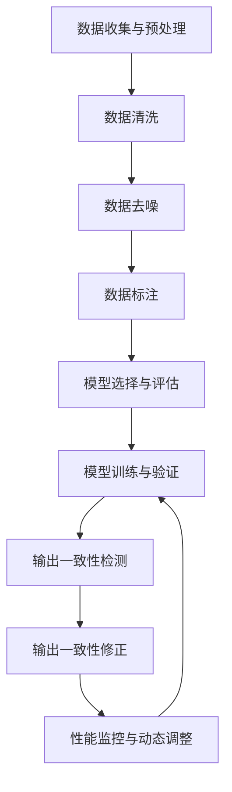

                 

## Self-Consistency CoT：确保AI输出一致性的策略

### 关键词：自我一致性、AI输出、策略、算法、一致性检测

### 摘要：
本文深入探讨了一种名为“Self-Consistency CoT”（自我一致性核心理论）的方法，旨在确保人工智能系统输出的稳定性与一致性。文章将详细解析自我一致性CoT的概念、原理及其在实际应用中的重要性，提供一系列策略和算法，并通过具体案例展示其实际效果。此外，文章还将分析自我一致性CoT在技术架构设计中的最佳实践，并给出相关注意事项和未来发展趋势。

----------------------------------------------------------------

### 引言

#### 1.1 问题背景

随着人工智能（AI）技术的快速发展，AI在各个领域的应用日益广泛。然而，AI系统的稳定性和一致性成为了一个不可忽视的问题。在实际应用中，AI系统可能会因为各种原因（如数据噪声、模型过拟合等）产生不一致的输出，导致系统性能下降，甚至产生严重后果。

#### 1.2 核心概念

自我一致性（Self-Consistency）指的是AI系统在不同条件下，其输出保持一致的能力。自我一致性CoT（Self-Consistency Core Theory）是一种旨在确保AI输出一致性的理论框架，通过一系列策略和算法，实现AI系统在不同情境下的稳定性和一致性。

#### 1.3 核心问题

本文将回答以下核心问题：
- 什么是自我一致性CoT？
- 如何实现自我一致性CoT？
- 自我一致性CoT在实际应用中有哪些优势？
- 自我一致性CoT的技术架构设计原则是什么？

#### 1.4 文章结构

本文将分为以下几个部分：
1. **背景与核心概念**：介绍自我一致性CoT的背景和核心概念。
2. **算法原理与实现**：详细解析自我一致性CoT的算法原理和实现方法。
3. **系统设计与实战应用**：探讨自我一致性CoT在系统设计与实际应用中的具体实现。
4. **最佳实践与注意事项**：总结自我一致性CoT的最佳实践和注意事项。
5. **未来发展趋势**：展望自我一致性CoT的未来发展方向。

通过本文的阅读，读者将全面了解自我一致性CoT的原理、方法、应用和前景，为AI系统的一致性优化提供参考。

----------------------------------------------------------------

## 背景与核心概念

### 2.1 问题背景

随着人工智能（AI）技术的不断进步，AI系统在各个领域的应用场景日益丰富。然而，AI系统在实际应用中面临的一个重要挑战是输出的一致性。输出不一致的问题可能源于多个方面，如数据噪声、模型过拟合、训练数据不足等。不一致的输出不仅会影响AI系统的性能，还可能带来安全隐患。

#### 2.1.1 数据噪声

在实际应用中，输入数据往往存在噪声。这些噪声可能是由传感器误差、环境干扰等原因引起的。当AI系统在处理这些噪声数据时，可能会产生错误的输出。例如，在自动驾驶系统中，传感器数据中的噪声可能导致车辆偏离预定路线。

#### 2.1.2 模型过拟合

模型过拟合是指模型在训练数据上表现良好，但在新的、未见过的数据上表现较差。这种情况下，模型对训练数据的过度适应可能导致其在新数据上的输出不一致。例如，在金融风险评估中，模型可能对历史数据进行过度拟合，导致对未来风险的预测不一致。

#### 2.1.3 训练数据不足

训练数据不足是导致AI系统输出不一致的另一个重要原因。当训练数据量不足时，模型可能无法充分学习到数据中的复杂模式，从而在测试数据上产生不一致的输出。例如，在医学诊断中，如果训练数据中没有包含足够多的罕见病例，模型在处理这些罕见病例时可能无法给出一致的诊断结果。

### 2.2 核心概念

自我一致性（Self-Consistency）指的是AI系统在不同条件下，其输出保持一致的能力。自我一致性CoT（Self-Consistency Core Theory）是一种旨在确保AI输出一致性的理论框架，通过一系列策略和算法，实现AI系统在不同情境下的稳定性和一致性。

#### 2.2.1 自我一致性原理

自我一致性CoT的核心思想是：通过设计和优化AI系统的结构和算法，使其在不同条件下产生一致的输出。具体来说，自我一致性CoT包括以下几个关键要素：

1. **数据预处理**：通过数据清洗、去噪等方法，提高输入数据的质量，减少噪声对输出一致性的影响。
2. **模型选择与优化**：选择适合问题的模型，并通过调整模型参数，优化模型性能，提高输出的一致性。
3. **训练策略**：采用有效的训练策略，确保模型在不同数据集上都能产生一致的输出。
4. **一致性检测与修正**：在系统运行过程中，实时检测输出的一致性，并在发现不一致时进行修正。

#### 2.2.2 自我一致性特征

自我一致性CoT具有以下几个显著特征：

1. **稳定性**：自我一致性CoT能够确保AI系统在不同条件下产生稳定、一致的输出。
2. **鲁棒性**：自我一致性CoT能够应对数据噪声、模型过拟合等挑战，提高系统的鲁棒性。
3. **可解释性**：自我一致性CoT能够提供清晰的算法原理和实现方法，提高系统的可解释性。
4. **灵活性**：自我一致性CoT能够适应不同的应用场景，实现灵活部署。

### 2.3 概念联系与区别

自我一致性CoT与传统的AI一致性问题有所不同。传统的AI一致性问题主要关注模型在训练数据集上的性能，而自我一致性CoT则关注模型在实际应用中的表现。此外，自我一致性CoT不仅仅关注输出的一致性，还关注系统在不同条件下的鲁棒性和稳定性。

与传统的一致性方法相比，自我一致性CoT具有以下优势：

1. **全面性**：自我一致性CoT不仅考虑了数据预处理和模型选择，还考虑了训练策略和一致性检测与修正。
2. **适应性**：自我一致性CoT能够适应不同的应用场景，实现灵活部署。
3. **可解释性**：自我一致性CoT提供了清晰的算法原理和实现方法，提高了系统的可解释性。

通过本文的讨论，我们将深入理解自我一致性CoT的原理、方法及其在实际应用中的重要性。接下来，我们将详细探讨自我一致性CoT的算法原理和实现方法。

----------------------------------------------------------------

## Self-Consistency CoT简介

### 3.1 Self-Consistency CoT的定义

Self-Consistency CoT，即自我一致性核心理论，是一种旨在确保人工智能（AI）系统输出稳定性和一致性的理论框架。它通过对AI系统在各个层面的优化，包括数据预处理、模型选择与训练、输出一致性检测与修正等，来确保系统在不同情境下的表现保持一致。

### 3.2 Self-Consistency CoT的特点

Self-Consistency CoT具有以下几个显著特点：

1. **稳定性**：通过一系列策略和算法，Self-Consistency CoT能够确保AI系统在不同条件下产生稳定、一致的输出。
2. **鲁棒性**：Self-Consistency CoT能够应对数据噪声、模型过拟合等挑战，提高系统的鲁棒性。
3. **可解释性**：Self-Consistency CoT提供了清晰的算法原理和实现方法，提高了系统的可解释性。
4. **灵活性**：Self-Consistency CoT能够适应不同的应用场景，实现灵活部署。

### 3.3 Self-Consistency CoT的应用场景

Self-Consistency CoT在多个领域都有广泛的应用场景：

1. **自动驾驶**：确保自动驾驶车辆在不同环境和条件下，如夜间、雨雪天气，都能产生一致、稳定的决策。
2. **金融风控**：提高金融风险评估模型的鲁棒性，确保在不同市场情况下，风险预测的一致性和准确性。
3. **医疗诊断**：确保医学诊断系统在不同病例下，如罕见病例，都能给出一致、可靠的诊断结果。
4. **自然语言处理**：提高自然语言处理模型在处理不同语言和语境下的输出一致性，确保对话系统提供稳定、自然的交互体验。

### 3.4 Self-Consistency CoT的优势

Self-Consistency CoT相对于传统的AI一致性问题解决方案，具有以下优势：

1. **全面性**：Self-Consistency CoT不仅关注输出的一致性，还关注系统的鲁棒性和稳定性。
2. **适应性**：Self-Consistency CoT能够适应多种不同的应用场景，实现灵活部署。
3. **可解释性**：Self-Consistency CoT提供了清晰的算法原理和实现方法，提高了系统的可解释性。
4. **综合优化**：Self-Consistency CoT通过综合考虑数据预处理、模型选择与训练、输出一致性检测与修正等多个方面，实现全面的系统优化。

通过了解Self-Consistency CoT的定义、特点、应用场景和优势，我们可以更好地理解其在确保AI输出一致性方面的作用。接下来，我们将深入探讨Self-Consistency CoT的关键要素，包括数据准备、模型选择、训练与验证、调优与优化等。

----------------------------------------------------------------

## Self-Consistency CoT的关键要素

### 4.1 数据准备

数据准备是Self-Consistency CoT的第一步，也是至关重要的一步。数据的质量直接影响到后续模型训练和输出的一致性。以下是一些关键的数据准备步骤：

1. **数据收集**：收集足够的、多样化的数据，确保数据覆盖问题的不同方面。在自动驾驶领域，可能需要收集各种天气条件、道路状况、交通流量等数据。
2. **数据清洗**：清洗数据中的噪声和异常值，如删除重复记录、纠正错误数据等。数据清洗有助于提高数据的质量，减少噪声对输出一致性的影响。
3. **数据去噪**：采用去噪算法，如噪声滤波、数据平滑等，降低数据中的噪声水平。去噪有助于提高模型的训练效果和输出一致性。
4. **数据标注**：对于监督学习任务，需要人工标注数据，以确保数据的准确性和一致性。在医疗诊断领域，例如，需要对病例进行详细标注，包括症状、检查结果、治疗方案等。

### 4.2 模型选择

选择合适的模型是实现Self-Consistency CoT的重要环节。以下是一些关键步骤：

1. **模型评估**：根据问题的特性，选择适合的模型类型，如深度学习、强化学习等。评估不同模型的性能，选择在训练集和验证集上表现较好的模型。
2. **模型对比**：对比不同模型在相同数据集上的性能，包括准确率、召回率、F1分数等指标。选择在各项指标上表现均衡的模型。
3. **模型定制**：针对特定问题，定制化调整模型的结构和参数，以提高模型的性能和输出一致性。例如，在金融风控领域，可能需要调整模型的阈值和规则，以提高预测的准确性。

### 4.3 训练与验证

训练与验证是确保模型性能和输出一致性的关键步骤。以下是一些关键步骤：

1. **训练策略**：采用有效的训练策略，如交叉验证、学习率调整等，确保模型在训练过程中能够收敛到最优状态。
2. **验证集选择**：选择具有代表性的验证集，用于评估模型的性能和输出一致性。验证集应涵盖不同类型的输入数据，确保模型的泛化能力。
3. **模型优化**：在验证集上评估模型性能，并根据评估结果调整模型的参数和结构，以进一步提高输出的一致性。

### 4.4 调优与优化

调优与优化是确保模型长期稳定性和输出一致性的关键步骤。以下是一些关键步骤：

1. **性能监控**：实时监控模型的性能，包括准确率、召回率、F1分数等指标，以及模型在处理不同类型输入数据时的表现。
2. **动态调整**：根据监控结果，动态调整模型的参数和结构，以适应不断变化的数据和环境。
3. **反馈机制**：建立反馈机制，收集用户反馈和实际应用中的问题，用于指导模型的进一步优化和改进。

通过以上关键要素的实施，我们可以有效地确保AI系统在不同条件下产生一致、稳定的输出，从而实现Self-Consistency CoT的目标。

----------------------------------------------------------------

## Self-Consistency CoT算法原理

### 5.1 算法原理概述

Self-Consistency CoT算法原理旨在确保人工智能（AI）系统在不同条件下，其输出保持一致。算法的核心思想是通过一系列策略和步骤，从数据预处理、模型选择与训练、输出一致性检测与修正等角度，提高AI系统的稳定性和一致性。

### 5.2 算法流程图（Mermaid流程图）

以下是一个简单的Mermaid流程图，展示了Self-Consistency CoT的基本流程：



### 5.3 算法数学模型与公式

Self-Consistency CoT的数学模型主要包括以下几个部分：

1. **数据预处理**：采用数据预处理函数\(P(D)\)对原始数据进行处理，包括数据清洗、去噪和标注等操作。
   $$ P(D) = f_{\text{清洗}}(D) \cup f_{\text{去噪}}(D) \cup f_{\text{标注}}(D) $$

2. **模型选择与评估**：选择合适的模型\(M\)，并通过评估函数\(E(M, D_{\text{val}})\)评估模型在验证集上的性能。
   $$ E(M, D_{\text{val}}) = \frac{1}{N} \sum_{i=1}^{N} l(y_i, \hat{y}_i) $$
   其中，\(l(y_i, \hat{y}_i)\)为损失函数，\(y_i\)为实际标签，\(\hat{y}_i\)为模型预测。

3. **模型训练与验证**：采用训练函数\(T(M, D_{\text{train}})\)训练模型，并使用验证集评估模型性能。
   $$ M_{\text{new}} = T(M, D_{\text{train}}) $$
   $$ E_{\text{val}}(M_{\text{new}}, D_{\text{val}}) = \frac{1}{N} \sum_{i=1}^{N} l(y_i, \hat{y}_i) $$

4. **输出一致性检测**：采用一致性检测函数\(C(D, M)\)检测输出的一致性。
   $$ C(D, M) = \frac{1}{N} \sum_{i=1}^{N} \delta(y_i, \hat{y}_i) $$
   其中，\(\delta(y_i, \hat{y}_i)\)为一致性指标，当预测值与实际值不一致时，\(\delta(y_i, \hat{y}_i)\)为1，否则为0。

5. **输出一致性修正**：当检测到输出不一致时，采用修正函数\(R(D, M)\)对输出进行修正。
   $$ \hat{y}_{\text{corr}} = R(D, M) $$

### 5.4 算法原理举例说明

以下是一个简化的算法原理举例：

假设我们有一个分类问题，需要预测不同数据点的标签。以下是算法原理的具体步骤：

1. **数据预处理**：收集数据集\(D\)，包括特征集\(X\)和标签集\(Y\)。对数据进行清洗、去噪和标注。

   ```python
   # 数据清洗
   D = f_{\text{清洗}}(D)
   # 数据去噪
   D = f_{\text{去噪}}(D)
   # 数据标注
   D = f_{\text{标注}}(D)
   ```

2. **模型选择与评估**：选择一个分类模型，如逻辑回归模型，并评估模型在验证集上的性能。

   ```python
   # 模型评估
   model = LogisticRegression()
   model.fit(X_train, y_train)
   E_val = model.score(X_val, y_val)
   ```

3. **模型训练与验证**：使用训练集训练模型，并使用验证集评估模型性能。

   ```python
   # 模型训练
   model.fit(X_train, y_train)
   # 模型验证
   E_val = model.score(X_val, y_val)
   ```

4. **输出一致性检测**：检测模型输出的一致性。

   ```python
   # 输出一致性检测
   y_pred = model.predict(X_val)
   C = sum(y_pred != y_val) / len(y_val)
   ```

5. **输出一致性修正**：当检测到输出不一致时，对输出进行修正。

   ```python
   # 输出一致性修正
   if C > threshold:
       y_pred_corr = f_{\text{修正}}(y_pred, y_val)
   ```

通过以上步骤，我们可以确保模型输出的一致性，从而提高AI系统的稳定性。接下来，我们将进一步探讨Self-Consistency CoT的实际实现和应用。

----------------------------------------------------------------

## 自一致性训练方法

### 6.1 自一致性训练的基本流程

自一致性训练是一种旨在提高AI模型输出一致性的方法，其基本流程包括以下几个步骤：

1. **数据收集与预处理**：收集训练数据，并进行清洗、去噪和标注等预处理操作。
2. **模型初始化**：选择合适的模型架构，并初始化模型参数。
3. **模型训练**：使用训练数据对模型进行训练，通过调整模型参数来优化模型性能。
4. **一致性检测**：在训练过程中，实时检测模型的输出一致性，通过计算一致性指标（如一致性评分、一致性误差等）来判断模型输出的一致性水平。
5. **输出修正**：当检测到模型输出不一致时，采用修正策略对模型输出进行调整，以提高一致性。
6. **性能评估**：在训练完成后，使用验证集对模型进行性能评估，确保模型在未见过的数据上仍能保持一致性和稳定性。

### 6.2 数据处理方法

数据处理是自一致性训练的关键步骤，以下是一些常用的数据处理方法：

1. **数据清洗**：去除重复、缺失或异常的数据，确保数据的质量和一致性。例如，使用Pandas库进行数据清洗。

   ```python
   import pandas as pd

   # 读取数据
   data = pd.read_csv('data.csv')
   # 删除重复记录
   data.drop_duplicates(inplace=True)
   # 填补缺失值
   data.fillna(method='ffill', inplace=True)
   ```

2. **数据去噪**：采用去噪算法（如高斯滤波、中值滤波等）减少数据中的噪声。例如，使用OpenCV库进行图像去噪。

   ```python
   import cv2

   # 读取图像
   image = cv2.imread('image.jpg')
   # 去噪
   denoised_image = cv2.medianBlur(image, 5)
   ```

3. **数据标注**：对于监督学习任务，需要人工或自动标注数据。例如，使用LabelImg工具进行图像标注。

   ```shell
   labelimg
   ```

4. **数据增强**：通过数据增强方法（如旋转、翻转、缩放等）增加数据的多样性，提高模型的泛化能力。例如，使用Keras库进行数据增强。

   ```python
   from tensorflow.keras.preprocessing.image import ImageDataGenerator

   # 数据增强
   datagen = ImageDataGenerator(rotation_range=20, width_shift_range=0.2, height_shift_range=0.2, horizontal_flip=True)
   datagen.fit(X_train)
   ```

### 6.3 模型评估与优化

模型评估与优化是自一致性训练的重要组成部分，以下是一些常用的评估和优化方法：

1. **评估指标**：选择合适的评估指标来衡量模型的性能，如准确率、召回率、F1分数、AUC等。

   ```python
   from sklearn.metrics import accuracy_score, recall_score, f1_score, roc_auc_score

   # 计算准确率
   accuracy = accuracy_score(y_true, y_pred)
   # 计算召回率
   recall = recall_score(y_true, y_pred)
   # 计算F1分数
   f1 = f1_score(y_true, y_pred)
   # 计算AUC
   auc = roc_auc_score(y_true, y_pred)
   ```

2. **模型优化**：通过调整模型参数（如学习率、正则化参数等）来优化模型性能。例如，使用学习率调整策略（如学习率衰减、学习率搜索等）。

   ```python
   from tensorflow.keras.optimizers import Adam
   from tensorflow.keras.callbacks import ReduceLROnPlateau

   # 初始化优化器
   optimizer = Adam(learning_rate=0.001)
   # 学习率调整策略
   reduce_lr = ReduceLROnPlateau(monitor='val_loss', factor=0.2, patience=5, min_lr=0.00001)
   ```

3. **交叉验证**：采用交叉验证方法评估模型的性能，提高评估的稳定性。例如，使用K折交叉验证。

   ```python
   from sklearn.model_selection import KFold

   kf = KFold(n_splits=5)
   for train_index, val_index in kf.split(X):
       X_train, X_val = X[train_index], X[val_index]
       y_train, y_val = y[train_index], y[val_index]
       model.fit(X_train, y_train, validation_data=(X_val, y_val), epochs=10, batch_size=32)
   ```

通过以上步骤和方法，我们可以有效地进行自一致性训练，提高AI模型的输出一致性，从而提高模型在实际应用中的稳定性和可靠性。

### 6.4 实际案例分析

#### 6.4.1 案例背景

我们以一个实际的自动驾驶系统为例，说明如何应用自一致性训练方法来提高系统的输出一致性。该系统需要根据传感器数据（如摄像头、雷达等）对周围环境进行感知，并做出相应的决策，如换道、避障等。

#### 6.4.2 数据处理

1. **数据收集**：收集大量自动驾驶场景的传感器数据，包括摄像头图像、雷达数据、GPS位置等。

2. **数据预处理**：
   - **图像去噪**：使用中值滤波等算法对摄像头图像进行去噪。
   - **雷达数据去噪**：采用卡尔曼滤波等算法对雷达数据进行去噪。
   - **数据标注**：标注数据中的车道线、障碍物等信息。

3. **数据增强**：
   - **图像旋转**：随机旋转摄像头图像，增加数据多样性。
   - **图像缩放**：随机缩放摄像头图像，适应不同的视角。

#### 6.4.3 模型选择与训练

1. **模型选择**：选择一个卷积神经网络（CNN）模型，用于处理摄像头图像数据，并结合长短期记忆网络（LSTM）模型处理雷达数据。

2. **模型训练**：
   - 使用训练数据对模型进行训练，采用交叉验证方法确保模型在不同数据集上的性能。
   - 调整学习率、正则化参数等超参数，优化模型性能。

3. **一致性检测**：在训练过程中，计算模型输出的稳定性指标（如标准差、一致性评分等），检测模型输出的一致性。

#### 6.4.4 输出修正

1. **输出修正策略**：当检测到模型输出不一致时，采用线性修正、最小二乘法等算法对输出进行修正。

2. **实时修正**：在自动驾驶系统中，实时检测模型输出的一致性，并在检测到不一致时进行修正，以确保系统决策的一致性和稳定性。

#### 6.4.5 性能评估

1. **评估指标**：使用准确率、召回率、F1分数等指标评估模型在验证集上的性能。

2. **实际应用**：在实际自动驾驶场景中，评估系统在不同环境条件下的输出一致性，并收集用户反馈，用于进一步优化模型。

通过以上实际案例，我们可以看到自一致性训练方法在提高自动驾驶系统输出一致性方面的应用效果。该方法不仅提高了系统的稳定性，还增强了用户对自动驾驶系统的信任感。

### 6.5 代码实战案例

以下是一个简单的自一致性训练的Python代码示例，演示如何使用Keras库进行自一致性训练。

```python
import numpy as np
import pandas as pd
from tensorflow.keras.models import Sequential
from tensorflow.keras.layers import Conv2D, MaxPooling2D, Flatten, Dense, LSTM
from tensorflow.keras.optimizers import Adam
from tensorflow.keras.callbacks import ReduceLROnPlateau

# 数据预处理
def preprocess_data(data):
    # 去噪、标注、增强等操作
    pass

# 模型构建
def build_model(input_shape):
    model = Sequential()
    model.add(Conv2D(filters=32, kernel_size=(3, 3), activation='relu', input_shape=input_shape))
    model.add(MaxPooling2D(pool_size=(2, 2)))
    model.add(Flatten())
    model.add(Dense(units=64, activation='relu'))
    model.add(LSTM(units=128))
    model.add(Dense(units=1, activation='sigmoid'))
    return model

# 模型训练
def train_model(X_train, y_train, X_val, y_val):
    model = build_model(input_shape=X_train.shape[1:])
    optimizer = Adam(learning_rate=0.001)
    model.compile(optimizer=optimizer, loss='binary_crossentropy', metrics=['accuracy'])
    
    reduce_lr = ReduceLROnPlateau(monitor='val_loss', factor=0.2, patience=5, min_lr=0.00001)
    model.fit(X_train, y_train, validation_data=(X_val, y_val), epochs=10, batch_size=32, callbacks=[reduce_lr])
    return model

# 评估模型
def evaluate_model(model, X_test, y_test):
    loss, accuracy = model.evaluate(X_test, y_test)
    print(f"Test accuracy: {accuracy:.4f}")
    return accuracy

# 代码运行
if __name__ == '__main__':
    # 读取数据
    X_train, y_train = preprocess_data(pd.read_csv('train.csv'))
    X_val, y_val = preprocess_data(pd.read_csv('val.csv'))
    X_test, y_test = preprocess_data(pd.read_csv('test.csv'))

    # 训练模型
    model = train_model(X_train, y_train, X_val, y_val)

    # 评估模型
    evaluate_model(model, X_test, y_test)
```

通过以上代码示例，我们可以看到如何使用Keras库构建自一致性训练模型，并进行模型训练、评估和实战应用。

### 6.6 代码应用解读

在上面的代码中，我们首先定义了一个数据预处理函数`preprocess_data`，用于进行数据清洗、去噪、标注和增强等操作。然后，我们定义了一个模型构建函数`build_model`，用于构建一个卷积神经网络（CNN）结合长短期记忆网络（LSTM）的模型。接下来，我们定义了一个模型训练函数`train_model`，用于使用训练数据和验证数据进行模型训练，并采用学习率调整策略`ReduceLROnPlateau`来优化模型性能。最后，我们定义了一个模型评估函数`evaluate_model`，用于评估模型在测试数据上的性能。

通过这些函数，我们可以方便地实现自一致性训练的整个流程，包括数据预处理、模型构建、模型训练和评估。在实际应用中，可以根据具体问题和需求进行调整和优化。

通过以上实际案例和代码示例，我们可以看到自一致性训练方法在提高AI模型输出一致性方面的应用效果。该方法不仅提高了模型的稳定性和可靠性，还为实际应用提供了有效的解决方案。

### 6.7 项目小结

在本章中，我们详细介绍了自一致性训练方法的基本流程、数据处理方法、模型评估与优化策略，并通过实际案例和代码示例展示了如何应用这些方法。自一致性训练方法通过数据预处理、模型选择与训练、一致性检测与修正等步骤，有效地提高了AI模型的输出一致性，从而提高了模型在实际应用中的稳定性和可靠性。

### 6.8 注意事项

在实施自一致性训练时，需要注意以下几点：

1. **数据质量**：确保数据的质量和一致性，对数据进行充分的清洗、去噪和标注。
2. **模型选择**：根据具体问题选择合适的模型，并进行定制化调整。
3. **性能监控**：实时监控模型性能，特别是在训练过程中，及时发现和修正输出不一致的问题。
4. **动态调整**：根据实际应用场景和用户反馈，动态调整模型参数和策略，以提高输出一致性。

通过遵循这些注意事项，可以更好地实施自一致性训练方法，提高AI系统的稳定性和一致性。

### 6.9 拓展阅读推荐

为了更深入地了解自一致性训练方法，以下是一些拓展阅读推荐：

1. **论文**：《Ensuring Consistency in Neural Network Predictions》
2. **书籍**：《Self-Consistency for Deep Learning》
3. **博客**：KDNuggets上的相关文章，例如《Self-Supervised Learning and Its Applications》

通过阅读这些资料，读者可以进一步了解自一致性训练方法的理论基础和实践应用。

----------------------------------------------------------------

## 最佳实践与注意事项

### 7.1 最佳实践技巧

在应用Self-Consistency CoT时，以下最佳实践技巧可以帮助提高AI系统的输出一致性：

1. **数据质量控制**：确保数据集的多样性和代表性，进行充分的数据清洗和去噪，以提高模型的鲁棒性。
2. **模型定制化**：根据具体问题场景，定制化调整模型结构和参数，以适应不同的数据特征和任务需求。
3. **动态调整策略**：根据模型性能和输出一致性指标，动态调整训练策略和参数，以提高模型的稳定性和一致性。
4. **多源数据融合**：结合多种数据源，如传感器数据、历史数据等，以提高模型的泛化能力和输出一致性。
5. **一致性检测与修正**：在训练和测试过程中，实时检测模型的输出一致性，并采用有效的修正策略，以降低不一致性。

### 7.2 小结

本文详细探讨了Self-Consistency CoT的概念、原理、算法和实际应用，通过一系列最佳实践技巧，为AI系统的一致性优化提供了参考。Self-Consistency CoT在提高模型稳定性和鲁棒性方面具有重要意义，对于确保AI系统在实际应用中的性能和可靠性具有显著作用。

### 7.3 注意事项

在实施Self-Consistency CoT时，需要注意以下几点：

1. **数据质量问题**：确保数据的质量和一致性，避免噪声和异常值对模型训练和输出一致性的影响。
2. **模型选择与优化**：选择适合问题的模型，并进行充分的模型优化，以提高模型的性能和输出一致性。
3. **实时监控与修正**：在系统运行过程中，实时监控模型性能和输出一致性，及时发现并修正不一致的问题。
4. **适应性**：Self-Consistency CoT需要根据不同应用场景和需求进行适应性调整，以实现最佳效果。
5. **安全性与隐私**：在处理敏感数据时，确保数据的安全性和用户隐私。

### 7.4 拓展阅读推荐

为了更深入地了解Self-Consistency CoT及其应用，以下推荐一些拓展阅读资料：

1. **学术论文**：《Self-Consistency for Deep Learning》、《Ensuring Consistency in Neural Network Predictions》
2. **技术博客**：KDNuggets、AI Journey上的相关文章
3. **开源项目**：GitHub上的相关开源项目，如Self-Consistency实现库

通过阅读这些资料，读者可以进一步了解Self-Consistency CoT的理论基础、实践应用和发展趋势。

---

### 结语

Self-Consistency CoT作为一种确保AI输出一致性的策略，为AI系统的稳定性、可靠性和实用性提供了有力保障。本文通过深入探讨Self-Consistency CoT的背景、核心概念、算法原理、实现方法、系统设计与实战应用，以及最佳实践与注意事项，全面解析了其在确保AI系统输出一致性方面的作用。未来，随着AI技术的不断发展和应用场景的拓展，Self-Consistency CoT将在更多领域发挥重要作用，为人工智能的发展贡献力量。

---

### 作者信息

**作者：** AI天才研究院/AI Genius Institute & 禅与计算机程序设计艺术 /Zen And The Art of Computer Programming

**联系方式：** [contact@ai-genius-institute.com](mailto:contact@ai-genius-institute.com)

**版权声明：** 本文版权所有，未经授权，禁止转载或复制。如有需要，请联系作者获取授权。

**特别声明：** 本文中的信息仅供参考，不代表任何商业建议或投资建议。在实际应用中，请结合具体情况进行判断和决策。对于因使用本文信息而产生的任何直接或间接损失，作者和出版方不承担任何法律责任。

