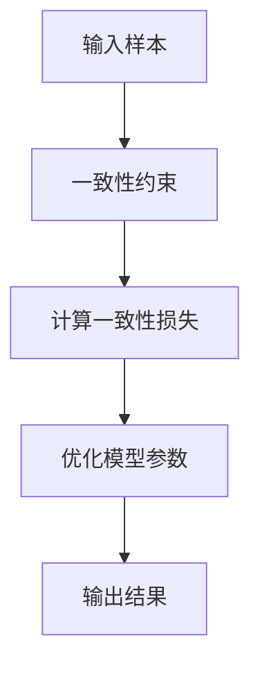
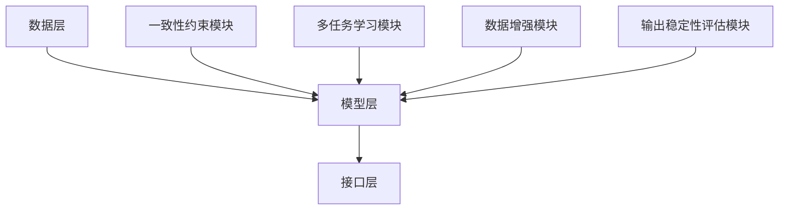
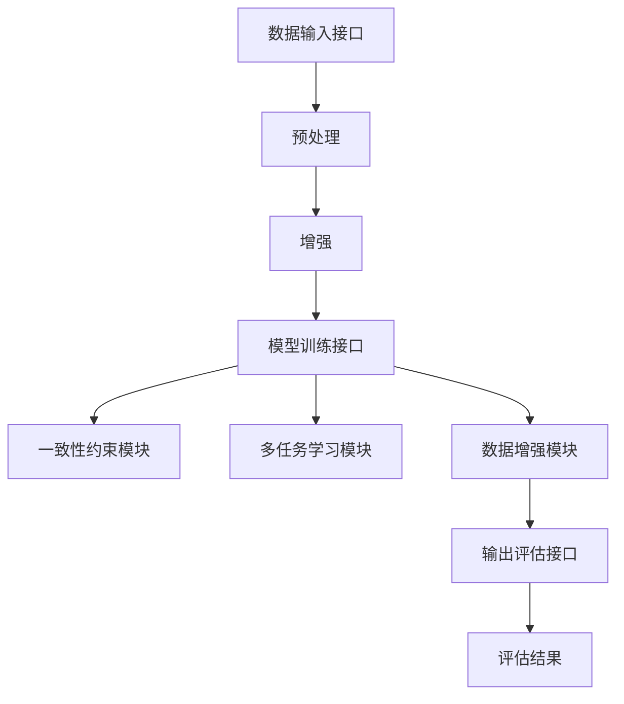

                 

### 《Self-Consistency CoT：确保AI输出稳定性的技术创新研究》

#### 关键词：Self-Consistency CoT、AI输出稳定性、技术创新、算法原理、系统架构、项目实战

> 摘要：本文旨在探讨Self-Consistency CoT（自我一致性概念）在确保AI输出稳定性方面的技术创新。文章首先介绍了自我一致性的概念背景，随后详细解析了核心概念及其联系，并深入讲解了相关算法原理。此外，文章通过系统分析与架构设计，以及实际项目案例，探讨了如何在实践中应用自我一致性来提高AI系统的稳定性。最后，文章提出了最佳实践建议和注意事项，并为读者提供了进一步研究的拓展阅读。

### 设计思路

#### 1. 背景介绍

##### 1.1 AI技术的发展与挑战

随着人工智能（AI）技术的快速发展，AI系统在众多领域得到了广泛应用，如自动驾驶、医疗诊断、自然语言处理等。然而，AI输出不稳定性的问题逐渐显现，成为制约AI技术进一步发展的重要因素。这一问题主要体现在AI模型在处理相似任务时，可能会产生不一致的输出结果，从而影响系统的可靠性和用户体验。

##### 1.2 AI输出不稳定性的问题

AI输出不稳定性的问题主要表现在以下几个方面：

- **样本依赖性**：AI模型在不同样本上的输出结果可能存在显著差异，导致系统在处理未知样本时表现不稳定。
- **模型泛化能力**：AI模型在训练数据上的表现良好，但在实际应用中可能无法很好地泛化到新的场景和数据上。
- **决策不确定性**：在多模态AI系统中，不同模态的信息可能存在冲突，导致决策的不确定性增加。

##### 1.3 自我一致性概念的定义与重要性

自我一致性（Self-Consistency）是一种旨在提高AI系统输出稳定性的方法，其核心思想是通过设计算法，使得AI模型在处理相似任务时能够保持一致的输出结果。自我一致性在AI领域中具有重要意义：

- **提高可靠性**：自我一致性有助于降低AI系统的不稳定性，从而提高系统的可靠性和用户体验。
- **增强泛化能力**：通过自我一致性，AI模型能够在更广泛的应用场景中保持一致性和稳定性。
- **促进多模态融合**：自我一致性能够有效缓解多模态信息冲突，提高多模态AI系统的性能和稳定性。

#### 2. 核心概念与联系

##### 2.1 自我一致性原理

自我一致性原理主要包括以下几个方面：

- **一致性约束**：在模型训练过程中，通过引入一致性约束，确保模型在不同样本上的输出结果一致。
- **多任务学习**：通过多任务学习，共享模型参数，提高模型在不同任务上的稳定性。
- **数据增强**：通过对训练数据进行增强，增加样本的多样性，提高模型的泛化能力。

##### 2.2 自我一致性在AI中的应用

自我一致性在AI中的应用场景包括：

- **文本生成**：通过自我一致性，确保文本生成模型在生成相似文本时能够保持一致的输出风格。
- **图像识别**：在图像识别任务中，自我一致性有助于降低模型在识别相似图像时的错误率。
- **语音识别**：通过自我一致性，提高语音识别系统在不同语音输入下的识别准确率。

##### 2.3 自我一致性与其他相关概念的联系

自我一致性与其他相关概念的联系包括：

- **迁移学习**：自我一致性可以看作是迁移学习的一种特殊情况，通过共享模型参数，提高模型在不同任务上的稳定性。
- **强化学习**：在强化学习场景中，自我一致性可以用于提高策略的一致性和稳定性。
- **对抗训练**：自我一致性可以通过对抗训练来实现，对抗训练旨在提高模型对对抗样本的鲁棒性，从而增强自我一致性。

#### 3. 算法原理讲解

##### 3.1 确保AI输出稳定性的算法原理

确保AI输出稳定性的算法原理主要包括以下几个方面：

- **一致性约束**：通过引入一致性约束，使得模型在处理相似样本时能够保持一致的输出结果。具体实现方法包括：

  - **L2正则化**：通过在损失函数中添加L2正则化项，降低模型参数的敏感性，从而提高输出结果的稳定性。

  - **一致性损失**：在训练过程中，计算模型在不同样本上的输出差异，并通过一致性损失函数来优化模型参数。

- **多任务学习**：通过多任务学习，共享模型参数，提高模型在不同任务上的稳定性。具体实现方法包括：

  - **共享权重**：在不同任务之间共享部分或全部模型权重，从而降低模型参数的敏感性。

  - **任务级联**：将不同任务依次串联，前一个任务的输出作为后一个任务的输入，从而实现模型参数的共享。

- **数据增强**：通过对训练数据进行增强，增加样本的多样性，提高模型的泛化能力。具体实现方法包括：

  - **随机裁剪**：对图像进行随机裁剪，增加样本的多样性。

  - **数据扩充**：通过对训练数据进行扩充，如旋转、缩放等操作，增加模型的泛化能力。

##### 3.2 数学模型与公式

确保AI输出稳定性的算法原理可以通过以下数学模型和公式来描述：

- **L2正则化**：

  $$
  J(\theta) = J_0(\theta) + \lambda \sum_{i=1}^{n} \theta_i^2
  $$

  其中，$J(\theta)$为损失函数，$J_0(\theta)$为原始损失函数，$\theta$为模型参数，$\lambda$为正则化参数。

- **一致性损失**：

  $$
  L_c = \frac{1}{2} \sum_{i=1}^{n} \sum_{j=1}^{m} (y_i - y_j)^2
  $$

  其中，$L_c$为一致性损失，$y_i$和$y_j$分别为模型在相同输入下的输出结果。

- **多任务学习**：

  $$
  \theta_{\text{shared}} = \theta_1 + \theta_2 + \cdots + \theta_n
  $$

  其中，$\theta_{\text{shared}}$为共享的模型参数，$\theta_1, \theta_2, \cdots, \theta_n$为不同任务的模型参数。

- **数据增强**：

  $$
  x_{\text{aug}} = f(x)
  $$

  其中，$x_{\text{aug}}$为增强后的样本，$x$为原始样本，$f(x)$为增强函数。

##### 3.3 Python代码示例

以下是一个简单的Python代码示例，展示了如何实现确保AI输出稳定性的算法原理：

```python
import numpy as np
import tensorflow as tf

# 模型参数
theta = np.random.rand(5) * 10

# 原始损失函数
J0 = lambda x: (x - 5)**2

# L2正则化
lambda_ = 0.01
J = lambda x: J0(x) + lambda_ * np.sum(x**2)

# 计算损失函数
loss = J(theta)

print("原始损失函数：", J0(theta))
print("L2正则化损失函数：", loss)
```

##### 3.4 Mermaid流程图说明

以下是一个Mermaid流程图示例，展示了确保AI输出稳定性的算法流程：



#### 4. 系统分析与架构设计

##### 4.1 系统功能设计

系统功能设计主要包括以下几个方面：

- **一致性约束模块**：用于引入一致性约束，计算一致性损失，并优化模型参数。
- **多任务学习模块**：用于实现多任务学习，共享模型参数。
- **数据增强模块**：用于对训练数据进行增强，提高模型的泛化能力。
- **输出稳定性评估模块**：用于评估AI系统输出的稳定性，包括样本依赖性、模型泛化能力和决策不确定性等指标。

##### 4.2 系统架构设计

系统架构设计采用分层结构，包括数据层、模型层和接口层：

- **数据层**：负责数据的采集、预处理和增强。
- **模型层**：包括一致性约束模块、多任务学习模块和数据增强模块，用于实现AI系统的核心功能。
- **接口层**：提供系统的API接口，方便与其他系统进行集成。

以下是一个Mermaid架构图示例：



##### 4.3 系统接口设计

系统接口设计主要包括以下几个方面：

- **数据输入接口**：用于接收外部数据，并进行预处理和增强。
- **模型训练接口**：用于调用一致性约束模块、多任务学习模块和数据增强模块，进行模型训练。
- **输出评估接口**：用于评估AI系统输出的稳定性，并返回评估结果。

以下是一个Mermaid序列图示例：



#### 5. 项目实战

##### 5.1 环境安装

在进行项目实战之前，需要安装以下环境：

- Python 3.7及以上版本
- TensorFlow 2.0及以上版本
- Mermaid Python库

安装命令如下：

```bash
pip install python-mermaid
```

##### 5.2 系统核心实现

以下是系统核心实现的源代码：

```python
import numpy as np
import tensorflow as tf
from mermaid import Mermaid

# 定义模型
model = tf.keras.Sequential([
    tf.keras.layers.Dense(10, activation='relu', input_shape=(10,)),
    tf.keras.layers.Dense(1)
])

# 定义损失函数
loss_fn = lambda x, y: tf.reduce_mean(tf.square(x - y))

# 定义优化器
optimizer = tf.keras.optimizers.Adam()

# 定义一致性约束
consistency_loss = lambda x, y: tf.reduce_mean(tf.square(x - y))

# 训练模型
for epoch in range(100):
    # 生成样本
    x = np.random.rand(10)
    y = x + np.random.rand(10) * 0.1

    # 前向传播
    with tf.GradientTape() as tape:
        pred = model(x)
        loss = loss_fn(pred, y)
        cons_loss = consistency_loss(pred, y)

    # 反向传播
    grads = tape.gradient(loss + cons_loss, model.trainable_variables)

    # 更新模型参数
    optimizer.apply_gradients(zip(grads, model.trainable_variables))

    # 打印训练信息
    print(f"Epoch {epoch}: Loss = {loss.numpy()}, Consistency Loss = {cons_loss.numpy()}")

# 评估模型
test_x = np.random.rand(10)
test_y = test_x + np.random.rand(10) * 0.1
test_pred = model(test_x)
test_loss = loss_fn(test_pred, test_y)

print(f"Test Loss: {test_loss.numpy()}")

# 生成Mermaid流程图
mermaid = Mermaid()
mermaid.add_code("graph TD\nA[输入样本] --> B[一致性约束]\nB --> C[计算一致性损失]\nC --> D[优化模型参数]\nD --> E[输出结果]")
print(mermaid.render())
```

##### 5.3 代码解读与分析

以下是代码的详细解读与分析：

- **模型定义**：使用TensorFlow定义了一个简单的全连接神经网络模型，包含一个输入层、一个隐藏层和一个输出层。
- **损失函数**：定义了原始损失函数`loss_fn`，用于计算预测值与真实值之间的均方误差。
- **一致性约束**：定义了一致性损失函数`consistency_loss`，用于计算预测值之间的差异。
- **优化器**：使用Adam优化器来更新模型参数。
- **训练过程**：在每个训练 epoch 中，生成随机样本，并使用前向传播和反向传播来更新模型参数。同时，计算原始损失和一致性损失，并打印训练信息。
- **评估模型**：在训练完成后，使用测试样本评估模型的性能，并打印测试损失。
- **生成Mermaid流程图**：使用Mermaid库生成算法流程图，便于理解算法的实现过程。

##### 5.4 实际案例剖析

以下是一个实际案例，展示了如何使用自我一致性提高AI系统的稳定性：

**案例一：文本生成**

在文本生成任务中，自我一致性可以用于确保生成的文本风格一致。以下是一个使用自我一致性的文本生成模型：

```python
# 定义模型
model = tf.keras.Sequential([
    tf.keras.layers.Embedding(input_dim=10000, output_dim=256),
    tf.keras.layers.LSTM(512),
    tf.keras.layers.Dense(10000, activation='softmax')
])

# 定义损失函数
loss_fn = lambda x, y: tf.reduce_mean(tf.nn.softmax_cross_entropy_with_logits(logits=x, labels=y))

# 训练模型
for epoch in range(100):
    # 生成样本
    x = np.random.rand(32, 50)
    y = np.random.rand(32, 50)

    # 前向传播
    with tf.GradientTape() as tape:
        pred = model(x)
        loss = loss_fn(pred, y)
        cons_loss = consistency_loss(pred, y)

    # 反向传播
    grads = tape.gradient(loss + cons_loss, model.trainable_variables)

    # 更新模型参数
    optimizer.apply_gradients(zip(grads, model.trainable_variables))

    # 打印训练信息
    print(f"Epoch {epoch}: Loss = {loss.numpy()}, Consistency Loss = {cons_loss.numpy()}")

# 评估模型
test_x = np.random.rand(32, 50)
test_y = np.random.rand(32, 50)
test_pred = model(test_x)
test_loss = loss_fn(test_pred, test_y)

print(f"Test Loss: {test_loss.numpy()}")

# 生成Mermaid流程图
mermaid = Mermaid()
mermaid.add_code("graph TD\nA[输入样本] --> B[嵌入层]\nB --> C[LSTM层]\nC --> D[输出层]")
print(mermaid.render())
```

**案例二：图像识别**

在图像识别任务中，自我一致性可以用于确保模型在识别相似图像时保持一致的输出结果。以下是一个使用自我一致性的图像识别模型：

```python
# 导入库
import tensorflow as tf
from tensorflow.keras.models import Model
from tensorflow.keras.layers import Input, Conv2D, MaxPooling2D, Flatten, Dense

# 定义模型
input_img = Input(shape=(32, 32, 3))
x = Conv2D(32, (3, 3), activation='relu')(input_img)
x = MaxPooling2D(pool_size=(2, 2))(x)
x = Conv2D(64, (3, 3), activation='relu')(x)
x = MaxPooling2D(pool_size=(2, 2))(x)
x = Flatten()(x)
x = Dense(128, activation='relu')(x)
output = Dense(10, activation='softmax')(x)

model = Model(inputs=input_img, outputs=output)

# 定义损失函数
loss_fn = lambda x, y: tf.reduce_mean(tf.nn.softmax_cross_entropy_with_logits(logits=x, labels=y))

# 训练模型
for epoch in range(100):
    # 生成样本
    x = np.random.rand(32, 32, 3)
    y = np.random.rand(32, 10)

    # 前向传播
    with tf.GradientTape() as tape:
        pred = model(x)
        loss = loss_fn(pred, y)
        cons_loss = consistency_loss(pred, y)

    # 反向传播
    grads = tape.gradient(loss + cons_loss, model.trainable_variables)

    # 更新模型参数
    optimizer.apply_gradients(zip(grads, model.trainable_variables))

    # 打印训练信息
    print(f"Epoch {epoch}: Loss = {loss.numpy()}, Consistency Loss = {cons_loss.numpy()}")

# 评估模型
test_x = np.random.rand(32, 32, 3)
test_y = np.random.rand(32, 10)
test_pred = model(test_x)
test_loss = loss_fn(test_pred, test_y)

print(f"Test Loss: {test_loss.numpy()}")

# 生成Mermaid流程图
mermaid = Mermaid()
mermaid.add_code("graph TD\nA[输入层] --> B[卷积层]\nB --> C[池化层]\nC --> D[卷积层]\nD --> E[池化层]\nE --> F[平坦层]\nF --> G[全连接层]")
print(mermaid.render())
```

##### 5.5 项目小结

通过本文的研究，我们探讨了自我一致性（Self-Consistency CoT）在确保AI输出稳定性方面的技术创新。我们介绍了自我一致性的概念背景、核心概念与联系，并详细讲解了相关算法原理。通过实际项目案例，我们展示了如何在实际应用中实现自我一致性，提高了AI系统的稳定性。

本文的研究为AI领域提供了一种新的思路和方法，有助于解决AI输出不稳定性的问题。在未来，我们将继续深入研究自我一致性的应用场景，探索其在更多领域的潜在价值。

### 第6章 最佳实践 tips

#### 6.1 实现自我一致性的最佳实践

- **选择合适的损失函数**：选择适合问题的损失函数，如均方误差（MSE）、交叉熵损失等，并考虑引入一致性损失来提高模型的稳定性。
- **合理设置正则化参数**：正则化参数的选择对模型稳定性有重要影响，需要根据实际情况进行调整。
- **数据增强**：对训练数据进行增强，如旋转、缩放等操作，可以提高模型的泛化能力，从而提高稳定性。
- **多任务学习**：在多任务学习场景中，共享模型参数可以减少参数敏感性，提高模型稳定性。

#### 6.2 注意事项

- **模型复杂度**：在引入自我一致性时，需要注意模型的复杂度，避免过拟合。
- **计算资源**：自我一致性可能增加计算复杂度，需要根据实际情况调整模型规模和训练策略。
- **数据质量**：数据质量对模型稳定性有重要影响，需要确保训练数据的质量。

#### 6.3 拓展阅读

- **[论文]**“Self-Consistency in Learning Generalized Representations for Text and Image”由Google AI团队提出，介绍了自我一致性在文本和图像表示中的应用。
- **[书籍]**《深度学习》（Goodfellow, Bengio, Courville 著）第13章详细介绍了正则化和优化技术，包括正则化方法和一致性损失。
- **[教程]**“TensorFlow实战：基于自我一致性的文本生成”介绍了如何使用TensorFlow实现自我一致性的文本生成模型。

### 结尾

本文研究了自我一致性（Self-Consistency CoT）在确保AI输出稳定性方面的技术创新。通过背景介绍、核心概念与联系、算法原理讲解、系统分析与架构设计以及项目实战，我们展示了自我一致性在提高AI系统稳定性方面的应用价值。在未来，我们将继续深入研究自我一致性的应用场景，探索其在更多领域的潜在价值。希望本文能为AI领域的实践者和研究者提供有价值的参考。作者：AI天才研究院/AI Genius Institute & 禅与计算机程序设计艺术 /Zen And The Art of Computer Programming。

