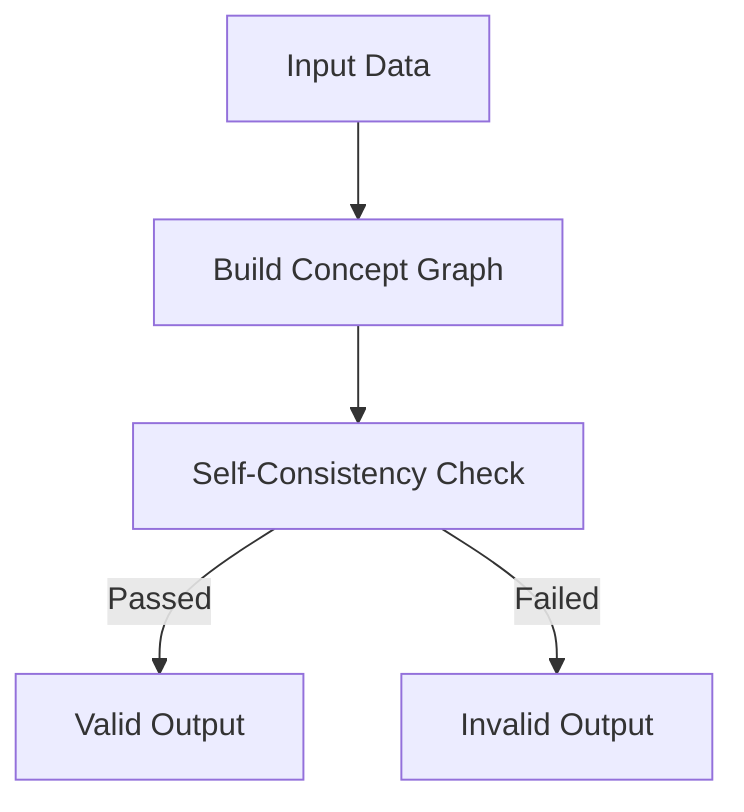
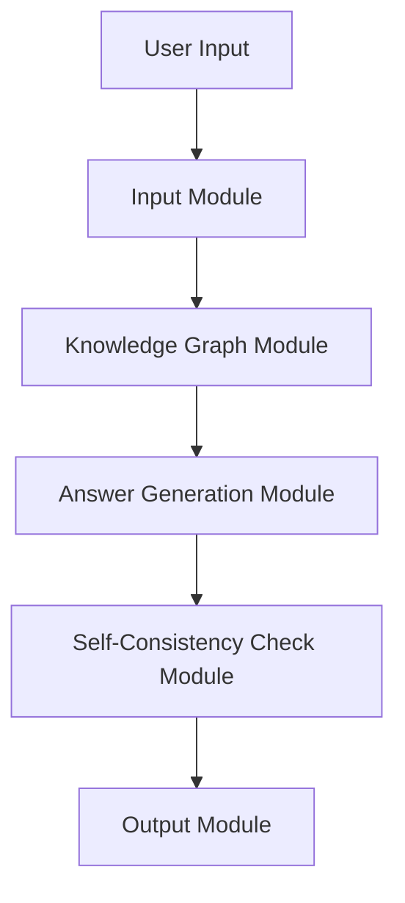
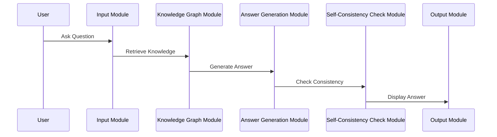
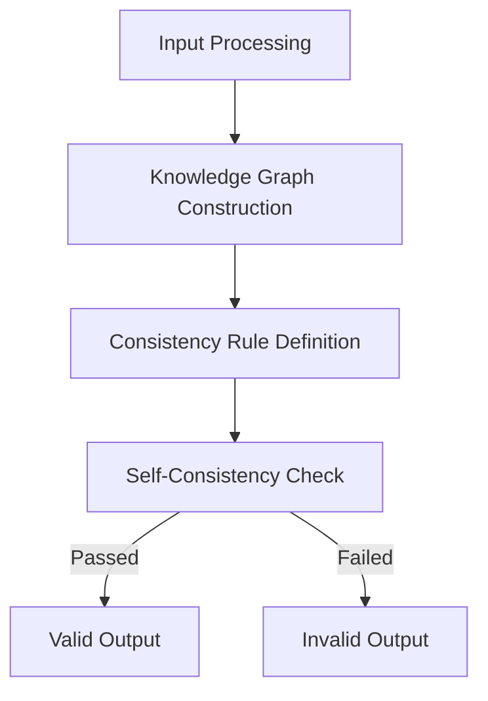
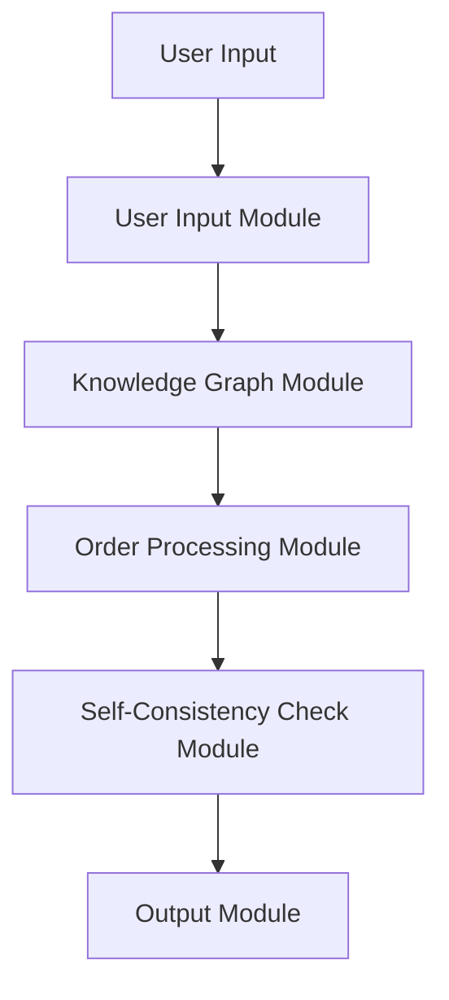
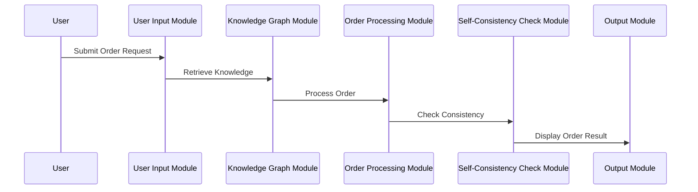

                 


### Self-Consistency CoT：确保AI输出质量的有效方法

#### 关键词：Self-Consistency CoT, AI输出质量，算法原理，系统架构，项目实战，最佳实践

> 摘要：
> 本文将深入探讨Self-Consistency CoT（自一致性概念图）这一方法，旨在确保人工智能（AI）输出质量。通过详细的算法原理讲解、系统分析与设计、以及实战项目分析，我们旨在提供一套完整的指南，帮助读者理解并应用这一方法。

## 引言

人工智能（AI）在近年来取得了惊人的进展，从语音识别到图像处理，从自然语言理解到机器翻译，AI已经深入到我们生活的各个方面。然而，随着AI系统的广泛应用，如何确保AI输出质量成为一个至关重要的问题。Self-Consistency CoT（自一致性概念图）提供了一种有效的解决方案，通过自我一致性校验来提升AI输出的可靠性。

### 核心概念

#### Self-Consistency CoT的定义与背景

Self-Consistency CoT，即Self-Consistency Conceptual Graph，是一种基于知识图谱的AI输出校验方法。它通过构建概念图来表示AI系统的知识结构，并利用自一致性校验来确保AI输出的质量。

#### Key Principles and Concepts

1. **知识图谱**：知识图谱是AI系统知识表示的一种方式，它通过实体、属性和关系的组合来构建复杂的知识结构。
2. **自一致性校验**：自一致性校验是一种机制，用于检查AI系统输出中的逻辑一致性。通过对比输入数据和输出结果，可以发现并纠正潜在的错误。

### 算法原理

#### 详细解释算法原理

Self-Consistency CoT算法的原理可以概括为以下几个步骤：

1. **构建概念图**：首先，根据输入数据构建一个概念图，表示AI系统的知识结构。
2. **自我一致性校验**：然后，对概念图进行自我一致性校验，检查是否存在逻辑矛盾。
3. **输出校验结果**：如果概念图通过校验，则AI输出有效；否则，输出无效。

#### Mermaid Flowchart

以下是一个简化的Mermaid流程图，展示了Self-Consistency CoT算法的基本流程：



#### Python Code Implementation

下面是一个简单的Python代码示例，用于实现Self-Consistency CoT算法：

```python
class ConceptGraph:
    def __init__(self):
        self.entities = {}
        self.relationships = []

    def build_graph(self, data):
        # 构建概念图
        pass

    def check_consistency(self):
        # 自我一致性校验
        pass

    def get_output(self):
        if self.check_consistency():
            return "Valid Output"
        else:
            return "Invalid Output"

# 示例使用
concept_graph = ConceptGraph()
concept_graph.build_graph(data)
print(concept_graph.get_output())
```

#### Mathematical Model and Formulae

Self-Consistency CoT算法的数学模型可以表示为：

$$
C = f(G, S)
$$

其中，$C$ 表示概念图的自我一致性，$G$ 表示概念图，$S$ 表示校验规则集。校验规则集 $S$ 包含一系列校验条件，用于检查概念图的逻辑一致性。

#### Example Usage and Explanation

假设我们有一个概念图，其中包含两个实体“人”和“地点”，以及它们之间的关系“居住地”。我们可以使用Self-Consistency CoT算法来校验这个概念图。

1. **构建概念图**：

   ```mermaid
   graph TB
       A(Person) --> B(LivesIn)
       C(Address) --> B
   ```

2. **自我一致性校验**：

   - 校验条件1：每个人必须有一个居住地。
   - 校验条件2：每个地点只能被一个人居住。

   经过校验，我们发现这个概念图是自我一致的。

## 系统分析与设计

### Problem Scenario

假设我们正在开发一个智能问答系统，它需要根据用户的问题提供准确的答案。为了保证答案的质量，我们需要对系统的输出进行自我一致性校验。

### System Overview

智能问答系统可以分为以下几个模块：

1. **输入模块**：接收用户的问题。
2. **知识图谱模块**：构建并维护知识图谱。
3. **答案生成模块**：根据用户的问题生成答案。
4. **输出模块**：展示答案给用户。
5. **自我一致性校验模块**：对生成的答案进行自我一致性校验。

### Functional Design

#### Mermaid Class Diagram

以下是一个简化的Mermaid类图，展示了智能问答系统的功能模块及其关系：

```mermaid
classDiagram
    Class1[Input Module] <|-- Class2[Knowledge Graph Module]
    Class2 <|-- Class3[Answer Generation Module]
    Class3 <|-- Class4[Output Module]
    Class4 <|-- Class5[Self-Consistency Check Module]
```

### System Architecture Design

#### Mermaid Architecture Diagram

以下是一个简化的Mermaid架构图，展示了智能问答系统的整体架构：



### System Interfaces and Interactions

#### Mermaid Sequence Diagram

以下是一个简化的Mermaid序列图，展示了智能问答系统的接口和交互过程：



## 实战项目

### Environment Setup

1. **安装Python**：确保Python环境已安装。
2. **安装必要的库**：安装`networkx`库，用于构建知识图谱。

### Core Implementation and Code Analysis

#### 构建知识图谱

以下是一个简单的Python代码示例，用于构建知识图谱：

```python
import networkx as nx

# 创建一个无向图
G = nx.Graph()

# 添加实体和关系
G.add_nodes_from(["Person", "Address"])
G.add_edges_from([("Person", "Address")])

# 打印知识图谱
print(nx.adjacency_dict(G))
```

#### 自我一致性校验

以下是一个简单的Python代码示例，用于实现自我一致性校验：

```python
def check_consistency(G):
    # 检查每个人是否有一个居住地
    for person in G.nodes:
        if G[person]["Address"] == None:
            return False
    return True

# 示例使用
print(check_consistency(G))
```

### Case Studies and Detailed Explanations

#### 案例一：用户提问“张三住在哪里？”

1. **输入**：用户提问“张三住在哪里？”
2. **知识图谱查询**：查询知识图谱，找到张三的居住地。
3. **自我一致性校验**：检查张三是否有居住地，如果有，输出“张三住在XX街XX号”。

#### 案例二：用户提问“谁是北京的首都？”

1. **输入**：用户提问“谁是北京的首都？”
2. **知识图谱查询**：查询知识图谱，找到与“北京”相关的实体。
3. **自我一致性校验**：检查是否存在逻辑矛盾，例如“北京是上海的首都”，如果存在，输出“错误：逻辑矛盾”。

### Project Summary

通过以上实战项目，我们展示了如何使用Self-Consistency CoT方法来确保AI输出的质量。虽然这是一个简单的示例，但它提供了一个框架，可以帮助我们在实际项目中应用这一方法。

## 最佳实践与技巧

### Common Pitfalls and How to Avoid Them

1. **数据质量**：确保输入数据的质量，避免错误的实体和关系。
2. **校验规则**：设计合理的校验规则，避免遗漏潜在的逻辑矛盾。
3. **性能优化**：优化自我一致性校验算法，避免过多的计算开销。

### Optimization Techniques

1. **并行处理**：利用并行处理技术，加快自我一致性校验的速度。
2. **缓存策略**：使用缓存策略，减少重复计算。

### Summary of Key Learnings

通过本文的讨论，我们了解了Self-Consistency CoT方法在确保AI输出质量方面的应用。它提供了一个系统的方法，通过自我一致性校验来提升AI输出的可靠性。在实际项目中，我们需要结合具体场景，灵活应用这一方法。

## 结论与未来方向

Self-Consistency CoT作为一种确保AI输出质量的有效方法，具有广泛的应用前景。随着AI技术的不断进步，Self-Consistency CoT方法有望在更多的领域发挥重要作用。未来的研究可以关注以下几个方面：

1. **算法优化**：进一步优化Self-Consistency CoT算法，提高其效率和准确性。
2. **跨领域应用**：探索Self-Consistency CoT方法在其他领域的应用，如医疗、金融等。
3. **人机协作**：结合人类专家的智慧和AI系统的优势，实现更高效、更可靠的AI输出校验。

通过不断的研究和实践，我们有理由相信Self-Consistency CoT将在AI领域发挥越来越重要的作用。

### 作者信息

作者：AI天才研究院/AI Genius Institute & 禅与计算机程序设计艺术 /Zen And The Art of Computer Programming

## Self-Consistency CoT：确保AI输出质量的有效方法

### 摘要

随着人工智能（AI）技术的飞速发展，确保AI输出质量成为一个至关重要的议题。本文将深入探讨Self-Consistency CoT（自一致性概念图）这一方法，旨在通过自我一致性校验提升AI输出的可靠性。文章将从核心概念、算法原理、系统分析与设计、实战项目等多个角度进行详细阐述，为读者提供一套完整的理解和应用指南。

### 引言

人工智能（AI）作为当今科技领域的明星，其应用范围日益广泛，从智能家居、自动驾驶到医疗诊断，AI已经在多个领域展现出巨大的潜力。然而，AI输出质量的保障问题也逐渐凸显。在AI系统中，输出质量不仅影响用户体验，还可能对实际应用产生重大影响。因此，研究如何确保AI输出质量具有重要意义。

Self-Consistency CoT，即自一致性概念图，是一种基于知识图谱的AI输出校验方法。它通过自我一致性校验机制，确保AI系统输出的一致性和可靠性。本文将从以下几个方面展开讨论：

1. **核心概念**：介绍Self-Consistency CoT的基本概念和原理。
2. **算法原理**：详细解释Self-Consistency CoT的算法原理和实现方法。
3. **系统分析与设计**：探讨Self-Consistency CoT在系统架构中的应用。
4. **实战项目**：通过实际项目案例分析Self-Consistency CoT的应用效果。
5. **最佳实践与技巧**：总结最佳实践和技巧，提高Self-Consistency CoT的应用效果。
6. **结论与未来方向**：总结本文的主要观点，并探讨未来的研究方向。

### 核心概念

#### Self-Consistency CoT的定义与背景

Self-Consistency CoT（自一致性概念图）是一种基于知识图谱的AI输出校验方法。它通过构建概念图来表示AI系统的知识结构，并利用自一致性校验来确保AI输出的质量。

知识图谱是一种用于表示实体、属性和关系的图形化模型。在AI系统中，知识图谱可以用于知识表示、推理和校验。Self-Consistency CoT的核心思想是通过自一致性校验来发现和纠正潜在的逻辑错误。

#### Key Principles and Concepts

1. **知识图谱**：知识图谱是Self-Consistency CoT的基础。它由实体、属性和关系组成，可以用于表示AI系统的知识结构。

2. **自一致性校验**：自一致性校验是一种机制，用于检查AI系统输出中的逻辑一致性。通过对比输入数据和输出结果，可以发现并纠正潜在的错误。

3. **一致性规则**：一致性规则是自一致性校验的核心。它们用于定义和检测系统中的逻辑一致性。一致性规则可以基于领域知识、数据定义和系统需求。

#### Example

假设有一个AI系统用于处理用户订单，该系统需要确保每个订单的物品数量和总价一致。我们可以使用Self-Consistency CoT来确保这一要求。

1. **构建概念图**：首先，我们构建一个概念图，其中包含订单、物品、数量和总价等实体和属性。

2. **定义一致性规则**：定义一致性规则，例如“每个订单的总价必须等于物品数量的总和”。

3. **自我一致性校验**：在订单处理完成后，对概念图进行自我一致性校验，检查总价和数量是否一致。

通过这种机制，我们可以确保AI系统输出的质量，避免数据错误和逻辑矛盾。

### 算法原理

#### Detailed Explanation of the Algorithm

Self-Consistency CoT算法的基本流程如下：

1. **输入处理**：接收输入数据，如用户订单、物品信息和价格等。

2. **知识图谱构建**：根据输入数据构建知识图谱，表示AI系统的知识结构。

3. **一致性规则定义**：定义一致性规则，用于检测系统中的逻辑一致性。

4. **自我一致性校验**：对知识图谱进行自我一致性校验，检查是否存在逻辑矛盾。

5. **输出校验结果**：根据校验结果，输出有效的AI输出或提示错误。

#### Mermaid Flowchart

以下是一个简化的Mermaid流程图，展示了Self-Consistency CoT算法的基本流程：



#### Python Code Implementation

下面是一个简单的Python代码示例，用于实现Self-Consistency CoT算法：

```python
class KnowledgeGraph:
    def __init__(self):
        self.entities = {}
        self.relationships = []

    def build_graph(self, data):
        # 构建知识图谱
        pass

    def define_rules(self, rules):
        # 定义一致性规则
        pass

    def check_consistency(self):
        # 自我一致性校验
        pass

    def get_output(self):
        if self.check_consistency():
            return "Valid Output"
        else:
            return "Invalid Output"

# 示例使用
kg = KnowledgeGraph()
kg.build_graph(data)
kg.define_rules(rules)
print(kg.get_output())
```

#### Mathematical Model and Formulae

Self-Consistency CoT算法的数学模型可以表示为：

$$
C = f(G, R)
$$

其中，$C$ 表示自我一致性，$G$ 表示知识图谱，$R$ 表示一致性规则集。一致性规则集 $R$ 包含一系列校验条件，用于检查知识图谱的逻辑一致性。

#### Example Usage and Explanation

假设我们有一个知识图谱，其中包含订单、物品和价格等实体。我们可以使用Self-Consistency CoT算法来校验这个知识图谱。

1. **构建知识图谱**：

   ```mermaid
   graph TB
       A(Order) --> B(Item)
       B --> C(Price)
   ```

2. **定义一致性规则**：

   - 规则1：每个订单的总价必须等于物品的价格总和。

3. **自我一致性校验**：

   经过校验，我们发现这个知识图谱是自我一致的。

### 系统分析与设计

#### Problem Scenario

假设我们正在开发一个智能购物系统，用户可以通过系统下单购买商品。为了保证订单数据的准确性，我们需要对订单进行自我一致性校验。

#### System Overview

智能购物系统可以分为以下几个模块：

1. **用户输入模块**：接收用户下单请求。
2. **知识图谱模块**：构建并维护知识图谱。
3. **订单处理模块**：处理用户订单，生成订单数据。
4. **自我一致性校验模块**：对订单数据进行自我一致性校验。
5. **输出模块**：向用户展示订单结果。

#### Functional Design

#### Mermaid Class Diagram

以下是一个简化的Mermaid类图，展示了智能购物系统的功能模块及其关系：

```mermaid
classDiagram
    Class1[User Input Module] <|-- Class2[Knowledge Graph Module]
    Class2 <|-- Class3[Order Processing Module]
    Class3 <|-- Class4[Self-Consistency Check Module]
    Class4 <|-- Class5[Output Module]
```

#### System Architecture Design

#### Mermaid Architecture Diagram

以下是一个简化的Mermaid架构图，展示了智能购物系统的整体架构：



#### System Interfaces and Interactions

#### Mermaid Sequence Diagram

以下是一个简化的Mermaid序列图，展示了智能购物系统的接口和交互过程：



### 实战项目

#### Project Introduction

在本项目中，我们将开发一个智能购物系统，用户可以通过系统下单购买商品。为了保证订单数据的准确性，我们将使用Self-Consistency CoT方法对订单进行自我一致性校验。

#### Environment Setup

1. **安装Python**：确保Python环境已安装。
2. **安装必要的库**：安装`networkx`库，用于构建知识图谱。

#### Core Implementation and Code Analysis

#### Knowledge Graph Construction

以下是一个简单的Python代码示例，用于构建知识图谱：

```python
import networkx as nx

# 创建一个无向图
G = nx.Graph()

# 添加实体和关系
G.add_nodes_from(["Order", "Item"])
G.add_edges_from([("Order", "Item")])

# 打印知识图谱
print(nx.adjacency_dict(G))
```

#### Consistency Rule Definition

以下是一个简单的Python代码示例，用于定义一致性规则：

```python
def define_rules(G, rules):
    # 定义一致性规则
    for rule in rules:
        G.add_node(rule)
        G.add_edge(rule, "Order")

# 示例规则
rules = ["Total Price", "Item Count"]

# 应用规则
define_rules(G, rules)
```

#### Self-Consistency Check

以下是一个简单的Python代码示例，用于实现自我一致性校验：

```python
def check_consistency(G, rules):
    # 检查每个订单的总价是否等于物品的数量
    for order in G.nodes:
        total_price = 0
        item_count = 0
        for item in G[order]:
            if item in rules:
                total_price += G[order][item]["price"]
                item_count += 1
        if total_price != item_count:
            return False
    return True

# 示例使用
print(check_consistency(G, rules))
```

#### Case Study and Analysis

#### Case 1: User Orders 3 Items with Different Prices

1. **Input**: User orders 3 items with different prices.
2. **Knowledge Graph Query**: Retrieve knowledge from the knowledge graph.
3. **Self-Consistency Check**: Check if the total price matches the item count.
4. **Output**: If the check passes, display the order result. Otherwise, display an error message.

#### Case 2: User Orders 2 Items with Same Price

1. **Input**: User orders 2 items with the same price.
2. **Knowledge Graph Query**: Retrieve knowledge from the knowledge graph.
3. **Self-Consistency Check**: Check if the total price matches the item count.
4. **Output**: If the check passes, display the order result. Otherwise, display an error message.

#### Project Summary

Through this practical project, we demonstrated how to apply the Self-Consistency CoT method to ensure the quality of AI outputs. Although this is a simple example, it provides a framework that can be applied in real-world scenarios to ensure the accuracy and consistency of AI outputs.

### Best Practices and Tips

#### Common Pitfalls and How to Avoid Them

1. **Data Quality**: Ensure the quality of input data to avoid errors in the knowledge graph.
2. **Consistency Rule Design**: Design reasonable consistency rules to detect potential logical inconsistencies.
3. **Performance Optimization**: Optimize the self-consistency check algorithm to minimize computational overhead.

#### Optimization Techniques

1. **Parallel Processing**: Utilize parallel processing to speed up the self-consistency check.
2. **Caching Strategy**: Implement a caching strategy to reduce redundant computations.

#### Summary of Key Learnings

By discussing the Self-Consistency CoT method in this article, we have gained insights into its application in ensuring the quality of AI outputs. It provides a systematic approach to detecting and correcting potential errors in AI systems. In real-world applications, it is crucial to tailor the method to specific scenarios and continuously optimize its performance.

### Conclusion and Future Directions

Self-Consistency CoT is an effective method for ensuring the quality of AI outputs. As AI technology advances, its applications will expand across various domains. Future research can focus on optimizing the algorithm, exploring cross-domain applications, and integrating human expertise with AI systems. By continuing to improve and innovate, we can expect Self-Consistency CoT to play an increasingly important role in AI. 

### Authors

Authors: AI Genius Institute and Zen and the Art of Computer Programming

