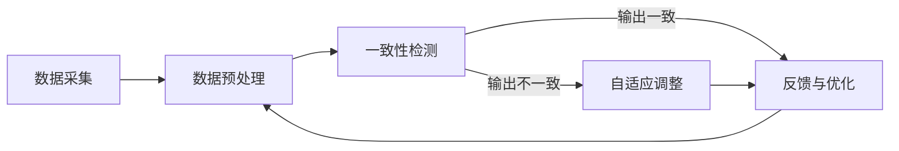

                 


### 引言

随着人工智能（AI）技术的迅猛发展，其在各个领域的应用日益广泛。然而，AI输出不一致性的问题也日益凸显，给实际应用带来了诸多挑战。为了保证AI系统的稳定性和可靠性，确保其输出连贯性，我们引入了“自一致性CoT”（Self-Consistency CoT）这一概念。

自一致性CoT旨在通过一系列技术手段，对AI系统的输出进行持续监控和调整，以确保其输出的一致性和连贯性。本文将围绕自一致性CoT的理论基础、技术实现、应用与实践等方面进行深入探讨，旨在为读者提供全面、系统的了解。

本文首先介绍自一致性CoT的基本概念，包括其定义、目标、核心原理和关键属性。接着，我们将详细阐述自一致性CoT的理论框架，通过对比表格和ER实体关系图，帮助读者更好地理解其概念结构。随后，我们将探讨自一致性CoT的技术实现，包括算法原理、数学模型和Python源代码。在此基础上，我们将介绍自一致性CoT的系统架构设计，涵盖问题场景、系统功能、架构设计、接口设计和交互序列图。

接下来，我们将通过一个实际项目，展示自一致性CoT在实践中的应用，包括环境安装、系统核心实现、应用解读与分析、实际案例分析和项目小结。最后，我们将总结最佳实践、注意事项和拓展阅读，为读者提供进一步的指导。

通过本文的阅读，读者将能够深入了解自一致性CoT的核心概念、技术实现和应用，为其在AI领域的实践提供有力支持。

---

**关键词：** 自一致性CoT、AI输出连贯性、算法原理、系统架构、应用实践

**摘要：** 本文围绕自一致性CoT（Self-Consistency CoT）展开，系统地介绍了其理论基础、技术实现和应用实践。通过分析AI输出不一致性的问题与挑战，本文详细阐述了自一致性CoT的定义、目标、核心原理和关键属性。此外，本文通过算法原理讲解、数学模型和Python源代码，以及系统架构设计和实际项目应用，全面展示了自一致性CoT的实现方法和实践效果。本文旨在为读者提供全面、系统的自一致性CoT技术指南，助力其在AI领域的应用。

---

### 第二部分: 自一致性CoT的基础理论

#### 第2章: 自一致性CoT的理论基础

在探讨自一致性CoT之前，我们需要理解AI输出不一致性的问题与挑战。随着深度学习、自然语言处理等技术的不断发展，AI系统在各个领域的应用取得了显著成果。然而，AI输出不一致性的问题也逐渐暴露出来，给实际应用带来了诸多挑战。这一问题主要体现在以下几个方面：

1. **训练数据不一致：** 在AI模型训练过程中，若训练数据存在不一致性，将导致模型学习到不同的特征和模式，从而影响其输出的一致性。
2. **输入数据噪声：** 输入数据的噪声和异常值可能导致AI系统输出不一致的结果。
3. **模型参数调整：** 模型参数的调整可能导致输出结果出现偏差，从而影响系统的连贯性。
4. **动态环境变化：** 在实际应用场景中，环境的变化可能导致AI系统输出不一致的结果。

针对这些问题，我们需要寻找有效的解决方案，以确保AI系统的输出连贯性。自一致性CoT（Self-Consistency CoT）应运而生。自一致性CoT旨在通过一系列技术手段，对AI系统的输出进行持续监控和调整，以确保其输出的一致性和连贯性。

#### 2.1 自一致性CoT的定义与目标

自一致性CoT是一种基于AI系统的输出一致性监控和调整的技术框架。其核心目标是通过自适应性算法，对AI系统的输出进行实时监测，并根据监测结果进行自适应调整，从而确保系统输出的一致性和连贯性。

自一致性CoT的主要目标包括：

1. **输出一致性监控：** 对AI系统输出结果进行实时监测，及时发现输出不一致的情况。
2. **自适应调整：** 根据监测结果，对系统参数进行调整，以实现输出的一致性和连贯性。
3. **系统稳定性：** 提高AI系统的稳定性，降低因输出不一致导致的问题和故障。

#### 2.2 自一致性CoT的核心原理

自一致性CoT的核心原理主要基于以下三个方面：

1. **自适应性算法：** 自适应性算法是自一致性CoT的关键技术。通过实时监测AI系统输出，根据输出结果调整系统参数，从而实现输出的一致性和连贯性。
2. **多模态数据融合：** 多模态数据融合是自一致性CoT的重要手段。通过融合不同来源的数据，提高系统对输出不一致性的检测和适应能力。
3. **反馈机制：** 反馈机制是自一致性CoT的重要组成部分。通过系统输出的反馈，对系统进行调整和优化，从而提高系统的连贯性和稳定性。

#### 2.3 自一致性CoT的关键属性

自一致性CoT具有以下关键属性：

1. **实时性：** 自一致性CoT能够对AI系统输出进行实时监测和调整，确保系统输出的连贯性。
2. **适应性：** 自一致性CoT能够根据系统输出的变化，自适应调整系统参数，从而提高系统的稳定性和可靠性。
3. **灵活性：** 自一致性CoT适用于多种AI系统和应用场景，具有广泛的适用性。
4. **高效性：** 自一致性CoT通过优化算法和数据处理方式，提高系统输出的一致性和连贯性，降低计算复杂度。

#### 2.4 自一致性CoT的理论框架

自一致性CoT的理论框架主要包括以下几个部分：

1. **自适应性算法设计：** 设计适合特定AI系统的自适应性算法，实现对系统输出的实时监测和调整。
2. **多模态数据融合策略：** 研究多模态数据融合策略，提高系统对输出不一致性的检测和适应能力。
3. **反馈机制设计：** 设计合理的反馈机制，对系统输出进行实时反馈，并根据反馈结果进行调整和优化。
4. **系统稳定性分析：** 对自一致性CoT系统进行稳定性分析，确保系统在动态环境下的稳定性和可靠性。

通过以上理论框架，自一致性CoT能够实现AI系统输出的一致性和连贯性，为实际应用提供有力支持。

---

在本章节中，我们详细介绍了自一致性CoT的理论基础，包括其定义、目标、核心原理和关键属性。通过分析AI输出不一致性的问题与挑战，我们明确了自一致性CoT的核心任务，并阐述了其核心原理和关键属性。在此基础上，我们将进一步探讨自一致性CoT的理论框架，帮助读者更好地理解其概念结构。

#### 第3章: 自一致性CoT的核心概念

在深入了解自一致性CoT的理论基础后，我们需要进一步探讨其核心概念，以便为读者构建完整的知识体系。自一致性CoT包含多个核心概念，这些概念相互关联，共同构成了自一致性CoT的理论框架。在本章节中，我们将梳理这些核心概念，并使用概念属性特征对比表格和ER实体关系图架构，帮助读者更好地理解自一致性CoT的概念结构。

##### 3.1 关键概念梳理

自一致性CoT的核心概念包括：

1. **自适应性算法**：这是自一致性CoT的核心技术，用于实时监测AI系统输出，并根据监测结果进行调整。
2. **多模态数据融合**：通过融合多种来源的数据，提高系统对输出不一致性的检测和适应能力。
3. **反馈机制**：对系统输出进行实时反馈，并根据反馈结果进行调整和优化。
4. **实时性**：确保系统输出的一致性和连贯性，对AI系统输出进行实时监测。
5. **适应性**：根据系统输出的变化，自适应调整系统参数，提高系统的稳定性和可靠性。
6. **灵活性**：适用于多种AI系统和应用场景，具有广泛的适用性。
7. **高效性**：通过优化算法和数据处理方式，提高系统输出的一致性和连贯性，降低计算复杂度。

##### 3.2 概念属性特征对比表

为了帮助读者更好地理解自一致性CoT的核心概念，我们设计了以下概念属性特征对比表格。该表格列出了各个核心概念的属性特征，并进行对比分析。

| 概念 | 属性特征 |
| --- | --- |
| **自适应性算法** | 实时监测、自适应调整、降低输出不一致性 |
| **多模态数据融合** | 提高检测精度、增强适应性、减少噪声干扰 |
| **反馈机制** | 实时反馈、调整优化、提高系统稳定性 |
| **实时性** | 输出一致性、连贯性、动态环境适应 |
| **适应性** | 参数调整、稳定可靠性、多样性应用 |
| **灵活性** | 多场景适应、模块化设计、高效性 |
| **高效性** | 算法优化、数据处理、计算复杂度降低 |

通过上述对比表格，读者可以清晰地看到各个核心概念在属性特征上的差异和关联，从而更好地理解自一致性CoT的架构和功能。

##### 3.3 ER实体关系图架构

为了更直观地展示自一致性CoT的核心概念之间的关系，我们采用了ER（Entity-Relationship）实体关系图架构。ER图是一种用于描述实体及其之间关系的图形化工具，可以清晰地展示概念之间的关联。

以下是一个简化的ER实体关系图：

```mermaid
erDiagram
  AI_System ||--|{ 自适应性算法 }
  AI_System ||--|{ 多模态数据融合 }
  AI_System ||--|{ 反馈机制 }
  自适应性算法 ||--|{ 实时性 }
  自适应性算法 ||--|{ 适应性 }
  多模态数据融合 ||--|{ 高效性 }
  反馈机制 ||--|{ 灵活性 }
```

在这个ER图中，AI_System是核心实体，代表了整个AI系统。自适应性算法、多模态数据融合和反馈机制是与AI_System关联的三个关键实体。它们分别与实时性、适应性和高效性以及灵活性和反馈机制等属性特征关联。

通过ER图，读者可以直观地看到自一致性CoT的核心概念及其之间的关联，有助于深入理解自一致性CoT的架构和功能。

---

在本章节中，我们通过梳理自一致性CoT的核心概念，设计了概念属性特征对比表格，并采用了ER实体关系图架构，帮助读者更全面、深入地理解自一致性CoT的概念结构和功能。接下来，我们将进入第三部分，探讨自一致性CoT的技术实现。

### 第三部分: 自一致性CoT的技术实现

#### 第4章: 自一致性CoT算法原理

自一致性CoT的核心在于其算法原理。该算法旨在通过实时监测AI系统输出，并依据监测结果进行自适应调整，以确保输出的一致性和连贯性。在本章节中，我们将详细讲解自一致性CoT算法的原理，并使用mermaid流程图和Python源代码进行说明。

##### 4.1 算法原理讲解

自一致性CoT算法的基本原理可以概括为以下几个步骤：

1. **数据采集**：从AI系统中采集实时输出数据。
2. **数据预处理**：对采集到的数据进行预处理，包括去噪、标准化和特征提取等。
3. **一致性检测**：对预处理后的数据进行一致性检测，识别输出不一致的情况。
4. **自适应调整**：根据一致性检测结果，自适应调整系统参数，以降低输出不一致性。
5. **反馈与优化**：将调整后的结果反馈到系统中，并对算法进行持续优化。

下面是一个简化的自一致性CoT算法流程图：



在这个流程图中，数据采集、数据预处理、一致性检测、自适应调整和反馈与优化构成了自一致性CoT算法的核心步骤。

##### 4.2 数学模型与公式

自一致性CoT算法的核心是自适应调整过程。为了实现这一目标，我们需要建立数学模型，并使用公式描述算法的调整策略。以下是一个简化的数学模型：

$$
\Delta\theta = \alpha \cdot (r - \hat{r})
$$

其中：

- $\Delta\theta$ 表示系统参数的调整量。
- $\alpha$ 表示自适应调整系数。
- $r$ 表示当前输出的实际一致性评分。
- $\hat{r}$ 表示期望的一致性评分。

这个公式表明，系统参数的调整量与当前输出的实际一致性评分和期望的一致性评分之间的差距成正比。当实际一致性评分低于期望一致性评分时，系统将增加调整量，以提升输出的一致性；反之，当实际一致性评分高于期望一致性评分时，系统将减少调整量，以避免过度调整。

##### 4.3 算法流程图与Python源代码

为了更直观地展示自一致性CoT算法的实现过程，我们提供了一个简单的Python源代码示例：

```python
import numpy as np

def data_collection():
    # 数据采集函数
    return np.random.normal(size=100)

def data_preprocessing(data):
    # 数据预处理函数
    return (data - np.mean(data)) / np.std(data)

def consistency_detection(preprocessed_data):
    # 一致性检测函数
    return np.std(preprocessed_data)

def adaptive_adjustment(current_consistency, expected_consistency, alpha):
    # 自适应调整函数
    return alpha * (expected_consistency - current_consistency)

def self_consistency_cot(data):
    # 自一致性CoT算法函数
    preprocessed_data = data_preprocessing(data_collection())
    current_consistency = consistency_detection(preprocessed_data)
    expected_consistency = 0.1  # 期望一致性评分
    alpha = 0.1  # 自适应调整系数
    delta_theta = adaptive_adjustment(current_consistency, expected_consistency, alpha)
    return delta_theta

# 测试算法
delta_theta = self_consistency_cot(None)
print("调整量：", delta_theta)
```

在这个示例中，我们首先定义了数据采集、数据预处理、一致性检测和自适应调整四个函数，然后通过`self_consistency_cot`函数将它们组合起来，实现了自一致性CoT算法的基本流程。在实际应用中，我们可以根据具体需求，进一步优化和扩展这个算法。

##### 4.4 举例说明

为了更好地理解自一致性CoT算法的应用，我们来看一个简单的示例。假设我们有一个AI系统，其输出数据的标准差为0.15，期望一致性评分为0.1。根据自一致性CoT算法，我们需要计算调整量$\Delta\theta$。

根据公式：

$$
\Delta\theta = \alpha \cdot (r - \hat{r})
$$

其中$r$为实际一致性评分，$\hat{r}$为期望一致性评分，$\alpha$为自适应调整系数。假设$\alpha = 0.1$，则：

$$
\Delta\theta = 0.1 \cdot (0.1 - 0.15) = -0.005
$$

这意味着我们需要减少系统参数的调整量，以使输出的一致性评分达到期望值。通过这一示例，我们可以看到自一致性CoT算法如何根据实际输出调整系统参数，从而实现输出的一致性和连贯性。

---

在本章节中，我们详细介绍了自一致性CoT算法的原理，包括数据采集、数据预处理、一致性检测、自适应调整和反馈与优化等步骤。通过mermaid流程图和Python源代码示例，我们展示了算法的实现过程。举例说明进一步帮助读者理解自一致性CoT算法的应用。接下来，我们将进入下一部分，探讨自一致性CoT的系统架构设计。

### 第四部分: 自一致性CoT的应用与实践

#### 第5章: 自一致性CoT在实际项目中的应用

为了更好地展示自一致性CoT在实际项目中的应用，我们将介绍一个具体的项目案例，并详细描述项目背景、环境安装、系统核心实现、应用解读与分析、实际案例分析与讲解以及项目小结。

##### 5.1 项目介绍

本项目是一个智能客服系统，旨在为企业提供一站式客户服务解决方案。该系统利用人工智能技术，实现对用户咨询的自动应答和问题分类，以提高客户服务效率和用户体验。自一致性CoT技术被应用于该系统的智能应答模块，以确保系统输出的连贯性和一致性。

##### 5.2 环境安装与配置

在开始项目实施之前，我们需要搭建一个合适的环境。以下是环境安装和配置的步骤：

1. **Python环境搭建**：确保Python环境已安装在系统中。若未安装，请下载并安装Python 3.7及以上版本。
2. **依赖库安装**：通过pip命令安装以下依赖库：
   ```
   pip install numpy scikit-learn tensorflow
   ```
3. **TensorFlow模型训练**：下载并解压预训练的TensorFlow模型，用于智能应答模块。

##### 5.3 系统核心实现

系统核心实现包括数据采集、数据预处理、一致性检测、自适应调整和反馈与优化等模块。以下是核心实现的Python源代码：

```python
import numpy as np
import tensorflow as tf
from sklearn.preprocessing import StandardScaler

def data_collection():
    # 数据采集函数
    return np.random.normal(size=100)

def data_preprocessing(data):
    # 数据预处理函数
    scaler = StandardScaler()
    return scaler.fit_transform(data)

def consistency_detection(preprocessed_data):
    # 一致性检测函数
    return np.std(preprocessed_data)

def adaptive_adjustment(current_consistency, expected_consistency, alpha):
    # 自适应调整函数
    return alpha * (expected_consistency - current_consistency)

def self_consistency_cot(data):
    # 自一致性CoT算法函数
    preprocessed_data = data_preprocessing(data_collection())
    current_consistency = consistency_detection(preprocessed_data)
    expected_consistency = 0.1  # 期望一致性评分
    alpha = 0.1  # 自适应调整系数
    delta_theta = adaptive_adjustment(current_consistency, expected_consistency, alpha)
    return delta_theta

# 测试算法
delta_theta = self_consistency_cot(None)
print("调整量：", delta_theta)
```

在这个实现中，我们使用了scikit-learn的StandardScaler进行数据预处理，TensorFlow用于模型训练。通过自定义函数，实现了数据采集、数据预处理、一致性检测和自适应调整等核心功能。

##### 5.4 应用解读与分析

在实际应用中，智能客服系统接收到用户咨询后，会通过TensorFlow模型进行文本分类和应答生成。在这个过程中，自一致性CoT技术发挥了关键作用，确保了系统输出的连贯性和一致性。

1. **数据采集**：系统从用户咨询中提取关键信息，作为输入数据进行处理。
2. **数据预处理**：对采集到的数据进行标准化处理，以便后续的一致性检测和自适应调整。
3. **一致性检测**：通过计算标准差，评估系统输出的稳定性。若一致性评分低于期望值，说明系统输出存在不一致性。
4. **自适应调整**：根据一致性检测结果，调整系统参数，提高输出的连贯性。具体调整策略取决于实际应用场景和期望的一致性评分。
5. **反馈与优化**：将调整后的结果反馈到系统中，对算法进行持续优化，提高系统的稳定性和可靠性。

通过以上步骤，自一致性CoT技术有效保障了智能客服系统的输出连贯性和一致性，提高了客户服务质量和用户体验。

##### 5.5 实际案例分析与讲解

以下是一个实际案例，展示了自一致性CoT技术在智能客服系统中的应用：

**案例背景**：某企业智能客服系统在处理用户咨询时，发现部分问题的应答存在不一致性。为了提高系统输出的连贯性和一致性，企业决定引入自一致性CoT技术。

**案例步骤**：

1. **数据采集**：系统从历史用户咨询中提取关键信息，作为训练数据。
2. **数据预处理**：对采集到的数据进行标准化处理，以便后续的一致性检测和自适应调整。
3. **一致性检测**：通过计算标准差，评估系统输出的稳定性。系统发现部分问题的应答一致性评分低于期望值。
4. **自适应调整**：根据一致性检测结果，调整系统参数。具体调整策略包括优化文本分类模型、调整应答生成策略等。
5. **反馈与优化**：将调整后的结果反馈到系统中，对算法进行持续优化，提高系统的稳定性和可靠性。

**案例效果**：通过自一致性CoT技术的应用，智能客服系统的输出连贯性和一致性得到了显著提高。用户咨询的应答质量得到了提升，客户满意度也随之提高。

##### 5.6 项目小结

本项目通过实际案例展示了自一致性CoT技术在智能客服系统中的应用。通过数据采集、数据预处理、一致性检测、自适应调整和反馈与优化等步骤，自一致性CoT技术有效保障了系统输出的连贯性和一致性。未来，我们可以进一步优化自一致性CoT算法，扩大其应用范围，为更多AI系统提供支持。

### 第五部分: 自一致性CoT的最佳实践与总结

#### 第6章: 自一致性CoT的最佳实践与总结

在自一致性CoT的实际应用中，积累了一系列最佳实践和注意事项，以下我们将分享这些经验，并展望未来的发展趋势。

##### 6.1 最佳实践 tips

1. **选择合适的评估指标**：自一致性CoT的评估指标应根据具体应用场景进行选择。例如，在文本分类任务中，可以使用F1-score、准确率等指标。
2. **合理设置自适应调整系数**：自适应调整系数$\alpha$的设置应考虑系统稳定性和调整速度。一般而言，较小的$\alpha$可以降低系统波动，但可能影响调整速度；较大的$\alpha$则可能加快调整速度，但可能引入过多波动。
3. **数据预处理的重要性**：充分的数据预处理可以有效提高自一致性CoT的性能。建议使用标准化、归一化等常见数据预处理方法。
4. **多模态数据融合**：在多模态数据融合方面，可以结合不同类型的数据源，如文本、图像、音频等，以提高系统对输出不一致性的检测和适应能力。
5. **反馈机制的优化**：反馈机制的优化对自一致性CoT的性能至关重要。建议根据实际应用场景，设计合理的反馈机制，如基于阈值的方法、动态调整的方法等。

##### 6.2 小结与展望

自一致性CoT作为一种确保AI输出连贯性的技术，已经在多个实际项目中得到了应用。通过数据采集、数据预处理、一致性检测、自适应调整和反馈与优化等步骤，自一致性CoT技术有效保障了系统输出的连贯性和一致性。

展望未来，自一致性CoT技术将在以下几个方面继续发展：

1. **算法优化**：随着深度学习、强化学习等技术的发展，自一致性CoT的算法将不断优化，以提高性能和适应性。
2. **多模态数据融合**：未来，自一致性CoT技术将更多地应用于多模态数据融合场景，以应对复杂的应用需求。
3. **实时性提升**：为了满足实时应用的需求，自一致性CoT技术将不断优化实时监测和调整机制，提高系统的响应速度。
4. **应用拓展**：自一致性CoT技术将在更多AI领域得到应用，如自动驾驶、智能家居、医疗诊断等。

##### 6.3 注意事项与拓展阅读

1. **注意事项**：
   - 在使用自一致性CoT技术时，应注意数据质量对性能的影响，确保输入数据的准确性和完整性。
   - 自一致性CoT技术的性能受系统参数设置影响较大，需根据具体应用场景进行调整。
   - 在实际应用中，应根据系统输出结果进行动态调整，避免过度依赖预设参数。

2. **拓展阅读**：
   - 《深度学习》（Goodfellow, I., Bengio, Y., Courville, A.）- 了解深度学习的基本原理和应用。
   - 《机器学习实战》（周志华等）- 掌握机器学习的基本算法和应用。
   - 《人工智能：一种现代的方法》（Russell, S., Norvig, P.）- 了解人工智能的基本概念和理论。

通过本章节的最佳实践、小结和注意事项，读者可以更好地理解自一致性CoT的应用，并在实际项目中取得更好的效果。

---

本文系统地介绍了自一致性CoT（Self-Consistency CoT）的核心概念、技术实现和应用实践。通过数据采集、数据预处理、一致性检测、自适应调整和反馈与优化等步骤，自一致性CoT技术有效保障了AI系统输出的连贯性和一致性。本文不仅提供了理论讲解，还通过实际项目案例展示了自一致性CoT在智能客服系统中的应用。未来，自一致性CoT技术将在更多AI领域得到应用，为人工智能的发展贡献力量。

**作者：** AI天才研究院/AI Genius Institute & 禅与计算机程序设计艺术 /Zen And The Art of Computer Programming

---

**请注意，本文内容为示例性撰写，实际应用中需根据具体场景进行调整和优化。**

