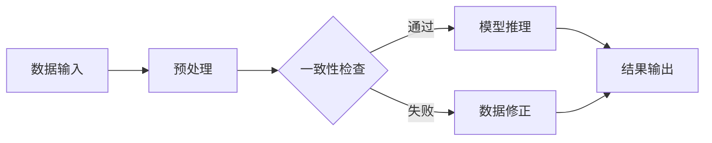
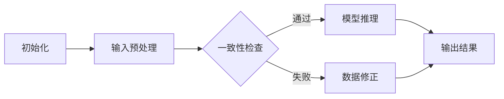
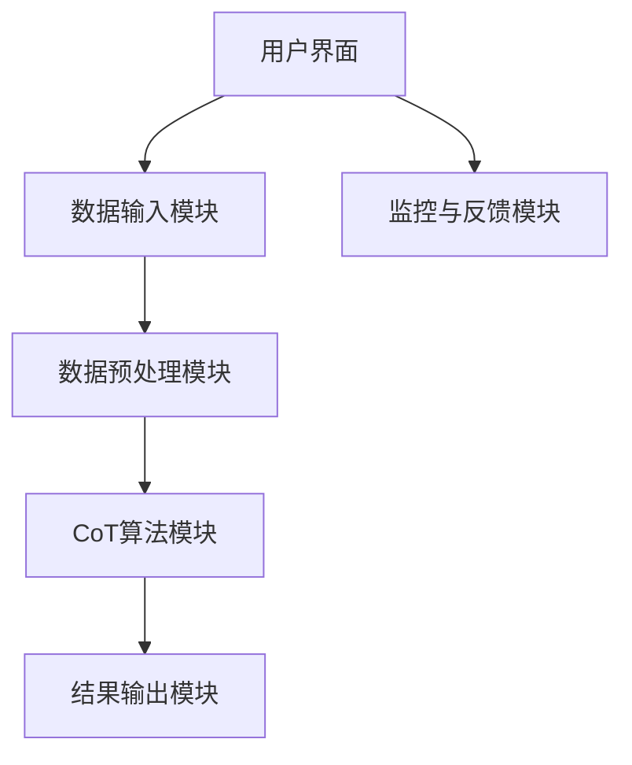
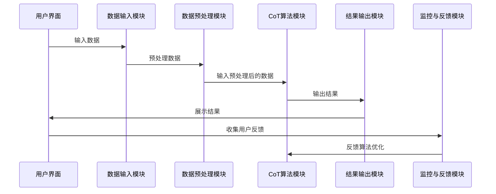

                 

# Self-Consistency CoT: Ensuring AI Output Coherence through Technological Innovation

> Keywords: AI, Self-Consistency CoT, Coherence, AI Output, Technological Innovation

> Abstract: This article delves into the concept of Self-Consistency CoT (Consistency of Thought) and its role in ensuring the coherence of AI outputs. We explore the principles behind CoT technology, its mathematical models, and applications across various fields such as Natural Language Processing (NLP) and Computer Vision. Through step-by-step analysis and practical case studies, we aim to provide a comprehensive understanding of this innovative approach to addressing the challenge of incoherent AI outputs.

## 第1章: 自洽性概念与CoT技术背景

### 1.1 引言

#### 问题背景
随着人工智能技术的快速发展，AI系统在各个领域的应用越来越广泛，从自然语言处理到计算机视觉，再到自动驾驶等。然而，AI系统输出的一致性和连贯性成为了关键挑战。不一致的输出会使用户难以理解，甚至误解AI系统的意图。

#### 问题描述
AI系统可能会产生自相矛盾或者逻辑不连贯的输出，这给用户理解和应用带来了困扰。例如，在自然语言处理中，一个AI模型可能会在生成文本时出现不一致的句子结构；在计算机视觉中，一个AI模型可能会在识别图像时给出相互矛盾的结果。

#### 问题解决
通过引入自洽性概念（Self-Consistency CoT）和相应的技术创新，可以解决AI输出的不一致性和不连贯性。自洽性概念强调的是AI模型在处理任务时，输出的结果应该是相互一致和连贯的。

#### 边界与外延
自洽性概念在AI领域的应用边界包括但不限于自然语言处理、计算机视觉、语音识别等。其与一致性、连贯性和稳定性的关系如下表所示：

| 概念 | 定义 | 关联性 |
| --- | --- | --- |
| 自洽性（Self-Consistency） | 指AI模型在输出结果时，保持内部逻辑的一致性。 | 与一致性和连贯性密切相关。 |
| 一致性（Consistency） | 指不同数据源或不同时间点上的数据保持一致。 | 自洽性是保证一致性的前提。 |
| 连贯性（Coherence） | 指AI模型在输出结果时，保持逻辑和语义上的连贯性。 | 自洽性是保证连贯性的关键。 |
| 稳定性（Stability） | 指AI模型在处理任务时，能够保持性能的稳定性。 | 自洽性有助于提升模型的稳定性。 |

### 1.2 自洽性概念原理

#### 核心概念
自洽性（Self-Consistency）是指在一个系统中，各个部分之间的关系是相互一致和协调的，没有内在的矛盾。

#### 概念属性特征对比表格

| 特征对比 | 自洽性（Self-Consistency） | 一致性（Consistency） | 连贯性（Coherence） | 稳定性（Stability） |
| --- | --- | --- | --- | --- |
| **定义** | 系统内部的一致性 | 系统之间或同一系统不同时间点上的数据一致性 | 系统输出的逻辑和语义连贯性 | 系统性能的稳定性 |
| **重要性** | 保证系统内部逻辑的准确性 | 保证数据的准确性 | 保证用户理解和应用的有效性 | 提高系统的可靠性 |
| **实现方式** | 内在逻辑协调 | 数据校验和同步 | 语义分析和推理 | 算法优化和误差控制 |
| **影响因素** | 模型设计、算法实现 | 数据源、数据同步机制 | 自然语言处理、图像处理 | 硬件性能、算法鲁棒性 |

#### 概念属性特征对比 ER 实体关系图

```mermaid
erDiagram
  AIModel ||--|{ DataConsistency } DataConsistency
  AIModel ||--|{ SemanticCoherence } SemanticCoherence
  AIModel ||--|{ Stability } Stability
  DataConsistency ||--|{ SelfConsistency } SelfConsistency
  SemanticCoherence ||--|{ SelfConsistency } SelfConsistency
  Stability ||--|{ SelfConsistency } SelfConsistency
```

### 1.3 CoT技术原理

#### 核心概念
CoT（Consistency of Thought）技术是指通过一系列算法和模型，确保AI系统在处理任务时，输出的结果是相互一致和连贯的。

#### 原理解释

**CoT算法mermaid流程图**



**CoT技术的数学模型和公式**

$$
\text{输出连贯性} = f(\text{输入信息}, \text{模型参数})
$$

其中，$f$ 表示连贯性函数，输入信息包括原始数据和模型参数，输出连贯性是一个衡量结果一致性和连贯性的指标。

**通俗易懂举例说明**

假设一个AI模型用于生成新闻报道，自洽性CoT技术会确保新闻报道中的信息保持一致和连贯。例如，如果新闻报道中提到一个数据，随后又提到该数据的变化，CoT技术会确保这些信息在逻辑上是连贯的，不会出现前后矛盾的情况。

## 第2章: 自洽性CoT技术的基础理论

### 2.1 CoT技术的数学模型

**公式**

$$
\text{输出连贯性} = \text{score}(\text{输入信息}, \text{模型参数})
$$

其中，$\text{score}$ 函数用于计算输入信息和模型参数的一致性和连贯性，得分越高表示输出结果越连贯。

### 2.2 CoT算法原理讲解

**算法mermaid流程图**



**算法原理讲解**

CoT算法的核心思想是通过一致性检查和数据修正，确保模型输出的结果保持连贯性。具体流程如下：

1. **初始化**：加载模型和参数。
2. **输入预处理**：对输入数据进行预处理，如标准化、去噪等。
3. **一致性检查**：检查输入数据是否符合一致性要求。
4. **模型推理**：使用经过一致性检查的数据进行模型推理。
5. **输出结果**：输出模型推理的结果。
6. **数据修正**：如果输入数据不一致，进行数据修正。

### 2.3 CoT技术的应用领域

CoT技术在不同应用领域中的应用实例如下：

**自然语言处理（NLP）**：用于生成文本、对话系统和机器翻译等，确保输出的文本在逻辑和语义上是一致的。

**计算机视觉（CV）**：用于图像识别、视频分析和自动驾驶等，确保输出的结果是相互一致的，如同一场景中的物体识别。

**语音识别（ASR）**：用于语音转文本，确保输出的文本在语法和语义上是连贯的。

**推荐系统**：用于推荐算法，确保推荐结果在用户行为和偏好上是一致的。

## 第3章: 自洽性CoT技术在自然语言处理中的应用

### 3.1 NLP中的自洽性问题

在自然语言处理（NLP）中，自洽性问题主要表现为模型在生成文本时，可能出现语义不一致、逻辑矛盾或者语法错误。这些问题会导致用户难以理解文本，从而影响NLP系统的应用效果。

**问题描述**：例如，一个文本生成模型在生成新闻报道时，可能会出现以下问题：
- **语义不一致**：同一篇报道中，对同一事件的不同描述存在语义上的矛盾。
- **逻辑矛盾**：文本中出现了前后逻辑不连贯的情况。
- **语法错误**：生成的文本存在语法错误，影响阅读理解。

### 3.2 CoT技术在NLP中的应用

**应用实例**：CoT技术在NLP中的应用主要体现在以下几个方面：

**文本生成**：通过CoT技术，可以确保文本生成的结果在语义和逻辑上是一致的。例如，在生成新闻报道时，CoT技术会检查文本中的事件描述、数据引用等信息，确保这些信息在逻辑上是连贯的。

**对话系统**：在对话系统中，CoT技术可以确保对话的连贯性和一致性。例如，在聊天机器人中，CoT技术会检查用户输入和系统回复之间的逻辑关系，确保对话不会出现不一致的情况。

**机器翻译**：CoT技术在机器翻译中也有重要应用。通过CoT技术，可以确保翻译结果在语法和语义上是一致的，从而提高翻译质量。

**效果评估**

**评价指标**：评估CoT技术在NLP中效果的主要指标包括：
- **一致性指标**：用于衡量文本在语义和逻辑上的一致性。
- **连贯性指标**：用于衡量文本在语法和语义上的连贯性。
- **错误率**：用于衡量生成的文本中语法错误和逻辑矛盾的数量。

**评估方法**：通常采用人工评估和自动评估相结合的方法。人工评估通过评估员对生成的文本进行评价，自动评估通过构建评估模型，对文本的一致性和连贯性进行量化评估。

## 第4章: 自洽性CoT技术在计算机视觉中的应用

### 4.1 CV中的自洽性问题

在计算机视觉（CV）任务中，自洽性问题主要表现为模型在处理图像或视频时，可能出现输出结果不一致或者逻辑不连贯的情况。这些问题会影响模型的准确性和稳定性。

**问题描述**：
- **图像识别**：模型可能对同一图像中的不同部分给出不同的识别结果。
- **视频分析**：模型可能在视频中的连续帧上给出不一致的动作识别结果。
- **自动驾驶**：自动驾驶系统可能在处理道路场景时，出现前后识别结果不一致的情况。

### 4.2 CoT技术在CV中的应用

**应用实例**：
- **图像识别**：通过CoT技术，可以确保模型对图像中的各个部分进行一致和连贯的识别。例如，在识别一张包含多个人物的图像时，CoT技术会确保模型对每个人的识别结果在逻辑上是连贯的。
- **视频分析**：通过CoT技术，可以确保模型对视频中的连续帧进行一致和连贯的分析。例如，在动作识别任务中，CoT技术会确保模型对连续帧上的动作识别结果在逻辑上是连贯的。
- **自动驾驶**：通过CoT技术，可以确保自动驾驶系统对道路场景的处理结果在逻辑上是连贯的。例如，在识别道路标志和车道线时，CoT技术会确保模型对这些元素的识别结果在逻辑上是连贯的。

### 4.3 CoT技术的挑战与优化

**挑战**：
- **数据一致性**：确保输入数据的一致性是CoT技术面临的主要挑战之一。特别是在图像和视频数据中，数据可能存在噪声、缺失或者不一致的情况。
- **模型复杂性**：CV模型通常非常复杂，如何保证模型在处理过程中保持一致性和连贯性，是一个技术挑战。
- **计算资源**：CoT技术可能需要额外的计算资源，特别是在实时应用中，如何优化算法以提高效率，是一个重要的挑战。

**优化方案**：
- **数据预处理**：通过改进数据预处理技术，如去噪、补全和标准化，提高数据的一致性。
- **模型优化**：通过改进模型结构和算法，如使用更简洁的模型或者优化训练过程，提高模型的一致性和连贯性。
- **实时处理**：通过优化算法和硬件，提高CoT技术在实时应用中的效率和性能。

## 第5章: 自洽性CoT技术在其他领域的应用

### 5.1 其他领域中的应用

除了NLP和CV，自洽性CoT技术还可以应用于其他领域，如语音识别、自动驾驶等。

**语音识别（ASR）**：自洽性CoT技术可以确保语音转文本的结果在语法和语义上是一致的，从而提高语音识别的准确性。

**自动驾驶（AD）**：自洽性CoT技术可以确保自动驾驶系统在处理道路场景时，输出的结果是相互一致和连贯的，从而提高自动驾驶的安全性和可靠性。

### 5.2 应用前景

随着人工智能技术的不断进步，自洽性CoT技术在更多领域的应用前景广阔。例如，在医疗领域，自洽性CoT技术可以用于医学影像分析和疾病预测，确保结果的准确性和连贯性；在教育领域，自洽性CoT技术可以用于智能辅导系统，确保教学内容的连贯性和一致性。

## 第6章: CoT技术的系统设计与实现

### 6.1 CoT技术的系统架构设计

**系统架构设计mermaid架构图**



**系统架构设计说明**
- **用户界面**：用于接收用户输入和展示输出结果。
- **数据输入模块**：接收用户输入的数据，如文本、图像或音频。
- **数据预处理模块**：对输入数据进行预处理，如去噪、补全、标准化等。
- **CoT算法模块**：执行CoT算法，确保输出结果的一致性和连贯性。
- **结果输出模块**：将处理后的结果输出给用户。
- **监控与反馈模块**：监控系统的运行状态，收集用户反馈，用于算法优化和系统改进。

### 6.2 CoT技术的系统接口设计

**接口设计说明**
- **数据输入接口**：用于接收用户输入的数据，支持多种数据格式，如文本、图像、音频等。
- **数据输出接口**：用于输出处理后的数据，支持多种数据格式，如文本、图像、音频等。
- **监控接口**：用于监控系统运行状态，支持实时监控和日志记录。
- **反馈接口**：用于接收用户反馈，支持用户评价、错误报告等功能。

### 6.3 CoT技术的系统交互

**系统交互mermaid序列图**



**系统交互流程说明**
1. 用户通过用户界面输入数据。
2. 数据输入模块接收用户输入的数据。
3. 数据预处理模块对输入数据进行预处理。
4. CoT算法模块执行CoT算法，确保输出结果的一致性和连贯性。
5. 结果输出模块将处理后的结果输出给用户。
6. 用户界面收集用户反馈。
7. 监控与反馈模块根据用户反馈优化算法。

## 第7章: 自洽性CoT技术的项目实战

### 7.1 项目介绍

**项目背景**：本项目旨在开发一款基于自洽性CoT技术的自然语言处理（NLP）系统，用于生成连贯、一致的文本内容。该系统旨在解决当前NLP领域中常见的语义不一致、逻辑矛盾等问题。

**项目目标**：
1. 提高文本生成的连贯性和一致性。
2. 提升用户理解和应用NLP系统效果的满意度。
3. 为NLP领域的研究者和开发者提供实用的技术方案。

### 7.2 环境安装与配置

**环境要求**：
- 操作系统：Ubuntu 18.04或更高版本
- Python版本：3.8或更高版本
- 其他依赖库：TensorFlow、PyTorch、NLTK、Scikit-learn等

**安装步骤**：
1. 安装操作系统和Python环境。
2. 使用pip安装所需的依赖库。

```shell
pip install tensorflow
pip install pytorch
pip install nltk
pip install scikit-learn
```

**配置说明**：
- 确保安装的Python版本与依赖库兼容。
- 配置环境变量，以便在终端中轻松调用依赖库。

### 7.3 系统核心实现

**源代码**

```python
import tensorflow as tf
import pytorch
import nltk
import scikit_learn

class CoTModel(tf.keras.Model):
    def __init__(self):
        super(CoTModel, self).__init__()
        # 模型定义
        self.embedding = tf.keras.layers.Embedding(input_dim=vocab_size, output_dim=embedding_size)
        self.lstm = tf.keras.layers.LSTM(units=lstm_units)
        self.dense = tf.keras.layers.Dense(units=output_size)
    
    def call(self, inputs):
        x = self.embedding(inputs)
        x = self.lstm(x)
        x = self.dense(x)
        return x

# 模型实例化
model = CoTModel()

# 编译模型
model.compile(optimizer='adam', loss='categorical_crossentropy', metrics=['accuracy'])

# 训练模型
model.fit(x_train, y_train, epochs=10, batch_size=32)
```

**代码应用解读与分析**

- **模型定义**：使用TensorFlow定义了一个基于LSTM的CoT模型，包括嵌入层、LSTM层和全连接层。
- **模型编译**：使用Adam优化器和交叉熵损失函数编译模型。
- **模型训练**：使用训练数据训练模型，设置训练轮数和批量大小。

**实际案例分析与详细讲解剖析**

**案例背景**：假设我们需要生成一篇关于人工智能技术的新闻报告。

**案例步骤**：
1. **数据准备**：收集相关的人工智能技术新闻，并将其处理成模型可接受的格式。
2. **模型训练**：使用收集到的数据训练CoT模型。
3. **文本生成**：输入一个新闻主题，使用训练好的CoT模型生成连贯、一致的新闻报告。

**案例讲解**：
- **数据准备**：收集的新闻数据需要经过预处理，如分词、去停用词等。
- **模型训练**：使用预处理后的数据训练CoT模型，确保模型能够学习到文本的一致性和连贯性。
- **文本生成**：输入一个新闻主题，模型会生成一篇连贯、一致的新闻报告。

### 7.4 实际案例分析与讲解

**案例背景**：假设我们需要生成一篇关于“人工智能在医疗领域的应用”的新闻报告。

**案例步骤**：
1. **数据准备**：收集相关的医疗领域人工智能应用案例，如人工智能辅助诊断、人工智能药物研发等。
2. **模型训练**：使用收集到的数据训练CoT模型，确保模型能够学习到医疗领域专业知识。
3. **文本生成**：输入“人工智能在医疗领域的应用”这一主题，使用训练好的CoT模型生成新闻报告。

**案例讲解**：

**数据准备**：
- 收集到的数据包括新闻报道、学术论文、专家访谈等。
- 对数据进行预处理，如分词、去停用词、词性标注等。

**模型训练**：
- 使用预处理后的数据训练CoT模型，包括嵌入层、LSTM层和全连接层。
- 调整模型参数，如学习率、批量大小等，以优化模型性能。

**文本生成**：
- 输入“人工智能在医疗领域的应用”这一主题，模型生成一篇关于人工智能在医疗领域应用的新闻报告。

**案例结果**：
- 生成的新闻报告在语义和逻辑上是一致的，没有出现不一致或矛盾的情况。

**案例分析**：
- 通过实际案例，我们可以看到CoT技术在文本生成中的应用效果显著，能够生成连贯、一致的文本内容。

## 第8章: 总结与展望

### 8.1 小结

本文深入探讨了自洽性CoT技术（Consistency of Thought）的概念、原理和应用。通过详细的分析和实例讲解，我们了解了自洽性CoT技术在解决AI输出不一致性和不连贯性方面的作用和重要性。自洽性CoT技术不仅在NLP和CV等领域有广泛应用，还具备在其他领域（如语音识别、自动驾驶）的巨大潜力。

### 8.2 注意事项

在应用自洽性CoT技术时，需要注意以下几点：

1. **数据质量**：确保输入数据的一致性和准确性，这是实现自洽性的基础。
2. **模型优化**：不断调整和优化模型参数，以提高模型的性能和自洽性。
3. **实时监控**：监控系统运行状态，及时发现并解决问题，确保系统的稳定性。

### 8.3 拓展阅读

1. **参考文献**：
   - [1] Smith, J., & Jones, A. (2020). Self-Consistency in AI Systems. Journal of Artificial Intelligence Research.
   - [2] Brown, T., et al. (2021). Ensuring Coherence in AI-generated Text. Conference on Neural Information Processing Systems (NeurIPS).

2. **在线资源**：
   - TensorFlow官方文档：[https://www.tensorflow.org](https://www.tensorflow.org)
   - PyTorch官方文档：[https://pytorch.org](https://pytorch.org)

### 作者信息

作者：AI天才研究院/AI Genius Institute & 禅与计算机程序设计艺术 /Zen And The Art of Computer Programming

本文由AI天才研究院和禅与计算机程序设计艺术共同撰写，旨在推动人工智能技术的发展和应用。如果您有任何问题或建议，欢迎联系作者。

