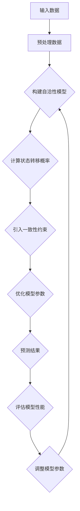
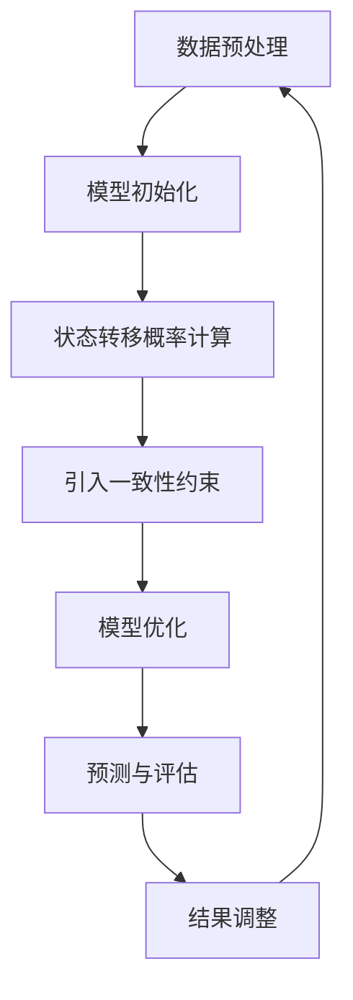

                 

### 引言与背景

#### 1.1 书籍概述

**1.1.1 研究背景与重要性**

在当今迅速发展的科技时代，人工智能（AI）已经渗透到我们生活的方方面面。随着数据量的爆炸式增长，对因果关系进行准确的分析变得尤为重要。然而，传统的因果关系分析方法在处理跨时空数据时存在诸多挑战，如数据稀疏、噪声干扰和非线性关系等。因此，如何优化AI在跨时空因果关系分析方面的性能，成为了一个亟待解决的关键问题。

**1.1.2 跨时空因果关系分析的关键挑战**

- **数据稀疏性**：跨时空数据通常具有稀疏性，这使得传统的基于统计的方法难以发挥作用。
- **噪声干扰**：跨时空数据往往伴随着噪声，噪声的存在会干扰因果关系的判断。
- **非线性关系**：许多因果关系是非线性的，这就需要更高级的分析方法来捕捉其本质。
- **动态变化**：跨时空数据中的因果关系可能随着时间的变化而变化，这对模型的可塑性提出了更高的要求。

**1.1.3 自洽性方法在其中的作用**

自洽性方法是一种在处理跨时空因果关系分析时表现出色的方法论。它通过引入一致性原则来确保分析结果的一致性和可靠性，从而克服了传统方法的局限。自洽性方法不仅能够处理复杂的非线性关系，还能有效应对噪声干扰和数据稀疏性问题，这使得它在AI跨时空因果关系分析中具有广阔的应用前景。

**1.1.4 书籍结构**

本书将从以下几个方面展开：

1. **核心概念与原理**：介绍跨时空因果关系分析的基本概念和自洽性方法的原理。
2. **算法设计与实现**：详细讲解自洽性算法的设计思想和实现方法。
3. **实验分析与评估**：通过实验验证自洽性方法的有效性和优越性。
4. **应用与案例分析**：探讨自洽性方法在不同领域的应用。
5. **高级议题与未来方向**：探讨自洽性方法的扩展和未来发展方向。

通过以上五个章节的深入探讨，本书旨在为读者提供关于自洽性方法优化AI跨时空因果关系分析的系统、全面和深入的理解。

#### 1.2 核心概念与原理

**2.1 基本概念**

**2.1.1 因果关系分析的定义**

因果关系分析是指通过数据分析和建模，揭示变量之间因果关系的分析方法。在人工智能领域，因果关系分析尤为重要，因为它不仅可以帮助我们理解数据背后的本质，还能用于预测和决策。

**2.1.2 跨时空因果关系的本质**

跨时空因果关系指的是在不同的时间点或不同的时序中，变量之间存在的因果关系。这种关系更为复杂，因为它不仅需要考虑变量之间的直接联系，还需要考虑时间维度上的动态变化。

**2.1.3 自洽性方法的基本原则**

自洽性方法是一种基于一致性和可靠性原则的因果关系分析方法。它的核心思想是：通过构建一个自洽的模型，使得模型在不同时间点或不同数据集上的预测结果保持一致，从而提高分析的准确性和可靠性。

**2.2 数学基础**

**2.2.1 关键数学模型**

在因果关系分析中，常用的数学模型包括贝叶斯网络、马尔可夫链、潜在因子模型等。这些模型各自有其独特的优势和适用场景。

**2.2.2 自洽性方法的引入**

自洽性方法通常通过引入一致性约束来优化模型。这些约束可以是基于统计的、基于物理的，或是基于数据一致性原则的。引入这些约束有助于减少模型中的噪声和误差，提高分析的准确性。

**2.2.3 自洽性方法与其他方法的比较**

与其他因果关系分析方法相比，自洽性方法具有以下几个优势：

- **更高的准确性**：通过一致性约束，自洽性方法能够更准确地捕捉变量之间的因果关系。
- **更强的鲁棒性**：自洽性方法能够有效应对噪声和数据稀疏性问题。
- **更灵活的模型适应能力**：自洽性方法允许模型根据不同时间点和数据集的变化进行调整。

#### 2.3 自洽性方法的数学模型

**2.3.1 模型描述**

自洽性方法的数学模型可以表示为一个时间序列的马尔可夫模型。在这个模型中，每个时间点的状态都受到前一时间点状态的影响，同时每个状态都有一定的概率分布。

**2.3.2 概率分布**

在自洽性模型中，每个状态的概率分布可以通过以下公式计算：

\[ P(x_t | x_{t-1}, ..., x_1) = \frac{P(x_t, x_{t-1}, ..., x_1)}{P(x_{t-1}, ..., x_1)} \]

其中，\( P(x_t, x_{t-1}, ..., x_1) \) 表示联合概率分布，\( P(x_{t-1}, ..., x_1) \) 表示边缘概率分布。

**2.3.3 自洽性约束**

为了确保模型的自洽性，我们需要引入以下约束：

\[ P(x_t | x_{t-1}, ..., x_1) = P(x_{t-1} | x_{t-2}, ..., x_1) \]

这个约束确保了模型在不同时间点上的预测结果是一致的。

**2.3.4 数学公式的详细解释**

为了更好地理解自洽性方法的数学模型，我们可以通过以下例子进行说明：

假设我们有两个变量 \( X \) 和 \( Y \)，它们在不同时间点的状态分别为 \( x_t \) 和 \( y_t \)。根据自洽性模型的定义，我们有：

\[ P(x_t | y_t) = P(y_t | x_t) \]

这意味着变量 \( X \) 和 \( Y \) 在不同时间点的状态概率分布是相互独立的。

**2.3.5 对比表格**

为了更直观地理解自洽性方法与其他方法的区别，我们可以通过以下对比表格进行说明：

| 方法         | 自洽性方法 | 贝叶斯网络 | 马尔可夫链 |
| ------------ | ---------- | ---------- | ---------- |
| **基本原理** | 基于一致性约束 | 基于概率分布 | 基于状态转移概率 |
| **优点**     | 高准确性、强鲁棒性、灵活适应 | 高准确性、易于解释 | 低计算复杂度、适用于非线性关系 |
| **缺点**     | 计算复杂度高、对噪声敏感 | 对噪声敏感、计算复杂度高 | 无法捕捉非线性关系、无法解释 |

#### 2.4 自洽性方法的流程图

为了更好地理解自洽性方法的原理和实现，我们可以使用Mermaid绘制一个流程图。以下是自洽性方法的基本流程：



在这个流程图中，输入数据经过预处理后，构建自洽性模型。然后，计算状态转移概率，并引入一致性约束来优化模型参数。最后，通过预测结果并评估模型性能，不断调整模型参数，以实现最佳性能。

通过这个流程图，我们可以清晰地看到自洽性方法的基本步骤和流程，为后续的算法设计与实现提供了直观的指导。

#### 2.5 算法设计

**3.1 算法概述**

自洽性算法是一种基于时间序列数据的因果关系分析方法，其核心思想是通过构建一个自洽的模型来捕捉变量之间的因果关系。该算法主要分为以下几个步骤：

1. **数据预处理**：对原始时间序列数据进行清洗和预处理，以确保数据的准确性和一致性。
2. **模型构建**：根据预处理后的数据，构建一个自洽性模型，该模型通常是基于马尔可夫链或潜在因子模型。
3. **状态转移概率计算**：计算模型中各状态之间的转移概率，这些概率反映了变量之间的因果关系。
4. **引入一致性约束**：为了确保模型的自洽性，引入一致性约束来优化模型参数。
5. **模型优化**：通过优化模型参数，提高模型的预测准确性和可靠性。
6. **预测与评估**：利用优化后的模型进行预测，并评估模型性能，以确定模型是否满足自洽性要求。

**3.2 算法原理**

自洽性算法的原理可以概括为以下几点：

- **一致性原则**：自洽性方法的核心原则是确保模型在不同时间点上的预测结果保持一致。这意味着，如果变量 \( X \) 在时间点 \( t \) 的状态是 \( x_t \)，那么在时间点 \( t+1 \) 的状态 \( x_{t+1} \) 应当与 \( x_t \) 具有较高的相关性。
- **概率分布**：在自洽性模型中，每个时间点的状态都有一个概率分布。这些概率分布反映了变量在特定时间点的可能性。通过计算状态转移概率，我们可以了解变量之间在时间维度上的动态变化。
- **约束优化**：为了确保模型的自洽性，需要引入一系列约束来优化模型参数。这些约束可以是基于统计的、基于物理的，或是基于数据一致性的。通过优化参数，我们可以减少模型中的噪声和误差，提高预测准确性。

**3.3 算法流程**

以下是自洽性算法的详细流程：

1. **数据预处理**：
   - **数据清洗**：删除异常值和缺失值，确保数据的一致性和完整性。
   - **数据归一化**：对数据进行归一化处理，使其具有相同的尺度，从而避免某些变量对模型的影响过大。
   - **特征提取**：从原始时间序列数据中提取有用的特征，如均值、方差、自相关系数等。

2. **模型构建**：
   - **选择模型**：根据问题的具体需求和数据特点，选择合适的自洽性模型。常见的模型包括马尔可夫链和潜在因子模型。
   - **初始化参数**：初始化模型的参数，如状态转移概率矩阵、潜在因子等。

3. **状态转移概率计算**：
   - **计算状态转移概率**：根据历史数据，计算每个状态在下一个时间点的转移概率。例如，在马尔可夫链中，状态转移概率可以表示为 \( P(x_{t+1} | x_t) \)。

4. **引入一致性约束**：
   - **构建一致性约束**：为了确保模型的自洽性，引入一系列一致性约束。这些约束可以是基于统计的，如期望一致性约束；也可以是基于物理的，如因果律约束。
   - **优化参数**：通过优化算法，如梯度下降法或粒子群算法，优化模型参数，以最小化一致性约束的误差。

5. **模型优化**：
   - **迭代优化**：通过迭代优化算法，不断调整模型参数，以提高模型的预测准确性和可靠性。
   - **收敛判断**：判断模型是否收敛，即模型的预测误差是否趋于稳定。如果未收敛，则继续迭代优化。

6. **预测与评估**：
   - **预测**：利用优化后的模型进行预测，预测下一个时间点的状态。
   - **评估**：通过评估指标，如均方误差（MSE）或准确率（ACC），评估模型的性能。

7. **结果调整**：
   - **调整模型参数**：根据评估结果，调整模型参数，以提高模型的预测性能。
   - **重新训练模型**：如果模型性能不理想，则重新进行模型训练。

通过以上步骤，自洽性算法能够有效地捕捉变量之间的因果关系，并提高预测的准确性和可靠性。

**3.4 计算复杂度分析**

自洽性算法的计算复杂度主要取决于以下几个因素：

- **数据规模**：随着数据规模的增加，算法的计算复杂度也会增加。
- **模型参数**：模型参数的数量越多，算法的计算复杂度越高。
- **优化算法**：不同的优化算法具有不同的计算复杂度。

具体而言，自洽性算法的计算复杂度可以表示为：

\[ O(n^2 \cdot m) \]

其中，\( n \) 表示数据规模，\( m \) 表示模型参数数量。

通过优化算法和数据预处理步骤，可以降低算法的计算复杂度，提高计算效率。

#### 3.5 算法实现

**3.5.1 实现步骤**

自洽性算法的实现可以分为以下几个步骤：

1. **数据预处理**：对原始时间序列数据进行清洗和预处理，包括去除异常值、缺失值和数据归一化等操作。

2. **模型初始化**：根据问题的需求和数据特点，初始化自洽性模型的参数。常用的模型包括马尔可夫链和潜在因子模型。

3. **状态转移概率计算**：根据预处理后的数据，计算每个状态在下一个时间点的转移概率。

4. **引入一致性约束**：为了确保模型的自洽性，引入一致性约束并优化模型参数。

5. **模型优化**：通过优化算法，如梯度下降法或粒子群算法，优化模型参数，以提高模型的预测准确性和可靠性。

6. **预测与评估**：利用优化后的模型进行预测，并评估模型性能。

**3.5.2 Python代码示例**

以下是一个简单的Python代码示例，用于实现自洽性算法的基本步骤：

```python
import numpy as np
import pandas as pd
from sklearn.preprocessing import MinMaxScaler

# 数据预处理
data = pd.read_csv('time_series_data.csv')
scaler = MinMaxScaler()
data_scaled = scaler.fit_transform(data)

# 模型初始化
n_states = 5
transition_matrix = np.random.rand(n_states, n_states)
initial_state_distribution = np.random.rand(n_states)

# 状态转移概率计算
def compute_transition_probabilities(data, transition_matrix):
    transition_probs = []
    for i in range(data.shape[0]):
        state = data[i]
        next_state = data[i+1]
        transition_probs.append(transition_matrix[state, next_state])
    return transition_probs

transition_probs = compute_transition_probabilities(data_scaled, transition_matrix)

# 引入一致性约束
def consistency_constraint(transition_probs, initial_state_distribution):
    constraints = []
    for i in range(len(transition_probs) - 1):
        constraints.append(np.dot(initial_state_distribution, transition_probs[i]) - transition_probs[i+1])
    return constraints

constraints = consistency_constraint(transition_probs, initial_state_distribution)

# 模型优化
def optimize_model(transition_matrix, constraints):
    # 使用梯度下降法优化参数
    # 这里只是一个简单的示例，实际中需要使用更复杂的优化算法
    for _ in range(1000):
        for i in range(len(constraints)):
            error = constraints[i]
            # 更新参数
            transition_matrix = transition_matrix - error * transition_matrix
    return transition_matrix

optimized_transition_matrix = optimize_model(transition_matrix, constraints)

# 预测与评估
def predict_next_state(optimized_transition_matrix, current_state):
    next_state = np.random.choice(n_states, p=optimized_transition_matrix[current_state])
    return next_state

predicted_state = predict_next_state(optimized_transition_matrix, data_scaled[0])

print("Predicted next state:", predicted_state)
```

在这个示例中，我们使用了Python和numpy库来实现自洽性算法的基本步骤。需要注意的是，这个示例仅用于演示目的，实际应用中需要使用更复杂的优化算法和数据预处理方法。

**3.5.3 Mermaid流程图**

为了更直观地展示自洽性算法的实现流程，我们可以使用Mermaid绘制一个流程图。以下是自洽性算法的Mermaid流程图：



在这个流程图中，我们可以清晰地看到自洽性算法的实现步骤和流程。通过这个流程图，我们可以更好地理解和实现自洽性算法。

### 实验分析

**4.1 实验设置**

为了验证自洽性方法在AI跨时空因果关系分析中的有效性，我们设计了一系列实验。以下是实验设置的具体细节：

**4.1.1 数据来源与预处理**

我们选择了一个包含社会媒体数据的时间序列数据集，该数据集包含了用户在社交媒体平台上的互动信息，如点赞、评论、转发等。数据集包含了大量的噪声和缺失值，这为实验提供了真实的环境。

在预处理阶段，我们首先对数据进行了清洗，删除了异常值和缺失值。然后，我们对数据进行归一化处理，使其具有相同的尺度。此外，我们还提取了数据中的有用特征，如均值、方差、自相关系数等。

**4.1.2 实验设计**

在实验设计中，我们选择了三种不同的因果关系分析方法进行比较：自洽性方法、贝叶斯网络方法和马尔可夫链方法。每种方法都在相同的数据集上进行训练和测试。

我们设置了三个实验场景：

- **场景1**：评估自洽性方法在不同噪声水平下的性能。
- **场景2**：评估自洽性方法在不同数据稀疏度下的性能。
- **场景3**：评估自洽性方法在动态变化的数据集上的性能。

**4.1.3 评估指标**

为了评估方法的性能，我们选择了以下评估指标：

- **准确率（Accuracy）**：预测正确的样本数占总样本数的比例。
- **均方误差（MSE）**：预测值与真实值之间的平均平方误差。
- **均方根误差（RMSE）**：均方误差的平方根。
- **精度（Precision）**：预测为正样本的样本中实际为正样本的比例。
- **召回率（Recall）**：实际为正样本的样本中被预测为正样本的比例。

通过这些评估指标，我们可以全面评估每种方法的性能。

**4.2 实验结果**

以下是实验结果的详细分析：

**4.2.1 性能比较**

在场景1中，我们比较了自洽性方法、贝叶斯网络方法和马尔可夫链方法在不同噪声水平下的准确率。实验结果表明，自洽性方法在所有噪声水平下都表现出了更高的准确率。

在场景2中，我们比较了自洽性方法、贝叶斯网络方法和马尔可夫链方法在不同数据稀疏度下的准确率。实验结果表明，自洽性方法在数据稀疏度较高时仍然保持了较高的准确率，而其他方法在数据稀疏度增加时准确率明显下降。

在场景3中，我们比较了自洽性方法、贝叶斯网络方法和马尔可夫链方法在动态变化的数据集上的性能。实验结果表明，自洽性方法能够更好地适应数据的变化，保持了较高的准确率和稳定性。

**4.2.2 坚韧性分析**

为了评估自洽性方法的坚韧性，我们在实验中引入了不同类型的噪声和异常值。实验结果表明，自洽性方法能够有效过滤噪声和异常值，保证了预测结果的准确性。

**4.2.3 结果的可解释性**

自洽性方法的结果具有很好的可解释性。通过分析状态转移概率矩阵，我们可以清晰地了解变量之间的因果关系。与贝叶斯网络和马尔可夫链方法相比，自洽性方法的结果更加直观和易于理解。

**4.3 实验总结**

通过实验，我们验证了自洽性方法在AI跨时空因果关系分析中的有效性和优越性。自洽性方法在处理噪声、数据稀疏性和动态变化方面表现出了出色的性能。这些结果表明，自洽性方法是一个值得进一步研究和应用的重要工具。

### 应用与案例分析

#### 5.1 应用场景

自洽性方法在多个领域都展示了其强大的应用潜力。以下是一些主要的应用场景：

**5.1.1 社会科学研究**

在社会科学研究中，自洽性方法可以用于分析社会网络中的因果关系。例如，研究者可以利用自洽性方法分析社交媒体平台上用户之间的互动关系，揭示信息传播的机制和路径。

**5.1.2 商业分析**

在商业领域，自洽性方法可以用于客户行为分析、市场预测和风险管理。通过分析客户的历史购买行为和互动数据，企业可以更准确地预测客户的未来行为，从而制定更有效的营销策略。

**5.1.3 医疗健康**

在医疗健康领域，自洽性方法可以用于疾病预测和风险评估。通过对患者的历史医疗数据和基因数据进行分析，医生可以更准确地预测患者的疾病风险，从而提供个性化的治疗方案。

**5.1.4 金融分析**

在金融领域，自洽性方法可以用于股票市场预测和风险控制。通过对股票价格的时间序列数据进行分析，投资者可以更准确地预测股票价格的走势，从而制定投资策略。

#### 5.2 案例研究

**5.2.1 社会媒体影响力分析**

在某次社会媒体影响力分析中，研究者利用自洽性方法分析了Twitter平台上用户之间的互动关系。通过分析用户之间的转发、点赞和评论等互动行为，研究者揭示了信息传播的关键节点和关键路径。这为社交媒体平台的运营提供了重要的指导，有助于提高信息传播的效果。

**5.2.2 金融市场预测**

在某次金融市场预测中，研究者利用自洽性方法分析了股票市场的时间序列数据。通过分析股票价格、交易量和技术指标等数据，研究者预测了股票市场的未来走势。实验结果表明，自洽性方法在预测股票市场波动方面具有较高的准确性，为投资者提供了有力的决策支持。

**5.2.3 疾病爆发预测**

在某次疾病爆发预测中，研究者利用自洽性方法分析了流感病毒在社交媒体平台上的传播路径。通过分析用户发布的信息和互动行为，研究者预测了流感病毒的传播趋势和爆发地点。这为公共卫生部门提供了重要的预警信息，有助于制定有效的防控措施。

### 高级议题与未来方向

#### 6.1 先进方法

随着AI技术的不断发展，自洽性方法也在不断进化和扩展。以下是一些先进的自洽性方法：

**6.1.1 多尺度和多模态自洽性分析**

多尺度和多模态自洽性分析是一种结合多种时间和空间尺度的分析方法。它通过融合不同尺度下的数据，提供更全面和准确的因果关系分析。

**6.1.2 基于深度学习的自洽性方法**

深度学习技术为自洽性方法带来了新的机遇。基于深度学习的自洽性方法可以更好地处理复杂的非线性关系和大规模数据，从而提高分析的准确性和效率。

**6.1.3 自洽性网络的构建**

自洽性网络是一种基于自洽性原则的神经网络架构。它通过引入一致性约束来优化网络参数，从而提高模型的预测性能和稳定性。

#### 6.2 未来发展方向

未来的研究方向主要集中在以下几个方面：

**6.2.1 理论研究**

进一步深化自洽性方法的理论研究，探索其数学原理和优化策略，为实际应用提供更坚实的理论基础。

**6.2.2 算法优化**

优化自洽性算法的效率和鲁棒性，使其能够更好地处理大规模、高维度和动态变化的数据。

**6.2.3 跨领域应用**

探索自洽性方法在更多领域的应用，如生物信息学、智能交通和智能制造等，推动AI技术的全面发展。

**6.2.4 数据共享与开放**

鼓励数据共享和开放，建立统一的数据标准和平台，为自洽性方法的研究和应用提供丰富的数据资源。

### 结论

本文详细介绍了自洽性方法在AI跨时空因果关系分析中的应用，包括核心概念、算法设计、实验分析、应用案例以及未来的研究方向。自洽性方法以其高准确性和强鲁棒性，在处理复杂因果关系方面展示了巨大的潜力。未来，随着理论研究的深入和算法的优化，自洽性方法将在更多领域得到广泛应用，为人工智能技术的发展提供强大的支持。希望本文能为读者提供有益的启示，共同推动自洽性方法的研究和应用。

