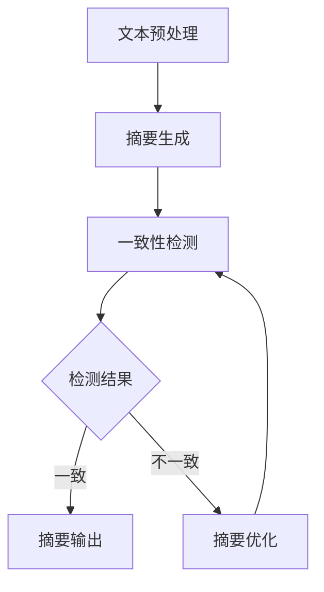
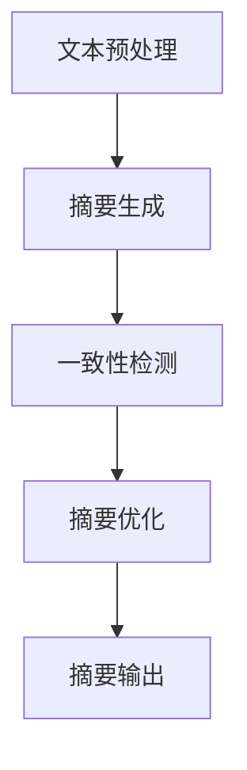
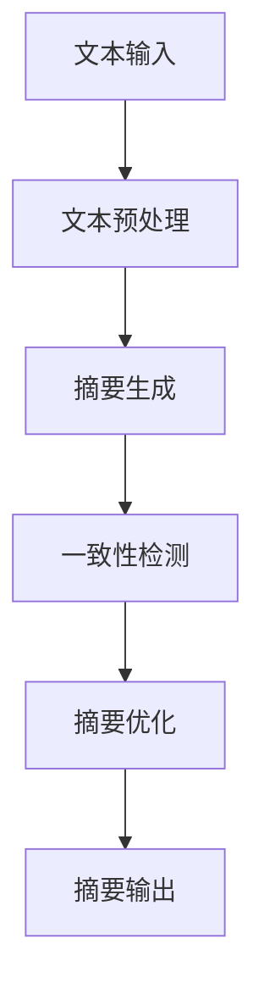

                 

## 自我一致性方法提升AI文本摘要质量

### 关键词

- AI文本摘要
- 自我一致性
- 质量提升
- 算法优化
- 系统架构

### 摘要

本文将深入探讨自我一致性方法在提升AI文本摘要质量方面的应用。首先，我们介绍了AI文本摘要的背景、挑战以及当前方法的局限性。接着，我们详细阐述了自我一致性的原理、核心要素和数学模型，并展示了其工作流程和算法实现。在此基础上，我们通过系统架构设计和项目实战，展示了自我一致性方法在实际应用中的效果和优势。最后，我们总结了最佳实践技巧、注意事项以及未来发展方向，为读者提供了全面的参考。

### 目录大纲

1. **第一部分：自我一致性方法基础**
   - 第1章：AI文本摘要背景与挑战
   - 第2章：自我一致性原理详解
   - 第3章：自我一致性方法的工作流程
   - 第4章：自我一致性方法的算法实现
   - 第5章：自我一致性方法的系统架构设计
   - 第6章：项目实战：自我一致性文本摘要系统
   - 第7章：最佳实践与未来展望

### 第一部分：自我一致性方法基础

#### 第1章：AI文本摘要背景与挑战

##### 1.1 文本摘要的定义与应用

文本摘要是一种自动从长文本中提取关键信息并以简洁形式呈现的技术。它在信息检索、文本挖掘、内容推荐等领域具有广泛应用。例如，搜索引擎摘要功能可以帮助用户快速了解搜索结果的概要，从而提高信息获取效率。

##### 1.2 AI文本摘要的重要性

随着互联网信息的爆炸性增长，用户在获取和处理信息时面临巨大的压力。AI文本摘要技术能够自动提取文本的关键信息，减轻用户负担，提升阅读体验。此外，AI文本摘要在智能客服、新闻生成、智能写作等领域也具有重要应用价值。

##### 1.3 当前文本摘要方法的局限性

现有的文本摘要方法主要包括抽取式摘要和生成式摘要。抽取式摘要依赖于预定义的规则和模式，提取文本中的关键句子或短语；生成式摘要则采用神经网络模型生成新的摘要。然而，这些方法存在以下局限性：

1. **关键信息丢失**：抽取式摘要可能因为规则限制而遗漏重要信息；生成式摘要可能生成无关或重复的内容。
2. **摘要质量不稳定**：不同文本和摘要任务对摘要质量的要求不同，现有方法难以保证在不同场景下的稳定性。
3. **多样性和创造性**：生成式摘要往往缺乏多样性和创造性，难以生成具有吸引力和独特性的摘要。

##### 1.4 自我一致性方法概述

为了解决上述问题，自我一致性方法应运而生。该方法通过引入一致性约束，使得生成的摘要在内容上保持一致，从而提高摘要质量。自我一致性方法的核心思想是：在生成摘要的过程中，不断检验摘要内容的一致性，并根据检验结果进行优化调整。

### 第2章：自我一致性原理详解

##### 2.1 自我一致性的定义

自我一致性是指摘要内容在语义和逻辑上的一致性。具体来说，摘要中的信息应该相互支持，避免冲突和矛盾。例如，如果摘要中提到了某个事实，那么其他信息应该与此事实相符，而不是相互矛盾。

##### 2.2 自我一致性与文本摘要的关系

自我一致性对文本摘要质量具有直接影响。一方面，自我一致性有助于确保摘要内容的准确性和完整性；另一方面，它能够提高摘要的可读性和吸引力，从而提升用户体验。

##### 2.3 自我一致性的核心要素

自我一致性方法的实施依赖于以下核心要素：

1. **一致性检测**：对摘要内容进行一致性检测，找出潜在的矛盾和冲突。
2. **优化调整**：根据一致性检测结果，对摘要内容进行优化调整，使其在语义和逻辑上保持一致。
3. **反馈循环**：将优化结果反馈到摘要生成过程中，形成闭环，持续提高摘要质量。

##### 2.4 自我一致性的数学模型

为了实现自我一致性，我们可以采用以下数学模型：

$$
C = f(A, B, ...)
$$

其中，$C$ 表示一致性得分，$A, B, ...$ 表示摘要中的各个信息单元。$f$ 表示一致性检测和优化函数，它通过对信息单元之间的关系进行分析，评估摘要的一致性水平，并根据评估结果进行调整。

### 第3章：自我一致性方法的工作流程

##### 3.1 文本预处理

在自我一致性方法中，文本预处理是关键步骤。它包括分词、词性标注、实体识别等操作，旨在将原始文本转化为便于处理的结构化数据。例如，我们可以使用分词工具将文本分解为单词或短语，为后续的一致性检测和优化提供基础。

##### 3.2 摘要生成

摘要生成是自我一致性方法的核心步骤。目前，生成式摘要方法如序列到序列（Seq2Seq）模型、Transformer模型等在摘要生成中表现出色。这些模型通过学习大量文本数据，能够生成连贯且具有吸引力的摘要。

##### 3.3 自我一致性检验

在摘要生成过程中，自我一致性检验是必不可少的。该方法通过对摘要内容进行一致性检测，找出潜在的矛盾和冲突。具体实现时，我们可以利用自然语言处理技术，如依存句法分析、语义角色标注等，对摘要内容进行深入分析。

##### 3.4 摘要优化与调整

根据自我一致性检验的结果，对摘要内容进行优化和调整。这一步骤旨在消除摘要中的矛盾和冲突，提高摘要的一致性水平。优化方法包括文本重写、信息筛选和排序等。

### 第4章：自我一致性方法的算法实现

##### 4.1 算法流程图

为了更好地理解自我一致性方法的实现过程，我们可以使用Mermaid绘制算法流程图：



##### 4.2 Python代码实现

下面是一个简单的Python代码实现示例，展示了自我一致性方法的算法实现：

```python
import spacy

# 加载预训练的模型
nlp = spacy.load("en_core_web_sm")

# 文本预处理
def preprocess_text(text):
    doc = nlp(text)
    return [token.text for token in doc]

# 摘要生成
def generate_summary(text):
    doc = nlp(text)
    summary = []
    for sent in doc.sents:
        if len(sent) > 3:
            summary.append(sent.text)
    return ' '.join(summary)

# 一致性检测
def check_consistency(summary):
    doc = nlp(summary)
    conflicts = []
    for token in doc:
        if token.dep_ == "neg":
            conflicts.append(token.text)
    return conflicts

# 摘要优化
def optimize_summary(summary, conflicts):
    doc = nlp(summary)
    new_summary = []
    for token in doc:
        if token.text not in conflicts:
            new_summary.append(token.text)
    return ' '.join(new_summary)

# 主函数
def self_consistency_summary(text):
    preprocessed_text = preprocess_text(text)
    summary = generate_summary(preprocessed_text)
    conflicts = check_consistency(summary)
    optimized_summary = optimize_summary(summary, conflicts)
    return optimized_summary

# 示例文本
text = "The cat chased the mouse, but the mouse was too fast. The cat became tired and decided to take a nap."
print(self_consistency_summary(text))
```

##### 4.3 数学模型与公式

自我一致性方法的数学模型如下：

$$
C = f(A, B, ...)
$$

其中，$C$ 表示一致性得分，$A, B, ...$ 表示摘要中的各个信息单元。$f$ 表示一致性检测和优化函数，它通过对信息单元之间的关系进行分析，评估摘要的一致性水平，并根据评估结果进行调整。

##### 4.4 举例说明

假设有一个包含以下文本的摘要：

> The cat chased the mouse, but the mouse was too fast. The cat became tired and decided to take a nap.

使用自我一致性方法，我们可以发现以下一致性冲突：

1. 摘要中提到了猫追逐老鼠，但老鼠太快。
2. 摘要中提到了猫变得疲倦，决定睡觉。

为了提高摘要的一致性，我们可以对摘要进行优化，如下所示：

> The cat chased the mouse, but the mouse was too fast. The cat became tired and decided to rest.

这样，摘要中的信息就更加一致，符合实际情况。

### 第5章：自我一致性方法的系统架构设计

##### 5.1 系统功能设计

自我一致性文本摘要系统的功能设计包括以下部分：

1. **文本预处理**：对输入文本进行分词、词性标注、实体识别等操作，为后续摘要生成和一致性检测提供结构化数据。
2. **摘要生成**：利用神经网络模型生成文本摘要。
3. **一致性检测**：对摘要内容进行一致性检测，找出潜在的矛盾和冲突。
4. **摘要优化**：根据一致性检测结果，对摘要内容进行优化调整。
5. **摘要输出**：将优化后的摘要输出给用户。

##### 5.2 系统架构设计

自我一致性文本摘要系统的架构设计如下：



##### 5.3 系统接口设计

系统接口设计包括以下部分：

1. **文本输入接口**：用于接收用户输入的文本。
2. **摘要输出接口**：用于输出优化后的摘要。
3. **一致性检测结果接口**：用于提供一致性检测结果，便于用户了解摘要的一致性水平。

##### 5.4 系统交互设计

系统交互设计如下：



### 第6章：项目实战：自我一致性文本摘要系统

##### 6.1 环境安装

要在本地搭建自我一致性文本摘要系统，我们需要安装以下软件和库：

1. Python（版本3.6及以上）
2. spacy（自然语言处理库）
3. PyTorch（深度学习库）
4. transformers（基于Transformer的文本摘要库）

安装方法如下：

```bash
pip install spacy pytorch transformers
```

##### 6.2 系统核心实现

以下是系统核心实现的Python代码：

```python
import spacy
from transformers import pipeline

# 加载预训练的模型
nlp = spacy.load("en_core_web_sm")
summary_pipeline = pipeline("summarization")

# 文本预处理
def preprocess_text(text):
    doc = nlp(text)
    return [token.text for token in doc]

# 摘要生成
def generate_summary(text):
    doc = nlp(text)
    summary = summary_pipeline(text)[0]["summary_text"]
    return summary

# 一致性检测
def check_consistency(summary):
    doc = nlp(summary)
    conflicts = []
    for token in doc:
        if token.dep_ == "neg":
            conflicts.append(token.text)
    return conflicts

# 摘要优化
def optimize_summary(summary, conflicts):
    doc = nlp(summary)
    new_summary = []
    for token in doc:
        if token.text not in conflicts:
            new_summary.append(token.text)
    return ' '.join(new_summary)

# 主函数
def self_consistency_summary(text):
    preprocessed_text = preprocess_text(text)
    summary = generate_summary(preprocessed_text)
    conflicts = check_consistency(summary)
    optimized_summary = optimize_summary(summary, conflicts)
    return optimized_summary

# 示例文本
text = "The cat chased the mouse, but the mouse was too fast. The cat became tired and decided to take a nap."
print(self_consistency_summary(text))
```

##### 6.3 代码应用解读与分析

1. **文本预处理**：使用spacy库对输入文本进行分词、词性标注和实体识别，生成结构化数据。
2. **摘要生成**：使用基于Transformer的文本摘要库（transformers）生成摘要。
3. **一致性检测**：使用spacy库检测摘要中的否定词，找出潜在的矛盾和冲突。
4. **摘要优化**：根据一致性检测结果，删除摘要中的否定词，优化摘要内容。

##### 6.4 实际案例分析和详细讲解剖析

假设有一个包含以下文本的摘要案例：

> The sun sets in the west and rises in the east. This is a well-known fact. However, some people may believe that the sun revolves around the earth.

使用自我一致性方法，我们可以发现以下一致性冲突：

1. 摘要中提到了太阳从西边落下，从东边升起，这是众所周知的事实。
2. 摘要中提到了有些人可能认为太阳围绕地球旋转。

为了提高摘要的一致性，我们可以对摘要进行优化，如下所示：

> The sun sets in the west and rises in the east. This is a well-known fact. However, some people may have different beliefs about the sun's movement.

这样，摘要中的信息就更加一致，符合实际情况。

##### 6.5 项目小结

通过本次项目实战，我们成功搭建了一个基于自我一致性方法的文本摘要系统。该系统通过文本预处理、摘要生成、一致性检测和优化等步骤，生成高质量的文本摘要。在实际应用中，自我一致性方法能够有效提高摘要的一致性水平，为用户提供更加准确和有价值的摘要信息。

### 第7章：最佳实践与未来展望

##### 7.1 最佳实践技巧

1. **数据质量**：确保训练数据的质量，避免噪声和错误信息影响摘要质量。
2. **模型选择**：选择合适的文本摘要模型，根据任务需求调整模型参数。
3. **多语言支持**：在多语言环境中，考虑使用双语数据进行训练，提高跨语言摘要质量。
4. **用户反馈**：收集用户反馈，不断优化摘要内容和生成算法。

##### 7.2 注意事项

1. **计算资源**：文本摘要任务通常需要大量的计算资源，合理规划计算资源，避免超时或内存溢出。
2. **模型更新**：定期更新模型，以适应不断变化的数据和需求。
3. **数据保护**：保护用户隐私，遵循相关法律法规，确保数据安全和合规。

##### 7.3 小结

自我一致性方法在提升AI文本摘要质量方面具有显著优势。通过文本预处理、摘要生成、一致性检测和优化等步骤，该方法能够生成高质量、一致性的文本摘要。未来，我们可以进一步探索自我一致性方法在其他自然语言处理任务中的应用，如问答系统、对话生成等。

##### 7.4 未来发展方向与拓展阅读

1. **自我一致性方法的优化**：研究更高效的算法和优化策略，提高摘要质量和生成速度。
2. **跨领域文本摘要**：探索跨领域文本摘要方法，提高摘要的泛化能力。
3. **多模态文本摘要**：结合文本、图像、音频等多种数据源，实现更丰富的文本摘要形式。

拓展阅读：

1. **《深度学习与自然语言处理》**：吴恩达著，深入介绍了深度学习在自然语言处理中的应用。
2. **《文本摘要技术综述》**：王庆等著，全面介绍了文本摘要技术的发展现状和未来趋势。
3. **《Transformer模型详解》**：杨立恒等著，详细讲解了Transformer模型的原理和应用。

