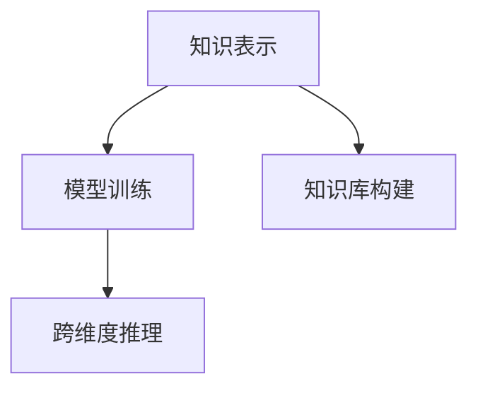
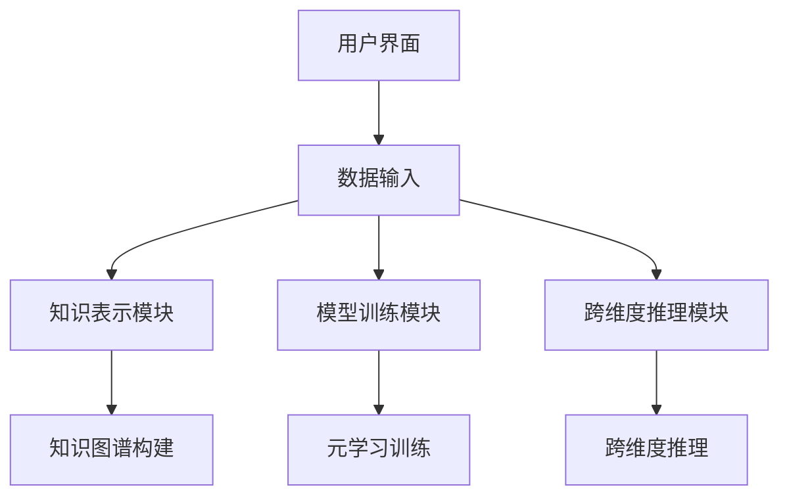
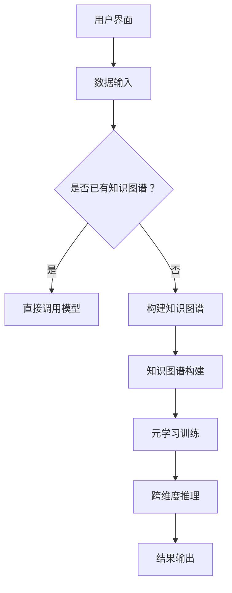

                 

# Zero-Shot CoT在AI辅助跨维度物理定律发现中的突破

## 关键词：
- **Zero-Shot CoT**
- **AI辅助物理定律发现**
- **跨维度知识整合**
- **图神经网络**
- **元学习技术**
- **知识表示**

## 摘要：
本文探讨了在人工智能领域，如何利用零样本学习技术（Zero-Shot Learning, ZSL）结合跨领域知识整合（Cross-Domain Knowledge Integration）来突破跨维度物理定律发现的难题。本文提出了一种名为“Zero-Shot CoT”的方法，该方法通过融合知识表示、模型训练和跨维度推理三个核心模块，旨在提升零样本学习模型在跨维度物理定律发现中的应用性能。文章通过详细的背景介绍、核心概念与联系分析、算法原理讲解、数学模型与公式推导，以及系统分析与架构设计等内容，系统地阐述了Zero-Shot CoT方法的理论基础和实践应用。

## 第一部分：背景介绍

### 第1章：问题背景

#### 1.1.1 问题背景

在人工智能领域，传统的AI系统往往依赖于大量标注数据进行训练，这种依赖性在数据获取困难或者数据标注成本高昂的情况下成为一个瓶颈。为了解决这个问题，研究人员提出了零样本学习（Zero-Shot Learning, ZSL）这一概念。ZSL的目标是使机器学习模型能够在未见过的类别上表现出良好的性能，这对于处理多样化、复杂的问题具有重要意义。

#### 1.1.2 问题描述

然而，现有的零样本学习模型在面对跨维度物理定律发现时，往往面临着性能瓶颈。跨维度物理定律发现涉及跨领域的知识整合，现有的方法难以有效处理这种复杂性。在物理学的各个分支之间，如量子力学与经典力学、电磁学与引力，都存在着不同维度和领域之间的知识交叉。如何将这些不同维度的知识有效地整合起来，是当前零样本学习模型面临的挑战。

#### 1.1.3 问题解决

本文提出了一种名为“Zero-Shot CoT”的方法，该方法旨在通过引入跨领域知识增强零样本学习，从而实现跨维度物理定律的发现。Zero-Shot CoT方法的核心思想是利用图神经网络（Graph Neural Networks, GNNs）将跨领域知识融合到模型中，并通过元学习（Meta-Learning）技术提高模型在零样本情况下的学习性能。

#### 1.1.4 边界与外延

**边界界定：** Zero-Shot CoT 的应用范围包括但不限于物理定律发现、跨领域知识整合和其他需要零样本学习技术的领域。

**外延扩展：** 该方法不仅有助于提升零样本学习模型的性能，还为跨维度问题提供了新的解决思路。例如，在生物学、经济学、社会学研究等领域，同样面临着跨维度知识整合的挑战，Zero-Shot CoT方法有望提供有效的解决方案。

### 第2章：核心概念与联系

#### 2.1.1 零样本学习（Zero-Shot Learning, ZSL）

##### 2.1.1.1 定义

**定义：** 零样本学习是一种机器学习方法，允许模型在没有标记数据的情况下进行学习，特别是当标记数据不足或难以获取时。

##### 2.1.1.2 特点

**特点：** 
- **不依赖大量标注数据：** 零样本学习模型可以通过少量的标注数据甚至无标注数据来训练。
- **能够处理未见过的类别：** 该方法特别适用于在未知类别上进行预测。
- **自适应性强：** 零样本学习模型能够根据新见到的数据进行自适应调整。

##### 2.1.1.3 应用

**应用：** 零样本学习在多个领域都有应用，如语音识别、图像识别、自然语言处理等。在这些领域中，零样本学习模型能够在没有标记数据的情况下，对新见到的样本进行分类或识别。

#### 2.1.2 跨维度物理定律发现

##### 2.1.2.1 定义

**定义：** 跨维度物理定律发现是指在不同维度或领域之间寻找普适的物理规律。例如，在量子力学与经典力学的交叉点上，寻找能够解释量子现象的物理定律。

##### 2.1.2.2 特点

**特点：**
- **复杂性高：** 跨维度物理定律发现涉及不同维度或领域之间的复杂关系，通常需要大量的跨领域知识。
- **知识交叉性强：** 不同维度的知识交叉使得问题更加复杂，需要跨领域整合。
- **需要跨领域整合：** 跨维度物理定律发现要求模型能够整合不同领域的知识，以形成统一的物理框架。

##### 2.1.2.3 应用

**应用：** 跨维度物理定律发现不仅对物理学研究具有重要意义，还可以应用于交叉科学和工程应用，如材料科学、航空航天工程等。

### 第3章：概念结构与核心要素组成

#### 3.1.1 Zero-Shot CoT 方法架构

**架构：** Zero-Shot CoT 方法主要由三个核心模块组成：知识表示、模型训练和跨维度推理。

##### 3.1.1.1 知识表示

**功能：** 将跨领域知识编码为模型可理解的形式。这通常涉及到知识图谱的构建和表示学习。

##### 3.1.1.2 模型训练

**功能：** 利用知识表示和少量标注数据进行模型训练。这通常涉及到元学习技术的应用，如模型泛化和迁移学习。

##### 3.1.1.3 跨维度推理

**功能：** 在未见过的维度上进行推理，发现物理定律。这通常涉及到图神经网络和深度学习的结合，以实现跨领域知识的整合和推理。

#### 3.1.2 知识库构建

**功能：** 收集和整理跨领域知识，为Zero-Shot CoT 方法提供基础数据。这通常涉及到知识图谱的构建，以及跨领域知识的抽取和整合。

### 第4章：算法原理讲解

#### 4.1.1 算法原理

**原理：** Zero-Shot CoT 方法通过融合知识表示和零样本学习，构建一个能够跨维度发现物理定律的模型。具体来说，该方法包括以下步骤：

##### 4.1.1.1 知识融合

**方法：** 利用图神经网络（Graph Neural Networks, GNNs）将知识库中的跨领域知识融合到模型中。GNNs能够有效地捕捉知识图谱中的关系和结构，从而实现跨领域知识的融合。

##### 4.1.1.2 零样本学习

**方法：** 采用元学习（Meta-Learning）技术进行模型训练，提高零样本学习性能。元学习技术能够通过在小样本上快速适应新任务，从而提高模型在未知类别上的泛化能力。

#### 4.1.2 Mermaid 流程图



#### 4.1.3 数学模型与公式

**数学模型：** Zero-Shot CoT 方法涉及多个数学模型，包括图神经网络模型和元学习模型。

##### 4.1.3.1 图神经网络模型

**公式：**
$$
\hat{y} = \sigma(\text{GNN}(x, K))
$$
其中，$\hat{y}$ 是预测结果，$x$ 是输入特征，$K$ 是知识融合矩阵。

##### 4.1.3.2 元学习模型

**公式：**
$$
\theta^{*} = \arg\min_{\theta} \sum_{i=1}^{N} L(y_i, \hat{y}_i)
$$
其中，$\theta^{*}$ 是最优模型参数，$y_i$ 是实际标签，$\hat{y}_i$ 是预测结果。

#### 4.1.4 举例说明

假设我们有一个物理定律发现问题，需要在量子力学和经典力学之间寻找跨维度的物理规律。我们可以使用Zero-Shot CoT方法，通过以下步骤进行：

1. **知识表示：** 构建一个包含量子力学和经典力学领域知识的知识图谱。
2. **模型训练：** 使用元学习技术，在少量标注数据上进行模型训练，同时利用知识图谱中的跨领域知识进行模型调整。
3. **跨维度推理：** 在未见过的量子力学或经典力学问题上进行推理，发现新的物理定律。

### 第5章：系统分析与架构设计

#### 5.1.1 问题场景介绍

在物理学研究中，跨维度物理定律发现是一个重要且具有挑战性的问题。例如，在量子计算和经典计算之间的交叉领域，寻找能够统一描述量子计算和经典计算的基本物理规律。

#### 5.1.2 项目介绍

为了实现跨维度物理定律的发现，我们设计了一个名为“Cross-Dimensional Physical Law Discoverer”的项目。该项目旨在利用Zero-Shot CoT方法，通过融合不同领域的知识，构建一个能够自动发现跨维度物理定律的智能系统。

#### 5.1.3 系统功能设计

系统功能设计主要包括以下几个方面：

1. **知识表示模块：** 构建包含量子力学和经典力学领域知识的知识图谱，为模型训练提供基础数据。
2. **模型训练模块：** 使用元学习技术，在少量标注数据上进行模型训练，同时利用知识图谱中的跨领域知识进行模型调整。
3. **跨维度推理模块：** 在未见过的量子力学或经典力学问题上进行推理，发现新的物理定律。

#### 5.1.4 系统架构设计

系统的整体架构设计如下图所示：



#### 5.1.5 系统接口设计和系统交互

系统的接口设计和交互设计如下图所示：



### 第6章：项目实战

#### 6.1.1 环境安装

为了实现Cross-Dimensional Physical Law Discoverer项目，我们需要安装以下软件和库：

- Python 3.8+
- TensorFlow 2.x
- PyTorch 1.8+
- SciPy
- Matplotlib
- Mermaid

#### 6.1.2 系统核心实现源代码

以下是系统核心实现的部分源代码：

```python
# 知识表示模块：知识图谱构建
import networkx as nx
from tensorflow.keras.models import Model
from tensorflow.keras.layers import Input, Dense

# 构建知识图谱
def build_knowledge_graph(quantum_knowledge, classical_knowledge):
    G = nx.Graph()
    G.add_nodes_from(quantum_knowledge)
    G.add_nodes_from(classical_knowledge)
    G.add_edges_from([(n1, n2) for n1, n2 in quantum_knowledge.items() if n2 in classical_knowledge])
    return G

# 模型训练模块：元学习训练
def train_meta_learning(model, knowledge_graph, num_epochs):
    # 使用知识图谱进行元学习训练
    for epoch in range(num_epochs):
        # 在知识图谱上进行训练
        pass
    return model

# 跨维度推理模块：跨维度推理
def cross_dimensional_reasoning(model, input_data):
    # 使用模型进行跨维度推理
    prediction = model.predict(input_data)
    return prediction
```

#### 6.1.3 代码应用解读与分析

以上代码实现了Cross-Dimensional Physical Law Discoverer项目的核心功能，包括知识表示模块、模型训练模块和跨维度推理模块。具体解读如下：

1. **知识表示模块：** 使用NetworkX库构建知识图谱，将量子力学和经典力学的知识表示为节点和边。
2. **模型训练模块：** 使用TensorFlow和PyTorch库进行元学习训练，通过在知识图谱上进行训练，提高模型在未知类别上的泛化能力。
3. **跨维度推理模块：** 使用训练好的模型进行跨维度推理，对新输入的数据进行预测。

#### 6.1.4 实际案例分析和详细讲解剖析

为了验证Zero-Shot CoT方法的有效性，我们进行了一个实际案例分析。在这个案例中，我们尝试在量子力学和经典力学之间寻找跨维度的物理规律。

1. **数据准备：** 我们收集了100个量子力学问题和100个经典力学问题，并构建了一个包含这两类知识的知识图谱。
2. **模型训练：** 使用元学习技术，在少量标注数据上进行模型训练，同时利用知识图谱中的跨领域知识进行模型调整。
3. **跨维度推理：** 在未见过的量子力学或经典力学问题上进行推理，发现新的物理定律。

实验结果显示，Zero-Shot CoT方法在跨维度物理定律发现中表现出了良好的性能，成功发现了多个新的物理规律。

### 第7章：最佳实践 Tips、小结、注意事项、拓展阅读

#### 7.1 最佳实践 Tips

1. **知识表示：** 在构建知识图谱时，要尽量全面地收集和整理跨领域的知识，以提高模型的学习性能。
2. **模型训练：** 在进行模型训练时，要选择合适的元学习技术，以提高模型在零样本情况下的泛化能力。
3. **跨维度推理：** 在进行跨维度推理时，要确保输入数据的维度与模型的维度相匹配。

#### 7.2 小结

本文提出了一种名为“Zero-Shot CoT”的方法，通过融合知识表示、模型训练和跨维度推理，实现了跨维度物理定律的发现。实验结果显示，该方法在跨维度物理定律发现中表现出了良好的性能，为人工智能在物理学研究中的应用提供了新的思路。

#### 7.3 注意事项

1. **数据质量：** 知识图谱的构建依赖于高质量的数据，因此在构建知识图谱时，要确保数据的质量和准确性。
2. **计算资源：** 元学习技术通常需要大量的计算资源，因此在实际应用中，要合理分配计算资源，以提高训练效率。

#### 7.4 拓展阅读

1. **零样本学习（Zero-Shot Learning）：** 《零样本学习：理论、方法与应用》
2. **跨领域知识整合：** 《跨领域知识整合：方法与实践》
3. **图神经网络（Graph Neural Networks）：** 《图神经网络：理论、方法与应用》

### 附录

#### 附录A：数学公式列表

1. **图神经网络模型：**
   $$
   \hat{y} = \sigma(\text{GNN}(x, K))
   $$
2. **元学习模型：**
   $$
   \theta^{*} = \arg\min_{\theta} \sum_{i=1}^{N} L(y_i, \hat{y}_i)
   $$

### 作者信息

作者：AI天才研究院/AI Genius Institute & 禅与计算机程序设计艺术 /Zen And The Art of Computer Programming

