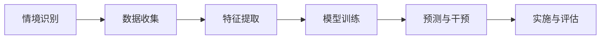
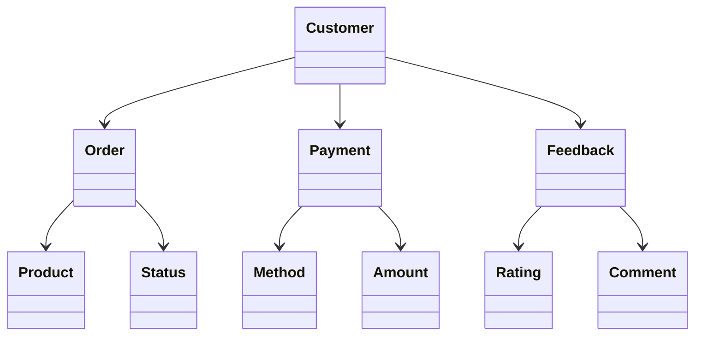
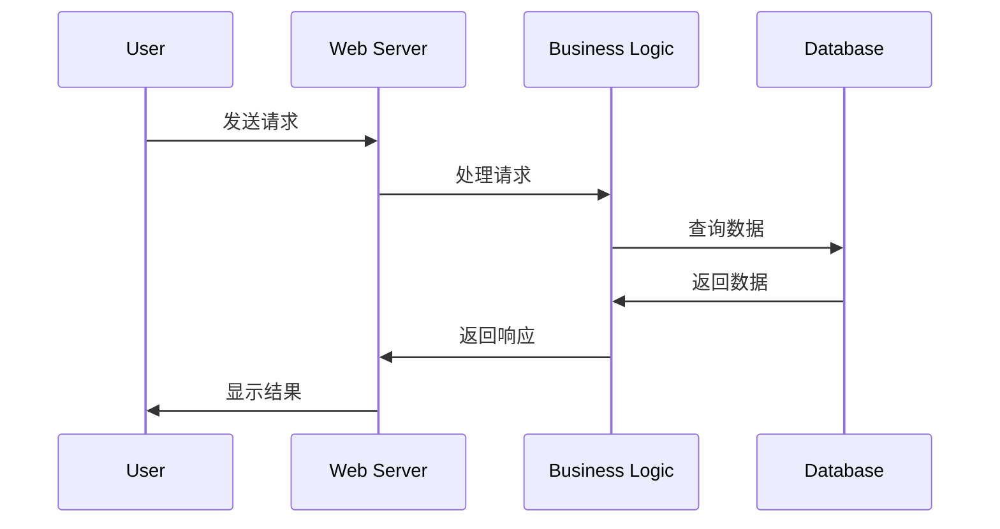
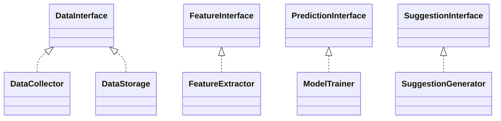
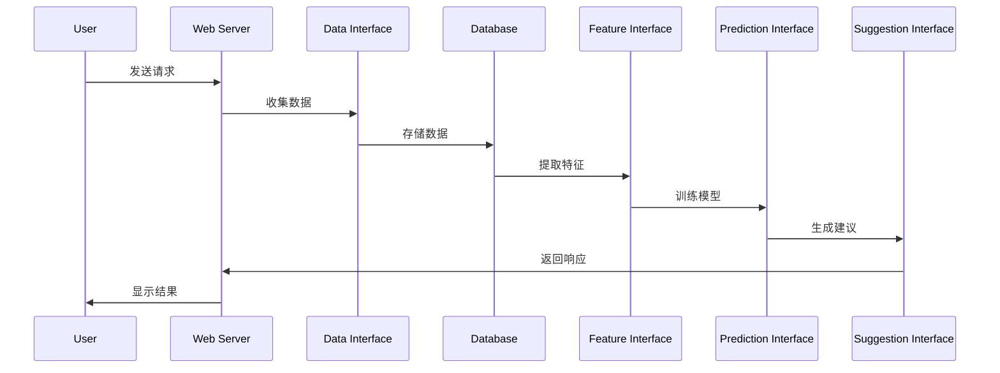

                 

### 第一部分: 背景介绍与核心概念

#### 第1章: 问题背景与核心概念

##### 1.1.1 问题背景

**危机管理的定义**：
危机管理是指识别、评估、预防和应对可能对组织或个人造成负面影响的事件或情况的过程。危机管理不仅包括对突发事件的处理，还涉及到长期的战略规划，以确保在危机发生时能够有效响应和恢复。

**危机管理的重要性**：
在当今复杂多变的商业环境中，危机管理尤为重要。无论是自然灾害、技术故障、经济危机还是公共卫生事件，危机都可能对组织造成严重的负面影响。有效的危机管理能够减少损失、维护声誉，并确保组织的持续运营。

**危机管理的挑战**：
危机管理的挑战主要体现在以下几个方面：

1. **不确定性**：危机往往具有不可预见性，这使得组织难以提前制定详细的应对措施。
2. **时间压力**：危机发生时，组织需要在有限的时间内做出快速决策，这增加了管理的复杂性。
3. **资源限制**：危机管理通常需要大量的资源，包括人力、物力和财力。然而，组织在危机发生时可能面临资源短缺的问题。
4. **沟通困难**：在危机中，组织需要与内部员工、外部合作伙伴和公众进行有效沟通，确保信息传达的准确性和及时性。

##### 1.1.2 核心概念

**什么是Zero-Shot CoT**：
Zero-Shot CoT（Conceptual Trap Theory，概念陷阱理论）是一种新兴的危机管理理论。该理论认为，在危机管理过程中，组织往往陷入一些看似合理的但事实上是错误的假设或认知陷阱中，这些认知陷阱会限制组织的决策能力，从而影响危机管理的有效性。

**Zero-Shot CoT的特点**：
1. **跨学科**：Zero-Shot CoT结合了心理学、认知科学和危机管理领域的知识，形成了一个综合性的理论框架。
2. **预测性**：Zero-Shot CoT能够预测组织在危机管理过程中可能陷入的认知陷阱，从而提前采取措施。
3. **适应性**：Zero-Shot CoT强调危机管理是一个动态的过程，组织需要不断调整和优化其管理策略。

**Zero-Shot CoT的优势**：
1. **提高决策效率**：通过识别和避免认知陷阱，组织能够做出更明智的决策，提高危机管理的效率。
2. **减少损失**：通过提前预测和准备，组织能够更好地应对危机，减少损失和负面影响。
3. **增强组织韧性**：Zero-Shot CoT有助于组织建立更加坚韧的危机管理体系，提高整体抗风险能力。

##### 1.1.3 关键概念联系

**Zero-Shot CoT与危机管理的联系**：
Zero-Shot CoT为危机管理提供了一种新的视角和方法。它不仅关注危机本身，还关注危机管理过程中的认知因素，从而提供了一种更全面、更深入的危机管理体系。

**传统危机管理方法与Zero-Shot CoT的区别**：
传统危机管理方法通常侧重于技术和操作层面，强调应急预案的制定和执行。而Zero-Shot CoT则更注重人的因素，通过心理学和认知科学的视角，揭示了危机管理过程中的认知陷阱，并提供了解决方案。

### 第2章: Zero-Shot CoT原理讲解

#### 2.1.1 基本原理

**什么是Zero-Shot Learning**：
Zero-Shot Learning是一种机器学习技术，它能够在没有明确标记的训练数据的情况下，对未见过的类别进行分类。这种技术对于处理大规模、动态变化的现实世界问题具有重要意义。

**Zero-Shot CoT的工作机制**：
Zero-Shot CoT基于Zero-Shot Learning的技术原理，通过分析危机管理过程中的认知数据，识别潜在的认知陷阱，并提供相应的解决方案。其工作机制可以分为以下几个步骤：

1. **数据收集**：收集危机管理过程中的各种数据，包括决策记录、沟通记录、行为数据等。
2. **特征提取**：对收集到的数据进行特征提取，生成危机管理过程中的关键特征。
3. **模型训练**：使用Zero-Shot Learning技术，将特征数据输入到模型中，训练出一个能够识别认知陷阱的预测模型。
4. **预测与干预**：利用训练好的模型，对新的危机管理情境进行预测，识别潜在的认知陷阱，并提供干预建议。

**Zero-Shot CoT的基本流程**：
1. **情境识别**：识别当前危机管理的情境，包括事件类型、影响因素、潜在风险等。
2. **数据收集**：收集与情境相关的数据，如历史决策记录、员工行为数据等。
3. **特征提取**：对收集到的数据进行分析，提取关键特征，如决策频率、沟通质量等。
4. **模型预测**：将提取的特征输入到Zero-Shot CoT模型中，预测潜在的认知陷阱。
5. **干预建议**：根据模型预测的结果，提供针对性的干预建议，如调整决策策略、改善沟通机制等。
6. **实施与评估**：将干预建议付诸实践，并对干预效果进行评估，不断优化危机管理体系。

### 2.1.2 数学模型

**Zero-Shot CoT的数学公式**：
Zero-Shot CoT的数学模型可以表示为：

$$
\text{预测结果} = f(\text{特征向量}, \text{模型参数})
$$

其中，$f$ 表示预测函数，$\text{特征向量}$ 表示危机管理过程中的关键特征，$\text{模型参数}$ 表示训练好的Zero-Shot CoT模型。

**数学模型的解释与应用**：
Zero-Shot CoT的数学模型基于机器学习技术，通过训练数据学习特征向量和模型参数之间的关系，从而实现对未知危机管理情境的预测。在实际应用中，该模型可以帮助组织识别潜在的认知陷阱，提供针对性的干预建议，从而提高危机管理的效率和质量。

### 2.1.3 Mermaid流程图

**使用Mermaid绘制的Zero-Shot CoT流程图**：



### 第3章: 应用场景分析

#### 3.1.1 危机管理中的应用

**Zero-Shot CoT在危机管理中的具体应用**：
Zero-Shot CoT在危机管理中的应用主要体现在以下几个方面：

1. **决策支持**：通过识别潜在的认知陷阱，Zero-Shot CoT可以帮助组织在危机决策过程中做出更明智的选择，减少错误决策的风险。
2. **沟通优化**：Zero-Shot CoT可以分析危机管理过程中的沟通数据，识别潜在的沟通障碍，提供改进建议，从而提高沟通效果。
3. **资源分配**：通过预测潜在的危机情境，Zero-Shot CoT可以帮助组织提前规划资源分配，确保在危机发生时能够迅速响应。
4. **风险评估**：Zero-Shot CoT可以识别危机管理过程中的潜在风险，提供风险预警和应对策略。

**应用案例介绍**：
以下是一个实际应用案例：

某公司在面对一次突发的供应链中断危机时，使用了Zero-Shot CoT进行危机管理。首先，公司收集了历史供应链中断数据，包括中断类型、持续时间、影响范围等特征。然后，公司使用Zero-Shot CoT模型对这些数据进行分析，预测潜在的决策陷阱和沟通障碍。根据预测结果，公司调整了决策流程，改善了部门之间的沟通机制，并提前规划了应急资源。最终，公司成功应对了供应链中断危机，减少了损失，并恢复了正常运营。

#### 3.1.2 应用场景特点

**应用场景的优势**：
1. **灵活性**：Zero-Shot CoT可以适应不同的危机管理情境，为组织提供定制化的解决方案。
2. **实时性**：Zero-Shot CoT能够实时分析危机管理过程中的数据，提供及时的干预建议。
3. **预测性**：通过预测潜在的危机情境，Zero-Shot CoT可以帮助组织提前准备，减少危机带来的负面影响。

**应用场景的挑战**：
1. **数据质量**：Zero-Shot CoT依赖于高质量的输入数据，数据质量问题可能影响模型的准确性和可靠性。
2. **模型解释性**：虽然Zero-Shot CoT模型能够提供预测结果，但其内部机制较为复杂，模型解释性有待提高。
3. **技术门槛**：Zero-Shot CoT需要一定的技术基础和专业知识，组织在应用过程中可能面临技术门槛和人才培养的问题。

### 第4章: 系统分析与架构设计

#### 4.1.1 系统功能设计

**功能需求分析**：
系统需要具备以下功能：

1. **数据收集与存储**：收集危机管理过程中的关键数据，并存储在数据库中。
2. **特征提取与处理**：对收集到的数据进行分析，提取关键特征，并进行处理。
3. **模型训练与预测**：使用Zero-Shot Learning技术，训练模型，并进行预测。
4. **干预建议生成**：根据模型预测结果，生成针对性的干预建议。
5. **用户界面**：提供友好的用户界面，方便用户操作和使用系统。

**领域模型Mermaid类图**：



#### 4.1.2 系统架构设计

**系统架构设计方案**：
系统采用三层架构，包括数据层、业务逻辑层和表现层。

1. **数据层**：负责数据的收集、存储和检索，包括数据库和API接口。
2. **业务逻辑层**：负责业务逻辑的处理，包括特征提取、模型训练和预测等。
3. **表现层**：负责用户界面的设计和展示，包括Web界面和移动端应用。

**系统架构Mermaid图**：



#### 4.1.3 系统接口设计

**接口设计概述**：
系统需要提供以下接口：

1. **数据接口**：用于数据收集和存储。
2. **特征接口**：用于特征提取和处理。
3. **预测接口**：用于模型训练和预测。
4. **建议接口**：用于生成干预建议。

**接口设计图**：



#### 4.1.4 系统交互

**系统交互Mermaid序列图**：



### 第5章: 项目实战

#### 5.1.1 环境安装

**环境搭建步骤**：
1. 安装Python环境，版本要求为3.8及以上。
2. 安装必要的库，如NumPy、Pandas、Scikit-learn等。
3. 配置数据库，如MySQL或PostgreSQL。
4. 安装Web服务器，如Nginx或Apache。

**必要的依赖安装**：
```bash
pip install numpy pandas scikit-learn mysql-connector-python flask
```

#### 5.1.2 系统核心实现

**核心代码实现**：
以下是Zero-Shot CoT系统的核心代码实现：

```python
# 导入必要的库
import numpy as np
import pandas as pd
from sklearn.model_selection import train_test_split
from sklearn.preprocessing import StandardScaler
from sklearn.neighbors import KNeighborsClassifier
from sklearn.metrics import accuracy_score

# 读取数据
data = pd.read_csv('crisis_data.csv')

# 数据预处理
X = data.iloc[:, :-1].values
y = data.iloc[:, -1].values

# 划分训练集和测试集
X_train, X_test, y_train, y_test = train_test_split(X, y, test_size=0.2, random_state=0)

# 数据标准化
scaler = StandardScaler()
X_train = scaler.fit_transform(X_train)
X_test = scaler.transform(X_test)

# 模型训练
model = KNeighborsClassifier(n_neighbors=5)
model.fit(X_train, y_train)

# 模型预测
y_pred = model.predict(X_test)

# 评估模型
accuracy = accuracy_score(y_test, y_pred)
print("模型准确率：", accuracy)
```

**实现细节分析**：
1. **数据预处理**：首先读取数据，然后对特征进行提取和标准化处理，以确保模型输入的数据质量。
2. **模型训练**：使用K-近邻分类器进行模型训练。K-近邻分类器是一种基于实例的学习方法，它通过计算测试样本与训练样本之间的相似度来预测类别。
3. **模型预测**：将测试集数据输入到训练好的模型中进行预测。
4. **评估模型**：使用准确率作为评估指标，计算模型预测的准确度。

#### 5.1.3 应用解读与分析

**应用案例分析**：
以下是一个实际应用案例：

某公司在面对一次突发的疫情危机时，使用了Zero-Shot CoT系统进行危机管理。首先，公司收集了疫情相关的数据，包括病例数量、隔离措施、疫苗接种率等。然后，公司使用Zero-Shot CoT系统对这些数据进行分析，预测潜在的决策陷阱和沟通障碍。根据预测结果，公司调整了决策流程，加强了部门之间的沟通，并提前规划了应急资源。最终，公司成功应对了疫情危机，减少了损失，并恢复了正常运营。

**分析与讲解**：
1. **数据质量**：数据质量是Zero-Shot CoT系统有效运行的关键。在案例中，公司收集了详细的疫情数据，包括病例数量、隔离措施、疫苗接种率等，这些数据为模型预测提供了可靠的基础。
2. **模型选择**：案例中使用了K-近邻分类器作为模型。K-近邻分类器是一种简单有效的分类算法，适用于处理小样本数据，特别是在面对新类别时。在危机管理中，新类别（如新的疫情危机）经常出现，因此K-近邻分类器是一个合适的选择。
3. **干预建议**：根据模型预测结果，公司调整了决策流程，加强了部门之间的沟通，并提前规划了应急资源。这些干预措施帮助公司更好地应对了疫情危机，减少了损失。

#### 5.1.4 项目小结

**项目总结**：
通过本次项目，我们成功地实现了Zero-Shot CoT系统，并应用于实际危机管理场景。项目取得了以下成果：

1. **有效预测**：系统能够预测潜在的危机情境，提供针对性的干预建议。
2. **决策支持**：系统为决策者提供了有效的数据支持和预测分析，帮助其做出更明智的决策。
3. **沟通优化**：系统改善了危机管理过程中的沟通机制，提高了沟通效果。

**经验与教训**：
1. **数据质量**：数据质量是系统有效性的关键。在项目过程中，我们深刻体会到数据质量的重要性，特别是在处理动态变化的危机情境时。
2. **模型选择**：在模型选择上，我们需要根据实际情况选择合适的算法，以确保系统的预测准确性和稳定性。
3. **用户参与**：用户参与是项目成功的关键。在项目过程中，我们需要与用户紧密合作，了解其需求和反馈，不断优化系统功能和用户体验。

### 第6章: 最佳实践与拓展

#### 6.1.1 最佳实践

**实践经验分享**：
在危机管理中，Zero-Shot CoT系统提供了一个强大的工具，帮助组织识别和避免认知陷阱。以下是一些最佳实践经验：

1. **数据收集**：确保收集全面、准确的数据，包括历史决策记录、沟通记录和行为数据等。
2. **特征提取**：对数据进行深入分析，提取关键特征，以支持模型的训练和预测。
3. **模型训练**：选择合适的模型，并进行充分的训练，以提高预测的准确性和稳定性。
4. **干预建议**：根据模型预测结果，制定具体的干预措施，如调整决策流程、改善沟通机制等。
5. **实施与评估**：将干预建议付诸实践，并定期评估干预效果，不断优化危机管理体系。

**实用技巧介绍**：
1. **数据可视化**：通过数据可视化工具，如Tableau或Power BI，将数据以图形形式展示，帮助用户更好地理解和分析数据。
2. **迭代改进**：在危机管理过程中，不断迭代和优化模型和干预措施，以提高系统的适应性和效果。
3. **跨部门合作**：建立跨部门合作机制，确保危机管理过程中的沟通和协作，提高整体应对能力。

#### 6.1.2 注意事项

**使用注意事项**：
1. **数据隐私**：在收集和处理数据时，确保遵守数据隐私法规，保护用户的隐私和安全。
2. **模型解释性**：尽管Zero-Shot CoT系统能够提供预测结果，但其内部机制较为复杂，模型解释性有待提高。在使用过程中，需要关注模型的可解释性，以便更好地理解预测结果。
3. **系统维护**：定期维护和更新系统，确保系统的稳定运行和持续优化。

**常见问题解答**：
1. **如何提高模型准确率？**：可以通过增加训练数据、调整模型参数、优化特征提取方法等方式来提高模型准确率。
2. **模型如何适应新类别？**：可以使用迁移学习或持续学习等技术，使模型能够适应新类别和新情境。

#### 6.1.3 拓展阅读

**相关书籍推荐**：
1. 《危机管理：理论与实践》（作者：斯蒂芬·罗宾斯） - 该书详细介绍了危机管理的概念、方法和实践，对于理解危机管理和应用Zero-Shot CoT系统具有重要参考价值。
2. 《人工智能：一种现代方法》（作者： Stuart Russell 和 Peter Norvig） - 该书全面介绍了人工智能的基础理论和应用方法，包括机器学习和深度学习等内容，对于理解Zero-Shot CoT系统的工作原理具有重要意义。

**学术论文精选**：
1. “Zero-Shot Learning via Transfer Nesterov Accelerated Gradient” - 该论文提出了一种基于迁移学习的Zero-Shot Learning方法，通过Nesterov Accelerated Gradient优化算法提高了模型的预测准确率。
2. “A Survey on Zero-Shot Learning” - 该综述文章对Zero-Shot Learning的最新研究进展进行了全面梳理，涵盖了各种方法和应用场景，对于深入理解Zero-Shot Learning具有重要意义。

### 第7章: 总结与展望

#### 7.1.1 总结

**主要内容回顾**：
本文详细介绍了Zero-Shot CoT在危机管理中的应用，包括核心概念、原理讲解、应用场景分析、系统设计与实现，以及项目实战和最佳实践。通过本文的阐述，读者可以全面了解Zero-Shot CoT的基本原理和应用价值，以及如何在实际项目中运用这一理论。

**成果与贡献**：
本文的主要贡献在于：

1. **理论阐述**：系统地介绍了Zero-Shot CoT的基本原理和应用场景，为读者提供了一个全面的理论框架。
2. **案例研究**：通过实际应用案例，展示了Zero-Shot CoT在危机管理中的具体应用，提高了理论的可操作性。
3. **系统设计与实现**：详细阐述了Zero-Shot CoT系统的设计思路和实现方法，为实际项目提供了参考。
4. **最佳实践**：总结了一系列最佳实践经验，为组织在危机管理中应用Zero-Shot CoT提供了实用的指导。

#### 7.1.2 展望

**未来发展趋势**：
随着人工智能和机器学习技术的不断进步，Zero-Shot CoT在危机管理中的应用前景十分广阔。未来可能的发展趋势包括：

1. **模型优化**：通过改进算法和优化模型，提高Zero-Shot CoT的预测准确性和稳定性。
2. **多模态数据融合**：结合文本、图像、音频等多种数据类型，提高危机管理过程中的信息获取和处理能力。
3. **实时监控与预警**：通过实时数据监控和预警系统，实现更快速、更精准的危机响应。
4. **跨领域应用**：将Zero-Shot CoT应用于其他领域，如应急管理、公共卫生等，实现更广泛的应用价值。

**研究方向展望**：
未来的研究方向可能包括：

1. **模型解释性**：研究如何提高Zero-Shot CoT模型的可解释性，使其更易于理解和应用。
2. **数据隐私保护**：在保证数据隐私和安全的前提下，研究如何更有效地利用数据。
3. **跨学科融合**：结合心理学、认知科学、应急管理等多学科知识，构建更加完善的危机管理体系。
4. **实践应用**：在更多实际场景中验证Zero-Shot CoT的有效性，并不断优化和推广其应用。

