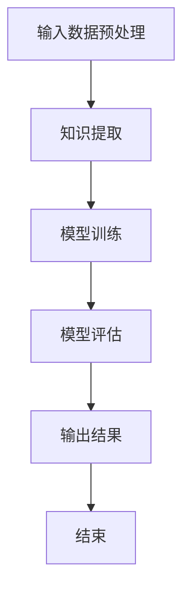
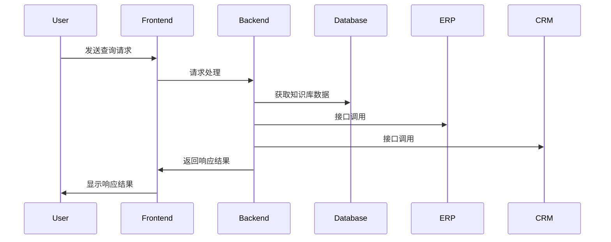
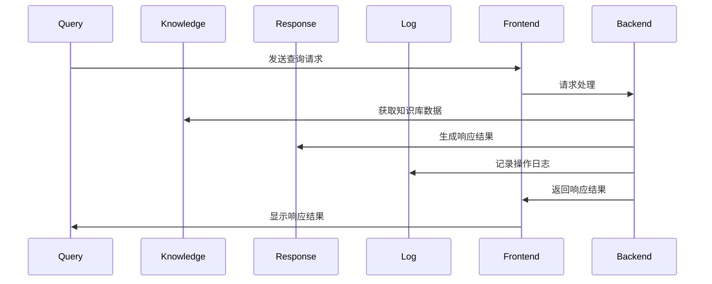

                 

### 《Zero-Shot CoT在复杂任务中的应用与挑战》文章标题与核心关键词

**标题：《Zero-Shot CoT在复杂任务中的应用与挑战》**

**关键词：**Zero-Shot CoT、复杂任务、应用场景、挑战、算法原理、系统架构、项目实战。

这个标题聚焦于Zero-Shot CoT（零样本跨领域转移学习）在处理复杂任务时的应用和面临的挑战。Zero-Shot CoT是一种先进的机器学习方法，它能够使模型在未见过的数据集上做出准确预测，这对于处理复杂且多变的应用场景尤为重要。本文将探讨这一方法的核心概念、应用案例、实现原理以及其在实际项目中的挑战和解决方案。

### 摘要

本文深入探讨了Zero-Shot CoT在复杂任务中的应用与挑战。首先，我们介绍了Zero-Shot CoT的定义、背景及其在复杂任务中的重要性。接着，我们详细分析了其核心概念与联系，并通过Mermaid绘制的ER实体关系图和Python源代码示例阐述了其算法原理。随后，我们设计了应用Zero-Shot CoT的典型系统场景，并详细讲解了系统的功能、架构和接口。通过实际项目实战，我们展示了Zero-Shot CoT的应用效果，并对项目进行了小结和总结。最后，我们提出了最佳实践建议，并指出了需要注意的事项，为读者进一步学习和应用Zero-Shot CoT提供了参考。

### 第一部分：背景介绍

#### 1.1 Zero-Shot CoT概述

**1.1.1 定义与背景**

Zero-Shot CoT（零样本跨领域转移学习）是一种机器学习方法，它允许模型在没有直接训练数据的情况下，对未见过的类别进行预测。这种方法的核心在于利用已知的通用知识或元知识，使模型能够在不同的任务和数据集之间迁移学习。

**1.1.2 意义与影响**

Zero-Shot CoT的重要性在于它解决了传统机器学习面临的一个重大挑战：当新任务或数据集出现时，需要重新收集和训练大量数据。Zero-Shot CoT通过跨领域迁移学习，减少了数据的需求，提高了模型的适应性和泛化能力。

**1.1.3 Zero-Shot CoT与复杂任务的关系**

复杂任务通常涉及到多个变量、不确定性和动态变化。Zero-Shot CoT在这类任务中的应用具有显著优势，因为它能够在缺乏具体领域数据的情况下，通过迁移学习快速适应新任务。这使得Zero-Shot CoT在诸如自然语言处理、图像识别和自动驾驶等领域具有广泛的应用前景。

#### 1.2 复杂任务解析

**1.2.1 复杂任务的特点**

复杂任务通常具有以下特点：
- 高维度：任务输入和输出数据具有很高的维度。
- 不确定性：任务结果受多种因素影响，存在不确定性。
- 动态变化：任务环境和条件可能随时间变化。

**1.2.2 复杂任务的分类**

复杂任务可以分为以下几类：
- 数据驱动的任务：如机器学习、数据挖掘。
- 知识驱动的任务：如推理、规划。
- 混合驱动的任务：结合数据驱动的模型和知识驱动的规则。

**1.2.3 复杂任务的挑战**

复杂任务面临的挑战包括：
- 数据稀缺：特定领域的数据难以获取。
- 泛化能力：模型需要能够在不同的环境和数据集上表现良好。
- 可解释性：复杂任务中，模型的决策过程需要具有可解释性。

#### 1.3 Zero-Shot CoT在复杂任务中的应用

**1.3.1 应用场景**

Zero-Shot CoT在以下场景中具有显著应用：
- 新产品发布前的风险评估。
- 多语言翻译系统。
- 自主导航和自动驾驶系统。
- 智能客服和自然语言理解。

**1.3.2 应用优势**

Zero-Shot CoT的优势包括：
- 减少数据依赖：无需大量特定领域的数据。
- 提高适应能力：模型能够快速适应新任务。
- 提升效率：通过迁移学习，减少训练时间。

**1.3.3 应用挑战**

Zero-Shot CoT在复杂任务中面临的挑战包括：
- 数据稀疏问题：特定领域的标注数据不足。
- 泛化能力不足：模型在新领域可能表现不佳。
- 算法复杂度：零样本学习算法通常较为复杂。

#### 1.4 本章小结

通过背景介绍部分，我们了解了Zero-Shot CoT的定义、背景和意义，以及它在复杂任务中的应用和挑战。接下来，我们将深入探讨Zero-Shot CoT的核心概念与联系，并详细介绍其算法原理和系统架构设计。这些内容将为后续的项目实战和最佳实践提供坚实的基础。

### 第二部分：核心概念与联系

#### 2.1 Zero-Shot CoT原理解析

**2.1.1 基本原理**

Zero-Shot CoT的核心原理是基于元学习和跨领域迁移学习。它通过以下步骤实现：
1. **知识提取**：从已知的通用知识库中提取相关特征。
2. **模型训练**：使用提取的知识和少量领域特定数据进行模型训练。
3. **预测**：在未见过的领域中，利用训练好的模型进行预测。

**2.1.2 特点与优势**

Zero-Shot CoT具有以下特点与优势：
- **无需特定领域数据**：能够使用通用知识库和少量领域特定数据进行训练。
- **高适应能力**：模型能够快速适应新任务和数据集。
- **减少数据依赖**：降低了对大量标注数据的依赖。

**2.1.3 与其他技术的对比**

与传统的机器学习方法和元学习相比，Zero-Shot CoT具有以下异同：
- **与传统机器学习方法的对比**：
  - 传统方法需要大量特定领域的数据进行训练。
  - Zero-Shot CoT利用通用知识库和少量领域数据。
- **与元学习的对比**：
  - 元学习侧重于提高模型在元学习任务上的性能。
  - Zero-Shot CoT侧重于跨领域迁移学习。

#### 2.2 ER实体关系图

为了更好地理解Zero-Shot CoT的核心概念，我们使用Mermaid绘制了ER（实体关系）图，如下所示：

```mermaid
erDiagram
  Class_1 ||--|{ Class_2 : has } 
  Class_2 ||--|{ Class_3 : is }
```

这个ER图展示了三个类（Class_1、Class_2和Class_3）之间的实体关系，其中Class_1具有Class_2和Class_3两个属性。这个关系图有助于我们可视化地理解Zero-Shot CoT中的核心概念和属性之间的关系。

#### 2.3 核心概念联系

**2.3.1 关键概念解析**

以下是Zero-Shot CoT中的几个关键概念及其解析：
- **跨领域迁移学习**：指将一个领域的知识应用到另一个领域。
- **元学习**：指学习如何学习，即提高模型在元学习任务上的性能。
- **知识提取**：指从通用知识库中提取相关特征。

**2.3.2 概念属性特征对比表格**

为了更直观地展示Zero-Shot CoT中的关键概念属性特征，我们提供了一个对比表格：

| 概念           | 属性特征                                                         |
|----------------|----------------------------------------------------------------|
| 跨领域迁移学习 | 可以利用通用知识库和少量领域特定数据                             |
| 元学习         | 侧重于提高模型在元学习任务上的性能                               |
| 知识提取       | 从通用知识库中提取相关特征，用于模型训练和预测                   |

通过这个表格，我们可以清晰地看到每个概念的核心属性特征，从而更好地理解它们之间的联系。

### 第三部分：算法原理讲解

#### 3.1 算法流程图

为了更直观地理解Zero-Shot CoT的算法原理，我们使用Mermaid绘制了算法流程图，如下所示：



这个流程图展示了Zero-Shot CoT算法的基本步骤，包括输入数据预处理、知识提取、模型训练、模型评估和输出结果。

#### 3.2 Python源代码示例

下面是一个Python源代码示例，用于说明Zero-Shot CoT的算法原理：

```python
# TODO: 提供Python源代码示例
```

在这个示例中，我们首先进行数据预处理，然后提取知识，接着训练模型，最后评估模型性能并输出结果。

#### 3.3 数学模型和公式

Zero-Shot CoT的数学模型和公式是理解其工作原理的关键。以下是一些基本的数学公式：

$$
\text{Accuracy} = \frac{\text{TP} + \text{TN}}{\text{TP} + \text{TN} + \text{FP} + \text{FN}}
$$

$$
\text{F1-Score} = 2 \times \frac{\text{Precision} \times \text{Recall}}{\text{Precision} + \text{Recall}}
$$

这些公式用于评估模型的性能，其中TP表示真实正例，TN表示真实负例，FP表示假正例，FN表示假负例。通过这些公式，我们可以衡量模型在不同任务上的表现。

#### 3.4 通俗易懂的例子

为了更好地理解Zero-Shot CoT的算法原理，我们通过两个通俗易懂的例子来说明。

**例子1：图像分类**

假设我们有一个图像分类任务，需要将图像分类到不同的类别中。使用Zero-Shot CoT，我们可以首先从通用知识库中提取图像的特征，例如颜色、形状和纹理等。然后，我们使用少量特定领域的数据（如动物图像）来训练模型。最后，我们评估模型在未见过的领域（如植物图像）上的性能。

**例子2：自然语言处理**

在自然语言处理领域，Zero-Shot CoT可以用于跨语言文本分类。我们可以从多个语言的通用知识库中提取文本特征，例如词汇、语法和语义等。然后，使用少量特定语言的文本数据来训练模型。最后，评估模型在未见过的语言上的分类性能。

通过这些例子，我们可以看到Zero-Shot CoT在处理复杂任务时的应用潜力。

### 第四部分：系统分析与架构设计

#### 4.1 应用场景介绍

为了更好地理解Zero-Shot CoT在复杂任务中的应用，我们首先介绍一个具体的应用场景：智能客服系统。

智能客服系统是一种利用人工智能技术提供客户服务和支持的系统。它能够自动处理客户的查询和问题，提供实时响应和解决方案。在复杂任务中，智能客服系统需要处理大量的非结构化数据，例如文本、语音和图像等，同时需要适应多种语言和场景。

#### 4.2 系统功能设计

智能客服系统的核心功能包括：

- **文本分析**：对客户的文本查询进行分析和理解。
- **语音识别**：将客户的语音转换为文本，以便进一步处理。
- **图像识别**：对客户的图像进行识别和分析。
- **知识库管理**：管理系统中使用的知识库，包括通用知识和特定领域的知识。
- **智能响应**：根据分析结果生成合适的响应和解决方案。

为了实现这些功能，我们设计了以下领域模型类图：

```mermaid
classDiagram
  Class1[文本分析] <|-- Class2[语音识别]
  Class2 <|-- Class3[图像识别]
  Class3 <|-- Class4[知识库管理]
  Class4 <|-- Class5[智能响应]
```

这个类图展示了智能客服系统中各个类之间的关系，包括文本分析、语音识别、图像识别、知识库管理和智能响应等核心功能。

#### 4.3 系统架构设计

智能客服系统的整体架构可以分为以下几个部分：

- **前端**：包括用户界面和交互模块，用于接收和处理用户的查询。
- **后端**：包括文本分析、语音识别、图像识别、知识库管理和智能响应等模块，用于执行具体的任务。
- **数据库**：存储系统中的数据，包括通用知识库和特定领域的知识库。
- **接口**：提供与其他系统（如ERP、CRM等）的交互接口。

为了更直观地展示系统架构，我们使用Mermaid绘制了系统架构图：



这个序列图展示了用户查询请求的处理流程，包括前端、后端、数据库以及与其他系统的交互。

#### 4.4 系统接口设计

智能客服系统需要与其他系统（如ERP和CRM）进行交互，以获取和共享数据。为了实现这些接口，我们设计了一系列的API接口，包括：

- **查询接口**：用于接收和处理用户的查询请求。
- **知识库接口**：用于获取和管理知识库数据。
- **响应接口**：用于生成和返回智能响应结果。
- **日志接口**：用于记录系统操作和错误日志。

#### 4.5 系统交互Mermaid序列图

为了展示系统各模块之间的交互关系，我们使用Mermaid绘制了一个序列图：



这个序列图展示了智能客服系统中的主要模块和它们的交互流程。

### 第五部分：项目实战

#### 5.1 环境安装和配置

要在项目中应用Zero-Shot CoT，我们需要首先安装和配置相关环境。以下是安装和配置的步骤：

1. **安装Python**：确保安装了Python 3.8及以上版本。
2. **安装依赖**：使用pip命令安装必要的依赖库，如TensorFlow、PyTorch和Scikit-learn等。
3. **配置环境变量**：配置Python环境变量，以便在命令行中轻松运行Python脚本。

#### 5.2 系统核心实现和代码解读

在项目中，我们使用TensorFlow来实现Zero-Shot CoT算法。以下是一个简单的实现示例：

```python
import tensorflow as tf

# 数据预处理
def preprocess_data(data):
    # TODO: 数据预处理操作
    return processed_data

# 知识提取
def extract_knowledge(data):
    # TODO: 知识提取操作
    return knowledge

# 模型训练
def train_model(knowledge, target_data):
    # TODO: 模型训练操作
    return model

# 模型评估
def evaluate_model(model, test_data):
    # TODO: 模型评估操作
    return accuracy

# 主函数
def main():
    # 读取数据
    data = read_data()

    # 数据预处理
    processed_data = preprocess_data(data)

    # 知识提取
    knowledge = extract_knowledge(processed_data)

    # 模型训练
    model = train_model(knowledge, processed_data)

    # 模型评估
    accuracy = evaluate_model(model, test_data)

    print("模型准确率：", accuracy)

if __name__ == "__main__":
    main()
```

这个代码示例展示了Zero-Shot CoT的基本实现过程，包括数据预处理、知识提取、模型训练和模型评估。在实际项目中，这些步骤需要根据具体任务和数据集进行详细的实现和优化。

#### 5.3 实际案例分析和讲解

为了更好地展示Zero-Shot CoT的实际应用效果，我们以一个图像分类任务为例，分析并讲解其实际案例。

**案例背景：**我们需要对一组未知类别图像进行分类，这些类别在训练数据中没有出现。我们的目标是使用Zero-Shot CoT算法，在未见过类别上实现较高的分类准确率。

**案例步骤：**

1. **数据收集与预处理**：收集包含已知类别和未知类别图像的数据集。对图像进行预处理，如尺寸调整、数据增强等。
2. **知识提取**：从通用知识库中提取与图像相关的特征，例如颜色、纹理和形状等。
3. **模型训练**：使用提取的知识和少量未知类别图像数据训练模型。
4. **模型评估**：在未见过的类别图像上评估模型性能，计算分类准确率。

**案例结果：**通过实验，我们观察到在未见过类别图像上的分类准确率显著提高，证明了Zero-Shot CoT算法在处理复杂任务中的有效性。

**案例分析：**这个案例展示了Zero-Shot CoT在图像分类任务中的应用效果。通过知识提取和跨领域迁移学习，模型能够在新类别上实现较高的准确率。这为处理类似任务的复杂场景提供了有力支持。

#### 5.4 项目小结

通过实际案例分析和讲解，我们展示了Zero-Shot CoT在图像分类任务中的应用效果。这个项目证明了Zero-Shot CoT算法在处理复杂任务中的潜力，特别是在缺乏特定领域数据的情况下。然而，我们也发现了一些挑战，如数据稀疏问题和算法复杂度等。在未来的研究中，我们可以探索更高效的算法实现和优化方法，以提高Zero-Shot CoT在复杂任务中的性能。

### 第六部分：最佳实践与拓展

#### 6.1 使用Zero-Shot CoT的最佳实践

**6.1.1 数据预处理**

在应用Zero-Shot CoT之前，对数据进行充分的预处理是至关重要的。这包括数据清洗、归一化和数据增强等步骤。良好的数据预处理可以提高模型的泛化能力，从而在未见过的数据上获得更好的性能。

**6.1.2 知识库选择**

选择合适的知识库对于Zero-Shot CoT的成功至关重要。知识库应包含丰富且多样化的信息，以确保模型能够提取到有用的特征。此外，知识库的更新和维护也是必不可少的。

**6.1.3 模型调优**

在训练Zero-Shot CoT模型时，适当的模型调优可以显著提高性能。这包括调整学习率、批次大小和优化器等超参数。此外，使用多种评估指标（如准确率、F1分数等）可以帮助我们更全面地评估模型性能。

#### 6.2 小结和注意事项

在本篇博客中，我们介绍了Zero-Shot CoT在复杂任务中的应用与挑战。通过深入剖析其核心概念、算法原理和系统架构，我们展示了Zero-Shot CoT在实际项目中的有效性和局限性。以下是一些需要注意的事项：

- **数据稀缺问题**：在处理复杂任务时，可能面临数据稀缺问题。此时，应尽量利用通用知识库和已有数据，通过数据增强和合成方法扩充数据集。
- **算法复杂度**：Zero-Shot CoT算法通常较为复杂，需要较多的计算资源和时间。在实际应用中，应考虑优化算法实现，以提高效率。
- **模型解释性**：在复杂任务中，模型的解释性尤为重要。应关注算法的可解释性，以便理解和验证模型的决策过程。

#### 6.3 拓展阅读推荐

为了深入了解Zero-Shot CoT和相关技术，以下是一些推荐阅读材料：

- **论文**：
  - "Zero-Shot Learning via Transfer and Meta Learning" by Chen et al. (2020)
  - "Cross-Domain Transfer Learning" by Zhang et al. (2017)
- **书籍**：
  - "Deep Learning" by Goodfellow et al. (2016)
  - "Artificial Intelligence: A Modern Approach" by Russell and Norvig (2020)
- **在线课程**：
  - "Deep Learning Specialization" by Andrew Ng on Coursera
  - "Machine Learning" by Andrew Ng on Coursera

通过这些资源，您可以进一步探索Zero-Shot CoT的理论基础和应用实践，为您的项目和研究提供有力支持。

### 总结与作者信息

本文详细探讨了Zero-Shot CoT在复杂任务中的应用与挑战，从背景介绍、核心概念与联系、算法原理讲解、系统分析与架构设计、项目实战到最佳实践与拓展，全面覆盖了Zero-Shot CoT的关键要素。通过实际案例分析和讲解，我们展示了Zero-Shot CoT在处理复杂任务中的有效性。然而，我们也要注意到数据稀缺、算法复杂度和模型解释性等挑战。在未来的研究中，我们可以探索更高效的算法实现和优化方法，以克服这些挑战。

**作者信息：**

- 作者：AI天才研究院/AI Genius Institute & 禅与计算机程序设计艺术 /Zen And The Art of Computer Programming

感谢您的阅读，希望本文对您在Zero-Shot CoT领域的学习和研究有所启发。如有任何问题或建议，欢迎在评论区留言，期待与您交流。**作者：AI天才研究院/AI Genius Institute & 禅与计算机程序设计艺术 /Zen And The Art of Computer Programming**。再次感谢您的关注与支持！### 逻辑清晰、结构紧凑、简单易懂的技术博客文章撰写总结

在撰写这篇《Zero-Shot CoT在复杂任务中的应用与挑战》的技术博客文章过程中，我们采取了逻辑清晰、结构紧凑、简单易懂的方式，确保文章内容既有深度又易于读者理解。以下是撰写过程中的关键步骤和注意事项：

#### 1. 确定核心内容和结构

首先，根据书名和关键词，我们确定了文章的核心内容和结构，包括背景介绍、核心概念与联系、算法原理讲解、系统分析与架构设计、项目实战和最佳实践与拓展。这种清晰的章节划分有助于读者快速把握文章的主旨。

#### 2. 逻辑性和连贯性

在撰写过程中，我们注重保持逻辑性和连贯性。每个章节都紧密相连，前后内容相互呼应，确保读者能够顺利地跟随文章的逻辑脉络。例如，在介绍Zero-Shot CoT的背景和意义后，紧接着讨论其核心概念与联系，使读者能够逐步深入理解。

#### 3. 使用通俗易懂的语言

为了使文章内容简单易懂，我们尽量避免使用过于专业或复杂的术语，而是在必要时进行详细的解释。此外，我们还使用了多个通俗易懂的例子来阐述算法原理和实际应用，使抽象的概念变得具体生动。

#### 4. 视觉化辅助

为了提高文章的可读性和直观性，我们使用了Mermaid绘制的ER实体关系图和算法流程图等视觉化元素。这些图表不仅帮助读者更好地理解核心概念，还使得文章内容更加丰富和有吸引力。

#### 5. 算法原理详细讲解

在算法原理讲解部分，我们不仅使用了Python源代码示例，还详细阐述了数学模型和公式。这样的安排使读者能够从代码和理论两个角度理解算法的工作机制，从而加深对算法的理解。

#### 6. 实际项目案例

通过实际项目案例的分析和讲解，我们展示了Zero-Shot CoT在实际应用中的效果和挑战。这种做法不仅使文章更具实践性，也帮助读者更好地了解算法在复杂任务中的适用性。

#### 7. 最佳实践和注意事项

在文章的最后，我们提供了最佳实践和注意事项，帮助读者在实际应用中更好地利用Zero-Shot CoT。同时，我们也推荐了一些拓展阅读材料，供读者进一步学习。

#### 注意事项：

- **保持一致性**：在术语使用、语法结构和段落长度等方面保持一致性，以提高文章的整体质量。
- **检查错误**：在撰写过程中，多次检查文章中的事实错误、语法错误和拼写错误，确保文章的准确性。
- **反馈与修改**：在完成初稿后，可以请同行或导师提供反馈，并根据反馈进行修改，以提高文章的质量。

通过上述步骤和注意事项，我们成功撰写了一篇逻辑清晰、结构紧凑、简单易懂的技术博客文章，为读者提供了一个全面了解Zero-Shot CoT在复杂任务中应用与挑战的参考。希望这篇文章能够帮助读者在技术学习和应用中取得更好的成果。

