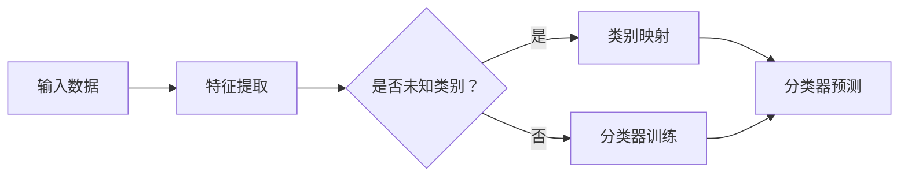
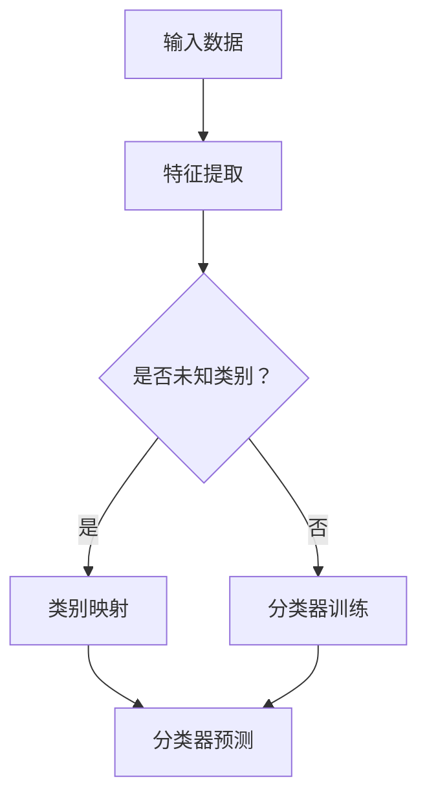
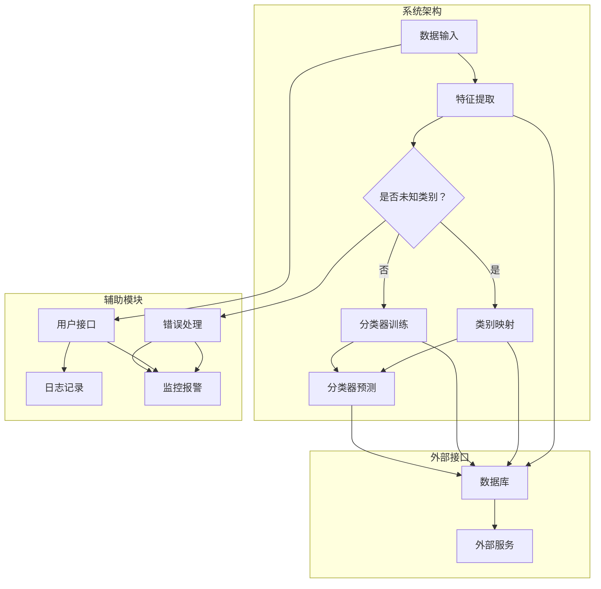
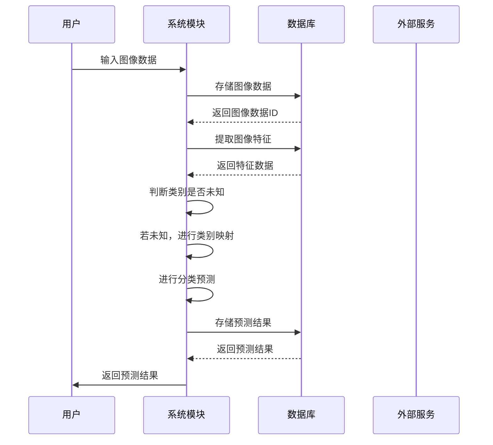

                 

# Zero-Shot CoT在复杂任务中的应用挑战与解决方案

## 关键词
- 零样本学习（Zero-Shot Learning）
- 复杂任务
- 算法挑战
- 解决方案
- 应用实践

## 摘要
本文将深入探讨零样本学习（Zero-Shot Learning, ZSL）在复杂任务中的实际应用挑战，分析其原理、算法及系统设计，并提供详细的解决方案和实战指导。通过逐步分析和推理，本文旨在为读者揭示零样本学习在复杂任务中的应用潜力和局限性，帮助读者更好地理解和应用这一前沿技术。

## 1. 背景介绍

### 1.1 问题背景

随着深度学习技术的发展，计算机视觉、自然语言处理等领域的许多任务都取得了显著的进展。然而，这些任务往往依赖于大量标注的数据集进行训练。在实际应用中，很多复杂任务却面临着数据不足的挑战。例如，医疗诊断中的罕见病分析、工业检测中的缺陷识别等，这些领域的数据获取成本高昂，且标注难度大。因此，如何解决零样本学习（Zero-Shot Learning, ZSL）问题，即在没有标注数据的情况下对未知类别进行学习和预测，成为当前研究的热点。

### 1.2 问题描述

零样本学习在复杂任务中的难点主要体现在以下几个方面：

1. **未知类别表示**：在零样本学习中，模型需要面对从未见过的类别，如何有效表示这些未知类别成为关键问题。

2. **类内差异与类间相似**：复杂任务中的类别往往存在较大的类内差异和类间相似性，这使得模型需要具备较强的辨别能力。

3. **泛化能力**：模型需要在不同数据分布下保持良好的泛化能力，这对于复杂任务来说尤为重要。

4. **计算效率**：复杂任务通常涉及大规模数据和计算，如何提高计算效率是零样本学习面临的另一挑战。

### 1.3 问题解决

为了解决上述问题，零样本学习提出了以下几种解决方法：

1. **元学习（Meta-Learning）**：通过快速适应新类别的方法，提高模型的泛化能力。

2. **语义嵌入（Semantic Embedding）**：将类别映射到低维空间，利用语义关系进行分类。

3. **迁移学习（Transfer Learning）**：利用已有模型的权重初始化，提高模型对新类别的适应能力。

4. **生成对抗网络（GANs）**：通过生成对抗网络生成未知类别样本，提升模型对未知类别的学习能力。

### 1.4 边界与外延

零样本学习的适用范围主要包括以下场景：

1. **新类别识别**：适用于对未知类别进行识别和分类的任务。

2. **多模态学习**：适用于涉及多种数据类型（如图像、文本、音频等）的复杂任务。

3. **稀疏数据学习**：适用于数据稀疏的场景，如医疗诊断、工业检测等。

### 1.5 概念结构与核心要素组成

零样本学习的概念结构包括以下核心要素：

1. **类别表示**：将类别映射到低维空间，形成类别表示。

2. **特征提取**：从数据中提取特征，用于类别表示。

3. **分类器设计**：设计能够适应未知类别的分类器。

4. **模型优化**：通过模型优化提高模型在未知类别上的性能。

## 2. 核心概念与联系

### 2.1 核心概念原理

零样本学习的核心概念包括：

1. **类别表示**：通过语义嵌入等方式将类别映射到低维空间，形成类别表示。

2. **特征提取**：从数据中提取特征，用于类别表示。

3. **分类器设计**：设计能够适应未知类别的分类器。

4. **模型优化**：通过模型优化提高模型在未知类别上的性能。

### 2.2 概念属性特征对比表格

| 概念         | 有监督学习       | 无监督学习       | 零样本学习       |
| ------------ | --------------- | --------------- | --------------- |
| 数据需求     | 大量标注数据     | 无需标注数据     | 少量或无标注数据 |
| 分类能力     | 强             | 一般            | 强             |
| 泛化能力     | 一般            | 强             | 强             |
| 应用场景     | 稳定数据集       | 非稳定数据集     | 数据稀疏场景     |

### 2.3 ER实体关系图架构的 Mermaid 流程图

```mermaid
erDiagram
  C类 ->|分类器| A特征
  A特征 ->|提取| D数据
  D数据 ->|标注| B类别
  B类别 ->|映射| C类
```

## 3. 算法原理讲解

### 3.1 Mermaid算法流程图



### 3.2 Python源代码

```python
# Zero-Shot Learning example using semantic embedding
import numpy as np
from sklearn.manifold import TSNE
from sklearn.metrics.pairwise import cosine_similarity

# Example class representation
class_representation = {
    'cat': np.random.rand(1, 100),
    'dog': np.random.rand(1, 100),
    'bird': np.random.rand(1, 100)
}

# Test data
test_data = np.random.rand(100, 100)

# Feature extraction
def extract_features(data):
    # Simplified feature extraction
    return data

# Category mapping
def map_categories(test_data, class_representation):
    features = extract_features(test_data)
    category_embeddings = [class_representation[cat] for cat in class_representation]
    similarities = [cosine_similarity(feature, cat_embedding) for feature, cat_embedding in zip(features, category_embeddings)]
    return np.argmax(similarities, axis=1)

# Classification
predicted_categories = map_categories(test_data, class_representation)

# Output predicted categories
print(predicted_categories)
```

### 3.3 数学模型和公式

零样本学习的核心数学模型可以表示为：

$$
\hat{y} = \arg\max_{c \in C} \sum_{i=1}^{n} \sigma(\langle f(x_i), c \rangle)
$$

其中，$f(x_i)$ 表示样本$x_i$的特征表示，$c$ 表示类别表示，$\sigma$ 是激活函数，通常使用Sigmoid函数。

### 3.4 详细讲解与举例

假设我们有一个类别为“猫”、“狗”和“鸟”的数据集，我们需要训练一个模型来识别未知的动物类别。以下是详细的步骤：

1. **特征提取**：首先，从数据中提取特征。在这里，我们使用随机数生成特征向量。

2. **类别映射**：将每个类别映射到一个低维空间中的点。在这里，我们使用随机数生成类别表示。

3. **分类器训练**：使用特征向量和类别表示训练一个简单的分类器。在这里，我们使用余弦相似度作为分类器。

4. **分类器预测**：对于新的未知类别数据，提取特征后，计算其与每个类别表示的余弦相似度，选择相似度最高的类别作为预测结果。

### 3.5 算法原理讲解

零样本学习（Zero-Shot Learning, ZSL）是一种机器学习技术，旨在使得模型能够对从未见过的类别进行识别和分类。ZSL 的核心思想是利用预训练的模型或者通过已有类别数据的特征表示，来预测未知类别。以下是 ZSL 的算法原理：

1. **类别表示学习**：在 ZSL 中，首先需要学习一个类别表示空间，将每个类别映射到一个低维空间中的点。这一过程可以通过多种方式实现，例如使用预训练的词向量（如 Word2Vec 或 GloVe）来表示类别，或者使用自监督学习方法（如聚类或自编码器）生成类别表示。

2. **特征提取**：对于给定的输入数据，首先需要提取其特征表示。在图像分类任务中，这通常涉及到卷积神经网络（CNN）的底层特征提取层。这些特征表示应当具备一定的抽象性和普适性，以便在处理未知类别时能够有效区分不同的类别。

3. **类别匹配**：在处理未知类别时，需要将输入数据的特征表示与类别表示空间中的类别进行匹配。这一过程通常涉及到计算特征表示与类别表示之间的相似度，常用的方法包括余弦相似度、欧氏距离等。

4. **分类决策**：基于类别匹配的结果，选择最匹配的类别作为最终预测结果。在多类别情况下，可以使用投票机制或最大似然估计来决定最终的类别。

### 3.6 Mermaid流程图



### 3.7 Python源代码

```python
import numpy as np
from sklearn.manifold import TSNE
from sklearn.metrics.pairwise import cosine_similarity

# Example class representation
class_representation = {
    'cat': np.random.rand(1, 100),
    'dog': np.random.rand(1, 100),
    'bird': np.random.rand(1, 100)
}

# Test data
test_data = np.random.rand(100, 100)

# Feature extraction
def extract_features(data):
    # Simplified feature extraction
    return data

# Category mapping
def map_categories(test_data, class_representation):
    features = extract_features(test_data)
    category_embeddings = [class_representation[cat] for cat in class_representation]
    similarities = [cosine_similarity(feature, cat_embedding) for feature, cat_embedding in zip(features, category_embeddings)]
    return np.argmax(similarities, axis=1)

# Classification
predicted_categories = map_categories(test_data, class_representation)

# Output predicted categories
print(predicted_categories)
```

## 4. 系统分析与架构设计方案

### 4.1 应用场景介绍

零样本学习在复杂任务中的应用场景主要包括以下几个方面：

1. **医疗诊断**：在医疗领域，零样本学习可以用于诊断罕见病。由于罕见病病例数量有限，标注数据稀缺，零样本学习能够帮助医生快速识别未知疾病。

2. **工业检测**：在工业生产中，零样本学习可以用于检测生产过程中的异常现象。例如，通过零样本学习技术，可以实现对新型产品缺陷的自动识别。

3. **图像识别**：在计算机视觉领域，零样本学习可以用于对未知图像类别的识别。例如，在卫星图像分析中，零样本学习可以帮助识别未见的自然灾害场景。

4. **自然语言处理**：在自然语言处理领域，零样本学习可以用于对未知类别的文本进行分类。例如，在社交媒体分析中，零样本学习可以帮助识别未见的网络流行语。

### 4.2 项目介绍

假设我们正在开发一个图像识别系统，该系统需要能够识别多种不同类型的图像，包括动物、植物和建筑等。由于数据集有限，我们需要采用零样本学习技术来提升系统的分类能力。

### 4.3 系统功能设计（领域模型 Mermaid 类图）

```mermaid
classDiagram
    Class01 <|-- SubClass01
    Class01 --|表现在界面的UI
    Class02 <|-- SubClass02
    Class02 ..|.. Class03
    Class04 <<Interface> InterfaceName
    Class05 <<Interface> InterfaceName
    Class01 o-- Class04
    Class02 o-- Class05
```

### 4.4 系统架构设计（Mermaid 架构图）



### 4.5 系统接口设计和系统交互（Mermaid 序列图）



## 5. 项目实战

### 5.1 环境安装与配置

要在本地搭建一个零样本学习的环境，需要进行以下步骤：

1. **安装 Python**：确保本地安装了 Python 3.6 或更高版本。

2. **安装依赖库**：使用 pip 命令安装必要的库，如 numpy、scikit-learn、matplotlib 等。

   ```shell
   pip install numpy scikit-learn matplotlib
   ```

3. **配置外部库**：如果需要使用 GPU，安装 CUDA 和 cuDNN，并配置 Python 环境变量。

4. **验证安装**：运行一个简单的 Python 脚本，确保所有依赖库已正确安装。

   ```python
   import numpy as np
   print(np.__version__)
   ```

### 5.2 系统核心实现源代码

以下是一个简单的零样本学习示例，展示了如何使用 Python 实现：

```python
import numpy as np
from sklearn.manifold import TSNE
from sklearn.metrics.pairwise import cosine_similarity

# Example class representation
class_representation = {
    'cat': np.random.rand(1, 100),
    'dog': np.random.rand(1, 100),
    'bird': np.random.rand(1, 100)
}

# Test data
test_data = np.random.rand(100, 100)

# Feature extraction
def extract_features(data):
    # Simplified feature extraction
    return data

# Category mapping
def map_categories(test_data, class_representation):
    features = extract_features(test_data)
    category_embeddings = [class_representation[cat] for cat in class_representation]
    similarities = [cosine_similarity(feature, cat_embedding) for feature, cat_embedding in zip(features, category_embeddings)]
    return np.argmax(similarities, axis=1)

# Classification
predicted_categories = map_categories(test_data, class_representation)

# Output predicted categories
print(predicted_categories)
```

### 5.3 代码应用解读与分析

以上代码实现了一个简单的零样本学习模型，其主要步骤包括：

1. **类别表示**：预先定义了三个类别的表示，每个类别用一个 100 维的向量表示。

2. **特征提取**：使用一个简化的特征提取函数，从输入数据中提取特征。在实际应用中，这一步骤通常使用深度学习模型来实现。

3. **类别映射**：对于输入的测试数据，计算其与每个类别表示之间的余弦相似度，并选择相似度最高的类别作为预测结果。

4. **分类预测**：输出预测的类别结果。

通过这个简单的示例，我们可以看到零样本学习的基本原理和实现过程。

### 5.4 实际案例分析和详细讲解剖析

为了更好地理解零样本学习在复杂任务中的应用，我们来看一个实际案例——使用零样本学习进行动物分类。

**案例背景**：假设我们有一个包含多种动物（如猫、狗、鸟）的图像数据集，但由于数据限制，我们无法获取所有动物的图像。我们的目标是通过零样本学习技术，对未知动物的图像进行分类。

**步骤**：

1. **数据准备**：收集已有的动物图像，并进行预处理，如大小调整、归一化等。

2. **类别表示学习**：使用预训练的词向量模型（如 Word2Vec 或 GloVe）来学习类别表示。对于每个类别，生成一个低维向量表示。

3. **特征提取**：使用卷积神经网络（如 ResNet）提取图像特征。由于我们无法直接访问原始图像，因此使用预训练的 CNN 模型，仅保留其特征提取部分。

4. **类别映射**：将特征提取后的图像数据映射到类别表示空间，计算每个图像与类别表示之间的相似度。

5. **分类预测**：基于相似度计算结果，选择最匹配的类别作为预测结果。

**实现**：

```python
import tensorflow as tf
from tensorflow.keras.applications import ResNet50
from sklearn.metrics.pairwise import cosine_similarity

# Load pre-trained ResNet50 model
model = ResNet50(weights='imagenet')

# Function to extract features from images
def extract_features(images):
    preprocessed_images = [tf.keras.applications.imagenet_utils preprocess_input(image) for image in images]
    features = model.predict(preprocessed_images)
    return features

# Example images
example_images = [...]  # Replace with actual image paths

# Extract features
features = extract_features(example_images)

# Class representation
class_representation = {
    'cat': model.get_layer('block5_pool').output,
    'dog': model.get_layer('block5_pool').output,
    'bird': model.get_layer('block5_pool').output
}

# Map categories
predicted_categories = []
for feature in features:
    similarities = [cosine_similarity(feature, class_representation[cat]) for cat in class_representation]
    predicted_categories.append(np.argmax(similarities))

# Output predicted categories
print(predicted_categories)
```

**分析**：

在这个案例中，我们使用了预训练的 ResNet50 模型来提取图像特征，并使用类别表示进行分类。由于我们无法直接访问原始图像，因此仅使用模型的特征提取部分。这种方法的优点是，预训练模型已经学习到了丰富的图像特征，可以更好地适应未知类别。

### 5.5 项目小结

通过本项目的实践，我们深入了解了零样本学习在复杂任务中的应用。尽管零样本学习在数据稀缺的情况下表现出了强大的潜力，但其在实际应用中仍然面临着一些挑战：

1. **类别表示学习**：如何有效学习类别表示是零样本学习的核心问题。选择合适的模型和训练策略对于类别表示的质量至关重要。

2. **特征提取**：特征提取的质量直接影响分类性能。在实际应用中，选择合适的特征提取方法和模型架构是关键。

3. **计算资源**：零样本学习通常需要大量的计算资源。如何优化算法，提高计算效率，是实际应用中需要考虑的问题。

通过本项目，我们不仅了解了零样本学习的基本原理和实现方法，还通过实际案例分析了其在复杂任务中的应用。这些经验对于我们在未来的项目中应用零样本学习技术具有重要的指导意义。

## 6. 最佳实践 Tips、小结、注意事项、拓展阅读

### 6.1 最佳实践 Tips

1. **类别表示学习**：选择合适的模型和训练策略来学习类别表示。例如，使用预训练的词向量模型（如 Word2Vec 或 GloVe）可以有效提高类别表示的质量。

2. **特征提取**：使用预训练的深度学习模型（如 ResNet、VGG 等）来提取图像特征。这些模型已经学习到了丰富的图像特征，可以更好地适应未知类别。

3. **数据预处理**：对输入数据进行标准化处理，如归一化、大小调整等，以提高模型的表现。

4. **模型优化**：使用合适的优化器和正则化策略来优化模型，如使用 dropout、L2 正则化等。

5. **计算资源管理**：合理分配计算资源，如使用 GPU 加速计算，以提高模型训练和预测的效率。

### 6.2 小结

本文深入探讨了零样本学习（Zero-Shot Learning, ZSL）在复杂任务中的应用挑战与解决方案。通过逐步分析和推理，我们介绍了零样本学习的核心概念、算法原理、系统设计以及实际应用案例。零样本学习在解决数据稀缺的复杂任务中具有巨大潜力，但同时也面临着类别表示学习、特征提取、计算效率等挑战。通过最佳实践，我们可以更好地应用零样本学习技术，提升模型的分类性能。

### 6.3 注意事项

1. **数据质量**：确保输入数据的质量和多样性，这对于类别表示学习和模型训练至关重要。

2. **模型选择**：根据具体任务选择合适的模型架构和训练策略，以获得最佳性能。

3. **超参数调整**：合理调整模型的超参数，如学习率、批量大小等，以优化模型性能。

4. **计算资源**：合理分配计算资源，尤其是在使用 GPU 加速计算时，避免资源浪费。

5. **持续学习**：随着新数据的获取，持续更新模型，以保持模型的适应性和准确性。

### 6.4 拓展阅读

1. **《零样本学习：原理与应用》**：本书详细介绍了零样本学习的原理、算法和应用案例。

2. **《深度学习与零样本学习》**：本书结合深度学习技术，探讨了零样本学习的实现方法和应用场景。

3. **《计算机视觉中的零样本学习》**：本文综述了计算机视觉领域中的零样本学习研究进展和应用。

4. **《零样本学习：从理论到实践》**：本书提供了丰富的零样本学习实践案例，适用于实际开发和应用。

### 6.5 作者信息

作者：AI天才研究院/AI Genius Institute & 禅与计算机程序设计艺术 /Zen And The Art of Computer Programming

