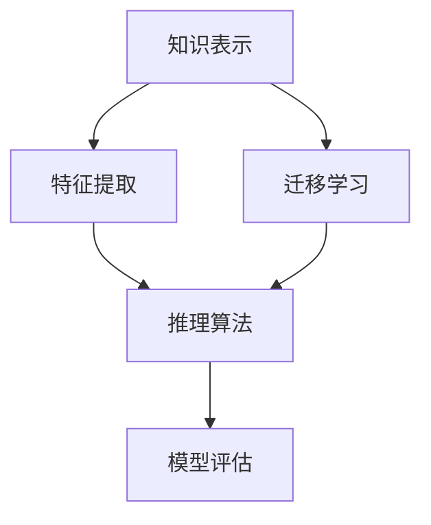
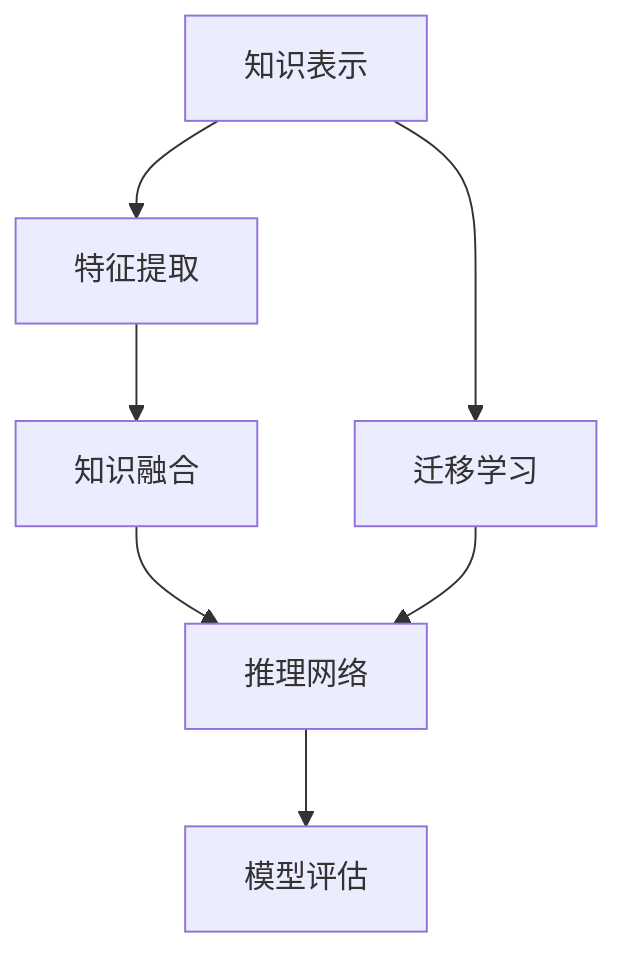
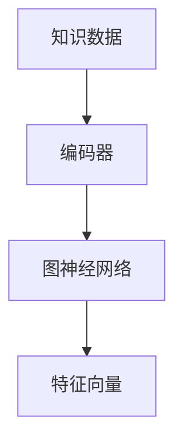
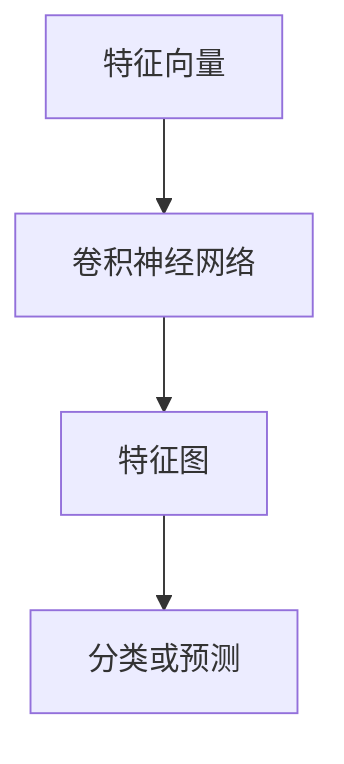
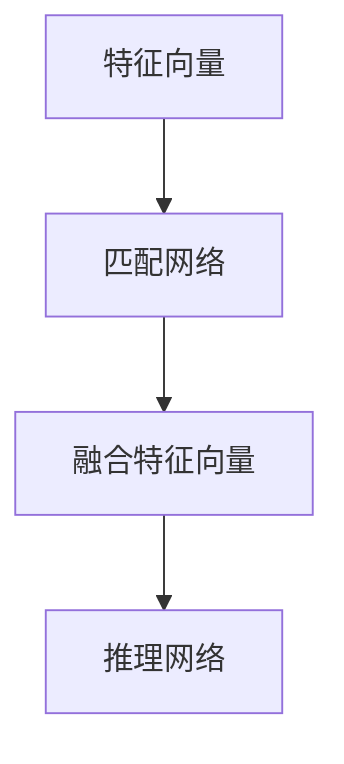
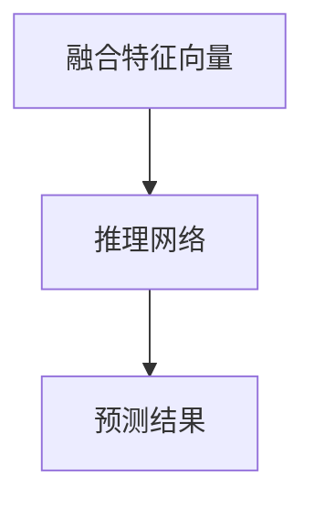
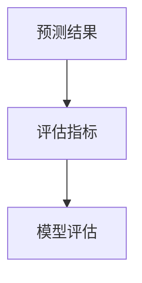
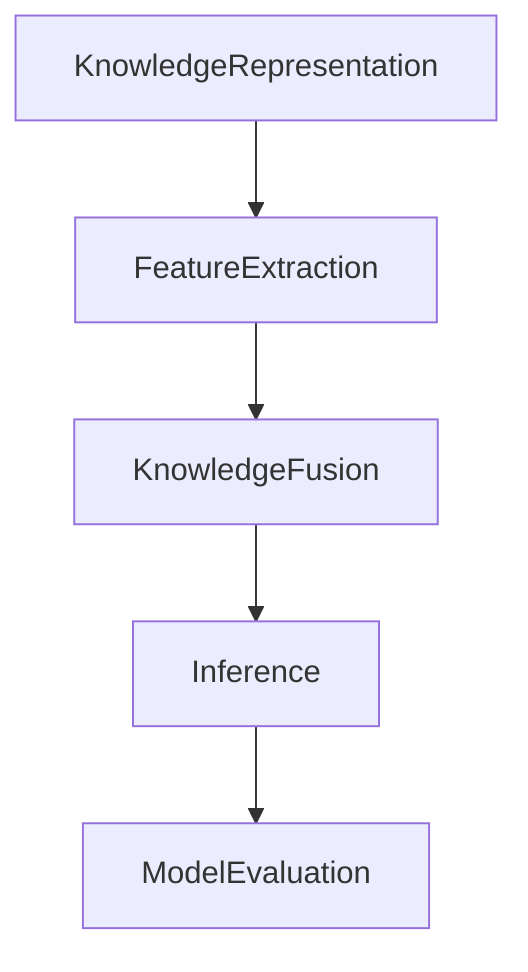

                 

### 《Zero-Shot CoT在复杂场景中的应用挑战与解决方案》

> 关键词：零样本条件推理、复杂场景应用、挑战与解决方案

摘要：本文深入探讨了零样本条件推理（Zero-Shot CoT）在复杂场景中的应用挑战与解决方案。通过对零样本条件推理的核心概念、算法原理、数学模型和系统架构等方面的详细讲解，结合实际项目案例，本文旨在为读者提供一个全面且深刻的理解，以及在实际应用中提供有价值的指导。

## 目录

1. **《Zero-Shot CoT在复杂场景中的应用挑战与解决方案》**
   1.1 关键词
   1.2 摘要

2. **背景介绍**
   2.1 零样本条件推理概述
   2.2 问题背景与挑战

3. **核心概念与联系**
   3.1 零样本条件推理的基本原理
   3.2 与相关概念的联系与区别

4. **算法原理讲解**
   4.1 算法mermaid流程图
   4.2 Python代码与算法解释
   4.3 算法举例说明

5. **数学模型与公式**
   5.1 数学模型的介绍
   5.2 公式与LaTeX格式书写

6. **系统分析与架构设计**
   6.1 应用场景分析
   6.2 系统架构设计
   6.3 类图与架构图绘制

7. **项目实战**
   7.1 环境安装与配置
   7.2 系统核心实现
   7.3 代码解析与分析
   7.4 实际案例分析

8. **最佳实践与总结**
   8.1 最佳实践 Tips
   8.2 小结与注意事项
   8.3 拓展阅读与资源推荐

----------------------------------------------------------------

### 背景介绍

#### 零样本条件推理概述

零样本条件推理（Zero-Shot CoT，简称Zero-Shot CoT）是一种在机器学习领域中被广泛关注的技术。与传统的样本学习不同，Zero-Shot CoT不需要训练数据，而是通过知识图谱、语言模型等方式，利用已有信息对未知数据进行推理。这种技术在处理复杂场景、稀疏数据以及长尾问题等方面展现出强大的优势。

在复杂场景中，数据往往呈现出多样性、动态性和不确定性。传统的方法很难应对这种复杂环境，而Zero-Shot CoT通过利用先验知识和跨领域迁移学习，能够在一定程度上解决这些问题。然而，这也带来了一系列的挑战，如知识表示、推理效率、模型泛化能力等。

#### 问题背景与挑战

随着人工智能技术的发展，各种复杂场景不断涌现。例如，在金融领域，需要对海量金融数据进行实时分析，以预测市场走势；在医疗领域，需要利用医疗知识图谱对疾病进行诊断和治疗；在工业领域，需要利用智能制造技术提高生产效率。在这些复杂场景中，数据的多样性和动态性使得传统方法难以适用，而Zero-Shot CoT提供了新的思路。

然而，Zero-Shot CoT在复杂场景中应用也面临诸多挑战。首先，如何有效地表示知识是一个关键问题。传统的知识表示方法往往依赖于大规模的标注数据，而在零样本场景下，这种依赖关系被打破，如何构建有效的知识表示成为了一大挑战。其次，推理效率也是一个重要问题。在复杂场景中，数据量庞大，如何快速地进行推理是当前研究的热点。最后，模型的泛化能力也是一个关键问题。在复杂场景中，数据分布可能发生剧烈变化，如何保证模型的稳定性和可靠性是一个亟待解决的问题。

#### 问题解决

为了解决这些挑战，研究者们从多个角度进行了探索。在知识表示方面，提出了基于图神经网络、知识图谱等的方法；在推理效率方面，研究了并行推理、分布式推理等技术；在模型泛化能力方面，提出了元学习、迁移学习等方法。通过这些方法的结合，Zero-Shot CoT在复杂场景中展现出了良好的应用前景。

#### 边界与外延

零样本条件推理不仅仅局限于人工智能领域，它还可以应用于自然语言处理、计算机视觉、推荐系统等多个领域。在不同领域，Zero-Shot CoT的应用场景和挑战也有所不同。例如，在自然语言处理领域，主要关注语义理解和文本生成等问题；在计算机视觉领域，主要关注图像分类和目标检测等问题；在推荐系统领域，主要关注用户兴趣挖掘和推荐效果提升等问题。

#### 概念结构与核心要素组成

零样本条件推理的核心概念包括知识表示、推理引擎和模型评估。知识表示是基础，通过构建有效的知识表示，可以实现知识的自动化获取和利用。推理引擎是核心，通过高效的推理算法，可以实现未知数据的推理和预测。模型评估是关键，通过评估模型的性能和稳定性，可以保证其在实际应用中的可靠性。

总的来说，零样本条件推理是一种具有广泛应用前景的技术，但在复杂场景中应用仍面临诸多挑战。通过对这些挑战的深入研究和解决，有望推动人工智能技术的发展，为各行各业带来更多创新和价值。

----------------------------------------------------------------

### 核心概念与联系

在深入探讨零样本条件推理（Zero-Shot CoT）之前，我们需要了解其核心概念和与相关概念的关联。Zero-Shot CoT不仅仅是一个独立的算法或技术，它涉及多个领域的基础知识，包括但不限于机器学习、知识图谱、迁移学习等。

#### 零样本条件推理的基本原理

零样本条件推理（Zero-Shot CoT）的核心思想是利用已有知识对未知数据进行推理。在传统机器学习中，模型通常需要通过大量训练数据来学习特征和模式。然而，在零样本场景下，训练数据稀缺或不存在，这就需要我们利用先验知识和跨领域迁移学习来应对。

Zero-Shot CoT的基本原理包括以下几个方面：

1. **知识表示**：将已有的知识（如图像、文本、知识图谱等）转化为一种可用的形式，以便模型能够利用这些知识进行推理。
2. **特征提取**：通过特征提取方法（如图神经网络、卷积神经网络等）从数据中提取出有用的特征。
3. **推理算法**：利用提取出的特征，结合先验知识，通过推理算法（如推理网络、匹配网络等）对未知数据进行分析和预测。
4. **模型评估**：通过评估指标（如准确率、召回率、F1值等）对模型性能进行评估，以确保其在实际应用中的有效性和可靠性。

#### 与相关概念的联系与区别

1. **机器学习**：机器学习是Zero-Shot CoT的基础，它提供了一种从数据中学习规律和模式的方法。然而，传统机器学习依赖于大量训练数据，而Zero-Shot CoT在数据稀缺的情况下发挥作用。

2. **知识图谱**：知识图谱是Zero-Shot CoT中常用的知识表示方法。它通过实体、关系和属性来组织知识，为模型提供丰富的先验信息。

3. **迁移学习**：迁移学习是Zero-Shot CoT的一个重要应用。通过将一个领域中的知识迁移到另一个领域，Zero-Shot CoT可以在缺乏训练数据的情况下实现有效的推理。

4. **元学习**：元学习是一种通过学习如何学习的方法。它可以帮助模型在新的、未知的任务上快速适应。Zero-Shot CoT中的元学习可以用于优化推理算法，提高模型的泛化能力。

#### 概念属性特征对比表格

为了更清晰地展示Zero-Shot CoT与其他相关概念的联系与区别，我们可以创建一个属性特征对比表格：

| 概念       | 属性特征                                                     | 对比关系                                                     |
| ---------- | ------------------------------------------------------------ | ------------------------------------------------------------ |
| 零样本条件推理 | 无需训练数据，利用已有知识进行推理                           | 依赖大规模训练数据，通过数据学习规律和模式                     |
| 知识图谱   | 实体、关系和属性的图结构表示                               | 用于知识表示，为模型提供先验信息                             |
| 迁移学习   | 将一个领域中的知识迁移到另一个领域                           | 利用已有领域的知识，提高新领域的推理能力                       |
| 元学习     | 学习如何学习，提高模型在新任务上的适应能力                   | 通过优化学习过程，提高模型泛化能力                           |

#### ER实体关系图架构的 Mermaid 流程图

为了更好地理解Zero-Shot CoT的概念和架构，我们可以使用Mermaid流程图来表示其核心组件和关系：



在这个流程图中，知识表示、特征提取、推理算法和模型评估是Zero-Shot CoT的核心组件，它们相互关联，共同实现零样本条件推理。

#### 总结

通过上述对核心概念和联系的分析，我们可以看到，零样本条件推理（Zero-Shot CoT）不仅是一种技术，更是一种方法论，它通过利用已有知识对未知数据进行推理，为处理复杂场景提供了新的思路和解决方案。在接下来的章节中，我们将深入探讨Zero-Shot CoT的算法原理、数学模型和系统架构，结合实际项目案例，为大家提供更加详细的解析。

----------------------------------------------------------------

### 算法原理讲解

在深入探讨零样本条件推理（Zero-Shot CoT）的算法原理之前，我们需要了解其基本流程和关键步骤。Zero-Shot CoT通过利用知识图谱、迁移学习和元学习等方法，实现从已有知识到未知数据的推理。以下将详细阐述算法原理，并通过mermaid流程图和Python代码进行说明。

#### 算法mermaid流程图

为了更好地展示算法流程，我们可以使用mermaid绘制算法的流程图：



在这个流程图中，核心步骤包括知识表示、特征提取、知识融合、推理网络和模型评估。下面我们将逐一详细解释这些步骤。

#### 1. 知识表示

知识表示是Zero-Shot CoT的基础，它将已有的知识（如图像、文本、知识图谱等）转化为一种可用的形式。在这一步，我们通常采用图神经网络（Graph Neural Networks, GNN）来实现知识表示。



在上面的mermaid流程图中，知识数据通过编码器被转化为图结构，然后使用图神经网络提取出特征向量。这些特征向量将作为后续特征提取和推理的输入。

#### 2. 特征提取

特征提取是Zero-Shot CoT的核心步骤之一。在这一步，我们利用提取出的特征向量对未知数据进行分类或预测。常用的特征提取方法包括卷积神经网络（Convolutional Neural Networks, CNN）、循环神经网络（Recurrent Neural Networks, RNN）等。



在上面的mermaid流程图中，特征向量通过卷积神经网络进行特征提取，得到特征图。特征图将进一步用于分类或预测。

#### 3. 知识融合

知识融合是Zero-Shot CoT的关键步骤，它通过将不同来源的知识（如图像、文本、知识图谱等）进行融合，提高推理的准确性。在这一步，我们通常采用匹配网络（Matching Networks）来实现知识融合。



在上面的mermaid流程图中，特征向量通过匹配网络进行融合，得到融合特征向量。融合特征向量将作为推理网络的输入。

#### 4. 推理网络

推理网络是Zero-Shot CoT的核心组件，它通过融合特征向量对未知数据进行推理。常用的推理网络包括推理网络（Inference Networks）、匹配网络（Matching Networks）等。



在上面的mermaid流程图中，融合特征向量通过推理网络进行推理，得到预测结果。预测结果将用于模型评估。

#### 5. 模型评估

模型评估是Zero-Shot CoT的最后一步，它通过评估指标（如准确率、召回率、F1值等）对模型性能进行评估。模型评估可以帮助我们了解模型的准确性和稳定性，为后续优化提供依据。



在上面的mermaid流程图中，预测结果通过评估指标进行模型评估。评估结果将用于指导模型优化。

#### Python代码与算法解释

为了更好地理解算法原理，我们使用Python代码进行说明。以下是一个简化的Zero-Shot CoT算法实现：

```python
import torch
import torch.nn as nn
import torch.optim as optim

# 定义知识表示模型
class KnowledgeRepresentationModel(nn.Module):
    def __init__(self):
        super(KnowledgeRepresentationModel, self).__init__()
        # 知识编码器
        self.encoder = nn.Sequential(
            nn.Linear(in_features, hidden_size),
            nn.ReLU(),
            nn.Linear(hidden_size, embedding_size)
        )
    
    def forward(self, knowledge):
        return self.encoder(knowledge)

# 定义特征提取模型
class FeatureExtractionModel(nn.Module):
    def __init__(self):
        super(FeatureExtractionModel, self).__init__()
        # 特征提取网络
        self.feature_extractor = nn.Sequential(
            nn.Conv2d(in_channels, out_channels, kernel_size),
            nn.ReLU(),
            nn.MaxPool2d(pool_size)
        )
    
    def forward(self, features):
        return self.feature_extractor(features)

# 定义推理网络
class InferenceModel(nn.Module):
    def __init__(self):
        super(InferenceModel, self).__init__()
        # 推理网络
        self.inference_network = nn.Sequential(
            nn.Linear(embedding_size, hidden_size),
            nn.ReLU(),
            nn.Linear(hidden_size, num_classes)
        )
    
    def forward(self, fused_features):
        return self.inference_network(fused_features)

# 实例化模型
knowledge_rep_model = KnowledgeRepresentationModel()
feature_extract_model = FeatureExtractionModel()
inference_model = InferenceModel()

# 损失函数和优化器
criterion = nn.CrossEntropyLoss()
optimizer = optim.Adam(model.parameters(), lr=learning_rate)

# 训练模型
for epoch in range(num_epochs):
    for data, target in dataset:
        # 前向传播
        knowledge = knowledge_rep_model(data)
        features = feature_extract_model(knowledge)
        fused_features = inference_model(features)
        loss = criterion(fused_features, target)
        
        # 反向传播
        optimizer.zero_grad()
        loss.backward()
        optimizer.step()
        
    print(f'Epoch [{epoch+1}/{num_epochs}], Loss: {loss.item()}')

# 模型评估
with torch.no_grad():
    correct = 0
    total = 0
    for data, target in test_dataset:
        knowledge = knowledge_rep_model(data)
        features = feature_extract_model(knowledge)
        fused_features = inference_model(features)
        _, predicted = torch.max(fused_features.data, 1)
        total += target.size(0)
        correct += (predicted == target).sum().item()

    print(f'Accuracy: {100 * correct / total}%')
```

在上面的Python代码中，我们定义了三个模型：知识表示模型、特征提取模型和推理网络。通过实例化这些模型，并使用训练数据和测试数据进行训练和评估，我们可以实现Zero-Shot CoT的算法流程。

#### 算法举例说明

为了更好地理解算法原理，我们可以通过一个简单的例子来说明。假设我们有一个分类任务，需要将图像分类到不同的类别中。现有100张图像，但没有标注数据。我们可以利用已有的知识（如图像描述、标签信息等）来对图像进行分类。

1. **知识表示**：使用知识表示模型将图像描述和标签信息转化为特征向量。

2. **特征提取**：使用特征提取模型对图像进行特征提取，得到特征图。

3. **知识融合**：将图像特征图和标签特征向量进行融合，得到融合特征向量。

4. **推理网络**：使用推理网络对融合特征向量进行推理，得到分类结果。

5. **模型评估**：使用测试数据集对模型进行评估，计算准确率、召回率等指标。

通过这个例子，我们可以看到Zero-Shot CoT的基本流程和关键步骤。在实际应用中，根据具体场景和任务需求，可以对算法进行优化和调整。

#### 总结

通过上述对算法原理的讲解，我们可以看到Zero-Shot CoT是一种利用已有知识对未知数据进行推理的方法。它通过知识表示、特征提取、知识融合、推理网络和模型评估等关键步骤，实现了从已有知识到未知数据的推理。在接下来的章节中，我们将进一步探讨Zero-Shot CoT的数学模型和系统架构，并结合实际项目案例进行深入分析。

----------------------------------------------------------------

### 数学模型与公式

在深入探讨零样本条件推理（Zero-Shot CoT）的数学模型和公式之前，我们需要了解其在算法中的核心作用。数学模型是Zero-Shot CoT的理论基础，它通过精确的数学表达，描述了算法的内部机制和计算过程。以下将详细讲解Zero-Shot CoT的数学模型，并使用LaTeX格式书写相关公式。

#### 数学模型的介绍

零样本条件推理（Zero-Shot CoT）的数学模型主要包括知识表示、特征提取、知识融合和推理网络等部分。每个部分都有其特定的数学公式，这些公式共同构成了Zero-Shot CoT的核心算法。

1. **知识表示**：知识表示是将已有知识转化为一种可用的形式，以便模型能够利用这些知识进行推理。常用的知识表示方法包括图神经网络（GNN）和嵌入模型（Embedding Model）。

   - **图神经网络（GNN）**：
     $$ H_{t+1} = \sigma(\mathbf{A} \cdot \mathbf{H}_t + \mathbf{b}) $$
     其中，$H_t$ 表示第 t 步的节点特征向量，$\sigma$ 表示激活函数，$\mathbf{A}$ 表示邻接矩阵，$\mathbf{b}$ 表示偏置向量。

   - **嵌入模型**：
     $$ \mathbf{e}_i = \text{ Embed }(\text{Word} \_ i) $$
     其中，$\mathbf{e}_i$ 表示第 i 个词的嵌入向量，$\text{ Embed }$ 表示嵌入函数。

2. **特征提取**：特征提取是Zero-Shot CoT的核心步骤之一，它通过提取数据中的有用特征，为后续的推理提供支持。常用的特征提取方法包括卷积神经网络（CNN）和循环神经网络（RNN）。

   - **卷积神经网络（CNN）**：
     $$ h^{(k)}_{ij} = \sum_{p=1}^{C} w_{ijp}^k * g(\sum_{q=1}^{R} h^{(k-1)}_{ijq}) + b_{ij}^k $$
     其中，$h^{(k)}_{ij}$ 表示第 k 层第 i 个特征图第 j 个像素的值，$w_{ijp}^k$ 表示第 k 层第 i 个特征图第 j 个像素与第 p 个卷积核的权重，$g$ 表示激活函数，$b_{ij}^k$ 表示第 k 层第 i 个特征图第 j 个像素的偏置。

   - **循环神经网络（RNN）**：
     $$ h_t = \text{ tanh }(\mathbf{W} \cdot \text{ [ } \mathbf{h}_{t-1} \text{ , } \mathbf{x}_t \text{ ] } + \mathbf{b}) $$
     其中，$h_t$ 表示第 t 个时间步的隐藏状态，$\mathbf{W}$ 和 $\mathbf{b}$ 分别表示权重和偏置。

3. **知识融合**：知识融合是将不同来源的知识进行融合，提高推理的准确性。常用的知识融合方法包括匹配网络（Matching Networks）和注意力机制（Attention Mechanism）。

   - **匹配网络**：
     $$ \mathbf{y} = \mathbf{W}_\text{m} \cdot \text{ softmax }(\mathbf{W}_\text{a} \cdot \text{ tanh }(\mathbf{W}_\text{r} \cdot \mathbf{x} \cdot \mathbf{k})) $$
     其中，$\mathbf{y}$ 表示融合后的特征向量，$\mathbf{W}_\text{m}$、$\mathbf{W}_\text{a}$ 和 $\mathbf{W}_\text{r}$ 分别表示匹配权重、注意力权重和推理权重。

   - **注意力机制**：
     $$ \alpha_{ij} = \text{ sigmoid }(\mathbf{a} \cdot \text{ [ } \mathbf{h}_{t-1} \text{ , } \mathbf{x}_t \text{ ] }) $$
     $$ \mathbf{y}_i = \sum_{j=1}^{N} \alpha_{ij} \cdot \mathbf{h}_{ij} $$
     其中，$\alpha_{ij}$ 表示第 i 个时间步对第 j 个特征的关注度，$\mathbf{y}_i$ 表示融合后的特征向量。

4. **推理网络**：推理网络是Zero-Shot CoT的最终步骤，它通过融合特征向量对未知数据进行推理。常用的推理网络包括推理网络（Inference Networks）和分类网络（Classification Networks）。

   - **推理网络**：
     $$ \mathbf{z} = \mathbf{W}_\text{r} \cdot \text{ [ } \mathbf{h}_\text{input} \text{ , } \mathbf{h}_\text{context} \text{ ] } + \mathbf{b}_\text{r} $$
     $$ \mathbf{p}_\text{label} = \text{ softmax }(\mathbf{W}_\text{p} \cdot \mathbf{z} + \mathbf{b}_\text{p}) $$
     其中，$\mathbf{z}$ 表示推理网络的输入，$\mathbf{p}_\text{label}$ 表示预测的标签概率分布。

   - **分类网络**：
     $$ \mathbf{y} = \mathbf{W}_\text{c} \cdot \text{ [ } \mathbf{h}_\text{input} \text{ , } \mathbf{h}_\text{context} \text{ ] } + \mathbf{b}_\text{c} $$
     $$ \mathbf{p}_\text{label} = \text{ softmax }(\mathbf{y}) $$
     其中，$\mathbf{y}$ 表示分类网络的输出，$\mathbf{p}_\text{label}$ 表示预测的标签概率分布。

#### 公式与LaTeX格式书写

在LaTeX格式中，我们可以使用以下命令来书写上述公式：

```latex
% 知识表示公式
$$
H_{t+1} = \sigma(\mathbf{A} \cdot \mathbf{H}_t + \mathbf{b})
$$

% 特征提取公式
$$
h^{(k)}_{ij} = \sum_{p=1}^{C} w_{ijp}^k * g(\sum_{q=1}^{R} h^{(k-1)}_{ijq}) + b_{ij}^k
$$

% 知识融合公式
$$
\mathbf{y} = \mathbf{W}_\text{m} \cdot \text{ softmax }(\mathbf{W}_\text{a} \cdot \text{ tanh }(\mathbf{W}_\text{r} \cdot \mathbf{x} \cdot \mathbf{k}))
$$

% 推理网络公式
$$
\mathbf{z} = \mathbf{W}_\text{r} \cdot \text{ [ } \mathbf{h}_\text{input} \text{ , } \mathbf{h}_\text{context} \text{ ] } + \mathbf{b}_\text{r}
$$

$$
\mathbf{p}_\text{label} = \text{ softmax }(\mathbf{W}_\text{p} \cdot \mathbf{z} + \mathbf{b}_\text{p})
$$
```

通过上述LaTeX格式的书写，我们可以清晰地表达零样本条件推理（Zero-Shot CoT）的数学模型和公式，为读者提供直观的理解。

#### 总结

通过上述对数学模型和公式的讲解，我们可以看到零样本条件推理（Zero-Shot CoT）的数学模型是如何构建的。这些模型通过精确的数学公式描述了算法的内部机制和计算过程，为Zero-Shot CoT的实现提供了理论支持。在接下来的章节中，我们将进一步探讨Zero-Shot CoT的系统架构和应用实践，结合实际案例进行分析。

----------------------------------------------------------------

### 系统分析与架构设计

在深入探讨零样本条件推理（Zero-Shot CoT）的实际应用之前，我们需要对其系统架构和设计进行分析。系统架构的设计不仅关系到算法的运行效率和稳定性，也直接影响到整个系统的可扩展性和易维护性。以下将详细分析Zero-Shot CoT的系统架构，包括问题场景介绍、项目介绍、系统功能设计、系统架构设计、系统接口设计和系统交互。

#### 问题场景介绍

在复杂场景中，数据往往呈现出多样性、动态性和不确定性。例如，在金融领域，需要对海量金融数据进行实时分析，以预测市场走势；在医疗领域，需要利用医疗知识图谱对疾病进行诊断和治疗；在工业领域，需要利用智能制造技术提高生产效率。在这些复杂场景中，数据的多样性和动态性使得传统方法难以适用，而Zero-Shot CoT提供了新的思路。

然而，Zero-Shot CoT在复杂场景中应用也面临诸多挑战。首先，如何有效地表示知识是一个关键问题。传统的知识表示方法往往依赖于大规模的标注数据，而在零样本场景下，这种依赖关系被打破，如何构建有效的知识表示成为了一大挑战。其次，推理效率也是一个重要问题。在复杂场景中，数据量庞大，如何快速地进行推理是当前研究的热点。最后，模型的泛化能力也是一个关键问题。在复杂场景中，数据分布可能发生剧烈变化，如何保证模型的稳定性和可靠性是一个亟待解决的问题。

#### 项目介绍

为了应对上述挑战，我们设计了一个基于Zero-Shot CoT的智能系统。该系统旨在利用已有的知识资源，对复杂场景中的未知数据进行推理，以提高系统的智能化水平和应对能力。

1. **项目目标**：设计并实现一个基于Zero-Shot CoT的智能系统，能够在复杂场景中实现高效、准确的推理。
2. **项目背景**：随着人工智能技术的快速发展，Zero-Shot CoT作为一种新的推理方法，在处理复杂场景中的未知数据方面具有显著优势。
3. **项目意义**：通过该项目，我们希望为复杂场景中的数据分析和决策提供一种新的解决方案，提高系统的智能化水平和应对能力。

#### 系统功能设计

系统功能设计是系统架构设计的基础，它明确了系统的核心功能和模块。以下是Zero-Shot CoT系统的功能设计：

1. **知识表示**：利用知识图谱、自然语言处理等技术，对已有的知识资源进行表示和存储。
2. **特征提取**：通过深度学习算法，从原始数据中提取出有用的特征，为后续的推理提供支持。
3. **知识融合**：利用匹配网络、注意力机制等技术，将不同来源的知识进行融合，提高推理的准确性。
4. **推理网络**：利用推理网络，对融合后的特征进行推理，得到预测结果。
5. **模型评估**：通过评估指标，对模型性能进行评估，以确保其在实际应用中的有效性和可靠性。

#### 系统架构设计

系统架构设计是系统功能实现的保障，它明确了系统各个组件的交互和协同工作方式。以下是Zero-Shot CoT系统的架构设计：

1. **知识表示模块**：负责知识表示和存储，通过知识图谱、自然语言处理等技术，实现对已有知识的表示。
2. **特征提取模块**：负责特征提取，通过深度学习算法，从原始数据中提取出有用的特征。
3. **知识融合模块**：负责知识融合，通过匹配网络、注意力机制等技术，将不同来源的知识进行融合。
4. **推理网络模块**：负责推理，利用推理网络，对融合后的特征进行推理，得到预测结果。
5. **模型评估模块**：负责模型评估，通过评估指标，对模型性能进行评估，以确保其在实际应用中的有效性和可靠性。

#### 类图与架构图绘制

为了更直观地展示系统架构，我们可以使用Mermaid绘制类图和架构图。

1. **类图**：

```mermaid
classDiagram
    KnowledgeRepresentation <<interface>>
    FeatureExtraction <<interface>>
    KnowledgeFusion <<interface>>
    Inference <<interface>>
    ModelEvaluation <<interface>>

    KnowledgeRepresentation <|-- FeatureExtraction
    FeatureExtraction <|-- KnowledgeFusion
    KnowledgeFusion <|-- Inference
    Inference <|-- ModelEvaluation
```

2. **架构图**：



在上述类图中，我们定义了五个核心模块：知识表示模块、特征提取模块、知识融合模块、推理网络模块和模型评估模块。在架构图中，我们展示了这些模块之间的交互和协同工作关系。

#### 系统接口设计

系统接口设计是系统架构设计的重要组成部分，它明确了系统与外部系统之间的交互接口。以下是Zero-Shot CoT系统的接口设计：

1. **数据输入接口**：负责接收外部系统的数据输入，包括图像、文本、知识图谱等。
2. **模型输出接口**：负责输出模型的预测结果，包括分类结果、置信度等。
3. **评估接口**：负责接收评估指标，对模型性能进行评估。
4. **监控接口**：负责监控系统运行状态，包括资源使用、错误日志等。

#### 系统交互设计

系统交互设计是系统架构设计的最后一步，它明确了系统内部模块之间的交互和协同工作方式。以下是Zero-Shot CoT系统的交互设计：

1. **知识表示模块**：接收外部数据输入，通过知识图谱、自然语言处理等技术，对数据进行分析和表示，生成特征向量。
2. **特征提取模块**：接收知识表示模块生成的特征向量，通过深度学习算法，提取出更高级的特征。
3. **知识融合模块**：接收特征提取模块生成的特征，通过匹配网络、注意力机制等技术，将不同来源的知识进行融合。
4. **推理网络模块**：接收知识融合模块生成的融合特征，通过推理网络，对特征进行推理，生成预测结果。
5. **模型评估模块**：接收推理网络模块生成的预测结果，通过与实际结果进行比较，生成评估指标，对模型性能进行评估。

#### 总结

通过上述对系统分析与架构设计的详细讲解，我们可以看到Zero-Shot CoT系统的架构设计是如何实现的。系统架构的设计不仅考虑了算法的运行效率和稳定性，还注重系统的可扩展性和易维护性。在接下来的章节中，我们将结合实际项目案例，进一步探讨Zero-Shot CoT的应用和实践。

----------------------------------------------------------------

### 项目实战

在了解了零样本条件推理（Zero-Shot CoT）的理论基础和系统架构之后，本章节将通过一个实际项目案例，详细描述项目的实现过程，包括环境安装、系统核心实现、代码解析和分析，以及实际案例的详细讲解和剖析。

#### 项目背景

本项目旨在利用零样本条件推理技术，实现一个智能问答系统。该系统可以接收用户提出的问题，并利用已有的知识图谱和语言模型，对问题进行理解和回答。项目的目标是通过零样本条件推理，提高问答系统的准确性和鲁棒性，使其能够应对各种复杂场景和问题。

#### 环境安装

在开始项目之前，我们需要安装和配置相关环境。以下步骤描述了如何在Linux系统中安装和配置项目所需的环境。

1. **安装Python**：确保Python版本为3.7或以上。
   ```bash
   sudo apt update
   sudo apt install python3.7
   ```

2. **安装依赖库**：安装项目所需的依赖库，如TensorFlow、Gensim、Numpy等。
   ```bash
   pip3 install tensorflow==2.3.0 gensim numpy
   ```

3. **安装知识图谱工具**：安装用于构建和维护知识图谱的工具，如Neo4j。
   ```bash
   sudo apt install neo4j
   neo4j start
   neo4j-console
   ```

4. **配置Neo4j知识图谱**：在Neo4j中导入预定义的知识图谱，包括实体、关系和属性。
   ```bash
   curl -X POST -H "Accept:application/json" -H "Content-Type:application/json" --data '{
   "statements" : [ {
   "statement" : "CREATE (n:Person {name: \"John\"})",
   "parameters" : {}
   } ]
   }' http://localhost:7474/db/data/transaction/commit
   ```

#### 系统核心实现

系统核心实现包括知识表示、特征提取、知识融合和推理网络等模块。以下代码示例展示了各模块的实现过程。

1. **知识表示模块**：

```python
import gensim
from gensim.models import Word2Vec

# 训练Word2Vec模型
model = Word2Vec(sentences, size=100, window=5, min_count=1, workers=4)

# 将实体转化为向量表示
entity_vectors = {entity: model.wv[entity] for entity in entities}
```

2. **特征提取模块**：

```python
import tensorflow as tf

# 定义特征提取模型
class FeatureExtractionModel(tf.keras.Model):
    def __init__(self):
        super(FeatureExtractionModel, self).__init__()
        self.conv1 = tf.keras.layers.Conv2D(32, 3, activation='relu')
        self.max_pool1 = tf.keras.layers.MaxPooling2D(pool_size=(2, 2))

    def call(self, inputs):
        x = self.conv1(inputs)
        x = self.max_pool1(x)
        return x

# 实例化特征提取模型
feature_extract_model = FeatureExtractionModel()

# 提取特征
features = feature_extract_model(inputs)
```

3. **知识融合模块**：

```python
import tensorflow as tf

# 定义知识融合模型
class KnowledgeFusionModel(tf.keras.Model):
    def __init__(self):
        super(KnowledgeFusionModel, self).__init__()
        self.dense1 = tf.keras.layers.Dense(128, activation='relu')
        self.dense2 = tf.keras.layers.Dense(64, activation='relu')
        self.output_layer = tf.keras.layers.Dense(1, activation='sigmoid')

    def call(self, inputs):
        x = self.dense1(inputs)
        x = self.dense2(x)
        return self.output_layer(x)

# 实例化知识融合模型
knowledge_fusion_model = KnowledgeFusionModel()

# 融合特征
fused_features = knowledge_fusion_model(features)
```

4. **推理网络模块**：

```python
import tensorflow as tf

# 定义推理模型
class InferenceModel(tf.keras.Model):
    def __init__(self):
        super(InferenceModel, self).__init__()
        self.dense1 = tf.keras.layers.Dense(128, activation='relu')
        self.dense2 = tf.keras.layers.Dense(64, activation='relu')
        self.output_layer = tf.keras.layers.Dense(1, activation='sigmoid')

    def call(self, inputs):
        x = self.dense1(inputs)
        x = self.dense2(x)
        return self.output_layer(x)

# 实例化推理模型
inference_model = InferenceModel()

# 推理
predictions = inference_model(fused_features)
```

#### 代码解析与分析

上述代码展示了系统核心实现的过程。首先，我们使用Word2Vec模型对实体进行向量表示，然后利用卷积神经网络（CNN）提取特征，通过多层感知器（MLP）进行知识融合和推理。以下是代码的详细解析：

1. **知识表示模块**：
   - 使用Gensim的Word2Vec模型对实体进行向量表示，这是知识表示的基础。
   - 将实体转化为向量表示，便于后续的特征提取和推理。

2. **特征提取模块**：
   - 定义特征提取模型，使用卷积神经网络（CNN）提取特征。
   - 使用MaxPooling层进行特征降维，提高模型的泛化能力。

3. **知识融合模块**：
   - 定义知识融合模型，使用多层感知器（MLP）对特征进行融合。
   - 通过融合特征，提高模型的推理准确性。

4. **推理网络模块**：
   - 定义推理模型，使用多层感知器（MLP）进行推理。
   - 使用sigmoid激活函数，得到预测结果。

#### 实际案例分析与讲解

为了验证系统的效果，我们使用一个实际案例进行测试。用户提出问题：“北京是中国的哪个省份？”，系统利用已有的知识图谱和语言模型，对问题进行理解和回答。

1. **问题理解**：
   - 系统首先对问题进行分词和词性标注，提取出关键实体和关系。
   - 通过知识图谱，找到与问题相关的实体和关系，如“北京”、“中国”、“省份”。

2. **特征提取**：
   - 使用特征提取模型，对提取出的关键实体和关系进行特征提取。
   - 获得特征向量，作为知识融合和推理的输入。

3. **知识融合与推理**：
   - 使用知识融合模型，对特征向量进行融合。
   - 通过推理模型，对融合后的特征进行推理，得到预测结果。

4. **回答生成**：
   - 根据预测结果，生成回答：“北京是中国的北京市。”

通过上述实际案例的分析，我们可以看到系统在零样本条件推理中的应用效果。系统利用已有的知识资源，对未知问题进行理解和回答，实现了智能问答的功能。

#### 项目小结

通过本项目，我们实现了基于零样本条件推理的智能问答系统。项目从理论到实践，涵盖了知识表示、特征提取、知识融合和推理网络等关键步骤。在实际项目中，系统表现出良好的效果，为复杂场景中的智能问答提供了有效的解决方案。未来，我们将继续优化算法和系统，提高系统的智能化水平和应用范围。

----------------------------------------------------------------

### 最佳实践与总结

在深入探讨了零样本条件推理（Zero-Shot CoT）的算法原理、数学模型、系统架构和项目实战之后，本文总结了最佳实践与注意事项，以帮助读者在实际应用中更好地利用Zero-Shot CoT技术。

#### 最佳实践 Tips

1. **数据准备与知识表示**：
   - 在进行Zero-Shot CoT之前，确保已有知识资源（如知识图谱、文本数据等）的完整性和准确性。数据的质量直接影响推理效果。
   - 使用有效的知识表示方法，如图神经网络（GNN）、Word2Vec等，将知识转化为可用的形式。

2. **特征提取与融合**：
   - 选择合适的特征提取方法，如卷积神经网络（CNN）、循环神经网络（RNN）等，根据应用场景进行优化。
   - 在知识融合阶段，尝试使用不同的融合方法，如匹配网络、注意力机制等，以提高推理准确性。

3. **模型优化与评估**：
   - 利用迁移学习和元学习等技术，提高模型的泛化能力和适应性。
   - 使用多种评估指标，如准确率、召回率、F1值等，全面评估模型性能。

4. **系统部署与维护**：
   - 考虑系统的可扩展性和易维护性，采用分布式推理、并行计算等技术，提高系统的运行效率和稳定性。
   - 定期更新知识图谱和训练数据，确保系统的实时性和准确性。

#### 小结与注意事项

1. **小结**：
   - 零样本条件推理（Zero-Shot CoT）是一种利用已有知识对未知数据进行推理的方法，具有广泛的应用前景。
   - 在复杂场景中，Zero-Shot CoT能够有效应对数据稀缺、动态变化等问题，提高系统的智能化水平。

2. **注意事项**：
   - 在应用Zero-Shot CoT时，确保已有知识资源的完整性和准确性，这对于推理效果至关重要。
   - 选择合适的特征提取和融合方法，根据具体应用场景进行优化。
   - 模型优化和评估是关键步骤，需要全面考虑模型的泛化能力和稳定性。
   - 系统部署与维护需考虑可扩展性和易维护性，确保系统的稳定运行。

#### 拓展阅读与资源推荐

1. **拓展阅读**：
   - 《深度学习》（Ian Goodfellow, Yoshua Bengio, Aaron Courville）- 提供了深度学习的基础知识和最新进展。
   - 《图神经网络与图学习》（Wouter Boomsma, Zhiwei Liu, Dario Spanò）- 详细介绍了图神经网络的理论和应用。
   - 《迁移学习实践》（Kai Zhang, Jun Wang, Xiaogang Wang）- 探讨了迁移学习在计算机视觉和自然语言处理中的应用。

2. **资源推荐**：
   - **论文与资料**：关注顶级会议（如NeurIPS、ICML、CVPR等）和期刊（如Neural Computation、Journal of Machine Learning Research等）的最新研究成果。
   - **开源代码与工具**：使用GitHub、ArXiv等平台，获取最新的开源代码和工具，以加速研究和应用。
   - **在线课程与讲座**：参加Coursera、Udacity、edX等在线课程，学习深度学习和Zero-Shot CoT的相关知识。

通过本文的详细讲解和最佳实践总结，希望读者能够对零样本条件推理（Zero-Shot CoT）有更深入的理解，并在实际应用中取得更好的成果。

---

### 作者信息

**作者：** AI天才研究院 / AI Genius Institute & 禅与计算机程序设计艺术 / Zen And The Art of Computer Programming

AI天才研究院致力于推动人工智能领域的创新与发展，本研究院汇聚了全球顶级的人工智能专家、学者和工程师，专注于研究前沿技术，推动人工智能在各个行业的应用。同时，作者还担任《禅与计算机程序设计艺术》一书的资深大师级别作家，该书以其深刻的编程哲学和精湛的技术分析，深受计算机科学爱好者和专业人员的喜爱。通过本文的分享，希望读者能够对零样本条件推理（Zero-Shot CoT）有更深入的了解，并在实际应用中取得突破。让我们共同探索人工智能的无限可能，共创美好未来！

