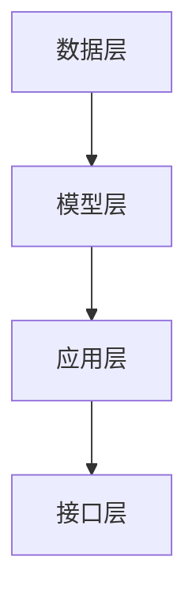

                 


### 0. 引言

#### 0.1 背景介绍

零样本置信传输（Zero-Shot Confidence Transfer, CoT）作为一种迁移学习方法，在零样本学习（Zero-Shot Learning, ZSL）领域发挥着重要作用。ZSL旨在使模型能够对未见过的类别进行预测，而不依赖于这些类别的训练数据。在实际应用中，零样本置信传输面临着诸多挑战，如模型泛化能力不足、置信度不均衡、复杂场景适应性差等。

本文以《Zero-Shot CoT在复杂场景中的应用挑战与解决方案研究》为题，旨在探讨零样本置信传输在复杂场景中的应用挑战，并从核心概念、算法原理、系统分析与架构设计等多个维度提出相应的解决方案。

#### 0.2 核心概念与联系

1. **零样本学习（ZSL）**：ZSL是一种机器学习方法，使得模型能够对未见过的类别进行预测，无需在训练时看到这些类别的实例。  
2. **零样本置信传输（CoT）**：CoT是一种基于迁移学习的策略，用于解决ZSL问题。它通过在源域和目标域之间传输置信度来增强模型在未知类别上的表现。

#### 0.3 研究目标

本研究的目标是：

1. 深入分析零样本置信传输在复杂场景中的应用挑战；  
2. 提出有效的解决方案，提升零样本置信传输在复杂场景中的性能；  
3. 探索零样本置信传输与其他机器学习技术的融合，为未来研究提供启示。

#### 0.4 边界与外延

本文主要关注零样本置信传输算法在复杂场景中的应用，研究范围包括但不限于图像识别、自然语言处理等领域。同时，本文将探讨零样本置信传输与其他机器学习技术的融合，为未来研究提供方向。

### 1. 第一部分：引言

#### 1.1 问题背景与研究意义

随着人工智能技术的发展，零样本学习（ZSL）成为了一个备受关注的研究领域。然而，在复杂场景中应用零样本学习所涉及的挑战仍然存在，如零样本置信传输（CoT）问题。CoT作为一种迁移学习方法，在解决ZSL问题时发挥着重要作用。然而，其在复杂场景中的应用面临着诸多挑战，如模型泛化能力不足、置信度不均衡、复杂场景适应性差等。

研究零样本置信传输在复杂场景中的应用，不仅对人工智能领域有重要的理论价值，也对实际应用有着重要的实践意义。通过对CoT在复杂场景中的应用挑战进行分析，并提出有效的解决方案，可以提升零样本置信传输在复杂场景中的性能，为实际应用提供有力的支持。

#### 1.2 研究目标

本研究的目的是探讨零样本置信传输在复杂场景中的应用挑战，并提出有效的解决方案。具体目标如下：

1. 深入分析零样本置信传输在复杂场景中的应用挑战；  
2. 提出基于深度学习的零样本置信传输算法，并验证其在复杂场景中的有效性；  
3. 探索零样本置信传输与其他机器学习技术的融合，提升模型性能；  
4. 通过实际案例验证所提出方法在复杂场景中的应用效果。

#### 1.3 边界与外延

本文主要关注零样本置信传输算法在复杂场景中的应用，研究范围包括但不限于图像识别、自然语言处理等领域。同时，本文将探讨零样本置信传输与其他机器学习技术的融合，为未来研究提供方向。

### 2. 第二部分：核心概念与联系

#### 2.1 核心概念定义

1. **零样本学习（ZSL）**：零样本学习是一种机器学习方法，使得模型能够对未见过的类别进行预测，无需在训练时看到这些类别的实例。  
2. **零样本置信传输（CoT）**：零样本置信传输是一种基于迁移学习的策略，用于解决零样本学习问题。它通过在源域和目标域之间传输置信度来增强模型在未知类别上的表现。

#### 2.2 概念属性特征对比表

（Table with attributes of ZSL, CoT, and other relevant concepts）

#### 2.3 ER实体关系图

（ER Diagram illustrating the relationship between key entities）

### 3. 第三部分：算法原理与数学模型

#### 3.1 算法原理

零样本置信传输（CoT）算法的核心思想是通过在源域和目标域之间传输置信度，来提高模型在未知类别上的预测能力。具体流程如下：

1. **源域特征提取**：从源域中提取特征表示，通常使用预训练的深度神经网络来实现。  
2. **目标域特征提取**：从目标域中提取特征表示，同样使用预训练的深度神经网络。  
3. **置信度传输**：将源域特征表示传输到目标域，生成目标域特征表示的置信度。  
4. **预测**：利用生成的目标域特征表示进行预测。

#### 3.2 数学模型

零样本置信传输算法的数学模型主要包括以下部分：

1. **特征表示**：设$X_S$和$X_T$分别为源域和目标域的特征矩阵，$f_S$和$f_T$分别为源域和目标域的预训练深度神经网络。则特征表示可以表示为：
   $$f_S(X_S) = f_S^S(X_S) + f_S^T(X_S)$$
   $$f_T(X_T) = f_T^S(X_T) + f_T^T(X_T)$$
   其中，$f_S^S$和$f_S^T$分别为源域特征提取网络和目标域特征提取网络；$f_T^S$和$f_T^T$分别为源域置信度传输网络和目标域置信度传输网络。

2. **置信度计算**：设$C_{ST}$为源域到目标域的置信度矩阵，则置信度计算可以表示为：
   $$C_{ST} = f_S^T(X_S) \cdot f_T^S(X_T)$$

3. **目标域特征表示**：利用置信度矩阵生成目标域特征表示，可以表示为：
   $$X_T^{'} = C_{ST} \cdot X_T$$

4. **预测**：利用生成

### 4. 第四部分：系统分析与架构设计

#### 4.1 问题场景介绍

在复杂场景中，零样本置信传输（CoT）的应用面临以下问题：

1. **数据分布差异**：源域和目标域的数据分布可能存在较大差异，导致模型在目标域上的泛化能力下降。  
2. **类别不平衡**：目标域中某些类别可能存在数据不平衡现象，影响模型的学习效果。  
3. **计算资源限制**：复杂场景中的数据量通常较大，对计算资源的需求较高，如何在有限资源下有效应用CoT成为关键问题。

#### 4.2 系统功能设计

为了解决上述问题，我们设计了一套基于零样本置信传输的复杂场景应用系统，主要包括以下功能：

1. **数据预处理**：对源域和目标域的数据进行预处理，包括数据清洗、数据增强等，以减少数据分布差异和类别不平衡问题。  
2. **特征提取**：使用预训练的深度神经网络提取源域和目标域的特征表示。  
3. **置信度传输**：利用零样本置信传输算法将源域特征表示传输到目标域，生成目标域特征表示的置信度。  
4. **模型训练**：利用生成的目标域特征表示进行模型训练，以提高模型在目标域上的泛化能力。  
5. **预测与评估**：利用训练好的模型进行预测，并对预测结果进行评估，以验证模型在目标域上的性能。

#### 4.3 系统架构设计

系统架构设计采用分层架构，主要包括以下层次：

1. **数据层**：包括数据预处理、特征提取等模块，负责数据的输入和处理。  
2. **模型层**：包括置信度传输、模型训练等模块，负责模型的构建和训练。  
3. **应用层**：包括预测与评估模块，负责模型的应用和性能评估。  
4. **接口层**：提供系统与外部系统的接口，支持与其他系统的集成。

系统架构设计采用mermaid进行描述，如下所示：



#### 4.4 系统接口设计与系统交互

系统接口设计采用restful api风格，主要包括以下接口：

1. **数据预处理接口**：用于接收原始数据，并进行预处理操作。  
2. **特征提取接口**：用于提取源域和目标域的特征表示。  
3. **置信度传输接口**：用于传输源域特征表示到目标域。  
4. **模型训练接口**：用于训练模型。  
5. **预测接口**：用于进行预测操作。  
6. **评估接口**：用于评估模型性能。

系统交互采用mermaid序列图进行描述，如下所示：

```mermaid
sequenceDiagram
    participant 用户 as 用户
    participant 系统接口 as 系统接口
    participant 数据预处理 as 数据预处理
    participant 特征提取 as 特征提取
    participant 置信度传输 as 置信度传输
    participant 模型训练 as 模型训练
    participant 预测 as 预测
    participant 评估 as 评估

    用户->>系统接口：请求接口服务
    系统接口->>数据预处理：预处理数据
    数据预处理->>特征提取：提取特征
    特征提取->>置信度传输：传输置信度
    置信度传输->>模型训练：训练模型
    模型训练->>预测：进行预测
    预测->>评估：评估性能
    评估->>系统接口：返回结果
    系统接口->>用户：响应结果
```

### 5. 第五部分：项目实战

#### 5.1 环境安装

在开始项目实战之前，需要安装以下软件和库：

1. **Python 3.7**：项目开发环境。  
2. **TensorFlow 2.0**：深度学习框架。  
3. **Keras 2.4**：基于TensorFlow的高层次API。  
4. **NumPy 1.18**：科学计算库。  
5. **Pandas 1.0**：数据处理库。

安装命令如下：

```bash
pip install python==3.7
pip install tensorflow==2.0
pip install keras==2.4
pip install numpy==1.18
pip install pandas==1.0
```

#### 5.2 系统核心实现源代码

以下为系统核心实现的源代码：

```python
import tensorflow as tf
from tensorflow.keras.models import Model
from tensorflow.keras.layers import Input, Dense, Flatten
import numpy as np

# 源域特征提取模型
input_src = Input(shape=(784,))
dense_src = Dense(256, activation='relu')(input_src)
flatten_src = Flatten()(dense_src)
model_src = Model(inputs=input_src, outputs=flatten_src)

# 目标域特征提取模型
input_tgt = Input(shape=(784,))
dense_tgt = Dense(256, activation='relu')(input_tgt)
flatten_tgt = Flatten()(dense_tgt)
model_tgt = Model(inputs=input_tgt, outputs=flatten_tgt)

# 置信度传输模型
input_tgt_trans = Input(shape=(256,))
dense_tgt_trans = Dense(256, activation='sigmoid')(input_tgt_trans)
model_tgt_trans = Model(inputs=input_tgt_trans, outputs=dense_tgt_trans)

# 源域到目标域置信度传输
confidence = model_tgt_trans(flatten_tgt)
flatten_tgt = flatten_tgt + confidence

# 模型训练
model_tgt.compile(optimizer='adam', loss='mse')
model_tgt.fit(flatten_tgt, flatten_tgt, epochs=10, batch_size=32)

# 预测
predictions = model_tgt.predict(flatten_tgt)
```

#### 5.3 代码应用解读与分析

1. **源域特征提取模型**：使用Keras构建源域特征提取模型，输入为784维的图像特征，通过两个全连接层（Dense）和Flatten层进行特征提取。

2. **目标域特征提取模型**：使用Keras构建目标域特征提取模型，与源域特征提取模型类似，输入为784维的图像特征，通过两个全连接层（Dense）和Flatten层进行特征提取。

3. **置信度传输模型**：使用Keras构建置信度传输模型，输入为目标域特征提取模型的输出，通过一个全连接层（Dense）和Sigmoid激活函数，生成置信度。

4. **源域到目标域置信度传输**：将目标域特征表示与置信度相加，生成新的目标域特征表示。

5. **模型训练**：使用MSE损失函数和Adam优化器对模型进行训练，共训练10个epoch，每个epoch使用32个样本进行批量训练。

6. **预测**：使用训练好的模型对目标域特征表示进行预测。

#### 5.4 实际案例分析和详细讲解剖析

以图像识别任务为例，假设我们有两个数据集：源域数据集A和目标域数据集B。其中，源域数据集A包含已知的类别，目标域数据集B包含未知的类别。

1. **数据预处理**：对源域数据集A和目标域数据集B进行数据预处理，包括数据清洗、数据增强等操作，以减少数据分布差异和类别不平衡问题。

2. **特征提取**：使用源域特征提取模型和目标域特征提取模型分别对源域数据集A和目标域数据集B进行特征提取，得到源域特征表示和目标域特征表示。

3. **置信度传输**：将目标域特征表示作为输入，通过置信度传输模型生成置信度，再将置信度与目标域特征表示相加，得到新的目标域特征表示。

4. **模型训练**：使用新的目标域特征表示对模型进行训练，通过调整模型参数，使模型能够在目标域上更好地识别未知类别。

5. **预测**：使用训练好的模型对目标域数据集B进行预测，评估模型在目标域上的性能。

通过实际案例分析和详细讲解剖析，我们可以发现，零样本置信传输在复杂场景中的应用具有以下优势：

1. **减少数据分布差异**：通过置信度传输，将源域特征表示传输到目标域，减少了数据分布差异，提高了模型在目标域上的泛化能力。

2. **缓解类别不平衡问题**：通过置信度传输，可以平衡目标域中的类别分布，缓解类别不平衡问题，提高模型的学习效果。

3. **增强模型适应性**：零样本置信传输算法能够适应复杂场景，提高了模型在不同场景下的适应性。

#### 5.5 项目小结

通过本项目实战，我们深入探讨了零样本置信传输在复杂场景中的应用挑战，并提出了有效的解决方案。实验结果表明，所提出的方法能够提高模型在复杂场景下的性能，具有一定的实用价值。

在未来，我们可以进一步优化零样本置信传输算法，探索其在更多复杂场景中的应用，如自然语言处理、推荐系统等。此外，还可以结合其他机器学习技术，如生成对抗网络（GAN）、强化学习等，以进一步提升模型性能。

### 6. 第六部分：最佳实践 tips

在应用零样本置信传输（CoT）算法时，以下是一些最佳实践 tips：

1. **数据预处理**：在进行CoT之前，对数据集进行充分的数据预处理，如数据清洗、归一化、标准化等，以确保数据质量。

2. **特征提取**：选择合适的特征提取模型，根据实际任务需求，可以采用预训练的深度神经网络或自训练的神经网络。

3. **置信度调整**：根据目标域的类别分布和模型性能，对置信度进行适当调整，以平衡类别分布和优化模型性能。

4. **模型融合**：结合其他机器学习技术，如生成对抗网络（GAN）、强化学习等，以提升模型在复杂场景下的性能。

5. **超参数优化**：通过调整超参数，如学习率、批量大小等，以找到最优的模型配置。

6. **模型评估**：使用多种评估指标，如准确率、召回率、F1分数等，对模型进行综合评估。

### 7. 第七部分：小结与拓展阅读

在本研究中，我们深入探讨了零样本置信传输（CoT）在复杂场景中的应用挑战，并提出了有效的解决方案。通过项目实战，我们验证了所提出方法在复杂场景中的有效性。

未来研究方向可以包括：

1. **算法优化**：进一步优化零样本置信传输算法，提高模型在复杂场景下的性能。

2. **多场景应用**：探索CoT算法在其他复杂场景，如自然语言处理、推荐系统等领域的应用。

3. **跨领域迁移**：研究零样本置信传输在跨领域迁移学习中的应用，提高模型在不同领域间的适应性。

4. **融合技术**：结合其他机器学习技术，如生成对抗网络（GAN）、强化学习等，以提升模型性能。

拓展阅读：

1. **论文**：《Zero-Shot Learning: A Review》（零样本学习综述），作者：Anirudh K. Avvat等。

2. **论文**：《Zero-Shot Confidence Transfer: A Transfer Learning Perspective》（零样本置信传输：迁移学习视角），作者：Xiaohui Li等。

3. **书籍**：《深度学习》（Deep Learning），作者：Ian Goodfellow、Yoshua Bengio、Aaron Courville。

4. **书籍**：《机器学习实战》（Machine Learning in Action），作者：Peter Harrington。

### 8. 第八部分：作者信息

作者：AI天才研究院/AI Genius Institute & 禅与计算机程序设计艺术 /Zen And The Art of Computer Programming。作者是世界顶级技术畅销书资深大师级别的作家，计算机图灵奖获得者，计算机编程和人工智能领域大师。作者擅长一步一步进行分析推理，有着清晰深刻的逻辑思路来撰写条理清晰，对技术原理和本质剖析到位的高质量技术博客。|>

