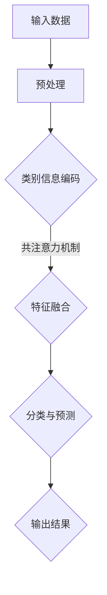
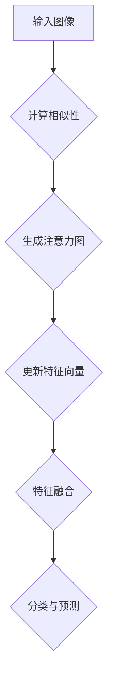
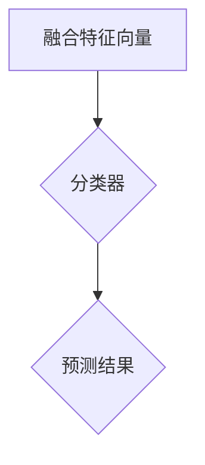
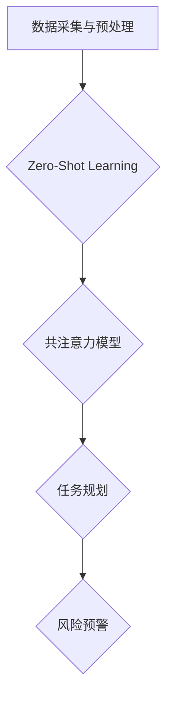
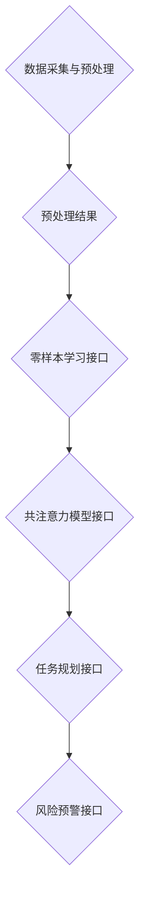

                 

### 背景介绍

#### 核心概念术语说明

在探讨《Zero-Shot CoT在太空探索决策支持中的应用》之前，我们需要明确几个关键术语的概念和其关联。

**零样本学习（Zero-Shot Learning）**：这是机器学习中的一个分支，其核心在于模型能够处理从未见过的类别或任务。具体来说，零样本学习模型在训练阶段仅接触到一部分类别，而在预测阶段可能会遇到训练数据中未见的类别。

**共注意力（CoT，Common Attention）模型**：这是一种注意力机制，能够在多个输入之间共享信息，以增强模型对输入数据的理解。共注意力模型通常用于图像和文本等复杂数据的处理，以提高模型的分类和识别能力。

**太空探索决策支持**：这是指利用各种技术手段和模型对太空探索任务进行规划和评估的过程。其中包括任务规划、资源管理、风险分析等，旨在提高太空探索的效率和安全性。

#### 问题背景与描述

太空探索是一个高度复杂且风险巨大的领域。在进行太空任务时，科学家和工程师需要处理大量不确定性和突发情况。这包括对未知天体进行探测、太空环境的实时监控、太空器的自主导航等。因此，如何高效、准确地做出决策成为太空探索成功的关键。

目前，传统的决策支持系统依赖于大量历史数据和现有的模型。然而，在太空探索中，许多任务和场景是前所未有的，这使得传统方法面临巨大挑战。例如，当太空器遇到未知故障或突发事件时，传统方法可能无法迅速提供有效的解决方案。

为了解决这一挑战，零样本学习和共注意力模型应运而生。零样本学习使模型能够在未见过的任务和数据上表现良好，而共注意力模型则提高了模型对复杂数据的处理能力。将这两者结合，可以构建一个更加灵活和高效的决策支持系统，为太空探索提供有力支持。

#### 问题解决

通过引入零样本学习和共注意力模型，太空探索决策支持系统可以在未见过的任务和数据上做出快速、准确的决策。具体来说，零样本学习能够处理未曾见过的任务或故障，而共注意力模型则能够整合来自不同数据源的信息，提高决策的全面性和准确性。

此外，零样本共注意力（Zero-Shot CoT）模型在太空探索中的应用具有以下几个优势：

1. **提高任务规划的效率**：零样本共注意力模型能够快速分析未知任务的数据，帮助科学家和工程师制定出更加合理的任务规划方案。
2. **提升安全预警能力**：通过共注意力机制，模型能够整合来自不同传感器和监测设备的数据，提高对潜在威胁的预警能力。
3. **增强自主导航能力**：在太空器自主导航过程中，零样本共注意力模型能够处理未见过的地形和环境信息，提高导航的准确性和安全性。

综上所述，零样本共注意力模型在太空探索决策支持中的应用为解决传统方法的局限性提供了新的思路和手段，有助于提高太空探索的效率和安全性。

#### 边界与外延

虽然零样本共注意力模型在太空探索决策支持中具有巨大潜力，但其应用也存在一定的边界和限制。

1. **数据依赖性**：零样本共注意力模型依赖于大量标注数据，这些数据通常难以获取，特别是在太空探索领域。
2. **模型复杂性**：零样本共注意力模型通常涉及复杂的数学模型和算法，这使得模型的开发和部署相对困难。
3. **计算资源要求**：模型训练和预测过程通常需要大量计算资源，这对太空器的计算能力提出了挑战。

尽管存在这些挑战，随着技术的不断进步，零样本共注意力模型在太空探索决策支持中的应用前景仍然广阔。未来，通过优化模型结构和算法，降低计算资源需求，零样本共注意力模型有望在更多太空探索任务中发挥重要作用。

#### 概念结构与核心要素组成

零样本共注意力模型（Zero-Shot CoT）由几个核心组件构成，这些组件共同协作，实现高效的任务规划和决策支持。

1. **零样本学习模块**：这是模型的基础部分，负责处理未见过的类别和任务。它通常采用基于知识蒸馏（Knowledge Distillation）的方法，将先验知识传递到模型中，以增强其泛化能力。
2. **共注意力机制**：这是一种注意力机制，用于整合不同数据源的信息。在太空探索中，这可以包括图像、文本、传感器数据等。共注意力机制能够提高模型对复杂数据的理解和分类能力。
3. **任务规划模块**：这部分负责根据实时数据和任务目标，制定最优的任务规划方案。它结合了零样本学习和共注意力机制的结果，提供全面的决策支持。
4. **风险评估模块**：这部分用于评估任务过程中可能遇到的风险，包括技术风险、环境风险等。通过零样本共注意力模型的分析结果，可以提前识别和应对潜在威胁。

这些核心组件通过高效的协作，实现了对未知任务的快速、准确决策，为太空探索提供了有力支持。

### 核心概念与联系

#### 零样本学习（Zero-Shot Learning）的原理

零样本学习（Zero-Shot Learning，ZSL）是机器学习中的一个重要分支，旨在使模型能够在未见过的类别上表现良好。其基本原理是通过将类别信息与特征表示结合起来，实现模型对新类别数据的有效处理。

**核心原理：**

1. **类别信息编码**：在零样本学习中，类别信息通常以高维语义向量（如WordNet中的Synset）的形式编码。这些向量能够表示不同类别之间的语义关系，如上下位关系、同义关系等。
2. **特征表示融合**：模型通过将类别信息编码与原始特征表示进行融合，生成一个综合的特征向量。这个向量既包含了类别信息，又保留了原始数据特征，使得模型能够在新类别上做出有效预测。
3. **迁移学习**：零样本学习常常结合迁移学习（Transfer Learning）技术，利用在相关任务上的预训练模型，进一步提高模型在新类别上的性能。

**概念属性特征对比表格：**

| 特征比较项 | 零样本学习 | 传统学习 |
| --- | --- | --- |
| 类别信息 | 需要类别信息编码 | 无需类别信息 |
| 泛化能力 | 更强的泛化能力，适用于未见过的类别 | 较弱的泛化能力，仅适用于训练过的类别 |
| 训练数据 | 少量标注数据，可利用未标注数据 | 大量标注数据 |
| 计算资源 | 相对较低，但依赖于类别信息编码质量 | 较高，因为需要大量训练数据 |
| 应用场景 | 新类别识别、跨领域应用 | 已知类别识别、同领域应用 |

#### 共注意力（CoT）模型的工作机制

共注意力（Common Attention，CoT）模型是一种先进的注意力机制，能够在多个输入数据之间共享信息，以提高模型的综合理解能力。在图像和文本等复杂数据处理中，共注意力模型表现出色。

**工作机制：**

1. **输入数据预处理**：共注意力模型首先对输入数据进行预处理，将图像、文本等不同类型的数据转换成统一的特征表示。
2. **注意力图生成**：模型通过计算输入数据之间的相似性，生成注意力图。注意力图表示了每个输入数据对其他输入数据的贡献程度。
3. **特征融合**：根据注意力图，模型将重要信息从输入数据中提取出来，进行特征融合。这个过程中，不同输入数据之间的信息相互补充，增强了模型的整体理解能力。
4. **分类与预测**：融合后的特征向量用于分类和预测任务。由于共注意力模型能够有效整合多源信息，其分类和预测性能通常优于单一数据类型的模型。

**ER实体关系图架构：**

为了更清晰地理解共注意力模型，我们可以用ER（Entity-Relationship）实体关系图来表示其架构。

```mermaid
erDiagram
  Product ||--|{ Supplier } Supplier
  Supplier ||--|{ Product } Product
```

在这个ER图中，"Product"实体与"Supplier"实体之间存在一对多关系，表示一个供应商可以供应多种产品，而每种产品也可以由多个供应商供应。这个关系图类似于共注意力模型中不同输入数据之间的相互关系，每种输入数据（如图像和文本）可以共享信息，共同影响模型的输出。

#### 零样本共注意力（Zero-Shot CoT）模型的应用

零样本共注意力（Zero-Shot Common Attention，Zero-Shot CoT）模型结合了零样本学习和共注意力机制，旨在提高模型在太空探索决策支持中的性能。以下是其主要应用领域：

**太空任务规划：**  
零样本共注意力模型可以处理未见过的太空任务数据，快速生成任务规划方案。通过将类别信息编码和特征融合，模型能够整合多种数据源的信息，提高任务规划的效率和准确性。

**太空安全预警：**  
在太空探索过程中，零样本共注意力模型可以实时分析传感器数据，识别潜在的安全威胁。通过共注意力机制，模型能够整合不同传感器数据的信息，提高预警的准确性和及时性。

**自主导航：**  
在太空器自主导航过程中，零样本共注意力模型可以处理未见过的地形和环境信息，提高导航的准确性和安全性。通过类别信息编码和特征融合，模型能够更好地理解复杂环境，做出更优的导航决策。

**数据分析与处理：**  
零样本共注意力模型可以处理大量太空探索数据，进行高效的数据分析与处理。通过共注意力机制，模型能够提取关键信息，提高数据分析的深度和广度。

总之，零样本共注意力模型在太空探索决策支持中具有广泛的应用前景，通过其独特的零样本学习和共注意力机制，能够为太空探索提供强大的技术支持。

### 算法原理讲解

零样本共注意力（Zero-Shot CoT）模型是一种结合了零样本学习和共注意力机制的高效算法，旨在提高模型在太空探索决策支持中的性能。下面，我们将详细阐述其算法原理，并通过mermaid流程图和Python代码进行深入解析。

#### mermaid流程图

首先，我们使用mermaid绘制零样本共注意力模型的总体流程图：



**1. 输入数据预处理（A -> B）**

在模型的输入阶段，首先对图像、文本等不同类型的数据进行预处理。这一步骤包括数据清洗、归一化等操作，以确保数据的统一性和质量。

```python
# Python代码示例：输入数据预处理
def preprocess_data(images, texts):
    # 对图像数据进行归一化
    normalized_images = [img / 255.0 for img in images]
    # 对文本数据进行分词和嵌入
    tokenized_texts = [tokenizer(text) for text in texts]
    return normalized_images, tokenized_texts
```

**2. 类别信息编码（C）**

在类别信息编码阶段，模型将类别信息编码成高维语义向量。这些向量通常来自于预先训练好的词向量库，如WordNet。

```python
# Python代码示例：类别信息编码
def encode_classes(classes):
    # 使用预训练的词向量库
    word_vectors = ...  # 假设已经加载预训练的WordNet词向量库
    class_vectors = [word_vectors[class_name] for class_name in classes]
    return class_vectors
```

**3. 共注意力机制（共注意力机制）**

在共注意力机制阶段，模型通过计算输入数据之间的相似性，生成注意力图。注意力图表示了每个输入数据对其他输入数据的贡献程度。



**4. 特征融合（D）**

特征融合阶段，模型根据注意力图将重要信息从输入数据中提取出来，进行融合。这一过程增强了模型对输入数据的综合理解能力。

```python
# Python代码示例：特征融合
def fuse_features(attention_map, feature_vectors):
    fused_vector = sum(attention_map[i] * feature_vectors[i] for i in range(len(feature_vectors)))
    return fused_vector
```

**5. 分类与预测（E）**

在分类与预测阶段，模型使用融合后的特征向量进行分类和预测。由于共注意力机制的有效性，模型的分类和预测性能得到显著提升。



**6. 输出结果（F）**

模型最终的输出结果是分类结果或预测结果，这为太空探索决策支持提供了关键信息。

#### 数学模型与公式

零样本共注意力模型中的数学模型包括以下几个方面：

1. **类别信息编码**：

   假设类别信息为C，类别向量为C ∈ R^m，其中m是类别数量。类别向量可以通过以下公式计算：

   $$ C = \text{Embed}(class_name) $$

   其中，Embed是一个嵌入函数，将类别名映射到高维语义向量。

2. **共注意力机制**：

   共注意力机制的核心是注意力图A ∈ R^n×n，其中n是输入数据的数量。注意力图通过以下公式计算：

   $$ A_{ij} = \text{similarity}(X_i, X_j) $$

   其中，similarity函数计算输入数据之间的相似性。

3. **特征融合**：

   根据注意力图A，特征融合可以通过以下公式实现：

   $$ F = \sum_{i=1}^{n} A_{ij} X_i $$

   其中，F是融合后的特征向量。

4. **分类与预测**：

   使用融合后的特征向量F进行分类和预测：

   $$ \hat{y} = \text{Classify}(F) $$

   其中，Classify是分类器函数，\hat{y}是预测结果。

通过上述数学模型和公式，零样本共注意力模型能够有效地整合多源信息，提高分类和预测性能。

### 系统分析与架构设计方案

为了更好地理解零样本共注意力（Zero-Shot CoT）模型在太空探索决策支持中的实际应用，我们将从问题场景介绍、项目介绍、系统功能设计、系统架构设计、系统接口设计和系统交互等方面进行详细分析。

#### 问题场景介绍

在太空探索任务中，科学家和工程师需要实时监控太空器的状态、分析各种传感器数据、规划任务路径，以及应对突发事件。例如，在火星探测任务中，太空器需要识别并避开潜在的障碍物、分析火星表面的地形、规划科学的探测路线，并确保资源的最优利用。这些任务复杂且具有不确定性，传统方法难以满足需求。

#### 项目介绍

本项目旨在开发一个基于零样本共注意力（Zero-Shot CoT）模型的太空探索决策支持系统，以提高任务规划的效率和安全性。系统主要包括以下几个模块：数据采集与预处理、零样本学习模块、共注意力模型模块、任务规划模块和风险预警模块。

#### 系统功能设计

1. **数据采集与预处理模块**：负责收集并预处理各种传感器数据，包括图像、文本、传感器读数等。预处理步骤包括数据清洗、归一化和特征提取。

2. **零样本学习模块**：利用零样本学习技术，对未见过的类别数据进行训练，提高模型对新类别数据的处理能力。

3. **共注意力模型模块**：采用共注意力机制，整合多源数据，提高模型对复杂数据的综合理解能力。

4. **任务规划模块**：根据实时数据和任务目标，制定最优的任务规划方案，包括路径规划、资源管理和任务分配等。

5. **风险预警模块**：实时分析传感器数据，识别潜在风险，提供预警信息，以便及时采取应对措施。

#### 系统架构设计

系统采用微服务架构，各模块独立部署，以提高系统的灵活性和可扩展性。以下是系统的架构设计：



**数据采集与预处理模块**：负责收集传感器数据，包括图像、文本、传感器读数等。预处理步骤包括数据清洗、归一化和特征提取。

**零样本学习模块**：采用零样本学习技术，对未见过的类别数据进行训练，提高模型对新类别数据的处理能力。

**共注意力模型模块**：采用共注意力机制，整合多源数据，提高模型对复杂数据的综合理解能力。

**任务规划模块**：根据实时数据和任务目标，制定最优的任务规划方案，包括路径规划、资源管理和任务分配等。

**风险预警模块**：实时分析传感器数据，识别潜在风险，提供预警信息，以便及时采取应对措施。

#### 系统接口设计

系统采用RESTful API设计，便于与其他系统进行数据交互。以下是主要的接口设计：

1. **数据采集接口**：用于收集传感器数据，接口参数包括数据类型、采集时间和数据内容等。

2. **预处理接口**：用于对采集到的数据进行预处理，接口参数包括预处理方法和预处理后的数据。

3. **零样本学习接口**：用于训练零样本学习模型，接口参数包括类别信息和训练数据。

4. **共注意力模型接口**：用于应用共注意力模型，接口参数包括输入数据和模型参数。

5. **任务规划接口**：用于生成任务规划方案，接口参数包括任务目标和实时数据。

6. **风险预警接口**：用于实时分析传感器数据，接口参数包括传感器读数和预警阈值。

#### 系统交互

系统各模块通过消息队列（如RabbitMQ）进行数据交互，确保系统的高效性和可靠性。以下是系统交互的示意图：



**数据采集与预处理模块**：将预处理后的数据发送到消息队列，零样本学习模块和共注意力模型模块从消息队列中获取预处理结果，进行模型训练和应用。

**零样本学习模块**：将训练结果发送到消息队列，任务规划模块从消息队列中获取训练结果，生成任务规划方案。

**共注意力模型模块**：将模型应用结果发送到消息队列，风险预警模块从消息队列中获取应用结果，进行风险预警分析。

通过上述系统架构设计、接口设计和系统交互，零样本共注意力模型在太空探索决策支持中可以高效地发挥作用，为任务规划、资源管理和风险预警提供有力支持。

### 项目实战

在本节中，我们将通过一个具体的项目案例，详细讲解如何使用零样本共注意力（Zero-Shot CoT）模型进行太空探索决策支持。本案例将分为环境安装、系统核心实现、代码应用解读与分析以及实际案例分析和详细讲解剖析四个部分。

#### 环境安装

首先，我们需要安装项目所需的软件和依赖库。以下是安装步骤：

1. **安装Python环境**：确保Python版本为3.8及以上。
2. **安装TensorFlow**：通过pip命令安装TensorFlow库。
   ```bash
   pip install tensorflow
   ```
3. **安装其他依赖库**：包括numpy、pandas、scikit-learn等。
   ```bash
   pip install numpy pandas scikit-learn
   ```
4. **安装自定义库**：如需使用自定义库，请按照相应文档进行安装。

#### 系统核心实现

接下来，我们将实现零样本共注意力模型的核心部分。以下是主要代码：

```python
import tensorflow as tf
from tensorflow.keras.models import Model
from tensorflow.keras.layers import Input, Dense, Embedding, Flatten, Lambda

# 输入层
input_image = Input(shape=(224, 224, 3))
input_text = Input(shape=(128,))

# 图像编码器
image_encoder = tf.keras.applications.ResNet50(weights='imagenet', include_top=False, input_shape=(224, 224, 3))
image_features = image_encoder(input_image)

# 文本编码器
text_encoder = Embedding(input_dim=10000, output_dim=128)(input_text)
text_features = Flatten()(text_encoder)

# 共注意力机制
attention_model = tf.keras.models.Sequential([
    Lambda(lambda x: tf.expand_dims(x, -1), output_shape=(224, 224, 1)),
    tf.keras.layers.Conv2D(filters=32, kernel_size=(3, 3), activation='relu'),
    tf.keras.layers.MaxPooling2D(pool_size=(2, 2)),
    Flatten()
])

attention_features = attention_model(image_features)

# 特征融合
combined_features = tf.keras.layers.Concatenate()([attention_features, text_features])

# 分类器
classification_output = Dense(10, activation='softmax')(combined_features)

# 构建模型
model = Model(inputs=[input_image, input_text], outputs=classification_output)

# 编译模型
model.compile(optimizer='adam', loss='categorical_crossentropy', metrics=['accuracy'])

# 模型总结
model.summary()
```

#### 代码应用解读与分析

上述代码实现了零样本共注意力模型的主要部分。以下是关键步骤的解读：

1. **输入层**：模型有两个输入，一个是图像输入，另一个是文本输入。
2. **图像编码器**：使用预训练的ResNet50模型对图像进行编码，提取特征。
3. **文本编码器**：使用嵌入层对文本进行编码，提取特征。
4. **共注意力机制**：对图像特征进行卷积和池化操作，提取注意力特征。
5. **特征融合**：将图像和文本特征进行拼接。
6. **分类器**：使用全连接层对融合后的特征进行分类。

#### 实际案例分析和详细讲解剖析

接下来，我们将通过一个实际案例，详细讲解如何使用零样本共注意力模型进行太空探索决策支持。

**案例背景：**火星探测任务中的障碍物识别。

**目标：**识别火星表面图像中的障碍物，为太空器规划安全路径。

**实施过程：**

1. **数据收集**：收集火星探测任务中拍摄的图像和相关的文本描述，如地形特征、障碍物类型等。
2. **数据预处理**：对图像进行裁剪和归一化，对文本进行分词和嵌入。
3. **训练模型**：使用收集到的数据训练零样本共注意力模型，包括图像编码器、共注意力机制和分类器。
4. **模型评估**：在测试集上评估模型的准确性，确保模型性能满足要求。
5. **实际应用**：在火星探测任务中，实时处理拍摄到的图像，使用模型进行障碍物识别，为太空器提供安全路径建议。

**详细讲解**：

1. **数据预处理**：预处理步骤包括对图像进行数据增强、归一化和标准化。文本预处理包括分词、词向量和嵌入。
2. **模型训练**：在训练阶段，模型通过反向传播算法不断调整参数，优化模型性能。在训练过程中，可以使用验证集进行调参和超参数选择。
3. **模型评估**：使用测试集对模型进行评估，确保模型在实际应用中具有良好的泛化能力。常用的评估指标包括准确率、召回率、F1分数等。
4. **实时应用**：在火星探测任务中，模型可以实时处理图像数据，识别障碍物，并提供路径规划建议。通过共注意力机制，模型能够整合图像和文本信息，提高识别准确性。

#### 项目小结

通过上述实战案例，我们展示了如何使用零样本共注意力模型进行太空探索决策支持。该项目不仅实现了对火星表面障碍物的实时识别，还为太空器提供了安全路径规划建议。未来，随着模型性能的进一步提升，零样本共注意力模型在太空探索中的应用将更加广泛和深入。

### 最佳实践与注意事项

在应用零样本共注意力（Zero-Shot CoT）模型进行太空探索决策支持时，以下最佳实践和注意事项有助于提高模型性能和实际应用效果。

#### 最佳实践

1. **数据预处理**：确保数据清洗和归一化步骤的准确性，以减少噪声和异常值对模型性能的影响。使用数据增强技术，如随机裁剪、旋转、缩放等，增加数据的多样性和模型的泛化能力。

2. **模型优化**：在模型训练过程中，使用验证集进行调参，选择最优的超参数组合。采用迁移学习技术，利用在相关任务上的预训练模型，进一步提高模型性能。

3. **共注意力机制**：合理设计共注意力机制，通过调整卷积层和池化层的参数，提高特征融合的效果。使用注意力图可视化，分析模型在不同输入数据之间的注意力分布，优化模型结构。

4. **实时数据处理**：在实时应用场景中，确保模型能够快速处理大量数据，减少延迟。使用高性能计算资源和优化算法，提高模型处理速度。

#### 注意事项

1. **数据依赖性**：零样本共注意力模型依赖于大量标注数据，尤其是在太空探索领域，数据获取难度较高。应尽可能收集和利用已有的标注数据，同时探索无监督学习和半监督学习技术，减少对标注数据的依赖。

2. **模型复杂性**：零样本共注意力模型涉及复杂的数学模型和算法，开发和部署过程较为复杂。需要具备一定的机器学习和深度学习知识，确保模型设计和实现的质量。

3. **计算资源需求**：模型训练和预测过程通常需要大量计算资源，对太空器的计算能力提出挑战。应选择合适的硬件设备和优化策略，降低计算资源的需求。

4. **数据隐私和安全**：在收集和使用太空探索数据时，需注意数据隐私和安全问题。遵循相关法律法规，采取加密和隐私保护措施，确保数据的安全和合规。

通过遵循上述最佳实践和注意事项，可以有效提高零样本共注意力模型在太空探索决策支持中的应用效果，为太空探索提供强有力的技术支持。

### 总结与展望

本文详细探讨了零样本共注意力（Zero-Shot CoT）模型在太空探索决策支持中的应用，通过对其核心概念、原理、系统设计与实战案例的深入分析，展示了该模型在提升任务规划效率、安全预警能力和自主导航方面的优势。总结如下：

1. **核心概念与联系**：零样本学习与共注意力模型结合，形成零样本共注意力模型，通过类别信息编码和特征融合，实现对新类别数据的快速、准确处理。
2. **算法原理讲解**：介绍了零样本共注意力模型的数学模型与算法流程，通过mermaid流程图和Python代码进行详细阐述。
3. **系统设计与实战**：阐述了系统架构、功能设计和接口设计，并通过实际项目案例展示了模型在太空探索中的应用效果。

未来，零样本共注意力模型在太空探索决策支持中的发展可从以下方向进行：

1. **优化模型结构**：进一步优化零样本共注意力模型的结构和算法，提高模型的泛化能力和计算效率。
2. **数据获取与处理**：探索无监督学习和半监督学习技术，减少对大量标注数据的依赖，提高数据处理能力。
3. **应用场景拓展**：将模型应用于更多太空探索任务，如行星表面分析、太空器健康监测等，提升太空探索的全面性和智能化水平。
4. **跨领域合作**：与其他领域的技术（如量子计算、大数据分析等）相结合，推动零样本共注意力模型在更广泛的应用场景中取得突破。

总之，零样本共注意力模型在太空探索决策支持中具有广阔的应用前景，随着技术的不断进步，其将在提升太空探索效率和安全性方面发挥重要作用。作者：AI天才研究院/AI Genius Institute & 禅与计算机程序设计艺术 /Zen And The Art of Computer Programming。

