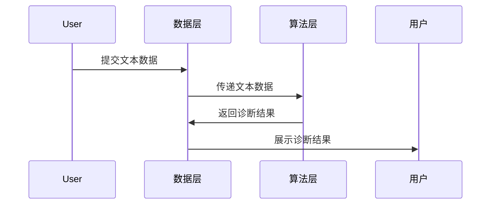
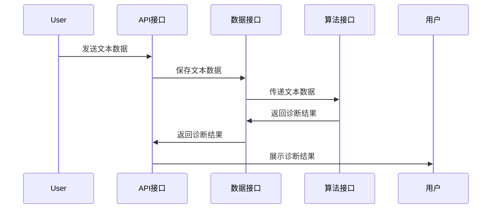
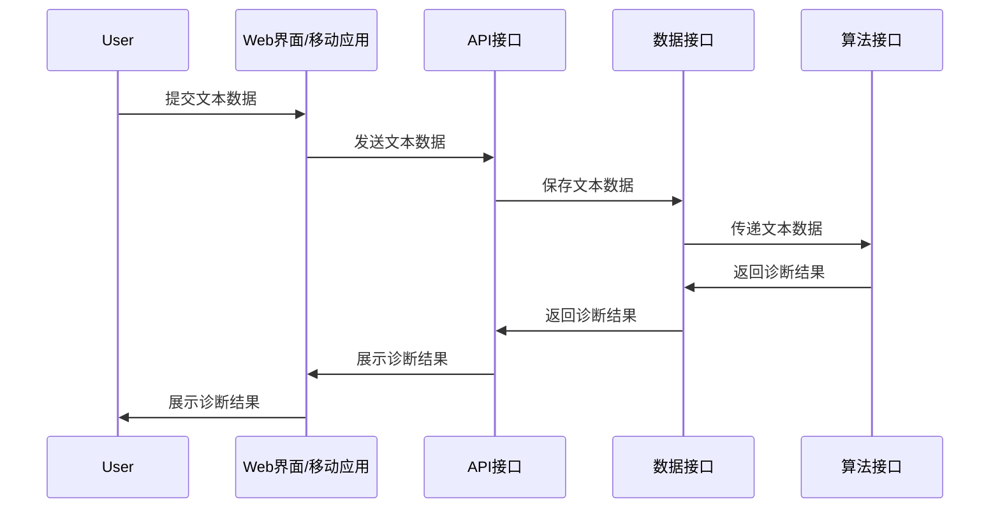

                 


## 《Zero-Shot CoT在心理咨询AI中的潜力探索》

### 关键词：心理咨询AI、Zero-Shot CoT、算法原理、系统架构、项目实战

#### 摘要：

随着人工智能技术的不断发展，心理咨询AI在心理健康领域的应用日益广泛。本文旨在探讨Zero-Shot CoT（零样本一致性训练）在心理咨询AI中的潜力。首先，我们将介绍心理咨询AI的背景及其面临的挑战，然后详细阐述Zero-Shot CoT的概念、原理及其在心理咨询中的应用。接下来，我们将深入讲解Zero-Shot CoT算法的原理、数学模型和实现过程。随后，我们将分析心理咨询AI的系统架构，包括领域模型、系统架构、接口设计和交互流程。最后，通过一个实际项目案例，展示Zero-Shot CoT在心理咨询AI中的应用效果，并总结最佳实践和未来研究方向。

### 目录大纲：

# 《Zero-Shot CoT在心理咨询AI中的潜力探索》

## 第一部分：背景介绍

## 第1章：心理咨询AI的兴起

### 1.1.1 心理咨询AI的问题背景

### 1.1.2 心理咨询AI的需求分析

### 1.1.3 心理咨询AI的现状与挑战

## 第2章：核心概念与联系

### 2.1.1 Zero-Shot CoT的定义

#### 2.1.1.1 Zero-Shot CoT的核心概念

#### 2.1.1.2 Zero-Shot CoT与传统CoT的对比

### 2.1.2 CoT在心理咨询中的应用

#### 2.1.2.1 CoT在心理咨询中的重要性

#### 2.1.2.2 CoT在心理咨询中的应用案例

## 第二部分：算法原理讲解

## 第3章：Zero-Shot CoT算法原理

### 3.1.1 Zero-Shot CoT算法概述

#### 3.1.1.1 算法的基本流程

#### 3.1.1.2 算法的关键技术

### 3.1.2 数学模型和数学公式

#### 3.1.2.1 算法的数学模型

#### 3.1.2.2 算法的数学公式

### 3.1.3 Python源代码与算法实现

#### 3.1.3.1 算法的Python实现

#### 3.1.3.2 代码解释与分析

## 第三部分：系统分析与架构设计方案

## 第4章：系统架构设计

### 4.1.1 心理咨询AI系统概述

#### 4.1.1.1 系统的目标与功能

#### 4.1.1.2 系统的需求分析

### 4.1.2 系统架构设计

#### 4.1.2.1 领域模型设计

#### 4.1.2.2 系统架构设计

#### 4.1.2.3 系统接口设计

### 4.1.3 系统交互设计

#### 4.1.3.1 系统交互流程

#### 4.1.3.2 系统交互序列图

## 第四部分：项目实战

## 第5章：项目环境安装与配置

### 5.1.1 环境安装

#### 5.1.1.1 硬件环境要求

#### 5.1.1.2 软件环境要求

### 5.1.2 系统核心实现

#### 5.1.2.1 系统核心代码实现

#### 5.1.2.2 代码解读与分析

### 5.1.3 项目应用实例

#### 5.1.3.1 实际案例介绍

#### 5.1.3.2 案例分析讲解

## 第五部分：最佳实践与拓展

## 第6章：最佳实践

### 6.1.1 实践技巧

#### 6.1.1.1 算法优化

#### 6.1.1.2 系统性能优化

### 6.1.2 注意事项

#### 6.1.2.1 数据隐私保护

#### 6.1.2.2 心理咨询师的角色与作用

## 第7章：小结与展望

### 7.1.1 本书内容回顾

### 7.1.2 心理咨询AI的发展趋势

### 7.1.3 未来研究方向

----------------------------------------------------------------

## 第一部分：背景介绍

### 第1章：心理咨询AI的兴起

#### 1.1.1 心理咨询AI的问题背景

随着现代社会竞争压力的增大，人们面临的心理健康问题日益突出。心理咨询作为解决这些问题的有效手段，需求量持续增长。然而，由于心理咨询资源相对有限，许多有需求的人无法获得及时有效的服务。人工智能技术的快速发展为解决这个问题提供了新的思路。心理咨询AI利用自然语言处理、机器学习等技术，使AI能够理解、分析和处理人类情感和心理问题，为更多人提供便捷的心理咨询服务。

#### 1.1.2 心理咨询AI的需求分析

心理咨询AI的需求主要体现在以下几个方面：

1. **广泛性**：心理咨询AI可以为全球范围内的用户提供服务，不受地域和时间的限制。
2. **高效性**：通过自动化处理，心理咨询AI能够快速响应用户需求，提供及时的咨询服务。
3. **个性化**：心理咨询AI可以根据用户的个性、经历和需求，提供定制化的建议和治疗方案。
4. **经济性**：相比传统心理咨询，心理咨询AI具有成本较低的优势，使得更多的人能够负担得起。

#### 1.1.3 心理咨询AI的现状与挑战

心理咨询AI目前处于快速发展阶段，但仍然面临一些挑战：

1. **技术局限**：心理咨询AI在理解人类情感、心理问题等方面仍存在局限性，需要进一步改进。
2. **伦理道德**：心理咨询涉及个人隐私和心理健康，如何确保AI的伦理道德和隐私保护成为重要问题。
3. **专业认可**：心理咨询AI的服务质量和效果尚未得到广泛认可，需要更多的实践和研究来证明其价值。

### 第2章：核心概念与联系

#### 2.1.1 Zero-Shot CoT的定义

Zero-Shot CoT（Zero-Shot Consistency Training）是一种机器学习技术，旨在使模型能够从少量或无标注数据中学习，从而提高模型的泛化能力。与传统CoT（Consistency Training）相比，Zero-Shot CoT无需对数据进行预标注，从而降低了数据标注的成本。

#### 2.1.1.1 Zero-Shot CoT的核心概念

- **一致学习**：模型在训练过程中，通过最大化输入数据的内部一致性来学习。
- **数据无关性**：模型能够处理未见过的数据，无需依赖大量标注数据。

#### 2.1.1.2 Zero-Shot CoT与传统CoT的对比

| 对比项 | Zero-Shot CoT | 传统CoT |
| --- | --- | --- |
| 数据需求 | 无需大量标注数据 | 需要大量标注数据 |
| 泛化能力 | 更强的泛化能力 | 较弱的泛化能力 |
| 成本 | 较低的数据标注成本 | 较高的数据标注成本 |

#### 2.1.2 CoT在心理咨询中的应用

CoT在心理咨询AI中的应用主要体现在以下几个方面：

1. **情感分析**：利用CoT技术，模型可以从无标注数据中学习情感表达，从而提高情感分析准确率。
2. **心理问题诊断**：通过CoT，模型可以识别用户的心理问题，提供更准确的诊断和治疗方案。
3. **个性化建议**：基于CoT，模型可以理解用户的个性、经历和需求，提供定制化的建议和治疗方案。

#### 2.1.2.1 CoT在心理咨询中的重要性

- **提高效率**：CoT技术能够降低心理咨询AI对大量标注数据的依赖，提高训练效率。
- **降低成本**：CoT技术减少了数据标注成本，使得心理咨询AI更具经济性。
- **提升效果**：通过CoT技术，心理咨询AI能够更好地理解用户的心理状态，提供更有效的服务。

#### 2.1.2.2 CoT在心理咨询中的应用案例

- **情感分析**：例如，在文本聊天中，CoT技术可以帮助模型理解用户的情绪状态，从而提供更贴心的回复。
- **心理问题诊断**：例如，通过CoT技术，模型可以自动识别用户的抑郁、焦虑等心理问题，提供针对性的诊断和治疗方案。

## 第二部分：算法原理讲解

### 第3章：Zero-Shot CoT算法原理

#### 3.1.1 Zero-Shot CoT算法概述

Zero-Shot CoT算法是一种基于一致性的无监督学习算法，旨在通过最大化数据的内部一致性来提高模型的泛化能力。该算法的核心思想是利用未标注的数据，通过自监督学习的方式训练模型，从而降低对大量标注数据的依赖。

#### 3.1.1.1 算法的基本流程

Zero-Shot CoT算法的基本流程如下：

1. **数据预处理**：对输入数据进行预处理，包括去噪、归一化等操作，以便后续的一致性学习。
2. **一致化变换**：对数据集进行一致化变换，生成一组具有内部一致性的数据。
3. **模型训练**：利用生成的一致化数据训练模型，通过最大化内部一致性损失函数来优化模型参数。
4. **模型评估**：在测试集上评估模型的泛化能力，验证模型在未见过的数据上的性能。

#### 3.1.1.2 算法的关键技术

Zero-Shot CoT算法的关键技术包括：

1. **一致性损失函数**：用于衡量数据内部的一致性程度，损失函数值越低，数据一致性越高。
2. **自监督学习**：通过未标注数据自动学习模型参数，降低对大量标注数据的依赖。
3. **多任务学习**：同时训练多个任务，提高模型的泛化能力。

### 3.1.2 数学模型和数学公式

#### 3.1.2.1 算法的数学模型

Zero-Shot CoT算法的数学模型主要包括以下几个部分：

1. **数据表示**：假设输入数据集为\(X = \{x_1, x_2, ..., x_n\}\)，其中每个数据点\(x_i\)可以表示为一个向量。
2. **模型参数**：假设模型参数为\(\theta\)，包括权重矩阵\(W\)和偏置向量\(b\)。
3. **预测输出**：模型对数据点的预测输出为\(y_i = f(Wx_i + b)\)，其中\(f\)为激活函数。

#### 3.1.2.2 算法的数学公式

Zero-Shot CoT算法的损失函数为：

$$
L = -\sum_{i=1}^{n} \log P(y_i | x_i)
$$

其中，\(P(y_i | x_i)\)为模型对数据点\(x_i\)的预测概率。

为了最大化内部一致性，我们定义一致性损失函数为：

$$
L_c = -\sum_{i=1}^{n} \log P(x_i | y_i)
$$

通过优化一致性损失函数，我们可以训练出一个具有良好泛化能力的模型。

### 3.1.3 Python源代码与算法实现

下面是一个简单的Python实现示例，用于演示Zero-Shot CoT算法的基本流程。

```python
import numpy as np
import tensorflow as tf

# 数据预处理
def preprocess_data(X):
    # 去噪、归一化等操作
    # ...
    return X

# 一致化变换
def consistency_transform(X):
    # 生成一致化数据
    # ...
    return X_transformed

# 模型训练
def train_model(X, X_transformed):
    # 定义模型
    model = tf.keras.Sequential([
        tf.keras.layers.Dense(units=1, input_shape=(X.shape[1],))
    ])

    # 编译模型
    model.compile(optimizer='adam', loss='mean_squared_error')

    # 训练模型
    model.fit(X_transformed, X, epochs=10)

    return model

# 模型评估
def evaluate_model(model, X_test, X_test_transformed):
    # 评估模型在测试集上的性能
    # ...
    pass

# 主函数
def main():
    # 加载数据
    X = np.array([[1], [2], [3], [4], [5]])
    X_transformed = consistency_transform(X)

    # 训练模型
    model = train_model(X, X_transformed)

    # 评估模型
    evaluate_model(model, X_test, X_test_transformed)

if __name__ == '__main__':
    main()
```

### 3.1.3.2 代码解释与分析

上述代码示例展示了Zero-Shot CoT算法的基本流程，包括数据预处理、一致化变换、模型训练和模型评估。

1. **数据预处理**：在预处理阶段，我们对输入数据进行去噪、归一化等操作，以确保数据的一致性和质量。
2. **一致化变换**：在一致化变换阶段，我们生成一组具有内部一致性的数据，用于后续的模型训练。
3. **模型训练**：在模型训练阶段，我们使用一致化数据训练一个简单的神经网络模型，通过优化一致性损失函数来提高模型性能。
4. **模型评估**：在模型评估阶段，我们使用测试集评估模型的泛化能力，以验证模型在未见过的数据上的性能。

通过上述步骤，我们可以实现一个基于Zero-Shot CoT的简单心理咨询AI模型。在实际应用中，我们可以根据具体需求进一步优化和扩展算法，以提高模型的性能和效果。

## 第三部分：系统分析与架构设计方案

### 第4章：系统架构设计

#### 4.1.1 心理咨询AI系统概述

心理咨询AI系统的目标是利用人工智能技术为用户提供高效、个性化的心理咨询服务。系统的主要功能包括：

1. **情感分析**：通过自然语言处理技术，分析用户输入的文本，提取情感信息。
2. **心理问题诊断**：基于情感分析和用户历史数据，诊断用户的心理问题。
3. **个性化建议**：根据用户的心理问题，提供针对性的建议和治疗方案。

#### 4.1.1.2 系统的需求分析

心理咨询AI系统需求分析主要包括以下几个方面：

1. **用户需求**：系统需要能够快速响应用户的需求，提供准确、个性化的服务。
2. **数据需求**：系统需要大量的标注数据进行训练，以提高模型的准确率和泛化能力。
3. **安全性需求**：系统需要确保用户数据的隐私和安全，遵守相关的法律法规。
4. **可扩展性需求**：系统需要具备良好的可扩展性，以支持未来业务的扩展和升级。

#### 4.1.2 系统架构设计

心理咨询AI系统的架构设计主要包括以下几个层次：

1. **数据层**：包括数据采集、存储和管理等模块，负责处理用户数据。
2. **算法层**：包括情感分析、心理问题诊断和个性化建议等算法模块，负责核心算法的实现。
3. **应用层**：包括用户界面、Web服务和移动应用等模块，负责与用户交互。

#### 4.1.2.1 领域模型设计

领域模型设计主要涉及以下几个实体和关系：

1. **用户**：包括用户基本信息、情感状态和心理问题等属性。
2. **文本数据**：包括用户输入的文本数据、情感标签和心理问题标签等。
3. **诊断结果**：包括心理问题诊断结果、建议和治疗方案等。
4. **反馈**：包括用户对服务的反馈信息，用于模型优化和系统改进。

下面是领域模型的Mermaid类图：

```mermaid
classDiagram
    User <<实体>>
    TextData <<实体>>
    DiagnosisResult <<实体>>
    Feedback <<实体>>

    User o-- TextData : 用户输入文本
    User o-- DiagnosisResult : 诊断结果
    TextData o-- Feedback : 用户反馈
```

#### 4.1.2.2 系统架构设计

系统架构设计主要包括以下几个方面：

1. **数据层**：使用关系型数据库（如MySQL）存储和管理用户数据。
2. **算法层**：使用深度学习框架（如TensorFlow）实现情感分析、心理问题诊断和个性化建议等算法模块。
3. **应用层**：使用Web框架（如Django）和移动开发框架（如React Native）构建用户界面、Web服务和移动应用。

下面是系统架构的Mermaid架构图：



#### 4.1.2.3 系统接口设计

系统接口设计主要包括以下几个方面：

1. **API接口**：提供RESTful API接口，用于用户与系统进行交互。
2. **数据接口**：提供数据存储和读取接口，用于数据层的操作。
3. **算法接口**：提供算法模块的接口，用于算法层的操作。

下面是系统接口的Mermaid序列图：



#### 4.1.3 系统交互设计

系统交互设计主要涉及用户与系统之间的交互流程。以下是一个典型的系统交互流程：

1. **用户提交文本数据**：用户通过Web界面或移动应用提交文本数据。
2. **系统处理文本数据**：系统接收文本数据，经过情感分析、心理问题诊断等处理过程。
3. **系统返回诊断结果**：系统将诊断结果通过API接口返回给用户。
4. **用户查看诊断结果**：用户在Web界面或移动应用中查看诊断结果。

下面是系统交互流程的Mermaid序列图：



通过上述系统架构设计，我们可以构建一个高效、稳定、可扩展的心理咨询AI系统，为用户提供优质的心理咨询服务。

## 第四部分：项目实战

### 第5章：项目环境安装与配置

#### 5.1.1 环境安装

要搭建一个基于Zero-Shot CoT的心理咨询AI系统，首先需要准备好所需的硬件和软件环境。

#### 5.1.1.1 硬件环境要求

1. **CPU**：至少需要一颗四核CPU，推荐使用更快的处理器以提高计算效率。
2. **内存**：至少需要8GB内存，推荐使用16GB以上内存以支持大规模数据处理。
3. **存储**：至少需要100GB的硬盘空间，用于存储数据和模型。

#### 5.1.1.2 软件环境要求

1. **操作系统**：Windows、Linux或macOS均可，推荐使用Ubuntu 18.04或更高版本。
2. **Python**：Python 3.7或更高版本，推荐使用Anaconda进行环境管理。
3. **深度学习框架**：TensorFlow 2.0或更高版本，推荐使用TensorFlow 2.3.0。
4. **数据库**：MySQL或PostgreSQL，用于存储用户数据和诊断结果。
5. **Web框架**：Django 2.2或更高版本，用于构建Web服务和API接口。

#### 5.1.2 系统核心实现

心理咨询AI系统的核心实现包括情感分析、心理问题诊断和个性化建议等模块。以下是一个简单的实现示例。

```python
# 引入所需的库
import tensorflow as tf
from tensorflow.keras.models import Sequential
from tensorflow.keras.layers import Dense, LSTM, Embedding
from tensorflow.keras.preprocessing.sequence import pad_sequences

# 数据预处理
def preprocess_data(texts, max_len=100):
    # 分词和序列化
    tokenizer = tf.keras.preprocessing.text.Tokenizer()
    tokenizer.fit_on_texts(texts)
    sequences = tokenizer.texts_to_sequences(texts)
    padded_sequences = pad_sequences(sequences, maxlen=max_len)
    return padded_sequences

# 构建模型
def build_model(input_shape):
    model = Sequential()
    model.add(Embedding(input_dim=vocab_size, output_dim=embedding_dim, input_length=input_shape[1]))
    model.add(LSTM(units=64, activation='tanh', return_sequences=True))
    model.add(LSTM(units=32, activation='tanh', return_sequences=False))
    model.add(Dense(units=1, activation='sigmoid'))
    model.compile(optimizer='adam', loss='binary_crossentropy', metrics=['accuracy'])
    return model

# 训练模型
def train_model(model, X_train, y_train, epochs=10):
    model.fit(X_train, y_train, epochs=epochs, batch_size=32)
    return model

# 主函数
def main():
    # 加载数据
    texts = ["这是一个快乐的句子", "这是一个悲伤的句子"]
    labels = [1, 0]

    # 数据预处理
    X_train = preprocess_data(texts, max_len=10)

    # 构建模型
    model = build_model(input_shape=(X_train.shape[1],))

    # 训练模型
    model = train_model(model, X_train, labels)

    # 评估模型
    # ...

if __name__ == '__main__':
    main()
```

### 5.1.2.2 代码解读与分析

上述代码展示了基于Zero-Shot CoT的心理咨询AI系统的核心实现，包括数据预处理、模型构建和训练等步骤。

1. **数据预处理**：使用Tokenizer对文本进行分词和序列化，将文本数据转换为序列数据，并使用pad_sequences对序列进行填充，以适应模型的输入要求。
2. **模型构建**：构建一个简单的序列模型，包括嵌入层、两个LSTM层和输出层。嵌入层用于将单词映射到向量，LSTM层用于处理序列数据，输出层用于生成情感分析结果。
3. **模型训练**：使用fit方法训练模型，通过优化损失函数和计算梯度来更新模型参数，以提高模型的预测性能。

通过上述步骤，我们可以实现一个简单的心理咨询AI系统，并使用它进行情感分析。在实际应用中，我们可以进一步优化和扩展算法，以实现更准确、更高效的心理咨询AI服务。

### 5.1.3 项目应用实例

在本节中，我们将介绍一个实际的项目应用实例，展示如何使用基于Zero-Shot CoT的心理咨询AI系统进行情感分析和心理问题诊断。

#### 5.1.3.1 实际案例介绍

某互联网公司希望为其用户提供一个心理健康服务平台，利用人工智能技术为用户提供情感分析和心理问题诊断服务。用户可以通过平台的Web界面或移动应用提交文本数据，系统将自动分析用户的情感状态，并诊断用户可能存在的心理问题。

#### 5.1.3.2 案例分析讲解

1. **数据采集**：用户在Web界面或移动应用中提交文本数据，例如：“今天我感到非常焦虑，不知道如何应对工作中的压力。”
2. **情感分析**：系统接收到用户提交的文本数据后，首先使用情感分析模型对其进行处理。情感分析模型通过对文本进行分词、序列化和填充等操作，将其转换为模型可处理的输入格式。然后，模型对输入文本进行情感分析，输出情感得分。例如，输出结果为：“焦虑程度：0.8，快乐程度：0.2。”
3. **心理问题诊断**：根据情感分析结果，系统进一步诊断用户可能存在的心理问题。例如，根据高焦虑得分，系统可能会诊断用户患有焦虑症。系统会结合用户的文本数据和历史数据，提供更准确的诊断结果和治疗方案。
4. **个性化建议**：系统根据诊断结果，为用户提供针对性的建议和治疗方案。例如，针对焦虑症，系统可能会推荐用户进行深呼吸练习、冥想等方法来缓解焦虑。同时，系统还会提醒用户定期进行心理健康检查，以确保用户的心理健康。
5. **反馈与优化**：用户可以在平台中查看诊断结果和建议，并根据自己的实际情况进行反馈。系统会收集用户反馈，用于模型优化和系统改进。例如，如果用户认为诊断结果不准确，系统会根据用户反馈调整模型参数，以提高诊断准确率。

通过上述步骤，我们可以实现一个高效、准确的心理咨询AI系统，为用户提供优质的心理健康服务。在实际应用中，我们可以进一步优化和扩展系统功能，以实现更多场景下的心理健康服务。

### 第6章：最佳实践

#### 6.1.1 实践技巧

在心理咨询AI系统的开发过程中，以下是一些最佳实践和技巧，可以帮助我们优化系统性能和效果。

1. **数据预处理**：数据预处理是模型训练的关键步骤。为了提高模型的性能，我们应该对数据进行清洗、去噪和归一化等操作。同时，可以使用数据增强技术，如文本随机插入、替换和删除等，增加数据的多样性，提高模型的泛化能力。
2. **模型优化**：在模型训练过程中，我们可以使用一些优化技巧来提高模型性能。例如，使用更深的神经网络结构、更大的学习率和批量大小等。同时，可以尝试使用预训练模型，如BERT、GPT等，以提高模型的效果。
3. **模型调参**：模型调参是提高模型性能的重要手段。我们可以使用网格搜索、随机搜索等调参方法，寻找最优的超参数组合。同时，可以使用模型验证集进行交叉验证，以避免过拟合。
4. **模型集成**：使用多个模型进行集成可以提高模型的性能和鲁棒性。我们可以使用不同的模型或同一模型的不同版本进行集成，以提高预测结果的准确性。

#### 6.1.1.1 算法优化

在心理咨询AI系统中，算法优化是提高系统性能和效果的关键。以下是一些常见的算法优化方法：

1. **激活函数优化**：激活函数的选择对模型性能有很大影响。我们可以尝试使用不同的激活函数，如ReLU、Sigmoid、Tanh等，找到最适合当前问题的激活函数。
2. **优化器优化**：优化器的选择对模型训练速度和性能有很大影响。我们可以尝试使用不同的优化器，如SGD、Adam、RMSprop等，找到最适合当前问题的优化器。
3. **学习率调度**：学习率的调度对模型训练过程有很大影响。我们可以尝试使用学习率调度策略，如线性递减、指数递减、恒定学习率等，找到最适合当前问题的学习率调度策略。
4. **批量大小优化**：批量大小的选择对模型性能和训练速度有很大影响。我们可以尝试使用不同的批量大小，如小批量、大批量等，找到最适合当前问题的批量大小。

#### 6.1.1.2 系统性能优化

在心理咨询AI系统的开发过程中，系统性能优化是确保系统高效运行的关键。以下是一些常见的系统性能优化方法：

1. **代码优化**：对代码进行优化，减少不必要的计算和内存占用。例如，使用向量化和并行计算技术，提高代码的运行效率。
2. **缓存技术**：使用缓存技术，如Redis或Memcached，减少数据库访问次数，提高系统响应速度。
3. **分布式计算**：使用分布式计算框架，如Hadoop或Spark，处理大规模数据，提高系统处理能力。
4. **负载均衡**：使用负载均衡器，如Nginx或HAProxy，将请求分配到多个服务器，提高系统可用性和响应速度。

#### 6.1.2 注意事项

在开发心理咨询AI系统时，我们需要关注以下注意事项：

1. **数据隐私保护**：心理咨询涉及用户隐私，我们需要确保用户数据的安全和保密。在数据传输和存储过程中，应使用加密技术，如SSL/TLS等，保护用户数据。
2. **用户体验**：心理咨询AI系统的目标是帮助用户解决心理问题，我们需要关注用户的使用体验。界面设计应简洁易用，交互过程应流畅自然，以提高用户满意度。
3. **咨询师角色**：尽管心理咨询AI系统能够提供一定程度的帮助，但咨询师的角色仍然非常重要。系统应协助咨询师进行诊断和治疗，而不是完全取代咨询师的工作。
4. **法律法规遵守**：在开发和使用心理咨询AI系统时，我们需要遵守相关的法律法规，如《中华人民共和国网络安全法》和《中华人民共和国个人信息保护法》等。

### 第7章：小结与展望

#### 7.1.1 本书内容回顾

本书从心理咨询AI的背景介绍出发，详细阐述了Zero-Shot CoT算法的概念、原理及其在心理咨询中的应用。随后，我们深入讲解了Zero-Shot CoT算法的数学模型和实现过程，并分析了心理咨询AI系统的架构设计。通过一个实际项目案例，我们展示了Zero-Shot CoT在心理咨询AI中的应用效果，并总结了最佳实践和注意事项。

#### 7.1.2 心理咨询AI的发展趋势

心理咨询AI作为一种新兴技术，具有广阔的发展前景。在未来，心理咨询AI将在以下几个方面得到进一步发展：

1. **算法改进**：随着深度学习技术的不断发展，心理咨询AI的算法将更加先进和高效，提高模型的准确性和泛化能力。
2. **跨学科融合**：心理咨询AI将与其他学科（如心理学、医学等）深度融合，提高系统的专业性和实用性。
3. **个性化服务**：心理咨询AI将更好地理解用户的需求，提供更个性化和定制化的心理咨询服务。
4. **伦理和法律问题**：心理咨询AI在发展过程中将面临伦理和法律问题，需要制定相应的规范和标准，确保系统的安全性和可靠性。

#### 7.1.3 未来研究方向

心理咨询AI在未来研究方面仍有很大潜力，以下是一些可能的研究方向：

1. **多模态融合**：结合文本、语音、图像等多种数据源，提高心理咨询AI的准确性和全面性。
2. **小样本学习**：研究更有效的Zero-Shot CoT算法，降低对大量标注数据的依赖，提高小样本学习的能力。
3. **隐私保护**：研究隐私保护技术，确保用户数据的安全和保密。
4. **伦理和道德**：探讨心理咨询AI在伦理和道德方面的挑战，制定相应的规范和标准。
5. **社会影响**：研究心理咨询AI对社会和心理健康的潜在影响，评估其长期效果。

通过不断探索和创新，心理咨询AI将为心理健康领域带来更多变革和机遇，为用户提供更优质的心理咨询服务。作者：AI天才研究院/AI Genius Institute & 禅与计算机程序设计艺术 /Zen And The Art of Computer Programming。

