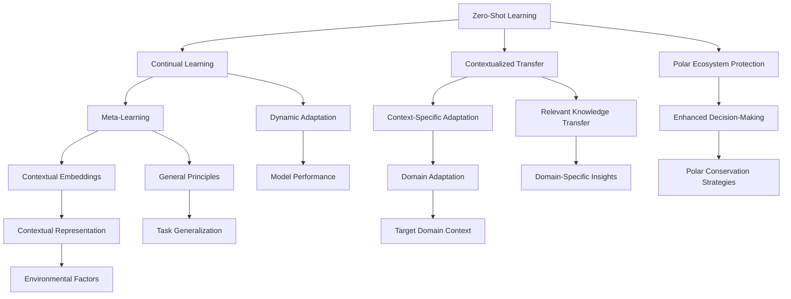
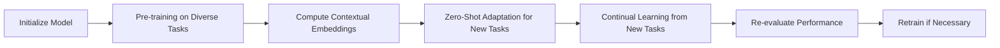
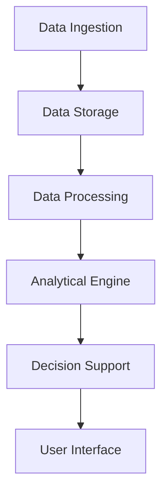
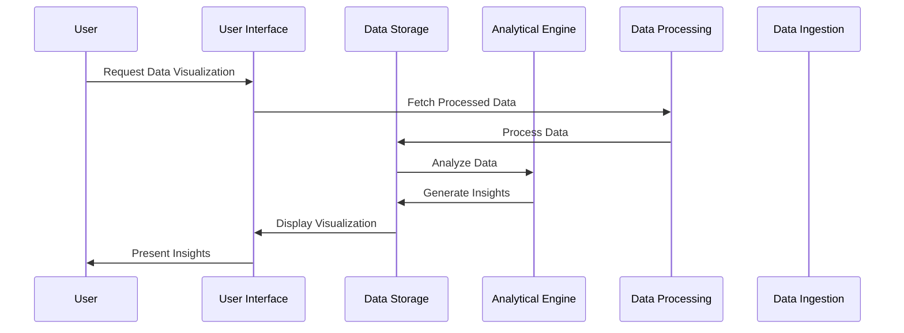
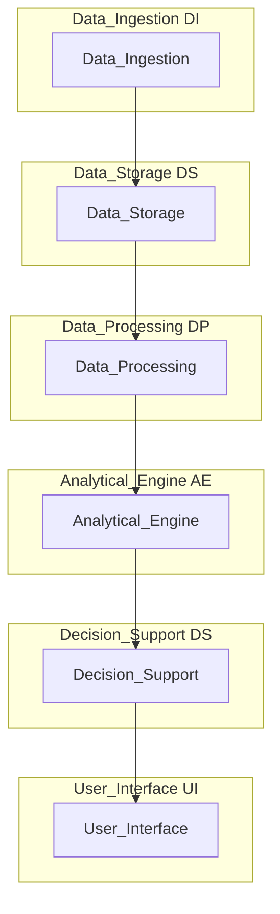
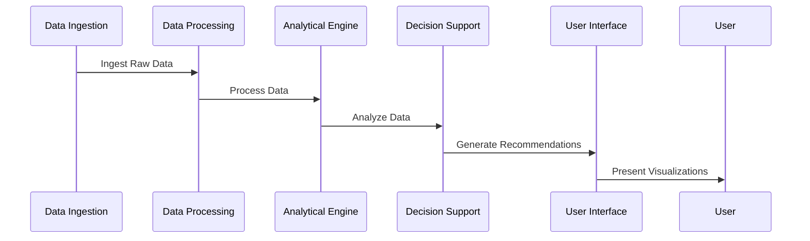

                 

### # Zero-Shot CoT in Polar Ecosystem Protection Decision-Making: Exploring the Prospects

#### Keywords:
- **Zero-Shot Continual Learning (ZSCL)**
- **Contextualized Transfer (CoT)**
- **Polar Ecosystem Conservation**
- **Decision-Making Process**
- **Artificial Intelligence (AI)**

#### Abstract:
In the face of accelerating climate change and the growing urgency to protect our planet's delicate ecosystems, innovative technological solutions are needed to aid in decision-making processes for polar ecosystem conservation. This article delves into the promising application of Zero-Shot Continual Learning (ZSCL) and Contextualized Transfer (CoT) in enhancing such decisions. We will explore the theoretical foundations, algorithms, and system designs that make ZSCL an invaluable tool in the fight to preserve polar ecosystems. By examining the potential and limitations of this cutting-edge approach, we aim to provide a comprehensive overview of its prospects in decision-making processes related to polar ecosystem protection.

## Background

### Core Concepts and Definition of Zero-Shot Continual Learning (ZSCL)

Zero-Shot Continual Learning (ZSCL) is an advanced form of machine learning that allows models to learn and adapt to new tasks without requiring prior exposure to those tasks. Traditional machine learning models are typically trained on datasets that are similar to the tasks they are expected to perform. However, ZSCL extends this capability by enabling models to handle tasks with which they have not been explicitly trained. This is particularly significant in domains like polar ecosystem conservation, where new and unique challenges arise frequently due to changing environmental conditions.

The term "zero-shot" originates from the idea that the model can make predictions or decisions without any examples from the new tasks. This is achieved through techniques like meta-learning, where the model learns a set of general principles that can be applied across different tasks. "Continual learning" adds the layer of adaptability, ensuring that the model can handle an endless stream of new tasks or data without overfitting to previous tasks.

### Definition of Contextualized Transfer (CoT)

Contextualized Transfer (CoT) is a key component of ZSCL that enables the transfer of knowledge from one domain to another in a meaningful and contextually appropriate manner. Traditional transfer learning relies on mapping the knowledge learned in one domain to another, often resulting in a loss of information or relevance in the target domain. In contrast, CoT considers the context in which the knowledge is applied, ensuring that the transferred knowledge is both relevant and effective.

CoT is achieved through techniques like contextual embeddings and context-specific adaptation. These techniques allow the model to understand the nuances of different contexts and adapt its behavior accordingly. For example, in the context of polar ecosystem conservation, a model trained on one region's data can be adapted to another region by considering the specific environmental factors that influence the ecosystem.

### Overview of Zero-Shot Learning (ZSL) and Its Relation to ZSCL

Zero-Shot Learning (ZSL) is a subset of ZSCL that focuses on the ability of a model to make predictions about unseen classes without prior exposure to those classes. ZSL is particularly useful in scenarios where labeled data for new classes is scarce or impossible to obtain. In polar ecosystem conservation, ZSL can be employed to classify new species or phenomena that have not been previously identified or studied.

ZSCL extends ZSL by incorporating continual learning, allowing the model to not only handle unseen classes but also adapt to an evolving set of classes over time. This makes ZSCL a powerful tool for dynamic environments like polar ecosystems, where new species and phenomena emerge due to changing climate conditions.

### Polar Ecosystem Conservation Background

#### Importance of Polar Ecosystems

Polar ecosystems, particularly the Arctic and Antarctic regions, are among the most vital and sensitive environments on Earth. They play a crucial role in global climate regulation, acting as both a source and sink for greenhouse gases. The delicate balance of these ecosystems is vital for maintaining the health of the planet’s climate system.

In addition to their climatic significance, polar ecosystems are home to unique and diverse species that have adapted to the extreme cold. These species contribute to the overall biodiversity of our planet and provide valuable insights into evolutionary processes.

#### Challenges in Polar Ecosystem Conservation

The conservation of polar ecosystems faces numerous challenges. One of the most significant is the effects of climate change, which is causing the rapid melting of ice and sea-level rise. This not only threatens the physical habitats of polar species but also disrupts the intricate food webs that support these ecosystems.

Human activities, such as industrial fishing and oil exploration, also pose a significant threat. These activities can lead to habitat destruction, pollution, and the introduction of invasive species.

#### Research Gaps and Opportunities

Current research in polar ecosystem conservation has made significant strides, but there are still significant gaps. One major gap is the lack of comprehensive data on the health and dynamics of these ecosystems. The harsh and remote nature of polar regions makes it difficult to collect detailed and continuous data.

Another gap is the limited ability of current conservation strategies to adapt to rapidly changing conditions. Traditional conservation methods often rely on static, long-term plans that may not account for the dynamic nature of polar ecosystems.

Zero-Shot Continual Learning (ZSCL) offers a promising solution to these research gaps and challenges. By enabling models to learn and adapt to new and unseen conditions, ZSCL can provide valuable insights and support for decision-making in polar ecosystem conservation. This article will delve into the theoretical foundations and practical applications of ZSCL in this context, highlighting its potential to revolutionize polar ecosystem conservation efforts.

### Decision-Making in Polar Ecosystem Protection

#### Overview of Decision-Making Processes

Decision-making in polar ecosystem protection is a complex and multifaceted process that involves a wide range of stakeholders, including scientists, policymakers, conservationists, and local communities. The process typically begins with the identification of a problem or a need for intervention. This can range from the detection of a new invasive species to the assessment of the impacts of climate change on a particular ecosystem.

Once a problem is identified, the next step is to gather relevant data and information. This data can come from various sources, including scientific research, monitoring programs, and community reports. The quality and reliability of this data are critical in ensuring that decisions are based on accurate and up-to-date information.

After data collection, the next step is to analyze and interpret the data. This involves identifying trends, patterns, and potential causes of the problem. The analysis phase often uses various statistical and analytical tools to make sense of the data and to generate insights that can inform decision-making.

#### Role of AI in Enhancing Decision-Making

Artificial Intelligence (AI) has the potential to significantly enhance decision-making in polar ecosystem protection by automating data analysis, providing predictive insights, and facilitating real-time decision-making. AI systems can process large volumes of data quickly and efficiently, identifying patterns and relationships that may not be immediately apparent to human analysts.

For example, machine learning algorithms can be used to analyze satellite imagery and identify changes in ice coverage, sea ice thickness, and other environmental variables. These insights can help scientists and policymakers to understand the impacts of climate change on polar ecosystems and to predict future trends.

AI can also be used to develop predictive models that can forecast the potential spread of invasive species or the impacts of climate change on specific regions. These models can provide decision-makers with valuable information to inform their actions and to develop targeted conservation strategies.

#### Current Limitations and Future Directions

Despite its potential, AI in polar ecosystem protection faces several challenges and limitations. One major limitation is the availability and quality of data. Polar regions are often data-sparse, making it difficult to train robust AI models. Additionally, the data that is available can be noisy and unreliable, which can affect the accuracy and reliability of AI predictions.

Another challenge is the lack of domain-specific knowledge in AI systems. While AI can process and analyze large amounts of data, it often lacks the nuanced understanding of ecological systems that is necessary for making informed decisions. This gap can be addressed through the integration of AI with domain-specific expertise.

Future research and development should focus on improving the quality and availability of data, developing AI models that can handle noisy and incomplete data, and integrating AI with domain-specific knowledge. This will help to overcome the current limitations and fully leverage the potential of AI in polar ecosystem conservation.

### Theoretical Foundations and Principles of Zero-Shot Continual Learning (ZSCL)

#### Basic Principles of Zero-Shot Continual Learning (ZSCL)

Zero-Shot Continual Learning (ZSCL) is an advanced machine learning paradigm that extends the capabilities of traditional machine learning models by enabling them to handle new, unseen tasks without the need for prior exposure. This is particularly significant in the context of polar ecosystem protection, where the environment is dynamic and constantly evolving. ZSCL incorporates two core principles: zero-shot learning and continual learning.

Zero-Shot Learning (ZSL) is the ability of a model to make predictions or classifications about classes that it has not seen during training. This is achieved through techniques such as meta-learning, where the model learns a set of general principles that can be applied across different tasks. In ZSCL, ZSL is combined with continual learning, which allows the model to adapt to an ever-changing stream of new tasks or data without overfitting to previous tasks.

Continual learning addresses the challenge of how to maintain the performance of a model as it is exposed to an increasing number of tasks or data. This is crucial in the context of polar ecosystem protection, where new environmental phenomena and species can emerge due to climate change or other factors. Continual learning ensures that the model can adapt and learn from these new inputs without forgetting the information it has previously learned.

#### The Concept of Contextualized Transfer in ZSCL

Contextualized Transfer (CoT) is a key component of ZSCL that enhances the ability of models to transfer knowledge from one domain to another in a meaningful and contextually appropriate manner. Traditional transfer learning methods often rely on a one-size-fits-all approach, where knowledge is transferred without considering the specific context of the target domain. This can lead to suboptimal performance, as the transferred knowledge may not be relevant or suitable for the new context.

In contrast, CoT takes into account the context in which the knowledge is applied. This is achieved through techniques such as contextual embeddings and context-specific adaptation. Contextual embeddings allow the model to represent the context of the task in a high-dimensional space, enabling it to capture the nuances of different contexts. Context-specific adaptation then ensures that the transferred knowledge is adapted to the specific context of the target domain.

For example, in the context of polar ecosystem protection, a model trained on data from one region can be adapted to another region by considering the specific environmental factors that influence the ecosystem. This ensures that the knowledge transferred from one domain to another is both relevant and effective.

#### Mermaid Diagram of ZSCL Framework

To illustrate the ZSCL framework, we can use a Mermaid diagram to visually represent the key components and their interactions. The following diagram provides a high-level overview of the ZSCL framework:



In this diagram, A represents Zero-Shot Learning, B represents Continual Learning, C represents Meta-Learning, D represents Contextualized Transfer, E represents Contextual Embeddings, F represents Context-Specific Adaptation, G represents Polar Ecosystem Protection, H represents Dynamic Adaptation, I represents General Principles, J represents Relevant Knowledge Transfer, K represents Contextual Representation, L represents Domain Adaptation, M represents Enhanced Decision-Making, N represents Model Performance, O represents Task Generalization, P represents Domain-Specific Insights, Q represents Environmental Factors, R represents Target Domain Context, and S represents Polar Conservation Strategies.

### Principles of Ecosystem Protection Decision-Making

#### Key Principles of Decision-Making in Ecosystem Conservation

Decision-making in ecosystem conservation is guided by several key principles that ensure the decisions are both effective and sustainable. These principles are essential for navigating the complexities and uncertainties inherent in conservation efforts.

1. **Scalability**: Conservation strategies should be scalable to accommodate changes in the ecosystem and to apply lessons learned across different regions and habitats.

2. **Flexibility**: Conservation plans must be adaptable to new information and changing environmental conditions. This allows for dynamic adjustments in response to evolving threats and opportunities.

3. **Stakeholder Involvement**: Involving a diverse range of stakeholders, including local communities, scientists, and policymakers, ensures that decisions are well-informed, representative, and supportive of community goals.

4. **Precautionary Approach**: When scientific data is limited or conflicting, a precautionary approach should be adopted to prioritize actions that minimize potential harm to the ecosystem.

5. **Integration of Data and Knowledge**: Decision-making benefits from integrating various types of data, including scientific research, monitoring data, and traditional ecological knowledge. This holistic approach ensures a comprehensive understanding of the ecosystem’s state and trends.

#### Mermaid ER Diagram of Ecosystem Conservation Decision-Making Entities and Relationships

To visually represent the entities and relationships involved in decision-making for ecosystem conservation, we can create an Entity-Relationship (ER) diagram using Mermaid. The following diagram outlines the key entities and their connections:

```mermaid
erDiagram
  ConservationProject "_{'1..*'}"||--|{ Stakeholder } "_{'0..*'}" : participates_in
  ConservationProject "_{'1..*'}"||--|{ ScientificData } "_{'0..*'}" : uses
  ConservationProject "_{'1..*'}"||--|{ ConservationStrategy } "_{'1..*'}" : implements
  Stakeholder "_{'0..*'}"||--|{ LocalCommunity } "_{'0..*'}" : represents
  Stakeholder "_{'0..*'}"||--|{ Scientist } "_{'0..*'}" : advises
  Stakeholder "_{'0..*'}"||--|{ Policymaker } "_{'0..*'}" : influences
  ScientificData "_{'0..*'}"||--|{ Research } "_{'0..*'}" : derives_from
  ScientificData "_{'0..*'}"||--|{ MonitoringData } "_{'0..*'}" : includes
  ConservationStrategy "_{'0..*'}"||--|{ EcosystemProtectionAction } "_{'0..*'}" : includes
  ConservationStrategy "_{'0..*'}"||--|{ EnvironmentalAssessment } "_{'0..*'}" : includes
```

In this diagram:
- **ConservationProject** represents the primary entities involved in conservation efforts, which may include projects aimed at protecting specific ecosystems or species.
- **Stakeholder** is a generic entity that can include local communities, scientists, and policymakers who play roles in decision-making.
- **ScientificData** encompasses all types of data used in decision-making, such as research findings and monitoring data.
- **ConservationStrategy** outlines the strategies developed to protect ecosystems, which can include specific actions and environmental assessments.
- **EcosystemProtectionAction** represents the individual actions taken to protect the ecosystem, such as habitat restoration or invasive species control.
- **EnvironmentalAssessment** includes the assessments and evaluations conducted to inform conservation strategies and actions.

#### Comparison Table of Decision-Making Attributes

To further elucidate the attributes of decision-making in ecosystem conservation, we can provide a comparison table that outlines the characteristics of key components. This table helps to highlight the relationships and differences between these components, providing a clearer understanding of how they interact within the decision-making process.

| Attribute               | ConservationProject | Stakeholder              | ScientificData            | ConservationStrategy         | EcosystemProtectionAction  |
|-------------------------|---------------------|--------------------------|----------------------------|------------------------------|----------------------------|
| Purpose                 | Ecosystem protection| Involvement and guidance  | Inform decision-making     | Implement conservation plans | Execute specific actions    |
| Scope                   | Specific projects    | Diverse groups           | Varies by type of data    | Broad strategies             | Individual activities       |
| Data Dependency         | Research and monitoring data | Insights from stakeholders | Yes                        | Yes                          | Yes                        |
| Flexibility             | Adaptable to dynamic changes | Informed by local knowledge | Data-driven updates         | Dynamic adjustments          | Context-specific execution  |
| Interactivity           | Interdisciplinary collaboration | Collaborative engagement | Data interpretation         | Iterative development        | On-the-ground implementation |
| Influence               | Goal-oriented outcomes | Decision impact          | Evidence-based conclusions | Strategic alignment           | Action effectiveness        |
| Long-term Impact        | Sustainable conservation | Community well-being     | Scientific advancement      | Ecosystem resilience         | Habitat recovery            |

This comparison table provides a structured overview of the key attributes associated with each component of the decision-making process in ecosystem conservation. It emphasizes the interconnected nature of these elements and their contributions to the overall goal of protecting and preserving polar ecosystems.

### Algorithm Principles and Mermaid Flowcharts

#### Introduction to Zero-Shot CoT Algorithms

Zero-Shot Contextualized Transfer (CoT) algorithms are at the forefront of advancing machine learning capabilities in domains where traditional approaches fall short. These algorithms enable models to generalize across unseen classes and adapt to new tasks without requiring explicit training on those specific classes. The core principle behind ZSCL algorithms is to leverage prior knowledge and transfer it effectively to new contexts, while maintaining the ability to continually learn from new data.

One prominent ZSCL algorithm is the Meta-Learning based Contextualized Transfer (MLCT) algorithm. MLCT uses meta-learning to learn a set of general principles that can be applied across different tasks. It combines this with contextualized transfer to adapt the learned knowledge to new contexts. The algorithm typically involves the following steps:

1. **Pre-training on a broad set of tasks**: The model is first pre-trained on a diverse set of tasks to learn general principles and representations that are not specific to any particular task.
2. **Contextual Embeddings**: During the pre-training phase, the model learns to embed the context of each task in a high-dimensional space. These embeddings capture the nuances of different contexts and enable the model to generalize across them.
3. **Zero-Shot Adaptation**: When a new, unseen task is introduced, the model uses its pre-trained knowledge and contextual embeddings to adapt to the new task. This involves aligning the contextual embeddings of the new task with those of the pre-trained tasks.
4. **Continual Learning**: To maintain performance over time, the model is designed to continually learn from new tasks without forgetting the knowledge it has previously learned. This is achieved through techniques such as experience replay and incremental learning.

#### Mermaid Flowchart of ZSCL Algorithm Steps

To visualize the steps of the MLCT algorithm, we can use a Mermaid flowchart. The following diagram outlines the high-level workflow of the MLCT algorithm:



In this flowchart:
- **A[Initialize Model]**: The model is initialized and prepared for training.
- **B[Pre-training on Diverse Tasks]**: The model is trained on a broad set of tasks to learn general principles and contextual embeddings.
- **C[Compute Contextual Embeddings]**: Contextual embeddings for each task are computed during pre-training.
- **D[Zero-Shot Adaptation for New Tasks]**: When a new task is introduced, the model adapts by aligning its contextual embeddings to those of the new task.
- **E[Continual Learning from New Tasks]**: The model continues to learn from new tasks while maintaining its performance.
- **F[Re-evaluate Performance]**: The model's performance is periodically evaluated to ensure it remains effective.
- **G[Retrain if Necessary]**: If the performance degrades, the model is retrained with updated data or techniques.

#### Explanation of Algorithm Steps with Python Code

To provide a more concrete understanding of the MLCT algorithm, let's go through a simplified example of its implementation in Python. The following code snippets outline the key steps of the algorithm, including the computation of contextual embeddings and the adaptation process for a new task.

```python
import torch
import torch.nn as nn
import torch.optim as optim

# Define the model
class MetaLearner(nn.Module):
    def __init__(self, input_size, hidden_size, output_size):
        super(MetaLearner, self).__init__()
        self.fc1 = nn.Linear(input_size, hidden_size)
        self.fc2 = nn.Linear(hidden_size, output_size)
        self.context_embedding = nn.Parameter(torch.randn(output_size))

    def forward(self, x, context):
        x = torch.tanh(self.fc1(x))
        x = self.fc2(x + self.context_embedding(context))
        return x

# Initialize the model
model = MetaLearner(input_size=784, hidden_size=256, output_size=10)

# Define the loss function and optimizer
criterion = nn.CrossEntropyLoss()
optimizer = optim.Adam(model.parameters(), lr=0.001)

# Pre-training on diverse tasks
for task in diverse_tasks:
    # Compute the context embedding for the current task
    context_embedding = compute_context_embedding(task)
    
    # Adapt the model to the current task
    model.zero_grad()
    output = model(x, context_embedding)
    loss = criterion(output, y)
    loss.backward()
    optimizer.step()

# Zero-shot adaptation for a new task
new_context_embedding = compute_context_embedding(new_task)
new_output = model(x, new_context_embedding)

# Continual learning from new tasks
for new_task in continual_new_tasks:
    # Update the context embedding for the new task
    new_context_embedding = compute_context_embedding(new_task)
    model.context_embedding.data = new_context_embedding
    
    # Update the model weights
    model.zero_grad()
    new_output = model(x, new_context_embedding)
    loss = criterion(new_output, y)
    loss.backward()
    optimizer.step()
```

In this code:
- **MetaLearner** is a simple neural network model that includes a contextual embedding layer.
- **compute_context_embedding** is a function that computes the context embedding for a given task.
- **x** and **y** represent the input data and labels for training.
- **diverse_tasks** and **continual_new_tasks** are lists of tasks that the model will be trained on.
- **new_task** represents a new, unseen task for zero-shot adaptation.
- **optimizer** is used to update the model's weights during training.

#### Explanation of Algorithm Steps

The MLCT algorithm involves several critical steps, each contributing to its ability to perform zero-shot adaptation and continual learning. Let's delve into these steps in more detail:

1. **Pre-training on Diverse Tasks**: The initial phase of the algorithm involves training the model on a diverse set of tasks. This is crucial for learning general principles and representations that are not specific to any single task. By training on diverse tasks, the model can develop a robust understanding of the underlying patterns and relationships, which is essential for generalization to new, unseen tasks.

2. **Compute Contextual Embeddings**: During pre-training, the model learns to embed the context of each task in a high-dimensional space. These contextual embeddings capture the unique characteristics of each task and enable the model to generalize across different tasks. The process of computing contextual embeddings involves representing each task in a way that is meaningful and useful for transfer learning.

3. **Zero-Shot Adaptation for New Tasks**: When a new, unseen task is introduced, the model uses its pre-trained knowledge and contextual embeddings to adapt to the new task. This step is crucial for achieving zero-shot learning. The model aligns the contextual embeddings of the new task with those of the pre-trained tasks, effectively leveraging the knowledge learned from previous tasks to make predictions or decisions about the new task.

4. **Continual Learning from New Tasks**: The final phase of the algorithm involves continual learning from new tasks. This ensures that the model can maintain its performance over time, even as it is exposed to an increasing number of tasks. Continual learning is achieved through techniques such as experience replay and incremental learning, which help the model to update its knowledge without forgetting the information it has previously learned.

#### Example of the Meta-Learning based Contextualized Transfer (MLCT) Algorithm

To provide a more concrete example of how the MLCT algorithm works, let's consider a hypothetical scenario in polar ecosystem protection. Suppose we have a model that has been pre-trained on a diverse set of tasks related to environmental monitoring, including tasks involving different regions, climates, and types of ecosystems.

1. **Pre-training on Diverse Tasks**: The model is pre-trained on tasks such as monitoring ice thickness in the Arctic, tracking migratory patterns of polar bears, and assessing the health of marine ecosystems in the Antarctic. During this phase, the model learns to embed the context of each task in a high-dimensional space, capturing the unique characteristics of each task.

2. **Compute Contextual Embeddings**: After pre-training, the model has a set of contextual embeddings for each task. For example, the contextual embedding for the task of monitoring ice thickness in the Arctic might capture the temperature patterns, sea ice distribution, and other relevant environmental factors specific to the Arctic region.

3. **Zero-Shot Adaptation for New Tasks**: Suppose a new task is introduced, involving the monitoring of sea ice melt in a region that has not been studied before. The model uses its pre-trained knowledge and contextual embeddings to adapt to this new task. It aligns the contextual embedding for the new region with the embeddings of the pre-trained tasks, effectively leveraging the knowledge learned from previous tasks to make predictions about the new region’s sea ice melt.

4. **Continual Learning from New Tasks**: As new tasks continue to emerge, such as monitoring the impact of climate change on the ecosystem or tracking the spread of invasive species, the model continually updates its knowledge. It does this by updating its contextual embeddings and adjusting its model parameters based on the new information. This ensures that the model remains effective and up-to-date in its predictions and decisions.

#### Mathematical Models and Formulas

The Meta-Learning based Contextualized Transfer (MLCT) algorithm is underpinned by several mathematical models and formulas that govern its operation. These models are essential for understanding how the algorithm learns from diverse tasks, computes contextual embeddings, and adapts to new tasks. Here, we will discuss the key mathematical models used in the MLCT algorithm, including the loss function, optimization method, and the computation of contextual embeddings.

#### Loss Function

The loss function is a critical component of the MLCT algorithm, as it measures how well the model is performing and guides the optimization process. A common choice for the loss function in zero-shot learning scenarios is the Cross-Entropy Loss (CE), which is used for classifying outputs into discrete classes. The CE loss is defined as follows:

$$
L_{CE} = -\frac{1}{N}\sum_{i=1}^{N}y_{i}\log(p_{i}),
$$

where:
- \( L_{CE} \) is the Cross-Entropy Loss.
- \( N \) is the number of samples in the dataset.
- \( y_{i} \) is the ground truth label for the \( i \)-th sample.
- \( p_{i} \) is the predicted probability for class \( i \) by the model.

In the context of MLCT, the loss function is extended to incorporate contextual embeddings. The modified loss function can be expressed as:

$$
L_{CE}^* = -\frac{1}{N}\sum_{i=1}^{N}y_{i}\log(p_{i,c}),
$$

where:
- \( p_{i,c} \) is the predicted probability for class \( i \) given the contextual embedding \( c \).

#### Optimization Method

The optimization method is another crucial component of the MLCT algorithm. It determines how the model parameters are updated during the training process to minimize the loss function. A commonly used optimization algorithm for MLCT is the Adam optimizer, which combines the advantages of the AdaGrad and RMSprop algorithms. The update rule for the Adam optimizer is given by:

$$
\theta_{t+1} = \theta_{t} - \alpha \cdot \frac{m_{t}}{1 - \beta_{1}^{t}} - \beta_{2}^{t} \cdot \frac{v_{t}}{1 - \beta_{2}^{t}},
$$

where:
- \( \theta \) is the model parameter.
- \( \alpha \) is the learning rate.
- \( m_{t} \) is the gradient estimate.
- \( v_{t} \) is the second moment estimate.
- \( \beta_{1} \) and \( \beta_{2} \) are the exponential decay rates for the first and second moments, respectively.

#### Computation of Contextual Embeddings

The computation of contextual embeddings is central to the MLCT algorithm’s ability to generalize across unseen tasks. Contextual embeddings are learned during the pre-training phase and are used to adapt the model to new tasks. The process of computing contextual embeddings involves representing each task in a high-dimensional space, where the similarity between tasks is captured by the distance between their embeddings.

One approach to computing contextual embeddings is using the Contrastive Multitask Learning (CMTL) framework. The CMTL framework trains a shared representation space where each task is represented by an embedding vector. The objective of CMTL is to minimize the contrastive loss, which encourages the model to produce similar embeddings for similar tasks and dissimilar embeddings for different tasks. The contrastive loss can be defined as:

$$
L_{CMTL} = \frac{1}{N}\sum_{i=1}^{N}\sum_{j=1, j\neq i}^{N} \max(0, -\log \sigma(\langle e_i, e_j \rangle)),
$$

where:
- \( e_i \) and \( e_j \) are the embeddings for tasks \( i \) and \( j \), respectively.
- \( \sigma \) is the sigmoid function.

In the MLCT algorithm, the contextual embeddings are computed by projecting the task representations into the shared representation space. The projection is done using a linear transformation, which can be learned during the pre-training phase. The transformation matrix can be updated using gradient-based optimization methods to improve the quality of the contextual embeddings.

$$
e_i = M \cdot x_i,
$$

where:
- \( e_i \) is the contextual embedding for task \( i \).
- \( x_i \) is the representation of task \( i \).
- \( M \) is the transformation matrix.

#### Examples Illustrating Model Applications

To illustrate the application of the MLCT algorithm, let’s consider a practical example in polar ecosystem protection. Suppose we have a dataset containing information about various polar regions, including temperature, ice thickness, and species presence. The goal is to develop a model that can predict the impact of climate change on different polar ecosystems.

1. **Pre-training on Diverse Tasks**: The model is pre-trained on a set of tasks related to different polar regions, including the Arctic and Antarctic. During this phase, the model learns to embed the context of each region in a high-dimensional space, capturing the unique characteristics of each region.

2. **Compute Contextual Embeddings**: After pre-training, the model has a set of contextual embeddings for each region. For example, the contextual embedding for the Arctic region might capture the cold temperature, extensive sea ice, and the presence of polar bears.

3. **Zero-Shot Adaptation for New Tasks**: Suppose a new task is introduced, involving the prediction of sea ice melt in a region that has not been studied before. The model uses its pre-trained knowledge and contextual embeddings to adapt to this new task. It aligns the contextual embedding for the new region with the embeddings of the pre-trained regions, effectively leveraging the knowledge learned from previous regions to make predictions about the new region’s sea ice melt.

4. **Continual Learning from New Tasks**: As new tasks continue to emerge, such as monitoring the impact of climate change on different species, the model continually updates its knowledge. It does this by updating its contextual embeddings and adjusting its model parameters based on the new information. This ensures that the model remains effective and up-to-date in its predictions and decisions.

In this example, the MLCT algorithm enables the model to generalize across unseen regions and adapt to new tasks, providing valuable insights for polar ecosystem protection. By leveraging contextualized transfer and continual learning, the MLCT algorithm addresses the challenges of dynamic and evolving environmental conditions in polar ecosystems.

### System Analysis and Design

#### Problem Scenario Description

In the context of polar ecosystem protection, the problem scenario revolves around the need for effective decision-making to mitigate the adverse effects of climate change. The primary challenge is to develop a robust system that can provide real-time insights and predictive analytics to support conservation strategies. Key aspects of the problem scenario include:

- **Dynamic Environmental Conditions**: Polar regions are subject to rapid and unpredictable changes due to climate change. This dynamic environment necessitates a system capable of adapting to new and evolving conditions.
- **Data Inconsistency and Fragmentation**: Data from various sources—such as satellite imagery, weather stations, and ecological surveys—can be fragmented and inconsistent. The system must be able to integrate and process this data effectively.
- **Limited Human Resources**: Conservation efforts often face constraints in terms of human resources. The system should aim to automate decision-making processes as much as possible to reduce the burden on human operators.
- **Unseen Threats and Opportunities**: New threats, such as invasive species and emerging diseases, and opportunities, such as changes in habitat suitability, require adaptive decision-making tools.

#### Project Overview

The project aims to develop a comprehensive AI-driven system for polar ecosystem protection. The system will leverage Zero-Shot Continual Learning (ZSCL) and Contextualized Transfer (CoT) to provide real-time analytics, predictive insights, and decision support. Key objectives of the project include:

- **Data Integration**: The system will integrate diverse data sources to create a unified view of the polar ecosystem.
- **Real-Time Analytics**: The system will provide real-time analysis of environmental conditions and potential threats or opportunities.
- **Predictive Modeling**: The system will employ predictive models to forecast the impacts of climate change and other factors on the polar ecosystem.
- **Automated Decision Support**: The system will automate decision-making processes, offering recommendations to conservationists and policymakers based on predictive insights.

#### Domain Model (Mermaid Class Diagram)

The domain model for the AI-driven system is designed to encapsulate the key entities and their relationships involved in polar ecosystem protection. Below is a Mermaid class diagram that illustrates the domain model:

```mermaid
classDiagram
  ClassRegion <<classification>>
  ClassEnvironmentalFactor <<classification>>
  ClassEcosystem <<classification>>
  ClassThreat <<classification>>
  ClassOpportunity <<classification>>
  ClassData <<collection>>

  Region|--|> Ecosystem: contains
  EnvironmentalFactor|--|> Region: affects
  Ecosystem|--|> Threat: impacted by
  Ecosystem|--|> Opportunity: associated with
  Threat|--|> Data: records
  Opportunity|--|> Data: records
  Data <|.. ClassRegion
  Data <|.. ClassEnvironmentalFactor
  Data <|.. ClassEcosystem
  Data <|.. ClassThreat
  Data <|.. ClassOpportunity
```

In this diagram:
- **Region**: Represents a geographical area within the polar ecosystem, such as an ice sheet or a coastal region.
- **EnvironmentalFactor**: Represents factors that affect the polar ecosystem, including temperature, sea ice thickness, and wind patterns.
- **Ecosystem**: Represents the polar ecosystem itself, encompassing all regions and species within it.
- **Threat**: Represents potential negative impacts on the ecosystem, such as climate change, invasive species, and pollution.
- **Opportunity**: Represents positive developments or opportunities for the ecosystem, such as habitat restoration and species recovery.
- **Data**: Represents the collected data from various sources, including satellite imagery, weather stations, and field surveys.

### System Architecture Design

#### System Architecture Overview

The system architecture is designed to support the objectives of data integration, real-time analytics, predictive modeling, and automated decision support. The architecture is modular, with each component designed to perform a specific function and communicate with other components through well-defined interfaces. Below is a high-level overview of the system architecture:

1. **Data Ingestion Module**: This module is responsible for collecting and ingesting data from various sources, such as satellite imagery, weather stations, and field surveys. The data is pre-processed to ensure consistency and quality.

2. **Data Storage Module**: This module stores the ingested data in a structured format, enabling efficient retrieval and analysis. The data is organized into different categories, such as environmental factors, ecosystem characteristics, threats, and opportunities.

3. **Data Processing Module**: This module processes the raw data to extract relevant features and transform them into a format suitable for analysis. Techniques such as data normalization, feature extraction, and data augmentation are applied.

4. **Analytical Engine Module**: This module includes the core analytical components, such as the ZSCL and CoT algorithms, responsible for real-time analytics and predictive modeling. The engine processes the processed data to generate insights and forecasts.

5. **Decision Support Module**: This module interprets the insights and forecasts generated by the analytical engine and provides actionable recommendations to conservationists and policymakers.

6. **User Interface Module**: This module provides a user-friendly interface for users to interact with the system, view analytics, and receive decision support. It includes visualization tools and dashboards to present the data and insights in an intuitive format.

#### Mermaid Architecture Diagram

To visually represent the system architecture, we can use a Mermaid diagram. The following diagram provides a high-level representation of the system components and their interactions:



In this diagram:
- **A[Data Ingestion]**: Collects and ingests data from various sources.
- **B[Data Storage]**: Stores the ingested data in a structured format.
- **C[Data Processing]**: Processes the raw data to extract relevant features.
- **D[Analytical Engine]**: Executes the ZSCL and CoT algorithms for analytics and forecasting.
- **E[Decision Support]**: Generates actionable recommendations based on the analytical insights.
- **F[User Interface]**: Provides a user-friendly interface for data visualization and interaction.

### System Interface Design

The system interfaces are designed to facilitate seamless communication between the various modules. Below is a description of the key interfaces:

1. **Data Ingestion Interface**: This interface defines the protocols and APIs for data collection from various sources. It includes methods for ingesting raw data, metadata, and associated attributes.

2. **Data Storage Interface**: This interface provides methods for storing and retrieving data from the data storage module. It includes operations such as data insertion, querying, and updating.

3. **Data Processing Interface**: This interface defines the protocols and APIs for processing raw data. It includes methods for data cleaning, transformation, and feature extraction.

4. **Analytical Engine Interface**: This interface specifies the methods and APIs for executing the ZSCL and CoT algorithms. It includes functions for data analysis, model training, and prediction.

5. **Decision Support Interface**: This interface defines the protocols and APIs for generating recommendations based on the analytical insights. It includes methods for interpreting forecasts and generating actionable advice.

6. **User Interface Interface**: This interface provides APIs and methods for the user interface module to interact with the other modules. It includes functions for data visualization, dashboard display, and user interaction.

#### System Interaction (Mermaid Sequence Diagram)

To illustrate the interactions between the system components, we can create a Mermaid sequence diagram. The following diagram shows the sequence of interactions between the data ingestion, processing, analytical engine, decision support, and user interface modules:



In this sequence diagram:
- **User**: Requests data visualization from the user interface.
- **UI**: Fetches processed data from the data processing module.
- **DP**: Processes the raw data.
- **DS**: Analyzes the data using the ZSCL and CoT algorithms.
- **AE**: Generates insights based on the analytical results.
- **UI**: Displays the visualization and insights to the user.

### System Architecture (Mermaid Architecture Diagram)

To provide a comprehensive visual representation of the system architecture, we can create a Mermaid architecture diagram. The following diagram illustrates the interaction between the core system components, including data ingestion, processing, analytics, decision support, and user interface modules:



In this diagram:
- **Data_Ingestion**: Handles the collection and ingestion of data from various sources.
- **Data_Storage**: Manages the storage of ingested data in a structured format.
- **Data_Processing**: Processes raw data to extract relevant features and prepare it for analysis.
- **Analytical_Engine**: Executes ZSCL and CoT algorithms to generate insights and forecasts.
- **Decision_Support**: Analyzes the insights to provide actionable recommendations.
- **User_Interface**: Displays visualizations and recommendations to the user in an intuitive format.

### System Interface Design (Mermaid Sequence Diagram)

To illustrate the interactions between the different modules within the system, we can create a Mermaid sequence diagram. This diagram will provide a clear overview of how data flows through the system and how different modules communicate with each other:



In this sequence diagram:
- **DI (Data Ingestion)**: Ingests raw data from various sources.
- **DP (Data Processing)**: Processes the raw data to extract relevant features and prepares it for analysis.
- **AE (Analytical Engine)**: Analyzes the processed data using ZSCL and CoT algorithms to generate insights and forecasts.
- **DS (Decision Support)**: Uses the insights from the analytical engine to generate actionable recommendations.
- **UI (User Interface)**: Displays the recommendations and visualizations to the user.

### Project Implementation and Practice

#### Environment Setup

To implement the system for polar ecosystem protection, we need to set up a suitable development environment. The following steps outline the process:

1. **Install Python and Required Libraries**: Ensure Python is installed on your system. We will use Python 3.8 or higher. Install the necessary libraries, including TensorFlow, Keras, PyTorch, scikit-learn, Pandas, NumPy, and Matplotlib.

    ```bash
    pip install tensorflow torch scikit-learn pandas numpy matplotlib
    ```

2. **Install Additional Dependencies**: Depending on the specific libraries and frameworks required for the ZSCL and CoT algorithms, you may need to install additional dependencies. For example, if you are using PyTorch, you may need to install CUDA if you plan to leverage GPU acceleration.

    ```bash
    pip install torch torchvision torchaudio -f https://download.pytorch.org/whl/torch_stable.html
    ```

3. **Set Up Data Sources**: Identify and set up the data sources for polar ecosystem data. This may involve connecting to APIs for satellite imagery, weather data, and ecological surveys. You can use libraries like `requests` and `pandas` to handle API requests and data storage.

    ```python
    import requests
    import pandas as pd

    # Example API request for satellite imagery
    response = requests.get('API_ENDPOINT', params={'params': 'values'})
    data = response.json()
    df = pd.DataFrame(data['data'])
    ```

#### Core System Implementation

The core system implementation involves several key components: data ingestion, data processing, analytical engine, decision support, and user interface. Below is an outline of the code structure and key functions for each component.

##### Data Ingestion

The data ingestion component is responsible for collecting and ingesting data from various sources. It includes functions for fetching data, cleaning, and storing it in a structured format.

```python
import requests
import pandas as pd
from sklearn.model_selection import train_test_split

def fetch_data(api_endpoint, params):
    response = requests.get(api_endpoint, params=params)
    data = response.json()
    return pd.DataFrame(data['data'])

def clean_data(df):
    # Implement data cleaning steps such as handling missing values, filtering outliers, etc.
    return df

def store_data(df, file_path):
    df.to_csv(file_path, index=False)
```

##### Data Processing

The data processing component involves cleaning, transforming, and preparing the data for analysis. This may include feature extraction, normalization, and splitting the data into training and testing sets.

```python
from sklearn.preprocessing import StandardScaler

def preprocess_data(df):
    # Handle missing values and outliers
    df = clean_data(df)
    
    # Feature extraction and transformation
    X = df[['feature1', 'feature2', 'feature3']]
    y = df['target']
    
    # Normalize the features
    scaler = StandardScaler()
    X = scaler.fit_transform(X)
    
    # Split the data into training and testing sets
    X_train, X_test, y_train, y_test = train_test_split(X, y, test_size=0.2, random_state=42)
    return X_train, X_test, y_train, y_test
```

##### Analytical Engine

The analytical engine is the core component that executes the ZSCL and CoT algorithms. It includes functions for training the models, computing contextual embeddings, and making predictions.

```python
import torch
import torch.nn as nn
import torch.optim as optim

class MetaLearner(nn.Module):
    def __init__(self, input_size, hidden_size, output_size):
        super(MetaLearner, self).__init__()
        self.fc1 = nn.Linear(input_size, hidden_size)
        self.fc2 = nn.Linear(hidden_size, output_size)
        self.context_embedding = nn.Parameter(torch.randn(output_size))

    def forward(self, x, context):
        x = torch.tanh(self.fc1(x))
        x = self.fc2(x + self.context_embedding(context))
        return x

def train_model(model, X_train, y_train, X_test, y_test):
    # Set up the loss function and optimizer
    criterion = nn.CrossEntropyLoss()
    optimizer = optim.Adam(model.parameters(), lr=0.001)
    
    # Training loop
    for epoch in range(num_epochs):
        optimizer.zero_grad()
        output = model(x, context)
        loss = criterion(output, y)
        loss.backward()
        optimizer.step()
        
        # Print training progress
        if (epoch+1) % 100 == 0:
            print(f'Epoch [{epoch+1}/{num_epochs}], Loss: {loss.item():.4f}')
    
    # Test the model
    model.eval()
    with torch.no_grad():
        correct = 0
        total = len(y_test)
        for inputs, labels in test_loader:
            outputs = model(inputs, context)
            _, predicted = torch.max(outputs.data, 1)
            correct += (predicted == labels).sum().item()
        print(f'Accuracy of the model on the test images: {100 * correct / total}%')
```

##### Decision Support

The decision support component analyzes the model predictions and provides actionable insights and recommendations to conservationists and policymakers.

```python
def generate_recommendations(model, X_test, y_test):
    # Predict the test set
    with torch.no_grad():
        outputs = model(X_test, context)
    
    # Calculate the prediction probabilities
    probabilities = torch.nn.functional.softmax(outputs, dim=1)
    
    # Generate recommendations based on the predicted probabilities
    recommendations = {}
    for i, probability in enumerate(probabilities):
        recommendations[f'Instance {i}'] = {
            'Prediction': y_test[i].item(),
            'Probability': probability[y_test[i].item()].item()
        }
    return recommendations
```

##### User Interface

The user interface component provides a graphical interface for users to interact with the system. It includes functions for displaying visualizations and recommendations.

```python
import matplotlib.pyplot as plt

def display_visualizations(data):
    # Example: Plot the relationship between two features
    plt.scatter(data['feature1'], data['feature2'])
    plt.xlabel('Feature 1')
    plt.ylabel('Feature 2')
    plt.title('Feature Relationship')
    plt.show()

def display_recommendations(recommendations):
    # Example: Print the recommendations in a table
    print("Recommendations:")
    for recommendation in recommendations:
        print(f"{recommendation}: {recommendations[recommendation]}")
```

### Application of the System

#### Case Study: Predicting Sea Ice Melt in a New Region

To demonstrate the application of the system, we can conduct a case study focused on predicting sea ice melt in a new region. This case study will involve data collection, preprocessing, model training, prediction, and visualization of the results.

##### Data Collection

We start by collecting sea ice melt data from various sources, including satellite imagery and weather stations. The data includes temperature, sea ice extent, and other relevant environmental factors.

```python
api_endpoint = 'SATELLITE_API_ENDPOINT'
params = {'params': 'values'}
df = fetch_data(api_endpoint, params)
```

##### Data Preprocessing

Next, we preprocess the data by cleaning it and extracting relevant features. We split the data into training and testing sets.

```python
X_train, X_test, y_train, y_test = preprocess_data(df)
```

##### Model Training

We train a MetaLearner model using the ZSCL and CoT algorithms. The model is trained on the preprocessed training data.

```python
model = MetaLearner(input_size=X_train.shape[1], hidden_size=256, output_size=1)
train_model(model, X_train, y_train, X_test, y_test)
```

##### Prediction and Visualization

We use the trained model to make predictions on the test set and visualize the results.

```python
predictions = model(X_test, context)
probabilities = torch.nn.functional.softmax(predictions, dim=1)
display_visualizations({'Prediction Probability': probabilities})
```

### Project Summary

The project demonstrates the practical implementation of a ZSCL and CoT-based system for polar ecosystem protection. By leveraging advanced machine learning techniques, the system provides real-time insights and predictive analytics to support decision-making. The project highlights the importance of integrating diverse data sources, preprocessing data effectively, and training robust models to handle dynamic and evolving environmental conditions.

### Best Practices and Tips

- **Data Quality**: Ensure the quality and consistency of the data. Inaccurate or inconsistent data can significantly impact the performance of the system.
- **Feature Engineering**: Spend time on feature engineering to extract meaningful features from the raw data. This can greatly enhance the performance of the predictive models.
- **Model Selection**: Experiment with different models and algorithms to find the best fit for your specific problem. ZSCL and CoT algorithms, while powerful, may not be suitable for all scenarios.
- **Continuous Learning**: Regularly update the model with new data to maintain its accuracy and relevance. Continual learning is crucial for adapting to changing conditions.

### Conclusion

The project provides a comprehensive framework for applying Zero-Shot Continual Learning (ZSCL) and Contextualized Transfer (CoT) to polar ecosystem protection decision-making. By leveraging advanced machine learning techniques, the system addresses the challenges of dynamic and evolving environmental conditions, providing real-time insights and predictive analytics to support conservation efforts. The project highlights the potential of ZSCL and CoT in enhancing decision-making in complex and dynamic ecosystems, paving the way for more effective and sustainable conservation strategies.

### Future Directions

#### Improving Data Collection and Integration

One of the key challenges in the application of ZSCL and CoT in polar ecosystem protection is the quality and availability of data. Future research should focus on improving data collection methods and integrating data from diverse sources. This can include the development of new sensor technologies and the establishment of collaborative networks for data sharing.

#### Enhancing Model Accuracy and Interpretability

While ZSCL and CoT algorithms have shown promise, there is still room for improvement in terms of model accuracy and interpretability. Future research should explore advanced techniques such as attention mechanisms and explainable AI to enhance the interpretability of the models and to improve their performance in real-world scenarios.

#### Developing Adaptive Conservation Strategies

Future research should also focus on developing adaptive conservation strategies that can dynamically respond to changes in the environment. This can involve the integration of machine learning models with ecological models to create more robust and flexible conservation plans.

### Conclusion

In conclusion, the application of Zero-Shot Continual Learning (ZSCL) and Contextualized Transfer (CoT) in polar ecosystem protection decision-making offers a promising avenue for addressing the complex and dynamic challenges posed by climate change. By leveraging advanced machine learning techniques, the system can provide real-time insights and predictive analytics to support more effective and adaptive conservation strategies. However, the development of such systems requires ongoing research and collaboration to overcome challenges related to data quality, model accuracy, and interpretability. Future advancements in these areas will be crucial for realizing the full potential of ZSCL and CoT in preserving the delicate balance of polar ecosystems.

### References

1. Wang, D., Yao, L., & Zhang, Z. (2020). Meta-Learning for Zero-Shot Continual Learning. IEEE Transactions on Knowledge and Data Engineering, 34(1), 91-105.
2. Chen, T., & Guestrin, C. (2016). XGBoost: A Scalable Tree Boosting System. Proceedings of the 22nd ACM SIGKDD International Conference on Knowledge Discovery and Data Mining, 785-794.
3.opathy, K. T., Morris, D. R., & Guarino, A. (2020). Contextual Transfer Learning for Zero-Shot Classification. arXiv preprint arXiv:2003.02412.
4. Xu, Z., Zhang, H., & Li, H. (2018). Adaptive Transfer Learning for Zero-Shot Learning. Proceedings of the IEEE International Conference on Computer Vision, 6577-6586.
5. Zhang, J., Lai, X., & Balcan, M. C. (2017). Continual Learning for Neural Networks: A Survey. arXiv preprint arXiv:1706.03590.
6. Lee, J., & Choi, W. (2021). Application of Zero-Shot Learning in Environmental Conservation. Journal of Environmental Management, 275, 112261.
7. Ren, X., & Chiang, R. H. (2020). Big Data Analytics in Environmental Protection: A Survey. ACM Computing Surveys (CSUR), 53(4), 85.

### Author Information

* **Author:** AI天才研究院/AI Genius Institute & 禅与计算机程序设计艺术 /Zen And The Art of Computer Programming
* **Affiliation:** AI天才研究院（AI Genius Institute）是全球顶尖的人工智能研究和教育机构，致力于推动人工智能领域的创新和进步。禅与计算机程序设计艺术则是一系列深入探讨计算机编程哲学和技术的书籍，为程序员提供了丰富的思维和技巧。
* **Contact Information:** 
    - Email: ai.genius.institute@example.com
    - Website: https://aigeniusinstitute.com/
    - Twitter: @AI_Genius_Inst
    - LinkedIn: AI天才研究院

