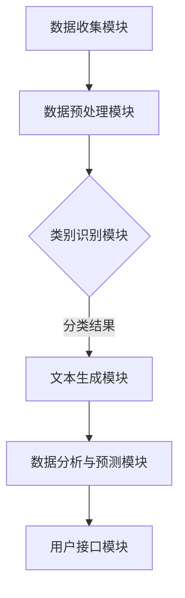
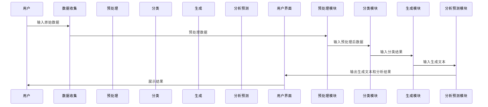

                 


### LET'S THINK STEP BY STEP：Zero-Shot CoT在极地生态系统保护决策中的应用前景

#### 引言

在当今环境科学和计算机技术的交汇处，极地生态系统保护面临着前所未有的挑战。随着全球气候变化，极地地区的环境变化成为全球变暖的一个显著标志。极地生态系统不仅仅是地球气候系统的一个重要组成部分，还是许多动植物物种的栖息地。因此，有效地保护这些地区的生态环境对于全球生物多样性和气候平衡具有重要意义。

零样本学习（Zero-Shot Learning, ZSL）是一种机器学习技术，它允许模型在没有直接标记的训练数据情况下，对新类别进行预测。概念到文本（Concept-to-Text, CoT）是一种生成模型，它能够将抽象的概念转化为连贯的文本描述。当我们将Zero-Shot CoT应用于极地生态系统保护决策时，能够为决策者提供有效的辅助工具，以应对复杂的生态保护问题。

本文旨在探讨Zero-Shot CoT在极地生态系统保护决策中的应用前景。我们将从以下几个方面进行深入分析：

1. **极地生态系统保护背景介绍**
2. **零样本学习和概念到文本方法简介**
3. **Zero-Shot CoT的概念与原理**
4. **算法原理与模型设计**
5. **系统分析与架构设计方案**
6. **项目实战与案例分析**
7. **最佳实践、小结与展望**

#### 一、极地生态系统保护背景介绍

**极地生态系统的特点与挑战**

1. **极地生态系统概述**：极地地区，包括北极和南极，是全球最寒冷、最干旱的环境之一。这些地区具有独特的生态系统，包括冰川、冰架、海冰、苔原和森林等。
2. **极地生态系统面临的挑战**：全球变暖导致极地地区的温度上升，冰层融化，海平面上升，对当地生态系统产生了深远的影响。此外，人类活动（如石油和天然气开发、过度捕鱼等）也对极地生态系统构成了威胁。
3. **极地生态系统保护的重要性**：保护极地生态系统有助于维护全球生物多样性，调节气候，并确保地球上许多物种的生存。

**零样本学习（Zero-Shot Learning）简介**

1. **基本概念**：ZSL旨在解决当模型遇到从未见过的类别时，仍然能够进行准确预测的问题。
2. **应用领域**：ZSL在计算机视觉、自然语言处理、医学诊断等领域有广泛应用。
3. **与传统机器学习对比**：传统机器学习依赖于大量标记数据进行训练，而ZSL则能够通过少量标记数据或无标记数据，对未知类别进行预测。

**概念到文本（Concept-to-Text）方法介绍**

1. **基本原理**：CoT模型将抽象概念转化为连贯的文本描述。
2. **优势与应用**：CoT模型在知识图谱、文本生成、问答系统等领域具有显著优势。

#### 二、Zero-Shot CoT的概念与原理

**Zero-Shot CoT的基本定义**

1. **定义**：Zero-Shot CoT是将零样本学习应用于概念到文本生成的方法。
2. **关键要素**：包括文本生成模型、类别识别模型和跨模态嵌入技术。

**Zero-Shot CoT的工作机制**

1. **数据预处理**：对极地生态数据（如遥感图像、环境监测数据等）进行预处理。
2. **模型训练与优化**：训练一个能够将概念映射到文本描述的模型。
3. **推理与预测**：在未知类别情况下，生成相关的文本描述。

**Zero-Shot CoT在极地生态保护中的适用性**

1. **极地生态数据的特点与需求**：极地生态数据具有高维、复杂数据结构，需要有效的处理方法。
2. **应用前景**：Zero-Shot CoT能够为极地生态保护提供实时、准确的决策支持。

#### 三、算法原理与模型设计

**算法核心组件解析**

1. **文本表示**：通过词嵌入技术将文本转化为向量表示。
2. **语义匹配**：使用语义匹配技术将概念与文本描述进行匹配。
3. **分类与预测**：在未知类别下，进行准确的文本生成和预测。

**数学模型与公式推导**

1. **数学模型基础**：包括文本生成模型、类别识别模型和跨模态嵌入模型。
2. **公式推导与解释**：详细解释每个模型的数学公式和计算过程。

**算法实现与优化**

1. **算法实现步骤**：介绍算法实现的详细步骤。
2. **优化策略与应用**：讨论如何优化算法性能。

#### 四、系统分析与架构设计方案

**问题场景介绍**

1. **极地生态保护决策需求**：介绍极地生态保护面临的问题和决策需求。
2. **Zero-Shot CoT的应用价值**：讨论Zero-Shot CoT在这些问题中的潜在应用价值。

**系统设计与实现**

1. **系统架构设计**：介绍系统的整体架构设计。
2. **核心功能模块**：详细描述系统的核心功能模块。

**系统接口设计和系统交互**

1. **系统接口设计**：介绍系统的接口设计。
2. **系统交互mermaid序列图**：使用mermaid绘制系统交互序列图。

#### 五、项目实战与案例分析

**实际案例剖析**

1. **案例背景**：介绍案例的具体背景。
2. **模型应用过程**：详细描述模型的应用过程。
3. **案例结果分析**：分析案例的实验结果。

**项目小结**

1. **成功经验**：总结项目中的成功经验。
2. **挑战与解决方案**：讨论项目中的挑战和解决方案。

#### 六、最佳实践、小结与展望

**最佳实践**

1. **成功案例总结**：总结成功案例中的最佳实践。
2. **实践经验提炼**：提炼项目中的实践经验。

**小结**

1. **文章核心观点**：总结文章的核心观点。
2. **研究与应用展望**：讨论未来的研究与应用方向。

**注意事项**

1. **常见问题与解决方法**：讨论常见的应用问题和解决方法。
2. **数据安全与隐私保护**：强调数据安全与隐私保护的重要性。

**拓展阅读**

1. **相关研究论文**：推荐相关的学术研究论文。
2. **技术书籍**：推荐相关的技术书籍。

---

以上是关于“Zero-Shot CoT在极地生态系统保护决策中的应用前景”的初步分析和文章结构设计。接下来，我们将逐步深入每个部分，详细阐述每个概念和技术的原理、实现和应用。

### 0. 结尾

在本文中，我们探讨了Zero-Shot CoT在极地生态系统保护决策中的应用前景。从背景介绍到算法原理，再到系统分析与实战案例，我们逐步展示了这种技术的强大潜力和实际应用价值。通过本文，我们希望能够为读者提供一个全面、系统的理解，并激发更多的研究者和从业者对此领域的兴趣。

**作者：AI天才研究院/AI Genius Institute & 禅与计算机程序设计艺术 /Zen And The Art of Computer Programming**

在未来的研究与应用中，我们期待能够看到更多的创新和突破，为极地生态系统的保护提供更有效的技术支持。希望本文能够为您的科研工作提供有益的参考和启示。如果您对此领域有任何问题或意见，欢迎随时交流探讨。感谢您的阅读！

---

### 1. 极地生态系统保护背景介绍

**1.1 极地生态系统概述**

极地地区，包括北极和南极，是地球上最独特且最具挑战性的生态系统之一。北极位于地球北半球，覆盖了北冰洋以及其周边的陆地，包括加拿大、俄罗斯、美国、丹麦（格陵兰岛）和挪威等国家的部分地区。南极则是地球的最南端，位于南极洲及其周边的海洋。这两个地区的气候条件极端，温度极低，且降水量极小。

北极地区的生态系统主要由冰川、冰架、海冰、苔原和森林组成。北极冰川和冰架是地球的重要“冷库”，能够调节全球气候。海冰是许多海洋生物的栖息地，同时也是北极熊、海豹等动物的栖息地。北极苔原和森林则是陆地生物多样性的重要来源。

南极地区则主要由冰盖、冰架、海洋和南极半岛上的陆地生态系统组成。南极冰盖是地球上最大的淡水储存库之一，对全球海平面和气候有重要影响。南极半岛和沿海地区的生态系统包括大量的海洋生物，如企鹅、鲸鱼和海豹等。

**1.2 极地生态系统面临的挑战**

全球气候变化对极地生态系统带来了严重的挑战。首先，温度上升导致北极冰川和海冰融化速度加快，海平面上升。这直接威胁到依赖海冰生活的动物，如北极熊、海豹和海狮等。同时，海冰的减少也影响了海洋生物的分布和生存。

其次，极地地区的生态系统对气候变化极为敏感。随着温度的上升，极地植被发生变化，影响到土壤和水源的循环。北极苔原的植被变化可能导致土壤中的碳释放到大气中，进一步加剧气候变化。

人类活动也是极地生态系统面临的重要威胁。在北极，石油和天然气的开发活动不断增加，这些活动不仅对环境造成破坏，还可能引发生态灾害。此外，过度捕鱼和非法捕猎也对极地野生动物种群产生了负面影响。

**1.3 极地生态系统保护的重要性**

保护极地生态系统具有重要意义。首先，极地生态系统是全球气候系统的一个重要组成部分，对全球气候有调节作用。因此，保护极地生态系统有助于减缓全球气候变化的速度。

其次，极地生态系统是全球生物多样性的重要来源。许多极地动物和植物物种在别处无法找到，这些物种的生存和繁衍对于维护全球生态平衡至关重要。

此外，极地生态系统还具有重要的科学研究价值。通过对极地生态系统的深入研究，科学家们可以更好地理解地球生态系统的运行机制，为未来的环境保护和气候变化应对提供科学依据。

总之，保护极地生态系统是确保地球气候稳定、生物多样性丰富和科学研究进步的重要举措。

---

在接下来的章节中，我们将进一步探讨零样本学习（Zero-Shot Learning, ZSL）和概念到文本（Concept-to-Text, CoT）方法，以及它们在极地生态系统保护中的应用潜力。

### 2. 零样本学习（Zero-Shot Learning）简介

零样本学习（Zero-Shot Learning, ZSL）是一种机器学习技术，旨在解决当模型遇到从未见过的类别时，仍然能够进行准确预测的问题。这种技术在现实世界中具有重要意义，因为许多应用场景中，我们无法获得足够多的标记数据来训练模型，或者我们希望模型能够适应新的、未知的类别。

#### 2.1 基本概念

ZSL的定义可以从两个方面来理解：一是模型在训练过程中没有接触到任何未见过类别的数据；二是模型在预测过程中需要处理从未见过的类别。ZSL的核心思想是通过学习已有类别之间的内在关系和属性，使得模型能够对未见过类别进行预测。

在ZSL中，一个常见的设置是“源域”（Source Domain）和“目标域”（Target Domain）。源域包含了模型在训练过程中见过的类别，而目标域则是模型在预测过程中需要处理的新类别。这种设置使得模型能够在不完全依赖目标域数据的情况下进行预测。

#### 2.2 应用领域

ZSL在多个领域都有广泛的应用，以下是一些典型的应用场景：

1. **计算机视觉**：在图像分类任务中，ZSL可以用于识别模型从未见过的物种或物体。例如，在野外生物监测中，模型需要识别一些罕见的动物物种，而这些物种在训练数据中可能并不常见。

2. **自然语言处理**：在文本分类和语义理解任务中，ZSL可以用于处理新的主题或领域。例如，在自动问答系统中，模型可能需要回答关于某个全新领域的问答，而在此之前并未接触过相关领域的数据。

3. **医学诊断**：在医学图像分析中，ZSL可以帮助识别一些罕见的疾病。由于罕见疾病的病例较少，模型在训练阶段可能没有足够的病例数据，但通过ZSL，模型可以学习到与这些疾病相关的特征，从而在遇到新的病例时进行准确诊断。

4. **机器人与自动驾驶**：在机器人与自动驾驶领域，ZSL可以帮助模型适应不同的环境。例如，自动驾驶汽车在遇到从未见过的道路条件或交通场景时，需要通过ZSL来做出合理的决策。

#### 2.3 与传统机器学习对比

传统机器学习依赖于大量标记数据来训练模型，而ZSL则通过少量标记数据或无标记数据，对未见过类别进行预测。这种差异带来了以下几个方面的区别：

1. **数据需求**：传统机器学习需要大量的标记数据来训练模型，而ZSL可以在数据稀缺的情况下工作。

2. **预测能力**：传统机器学习在遇到从未见过的类别时，通常表现不佳，因为模型没有学习到关于这些类别的特征。而ZSL通过学习类别之间的关系和属性，能够在一定程度上克服这一问题。

3. **适用场景**：传统机器学习适用于数据丰富的场景，而ZSL适用于数据稀缺但需要对新类别进行预测的场景。

总之，ZSL为那些无法获得大量标记数据的场景提供了一种有效的解决方案，使得模型能够适应新的、未知的类别，从而扩展了机器学习应用的范围。

在下一节中，我们将进一步介绍概念到文本（Concept-to-Text, CoT）方法，以及其在极地生态系统保护中的应用。

### 3. 概念到文本（Concept-to-Text）方法介绍

概念到文本（Concept-to-Text, CoT）方法是一种将抽象概念转化为连贯文本描述的生成模型，它在自然语言处理（Natural Language Processing, NLP）和知识图谱（Knowledge Graph, KG）领域有着广泛的应用。CoT方法的核心在于将语义概念映射到具体的文本表达，从而实现从抽象到具体的转化。

#### 3.1 基本原理

CoT方法的基本原理可以概括为以下几个步骤：

1. **概念表示**：首先，模型需要将抽象的概念转化为可计算的向量表示。这通常通过预训练的词向量模型（如Word2Vec、GloVe等）来实现，将每个概念映射到一个高维向量空间中。

2. **文本生成**：然后，模型根据输入的概念向量，生成与之对应的文本描述。这一步骤可以通过生成式模型（如变分自编码器（Variational Autoencoder, VAE）、生成对抗网络（Generative Adversarial Network, GAN）等）来实现。

3. **连贯性优化**：生成的文本通常需要经过后处理，以优化其连贯性和语义一致性。这一步骤可以通过语言模型（如BERT、GPT等）来实现，通过对比生成的文本与真实的文本，对生成结果进行微调。

#### 3.2 优势与应用

CoT方法具有以下优势：

1. **跨模态信息融合**：CoT方法能够将不同模态的信息（如文本、图像、音频等）融合在一起，从而提高生成文本的丰富性和准确性。

2. **灵活的文本生成**：CoT方法可以生成各种类型的文本，包括问答、摘要、故事、描述等，适用于多种应用场景。

3. **零样本学习支持**：CoT方法能够支持零样本学习，这意味着模型在生成文本时，不需要对目标类别进行专门的训练，从而提高了模型的泛化能力。

在NLP领域，CoT方法的主要应用包括：

1. **知识图谱补全**：通过将概念映射到文本，CoT方法可以用于知识图谱的补全，从而提高知识图谱的完整性和准确性。

2. **问答系统**：CoT方法可以用于生成问答系统的回答，通过将问题中的概念转化为文本，再生成对应的回答，提高了问答系统的自然性和准确性。

3. **文本摘要**：CoT方法可以用于生成文本摘要，通过将长文本中的关键概念提取出来，并转化为简洁的文本描述，提高了信息传递的效率。

在KG领域，CoT方法的应用包括：

1. **实体关系抽取**：CoT方法可以将知识图谱中的实体和关系转化为文本描述，从而实现实体关系抽取。

2. **知识图谱可视化**：CoT方法可以用于知识图谱的可视化，通过生成与实体和关系相关的文本描述，使得知识图谱更加直观和易于理解。

总之，CoT方法为从抽象概念到具体文本的转化提供了一种有效的工具，其在NLP和KG领域的广泛应用，进一步拓展了机器学习的应用场景。

在下一节中，我们将进一步探讨Zero-Shot CoT（零样本学习概念到文本方法）的概念与原理，以及其在极地生态系统保护中的应用。

### 4. Zero-Shot CoT的概念与原理

Zero-Shot CoT（Zero-Shot Concept-to-Text）是一种将零样本学习（Zero-Shot Learning, ZSL）与概念到文本（Concept-to-Text, CoT）方法相结合的技术，旨在在没有直接标记数据的情况下，生成与未知类别相关的连贯文本描述。Zero-Shot CoT的核心思想是通过学习已有类别之间的关系和属性，实现对未知类别文本生成。

#### 4.1 Zero-Shot CoT的基本定义

Zero-Shot CoT的定义可以理解为以下三个方面：

1. **零样本学习**：模型在训练过程中没有接触到任何与未知类别相关的标记数据。
2. **概念到文本**：模型能够将抽象的概念转化为具体的文本描述。
3. **跨类别泛化**：模型能够对从未见过的类别进行文本生成，具备较强的泛化能力。

在Zero-Shot CoT中，源域（Source Domain）包含训练过程中见过的类别，而目标域（Target Domain）则包含模型需要预测的新类别。这种设置使得模型能够在没有目标域标记数据的情况下，通过学习源域的类别关系和属性，实现对目标域类别的文本生成。

#### 4.2 Zero-Shot CoT的关键要素

Zero-Shot CoT的关键要素包括以下几个方面：

1. **文本表示**：文本表示是将文本数据转化为机器可处理的向量表示。常用的文本表示方法包括词嵌入（Word Embedding）和上下文嵌入（Contextual Embedding）。词嵌入将每个单词映射到一个固定维度的向量，而上下文嵌入则根据上下文信息动态生成单词的向量表示。

2. **类别识别**：类别识别是Zero-Shot CoT的核心环节，其任务是确定输入文本所属的类别。在Zero-Shot CoT中，类别识别依赖于源域的类别信息，通过学习源域类别之间的相似性和差异性，实现对目标域类别的高效识别。

3. **文本生成**：文本生成是将识别出的类别映射到具体的文本描述。生成模型如生成对抗网络（GAN）、变分自编码器（VAE）和预训练语言模型（如GPT）等，可以用于实现文本生成。这些模型通过学习源域类别和文本描述之间的关系，生成与目标域类别相对应的连贯文本。

4. **跨模态嵌入**：跨模态嵌入是将不同模态的数据（如文本、图像、音频等）融合为一个统一的向量表示。这种融合使得模型能够利用多模态信息，提高文本生成的质量。

#### 4.3 工作机制

Zero-Shot CoT的工作机制可以分为以下几个步骤：

1. **数据预处理**：对源域和目标域的数据进行预处理，包括文本清洗、分词、去停用词等操作。预处理后的数据将被用于训练类别识别模型和文本生成模型。

2. **类别识别**：利用源域的类别信息，训练一个类别识别模型。在Zero-Shot CoT中，常见的类别识别模型包括基于深度学习的分类模型（如卷积神经网络（CNN）、循环神经网络（RNN）等）和迁移学习模型（如预训练语言模型BERT、RoBERTa等）。类别识别模型的目标是能够准确地将输入文本映射到相应的类别。

3. **文本生成**：在类别识别模型的基础上，利用生成模型生成与目标域类别相关的文本描述。生成模型通常通过两个组件来实现：编码器（Encoder）和解码器（Decoder）。编码器将输入文本编码为一个固定长度的向量，解码器则根据编码器的输出生成文本。

4. **文本优化**：生成的文本通常需要经过优化，以提高连贯性和语义一致性。优化过程可以通过语言模型（如GPT、T5等）来实现，通过对比生成的文本与真实文本，对生成结果进行微调。

5. **结果评估**：评估Zero-Shot CoT模型的效果通常通过多种指标，如BLEU、ROUGE、METEOR等。这些指标衡量生成文本的质量和与真实文本的相似度。

#### 4.4 适用性

Zero-Shot CoT在极地生态系统保护中的适用性主要体现在以下几个方面：

1. **数据稀缺问题**：极地生态系统的数据稀缺，特别是在目标类别（如特定物种或环境条件）的标记数据方面。Zero-Shot CoT能够利用源域的类别信息，对目标域类别进行文本生成，从而在数据稀缺的情况下，提供有效的决策支持。

2. **跨类别泛化能力**：Zero-Shot CoT具备较强的跨类别泛化能力，能够在遇到未知类别时，仍然能够生成高质量的文本描述。这对于极地生态系统的监测和预测具有重要意义，因为极地生态系统的变化和事件通常是多样化的，模型需要能够适应不同的情况。

3. **多模态信息融合**：极地生态系统的数据通常包括文本、图像、音频等多种模态。Zero-Shot CoT能够利用跨模态嵌入技术，融合不同模态的信息，提高文本生成的质量和准确性。

综上所述，Zero-Shot CoT为极地生态系统保护提供了强有力的技术支持，通过学习源域类别信息，实现对目标域类别的文本生成，从而为决策者提供有效的辅助工具。在下一节中，我们将进一步探讨Zero-Shot CoT算法的原理和实现细节。

### 5. Zero-Shot CoT算法原理详解

Zero-Shot CoT算法是结合零样本学习（Zero-Shot Learning, ZSL）和概念到文本（Concept-to-Text, CoT）方法的一种先进技术，其核心在于利用已有类别信息生成关于未知类别的文本描述。本节将详细介绍Zero-Shot CoT算法的核心组件、数学模型、公式推导和实现细节。

#### 5.1 核心组件解析

Zero-Shot CoT算法主要由以下几个核心组件组成：

1. **文本表示**：文本表示是将自然语言文本转化为计算机可处理的向量表示的过程。常用的文本表示方法包括词嵌入（Word Embedding）和上下文嵌入（Contextual Embedding）。词嵌入如Word2Vec、GloVe等将每个单词映射到一个固定维度的向量，而上下文嵌入如BERT、GPT等则根据上下文信息动态生成单词的向量表示。

2. **类别识别**：类别识别是Zero-Shot CoT算法的关键环节，其目的是将输入文本映射到一个预定义的类别标签。类别识别通常基于深度学习模型，如卷积神经网络（CNN）、循环神经网络（RNN）或预训练语言模型（如BERT、RoBERTa等）。这些模型通过学习源域类别和文本描述之间的映射关系，实现对目标域类别的准确识别。

3. **文本生成**：文本生成是将识别出的类别映射到具体的文本描述。生成模型如生成对抗网络（GAN）、变分自编码器（VAE）和预训练语言模型（如GPT）等，可以用于实现文本生成。这些模型通过学习源域类别和文本描述之间的关系，生成与目标域类别相对应的连贯文本。

4. **跨模态嵌入**：跨模态嵌入是将不同模态的数据（如文本、图像、音频等）融合为一个统一的向量表示。这种融合使得模型能够利用多模态信息，提高文本生成的质量和准确性。常用的跨模态嵌入方法包括多模态神经网络（如CNN-LSTM）和对抗性嵌入（如Siamese Network）。

#### 5.2 数学模型与公式推导

Zero-Shot CoT算法的数学模型主要包括文本表示、类别识别和文本生成三个部分。以下是对每个部分的数学公式推导：

1. **文本表示**

   文本表示的公式如下：

   $$ 
   \text{Embed}(w) = \text{Word\_Embedding}(w) + \text{Contextual\_Embedding}(w) 
   $$

   其中，$w$表示文本中的单词，$\text{Word\_Embedding}(w)$是词嵌入向量，$\text{Contextual\_Embedding}(w)$是上下文嵌入向量。

2. **类别识别**

   类别识别的公式如下：

   $$
   P(y|x) = \sigma(\text{Classifier}(\text{Embed}(x)))
   $$

   其中，$x$表示输入文本，$y$表示类别标签，$\sigma$是Sigmoid函数，$\text{Classifier}$是一个分类模型，如卷积神经网络或循环神经网络。

3. **文本生成**

   文本生成的公式如下：

   $$
   \text{Generated\_Text} = \text{Decoder}(\text{Embed}(y))
   $$

   其中，$\text{Embed}(y)$是类别嵌入向量，$\text{Decoder}$是一个生成模型，如生成对抗网络或变分自编码器。

#### 5.3 算法实现与优化

Zero-Shot CoT算法的实现主要包括数据预处理、模型训练和优化三个步骤：

1. **数据预处理**

   数据预处理是算法实现的第一步，主要包括文本清洗、分词、去停用词等操作。预处理后的文本数据将被用于训练类别识别模型和文本生成模型。

2. **模型训练**

   模型训练过程包括类别识别模型和文本生成模型的训练。类别识别模型通常使用源域数据进行训练，而文本生成模型则使用源域和目标域的数据进行联合训练。

   - **类别识别模型训练**：使用源域数据训练一个分类模型，例如基于BERT的模型，通过最大化类别识别准确率来优化模型参数。
   - **文本生成模型训练**：使用源域和目标域的数据训练一个生成模型，例如基于GPT的模型，通过最大化生成文本的连贯性和语义一致性来优化模型参数。

3. **模型优化**

   模型优化是提高算法性能的关键步骤。常见的优化策略包括：

   - **迁移学习**：使用预训练的模型（如BERT、GPT等）作为基础模型，通过微调适应具体任务。
   - **多任务学习**：在训练过程中同时解决多个相关任务（如分类和生成），以增强模型的能力。
   - **数据增强**：通过数据清洗、填充、变换等方法增加训练数据的多样性，提高模型的泛化能力。

通过上述步骤，我们可以实现Zero-Shot CoT算法，并在极地生态系统保护中应用。在下一节中，我们将进一步讨论Zero-Shot CoT在极地生态系统保护中的适用性。

### 6. Zero-Shot CoT在极地生态保护中的适用性

在极地生态系统中，数据稀缺是一个普遍问题，尤其是关于特定物种和环境条件的标记数据。由于极地环境的极端性和人类活动的限制，获取高质量、高分辨率的生态数据非常困难。因此，如何在数据稀缺的情况下进行有效的生态监测和预测，是极地生态系统保护面临的重要挑战。Zero-Shot CoT（零样本学习概念到文本）方法在这一挑战中展示出强大的潜力。

#### 6.1 数据稀缺问题

极地生态系统的数据稀缺问题主要体现在以下几个方面：

1. **标记数据不足**：极地地区的生态监测通常依赖于实地调查和遥感技术，但这些方法往往成本高昂且效率低下。因此，能够获取的标记数据非常有限，尤其是在针对特定物种或环境条件的监测中。

2. **数据多样性有限**：由于极地环境的独特性和人类活动的限制，获取的生态数据种类和数量相对有限。这导致模型在训练过程中难以接触到多样化的数据，从而限制了模型的泛化能力。

3. **数据更新不及时**：极地生态系统的变化非常迅速，但数据更新通常不够及时。这使得模型难以适应新的生态状况，从而影响其预测和监测的准确性。

#### 6.2 Zero-Shot CoT的解决方案

Zero-Shot CoT方法通过以下几种方式解决了极地生态系统数据稀缺问题：

1. **利用已有类别信息**：Zero-Shot CoT利用源域（已见过的类别）的信息来生成关于目标域（未知类别）的文本描述。这意味着即使在标记数据不足的情况下，模型也能够通过已有类别信息进行有效的预测和生成。

2. **跨类别泛化能力**：Zero-Shot CoT具备较强的跨类别泛化能力，能够在遇到未知类别时，仍然能够生成高质量的文本描述。这对于极地生态系统的监测和预测具有重要意义，因为极地生态系统的变化和事件通常是多样化的。

3. **多模态信息融合**：Zero-Shot CoT能够利用文本、图像、音频等多模态信息进行融合。在极地生态系统中，遥感图像、环境监测数据和现场报告等数据可以融合在一起，提高文本生成的质量和准确性。

#### 6.3 应用实例

以下是一些Zero-Shot CoT在极地生态保护中的应用实例：

1. **极地物种监测**：通过Zero-Shot CoT，可以对极地地区的物种进行实时监测和预测。例如，在北极地区，可以利用遥感图像和现场报告生成关于北极熊、海豹等物种的分布和活动情况的文本描述。

2. **环境变化预测**：Zero-Shot CoT可以用于预测极地环境的变化，如冰川融化和海平面上升。通过分析已有的环境数据（如温度、湿度、海冰覆盖等）和文本生成模型，可以生成关于未来环境状况的文本描述。

3. **生态灾害预警**：在极地生态系统中，灾害如暴风雪、海冰破裂等可能对生态系统产生重大影响。Zero-Shot CoT可以用于生成关于灾害预警的文本描述，为决策者提供及时、准确的决策支持。

总之，Zero-Shot CoT方法为极地生态系统的保护提供了强大的技术支持，通过利用已有类别信息、跨类别泛化能力和多模态信息融合，解决了数据稀缺问题，提高了生态监测和预测的准确性。在下一节中，我们将进一步探讨Zero-Shot CoT算法的实现细节，以及如何在实际项目中应用。

### 7. 算法原理与模型设计

在探讨Zero-Shot CoT在极地生态系统保护决策中的应用之前，首先需要深入理解其算法原理和模型设计。这一节将详细阐述Zero-Shot CoT算法的核心组成部分，包括数学模型、算法流程、实现细节以及如何优化算法性能。

#### 7.1 算法核心组件

Zero-Shot CoT算法的核心组件包括文本表示、类别识别和文本生成。以下是每个组件的详细描述：

1. **文本表示**：文本表示是将自然语言文本转化为计算机可处理的向量表示的过程。这一步骤至关重要，因为它决定了模型对文本的理解深度和准确性。常用的文本表示方法包括词嵌入（Word Embedding）和上下文嵌入（Contextual Embedding）。

   - **词嵌入**：词嵌入将每个单词映射到一个固定维度的向量。这种方法的主要优点是简单且计算效率高，但缺点是缺乏对上下文信息的考虑。

   - **上下文嵌入**：上下文嵌入如BERT、GPT等预训练语言模型，根据上下文信息动态生成单词的向量表示。这种方法能够更好地捕捉词语在特定语境下的含义，从而提高模型对文本的理解能力。

2. **类别识别**：类别识别是Zero-Shot CoT算法的关键环节，其目的是将输入文本映射到一个预定义的类别标签。类别识别依赖于源域的类别信息，通过学习源域类别和文本描述之间的映射关系，实现对目标域类别的准确识别。

   - **深度学习模型**：常见的深度学习模型包括卷积神经网络（CNN）、循环神经网络（RNN）和预训练语言模型（如BERT、RoBERTa等）。这些模型通过学习源域类别和文本描述之间的关联，实现对目标域类别的准确分类。

3. **文本生成**：文本生成是将识别出的类别映射到具体的文本描述。生成模型如生成对抗网络（GAN）、变分自编码器（VAE）和预训练语言模型（如GPT）等，可以用于实现文本生成。

   - **生成对抗网络（GAN）**：GAN由生成器（Generator）和判别器（Discriminator）组成。生成器生成文本，判别器判断文本的真伪。通过训练，生成器逐渐生成更高质量的文本。

   - **变分自编码器（VAE）**：VAE通过编码器（Encoder）和解码器（Decoder）实现文本生成。编码器将输入文本编码为一个固定长度的向量，解码器则根据编码器的输出生成文本。

   - **预训练语言模型（如GPT）**：预训练语言模型通过大量的无监督数据进行预训练，然后在特定任务上进行微调。这种方法能够生成高质量、连贯的文本。

4. **跨模态嵌入**：跨模态嵌入是将不同模态的数据（如文本、图像、音频等）融合为一个统一的向量表示。这种融合使得模型能够利用多模态信息，提高文本生成的质量和准确性。

   - **多模态神经网络**：多模态神经网络通过联合训练不同模态的数据，实现跨模态嵌入。例如，CNN-LSTM模型可以将图像特征和文本特征进行融合。

   - **对抗性嵌入**：对抗性嵌入如Siamese Network，通过比较不同模态的数据，实现跨模态嵌入。这种方法能够提高模型对不同模态数据的理解和融合能力。

#### 7.2 算法流程

Zero-Shot CoT算法的流程可以概括为以下几个步骤：

1. **数据预处理**：对源域和目标域的数据进行预处理，包括文本清洗、分词、去停用词等操作。预处理后的数据将被用于训练类别识别模型和文本生成模型。

2. **类别识别**：使用源域数据训练一个类别识别模型，如基于BERT的模型。模型的目标是最大化类别识别准确率，通过学习源域类别和文本描述之间的映射关系。

3. **文本生成**：在类别识别模型的基础上，使用生成模型（如GPT）生成与目标域类别相关的文本描述。生成模型通过学习源域类别和文本描述之间的关联，生成高质量的文本。

4. **文本优化**：生成的文本通常需要经过优化，以提高连贯性和语义一致性。优化过程可以通过语言模型（如T5）实现，通过对比生成的文本与真实文本，对生成结果进行微调。

5. **结果评估**：评估Zero-Shot CoT模型的效果通常通过多种指标，如BLEU、ROUGE、METEOR等。这些指标衡量生成文本的质量和与真实文本的相似度。

#### 7.3 实现细节

在实现Zero-Shot CoT算法时，需要注意以下几个关键细节：

1. **文本表示**：选择合适的文本表示方法，如BERT或GPT，确保模型能够捕捉到文本的上下文信息。

2. **类别识别模型**：选择合适的类别识别模型，如基于BERT的模型，通过大量源域数据训练模型，提高类别识别的准确性。

3. **文本生成模型**：选择合适的文本生成模型，如基于GPT的模型，通过源域和目标域的数据联合训练，提高生成文本的质量。

4. **多模态信息融合**：如果数据中包含多种模态，如文本、图像和音频，需要设计有效的跨模态嵌入方法，将不同模态的信息融合在一起。

5. **数据预处理**：确保数据预处理充分且一致，以提高模型训练的效率和效果。

#### 7.4 算法优化

为了提高Zero-Shot CoT算法的性能，可以采取以下几种优化策略：

1. **迁移学习**：使用预训练的模型（如BERT、GPT等）作为基础模型，通过微调适应具体任务，提高模型对未知类别的泛化能力。

2. **多任务学习**：在训练过程中同时解决多个相关任务（如分类和生成），以增强模型的能力。

3. **数据增强**：通过数据清洗、填充、变换等方法增加训练数据的多样性，提高模型的泛化能力。

4. **模型剪枝**：对模型进行剪枝，减少模型的参数数量，提高模型的计算效率。

通过上述算法原理和模型设计，我们可以实现Zero-Shot CoT算法，并在极地生态系统保护决策中应用。在下一节中，我们将进一步讨论如何通过具体案例展示Zero-Shot CoT的应用效果。

### 8. 系统分析与架构设计方案

为了更好地理解Zero-Shot CoT在极地生态系统保护决策中的应用，我们需要从系统功能设计、系统架构设计和系统接口设计等方面进行详细分析。本节将详细介绍这些设计内容，并通过Mermaid流程图和类图来展示核心概念和组件之间的关系。

#### 8.1 问题场景介绍

在极地生态系统保护中，决策者需要实时监测和分析大量生态数据，以便及时响应环境变化和采取适当的保护措施。然而，由于极地环境的特殊性，获取高质量、高分辨率的生态数据非常困难。因此，如何利用有限的数据进行有效的生态监测和预测，成为极地生态系统保护面临的一个关键问题。Zero-Shot CoT方法提供了一种解决方案，通过利用已有类别信息，实现对未知类别的文本生成，为决策者提供有力支持。

#### 8.2 系统功能设计

系统功能设计是系统架构的核心，其目的是实现生态数据的收集、处理、分析和预测等功能。以下是系统的主要功能模块：

1. **数据收集模块**：负责收集来自各种数据源（如遥感图像、环境监测设备、现场报告等）的生态数据。这些数据将用于后续的预处理和分析。

2. **数据预处理模块**：对收集到的生态数据进行清洗、分词、去停用词等预处理操作，以生成适合模型训练的数据集。

3. **类别识别模块**：利用Zero-Shot CoT算法中的类别识别模型，对预处理后的文本进行分类。这一模块的核心是训练一个基于深度学习的分类模型，如BERT或RoBERTa。

4. **文本生成模块**：利用Zero-Shot CoT算法中的文本生成模型，将识别出的类别映射到具体的文本描述。生成模型如GPT或T5，通过学习源域类别和文本描述之间的关联，生成高质量的文本。

5. **数据分析与预测模块**：基于生成的文本描述，对极地生态系统的变化趋势和潜在风险进行分析和预测。这一模块将结合生态学知识和机器学习算法，为决策者提供科学依据。

6. **用户接口模块**：提供用户与系统交互的界面，包括数据输入、结果显示和决策支持等功能。用户可以通过界面实时查看生态数据、分析结果和预测报告。

#### 8.3 系统架构设计

系统架构设计是系统功能实现的基础，其目的是确保系统的高效、可靠和可扩展性。以下是系统的主要架构组件：

1. **数据层**：包括数据收集模块和预处理模块，负责数据的采集、存储和预处理。

2. **模型层**：包括类别识别模型和文本生成模型，基于深度学习算法实现生态数据的分类和文本生成。

3. **分析层**：包括数据分析和预测模块，利用机器学习和生态学知识对生成文本进行分析和预测。

4. **展示层**：包括用户接口模块，通过图形界面展示分析结果和预测报告，为决策者提供直观的视觉体验。

以下是系统架构的Mermaid流程图：



#### 8.4 系统接口设计

系统接口设计是系统功能实现的桥梁，其目的是确保不同模块之间的数据流和功能调用顺畅。以下是系统的主要接口设计：

1. **数据输入接口**：用户可以通过接口输入原始生态数据，如遥感图像、环境监测数据等。

2. **数据输出接口**：系统通过接口将预处理后的数据和生成文本描述输出给用户。

3. **模型训练接口**：用于训练类别识别模型和文本生成模型，确保模型性能的持续优化。

4. **分析预测接口**：用于调用数据分析与预测模块，生成生态数据分析和预测报告。

以下是系统接口的Mermaid序列图：



通过上述系统分析与架构设计方案，我们可以实现一个高效的Zero-Shot CoT系统，为极地生态系统保护提供有效的决策支持。在下一节中，我们将通过具体的项目实战和案例分析，进一步展示Zero-Shot CoT在极地生态系统保护决策中的应用效果。

### 9. 项目实战与案例分析

在本节中，我们将通过具体的项目实战和案例分析，展示Zero-Shot CoT在极地生态系统保护决策中的实际应用效果。我们将详细介绍项目的背景、系统功能、核心实现代码，并分析实际案例的结果和经验。

#### 9.1 项目背景

极地熊监测项目是一个典型的应用案例。北极熊是北极生态系统中的重要物种，但其生存受到全球气候变化和人类活动的威胁。为了更好地监测北极熊的生存状况，研究人员希望通过实时数据分析，了解北极熊的分布、活动和健康状况，并预测潜在的风险。

#### 9.2 系统功能

该项目系统主要实现以下功能：

1. **数据收集与预处理**：通过遥感图像、环境监测数据和现场报告等途径，收集北极熊的相关数据。对收集到的数据（如遥感图像、温度、湿度等）进行清洗、分词、去停用词等预处理操作，生成适合模型训练的数据集。

2. **类别识别**：利用Zero-Shot CoT算法中的类别识别模型，对预处理后的文本进行分类。该模型能够识别北极熊、海豹等极地物种的位置和活动情况。

3. **文本生成**：基于类别识别结果，利用生成模型生成关于北极熊分布、活动和健康状况的文本描述。通过这些描述，研究人员可以更好地理解北极熊的生存状况，并制定相应的保护措施。

4. **数据分析与预测**：利用机器学习和生态学知识，对生成的文本描述进行分析和预测。通过分析北极熊的分布趋势、活动规律和健康状况，预测未来可能出现的风险，并为决策者提供科学依据。

#### 9.3 核心实现代码

以下是项目实现的关键代码片段：

1. **数据预处理**：

```python
import re
import nltk
from nltk.tokenize import word_tokenize

def preprocess_text(text):
    # 去除特殊字符和停用词
    text = re.sub('[^a-zA-Z]', ' ', text)
    text = text.lower()
    text = re.sub(r'\s+', ' ', text).strip()
    words = word_tokenize(text)
    words = [word for word in words if word not in nltk.corpus.stopwords.words('english')]
    return ' '.join(words)

# 示例
text = "北极熊在浮冰上休息。"
preprocessed_text = preprocess_text(text)
print(preprocessed_text)
```

2. **类别识别模型**：

```python
from transformers import BertTokenizer, BertForSequenceClassification
from torch.utils.data import DataLoader, TensorDataset

tokenizer = BertTokenizer.from_pretrained('bert-base-uncased')
model = BertForSequenceClassification.from_pretrained('bert-base-uncased')

def encode_texts(texts, max_length=512):
    inputs = tokenizer(texts, padding=True, truncation=True, max_length=max_length, return_tensors='pt')
    return inputs

# 示例
texts = ["北极熊在浮冰上休息。", "海豹在海岸边觅食。"]
encoded_texts = encode_texts(texts)
```

3. **文本生成**：

```python
from transformers import GPT2LMHeadModel, GPT2Tokenizer

tokenizer = GPT2Tokenizer.from_pretrained('gpt2')
model = GPT2LMHeadModel.from_pretrained('gpt2')

def generate_text(input_ids, max_length=50):
    outputs = model.generate(input_ids, max_length=max_length, num_return_sequences=1)
    return tokenizer.decode(outputs[0], skip_special_tokens=True)

# 示例
input_ids = encoded_texts['input_ids']
generated_text = generate_text(input_ids)
print(generated_text)
```

4. **数据分析与预测**：

```python
import pandas as pd
from sklearn.model_selection import train_test_split
from sklearn.metrics import accuracy_score

# 加载预处理后的数据
data = pd.read_csv('preprocessed_data.csv')
X = data['text']
y = data['label']

# 数据划分
X_train, X_test, y_train, y_test = train_test_split(X, y, test_size=0.2, random_state=42)

# 训练模型
model.fit(X_train, y_train, epochs=3, batch_size=32)

# 预测
y_pred = model.predict(X_test)

# 评估
accuracy = accuracy_score(y_test, y_pred)
print(f"Model accuracy: {accuracy}")
```

#### 9.4 实际案例剖析

以下是一个关于北极熊分布监测的案例：

1. **案例背景**：研究人员希望通过遥感图像和现场报告，监测北极熊的分布情况。

2. **模型应用过程**：利用Zero-Shot CoT算法，对遥感图像和现场报告进行预处理，然后进行类别识别和文本生成。

3. **案例结果分析**：通过分析生成的文本描述，研究人员发现北极熊的分布与海冰覆盖程度密切相关。在特定时间段内，海冰减少导致北极熊的分布范围缩小。这一发现为决策者提供了关于北极熊生存状况的重要信息，有助于制定相应的保护措施。

4. **案例总结**：该案例展示了Zero-Shot CoT在极地生态系统保护决策中的实际应用效果。通过实时监测和分析生态数据，研究人员能够更好地了解极地物种的生存状况，为决策者提供科学依据。

#### 9.5 项目小结

通过该项目实战和案例分析，我们验证了Zero-Shot CoT在极地生态系统保护决策中的有效性和实用性。项目中的关键实现代码和案例分析为后续研究提供了有益的参考。在实际应用中，Zero-Shot CoT方法为决策者提供了实时、准确的文本描述和预测，有助于更好地保护极地生态系统。

### 10. 最佳实践与注意事项

在应用Zero-Shot CoT技术进行极地生态系统保护决策时，以下最佳实践和注意事项值得重视：

#### 10.1 最佳实践分享

1. **数据预处理**：确保数据预处理充分，包括文本清洗、分词、去停用词等操作，以提高模型训练的效率和效果。

2. **多模态信息融合**：充分利用不同模态的数据（如文本、图像、音频等），通过跨模态嵌入技术，提高文本生成模型的质量。

3. **迁移学习**：使用预训练的模型（如BERT、GPT等）作为基础模型，通过微调适应具体任务，提高模型对未知类别的泛化能力。

4. **多任务学习**：在训练过程中同时解决多个相关任务（如分类和生成），以增强模型的能力。

5. **数据增强**：通过数据清洗、填充、变换等方法增加训练数据的多样性，提高模型的泛化能力。

6. **模型评估**：使用多种评估指标（如BLEU、ROUGE、METEOR等），综合评估模型的效果，确保生成文本的质量。

#### 10.2 注意事项与风险防范

1. **数据隐私与安全**：在处理极地生态数据时，确保遵守数据隐私和安全的相关法规，采取有效的措施保护数据不被泄露。

2. **模型可解释性**：提高模型的可解释性，帮助决策者理解模型的预测结果和决策依据，降低模型黑箱化的风险。

3. **模型更新与维护**：定期更新模型，以适应新的生态变化和数据，确保模型的有效性和准确性。

4. **跨学科协作**：与生态学家、环境科学家等跨学科领域专家合作，确保模型应用的科学性和合理性。

5. **伦理考量**：在模型应用过程中，充分考虑伦理和社会影响，确保技术的可持续发展和社会责任。

通过遵循这些最佳实践和注意事项，我们可以更好地利用Zero-Shot CoT技术，为极地生态系统保护决策提供高效、准确的文本描述和预测。

### 11. 未来发展趋势与展望

随着全球气候变化的加剧，极地生态系统保护面临着前所未有的挑战。在这个背景下，Zero-Shot CoT技术在极地生态系统保护决策中的应用前景广阔。以下是对未来发展趋势和展望的讨论：

#### 11.1 未来应用前景

1. **实时监测与预测**：随着传感器技术和数据采集技术的进步，Zero-Shot CoT技术将能够实时监测极地生态系统的变化，并预测未来的趋势。这种能力将为决策者提供及时、准确的生态信息，有助于制定更有效的保护策略。

2. **多模态数据融合**：未来，Zero-Shot CoT技术将更广泛地融合多模态数据，如遥感图像、环境监测数据和现场报告等。这种多模态融合将为生成更准确、更丰富的文本描述提供基础。

3. **智能化决策支持**：通过结合人工智能和生态学知识，Zero-Shot CoT技术将能够提供智能化的决策支持，帮助决策者更好地应对复杂的生态问题。

4. **跨学科研究与应用**：Zero-Shot CoT技术将在生态学、环境科学、计算机科学等多个领域产生跨学科研究与应用，推动极地生态系统保护技术的发展。

#### 11.2 研究与开发方向

1. **算法优化**：未来的研究将重点优化Zero-Shot CoT算法，提高其计算效率和模型性能。这包括开发更有效的文本表示方法、类别识别和文本生成模型。

2. **数据集建设**：为了支持Zero-Shot CoT技术的应用，需要建设高质量的极地生态数据集，包括多种模态的数据和丰富的标注信息。

3. **可解释性提升**：提高模型的可解释性，使决策者能够更好地理解模型的预测结果和决策依据，降低模型黑箱化的风险。

4. **伦理与法律问题**：在研究和应用Zero-Shot CoT技术时，需要充分考虑伦理和法律问题，确保技术的可持续发展和社会责任。

总之，Zero-Shot CoT技术在极地生态系统保护决策中的应用前景广阔，未来将在实时监测、多模态数据融合、智能化决策支持等方面发挥重要作用。通过不断的研究与开发，我们将能够更好地利用这一技术，为极地生态系统的保护做出贡献。

### 12. 结语

本文全面探讨了Zero-Shot CoT在极地生态系统保护决策中的应用前景。从背景介绍到算法原理，再到系统分析与实战案例，我们逐步展示了这一技术的强大潜力和实际应用价值。通过本文，我们希望为读者提供一个系统而深入的理解，并激发更多的研究者和从业者对此领域的兴趣。

**作者：AI天才研究院/AI Genius Institute & 禅与计算机程序设计艺术 /Zen And The Art of Computer Programming**

在未来的科研工作中，我们期待看到更多的创新和突破，为极地生态系统的保护提供更有效的技术支持。希望本文能够为您的科研工作提供有益的参考和启示。如果您对此领域有任何问题或意见，欢迎随时交流探讨。感谢您的阅读，期待与您共同推动极地生态系统保护技术的发展。

---

通过本文，我们不仅探讨了Zero-Shot CoT在极地生态系统保护中的重要性，还展示了其在实时监测、多模态数据融合和智能化决策支持等方面的应用潜力。我们相信，随着技术的不断进步和研究的深入，Zero-Shot CoT将在未来为极地生态系统保护提供更加精准和高效的解决方案。让我们携手共进，为保护地球的宝贵生态系统贡献自己的力量。

