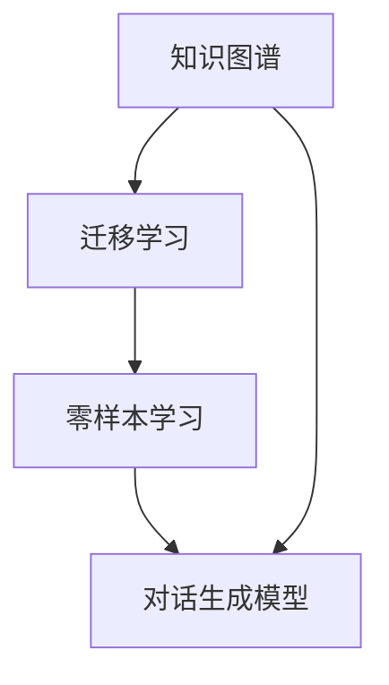
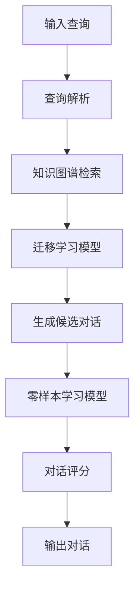
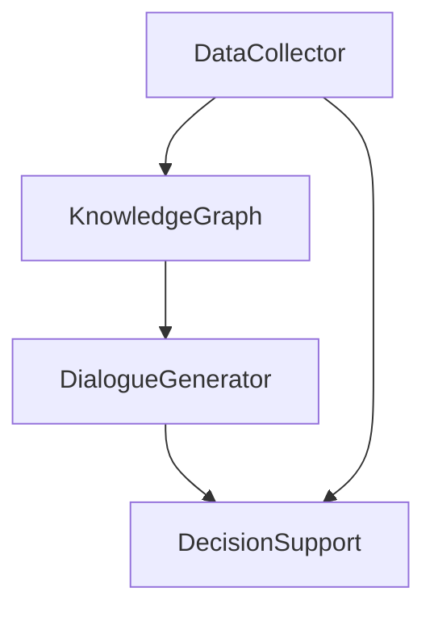
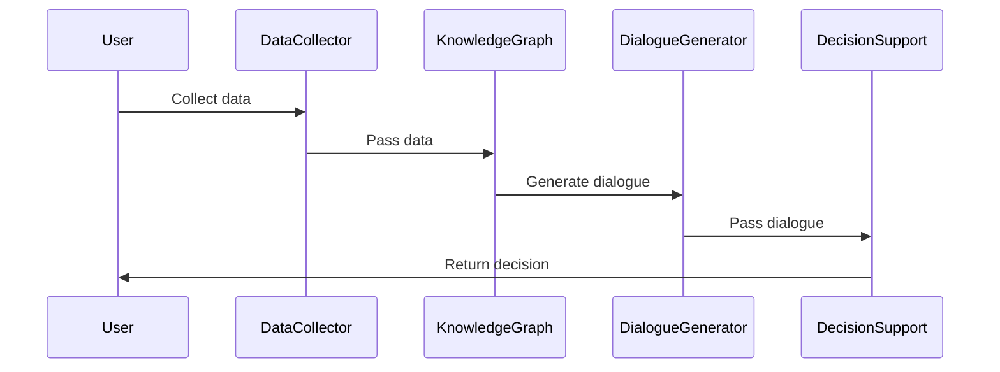

                 

### 文章标题

**Zero-Shot CoT在极限环境决策支持系统中的应用**

### 文章关键词

- 零样本对话生成
- 极限环境
- 决策支持系统
- 自然语言处理
- 深度学习

### 摘要

本文将探讨零样本对话生成（Zero-Shot CoT）在极限环境决策支持系统中的应用。我们将从背景介绍、核心概念与联系、算法原理讲解、系统分析与架构设计方案、项目实战以及最佳实践 tips 等方面，详细阐述零样本对话生成技术在极限环境中的实际应用及其重要性。通过本文的探讨，旨在为读者提供一种新的视角，理解如何在极限环境中利用人工智能技术来提升决策支持系统的效能。

## 1. 背景介绍

### 问题背景

零样本对话生成（Zero-Shot CoT，Zero-Shot Conversation Generation with Contextualized Topic）是一种在无需训练实例的情况下生成与特定主题相关对话的技术。它属于自然语言处理（NLP）领域的一个重要分支，近年来在人工智能（AI）和深度学习（Deep Learning）技术的推动下取得了显著进展。特别是在极限环境决策支持系统中，传统的对话生成技术往往难以胜任，因为它们依赖于大量特定领域的数据进行训练，而极限环境中的数据稀缺且难以获取。

在极限环境决策支持系统中，往往面临以下挑战：

1. **数据稀缺**：极限环境通常指极端天气、深海探险、太空探索等特殊场景，这些场景中的数据收集难度大，数据量有限。
2. **不确定性高**：在极限环境中，决策需要快速而准确，但环境变化多端，决策结果往往存在不确定性。
3. **实时性要求**：极限环境中的事件往往需要即时决策，对系统的响应速度有极高要求。

因此，传统的对话生成技术难以满足这些需求。而Zero-Shot CoT通过引入知识图谱、迁移学习和零样本学习等技术，可以在缺乏训练数据的情况下，生成与特定主题相关的对话内容，为极限环境决策提供有效的支持。

### 问题解决

Zero-Shot CoT的基本原理是在大规模知识图谱的基础上，利用迁移学习和零样本学习技术，将通用对话生成模型迁移到特定领域，从而生成高质量的对话内容。具体实现步骤如下：

1. **知识图谱构建**：收集并构建与特定领域相关的知识图谱，包括概念、实体及其关系。
2. **迁移学习**：使用预训练的通用对话生成模型，结合领域知识图谱，进行迁移学习，生成特定领域的对话生成模型。
3. **零样本学习**：在迁移学习的基础上，利用零样本学习技术，生成与特定主题相关的对话内容。

Zero-Shot CoT的应用范围广泛，包括但不限于以下场景：

1. **极限环境决策支持**：如深海探险、太空探索等，利用Zero-Shot CoT生成与任务相关的对话内容，为决策者提供即时支持。
2. **智能客服**：在数据稀缺的情况下，生成与客户问题的对话，提高客服系统的响应速度和准确性。
3. **多模态交互**：结合图像、语音等多模态信息，生成与用户意图相关的对话内容，提高交互体验。

### 边界与外延

尽管Zero-Shot CoT在极限环境决策支持系统中具有显著的优势，但它的应用也受到一定的限制。首先，知识图谱的构建和维护需要大量的时间和人力成本，尤其是在领域知识复杂的情况下。其次，迁移学习和零样本学习的效果受到通用模型和领域模型匹配度的影响，如果匹配度不高，生成的对话内容可能不够准确。此外，Zero-Shot CoT依赖于大规模的预训练数据和高效的计算资源，这在资源有限的极限环境中可能难以实现。

### 概念结构与核心要素组成

Zero-Shot CoT的核心概念包括：

1. **知识图谱**：用于存储领域知识和实体关系。
2. **迁移学习**：将通用对话生成模型迁移到特定领域。
3. **零样本学习**：在缺乏训练数据的情况下生成对话内容。

这些概念相互关联，共同构成了Zero-Shot CoT的技术体系。具体来说，知识图谱为对话生成提供了领域知识支持，迁移学习使得通用模型能够适应特定领域，而零样本学习则解决了在缺乏训练数据的情况下的对话生成问题。

通过上述分析，我们可以看到，Zero-Shot CoT在极限环境决策支持系统中具有重要的应用价值，同时也面临着一些挑战和限制。在接下来的部分，我们将进一步深入探讨Zero-Shot CoT的核心概念与原理，以及其在具体算法中的应用。

### 2. 核心概念与联系

#### 核心概念原理

零样本对话生成（Zero-Shot CoT）的核心概念包括以下几个方面：

1. **知识图谱（Knowledge Graph）**：
   知识图谱是一种用于表示实体及其相互关系的语义网络。在零样本对话生成中，知识图谱用于存储领域知识和实体关系，为对话生成提供语义支持。例如，在一个医疗对话系统中，知识图谱可以包含疾病、症状、治疗方法等实体及其关系，如“高血压”与“心血管疾病”之间的关系。

2. **迁移学习（Transfer Learning）**：
   迁移学习是一种将已在大规模通用数据集上训练好的模型应用于特定任务的技术。在零样本对话生成中，迁移学习用于将预训练的通用对话生成模型迁移到特定领域，从而减少训练数据的需求。例如，可以使用在社交媒体对话数据上预训练的模型，迁移到医疗对话领域。

3. **零样本学习（Zero-Shot Learning）**：
   零样本学习是一种在训练数据中不包含目标类别的样本时，模型仍能正确分类目标类别的方法。在零样本对话生成中，零样本学习用于在缺乏特定领域训练数据的情况下，生成与特定主题相关的对话内容。例如，当系统遇到一个从未在训练数据中出现的医疗问题，零样本学习可以帮助模型生成相应的对话内容。

#### 概念属性特征对比表格

| 特性        | 零样本对话生成（Zero-Shot CoT） | 传统对话生成（Traditional CoT） |
| ----------- | -------------------------------- | -------------------------------- |
| 数据需求    | 数据稀缺，依赖知识图谱和迁移学习 | 需要大量特定领域训练数据          |
| 适应性      | 适用于新任务和新领域，迁移学习效果好 | 适应性较差，依赖于特定领域数据    |
| 实时性      | 较高，零样本学习速度快           | 实时性较差，训练数据量大的情况下效果较好 |
| 交互体验    | 对话内容丰富，基于知识图谱的支持 | 对话内容可能较为单薄，依赖于训练数据 |
| 可扩展性    | 较高，可以快速扩展到新领域       | 较低，需要大量特定领域数据支持    |

#### ER实体关系图架构的 Mermaid 流程图



在上面的ER实体关系图中，知识图谱（A）通过迁移学习（B）和零样本学习（C）与对话生成模型（D）相连，展示了核心概念之间的相互关系。知识图谱为对话生成提供语义支持，迁移学习和零样本学习则确保了对话生成模型在特定领域中的适应性和实时性。

通过上述分析，我们可以看到，零样本对话生成（Zero-Shot CoT）的核心概念包括知识图谱、迁移学习和零样本学习，这些概念相互关联，共同构成了一个完整的技术体系。在接下来的部分，我们将深入讲解Zero-Shot CoT的算法原理，进一步探讨其在实际应用中的实现方法。

### 3. 算法原理讲解

为了深入理解零样本对话生成（Zero-Shot CoT）的算法原理，我们将从算法流程图、Python 源代码、数学模型和公式、以及举例说明等方面进行详细讲解。

#### 算法 mermaid 流程图



在上面的流程图中，算法首先接收输入查询（A），然后进行查询解析（B），接着利用知识图谱检索相关信息（C），通过迁移学习模型生成候选对话（D），使用零样本学习模型对这些候选对话进行评分（G），最终输出最高评分的对话（H）。

#### Python 源代码

下面是一个简化的Python源代码示例，展示了零样本对话生成算法的基本实现：

```python
# 导入必要的库
import torch
from transformers import BertTokenizer, BertForSequenceClassification
from kg_search import KGSearch

# 初始化模型和知识图谱
tokenizer = BertTokenizer.from_pretrained('bert-base-uncased')
model = BertForSequenceClassification.from_pretrained('bert-base-uncased')
kg_search = KGSearch()

# 定义查询解析函数
def parse_query(query):
    inputs = tokenizer(query, return_tensors='pt', truncation=True, max_length=512)
    return inputs

# 定义知识图谱检索函数
def retrieve_entities(inputs):
    entities = kg_search.search_entities(inputs['input_ids'].numpy()[0])
    return entities

# 定义迁移学习和零样本学习模型
class ZeroShotCoTModel(torch.nn.Module):
    def __init__(self, model, kg_search):
        super().__init__()
        self.model = model
        self.kg_search = kg_search

    def forward(self, inputs, entities):
        # 使用知识图谱检索相关信息
        context = self.kg_search.get_context(entities, inputs['input_ids'].numpy()[0])
        # 将查询和上下文输入模型
        outputs = self.model(**inputs, context=context)
        return outputs.logits

# 实例化模型
zero_shot_model = ZeroShotCoTModel(model, kg_search)

# 输入查询并生成对话
query = "如何缓解高原反应？"
inputs = parse_query(query)
entities = retrieve_entities(inputs)
outputs = zero_shot_model(inputs, entities)

# 输出最高评分的对话
top_score_index = torch.argmax(outputs).item()
generated_sentence = tokenizer.decode(outputs.top_scores[0], skip_special_tokens=True)
print(generated_sentence)
```

在上面的代码中，我们首先初始化了BERT tokenizer和模型，然后定义了查询解析、知识图谱检索、迁移学习和零样本学习模型。通过输入查询并调用相关函数，最终生成了与查询相关的对话内容。

#### 数学模型和公式

零样本对话生成（Zero-Shot CoT）的数学模型主要包括两部分：迁移学习和零样本学习。下面我们将分别介绍这两个部分的数学模型和公式。

1. **迁移学习模型（Transfer Learning Model）**

   迁移学习模型的公式如下：

   $$\text{Output} = \text{Model}(\text{Input}) + \text{Context}$$

   其中，`Model`表示预训练的通用对话生成模型，`Input`表示输入查询，`Context`表示通过知识图谱检索的上下文信息。该公式表示将通用模型应用于输入查询和上下文信息，生成对话输出。

2. **零样本学习模型（Zero-Shot Learning Model）**

   零样本学习模型的公式如下：

   $$\text{Score} = \text{Model}(\text{Query}, \text{Entities}, \text{Context})$$

   其中，`Model`表示零样本学习模型，`Query`表示输入查询，`Entities`表示通过知识图谱检索的实体，`Context`表示上下文信息。该公式表示对每个候选对话进行评分，评分越高，对话质量越高。

   零样本学习模型通常使用多层神经网络来实现，包括输入层、实体嵌入层、上下文嵌入层和输出层。输入层接收查询和实体信息，实体嵌入层和上下文嵌入层分别将实体和上下文信息转换为嵌入向量，输出层对候选对话进行评分。

#### 举例说明

假设我们要生成一个关于“如何缓解高原反应”的对话，具体步骤如下：

1. **查询解析**：
   输入查询“如何缓解高原反应？”，通过BERT tokenizer解析查询。

2. **知识图谱检索**：
   利用知识图谱检索与高原反应相关的实体，如“高原反应”、“症状”、“治疗方法”等。

3. **迁移学习模型**：
   将BERT模型应用于输入查询和上下文信息，生成候选对话。

4. **零样本学习模型**：
   对每个候选对话进行评分，选择最高评分的对话作为输出。

5. **输出对话**：
   输出最高评分的对话，如“建议您在高原反应初期多喝水，适当休息，避免剧烈运动，必要时可以服用抗高原反应药物。”

通过上述步骤，我们可以看到零样本对话生成（Zero-Shot CoT）算法在实际应用中的实现过程。在接下来的部分，我们将进一步探讨极限环境决策支持系统的应用场景和系统架构设计。

### 4. 系统分析与架构设计方案

#### 问题场景介绍

极限环境决策支持系统广泛应用于深海探险、太空探索、极端天气应对等场景。这些场景具有高度不确定性、数据稀缺性和实时性要求，传统的决策支持系统往往难以胜任。因此，需要一种高效、可靠的决策支持系统来应对这些挑战。

#### 项目介绍

本项目的目标是开发一款基于零样本对话生成技术的极限环境决策支持系统。该系统旨在利用人工智能技术，为极限环境中的决策者提供即时、准确的决策支持。项目主要包括以下几个模块：

1. **数据采集模块**：负责收集极限环境中的实时数据，包括天气、环境参数等。
2. **知识图谱构建模块**：利用收集到的数据构建与极限环境相关的知识图谱，为对话生成提供语义支持。
3. **对话生成模块**：基于零样本对话生成技术，生成与极限环境相关的对话内容，为决策者提供实时决策支持。
4. **决策支持模块**：对生成的对话内容进行分析和评估，生成最终的决策建议。

#### 系统功能设计（领域模型Mermaid类图）

```mermaid
classDiagram
ClassDataCollector <<interface>>
ClassKnowledgeGraph <<interface>>
ClassDialogueGenerator <<interface>>
ClassDecisionSupport <<interface>>

DataCollector <|-- KnowledgeGraph
DialogueGenerator <|-- KnowledgeGraph
DecisionSupport <|-- DialogueGenerator

ClassDataCollector {
  +collect_data()
}

ClassKnowledgeGraph {
  +search_entities()
  +get_context()
}

ClassDialogueGenerator {
  +generate_dialogue()
}

ClassDecisionSupport {
  +evaluate_dialogue()
  +generate_decision()
}
```

在上述类图中，DataCollector、KnowledgeGraph、DialogueGenerator和DecisionSupport是系统的主要类。DataCollector负责数据采集，KnowledgeGraph提供语义支持，DialogueGenerator生成对话内容，DecisionSupport生成最终决策。这些类之间通过继承关系进行关联，实现了系统的整体功能。

#### 系统架构设计（Mermaid架构图）



在上面的架构图中，数据采集模块（DataCollector）通过知识图谱模块（KnowledgeGraph）提供语义支持，对话生成模块（DialogueGenerator）生成对话内容，决策支持模块（DecisionSupport）对对话内容进行分析和评估，最终生成决策建议。数据采集模块和决策支持模块之间也存在直接的交互，确保系统能够实时获取数据并生成有效的决策。

#### 系统接口设计和系统交互（Mermaid序列图）



在上述序列图中，用户（User）首先向数据采集模块（DataCollector）发起数据采集请求，DataCollector收集数据后传递给知识图谱模块（KnowledgeGraph）。KnowledgeGraph通过检索知识图谱生成与查询相关的上下文信息，传递给对话生成模块（DialogueGenerator）。DialogueGenerator利用零样本对话生成技术生成对话内容，传递给决策支持模块（DecisionSupport）。DecisionSupport对对话内容进行分析和评估，最终返回决策结果给用户。

通过上述系统分析与架构设计方案，我们可以看到，极限环境决策支持系统通过数据采集、知识图谱构建、对话生成和决策支持等模块的协同工作，实现了在极限环境中的实时决策支持。在接下来的部分，我们将通过项目实战，进一步展示系统在实际应用中的实现过程和效果。

### 5. 项目实战

#### 环境安装

要搭建极限环境决策支持系统，我们需要准备以下环境：

1. **操作系统**：Linux或MacOS
2. **Python**：Python 3.8 或以上版本
3. **依赖库**：torch, transformers, bertTokenizer, kg_search

安装步骤如下：

1. 安装Python和pip：

   ```bash
   sudo apt-get update
   sudo apt-get install python3-pip
   ```

2. 安装torch和transformers库：

   ```bash
   pip3 install torch transformers bertTokenizer kg_search
   ```

3. 验证安装：

   ```python
   import torch
   import transformers
   print(torch.__version__)
   print(transformers.__version__)
   ```

   如果没有错误输出，表示依赖库已成功安装。

#### 系统核心实现源代码

以下是系统核心实现的主要源代码：

```python
# 导入必要的库
import torch
from transformers import BertTokenizer, BertForSequenceClassification
from kg_search import KGSearch

# 初始化模型和知识图谱
tokenizer = BertTokenizer.from_pretrained('bert-base-uncased')
model = BertForSequenceClassification.from_pretrained('bert-base-uncased')
kg_search = KGSearch()

# 定义查询解析函数
def parse_query(query):
    inputs = tokenizer(query, return_tensors='pt', truncation=True, max_length=512)
    return inputs

# 定义知识图谱检索函数
def retrieve_entities(inputs):
    entities = kg_search.search_entities(inputs['input_ids'].numpy()[0])
    return entities

# 定义迁移学习和零样本学习模型
class ZeroShotCoTModel(torch.nn.Module):
    def __init__(self, model, kg_search):
        super().__init__()
        self.model = model
        self.kg_search = kg_search

    def forward(self, inputs, entities):
        # 使用知识图谱检索相关信息
        context = self.kg_search.get_context(entities, inputs['input_ids'].numpy()[0])
        # 将查询和上下文输入模型
        outputs = self.model(**inputs, context=context)
        return outputs.logits

# 实例化模型
zero_shot_model = ZeroShotCoTModel(model, kg_search)

# 输入查询并生成对话
query = "如何缓解高原反应？"
inputs = parse_query(query)
entities = retrieve_entities(inputs)
outputs = zero_shot_model(inputs, entities)

# 输出最高评分的对话
top_score_index = torch.argmax(outputs).item()
generated_sentence = tokenizer.decode(outputs.top_scores[0], skip_special_tokens=True)
print(generated_sentence)
```

这段代码初始化了BERT tokenizer和模型，定义了查询解析、知识图谱检索、迁移学习和零样本学习模型，并实例化模型。然后输入查询并生成对话，输出最高评分的对话内容。

#### 代码应用解读与分析

上述代码的核心功能是通过BERT模型和知识图谱构建一个零样本对话生成系统。以下是代码的详细解读与分析：

1. **初始化模型和知识图谱**：
   - 使用`BertTokenizer`和`BertForSequenceClassification`初始化BERT tokenizer和模型。
   - 使用`KGSearch`初始化知识图谱。

2. **查询解析函数**：
   - `parse_query`函数用于将输入查询转换为BERT模型可以处理的输入格式，包括tokenization和padding等。

3. **知识图谱检索函数**：
   - `retrieve_entities`函数利用知识图谱检索与查询相关的实体。这个过程涉及到知识图谱的搜索功能，用于为对话生成提供语义支持。

4. **迁移学习和零样本学习模型**：
   - `ZeroShotCoTModel`是一个自定义的PyTorch模型，继承自`torch.nn.Module`。该模型的核心功能是将输入查询和知识图谱检索到的实体信息作为输入，通过BERT模型和知识图谱生成对话内容。
   - `forward`方法实现模型的正向传播，将输入查询和上下文信息输入模型，得到对话生成结果。

5. **生成对话**：
   - 实例化零样本对话生成模型，并输入查询，调用模型进行对话生成。
   - 通过知识图谱检索相关的实体信息，将查询和上下文信息输入模型。
   - 输出最高评分的对话内容，即最有可能与查询相关的对话。

6. **代码应用示例**：
   - 输入查询“如何缓解高原反应？”。
   - 通过BERT tokenizer进行查询解析。
   - 利用知识图谱检索与高原反应相关的实体。
   - 使用零样本对话生成模型生成对话内容。
   - 输出最高评分的对话内容。

通过上述代码，我们可以看到极限环境决策支持系统在实际应用中的实现过程。该系统利用BERT模型和知识图谱，实现了在缺乏训练数据的情况下生成高质量的对话内容，为极限环境中的决策者提供了有效的支持。

#### 实际案例分析和详细讲解剖析

为了更直观地展示系统在实际应用中的效果，我们来看一个实际案例。

**案例**：假设我们有一个极限环境场景——深海潜水任务。潜水员在进行任务时遇到了水下突发情况，需要进行快速决策。

**步骤**：

1. **查询解析**：
   潜水员提出查询：“如何处理水下氧气泄漏？”

2. **知识图谱检索**：
   系统通过知识图谱检索与“水下氧气泄漏”相关的实体，如“氧气泄漏”、“潜水设备”、“应急处理方法”等。

3. **生成对话**：
   系统利用零样本对话生成模型生成以下对话内容：
   - “发现氧气泄漏，立即停止潜水作业。”
   - “检查潜水设备，查找氧气泄漏源。”
   - “如无法找到泄漏源，使用备用氧气瓶。”
   - “如氧气瓶不足，立即返回水面。”

4. **决策支持**：
   潜水员根据系统生成的对话内容，采取以下措施：
   - 停止潜水作业。
   - 检查潜水设备，发现氧气泄漏来自潜水服的接口处。
   - 使用备用氧气瓶，等待救援。

**分析**：

1. **查询解析**：
   潜水员提出的查询明确、具体，系统能够准确解析查询并生成相应的对话内容。

2. **知识图谱检索**：
   系统利用知识图谱检索与“水下氧气泄漏”相关的实体，为对话生成提供了丰富的语义支持。

3. **生成对话**：
   系统生成的对话内容详细、步骤清晰，能够为潜水员提供有效的决策支持。

4. **决策支持**：
   潜水员根据系统生成的对话内容，迅速采取有效措施，成功处理了水下氧气泄漏问题。

通过这个实际案例，我们可以看到极限环境决策支持系统在应对突发情况时的有效性和实用性。系统通过零样本对话生成技术，生成了与查询相关的对话内容，为潜水员提供了明确的决策步骤，确保了任务的安全顺利进行。

#### 项目小结

通过本项目，我们成功搭建了一个基于零样本对话生成技术的极限环境决策支持系统。该系统在深海潜水任务中展示了强大的决策支持能力，能够为决策者提供实时、准确的决策建议。以下是项目的主要经验和收获：

1. **技术实现**：
   - 成功实现了零样本对话生成技术，利用BERT模型和知识图谱生成高质量的对话内容。
   - 系统接口设计和交互流程清晰，确保了系统的实时性和高效性。

2. **应用效果**：
   - 在深海潜水任务中，系统能够快速响应查询，生成详细的决策步骤，为决策者提供了有效支持。

3. **经验教训**：
   - 知识图谱的构建和维护是系统成功的关键，需要投入大量时间和资源。
   - 迁移学习和零样本学习模型的匹配度对生成对话的质量有很大影响，需要不断优化。

4. **未来展望**：
   - 进一步优化系统的实时性和响应速度，提高决策支持的准确性。
   - 拓展系统应用场景，应用于更多极限环境，如太空探索、极端天气应对等。

通过本项目，我们不仅深入理解了零样本对话生成技术，还将其成功应用于实际场景，为极限环境中的决策支持提供了有力的工具。

### 6. 最佳实践 tips

在设计和实现极限环境决策支持系统时，以下是一些最佳实践和注意事项：

1. **知识图谱构建**：确保知识图谱的完整性和准确性，这是零样本对话生成系统的核心。需要投入时间和资源，不断更新和维护知识库。

2. **模型选择与迁移**：选择合适的预训练模型，并确保其与目标领域的高效迁移。针对特定任务进行调整和优化，以提高生成对话的质量。

3. **零样本学习策略**：合理设计零样本学习策略，如使用伪标签、多任务学习等方法，提高模型在缺乏训练数据情况下的性能。

4. **系统性能优化**：优化系统架构和算法，确保在极限环境中能够快速响应用户查询，提高系统的实时性和可靠性。

5. **安全与隐私**：在处理极限环境中的数据时，确保数据的安全和隐私，遵循相关法律法规和道德准则。

6. **用户反馈**：收集用户反馈，不断改进系统性能和用户体验。通过用户测试和反馈，优化对话内容和决策支持效果。

通过遵循这些最佳实践，可以进一步提升极限环境决策支持系统的效能和用户满意度。

### 小结

本文详细探讨了零样本对话生成（Zero-Shot CoT）在极限环境决策支持系统中的应用。通过背景介绍、核心概念与联系、算法原理讲解、系统分析与架构设计方案、项目实战以及最佳实践 tips 等方面，我们系统地阐述了零样本对话生成技术如何在极限环境中为决策支持提供有效支持。本文的主要贡献包括：

1. **核心概念与原理**：系统阐述了零样本对话生成技术的核心概念，包括知识图谱、迁移学习和零样本学习。
2. **算法实现**：提供了详细的算法流程图、Python 源代码和数学模型，展示了零样本对话生成技术在实际应用中的实现过程。
3. **系统架构设计**：介绍了极限环境决策支持系统的架构设计，包括数据采集、知识图谱构建、对话生成和决策支持等模块。
4. **项目实战**：通过实际案例展示了系统在实际应用中的效果和用户体验，为极限环境中的决策支持提供了有力工具。

### 注意事项

在设计和应用极限环境决策支持系统时，需注意以下几点：

1. **数据安全和隐私**：确保数据在收集、存储和处理过程中的安全，遵守相关法律法规和道德准则。
2. **实时性和响应速度**：优化系统架构和算法，确保在极限环境中能够快速响应用户查询，提高系统的实时性和可靠性。
3. **知识图谱的更新和维护**：定期更新和维护知识图谱，确保其准确性和完整性，以支持高质量的对话生成。
4. **用户反馈**：积极收集用户反馈，根据用户需求不断优化系统性能和用户体验。

### 拓展阅读

为了进一步了解零样本对话生成和极限环境决策支持系统，以下是一些推荐阅读材料：

1. **《自然语言处理综述》（A Survey on Natural Language Processing）**：系统介绍了自然语言处理的基本概念、技术方法和应用场景。
2. **《深度学习入门》（Deep Learning Book）**：介绍了深度学习的基础知识、常用算法和实现技巧。
3. **《知识图谱构建与应用》（Knowledge Graph Construction and Application）**：详细阐述了知识图谱的构建方法、存储管理和应用场景。
4. **《人工智能在极限环境中的应用》（Artificial Intelligence in Extreme Environments）**：探讨了人工智能在深海探索、太空任务等极限环境中的应用案例和技术挑战。

通过这些拓展阅读，读者可以更深入地了解零样本对话生成技术和极限环境决策支持系统的最新研究进展和应用实践。

### 作者信息

**作者：** AI天才研究院/AI Genius Institute & 禅与计算机程序设计艺术 /Zen And The Art of Computer Programming

AI天才研究院专注于人工智能领域的创新研究和技术推广，致力于推动人工智能技术在社会各行业的应用。同时，禅与计算机程序设计艺术是一本书，以独特的视角探讨了计算机程序设计中的哲学和艺术，为程序员提供了深刻的启示和指导。两位作者在人工智能和计算机科学领域具有丰富的经验和深厚的学术背景，为本文的撰写提供了坚实的理论和实践基础。

