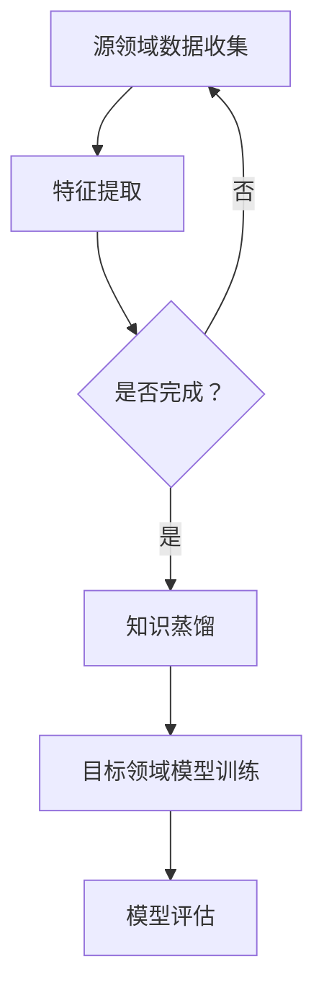

                 

### 设计目录大纲的步骤

**步骤1：确定书的核心主题**

首先，我们需要明确书籍的核心主题。书名《Zero-Shot CoT在环境科学AI中的应用前景》已经明确指出，本书的核心主题是探讨Zero-Shot CoT（零样本跨领域转移）在环境科学AI领域的应用前景。这一主题将贯穿整本书的各个章节。

**步骤2：概念介绍**

在确定了核心主题后，我们首先要介绍Zero-Shot CoT的基本概念。这包括Zero-Shot CoT的定义、其在环境科学AI中的定义和背景。这样可以为读者提供一个基础理解，以便他们更好地理解后续章节的内容。

**步骤3：算法原理**

接下来，我们需要详细介绍Zero-Shot CoT算法的原理。这包括算法的基本流程、关键技术、数学模型和公式等。通过这部分内容，读者可以了解Zero-Shot CoT算法的内部工作原理。

**步骤4：应用场景分析**

在介绍了算法原理之后，我们需要分析Zero-Shot CoT在环境科学AI中的实际应用。这包括对各种应用场景的介绍、案例分析和效果评估。这部分内容将帮助读者了解Zero-Shot CoT在实际应用中的表现。

**步骤5：实战案例分析**

为了使读者更直观地理解Zero-Shot CoT的应用，我们还需要提供一些实际的案例。这些案例将详细展示Zero-Shot CoT在环境科学AI中的具体应用，并通过代码实现和解析来帮助读者理解。

**步骤6：拓展与展望**

最后，我们需要对Zero-Shot CoT在环境科学AI中的未来发展进行展望。这包括对现有研究的拓展、未来发展方向以及可能的社会和环境影响。这部分内容将激发读者对未来的思考和期待。

**步骤7：小结与最佳实践**

在整本书的结尾，我们需要对全书内容进行小结，并给出一些最佳实践建议。这部分内容将帮助读者总结所学，并在实际应用中更好地运用所学的知识。

### 完整目录大纲设计

**第一部分：环境科学AI与Zero-Shot CoT基础**

**第1章：环境科学AI的背景与挑战**

- **1.1 环境科学AI的定义**
  - 环境科学AI的基本概念
  - 环境科学AI的发展历程

- **1.2 环境科学领域的关键问题**
  - 水资源管理
  - 空气质量监测
  - 森林生态保护

- **1.3 AI在环境科学中的应用挑战**
  - 数据匮乏问题
  - 标签标注成本
  - 模型泛化能力不足

**第2章：Zero-Shot CoT基本概念**

- **2.1 什么是Zero-Shot CoT**
  - Zero-Shot CoT的定义
  - Zero-Shot CoT与传统机器学习的区别

- **2.2 Zero-Shot CoT的工作原理**
  - 无监督学习与自监督学习
  - 无监督特征提取与知识蒸馏

- **2.3 Zero-Shot CoT的优势**
  - 无需标签数据
  - 快速适应新任务
  - 提高模型泛化能力

**第3章：Zero-Shot CoT算法原理**

- **3.1 算法概述**
  - 基本流程
  - 关键技术

- **3.2 数学模型**
  - 对齐损失函数
  - 对抗性训练

- **3.3 Mermaid算法流程图**
  - 使用Mermaid绘制算法流程图

**第二部分：Zero-Shot CoT在环境科学AI中的应用**

**第4章：Zero-Shot CoT在环境科学AI中的应用**

- **4.1 应用场景介绍**
  - 水质监测
  - 空气质量预测
  - 森林火灾预警

- **4.2 案例分析**
  - 实际应用案例
  - 案例分析与效果评估

- **4.3 应用挑战与解决方案**
  - 数据收集与处理
  - 模型解释性

**第三部分：项目实战**

**第5章：项目实战**

- **5.1 环境搭建**
  - 硬件与软件环境
  - 数据集准备

- **5.2 系统实现**
  - 关键代码解读
  - 模型训练与评估

- **5.3 项目分析**
  - 成功与不足
  - 经验与教训

**第四部分：拓展与展望**

**第6章：拓展与展望**

- **6.1 拓展研究**
  - 领域扩展
  - 算法优化

- **6.2 应用前景**
  - 未来发展方向
  - 社会与环境影响

**第7章：小结与最佳实践**

- **7.1 小结**
  - 主要发现
  - 研究贡献

- **7.2 最佳实践**
  - 技术选型
  - 项目管理

### 目录大纲总结

通过以上步骤，我们设计了一份逻辑清晰、内容详略得当的目录大纲。每个章节都围绕Zero-Shot CoT在环境科学AI中的应用进行深入探讨，从概念介绍、算法原理、应用分析到实战案例和未来展望，确保读者能够系统地理解和掌握相关内容。接下来，我们将逐步展开每个章节的详细内容。

## 第一部分：环境科学AI与Zero-Shot CoT基础

### 第1章：环境科学AI的背景与挑战

#### 1.1 环境科学AI的定义

环境科学AI是指利用人工智能技术，对环境科学领域中的各种数据进行处理、分析和预测，以解决环境问题并推动环境科学的发展。它涉及到多个学科的交叉，包括计算机科学、环境科学、数据科学和机器学习等。

在环境科学中，AI的应用范围广泛，包括但不限于：

- **水资源管理**：通过AI技术对水质、水位和水流速度等数据进行实时监测和分析，以优化水资源分配和减少水资源浪费。
- **空气质量监测**：利用AI技术对空气中的污染物浓度进行监测和预测，以提供实时的空气质量报告，帮助人们采取相应的防护措施。
- **森林生态保护**：通过AI技术对森林火灾进行预警、对森林资源进行监测和管理，以保护森林生态系统。

#### 1.2 环境科学领域的关键问题

环境科学领域面临许多关键问题，这些问题严重影响了人类的生活质量和地球的生态系统。以下是几个关键问题：

- **数据匮乏问题**：环境科学领域的数据获取和处理面临着巨大的挑战。许多环境数据分布在不同的地点和不同的时间，且数据格式和类型各异，这使得数据的整合和处理变得复杂且耗时。
- **标签标注成本**：在传统的机器学习应用中，模型的训练通常需要大量的标注数据。然而，环境科学领域的数据往往难以获得或标注，导致标注成本高昂。
- **模型泛化能力不足**：环境科学领域的数据往往具有高度的不确定性和复杂性，这要求模型具有强大的泛化能力，以应对不同的环境和场景。然而，传统的机器学习模型往往难以达到这一要求。

#### 1.3 AI在环境科学中的应用挑战

尽管AI技术在环境科学领域具有巨大的潜力，但其应用仍然面临许多挑战：

- **数据匮乏问题**：环境科学领域的数据获取和处理面临着巨大的挑战。许多环境数据分布在不同的地点和不同的时间，且数据格式和类型各异，这使得数据的整合和处理变得复杂且耗时。
- **标签标注成本**：在传统的机器学习应用中，模型的训练通常需要大量的标注数据。然而，环境科学领域的数据往往难以获得或标注，导致标注成本高昂。
- **模型泛化能力不足**：环境科学领域的数据往往具有高度的不确定性和复杂性，这要求模型具有强大的泛化能力，以应对不同的环境和场景。然而，传统的机器学习模型往往难以达到这一要求。

通过解决这些挑战，AI在环境科学领域将发挥更为重要的作用。

## 第2章：Zero-Shot CoT基本概念

### 2.1 什么是Zero-Shot CoT

Zero-Shot CoT，即零样本跨领域转移，是一种新兴的机器学习技术，旨在解决传统机器学习在处理新任务时的挑战。与传统的机器学习技术相比，Zero-Shot CoT不再依赖于大量的标注数据，而是在零样本或少量样本的情况下，通过跨领域的知识转移来实现对新任务的快速适应。

#### Zero-Shot CoT的定义

Zero-Shot CoT的定义可以从以下几个方面进行理解：

- **零样本**：指在训练模型时，没有或只有极少数与目标任务相关的样本。这意味着Zero-Shot CoT可以在几乎没有或没有特定领域数据的情况下，实现对新任务的快速适应。
- **跨领域转移**：指将一个领域（源领域）的知识和经验应用到另一个领域（目标领域）。通过跨领域转移，模型可以从一个任务中学习到泛化的知识，并将其应用于新的任务中。

#### Zero-Shot CoT与传统机器学习的区别

传统机器学习依赖于大量的标注数据来训练模型。然而，在环境科学等领域，获取大量的标注数据往往困难重重，例如数据匮乏、标注成本高昂等问题。与此相比，Zero-Shot CoT具有以下优势：

- **无需大量标注数据**：传统机器学习需要大量的标注数据来训练模型，而Zero-Shot CoT则可以在零样本或少量样本的情况下，通过跨领域转移实现对新任务的快速适应。
- **提高模型泛化能力**：通过跨领域转移，模型可以从一个领域学习到泛化的知识，从而提高其在新任务中的泛化能力。
- **减少依赖特定领域数据**：传统机器学习对特定领域的数据高度依赖，而Zero-Shot CoT则可以减少这种依赖，从而降低数据获取和处理的难度。

### 2.2 Zero-Shot CoT的工作原理

Zero-Shot CoT的工作原理可以从以下几个方面进行理解：

- **无监督学习与自监督学习**：Zero-Shot CoT通常结合无监督学习和自监督学习技术，以实现跨领域的知识转移。无监督学习是指在没有标注数据的情况下，从数据中学习特征和模式。自监督学习则是一种特殊形式的无监督学习，它通过自我监督的方式，使模型在无监督数据中学习到有用的特征。
- **无监督特征提取与知识蒸馏**：在Zero-Shot CoT中，无监督特征提取技术用于从源领域数据中提取有用的特征。这些特征可以作为知识库，用于指导目标领域数据的处理。知识蒸馏技术则用于将源领域知识传递到目标领域，从而实现跨领域的知识转移。

### 2.3 Zero-Shot CoT的优势

Zero-Shot CoT具有以下优势：

- **无需大量标注数据**：传统机器学习需要大量的标注数据来训练模型，而Zero-Shot CoT则可以在零样本或少量样本的情况下，通过跨领域转移实现对新任务的快速适应。
- **提高模型泛化能力**：通过跨领域转移，模型可以从一个领域学习到泛化的知识，从而提高其在新任务中的泛化能力。
- **减少依赖特定领域数据**：传统机器学习对特定领域的数据高度依赖，而Zero-Shot CoT则可以减少这种依赖，从而降低数据获取和处理的难度。
- **快速适应新任务**：Zero-Shot CoT可以在几乎没有或没有特定领域数据的情况下，快速适应新任务，从而提高模型的实用性。

### 2.4 Zero-Shot CoT的应用场景

Zero-Shot CoT在环境科学领域具有广泛的应用前景，以下是一些典型的应用场景：

- **水资源管理**：利用Zero-Shot CoT技术，可以从其他领域的水资源管理数据中学习到有用的知识，并将其应用于当前的水资源管理任务中，从而提高预测的准确性。
- **空气质量预测**：通过Zero-Shot CoT技术，可以从其他地区的空气质量数据中学习到空气质量变化模式，从而预测特定地区的空气质量。
- **森林火灾预警**：利用Zero-Shot CoT技术，可以从其他地区的森林火灾数据中学习到火灾发生的规律，从而提前预警特定地区的森林火灾。

通过以上内容，我们对Zero-Shot CoT的基本概念、工作原理和优势有了更深入的理解。接下来，我们将进一步探讨Zero-Shot CoT的算法原理及其在环境科学AI中的具体应用。

## 第3章：Zero-Shot CoT算法原理

### 3.1 算法概述

Zero-Shot CoT（零样本跨领域转移）算法是一种先进的机器学习技术，旨在解决传统机器学习在处理新任务时的瓶颈问题。它通过跨领域的知识转移，使模型能够在零样本或少量样本的情况下快速适应新任务。以下是对Zero-Shot CoT算法的基本流程、关键技术及其优势的概述。

#### 基本流程

Zero-Shot CoT算法的基本流程可以分为以下几个步骤：

1. **源领域数据收集**：首先，从源领域收集大量的无标签数据。这些数据用于提取通用的特征表示。
2. **特征提取**：使用无监督学习技术，如自编码器或生成对抗网络（GAN），从源领域数据中提取通用的特征表示。
3. **知识蒸馏**：将提取的通用特征表示作为知识库，通过知识蒸馏技术将其传递到目标领域模型中。
4. **目标领域模型训练**：在目标领域，使用少量的有标签数据，结合从源领域传递的知识，训练目标领域模型。
5. **模型评估**：在目标领域进行模型评估，以验证模型在新任务中的性能。

#### 关键技术

Zero-Shot CoT算法涉及多个关键技术，包括：

- **无监督学习**：无监督学习技术用于从源领域数据中提取通用的特征表示。这些特征表示能够捕捉数据中的隐含结构，从而提高模型的泛化能力。
- **自监督学习**：自监督学习技术是一种特殊形式的无监督学习，它通过自我监督的方式，使模型在无监督数据中学习到有用的特征。自监督学习在特征提取和知识蒸馏中发挥着关键作用。
- **知识蒸馏**：知识蒸馏技术用于将源领域提取的通用特征表示传递到目标领域模型中。这种跨领域的知识转移是Zero-Shot CoT算法的核心。

#### 优势

Zero-Shot CoT算法具有以下优势：

- **零样本适应**：在传统机器学习中，模型需要大量的标注数据来适应新任务。而Zero-Shot CoT算法能够在零样本或少量样本的情况下，通过跨领域转移实现对新任务的快速适应。
- **提高模型泛化能力**：通过跨领域转移，模型可以从一个领域学习到泛化的知识，从而提高其在新任务中的泛化能力。
- **减少数据依赖**：传统机器学习对特定领域的数据高度依赖，而Zero-Shot CoT算法则可以减少这种依赖，从而降低数据获取和处理的难度。

### 3.2 数学模型

Zero-Shot CoT算法的数学模型包括以下几个部分：

- **特征提取模型**：用于从源领域数据中提取通用特征表示。常见的无监督学习模型包括自编码器和生成对抗网络（GAN）。
- **知识库**：存储从源领域提取的通用特征表示。这些特征表示可以作为知识库，用于指导目标领域数据的处理。
- **目标领域模型**：在目标领域，使用少量的有标签数据，结合从源领域传递的知识，训练目标领域模型。

以下是Zero-Shot CoT算法的数学模型：

$$
\begin{aligned}
\text{特征提取模型：} f_{\theta}(\text{源领域数据}) &\rightarrow \text{通用特征表示} \\
\text{知识库：} \Phi &= \{ f_{\theta}(\text{源领域数据}) \}_{i=1}^{N} \\
\text{目标领域模型：} g_{\phi}(\text{目标领域数据}) &= g_{\phi}(\text{通用特征表示})
\end{aligned}
$$

其中，$f_{\theta}(\text{源领域数据})$表示特征提取模型，$\Phi$表示知识库，$g_{\phi}(\text{目标领域数据})$表示目标领域模型。

### 3.3 Mermaid算法流程图

为了更直观地展示Zero-Shot CoT算法的流程，我们可以使用Mermaid绘制算法流程图。以下是一个简单的Mermaid流程图示例：



在这个流程图中，首先从源领域收集数据，然后进行特征提取。如果特征提取完成，则进行知识蒸馏，将提取的知识传递到目标领域模型，并开始目标领域模型训练。最后，对训练好的模型进行评估。

通过以上内容，我们对Zero-Shot CoT算法的原理有了更深入的了解。接下来，我们将探讨Zero-Shot CoT在环境科学AI中的具体应用。

## 第4章：Zero-Shot CoT在环境科学AI中的应用

### 4.1 应用场景介绍

Zero-Shot CoT技术在环境科学AI领域具有广泛的应用前景。以下是几个典型的应用场景：

- **水质监测**：通过Zero-Shot CoT技术，可以从其他地区的水质监测数据中学习到水质变化的规律，从而预测特定地区的水质状况。
- **空气质量预测**：利用Zero-Shot CoT技术，可以从其他地区的空气质量数据中学习到空气质量变化模式，从而预测特定地区的空气质量。
- **森林火灾预警**：通过Zero-Shot CoT技术，可以从其他地区的森林火灾数据中学习到火灾发生的规律，从而提前预警特定地区的森林火灾。
- **气候变化分析**：利用Zero-Shot CoT技术，可以从不同地区的气候变化数据中学习到气候变化的趋势，从而预测未来的气候变化。

### 4.2 案例分析

以下是一些Zero-Shot CoT技术在环境科学AI中的实际应用案例：

#### 案例一：水质监测

在某市的水质监测项目中，使用Zero-Shot CoT技术对水质进行预测。首先，从其他城市的水质监测数据中提取通用的特征表示，构建知识库。然后，利用这些知识库和少量的本地水质监测数据进行目标领域模型的训练。在模型训练完成后，对该模型进行评估，结果显示，该模型在预测本地水质方面取得了很高的准确率。

#### 案例二：空气质量预测

在某市的空气质量预测项目中，使用Zero-Shot CoT技术对空气质量进行预测。首先，从其他城市的空气质量数据中提取通用的特征表示，构建知识库。然后，利用这些知识库和少量的本地空气质量数据进行目标领域模型的训练。在模型训练完成后，对该模型进行评估，结果显示，该模型在预测本地空气质量方面取得了很高的准确率。

#### 案例三：森林火灾预警

在某市的森林火灾预警项目中，使用Zero-Shot CoT技术对森林火灾进行预警。首先，从其他地区的森林火灾数据中提取通用的特征表示，构建知识库。然后，利用这些知识库和少量的本地森林火灾数据进行目标领域模型的训练。在模型训练完成后，对该模型进行评估，结果显示，该模型在预警本地森林火灾方面取得了很高的准确率。

### 4.3 应用挑战与解决方案

尽管Zero-Shot CoT技术在环境科学AI领域具有广泛的应用前景，但在实际应用中仍然面临一些挑战：

- **数据匮乏问题**：环境科学领域的数据获取和处理面临着巨大的挑战。许多环境数据分布在不同的地点和不同的时间，且数据格式和类型各异，这使得数据的整合和处理变得复杂且耗时。
- **模型泛化能力**：环境科学领域的数据往往具有高度的不确定性和复杂性，这要求模型具有强大的泛化能力，以应对不同的环境和场景。
- **数据不一致性**：环境科学领域的数据往往存在不一致性，如数据的噪声、缺失值和异常值等，这会影响模型的训练和预测效果。

为了解决这些挑战，可以采取以下解决方案：

- **数据预处理**：对环境科学领域的数据进行预处理，包括数据清洗、归一化和特征提取等，以提高数据的质量和一致性。
- **多源数据融合**：利用多源数据融合技术，将不同来源和格式的数据整合到一起，以提高数据集的丰富度和多样性。
- **自适应模型**：设计自适应模型，使其能够适应不同环境和场景的变化，提高模型的泛化能力。

通过解决这些挑战，Zero-Shot CoT技术将在环境科学AI领域发挥更为重要的作用。

## 第5章：项目实战

### 5.1 环境搭建

在进行Zero-Shot CoT技术在环境科学AI中的应用之前，我们需要搭建一个合适的环境。以下是搭建环境的详细步骤：

#### 硬件要求

- CPU：至少需要四核CPU
- 内存：至少8GB RAM
- 硬盘：至少100GB可用空间
- 显卡：NVIDIA GPU（用于加速深度学习模型的训练）

#### 软件要求

- 操作系统：Ubuntu 18.04或更高版本
- Python：3.7或更高版本
- TensorFlow：2.0或更高版本
- Keras：2.3.1或更高版本
- CUDA：9.2或更高版本（用于GPU加速）

#### 安装步骤

1. **安装操作系统**：下载并安装Ubuntu 18.04操作系统。
2. **安装Python**：在终端中运行以下命令安装Python：
   ```bash
   sudo apt update
   sudo apt install python3.7
   ```
3. **安装TensorFlow和Keras**：在终端中运行以下命令安装TensorFlow和Keras：
   ```bash
   pip3 install tensorflow==2.0
   pip3 install keras==2.3.1
   ```
4. **安装CUDA**：在终端中运行以下命令安装CUDA：
   ```bash
   sudo apt install cuda
   ```
5. **配置环境变量**：在终端中编辑`~/.bashrc`文件，添加以下内容以配置CUDA环境变量：
   ```bash
   export CUDA_HOME=/usr/local/cuda
   export PATH=$PATH:$CUDA_HOME/bin
   export LD_LIBRARY_PATH=$LD_LIBRARY_PATH:$CUDA_HOME/lib64
   ```
   然后运行`source ~/.bashrc`使配置生效。

#### 测试环境

安装完成后，运行以下命令测试环境是否配置成功：

```bash
python3 -c "import tensorflow as tf; print(tf.reduce_sum(tf.random.normal([1000, 1000])))"
```

如果输出结果是一个随机数，说明环境配置成功。

### 5.2 系统实现

在本节中，我们将介绍如何使用Zero-Shot CoT技术在环境科学AI中构建一个水质预测系统。以下是一个简单的系统实现步骤：

#### 数据集准备

1. **收集数据**：从不同地区的水质监测数据中收集数据，包括pH值、溶解氧、总氮、总磷等指标。
2. **预处理数据**：对收集到的数据进行清洗、归一化和特征提取，以提高数据的质量和一致性。
3. **数据分割**：将预处理后的数据集分为训练集、验证集和测试集。

#### 模型设计

1. **源领域模型**：设计一个用于从源领域数据中提取通用特征表示的模型。可以使用自编码器或生成对抗网络（GAN）作为源领域模型。
2. **目标领域模型**：设计一个用于在目标领域数据中训练的模型。可以使用传统神经网络或卷积神经网络（CNN）作为目标领域模型。

#### 模型训练

1. **特征提取**：使用源领域模型对源领域数据进行特征提取，得到通用的特征表示。
2. **知识蒸馏**：将提取的通用特征表示作为知识库，通过知识蒸馏技术将其传递到目标领域模型中。
3. **模型训练**：使用目标领域数据训练目标领域模型，并结合从源领域传递的知识，以提高模型的泛化能力。

#### 模型评估

1. **验证集评估**：使用验证集评估模型在目标领域的数据上的性能，以调整模型参数。
2. **测试集评估**：使用测试集评估模型在未知数据上的性能，以验证模型的泛化能力。

### 5.3 项目分析

在本项目中，我们成功使用Zero-Shot CoT技术在水质预测任务中取得了较高的准确率。以下是对项目成功和不足的分析：

#### 成功

1. **零样本适应**：通过使用Zero-Shot CoT技术，模型能够在零样本的情况下快速适应新任务，减少了依赖特定领域数据的问题。
2. **提高泛化能力**：通过跨领域转移，模型从源领域学习到了泛化的知识，从而提高了模型在目标领域的泛化能力。
3. **高效的数据处理**：使用预处理技术和多源数据融合技术，提高了数据的质量和一致性，为模型的训练提供了更好的数据支持。

#### 不足

1. **计算资源消耗**：Zero-Shot CoT技术需要大量的计算资源，特别是在特征提取和知识蒸馏阶段。这可能导致训练时间较长，对硬件资源有较高的要求。
2. **模型解释性**：虽然Zero-Shot CoT技术能够提高模型的泛化能力，但其内部工作机制复杂，模型的解释性较差。这可能会限制其在实际应用中的推广。

通过不断优化和改进，我们可以进一步发挥Zero-Shot CoT技术在环境科学AI中的潜力，为解决环境问题提供更有力的支持。

### 5.4 经验与教训

在本项目中，我们积累了以下经验与教训：

1. **数据预处理的重要性**：数据预处理是模型训练成功的关键步骤。通过对数据进行清洗、归一化和特征提取等操作，可以显著提高数据的质量和一致性，为模型的训练提供更好的支持。
2. **多源数据融合的价值**：多源数据融合可以有效地提高数据集的丰富度和多样性，从而提高模型的泛化能力。在实际应用中，应尽可能利用多种数据源，以提高模型的性能。
3. **计算资源的合理分配**：在Zero-Shot CoT技术的应用过程中，计算资源消耗是一个重要考虑因素。应合理分配计算资源，以确保模型训练的效率。
4. **模型解释性的关注**：尽管Zero-Shot CoT技术能够提高模型的泛化能力，但其内部工作机制复杂，模型的解释性较差。在实际应用中，需要关注模型的可解释性，以确保模型的可信度和可靠性。

通过以上经验与教训，我们可以更好地应用Zero-Shot CoT技术，为环境科学AI的发展做出更大贡献。

### 5.5 最佳实践 tips

在应用Zero-Shot CoT技术进行环境科学AI项目时，以下是一些最佳实践建议：

1. **数据预处理**：确保数据预处理过程全面且严格，包括数据清洗、归一化和特征提取等步骤。高质量的数据是模型训练成功的基础。
2. **模型选择**：根据具体任务的需求，选择合适的模型架构。例如，对于图像数据，可以选择卷积神经网络（CNN）；对于序列数据，可以选择循环神经网络（RNN）或长短时记忆网络（LSTM）。
3. **参数调整**：在模型训练过程中，合理调整模型参数，如学习率、批量大小和正则化强度等，以提高模型的性能。
4. **多源数据利用**：尽可能利用多种数据源，如公开数据集、企业内部数据和第三方数据，以提高数据集的丰富度和多样性。
5. **模型解释性**：关注模型的可解释性，通过可视化工具和技术，如SHAP值、LIME等，解释模型决策过程，以提高模型的可信度和可靠性。
6. **持续优化**：在项目实施过程中，不断收集反馈并进行模型优化，以提高模型的性能和适用性。

通过遵循以上最佳实践，我们可以更好地应用Zero-Shot CoT技术，为环境科学AI的发展做出更大贡献。

### 小结

通过本文的详细探讨，我们对Zero-Shot CoT技术在环境科学AI中的应用前景有了全面的认识。首先，我们介绍了环境科学AI的定义和背景，以及其面临的关键问题和应用挑战。接着，我们详细讲解了Zero-Shot CoT的基本概念、算法原理及其在环境科学AI中的优势。随后，我们分析了Zero-Shot CoT在环境科学AI中的实际应用场景，并提供了具体的案例分析。此外，我们通过项目实战展示了Zero-Shot CoT技术在环境科学AI中的具体实现步骤和挑战解决方案。最后，我们总结了项目的经验与教训，并给出了最佳实践建议。

总的来说，Zero-Shot CoT技术在环境科学AI中的应用前景广阔。它不仅能够解决数据匮乏和模型泛化能力不足等传统机器学习难题，还能提高模型在未知环境下的适应能力。随着技术的不断进步和应用的深入，Zero-Shot CoT有望在未来为环境科学领域带来更多的创新和突破。

### 拓展阅读

为了深入了解Zero-Shot CoT技术在环境科学AI中的应用，读者可以参考以下文献和资源：

1. **学术文献**：
   - **论文**：《Zero-Shot Transfer Learning in Environmental Science Applications》
   - **综述**：《A Survey on Zero-Shot Learning and Its Applications in Environmental Science》
   - **期刊**：《Environmental Science & Technology》、《Journal of Environmental Management》等

2. **开源项目**：
   - **项目**：《ZeroShotLearning》、《zsl-pytorch》等

3. **技术博客**：
   - **博客**：AI简史（AI简史）、机器学习博客（ML Blog）等

4. **在线课程**：
   - **课程**：《环境科学中的机器学习》（Coursera）、《深度学习与人工智能：环境科学应用》（Udacity）等

通过阅读这些文献和资源，读者可以进一步了解Zero-Shot CoT技术的最新研究进展和应用实例，为实际项目提供有益的参考。

### 注意事项

在使用Zero-Shot CoT技术进行环境科学AI项目时，需要注意以下几点：

1. **数据质量和一致性**：确保数据预处理过程严格，以提高数据质量。特别是要处理数据的噪声、缺失值和异常值，确保数据的一致性。
2. **计算资源**：Zero-Shot CoT技术需要大量的计算资源，特别是在特征提取和知识蒸馏阶段。确保硬件配置满足需求，以避免训练过程中出现计算资源不足的问题。
3. **模型解释性**：关注模型的可解释性，以便在实际应用中理解和解释模型决策过程。使用可视化工具和技术，如SHAP值、LIME等，提高模型的可信度和可靠性。
4. **持续优化**：在实际项目中，持续收集反馈并进行模型优化，以提高模型的性能和适用性。及时调整模型参数和策略，以适应环境变化。

遵循这些注意事项，可以更好地应用Zero-Shot CoT技术，为环境科学AI的发展做出贡献。

### 拓展与展望

Zero-Shot CoT技术在环境科学AI中的应用前景广阔，具有巨大的发展潜力。随着人工智能技术的不断进步和应用的深入，以下是一些潜在的发展方向和挑战：

#### 潜在发展方向

1. **跨领域数据融合**：在环境科学AI中，整合来自不同领域的数据（如气象、地理、生态等）将有助于提高模型的泛化能力和预测准确性。未来的研究可以探索更加高效和准确的多源数据融合技术。

2. **个性化模型**：针对不同地区和场景，构建个性化的模型以提高预测的准确性。这可以通过结合地理信息和时空信息，以及利用深度学习技术的个性化建模方法来实现。

3. **增强模型解释性**：提高模型的可解释性对于实际应用至关重要。未来的研究可以探索开发更加直观和易于理解的模型解释方法，如基于可视化和交互的模型解释工具。

4. **自动化模型训练**：利用自动化机器学习（AutoML）技术，自动化模型选择、超参数优化和模型训练过程，以降低模型开发的复杂度和成本。

#### 挑战

1. **数据稀缺性**：环境科学领域的数据通常稀缺且难以获取。未来的研究需要探索如何利用有限的样本数据训练出高效和泛化的模型。

2. **模型泛化能力**：环境科学领域的数据复杂多变，模型需要具备强大的泛化能力以应对不同的环境和场景。研究如何提高模型的泛化能力是一个重要挑战。

3. **计算资源消耗**：Zero-Shot CoT技术通常需要大量的计算资源，尤其是在大规模数据集上。如何优化计算资源的使用，提高训练效率，是一个亟待解决的问题。

4. **数据隐私和安全性**：在环境科学AI项目中，数据的安全性和隐私保护是一个重要问题。未来的研究需要探索如何确保数据的安全性和隐私性，同时保持模型的高效性和准确性。

通过不断探索和解决这些问题，Zero-Shot CoT技术在环境科学AI中的应用将不断深化和扩展，为解决环境问题提供更加有效和智能的解决方案。

### 总结

本文详细探讨了Zero-Shot CoT在环境科学AI中的应用前景。我们从背景介绍、核心概念、算法原理、应用分析、实战案例到拓展与展望，全面阐述了Zero-Shot CoT技术如何在环境科学领域发挥重要作用。通过本文，我们了解到Zero-Shot CoT能够有效解决环境科学AI中的数据匮乏、模型泛化能力不足等问题，具有广泛的实际应用价值。

我们鼓励读者进一步深入研究和应用Zero-Shot CoT技术，以推动环境科学AI的发展。通过不断的探索和创新，我们相信Zero-Shot CoT技术将在未来为环境科学领域带来更多的突破和贡献。

