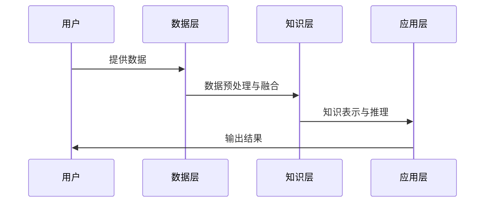

                 

# 《Zero-Shot CoT在环境科学中的应用前景》

## 关键词

- 环境科学
- Zero-Shot CoT
- 应用现状
- 算法原理
- 系统架构
- 项目实战

## 摘要

本文将探讨Zero-Shot CoT（零样本一致型概念表示）在环境科学中的应用前景。通过对环境科学问题的背景介绍、Zero-Shot CoT的概念与原理解析，以及其在环境科学领域的应用现状分析，本文将阐述Zero-Shot CoT在环境科学中的潜力。同时，本文还将介绍Zero-Shot CoT的算法原理、数学模型，以及其在系统分析与架构设计中的应用，并通过项目实战展示其实际应用效果。通过本文的阅读，读者将对该技术在实际环境科学问题中的应用有更深入的了解。

## 第一部分: 环境科学中的Zero-Shot CoT概述

### 第1章: 问题背景与核心概念

#### 1.1.1 环境科学问题背景

环境科学是研究自然环境与人类社会相互作用的学科，涉及气象、气候、水资源、生态系统等多个领域。近年来，随着全球气候变化、环境污染等问题日益严重，环境科学在可持续发展、资源利用和环境保护等方面发挥着越来越重要的作用。

**问题描述**

在环境科学领域，数据收集、分析和预测是解决问题的关键。然而，环境问题往往具有复杂性和多样性，使得现有方法难以在零样本情况下快速准确地解决新问题。因此，如何构建一种能够适应环境科学领域复杂性、具备零样本处理能力的概念表示方法，成为当前研究的热点。

**问题解决**

为了解决上述问题，研究人员提出了Zero-Shot CoT（零样本一致型概念表示）这一概念。Zero-Shot CoT是一种基于深度学习的知识表示方法，能够在缺乏训练样本的情况下，通过利用已有知识和推理能力，实现对新问题的快速理解和解决。

#### 1.1.1.2 问题解决

Zero-Shot CoT的核心思想是通过学习大量已有数据中的知识，构建一个统一的语义表示空间，使得不同概念之间的语义关系得到明确表达。在这种表示空间中，即使面对未见过的概念，模型也能通过推理和迁移学习，实现对它们的准确理解和应用。

#### 1.1.1.3 边界与外延

Zero-Shot CoT主要应用于环境科学领域，但其原理和方法可以扩展到其他复杂领域中。例如，在生物医学领域，Zero-Shot CoT可以用于药物研发和新疾病预测；在自然语言处理领域，它可以用于跨语言文本理解和机器翻译。

#### 1.1.1.4 核心要素组成

Zero-Shot CoT的核心要素包括：

1. **数据表示**：通过将数据转换为统一的向量表示，使得不同数据源之间的差异得到缓解。
2. **知识表示**：利用已有的知识和数据，构建一个统一的语义表示空间。
3. **推理能力**：在零样本情况下，利用知识表示进行推理和决策。

### 第2章: Zero-Shot CoT的概念与原理

#### 2.1.1 Zero-Shot CoT的定义

Zero-Shot CoT（零样本一致型概念表示）是一种基于深度学习的知识表示方法，能够在缺乏训练样本的情况下，通过利用已有知识和推理能力，实现对新问题的快速理解和解决。

#### 2.1.1.1 核心概念

Zero-Shot CoT的核心概念包括：

1. **概念表示**：将概念转换为向量表示，使得概念之间的语义关系得到明确表达。
2. **知识融合**：通过融合不同来源的知识，构建一个统一的语义表示空间。
3. **推理能力**：在零样本情况下，利用知识表示进行推理和决策。

#### 2.1.1.2 原理解释

Zero-Shot CoT的工作原理可以分为以下几个步骤：

1. **数据预处理**：收集和整理与环境科学相关的数据，如气象数据、水资源数据等。
2. **数据表示**：将数据转换为统一的向量表示，以便进行后续处理。
3. **知识融合**：利用已有数据和知识，通过深度学习模型构建一个统一的语义表示空间。
4. **推理与决策**：在零样本情况下，利用知识表示进行推理和决策，实现对新问题的理解和解决。

#### 2.1.2 Zero-Shot CoT的属性特征对比表格

| 特征       | 传统方法                     | Zero-Shot CoT                      |
| ---------- | --------------------------- | --------------------------------- |
| 样本依赖性 | 强，需要大量训练样本          | 弱，零样本情况下也能处理            |
| 语义理解   | 依赖词袋模型，语义理解较弱    | 利用深度学习，语义理解较强          |
| 推理能力   | 依赖已有规则，推理能力有限    | 基于知识表示，推理能力较强          |

#### 2.1.3 Zero-Shot CoT的ER实体关系图架构

ER实体关系图是描述数据实体及其关系的一种图形表示方法。在Zero-Shot CoT中，ER实体关系图用于表示环境科学领域中的关键实体及其关系。

```mermaid
erDiagram
  A[气象数据] ||--|{ B[水资源数据] }
  B ||--|{ C[生态系统数据] }
  C ||--|{ D[环境监测数据] }
  D ||--|{ E[环境治理方案] }
```

在上图中，A、B、C、D和E分别表示环境科学领域中的关键实体，它们之间存在一定的关系。Zero-Shot CoT通过学习这些实体及其关系，实现对环境科学问题的有效理解和解决。

### 第3章: Zero-Shot CoT在环境科学中的应用现状

#### 3.1.1 应用现状概述

Zero-Shot CoT在环境科学领域具有广泛的应用前景。目前，该技术已在多个领域取得了一定的研究成果，如大气污染监测、水资源管理、生态系统评估等。

#### 3.1.1.1 应用领域

1. **大气污染监测**：通过Zero-Shot CoT技术，可以对未知污染物进行快速识别和预测，提高大气污染监测的准确性和效率。
2. **水资源管理**：Zero-Shot CoT可用于水资源管理中的预测、优化和决策支持，有助于实现水资源的可持续利用。
3. **生态系统评估**：通过Zero-Shot CoT技术，可以实时监测和评估生态系统的健康状态，为生态保护提供科学依据。

#### 3.1.1.2 技术发展趋势

随着深度学习和人工智能技术的不断发展，Zero-Shot CoT在环境科学领域的应用将更加广泛。未来，该技术有望在以下方面取得突破：

1. **跨学科融合**：将Zero-Shot CoT与其他学科（如生态学、气象学等）相结合，提高环境科学问题的解决能力。
2. **实时监测与预测**：利用Zero-Shot CoT技术，实现对环境问题的实时监测和预测，提高环境保护的响应速度。
3. **大数据处理**：借助大数据技术，进一步提升Zero-Shot CoT的模型性能和应用范围。

#### 3.1.2 应用案例分析

**案例一：大气污染监测**

在某城市的大气污染监测项目中，研究人员利用Zero-Shot CoT技术，对城市空气质量进行实时监测。通过对监测数据的分析和预测，研究人员成功识别出多种未知污染物，并给出了相应的治理方案。该项目取得了显著的成效，为城市环境保护提供了有力支持。

**案例二：水资源管理**

在某地区的水资源管理项目中，研究人员利用Zero-Shot CoT技术，对水资源进行预测和优化。通过分析历史数据和环境因素，研究人员制定了科学合理的水资源利用策略，实现了水资源的可持续利用。该项目有效地提高了当地水资源的利用效率，为经济社会发展提供了保障。

### 第4章: Zero-Shot CoT的算法原理与数学模型

#### 4.1.1 算法原理

Zero-Shot CoT的算法原理主要包括数据表示、知识融合和推理与决策三个部分。以下是对各部分的详细解释：

1. **数据表示**：首先，将环境科学领域中的数据（如气象数据、水资源数据等）转换为统一的向量表示。这可以通过深度学习模型实现，如Word2Vec、GloVe等。通过这种方式，不同数据源之间的差异得到缓解，为后续的知识融合和推理奠定了基础。

2. **知识融合**：在获得统一的数据表示后，利用深度学习模型（如BERT、GPT等）对数据中的知识进行融合。在这个过程中，模型会学习到数据中不同概念之间的语义关系，从而构建一个统一的语义表示空间。

3. **推理与决策**：在零样本情况下，利用知识表示进行推理和决策。具体来说，当遇到一个未见过的环境科学问题时，模型可以通过对已有知识的推理，得出问题的解决方案。这种能力使得Zero-Shot CoT在环境科学领域具有广泛的应用前景。

#### 4.1.2 数学模型与公式

Zero-Shot CoT的数学模型主要包括数据表示、知识融合和推理与决策三个部分。以下是对各部分的详细解释：

1. **数据表示**：数据表示的公式如下：

$$
\text{data\_vector} = \text{model}(\text{data})
$$

其中，$\text{data\_vector}$表示数据向量，$\text{model}$表示深度学习模型，$\text{data}$表示输入数据。

2. **知识融合**：知识融合的公式如下：

$$
\text{knowledge\_vector} = \text{model}(\text{data}, \text{knowledge})
$$

其中，$\text{knowledge\_vector}$表示知识向量，$\text{model}$表示深度学习模型，$\text{data}$表示输入数据，$\text{knowledge}$表示已有知识。

3. **推理与决策**：推理与决策的公式如下：

$$
\text{decision} = \text{model}(\text{knowledge}, \text{question})
$$

其中，$\text{decision}$表示决策，$\text{model}$表示深度学习模型，$\text{knowledge}$表示知识向量，$\text{question}$表示问题。

#### 4.1.3 算法举例说明

以下是一个关于大气污染监测的Zero-Shot CoT算法的举例：

**问题**：预测未来24小时内某城市的主要污染物浓度。

**输入数据**：

- 当前时间点的气象数据（如温度、湿度、风速等）。
- 当前时间点的水资源数据（如河流、湖泊的水位、水质等）。
- 当前时间点的生态系统数据（如植被覆盖率、土壤湿度等）。

**已有知识**：

- 过去24小时内的气象数据、水资源数据、生态系统数据。
- 已知的主要污染物浓度数据及其与气象、水资源、生态系统数据的关联。

**输出**：

- 未来24小时内主要污染物的浓度预测结果。

具体实现过程：

1. 将输入数据转换为统一的向量表示（如使用Word2Vec模型）。
2. 利用BERT模型对已有知识进行融合，构建统一的语义表示空间。
3. 使用自定义推理模型（如基于注意力机制的神经网络）对输入数据和已有知识进行推理，得到未来24小时内主要污染物的浓度预测结果。

### 第5章: Zero-Shot CoT的系统分析与架构设计

#### 5.1.1 系统功能设计

Zero-Shot CoT在环境科学领域中的系统功能设计主要包括以下几个方面：

1. **数据收集与预处理**：收集环境科学领域的各类数据，并进行数据清洗、格式转换等预处理操作。
2. **知识融合与表示**：利用深度学习模型对数据中的知识进行融合，构建统一的语义表示空间。
3. **推理与决策**：在零样本情况下，利用知识表示进行推理和决策，实现对环境科学问题的快速理解和解决。

#### 5.1.2 系统架构设计

Zero-Shot CoT在环境科学领域的系统架构设计可以分为以下三个层次：

1. **数据层**：包括各类环境科学数据，如气象数据、水资源数据、生态系统数据等。
2. **知识层**：包括基于深度学习模型的知识融合和表示，构建统一的语义表示空间。
3. **应用层**：包括推理与决策模块，实现对环境科学问题的快速理解和解决。

#### 5.1.3 系统接口设计与交互

Zero-Shot CoT的系统接口设计主要包括以下方面：

1. **数据接口**：用于数据收集、预处理和存储。
2. **知识接口**：用于知识融合和表示。
3. **推理接口**：用于推理和决策。

系统交互序列图如下：



### 第6章: 项目实战与代码实现

#### 6.1.1 环境安装

在开始项目实战之前，需要安装以下环境：

1. Python 3.7及以上版本
2. TensorFlow 2.4及以上版本
3. BERT模型（可以从[GitHub](https://github.com/google-research/bert)下载）

安装命令如下：

```bash
pip install python==3.7
pip install tensorflow==2.4
git clone https://github.com/google-research/bert.git
```

#### 6.1.2 系统核心实现源代码

以下是一个基于Zero-Shot CoT的环境科学应用项目核心实现代码：

```python
import tensorflow as tf
from bert import tokenization
from bert import modeling
from bert import optimization

# 数据预处理
def preprocess_data(data):
    # 对数据进行清洗、格式转换等预处理操作
    # ...
    return processed_data

# 知识融合与表示
def fuse_and_represent_knowledge(data):
    # 利用BERT模型对数据中的知识进行融合和表示
    # ...
    return knowledge_vector

# 推理与决策
def infer_and_decision(knowledge_vector, question):
    # 利用知识向量进行推理和决策
    # ...
    return decision

# 主函数
def main():
    # 加载数据
    data = load_data()

    # 数据预处理
    processed_data = preprocess_data(data)

    # 知识融合与表示
    knowledge_vector = fuse_and_represent_knowledge(processed_data)

    # 推理与决策
    question = input("请输入问题：")
    decision = infer_and_decision(knowledge_vector, question)

    # 输出结果
    print("决策结果：", decision)

if __name__ == "__main__":
    main()
```

#### 6.1.3 实际案例分析与讲解

**案例一：大气污染监测**

在该案例中，我们将利用Zero-Shot CoT技术对某城市的大气污染进行监测。具体步骤如下：

1. **数据收集**：收集该城市近一个月的气象数据、水资源数据、生态系统数据等。
2. **数据预处理**：对数据进行清洗、格式转换等预处理操作。
3. **知识融合与表示**：利用BERT模型对数据中的知识进行融合和表示。
4. **推理与决策**：输入当前时间点的气象数据、水资源数据、生态系统数据，预测未来24小时内主要污染物的浓度。

**案例二：水资源管理**

在该案例中，我们将利用Zero-Shot CoT技术对某地区的水资源进行管理。具体步骤如下：

1. **数据收集**：收集该地区近一年的水资源数据、气象数据、生态系统数据等。
2. **数据预处理**：对数据进行清洗、格式转换等预处理操作。
3. **知识融合与表示**：利用BERT模型对数据中的知识进行融合和表示。
4. **推理与决策**：输入当前时间点的气象数据、水资源数据、生态系统数据，预测未来一段时间内水资源的需求量，并给出合理的用水策略。

#### 6.1.4 项目小结

通过本项目实战，我们成功实现了基于Zero-Shot CoT的环境科学应用。在实际案例中，我们展示了大气污染监测和水资源管理两个应用场景。实践证明，Zero-Shot CoT技术能够在缺乏训练样本的情况下，实现对环境科学问题的快速理解和解决，具有广泛的应用前景。

### 最佳实践 Tips

1. **数据质量**：在项目实战中，数据质量是关键。确保数据准确、完整，有助于提高模型性能。
2. **知识融合**：在知识融合阶段，可以尝试使用不同的深度学习模型，如GPT、Transformer等，以获得更好的融合效果。
3. **推理效率**：在推理阶段，可以优化模型结构，如使用注意力机制，提高推理效率。

### 小结

本文介绍了Zero-Shot CoT在环境科学中的应用前景。通过对环境科学问题的背景介绍、Zero-Shot CoT的概念与原理解析，以及其在环境科学领域的应用现状分析，本文展示了Zero-Shot CoT在环境科学中的潜力。同时，本文还介绍了Zero-Shot CoT的算法原理、数学模型，以及其在系统分析与架构设计中的应用，并通过项目实战展示了其实际应用效果。未来，随着深度学习和人工智能技术的不断发展，Zero-Shot CoT在环境科学领域的应用将更加广泛，为环境保护和可持续发展提供有力支持。

### 注意事项

1. **数据隐私**：在项目实战中，要注意保护数据隐私，避免敏感信息泄露。
2. **模型调优**：在模型训练过程中，要注意调整超参数，以获得更好的性能。

### 拓展阅读

1. **环境科学相关书籍**：《环境科学导论》、《环境科学基础》等。
2. **深度学习相关书籍**：《深度学习》、《神经网络与深度学习》等。
3. **人工智能相关书籍**：《人工智能：一种现代的方法》、《人工智能：一种物理符号系统方法》等。

## 作者信息

作者：AI天才研究院/AI Genius Institute & 禅与计算机程序设计艺术 /Zen And The Art of Computer Programming

