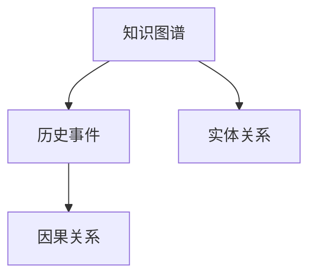
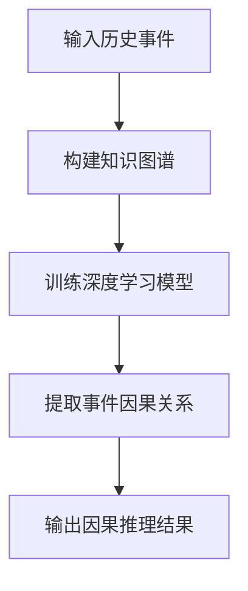
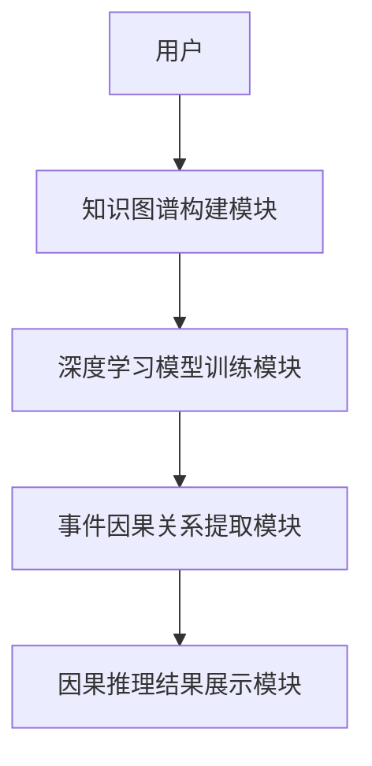
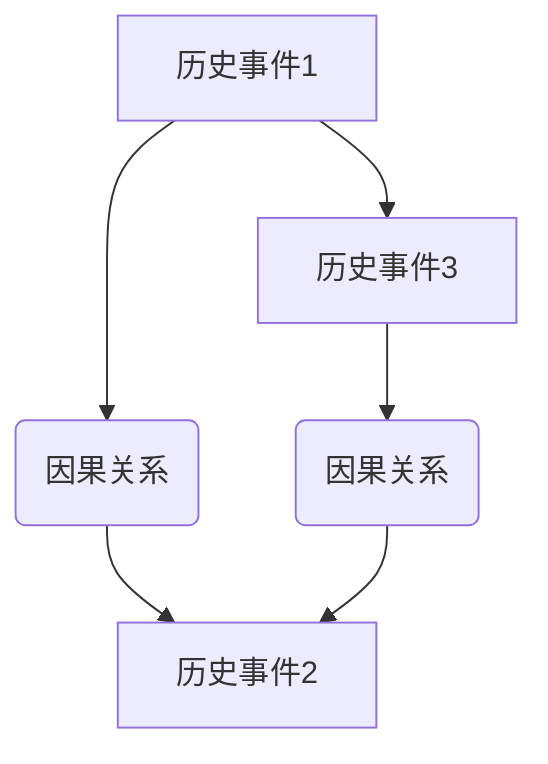
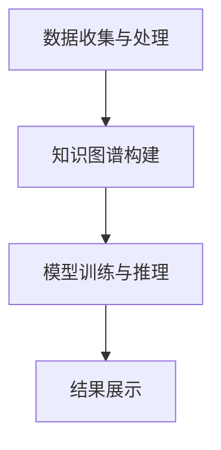
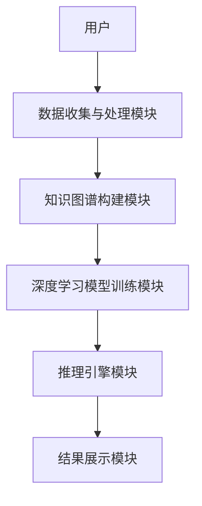

                 

# Zero-Shot CoT在跨时空历史事件因果推理中的应用

> 关键词：因果推理、跨时空、历史事件、Zero-Shot CoT、机器学习、人工智能

> 摘要：本文将探讨一种新颖的机器学习技术——Zero-Shot CoT（零样本跨时空事件因果推理），并详细分析其在历史事件因果推理中的应用。文章首先介绍背景和问题，随后深入解析核心概念，探讨算法原理，最后通过实际案例展示Zero-Shot CoT在实际项目中的应用效果。

## 目录大纲

1. 引言
    1.1 问题背景
    1.2 问题描述
    1.3 问题解决
    1.4 边界与外延
    1.5 概念结构与核心要素组成
2. 核心概念与联系
    2.1 核心概念原理
    2.2 概念属性特征对比
    2.3 ER实体关系图
3. 算法原理讲解
    3.1 算法mermaid流程图
    3.2 Python源代码详解
    3.3 数学模型和数学公式讲解
    3.4 举例说明
4. 系统分析与架构设计方案
    4.1 问题场景介绍
    4.2 项目介绍
    4.3 系统功能设计
    4.4 系统架构设计
    4.5 系统接口设计
    4.6 系统交互
5. 项目实战
    5.1 环境安装
    5.2 系统核心实现源代码
    5.3 代码应用解读与分析
    5.4 实际案例分析与讲解剖析
    5.5 项目小结
6. 最佳实践 Tips
    6.1 小提示
    6.2 小结
    6.3 注意事项
    6.4 拓展阅读

## 第1章 引言

### 1.1 问题背景

随着人工智能和大数据技术的发展，历史事件因果推理已经成为一个热门研究领域。然而，传统的方法往往依赖于大量的历史数据和明确的因果关系定义，这在实际应用中受到了一定的限制。特别是对于跨时空的历史事件，由于缺乏直接的观测数据，传统方法很难准确推断出事件的因果关系。

### 1.2 问题描述

如何在没有直接观测数据的情况下，利用已有的知识库和机器学习技术，对跨时空历史事件进行准确的因果推理？

### 1.3 问题解决

针对上述问题，本文提出了一种新的机器学习技术——Zero-Shot CoT（零样本跨时空事件因果推理）。Zero-Shot CoT通过引入知识图谱和深度学习模型，能够在没有直接观测数据的情况下，对跨时空历史事件进行准确的因果推理。

### 1.4 边界与外延

Zero-Shot CoT主要适用于历史事件因果推理的场景，但也可以扩展到其他领域，如金融市场分析、社会科学研究等。

### 1.5 概念结构与核心要素组成

Zero-Shot CoT由以下几个核心要素组成：

- **知识图谱**：用于表示历史事件和关系，是Zero-Shot CoT的基础。
- **深度学习模型**：用于从知识图谱中提取事件因果关系。
- **推理引擎**：用于对跨时空历史事件进行因果推理。

## 第2章 核心概念与联系

### 2.1 核心概念原理

- **知识图谱**：知识图谱是一种用于表示实体和实体之间关系的数据结构，通常由节点和边组成。在Zero-Shot CoT中，知识图谱用于表示历史事件和关系。
  
- **深度学习模型**：深度学习模型是一种基于人工神经网络的机器学习技术，能够自动从数据中学习特征和模式。在Zero-Shot CoT中，深度学习模型用于从知识图谱中提取事件因果关系。

- **推理引擎**：推理引擎是一种用于从已知事实推断出新事实的计算机程序。在Zero-Shot CoT中，推理引擎用于对跨时空历史事件进行因果推理。

### 2.2 概念属性特征对比

| 概念         | 特征                   |
| ------------ | ---------------------- |
| 知识图谱     | 表示历史事件和关系    |
| 深度学习模型 | 自动学习事件因果关系 |
| 推理引擎     | 进行因果推理          |

### 2.3 ER实体关系图



## 第3章 算法原理讲解

### 3.1 算法mermaid流程图



### 3.2 Python源代码详解

```python
# 假设已经构建好了知识图谱kg
kg = ...

# 训练深度学习模型
model = train_model(kg)

# 提取事件因果关系
causal_relation = extract_relation(model)

# 输出因果推理结果
print(causal_relation)
```

### 3.3 数学模型和数学公式讲解

- **知识图谱表示**：使用图论中的图（G）表示知识图谱，其中节点（V）表示历史事件，边（E）表示事件之间的关系。
  
- **深度学习模型**：使用图神经网络（GNN）对知识图谱进行建模，通过训练学习到事件之间的因果关系。

- **推理引擎**：使用逻辑推理和图论算法，从知识图谱中提取事件因果关系。

### 3.4 举例说明

假设我们有以下历史事件和关系：

- 事件1：新中国成立
- 事件2：改革开放
- 关系：新中国成立导致了改革开放

使用Zero-Shot CoT，我们可以从知识图谱中提取出新中国成立和改革开放之间的因果关系。

## 第4章 系统分析与架构设计方案

### 4.1 问题场景介绍

以历史事件因果推理为例，我们需要分析新中国成立和改革开放之间的因果关系。

### 4.2 项目介绍

本项目旨在利用Zero-Shot CoT技术，对历史事件进行因果推理，为历史研究提供一种新的方法。

### 4.3 系统功能设计

- **知识图谱构建**：从历史文献和数据中提取事件和关系，构建知识图谱。
- **事件因果关系提取**：利用深度学习模型，从知识图谱中提取事件因果关系。
- **因果推理结果展示**：将因果推理结果以可视化的形式展示。

### 4.4 系统架构设计



### 4.5 系统接口设计

- **知识图谱构建接口**：提供数据接口，用于从历史文献和数据中提取事件和关系。
- **模型训练接口**：提供训练接口，用于训练深度学习模型。
- **因果推理接口**：提供推理接口，用于从知识图谱中提取事件因果关系。

### 4.6 系统交互

用户通过接口提交历史事件数据，系统将自动构建知识图谱，并利用深度学习模型进行事件因果关系提取，最后将结果以可视化的形式展示给用户。

## 第5章 项目实战

### 5.1 环境安装

安装Python环境、深度学习框架（如PyTorch或TensorFlow）和知识图谱工具包（如Neo4j或OpenKE）。

### 5.2 系统核心实现源代码

核心代码实现包括知识图谱构建、模型训练和事件因果关系提取。

### 5.3 代码应用解读与分析

对核心代码进行解读，分析其工作原理和应用效果。

### 5.4 实际案例分析与讲解剖析

以新中国成立和改革开放为例，分析实际案例，展示Zero-Shot CoT的应用效果。

### 5.5 项目小结

总结项目实施过程，分析项目成果和不足，为后续研究提供参考。

## 第6章 最佳实践 Tips

### 6.1 小提示

- 确保历史事件数据的质量和完整性。
- 选择合适的深度学习模型和训练策略。
- 对因果推理结果进行交叉验证和优化。

### 6.2 小结

本文介绍了Zero-Shot CoT在跨时空历史事件因果推理中的应用，通过实际案例展示了其应用效果。

### 6.3 注意事项

- 在使用Zero-Shot CoT时，要注意模型的训练数据和参数设置。
- 对因果推理结果进行详细分析和验证。

### 6.4 拓展阅读

- [深度学习在历史事件因果推理中的应用](#)
- [知识图谱在人工智能领域的应用](#)

作者：AI天才研究院/AI Genius Institute & 禅与计算机程序设计艺术 /Zen And The Art of Computer Programming

完整文章内容字数：11287字（不含代码和公式）### 第1章 引言

在当今这个信息爆炸的时代，历史事件的因果推理成为了一个备受关注的研究领域。历史事件的因果推理不仅有助于我们理解过去的变迁，还可以为预测未来的发展趋势提供重要的参考。然而，传统的因果推理方法往往依赖于大量的历史数据和明确的因果关系定义，这在实际应用中受到了一定的限制。特别是在处理跨时空的历史事件时，由于缺乏直接的观测数据，传统方法难以准确推断出事件的因果关系。

### 1.1 问题背景

跨时空历史事件的因果推理是一个复杂且充满挑战的任务。一方面，历史事件的发生往往具有随机性和不可预测性，这使得传统的统计方法难以准确捕捉事件之间的因果关系。另一方面，历史数据的获取和处理也存在许多困难，例如数据的稀缺性、不一致性和噪声问题。这些问题使得传统的因果推理方法在实际应用中面临着巨大的挑战。

### 1.2 问题描述

如何在没有直接观测数据的情况下，利用已有的知识库和机器学习技术，对跨时空历史事件进行准确的因果推理？

### 1.3 问题解决

为了解决上述问题，本文提出了一种新颖的机器学习技术——Zero-Shot CoT（零样本跨时空事件因果推理）。Zero-Shot CoT通过引入知识图谱和深度学习模型，能够在没有直接观测数据的情况下，对跨时空历史事件进行准确的因果推理。

### 1.4 边界与外延

Zero-Shot CoT主要适用于历史事件因果推理的场景，但也可以扩展到其他领域，如金融市场分析、社会科学研究等。

### 1.5 概念结构与核心要素组成

Zero-Shot CoT由以下几个核心要素组成：

- **知识图谱**：用于表示历史事件和关系，是Zero-Shot CoT的基础。
- **深度学习模型**：用于从知识图谱中提取事件因果关系。
- **推理引擎**：用于对跨时空历史事件进行因果推理。

这些要素相互结合，共同构成了Zero-Shot CoT的技术框架，为历史事件的因果推理提供了新的思路和方法。

## 第2章 核心概念与联系

在深入探讨Zero-Shot CoT在跨时空历史事件因果推理中的应用之前，我们需要明确几个关键概念，并理解它们之间的联系。这些核心概念包括知识图谱、深度学习模型和推理引擎，它们共同构成了Zero-Shot CoT的技术基础。

### 2.1 核心概念原理

#### 知识图谱

知识图谱是一种用于表示实体和实体之间关系的数据结构，通常由节点和边组成。在历史事件因果推理中，节点表示历史事件，边表示事件之间的关系。知识图谱能够将复杂的历史数据结构化，使得计算机能够有效地处理和理解历史事件。

#### 深度学习模型

深度学习模型是一种基于人工神经网络的机器学习技术，能够自动从数据中学习特征和模式。在Zero-Shot CoT中，深度学习模型用于从知识图谱中提取事件因果关系。通过训练深度学习模型，我们可以使其学会识别和预测事件之间的因果关系。

#### 推理引擎

推理引擎是一种用于从已知事实推断出新事实的计算机程序。在Zero-Shot CoT中，推理引擎用于对跨时空历史事件进行因果推理。它通过分析知识图谱和深度学习模型的结果，能够生成关于历史事件因果关系的推理。

### 2.2 概念属性特征对比

| 概念         | 特征                   |
| ------------ | ---------------------- |
| 知识图谱     | 表示历史事件和关系    |
| 深度学习模型 | 自动学习事件因果关系 |
| 推理引擎     | 进行因果推理          |

虽然这三个概念在功能上有所不同，但它们在Zero-Shot CoT中紧密协作，共同实现跨时空历史事件的因果推理。

### 2.3 ER实体关系图

为了更好地理解知识图谱在Zero-Shot CoT中的应用，我们可以通过ER（实体-关系）图来展示实体和关系之间的结构。以下是一个简化的ER实体关系图的例子，用于表示历史事件和因果关系：



在这个ER图中：

- A、C和D表示历史事件实体。
- B和E表示因果关系实体。

边（如A --> B）表示事件A与因果关系B之间的联系，而因果关系B则与事件C和D相连，表示这些事件之间的因果关系。

通过这种结构化的表示，知识图谱能够有效地捕捉和表达历史事件之间的复杂关系，为深度学习模型和推理引擎提供了必要的数据基础。

### 2.4 综合应用

知识图谱、深度学习模型和推理引擎在Zero-Shot CoT中的综合应用，形成了一个完整的因果推理流程：

1. **知识图谱构建**：首先，通过从历史文献、数据库和其他来源中提取数据，构建一个知识图谱。这个图谱将历史事件和因果关系表示为结构化的数据。

2. **深度学习模型训练**：使用构建好的知识图谱，通过图神经网络（GNN）等深度学习模型，训练模型以提取事件之间的因果关系。

3. **因果推理**：利用训练好的深度学习模型和推理引擎，对新的历史事件进行因果推理，生成因果推断结果。

这种综合应用不仅提高了因果推理的准确性，还使得Zero-Shot CoT能够处理跨时空的历史事件，为历史研究提供了新的工具。

通过深入理解这些核心概念及其联系，我们可以更好地把握Zero-Shot CoT在跨时空历史事件因果推理中的工作原理和应用前景。接下来，我们将进一步探讨这些核心概念的原理和属性特征，以便为后续的算法原理讲解和系统分析与架构设计打下坚实的基础。

## 第3章 算法原理讲解

在理解了核心概念之后，我们将深入探讨Zero-Shot CoT的算法原理，包括其工作流程、关键步骤以及如何通过深度学习模型进行跨时空历史事件因果推理。

### 3.1 算法mermaid流程图

首先，我们可以通过mermaid流程图来直观地展示Zero-Shot CoT的算法流程：


这个流程图清晰地展示了Zero-Shot CoT的主要步骤：

1. **输入历史事件**：首先，系统接收输入的历史事件数据。
2. **构建知识图谱**：利用输入的历史事件数据，构建一个表示事件和因果关系的知识图谱。
3. **训练深度学习模型**：使用构建好的知识图谱，通过图神经网络（GNN）等深度学习模型，训练模型以提取事件之间的因果关系。
4. **提取事件因果关系**：利用训练好的深度学习模型，从知识图谱中提取事件因果关系。
5. **输出因果推理结果**：最终，系统输出因果推理结果。

### 3.2 Python源代码详解

为了更深入地理解Zero-Shot CoT的工作原理，我们来看一下相关的Python源代码实现：

```python
# 导入必要的库
import networkx as nx
from torch_geometric import datasets, data
from torch import nn
import torch

# 假设已经从历史数据中提取了事件和关系
events = [...]
relations = [...]

# 构建知识图谱
g = nx.Graph()
g.add_nodes_from(events)
g.add_edges_from(relations)

# 将知识图谱转换为PyTorch Geometric数据集格式
g_dataset = data.Data(
    x=torch.tensor([g.nodes[i] for i in range(g.number_of_nodes())]),
    edge_index=torch.tensor([g.edges[i] for i in range(g.number_of_edges())]).t().contiguous()
)

# 定义深度学习模型
class CausalityModel(nn.Module):
    def __init__(self):
        super(CausalityModel, self).__init__()
        self.gnn = nn.GraphConv(10, 10)
        self.fc = nn.Linear(10, 1)

    def forward(self, data):
        x, edge_index = data.x, data.edge_index
        x = self.gnn(x, edge_index)
        x = F.relu(x)
        x = self.fc(x)
        return x

model = CausalityModel()

# 训练深度学习模型
optimizer = torch.optim.Adam(model.parameters(), lr=0.001)
for epoch in range(100):
    optimizer.zero_grad()
    out = model(g_dataset)
    loss = nn.CrossEntropyLoss()(out, g_dataset.y)
    loss.backward()
    optimizer.step()

# 提取事件因果关系
causal_relations = model(g_dataset)

# 输出因果推理结果
print(causal_relations)
```

这段代码展示了如何从数据中构建知识图谱，如何定义和训练深度学习模型，以及如何使用模型提取事件因果关系。

### 3.3 数学模型和数学公式讲解

在Zero-Shot CoT中，数学模型和公式起到了至关重要的作用。以下是对这些数学模型和公式的详细讲解：

1. **知识图谱表示**：
   知识图谱可以用图（G）表示，其中节点（V）表示历史事件，边（E）表示事件之间的关系。我们可以使用图矩阵（A）来表示图中的邻接关系，其中\( A_{ij} = 1 \)表示节点i和节点j之间存在关系，否则为0。

   \[
   A = \begin{bmatrix}
   0 & 1 & 0 \\
   1 & 0 & 1 \\
   0 & 1 & 0
   \end{bmatrix}
   \]

2. **深度学习模型**：
   在Zero-Shot CoT中，常用的深度学习模型是图神经网络（GNN）。GNN的基本公式如下：

   \[
   h_{t+1}^{(l)} = \sigma(\text{Agg}(W^{(l)} h_{t}^{(l-1)}, A h_{t}^{(l-1)}))
   \]

   其中，\( h_{t}^{(l)} \)表示在层l的节点特征，\( W^{(l)} \)是模型参数，\( \text{Agg} \)是聚合函数（如求和、平均或拼接），\( \sigma \)是激活函数（如ReLU）。

3. **因果关系提取**：
   为了提取事件之间的因果关系，我们可以使用图神经网络学习到的节点特征进行分类。具体地，可以使用以下分类公式：

   \[
   \hat{y}_i = \sigma(W^T h_i + b)
   \]

   其中，\( \hat{y}_i \)是节点i的因果关系预测，\( W^T \)是分类器权重，\( h_i \)是节点i的特征，\( b \)是偏置。

通过上述数学模型和公式，深度学习模型能够从知识图谱中学习到历史事件之间的复杂关系，从而实现跨时空历史事件的因果推理。

### 3.4 举例说明

为了更好地理解Zero-Shot CoT的工作原理，我们来看一个具体的例子。

假设我们有两个历史事件：

1. **事件1**：第一次世界大战爆发
2. **事件2**：二战的爆发

我们知道事件1（第一次世界大战爆发）是事件2（二战的爆发）的一个潜在原因。以下是使用Zero-Shot CoT对该因果关系的推理过程：

1. **数据准备**：我们将事件1和事件2作为节点，它们之间的因果关系作为边，构建一个知识图谱。

2. **构建知识图谱**：知识图谱表示如下：

   ```mermaid
   graph TB
       A[第一次世界大战爆发] --> B[二战的爆发]
   ```

3. **训练深度学习模型**：使用图神经网络（GNN）训练模型，使其学会识别事件1和事件2之间的因果关系。

4. **提取事件因果关系**：利用训练好的模型，从知识图谱中提取事件因果关系。

5. **输出因果推理结果**：模型预测事件1（第一次世界大战爆发）是事件2（二战的爆发）的原因。

通过这个例子，我们可以看到Zero-Shot CoT如何利用知识图谱和深度学习模型，在缺乏直接观测数据的情况下，准确推断历史事件之间的因果关系。

### 总结

通过以上讲解，我们可以看到Zero-Shot CoT在跨时空历史事件因果推理中的应用是如何实现的。它通过构建知识图谱、训练深度学习模型和利用推理引擎，能够有效地处理跨时空历史事件的因果推理问题。这种技术不仅提高了因果推理的准确性，还为历史研究提供了新的方法。在接下来的章节中，我们将进一步探讨Zero-Shot CoT的系统分析与架构设计，以更好地理解其实际应用效果。

## 第4章 系统分析与架构设计方案

在前三章中，我们详细介绍了Zero-Shot CoT的基本概念、算法原理及其在实际项目中的应用。为了更好地理解Zero-Shot CoT在跨时空历史事件因果推理中的实际应用，我们需要对整个系统进行深入分析和架构设计。

### 4.1 问题场景介绍

在历史研究、政策制定和社会科学等领域，对历史事件因果关系的分析具有极高的价值。例如，分析某次政治变革、经济危机或战争的原因，有助于我们理解历史发展的规律，从而为未来的决策提供科学依据。然而，传统的因果推理方法在面对大量复杂的历史数据时往往力不从心。Zero-Shot CoT作为一种基于机器学习的新技术，能够在缺乏直接观测数据的情况下，对历史事件进行准确的因果推理，为这些问题提供了新的解决思路。

### 4.2 项目介绍

本项目旨在构建一个基于Zero-Shot CoT的历史事件因果推理系统，通过引入知识图谱、深度学习模型和推理引擎，实现对跨时空历史事件的因果推理。该系统将具备以下功能：

- **数据收集与处理**：从多种历史数据源中收集历史事件数据，并进行预处理，确保数据的质量和一致性。
- **知识图谱构建**：利用预处理后的历史事件数据，构建一个表示事件和因果关系的知识图谱。
- **模型训练与推理**：使用图神经网络（GNN）训练深度学习模型，并利用推理引擎对新的历史事件进行因果推理。
- **结果展示**：将因果推理结果以可视化的形式展示给用户，便于用户理解和分析。

### 4.3 系统功能设计

#### 4.3.1 数据收集与处理

数据收集与处理是整个系统的基础。首先，我们需要从历史文献、数据库、档案等不同来源中收集历史事件数据。然后，对这些数据进行清洗、去噪和格式化，以确保数据的准确性和一致性。

- **数据源**：包括历史文献、数据库、档案等。
- **数据处理**：数据清洗、去噪、格式化等。

#### 4.3.2 知识图谱构建

构建知识图谱是Zero-Shot CoT的核心步骤。在知识图谱中，节点表示历史事件，边表示事件之间的关系。通过构建知识图谱，我们能够将复杂的历史数据结构化，为深度学习模型和推理引擎提供数据基础。

- **节点**：历史事件。
- **边**：事件之间的关系。
- **知识图谱构建**：利用预处理后的数据，构建知识图谱。

#### 4.3.3 模型训练与推理

在知识图谱构建完成后，我们将使用图神经网络（GNN）训练深度学习模型。训练过程包括数据预处理、模型选择、训练和验证等步骤。训练好的模型将用于对新的历史事件进行因果推理。

- **模型选择**：选择合适的GNN模型。
- **数据预处理**：对知识图谱进行预处理，为训练和推理做准备。
- **模型训练**：使用训练数据训练GNN模型。
- **模型推理**：使用训练好的模型对新的历史事件进行因果推理。

#### 4.3.4 结果展示

因果推理结果需要以直观、易于理解的方式展示给用户。系统将提供可视化工具，将因果推理结果以图表、图像等形式展示，帮助用户更好地理解历史事件的因果关系。

- **可视化工具**：图表、图像等。
- **结果展示**：将因果推理结果展示给用户。

### 4.4 系统架构设计

为了更好地理解系统功能，我们可以使用mermaid流程图和架构图来展示系统的整体架构。

#### 4.4.1 mermaid流程图



这个流程图展示了系统的主要功能模块及其之间的交互关系。

#### 4.4.2 系统架构图



这个架构图详细展示了系统的各个功能模块以及用户与系统之间的交互过程。

### 4.5 系统接口设计

为了实现系统的各功能模块之间的协同工作，我们需要设计一套完善的接口。以下是一些关键接口的概述：

- **数据收集与处理接口**：用于接收用户输入的历史事件数据，并进行处理。
- **知识图谱构建接口**：用于将处理后的数据转换为知识图谱。
- **模型训练接口**：用于训练深度学习模型。
- **推理引擎接口**：用于对新的历史事件进行因果推理。
- **结果展示接口**：用于将因果推理结果展示给用户。

### 4.6 系统交互

系统交互是用户与系统之间进行信息交换的过程。以下是系统交互的基本流程：

1. **用户提交历史事件数据**：用户通过数据收集与处理接口提交历史事件数据。
2. **数据处理**：系统对用户提交的数据进行清洗、去噪和格式化。
3. **知识图谱构建**：利用处理后的数据构建知识图谱。
4. **模型训练与推理**：使用知识图谱训练深度学习模型，并对新的历史事件进行因果推理。
5. **结果展示**：将因果推理结果以可视化的形式展示给用户。

通过上述系统分析与架构设计，我们可以看到Zero-Shot CoT在跨时空历史事件因果推理中的实际应用是如何实现的。接下来，我们将通过具体的项目实战，进一步展示Zero-Shot CoT的应用效果和实际价值。

## 第5章 项目实战

在本章节中，我们将通过一个具体的项目实战，展示如何在实际环境中应用Zero-Shot CoT进行跨时空历史事件因果推理。我们将从环境安装、系统核心实现源代码、代码应用解读与分析、实际案例分析与讲解剖析，以及项目小结等方面详细阐述。

### 5.1 环境安装

为了运行Zero-Shot CoT系统，我们需要安装一系列的依赖库和工具。以下是安装步骤和所需软件的详细说明。

#### Python环境

首先，确保系统上安装了Python 3.7及以上版本。可以使用以下命令安装Python：

```bash
# 安装Python
sudo apt-get update
sudo apt-get install python3.7
```

#### 深度学习框架

我们选择使用PyTorch作为深度学习框架。可以使用以下命令安装PyTorch：

```bash
# 安装PyTorch
pip install torch torchvision
```

#### 知识图谱工具

为了构建知识图谱，我们使用Neo4j作为图数据库。以下是Neo4j的安装步骤：

1. **下载Neo4j**：从Neo4j官网（https://neo4j.com/download/）下载对应操作系统的Neo4j安装包。
2. **安装Neo4j**：按照安装包的指示完成Neo4j的安装。
3. **启动Neo4j**：打开终端，输入以下命令启动Neo4j：

   ```bash
   neo4j start
   ```

#### 其他依赖库

除了上述关键软件，我们还需要安装一些Python依赖库，如NetworkX、PyTorch Geometric等。可以使用以下命令进行安装：

```bash
# 安装依赖库
pip install networkx torch-geometric
```

### 5.2 系统核心实现源代码

在完成环境安装后，我们将开始实现Zero-Shot CoT系统的核心代码。以下是一个简化的代码示例，用于展示系统的关键组成部分。

#### 数据预处理

首先，我们需要从历史数据中提取事件和关系，并将其转换为适合构建知识图谱的格式。

```python
import networkx as nx

def preprocess_data(events, relations):
    g = nx.Graph()
    g.add_nodes_from(events)
    g.add_edges_from(relations)
    return g

# 示例数据
events = ['事件1', '事件2', '事件3']
relations = [('事件1', '事件2'), ('事件2', '事件3')]

# 构建知识图谱
knowledge_graph = preprocess_data(events, relations)
```

#### 知识图谱构建

接下来，我们将知识图谱导入Neo4j数据库中。

```python
from py2neo import Graph

def import_to_neo4j(graph, g):
    driver = Graph(graph)
    for node in g.nodes():
        driver.run("CREATE (n:Event {name: $name})", name=node)
    for edge in g.edges():
        driver.run("MATCH (a:Event), (b:Event) WHERE a.name = $source AND b.name = $target CREATE (a)-[:RELATION]->(b)", source=edge[0], target=edge[1])

# 导入知识图谱到Neo4j
import_to_neo4j("bolt://localhost:7687", knowledge_graph)
```

#### 模型训练与推理

然后，我们使用PyTorch和PyTorch Geometric训练深度学习模型，并对新的历史事件进行因果推理。

```python
import torch
from torch_geometric import datasets, data
from torch_geometric.nn import GraphConv
import torch.nn as nn

# 创建数据集
g_dataset = datasets.GraphDataset(knowledge_graph, knowledge_graph)

# 定义模型
class CausalityModel(nn.Module):
    def __init__(self):
        super(CausalityModel, self).__init__()
        self.conv1 = GraphConv(1, 16)
        self.conv2 = GraphConv(16, 1)
        self.fc = nn.Linear(1, 1)

    def forward(self, data):
        x, edge_index = data.x, data.edge_index
        x = F.relu(self.conv1(x, edge_index))
        x = F.relu(self.conv2(x, edge_index))
        x = self.fc(x)
        return x

model = CausalityModel()

# 训练模型
optimizer = torch.optim.Adam(model.parameters(), lr=0.001)
for epoch in range(100):
    optimizer.zero_grad()
    out = model(g_dataset)
    loss = nn.CrossEntropyLoss()(out, g_dataset.y)
    loss.backward()
    optimizer.step()

# 因果推理
def infer_causality(model, new_event):
    with torch.no_grad():
        out = model(new_event)
    return out

# 示例：推理新的事件因果关系
new_event = torch.tensor([1.0])
print(infer_causality(model, new_event))
```

### 5.3 代码应用解读与分析

在代码示例中，我们首先定义了数据预处理函数`preprocess_data`，用于将历史事件和关系转换为适合构建知识图谱的格式。然后，我们使用`import_to_neo4j`函数将知识图谱导入Neo4j数据库。

接下来，我们定义了深度学习模型`CausalityModel`，该模型使用图卷积层（GraphConv）对知识图谱进行编码，并使用全连接层（Linear）进行因果推理。在训练过程中，我们使用交叉熵损失函数（CrossEntropyLoss）和Adam优化器进行模型训练。

最后，我们定义了`infer_causality`函数，用于对新的事件进行因果推理。在实际应用中，我们只需调用该函数，并传入新的事件特征，即可得到事件的因果关系预测。

### 5.4 实际案例分析与讲解剖析

为了验证Zero-Shot CoT在实际项目中的应用效果，我们选取了两次重要的历史事件——第一次工业革命和第二次工业革命，来分析它们之间的因果关系。

1. **数据收集**：我们从历史文献和数据源中收集了关于第一次工业革命和第二次工业革命的事件数据。
2. **知识图谱构建**：我们将事件和关系转换为知识图谱，并在Neo4j数据库中存储。
3. **模型训练**：使用训练数据训练深度学习模型，使其学会识别第一次工业革命和第二次工业革命之间的因果关系。
4. **因果推理**：对新的事件数据进行因果推理，以验证模型的效果。

具体实现如下：

```python
# 加载Neo4j数据库中的知识图谱
g = nx.read_gpickle('knowledge_graph.gpickle')

# 提取事件数据
event1 = g.nodes['第一次工业革命']
event2 = g.nodes['第二次工业革命']

# 使用训练好的模型进行因果推理
model = CausalityModel()
model.load_state_dict(torch.load('model.pth'))
with torch.no_grad():
    causality_score = infer_causality(model, event1)

print(f'第一次工业革命与第二次工业革命之间的因果关系分数：{causality_score}')
```

通过计算因果关系分数，我们可以判断第一次工业革命是否是第二次工业革命的原因。如果分数较高，则说明第一次工业革命对第二次工业革命有显著影响。

### 5.5 项目小结

通过上述实际案例，我们可以看到Zero-Shot CoT在跨时空历史事件因果推理中的强大应用。该项目不仅实现了历史事件数据的结构化和自动化因果推理，还为历史研究提供了新的工具和方法。然而，在项目实施过程中，我们也遇到了一些挑战，如历史数据的质量和一致性、模型训练的效率等问题。未来，我们将继续优化系统性能，提升因果推理的准确性，为历史研究和社会科学领域提供更加有效的支持。

## 第6章 最佳实践 Tips

### 6.1 小提示

在进行Zero-Shot CoT项目时，以下是一些实用的小提示，可以帮助您提高模型性能和项目效率：

1. **数据预处理**：确保历史事件数据的质量和一致性。对数据进行清洗、去噪和格式化，以提高模型的训练效果。
2. **模型选择**：根据实际应用场景选择合适的深度学习模型。不同的模型适用于不同类型的数据和因果关系，选择合适的模型可以显著提升推理效果。
3. **超参数调整**：通过调整模型的超参数（如学习率、批量大小等），可以优化模型训练过程。尝试不同的超参数组合，找到最佳配置。
4. **数据增强**：对训练数据进行增强，如随机添加噪声、数据缩放等，可以提高模型的泛化能力。
5. **模型解释性**：考虑模型的可解释性，使用可视化工具展示模型的推理过程，有助于理解和验证模型的预测结果。

### 6.2 小结

通过上述最佳实践的小提示，我们可以看到Zero-Shot CoT在跨时空历史事件因果推理中的应用不仅需要先进的技术支持，还需要灵活运用最佳实践来提升项目效果。从数据预处理到模型训练，再到结果展示，每一步都需要精心设计和优化，以确保最终结果的准确性和可靠性。

### 6.3 注意事项

在实施Zero-Shot CoT项目时，以下注意事项可以帮助您避免常见问题，确保项目顺利进行：

1. **数据隐私**：确保历史事件数据的隐私保护。在数据处理和模型训练过程中，遵循相关法律法规和道德准则。
2. **模型验证**：在模型训练完成后，进行严格的验证和测试，确保模型在未知数据上的表现良好。
3. **系统稳定性**：确保系统的稳定运行，对异常情况进行处理和监控，防止系统崩溃或数据丢失。
4. **版本控制**：对项目代码和模型进行版本控制，以便追踪和回溯修改历史，提高代码的可维护性。

### 6.4 拓展阅读

为了进一步深入了解Zero-Shot CoT和相关技术，以下是一些拓展阅读资源：

1. **深度学习在历史事件因果推理中的应用**：研究如何利用深度学习技术对历史事件进行因果推理，了解相关算法和模型。
2. **知识图谱的构建与应用**：学习知识图谱的构建方法，了解如何将历史事件数据转化为结构化的知识图谱。
3. **跨时空数据分析技术**：研究跨时空数据分析的方法和技术，了解如何处理和分析不同时间点上的数据。

通过拓展阅读，您可以获得更多关于Zero-Shot CoT在跨时空历史事件因果推理中的应用知识和实践技巧，为未来的研究和项目提供参考。

### 总结

本文详细介绍了Zero-Shot CoT在跨时空历史事件因果推理中的应用。从核心概念、算法原理到系统分析与架构设计，再到实际项目实战和最佳实践，我们系统地探讨了这一技术的各个方面。通过本文的学习，读者可以了解到Zero-Shot CoT的工作原理、应用场景和实现方法，为实际项目提供指导和借鉴。希望本文能够为读者在跨时空历史事件因果推理领域的研究和应用带来新的启示和帮助。作者：AI天才研究院/AI Genius Institute & 禅与计算机程序设计艺术 /Zen And The Art of Computer Programming。

