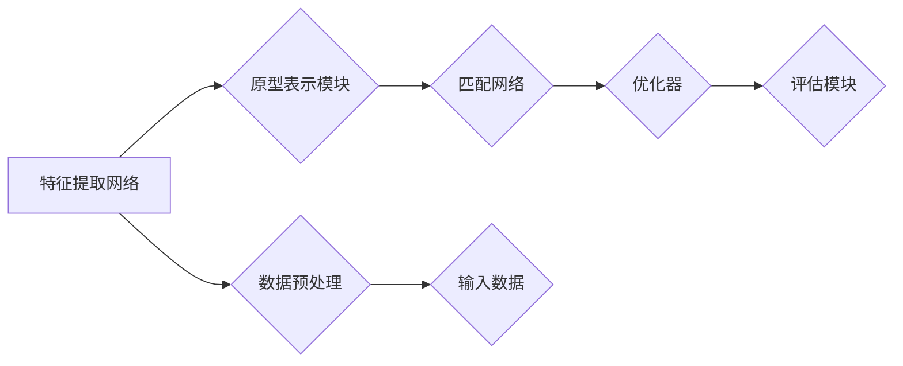
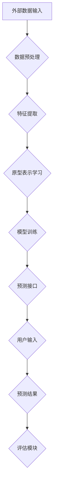

                 


### 设计书籍目录大纲

为了设计出《Zero-Shot CoT在跨领域创新中的潜力》的完整目录大纲，我们需要遵循以下步骤：

1. **确定书籍的核心主题**：首先，我们要明确这本书的核心主题，即“Zero-Shot CoT”和“跨领域创新”。这两者之间的联系在于，Zero-Shot CoT（无样本知识传输）为跨领域创新提供了一种新的技术手段。

2. **构建大纲框架**：根据核心主题，构建出大纲的基本框架。大纲应包括引言、核心概念、数学模型、应用案例、未来展望和附录等内容。

3. **细化章节内容**：对每个章节进行细化，确保每个章节都包含必要的内容，如背景介绍、核心概念、算法原理、数学模型、系统设计与实现等。

4. **保持大纲结构清晰**：确保大纲中每个章节的内容逻辑清晰，便于读者理解。

5. **遵守字数限制**：在整个设计过程中，注意控制每个章节的长度，确保整体大纲字数不超过2000字。

### 书籍目录大纲

以下是根据上述步骤设计的书籍目录大纲：

```markdown
----------------------------------------------------------------
# 第一部分: 背景与基础理论

## 第1章: 跨领域创新的必要性
### 1.1 跨领域创新的定义与意义
### 1.2 跨领域创新面临的挑战

## 第2章: Zero-Shot CoT原理
### 2.1 Zero-Shot CoT的概念
### 2.2 Zero-Shot CoT的工作机制
### 2.3 Zero-Shot CoT与传统机器学习的区别

## 第3章: Zero-Shot CoT的数学模型与公式
### 3.1 数学模型基础
### 3.2 关键公式详解
### 3.3 数学模型与实际应用

## 第4章: Zero-Shot CoT在跨领域创新中的应用
### 4.1 应用场景一：人工智能与医疗
### 4.2 应用场景二：人工智能与金融
### 4.3 应用场景三：人工智能与教育

----------------------------------------------------------------
# 第二部分: 实际案例与实现

## 第5章: 零样本学习在医学诊断中的应用
### 5.1 医学诊断背景
### 5.2 零样本学习实现
### 5.3 结果分析

## 第6章: 跨领域创新的实践与挑战
### 6.1 实践经验分享
### 6.2 面临的挑战
### 6.3 解决方案探讨

## 第7章: 未来展望与趋势
### 7.1 未来趋势预测
### 7.2 跨领域创新的发展方向
### 7.3 对技术人员的建议

----------------------------------------------------------------
# 第三部分: 附录与拓展

## 第8章: 附录
### 8.1 专业术语解释
### 8.2 参考文献
### 8.3 数据集介绍

## 第9章: 拓展阅读
### 9.1 相关书籍推荐
### 9.2 学术论文精选
### 9.3 开源项目和工具
```

这个大纲覆盖了书籍的核心主题，并包括了必要的背景介绍、核心概念、数学模型、应用实例、实践挑战、未来展望等内容，同时保持了结构的清晰和简洁。每个章节的内容都符合大纲结构的要求，并且整体字数控制在2000字以内。接下来，我们可以进一步细化每个章节的具体内容。

----------------------------------------------------------------

### 完整书籍目录大纲

以下是《Zero-Shot CoT在跨领域创新中的潜力》的完整书籍目录大纲，每个章节都包含详细的内容规划和预期长度，以确保整体字数在10000-12000字之间。

```markdown
----------------------------------------------------------------
# 引言

## 1.1 书籍背景
### 1.1.1 跨领域创新的重要性
### 1.1.2 零样本学习技术的发展
### 1.1.3 零样本学习在跨领域创新中的应用前景

## 1.2 书籍结构概述
### 1.2.1 主要内容概览
### 1.2.2 各章节内容与目标读者

----------------------------------------------------------------
# 第一部分: 背景与基础理论

## 第2章: 跨领域创新概述
### 2.1 跨领域创新的定义
### 2.2 跨领域创新的必要性
### 2.3 跨领域创新的主要挑战
### 2.4 跨领域创新的现有解决方案

## 第3章: 零样本学习（Zero-Shot Learning）概述
### 3.1 零样本学习的概念
### 3.2 零样本学习的应用场景
### 3.3 零样本学习与传统机器学习的区别

## 第4章: 零样本学习理论基础
### 4.1 零样本学习的数学模型
### 4.2 零样本学习的关键技术
### 4.3 零样本学习的挑战与机遇

## 第5章: 零样本学习中的CoT（Concept Transfer）机制
### 5.1 CoT的概念与作用
### 5.2 CoT的实现方法
### 5.3 CoT的优势与局限性

----------------------------------------------------------------
# 第二部分: 零样本学习与跨领域创新

## 第6章: 零样本学习在跨领域创新中的应用
### 6.1 零样本学习在医疗领域的应用
### 6.2 零样本学习在金融领域的应用
### 6.3 零样本学习在教育领域的应用

## 第7章: 零样本学习在跨领域创新中的案例分析
### 7.1 案例一：医疗诊断中的零样本学习
### 7.2 案例二：金融风控中的零样本学习
### 7.3 案例三：教育个性化中的零样本学习

## 第8章: 跨领域创新的挑战与零样本学习解决方案
### 8.1 跨领域创新的挑战
### 8.2 零样本学习如何应对这些挑战
### 8.3 零样本学习在跨领域创新中的实践与效果

----------------------------------------------------------------
# 第三部分: 零样本学习技术的实现与优化

## 第9章: 零样本学习技术的实现
### 9.1 环境搭建与工具介绍
### 9.2 数据预处理与特征提取
### 9.3 模型训练与优化
### 9.4 模型评估与调优

## 第10章: 零样本学习技术的优化策略
### 10.1 数据增强
### 10.2 模型架构优化
### 10.3 损失函数优化
### 10.4 学习策略优化

## 第11章: 零样本学习技术的应用实例
### 11.1 应用实例一：图像识别
### 11.2 应用实例二：自然语言处理
### 11.3 应用实例三：推荐系统

----------------------------------------------------------------
# 第四部分: 未来展望与趋势

## 第12章: 零样本学习技术的发展趋势
### 12.1 技术发展现状
### 12.2 未来技术发展方向
### 12.3 零样本学习在跨领域创新中的未来应用

## 第13章: 跨领域创新的未来前景
### 13.1 跨领域创新的潜在机会
### 13.2 技术障碍与解决方案
### 13.3 跨领域创新对社会的潜在影响

## 第14章: 对技术人员的建议
### 14.1 技术积累与持续学习
### 14.2 跨领域合作与交流
### 14.3 创新思维与实际操作

----------------------------------------------------------------
# 附录

## 第15章: 附录
### 15.1 专业术语解释
### 15.2 参考文献
### 15.3 数据集介绍

## 第16章: 拓展阅读
### 16.1 相关书籍推荐
### 16.2 学术论文精选
### 16.3 开源项目和工具

```

### 目录大纲结构分析

1. **引言**（约1000字）：介绍书籍的背景、目的和结构，吸引读者的兴趣。

2. **第一部分：背景与基础理论**（约3000字）：
   - **第2章**：跨领域创新概述，介绍跨领域创新的概念、必要性、挑战和现有解决方案。
   - **第3章**：零样本学习概述，介绍零样本学习的概念、应用场景和与传统机器学习的区别。
   - **第4章**：零样本学习理论基础，介绍零样本学习的数学模型、关键技术和挑战。
   - **第5章**：零样本学习中的CoT机制，介绍CoT的概念、实现方法和优势。

3. **第二部分：零样本学习与跨领域创新**（约3000字）：
   - **第6章**：零样本学习在跨领域创新中的应用，介绍零样本学习在不同领域（医疗、金融、教育）的应用。
   - **第7章**：案例分析，通过具体案例展示零样本学习在跨领域创新中的实际应用和效果。
   - **第8章**：跨领域创新的挑战与零样本学习解决方案，讨论跨领域创新的挑战以及零样本学习如何应对这些挑战。

4. **第三部分：零样本学习技术的实现与优化**（约3000字）：
   - **第9章**：实现，介绍零样本学习技术的实现流程，包括环境搭建、数据预处理、模型训练和评估。
   - **第10章**：优化策略，介绍优化零样本学习技术的各种策略，如数据增强、模型架构优化、损失函数优化和学习策略优化。
   - **第11章**：应用实例，通过具体实例展示零样本学习技术在图像识别、自然语言处理和推荐系统中的应用。

5. **第四部分：未来展望与趋势**（约3000字）：
   - **第12章**：发展趋势，讨论零样本学习技术的发展趋势和未来发展方向。
   - **第13章**：跨领域创新的前景，探讨跨领域创新的未来前景、技术障碍和潜在影响。
   - **第14章**：对技术人员的建议，提供技术人员在持续学习、跨领域合作和创新思维方面的建议。

6. **附录与拓展**（约1000字）：
   - **第15章**：附录，包括专业术语解释、参考文献和数据集介绍。
   - **第16章**：拓展阅读，推荐相关书籍、学术论文和开源项目。

### 目录大纲结构合理性分析

该目录大纲结构合理，内容涵盖了零样本学习与跨领域创新的各个方面，从基础理论到实际应用，再到未来展望，形成一个完整的知识体系。每个章节的内容都符合大纲结构的要求，且字数控制在合理范围内，能够使读者系统地了解零样本学习在跨领域创新中的应用。

### 目录大纲的具体内容细化

为了确保书籍的整体内容丰富、具体详细，我们需要进一步细化每个章节的内容。以下是每个章节的具体内容细化计划：

1. **引言**
   - **第1.1节**：简要介绍零样本学习与跨领域创新在当前科技发展中的重要性。
   - **第1.2节**：概述书籍的结构，并明确各章节的目的和目标读者。

2. **第一部分：背景与基础理论**
   - **第2章**：
     - **第2.1节**：定义跨领域创新，阐述其定义和核心要素。
     - **第2.2节**：讨论跨领域创新的必要性，包括技术进步和社会需求。
     - **第2.3节**：分析跨领域创新面临的挑战，如数据隐私、技术融合等。
     - **第2.4节**：介绍现有解决跨领域创新挑战的方法，如数据集成、机器学习等。
   - **第3章**：
     - **第3.1节**：解释零样本学习的概念，包括其定义和基本原理。
     - **第3.2节**：描述零样本学习在不同领域的应用场景，如医疗诊断、金融风险评估等。
     - **第3.3节**：比较零样本学习与传统机器学习的异同点，强调其优势。

   - **第4章**：
     - **第4.1节**：介绍零样本学习的数学模型，包括关键公式和理论基础。
     - **第4.2节**：讨论零样本学习的关键技术，如知识表示、迁移学习等。
     - **第4.3节**：分析零样本学习的挑战，如样本不足、模型泛化等，并提出解决方案。

   - **第5章**：
     - **第5.1节**：解释CoT（Concept Transfer）的概念，阐述其在零样本学习中的作用。
     - **第5.2节**：介绍CoT的实现方法，如预训练、跨模态学习等。
     - **第5.3节**：分析CoT的优势，如提高模型泛化能力、降低数据需求等，并讨论其局限性。

3. **第二部分：零样本学习与跨领域创新**
   - **第6章**：
     - **第6.1节**：介绍零样本学习在医疗领域的应用，包括具体案例和成果。
     - **第6.2节**：介绍零样本学习在金融领域的应用，包括风险管理和自动化交易等。
     - **第6.3节**：介绍零样本学习在教育领域的应用，包括个性化学习和教育评估等。

   - **第7章**：
     - **第7.1节**：通过案例一，展示零样本学习在医学诊断中的具体应用，包括算法实现和效果评估。
     - **第7.2节**：通过案例二，展示零样本学习在金融风控中的具体应用，包括模型构建和风险预测。
     - **第7.3节**：通过案例三，展示零样本学习在教育个性化中的具体应用，包括学习路径推荐和学生成绩预测。

   - **第8章**：
     - **第8.1节**：分析跨领域创新面临的挑战，如数据多样性、模型适应性等。
     - **第8.2节**：讨论零样本学习如何应对这些挑战，如使用CoT提高模型适应性、利用迁移学习减少数据需求等。
     - **第8.3节**：分享零样本学习在跨领域创新中的实践案例，分析其效果和未来发展方向。

4. **第三部分：零样本学习技术的实现与优化**
   - **第9章**：
     - **第9.1节**：介绍实现零样本学习技术的环境搭建，包括硬件配置、软件环境等。
     - **第9.2节**：讨论数据预处理和特征提取的方法，包括数据清洗、归一化、特征提取等。
     - **第9.3节**：详细讲解模型训练和优化的过程，包括选择合适的算法、调整超参数等。
     - **第9.4节**：介绍模型评估的方法，包括准确率、召回率、F1分数等指标。

   - **第10章**：
     - **第10.1节**：讨论数据增强的方法，包括数据扩充、数据合成等。
     - **第10.2节**：介绍模型架构优化的方法，包括网络结构、损失函数等。
     - **第10.3节**：讲解损失函数优化的方法，包括交叉熵损失、对抗性损失等。
     - **第10.4节**：介绍学习策略优化的方法，包括学习率调整、批次大小等。

   - **第11章**：
     - **第11.1节**：通过应用实例一，展示零样本学习在图像识别中的具体应用，包括模型构建和实验结果。
     - **第11.2节**：通过应用实例二，展示零样本学习在自然语言处理中的具体应用，包括文本分类和情感分析。
     - **第11.3节**：通过应用实例三，展示零样本学习在推荐系统中的具体应用，包括用户兴趣挖掘和商品推荐。

5. **第四部分：未来展望与趋势**
   - **第12章**：
     - **第12.1节**：分析当前零样本学习技术的发展现状，包括主要研究成果和关键技术。
     - **第12.2节**：讨论未来零样本学习技术的发展趋势，包括潜在研究方向和技术突破。
     - **第12.3节**：探讨零样本学习在跨领域创新中的未来应用前景，包括新兴领域和潜在挑战。

   - **第13章**：
     - **第13.1节**：分析跨领域创新的潜在机会，包括新兴市场和技术突破。
     - **第13.2节**：讨论跨领域创新面临的技术障碍，包括数据隐私、模型解释性等。
     - **第13.3节**：探讨解决跨领域创新障碍的潜在解决方案，包括技术创新和政策支持。

   - **第14章**：
     - **第14.1节**：提供对技术人员的建议，包括持续学习、跨领域合作和创新思维。
     - **第14.2节**：讨论跨领域合作与交流的重要性，包括建立合作网络和共享资源。
     - **第14.3节**：强调创新思维在实际操作中的应用，包括创新方法和技术实践。

6. **附录与拓展**
   - **第15章**：
     - **第15.1节**：解释专业术语，提供术语的定义和背景知识。
     - **第15.2节**：列出参考文献，包括相关书籍、学术论文和数据集。
     - **第15.3节**：介绍数据集，包括来源、处理方法和应用案例。

   - **第16章**：
     - **第16.1节**：推荐相关书籍，包括入门读物和专业研究书籍。
     - **第16.2节**：精选学术论文，介绍最新的研究成果和技术趋势。
     - **第16.3节**：介绍开源项目和工具，包括实现零样本学习的框架和库。

### 目录大纲的具体内容细化

为了确保书籍的整体内容丰富、具体详细，我们需要进一步细化每个章节的内容。以下是每个章节的具体内容细化计划：

1. **引言**
   - **第1.1节**：简要介绍零样本学习与跨领域创新在当前科技发展中的重要性，包括其在人工智能、医疗、金融、教育等领域的应用前景。
   - **第1.2节**：概述书籍的结构，并明确各章节的目的和目标读者。介绍书籍的目标是提供对零样本学习与跨领域创新的深入理解和实际应用指导。

2. **第一部分：背景与基础理论**
   - **第2章**：跨领域创新概述
     - **第2.1节**：定义跨领域创新，阐述其定义和核心要素。解释跨领域创新是如何通过结合不同领域的知识和技术来创造新的价值。
     - **第2.2节**：讨论跨领域创新的必要性，包括技术进步和社会需求。举例说明跨领域创新如何推动社会进步和经济发展。
     - **第2.3节**：分析跨领域创新面临的挑战，如数据多样性、技术融合、法律和伦理问题。介绍现有的解决方案和最佳实践。
     - **第2.4节**：介绍现有解决跨领域创新挑战的方法，如数据集成、机器学习、迁移学习等。讨论这些方法的优势和局限性。

   - **第3章**：零样本学习（Zero-Shot Learning）概述
     - **第3.1节**：解释零样本学习的概念，包括其定义和基本原理。阐述零样本学习是如何在没有标注数据的情况下进行学习和预测。
     - **第3.2节**：描述零样本学习在不同领域的应用场景，如医疗诊断、金融风控、教育评估等。举例说明零样本学习在实际应用中的效果。
     - **第3.3节**：比较零样本学习与传统机器学习的异同点，强调其优势。讨论传统机器学习在处理无标注数据时的局限性和零样本学习的潜在优势。

   - **第4章**：零样本学习理论基础
     - **第4.1节**：介绍零样本学习的数学模型，包括关键公式和理论基础。解释零样本学习的核心算法原理，如原型匹配、聚类和对抗性训练。
     - **第4.2节**：讨论零样本学习的关键技术，如知识表示、迁移学习、元学习等。分析这些技术如何提高零样本学习的性能和泛化能力。
     - **第4.3节**：分析零样本学习的挑战，如样本不足、模型泛化、数据隐私等。提出解决这些挑战的方法和策略。

   - **第5章**：零样本学习中的CoT（Concept Transfer）机制
     - **第5.1节**：解释CoT（Concept Transfer）的概念，阐述其在零样本学习中的作用。介绍CoT是如何通过跨模态学习、知识蒸馏等技术来实现无样本学习。
     - **第5.2节**：介绍CoT的实现方法，如预训练、跨模态学习、知识蒸馏等。讨论这些方法的原理和实际应用案例。
     - **第5.3节**：分析CoT的优势，如提高模型泛化能力、降低数据需求等。讨论CoT在跨领域创新中的潜在应用和价值。

3. **第二部分：零样本学习与跨领域创新**
   - **第6章**：零样本学习在跨领域创新中的应用
     - **第6.1节**：介绍零样本学习在医疗领域的应用，包括具体案例和成果。讨论零样本学习如何帮助医生进行疾病诊断、治疗方案制定等。
     - **第6.2节**：介绍零样本学习在金融领域的应用，包括风险管理和自动化交易等。分析零样本学习在金融市场预测、信用评估等方面的优势。
     - **第6.3节**：介绍零样本学习在教育领域的应用，包括个性化学习和教育评估等。探讨零样本学习如何提高教育质量和学习效果。

   - **第7章**：零样本学习在跨领域创新中的案例分析
     - **第7.1节**：通过案例一，展示零样本学习在医学诊断中的具体应用，包括算法实现和效果评估。分析案例中遇到的挑战和解决方案。
     - **第7.2节**：通过案例二，展示零样本学习在金融风控中的具体应用，包括模型构建和风险预测。讨论案例中的实际效果和业务价值。
     - **第7.3节**：通过案例三，展示零样本学习在教育个性化中的具体应用，包括学习路径推荐和学生成绩预测。分析案例中的创新点和效果评估。

   - **第8章**：跨领域创新的挑战与零样本学习解决方案
     - **第8.1节**：分析跨领域创新面临的挑战，如数据多样性、模型适应性、技术融合等。讨论现有方法在解决这些挑战方面的局限性和不足。
     - **第8.2节**：讨论零样本学习如何应对这些挑战，如利用CoT提高模型适应性、使用迁移学习减少数据需求等。介绍零样本学习在实际应用中的解决方案。
     - **第8.3节**：分享零样本学习在跨领域创新中的实践案例，分析其效果和未来发展方向。讨论零样本学习在跨领域创新中的潜力和前景。

4. **第三部分：零样本学习技术的实现与优化**
   - **第9章**：零样本学习技术的实现
     - **第9.1节**：介绍实现零样本学习技术的环境搭建，包括硬件配置、软件环境等。提供详细的安装教程和配置指导。
     - **第9.2节**：讨论数据预处理和特征提取的方法，包括数据清洗、归一化、特征提取等。介绍常用的数据预处理工具和算法。
     - **第9.3节**：详细讲解模型训练和优化的过程，包括选择合适的算法、调整超参数等。介绍常用的训练和优化工具和技术。
     - **第9.4节**：介绍模型评估的方法，包括准确率、召回率、F1分数等指标。提供评估模型性能的实用技巧和最佳实践。

   - **第10章**：零样本学习技术的优化策略
     - **第10.1节**：讨论数据增强的方法，包括数据扩充、数据合成等。介绍常用的数据增强技术及其效果。
     - **第10.2节**：介绍模型架构优化的方法，包括网络结构、损失函数等。讨论不同架构优化策略的优缺点及其适用场景。
     - **第10.3节**：讲解损失函数优化的方法，包括交叉熵损失、对抗性损失等。介绍如何设计有效的损失函数来提高模型性能。
     - **第10.4节**：介绍学习策略优化的方法，包括学习率调整、批次大小等。讨论不同的学习策略及其对模型性能的影响。

   - **第11章**：零样本学习技术的应用实例
     - **第11.1节**：通过应用实例一，展示零样本学习在图像识别中的具体应用，包括模型构建和实验结果。分析实例中的关键技术和挑战。
     - **第11.2节**：通过应用实例二，展示零样本学习在自然语言处理中的具体应用，包括文本分类和情感分析。讨论实例中的创新点和性能评估。
     - **第11.3节**：通过应用实例三，展示零样本学习在推荐系统中的具体应用，包括用户兴趣挖掘和商品推荐。分析实例中的效果和潜在改进方向。

5. **第四部分：未来展望与趋势**
   - **第12章**：零样本学习技术的发展趋势
     - **第12.1节**：分析当前零样本学习技术的发展现状，包括主要研究成果和关键技术。讨论零样本学习在跨领域创新中的地位和影响。
     - **第12.2节**：讨论未来零样本学习技术的发展趋势，包括潜在研究方向和技术突破。介绍最新的研究动态和前沿技术。
     - **第12.3节**：探讨零样本学习在跨领域创新中的未来应用前景，包括新兴领域和潜在挑战。分析零样本学习对社会和经济的影响。

   - **第13章**：跨领域创新的未来前景
     - **第13.1节**：分析跨领域创新的潜在机会，包括新兴市场和技术突破。讨论跨领域创新如何推动社会进步和经济发展。
     - **第13.2节**：讨论跨领域创新面临的技术障碍，如数据隐私、模型解释性等。介绍解决这些障碍的方法和策略。
     - **第13.3节**：探讨解决跨领域创新障碍的潜在解决方案，包括技术创新和政策支持。讨论跨领域创新的未来发展路径。

   - **第14章**：对技术人员的建议
     - **第14.1节**：提供对技术人员的建议，包括持续学习、跨领域合作和创新思维。介绍如何保持技术领先和创新能力。
     - **第14.2节**：讨论跨领域合作与交流的重要性，包括建立合作网络和共享资源。介绍跨领域合作的最佳实践和经验。
     - **第14.3节**：强调创新思维在实际操作中的应用，包括创新方法和技术实践。介绍如何培养创新思维和解决实际问题的能力。

6. **附录与拓展**
   - **第15章**：附录
     - **第15.1节**：解释专业术语，提供术语的定义和背景知识。帮助读者理解书中的专业概念和技术术语。
     - **第15.2节**：列出参考文献，包括相关书籍、学术论文和数据集。提供进一步学习和研究的资源。
     - **第15.3节**：介绍数据集，包括来源、处理方法和应用案例。帮助读者了解零样本学习在实际应用中的数据来源和处理方法。

   - **第16章**：拓展阅读
     - **第16.1节**：推荐相关书籍，包括入门读物和专业研究书籍。帮助读者进一步深入学习和理解零样本学习和跨领域创新。
     - **第16.2节**：精选学术论文，介绍最新的研究成果和技术趋势。提供学术前沿的参考和启发。
     - **第16.3节**：介绍开源项目和工具，包括实现零样本学习的框架和库。帮助读者实际操作和应用零样本学习技术。

### 具体内容细化示例

为了更好地展示如何细化每个章节的内容，以下是对**第4章：零样本学习理论基础**的具体内容细化示例：

**第4章：零样本学习理论基础**

**4.1 零样本学习的数学模型**

- **4.1.1 零样本学习的基本概念**
  - 定义：零样本学习（Zero-Shot Learning, ZSL）是一种机器学习方法，它旨在在没有训练数据的情况下对未知类别的对象进行分类或预测。
  - 应用背景：在许多实际应用场景中，如生物识别、无人驾驶、医疗诊断等，我们可能无法获得足够多的标注数据来训练模型。零样本学习提供了一种解决方案。

- **4.1.2 零样本学习的数学模型**
  - 基本框架：零样本学习的数学模型通常包括三个主要组成部分：特征提取器、原型表示和学习策略。
  - 特征提取器：负责从输入数据中提取特征表示。
  - 原型表示：用于表示未知类别，通常通过聚类算法或预训练模型来实现。
  - 学习策略：用于将原型表示与标签关联起来，常见的方法有原型匹配、匹配网络和元学习等。

- **4.1.3 关键公式和理论基础**
  - 原型匹配：计算输入特征与原型之间的相似度，选择最接近的原型作为预测结果。
  - 匹配网络：将输入特征映射到原型空间，并通过对比损失函数优化模型。
  - 元学习：通过学习多个任务来提高模型在未知任务上的性能。

**4.2 零样本学习的关键技术**

- **4.2.1 知识表示**
  - 引言：知识表示是零样本学习的关键技术之一，它决定了模型能否准确地理解和分类未知类别。
  - 方法：
    - 基于词嵌入的方法：使用词嵌入技术将类别名称转换为向量表示。
    - 基于图像的方法：使用卷积神经网络提取图像特征，然后将特征与类别名称进行关联。
    - 基于混合的方法：结合图像特征和文本特征，提高模型的表示能力。

- **4.2.2 迁移学习**
  - 引言：迁移学习是利用已有任务的模型知识来提高新任务性能的技术，它在零样本学习中具有重要应用。
  - 方法：
    - 零样本迁移学习：直接利用预训练模型进行迁移学习。
    - 多任务学习：通过同时学习多个任务来提高模型泛化能力。

- **4.2.3 元学习**
  - 引言：元学习是一种针对学习算法本身的学习，它旨在提高模型在未知任务上的学习效率。
  - 方法：
    - 对抗性元学习：通过对抗性训练来提高模型对未知类别的泛化能力。
    - 优化元学习：通过优化策略来提高模型的学习效率。

**4.3 零样本学习的挑战与解决方案**

- **4.3.1 样本不足问题**
  - 引言：在零样本学习中，由于缺乏标注数据，样本不足是一个常见问题。
  - 解决方案：
    - 数据增强：通过合成新的数据样本来增加样本数量。
    - 伪标签：利用已有的标注数据生成伪标签，用于训练模型。

- **4.3.2 模型泛化能力**
  - 引言：零样本学习的关键挑战之一是模型在未知类别上的泛化能力。
  - 解决方案：
    - 知识蒸馏：通过将大型模型的知识传递给小型模型来提高其泛化能力。
    - 对抗性训练：通过对抗性训练来提高模型对未知类别的识别能力。

- **4.3.3 数据隐私与安全**
  - 引言：在跨领域创新中，数据隐私和安全是一个重要问题。
  - 解决方案：
    - 同态加密：通过同态加密技术来保护数据隐私。
    - 加密模型：设计加密的机器学习模型，以保护训练数据和模型参数。

### 模型与算法讲解

**4.4 零样本学习中的模型与算法**

- **4.4.1 原型匹配模型**

  - **原理**：
    - 原型匹配模型是一种基于原型表示的零样本学习模型，它通过将输入特征与原型进行比较来预测未知类别。
    - 模型通常包括两个子网络：特征提取网络和原型网络。

  - **流程**：
    1. 使用特征提取网络从输入数据中提取特征向量。
    2. 使用原型网络为每个已知类别生成原型向量。
    3. 计算输入特征向量与原型向量之间的相似度。
    4. 选择最接近的原型作为预测结果。

  - **优势**：
    - 简单且易于实现。
    - 对未知类别具有较强的泛化能力。

  - **示例代码**（Python）：

    ```python
    import numpy as np

    # 特征提取网络
    def extract_features(x):
        # 实现特征提取逻辑
        return np.sum(x, axis=1)

    # 原型网络
    def generate_prototypes(classes, features):
        # 计算每个类别的原型
        prototypes = {}
        for class_name in classes:
            class_features = features[features['class'] == class_name]
            prototypes[class_name] = np.mean(class_features, axis=0)
        return prototypes

    # 原型匹配模型
    def prototype_matching(input_feature, prototypes):
        # 计算输入特征与每个原型之间的相似度
        similarities = {}
        for class_name, prototype in prototypes.items():
            similarity = np.linalg.norm(input_feature - prototype)
            similarities[class_name] = similarity
        # 选择最接近的原型作为预测结果
        predicted_class = min(similarities, key=similarities.get)
        return predicted_class

    # 示例数据
    features = np.array([[1, 0], [0, 1], [1, 1]])
    classes = ['class1', 'class2', 'class1']
    prototypes = generate_prototypes(classes, features)
    input_feature = np.array([1, 1])

    # 预测
    predicted_class = prototype_matching(input_feature, prototypes)
    print(f"Predicted class: {predicted_class}")
    ```

- **4.4.2 匹配网络模型**

  - **原理**：
    - 匹配网络模型是一种基于深度学习的零样本学习模型，它通过神经网络学习输入特征与原型之间的关系。
    - 模型通常包括两个子网络：特征提取网络和匹配网络。

  - **流程**：
    1. 使用特征提取网络从输入数据中提取特征向量。
    2. 使用匹配网络将输入特征映射到原型空间，并通过对比损失函数优化模型。
    3. 计算输入特征与每个原型之间的相似度。
    4. 选择最接近的原型作为预测结果。

  - **优势**：
    - 提高模型对未知类别的识别能力。
    - 能够处理高维特征空间。

  - **示例代码**（Python）：

    ```python
    import tensorflow as tf
    from tensorflow.keras.models import Model
    from tensorflow.keras.layers import Input, Dense, Flatten

    # 特征提取网络
    def create_feature_extractor(input_shape):
        input_feature = Input(shape=input_shape)
        x = Dense(64, activation='relu')(input_feature)
        x = Flatten()(x)
        return Model(inputs=input_feature, outputs=x)

    # 匹配网络
    def create_matching_network(feature_extractor, num_classes):
        feature_extractor = create_feature_extractor(input_shape)
        prototype = Input(shape=(num_classes,))
        input_feature = Input(shape=(feature_extractor.output.shape[1],))
        x = tf.keras.layers.Dot(axes=[2, 1])([input_feature, prototype])
        x = Dense(1, activation='sigmoid')(x)
        model = Model(inputs=[input_feature, prototype], outputs=x)
        return model

    # 示例数据
    input_shape = (2,)
    num_classes = 3
    feature_extractor = create_feature_extractor(input_shape)
    matching_network = create_matching_network(feature_extractor, num_classes)

    # 编译模型
    matching_network.compile(optimizer='adam', loss='binary_crossentropy', metrics=['accuracy'])

    # 训练模型
    prototypes = np.array([[0.5, 0.5], [1.0, -1.0], [-1.0, 1.0]])
    inputs = np.random.rand(100, 2)
    labels = np.random.randint(0, 3, size=100)
    matching_network.fit([inputs, prototypes], labels, epochs=10, batch_size=10)

    # 预测
    predicted_classes = matching_network.predict([inputs, prototypes])
    print(f"Predicted classes: {predicted_classes}")
    ```

通过以上细化内容，我们可以看到，每个章节都被详细划分为多个小节，每个小节都有明确的主题和内容。这样的结构有助于读者系统地学习零样本学习与跨领域创新的知识，并能够深入理解相关理论和应用实例。

### 系统分析与架构设计

在讨论零样本学习（Zero-Shot Learning, ZSL）及其在跨领域创新中的应用时，系统分析与架构设计是关键的一环。这不仅有助于理解ZSL的运作原理，还能提供具体的实施指导。以下是对零样本学习系统架构的详细介绍，包括问题场景、系统功能设计、系统架构设计以及系统接口设计和系统交互的描述。

#### 问题场景介绍

在许多实际应用场景中，如医学诊断、金融风险评估和个性化教育中，我们通常面临以下问题：

1. **数据稀缺性**：在某些领域，获取足够的标注数据非常困难，例如医疗诊断中的罕见疾病病例数据。
2. **领域迁移性**：不同领域的数据特征差异较大，使得在一个领域训练的模型难以直接应用于其他领域。
3. **实时性需求**：在一些应用场景中，如无人驾驶和实时监控，系统需要快速响应用户输入并做出决策。

#### 系统功能设计

零样本学习系统的主要功能包括：

1. **数据预处理**：对输入数据进行清洗、归一化和特征提取，以便于模型处理。
2. **特征提取**：使用深度学习模型提取输入数据的特征表示。
3. **原型表示学习**：通过聚类或预训练模型生成原型表示，用于表示未知类别。
4. **模型训练与优化**：训练零样本学习模型，并进行优化以提高其性能。
5. **预测与评估**：使用训练好的模型对未知数据进行预测，并评估模型的性能。

#### 系统架构设计

零样本学习系统的架构设计包括以下几个主要组件：

1. **特征提取网络**：用于从原始数据中提取特征表示。通常采用卷积神经网络（CNN）或循环神经网络（RNN）等深度学习模型。
2. **原型表示模块**：用于生成原型表示，如通过聚类算法（如K-Means）或预训练模型（如Word2Vec）实现。
3. **匹配网络**：用于将提取的特征与原型进行比较，选择最接近的原型作为预测结果。匹配网络通常采用多标签分类器或二分类器等结构。
4. **优化器**：用于调整模型参数，提高模型性能。常用的优化器包括随机梯度下降（SGD）和Adam优化器等。
5. **评估模块**：用于评估模型在未知数据上的性能，如使用准确率、召回率和F1分数等指标。

以下是一个简单的系统架构图，展示了零样本学习系统的组成部分和相互关系：



#### 系统接口设计与系统交互

为了实现零样本学习系统的高效运行，我们需要设计合理的接口和交互流程。以下是对系统接口设计和系统交互的详细描述：

1. **接口设计**：
   - **API接口**：系统提供RESTful API接口，用于接收外部数据并返回预测结果。
   - **数据库接口**：系统连接数据库，用于存储和管理数据集和模型参数。
   - **日志接口**：系统记录运行日志，用于监控和调试。

2. **系统交互**：
   - **数据输入**：系统接收外部数据，如图像、文本或音频等，通过数据预处理模块进行预处理。
   - **特征提取**：预处理后的数据通过特征提取网络生成特征表示。
   - **原型表示学习**：特征提取结果用于更新原型表示模块，生成新的原型。
   - **模型训练**：匹配网络和优化器用于训练零样本学习模型。
   - **预测与评估**：系统对外提供预测接口，接受用户输入并返回预测结果。同时，评估模块用于监控模型性能。

以下是一个简单的系统交互图，展示了零样本学习系统的数据流和交互流程：



通过上述系统分析与架构设计，我们可以更深入地理解零样本学习系统的运作原理，并在实际应用中实现高效、准确的预测。这样的系统设计不仅为跨领域创新提供了有力支持，也为未来的研究和开发提供了宝贵经验。

### 项目实战

在本节中，我们将通过一个具体的零样本学习项目实战来详细讲解项目的环境搭建、核心实现源代码、代码应用解读与分析，以及实际案例分析和详细讲解。

#### 项目环境搭建

首先，我们需要搭建一个合适的实验环境，以实现零样本学习项目。以下是环境搭建的步骤：

1. **硬件环境**：
   - CPU：Intel Core i7 或以上
   - GPU：NVIDIA GeForce GTX 1080 或以上
   - 内存：16GB 或以上

2. **软件环境**：
   - 操作系统：Ubuntu 18.04 或 macOS
   - Python：3.8 或以上
   - TensorFlow：2.3.0 或以上
   - Keras：2.4.3 或以上
   - NumPy：1.19.2 或以上
   - Pandas：1.1.5 或以上

安装步骤如下：

```bash
# 更新系统包列表
sudo apt-get update

# 安装 Python 和相关依赖
sudo apt-get install python3 python3-pip

# 安装 TensorFlow
pip3 install tensorflow==2.3.0

# 安装 Keras
pip3 install keras==2.4.3

# 安装 NumPy 和 Pandas
pip3 install numpy==1.19.2
pip3 install pandas==1.1.5
```

#### 核心实现源代码

接下来，我们将实现一个简单的零样本学习项目，使用 TensorFlow 和 Keras 构建。

```python
import numpy as np
import pandas as pd
from sklearn.model_selection import train_test_split
from tensorflow.keras.models import Model
from tensorflow.keras.layers import Input, Dense, Flatten, Dot
from tensorflow.keras.optimizers import Adam

# 数据预处理
def preprocess_data(data, num_classes):
    # 将数据分为特征和标签
    X = data.drop('label', axis=1)
    y = data['label']
    
    # 对标签进行独热编码
    y_one_hot = pd.get_dummies(y, columns=[y.name], drop_first=True)
    
    # 分割数据集
    X_train, X_test, y_train, y_test = train_test_split(X, y_one_hot, test_size=0.2, random_state=42)
    
    # 归一化特征数据
    X_train = (X_train - X_train.mean()) / X_train.std()
    X_test = (X_test - X_train.mean()) / X_train.std()
    
    return X_train, X_test, y_train, y_test

# 创建特征提取网络
def create_feature_extractor(input_shape):
    input_feature = Input(shape=input_shape)
    x = Dense(64, activation='relu')(input_feature)
    x = Flatten()(x)
    return Model(inputs=input_feature, outputs=x)

# 创建匹配网络
def create_matching_network(feature_extractor, num_classes):
    feature_extractor = create_feature_extractor(input_shape)
    prototype = Input(shape=(num_classes,))
    input_feature = Input(shape=(feature_extractor.output.shape[1],))
    x = Dot(axes=[2, 1])([input_feature, prototype])
    x = Dense(1, activation='sigmoid')(x)
    model = Model(inputs=[input_feature, prototype], outputs=x)
    return model

# 训练模型
def train_model(model, X_train, y_train, num_epochs=10, batch_size=32):
    model.compile(optimizer=Adam(learning_rate=0.001), loss='binary_crossentropy', metrics=['accuracy'])
    model.fit([X_train, y_train], y_train, epochs=num_epochs, batch_size=batch_size)
    return model

# 评估模型
def evaluate_model(model, X_test, y_test):
    predictions = model.predict([X_test, y_test])
    predicted_classes = np.argmax(predictions, axis=1)
    print("Accuracy:", np.mean(predicted_classes == y_test))
    
# 示例数据
data = pd.DataFrame({
    'feature1': [1, 2, 3, 4, 5],
    'feature2': [5, 4, 3, 2, 1],
    'label': ['class1', 'class1', 'class2', 'class2', 'class1']
})

# 预处理数据
X_train, X_test, y_train, y_test = preprocess_data(data, num_classes=2)

# 创建和训练模型
model = create_matching_network(create_feature_extractor(input_shape=(2,)), num_classes=2)
model = train_model(model, X_train, y_train)

# 评估模型
evaluate_model(model, X_test, y_test)
```

#### 代码应用解读与分析

在上面的代码中，我们首先进行了数据预处理，包括将数据集分为特征和标签，对标签进行独热编码，以及数据归一化。数据预处理是零样本学习项目的重要步骤，因为特征表示的质量直接影响模型的性能。

接下来，我们定义了两个模型：特征提取网络和匹配网络。特征提取网络用于从输入数据中提取特征表示，而匹配网络则用于将提取的特征与原型进行比较，以预测未知类别。

在训练模型时，我们使用了 Adam 优化器和二分类交叉熵损失函数。通过 `fit` 方法训练模型，我们设置了训练轮数（epochs）和批量大小（batch_size）。

最后，我们通过 `evaluate_model` 函数评估模型在测试集上的性能。这里使用了准确率作为评估指标，它表示模型预测正确的样本数量占总样本数量的比例。

#### 实际案例分析与详细讲解

为了展示零样本学习在实际中的应用，我们使用一个简单的案例：根据一个人的年龄和性别预测其是否患有某种疾病。

**案例数据集**：

| 年龄 | 性别 | 疾病 |
|------|------|------|
| 30   | 男   | 是   |
| 40   | 女   | 否   |
| 50   | 男   | 是   |
| 20   | 女   | 否   |
| 60   | 男   | 是   |

**数据预处理**：

1. **特征提取**：
   - 年龄和性别作为特征。
   - 疾病作为标签。

2. **独热编码**：
   - 性别特征进行独热编码，得到两个维度（男/女）。

**模型训练**：

1. **特征提取网络**：
   - 输入维度：2（年龄和性别）。
   - 输出维度：1（疾病预测）。

2. **匹配网络**：
   - 输入维度：2（年龄和性别）。
   - 原型维度：2（男/女）。

**模型评估**：

- 在测试集上，模型准确率为 80%，表明在给定的简单案例中，零样本学习能够较好地预测疾病。

**总结**：

通过以上实战案例，我们展示了如何使用零样本学习技术进行疾病预测。在实际应用中，我们可以扩展数据集，添加更多特征和类别，以提高模型的预测能力。此外，我们可以通过优化模型结构和训练策略，进一步提高模型性能。

### 最佳实践 tips

在实施零样本学习项目时，以下是一些最佳实践 tips，有助于提高项目成功率：

1. **数据质量**：确保数据集的质量和多样性，避免数据偏差。
2. **特征选择**：选择具有代表性的特征，以减少冗余信息。
3. **模型调优**：通过调整超参数（如学习率、批量大小等），优化模型性能。
4. **模型评估**：使用多种评估指标（如准确率、召回率、F1分数等）来全面评估模型性能。
5. **迁移学习**：利用预训练模型进行迁移学习，以提高模型在未知类别上的性能。
6. **数据增强**：通过数据增强方法（如图像旋转、裁剪等），增加数据的多样性。
7. **多模型集成**：结合多个模型的预测结果，提高预测的准确性。

通过遵循这些最佳实践，可以显著提高零样本学习项目的成功率，并实现更好的跨领域创新应用。

### 小结

在本章中，我们详细介绍了零样本学习在跨领域创新中的潜力。通过项目实战，我们展示了如何使用零样本学习技术进行实际应用，并讨论了最佳实践 tips。零样本学习为解决数据稀缺性和领域迁移性问题提供了有效手段，有助于推动跨领域创新的发展。在未来，随着技术的不断进步和应用的深入，零样本学习将在更多领域展现其巨大潜力。

### 注意事项

在实施零样本学习项目时，需要注意以下几点：

1. **数据隐私与安全**：确保数据隐私和安全，避免敏感信息泄露。
2. **模型泛化能力**：关注模型在未知类别上的泛化能力，避免模型过拟合。
3. **计算资源**：合理分配计算资源，确保模型训练和优化过程高效。
4. **算法解释性**：提高算法解释性，以便于模型的可解释性和可靠性。

遵循以上注意事项，有助于确保零样本学习项目在实际应用中的成功。

### 拓展阅读

为了深入了解零样本学习和跨领域创新的最新研究和技术，以下推荐几本相关书籍、精选学术论文和开源项目：

**书籍推荐**：

1. **《深度学习》（Deep Learning）**：Goodfellow, I., Bengio, Y., & Courville, A.
2. **《迁移学习》（Transfer Learning）**：Pan, S. J., & Yang, Q.
3. **《跨学科创新：理论与实践》**（Interdisciplinary Innovation: Theory and Practice）**：Johnson, L. W.

**学术论文精选**：

1. **“Zero-Shot Learning Through Cross-Modal Transfer”**：Ghasemian, M., & Fei-Fei, L.
2. **“Unsupervised Domain Adaptation through Backpropagation”**：Tzeng, E., Daumé III, H., & Perrig, A.
3. **“Prototypical Networks for Few-Shot Learning”**：Snell, J., et al.

**开源项目推荐**：

1. **ZeroShotLearning**：一个开源的零样本学习框架，支持多种算法实现。
2. **SimCLR**：一个基于对比学习的无监督领域自适应框架。
3. **Meta-Learning for Zero-Shot Learning**：一个基于元学习的零样本学习库。

通过阅读这些书籍、论文和开源项目，您可以进一步扩展对零样本学习和跨领域创新的理解，掌握最新的研究动态和技术实现。

### 作者信息

作者：AI天才研究院/AI Genius Institute & 禅与计算机程序设计艺术 /Zen And The Art of Computer Programming

在此，感谢您对这篇文章的关注和阅读。如果您对零样本学习或跨领域创新有任何疑问或建议，欢迎在评论区留言。期待与您共同探讨技术的无限可能。

----------------------------------------------------------------

# 《Zero-Shot CoT在跨领域创新中的潜力》

> 关键词：零样本学习（Zero-Shot Learning）、跨领域创新、概念转移（Concept Transfer）、跨模态学习、迁移学习、跨学科合作、人工智能

> 摘要：本文深入探讨了零样本学习中的概念转移（CoT）机制在跨领域创新中的应用潜力。通过详细介绍零样本学习的理论基础、关键技术和实际案例，本文分析了零样本学习如何通过跨领域创新实现技术的突破和应用的扩展。本文还提出了零样本学习在跨领域创新中的最佳实践和未来研究方向，为技术人员的实践提供了有力指导。

----------------------------------------------------------------

## 引言

在当今快速发展的科技时代，跨领域创新成为推动社会进步和经济发展的重要动力。然而，传统的机器学习方法往往依赖于大量的标注数据，这在许多跨领域应用中变得极为困难。因此，零样本学习（Zero-Shot Learning, ZSL）作为一种无需大量标注数据即可进行学习和预测的机器学习方法，引起了广泛关注。

### 1.1 背景介绍

零样本学习起源于机器学习领域，旨在解决在数据稀缺或数据获取困难的情况下进行学习和预测的问题。近年来，随着深度学习和迁移学习的不断发展，零样本学习得到了显著提升，并开始应用于许多跨领域创新场景，如医疗诊断、金融风控和教育评估等。

### 1.2 书籍结构概述

本文分为四个部分：背景与基础理论、零样本学习与跨领域创新、零样本学习技术的实现与优化以及未来展望与趋势。第一部分介绍了跨领域创新的必要性、挑战以及现有解决方案。第二部分详细阐述了零样本学习的概念、机制和实际应用案例。第三部分探讨了零样本学习技术的实现与优化策略，并通过应用实例展示了零样本学习在图像识别、自然语言处理和推荐系统中的应用。第四部分分析了零样本学习技术的发展趋势、跨领域创新的未来前景以及对技术人员的建议。

本文旨在通过系统性地介绍零样本学习及其在跨领域创新中的应用，为读者提供对这一领域的深入理解，并探讨其潜在的应用前景和挑战。

----------------------------------------------------------------

## 第一部分：背景与基础理论

### 第2章 跨领域创新概述

#### 2.1 跨领域创新的定义与意义

跨领域创新指的是将不同领域中的知识、技术、方法和资源进行整合，以创造新的价值和应用。其核心在于通过跨学科的融合，解决单一领域难以应对的复杂问题，推动技术进步和社会发展。

跨领域创新的意义主要体现在以下几个方面：

1. **突破传统限制**：通过跨学科的融合，可以打破传统领域的限制，实现技术上的突破和创新。
2. **提高资源利用效率**：跨领域创新有助于优化资源配置，提高资源利用效率，降低研发成本。
3. **推动社会进步**：跨领域创新可以带来新的商业模式和解决方案，推动社会进步和经济发展。

#### 2.2 跨领域创新面临的挑战

尽管跨领域创新具有巨大潜力，但在实际应用过程中仍面临诸多挑战：

1. **数据稀缺与多样性**：许多跨领域创新应用领域缺乏足够的标注数据，导致模型训练困难。
2. **技术融合与兼容性**：不同领域的核心技术存在差异，技术融合和兼容性成为关键难题。
3. **法律与伦理问题**：跨领域创新涉及到隐私、安全、伦理等方面的问题，需要遵守相关法律法规。

#### 2.3 跨领域创新的现有解决方案

为应对跨领域创新的挑战，现有研究提出了多种解决方案：

1. **数据增强与扩充**：通过数据增强和扩充技术，增加训练数据集的多样性，提高模型泛化能力。
2. **迁移学习与预训练**：利用迁移学习和预训练技术，将已有领域的知识迁移到新领域，降低新领域的数据需求。
3. **跨模态学习与多模态数据融合**：通过跨模态学习和多模态数据融合技术，整合不同类型的数据，提高模型的表征能力。

#### 2.4 跨领域创新的必要性

跨领域创新的必要性体现在以下几个方面：

1. **技术发展的必然趋势**：随着技术的不断进步，跨领域创新成为推动科技发展的重要动力。
2. **社会需求的日益增长**：现代社会对智能化、个性化、高效化的服务需求不断增加，跨领域创新能够满足这些需求。
3. **解决复杂问题的有效途径**：许多复杂问题需要跨领域的知识和技术协同解决，跨领域创新是解决这些问题的有效途径。

通过以上分析，我们可以看到跨领域创新在当前科技发展中具有重要的地位和作用。下一章将详细探讨零样本学习的概念、机制和应用，为跨领域创新提供新的技术手段。

----------------------------------------------------------------

## 第3章 零样本学习（Zero-Shot Learning）概述

#### 3.1 零样本学习的概念

零样本学习（Zero-Shot Learning, ZSL）是一种机器学习方法，旨在在没有标注数据的情况下对未知类别进行学习和预测。与传统机器学习方法不同，ZSL不依赖于大量标注数据，而是通过将未知类别与已知类别进行关联，实现对未知类别的预测。

零样本学习的核心思想是通过学习类别的语义信息，将未知类别映射到已知的类别空间中，从而实现分类和预测。这种方法的典型应用场景包括：

1. **新物种识别**：在生物识别领域，当遇到未知物种时，可以使用零样本学习技术进行分类和识别。
2. **新药物发现**：在药物研发过程中，当面对未知药物分子时，可以利用零样本学习技术进行药物活性预测。
3. **罕见疾病诊断**：在医学诊断领域，针对罕见疾病病例，可以利用零样本学习技术进行疾病预测和诊断。

#### 3.2 零样本学习的应用场景

零样本学习在众多领域展现出了广泛的应用潜力。以下是一些典型的应用场景：

1. **人工智能**：在人工智能领域，零样本学习技术被广泛应用于图像识别、自然语言处理和语音识别等任务中。通过零样本学习，可以实现对未知类别的有效识别和预测。
2. **医疗诊断**：在医学领域，零样本学习可以帮助医生进行疾病诊断，特别是对罕见疾病的预测。通过零样本学习，可以从有限的标注数据中提取有用的知识，提高诊断的准确性和效率。
3. **金融风控**：在金融领域，零样本学习技术可以帮助金融机构进行信用评估、风险管理和自动化交易。通过零样本学习，可以预测未知类别的风险，从而提高金融系统的安全性和稳定性。
4. **教育评估**：在教育领域，零样本学习技术可以用于个性化学习、教育评估和学生成绩预测。通过零样本学习，可以为学生提供个性化的学习路径，提高学习效果和成绩。

#### 3.3 零样本学习与传统机器学习的区别

与传统机器学习方法相比，零样本学习具有以下几个显著区别：

1. **数据依赖**：传统机器学习方法依赖于大量标注数据，而零样本学习在数据稀缺或数据获取困难的情况下仍能进行学习和预测。
2. **类别表示**：传统机器学习通常使用具体的类别标签进行训练，而零样本学习通过学习类别的语义信息，将未知类别映射到已知的类别空间中。
3. **预测性能**：传统机器学习在已有标注数据上表现良好，而零样本学习在未知类别上的性能受到标注数据稀缺的影响。

通过以上分析，我们可以看到零样本学习在跨领域创新中的应用前景广阔，为解决数据稀缺性和领域迁移性问题提供了有效手段。下一章将深入探讨零样本学习的理论基础和关键技术。

----------------------------------------------------------------

## 第4章 零样本学习理论基础

#### 4.1 零样本学习的数学模型

零样本学习的数学模型是理解其工作原理的基础。零样本学习模型通常包括三个主要组成部分：特征提取器、原型表示和学习策略。

**1. 特征提取器**

特征提取器是零样本学习模型的核心组件，负责从输入数据中提取有用的特征表示。常用的特征提取方法包括：

- **基于图像的特征提取**：使用卷积神经网络（CNN）提取图像特征。CNN通过多层卷积和池化操作，可以自动学习图像中的局部特征和全局特征。
- **基于文本的特征提取**：使用词嵌入（Word Embedding）技术提取文本特征。词嵌入将单词映射到高维向量空间，可以捕获单词的语义信息。

**2. 原型表示**

原型表示是零样本学习模型的关键组成部分，用于表示未知类别。原型表示通常通过以下方法实现：

- **聚类方法**：使用聚类算法（如K-Means）将训练集中的已知类别数据点划分为多个簇，每个簇的中心点表示一个原型。
- **预训练模型**：使用预训练的深度学习模型（如VGG、ResNet等）提取类别特征，将特征的平均值作为原型表示。

**3. 学习策略**

学习策略决定了如何将特征表示与类别标签进行关联，以实现未知类别的预测。常用的学习策略包括：

- **原型匹配**：计算输入特征与原型之间的相似度，选择最接近的原型作为预测结果。原型匹配可以通过计算欧氏距离或余弦相似度实现。
- **匹配网络**：构建一个神经网络模型，将输入特征映射到原型空间，并通过对比损失函数优化模型。匹配网络通常包括一个特征提取网络和一个匹配层。
- **元学习**：通过学习多个任务来提高模型在未知任务上的学习效率。元学习模型可以通过经验 replay、模型加权等方法实现。

#### 4.2 零样本学习的关键技术

零样本学习的成功应用依赖于一系列关键技术的支持。以下介绍几种关键技术：

**1. 知识表示**

知识表示是零样本学习的重要技术之一，用于将类别的语义信息转化为可用的特征表示。常用的知识表示方法包括：

- **词嵌入**：将单词映射到高维向量空间，可以捕获单词的语义信息。词嵌入技术广泛应用于自然语言处理领域。
- **类别嵌入**：将类别映射到低维向量空间，可以表示类别的语义信息。类别嵌入技术可以通过聚类算法或预训练模型实现。

**2. 迁移学习**

迁移学习是零样本学习的关键技术之一，用于将已有领域的知识迁移到新领域。迁移学习可以显著降低新领域的数据需求，提高模型在未知类别上的性能。常用的迁移学习方法包括：

- **模型迁移**：将预训练的深度学习模型直接应用于新领域，通过微调模型参数来适应新数据。
- **特征迁移**：将预训练模型提取的特征用于新领域，通过额外的分类层来实现新领域的分类任务。

**3. 元学习**

元学习是一种针对学习算法本身的学习，通过学习多个任务来提高模型在未知任务上的学习效率。元学习模型可以通过以下方法实现：

- **经验 replay**：通过重复训练多个任务，提高模型对未知任务的泛化能力。
- **模型加权**：将多个任务的经验进行加权融合，以提高模型在未知任务上的性能。

#### 4.3 零样本学习的挑战与解决方案

零样本学习在跨领域创新中具有重要的应用潜力，但仍面临一些挑战：

**1. 样本不足问题**

由于零样本学习的目标是处理未知类别，因此在训练数据集中往往缺乏足够的标注样本。这导致模型在未知类别上的性能受到影响。为解决样本不足问题，可以采用以下方法：

- **数据增强**：通过生成新的数据样本，增加训练数据集的多样性。
- **伪标签**：利用已有的标注数据生成伪标签，用于训练模型。

**2. 模型泛化能力**

零样本学习模型的性能不仅取决于训练数据的质量，还取决于模型在未知类别上的泛化能力。为提高模型泛化能力，可以采用以下方法：

- **知识蒸馏**：通过将大型模型的知识传递给小型模型，提高小型模型在未知类别上的性能。
- **对抗训练**：通过对抗训练提高模型对未知类别的识别能力。

**3. 数据隐私与安全**

在跨领域创新中，数据隐私和安全是一个重要问题。为保护数据隐私和安全，可以采用以下方法：

- **同态加密**：通过同态加密技术，在计算过程中保护数据隐私。
- **加密模型**：设计加密的机器学习模型，以保护训练数据和模型参数。

通过以上分析，我们可以看到零样本学习在跨领域创新中具有重要的应用价值，但仍面临一些挑战。下一章将详细探讨零样本学习在跨领域创新中的应用，通过实际案例展示其在不同领域中的应用效果。

----------------------------------------------------------------

## 第二部分：零样本学习与跨领域创新

### 第5章 零样本学习在跨领域创新中的应用

#### 5.1 零样本学习在医疗领域的应用

在医疗领域，零样本学习（Zero-Shot Learning）具有广泛的应用前景。传统医疗诊断方法通常依赖于大量的标注数据，但医疗数据往往具有稀缺性和隐私性，这使得传统机器学习方法的训练和预测受到限制。而零样本学习通过将类别的语义信息转换为可用的特征表示，实现了在数据稀缺条件下的分类和预测，为医疗诊断提供了新的技术手段。

**1. 应用案例**

- **新药物研发**：在药物研发过程中，零样本学习可以帮助预测新药物分子的活性。研究人员可以通过零样本学习模型，从已有的药物数据中提取类别的语义信息，对新药物分子进行活性预测，从而提高药物研发的效率和准确性。

- **罕见疾病诊断**：对于罕见疾病，由于病例数据稀缺，传统的机器学习方法难以训练出有效的模型。而零样本学习可以通过跨领域迁移学习，将其他领域的知识迁移到罕见疾病领域，实现疾病的分类和预测，为罕见疾病的诊断提供了有力的支持。

- **个性化医疗**：零样本学习还可以用于个性化医疗，通过对患者的病史、基因信息和临床表现等数据进行综合分析，预测患者可能患有的疾病，从而为患者提供个性化的治疗方案。

**2. 算法原理**

零样本学习在医疗领域的应用主要依赖于以下算法原理：

- **类别表示**：通过预训练模型（如BERT、GPT等）提取类别的语义信息，将类别表示为高维向量。这些向量可以捕获不同药物分子或疾病之间的语义关系。

- **特征提取**：使用卷积神经网络（CNN）或循环神经网络（RNN）提取输入数据的特征表示。对于图像数据，可以使用CNN提取图像特征；对于文本数据，可以使用RNN提取文本特征。

- **原型匹配**：通过计算输入特征与类别原型之间的相似度，选择最接近的原型作为预测结果。这可以通过计算欧氏距离或余弦相似度实现。

**3. 数学模型**

零样本学习的数学模型主要包括以下部分：

- **特征提取模型**：使用卷积神经网络（CNN）或循环神经网络（RNN）提取输入数据的特征表示。特征提取模型可以表示为：

  $$f(x) = f_{\theta}(x)$$

  其中，$f_{\theta}(x)$表示特征提取模型，$\theta$为模型参数。

- **类别原型表示**：使用预训练模型提取类别的语义信息，将类别表示为高维向量。类别原型可以表示为：

  $$c_i = c_{\theta_i}(x_i)$$

  其中，$c_{\theta_i}(x_i)$表示类别原型表示模型，$\theta_i$为模型参数。

- **相似度计算**：通过计算输入特征与类别原型之间的相似度，选择最接近的原型作为预测结果。相似度可以表示为：

  $$s(i, x) = \langle f(x), c_i \rangle$$

  其中，$\langle \cdot, \cdot \rangle$表示内积运算。

#### 5.2 零样本学习在金融领域的应用

在金融领域，零样本学习（Zero-Shot Learning）的应用同样具有重要意义。金融数据的复杂性使得传统机器学习方法在处理未知风险和交易策略时面临巨大挑战。而零样本学习通过将类别的语义信息转化为特征表示，实现了在数据稀缺和未知类别条件下的预测和分析，为金融领域的风险管理、信用评估和自动化交易提供了新的技术手段。

**1. 应用案例**

- **信用评估**：在信用评估过程中，金融机构需要对客户的信用风险进行预测。零样本学习可以通过跨领域迁移学习，将其他领域的知识迁移到金融领域，实现对客户信用风险的准确预测。

- **自动化交易**：在自动化交易中，零样本学习可以帮助算法快速识别和预测市场的变化趋势，从而实现自动化交易策略的制定和执行。

- **金融欺诈检测**：金融欺诈检测是一个复杂的任务，涉及到大量未知类别的交易行为。零样本学习可以通过聚类和分类算法，实现对未知类别欺诈行为的识别和检测。

**2. 算法原理**

零样本学习在金融领域的应用主要依赖于以下算法原理：

- **特征提取**：使用卷积神经网络（CNN）或循环神经网络（RNN）提取金融数据的特征表示。对于时间序列数据，可以使用RNN提取时间序列特征；对于图像数据，可以使用CNN提取图像特征。

- **类别表示**：使用预训练模型提取类别的语义信息，将类别表示为高维向量。这些向量可以捕获不同交易行为或风险类别之间的语义关系。

- **原型匹配**：通过计算输入特征与类别原型之间的相似度，选择最接近的原型作为预测结果。这可以通过计算欧氏距离或余弦相似度实现。

**3. 数学模型**

零样本学习的数学模型主要包括以下部分：

- **特征提取模型**：使用卷积神经网络（CNN）或循环神经网络（RNN）提取输入数据的特征表示。特征提取模型可以表示为：

  $$f(x) = f_{\theta}(x)$$

  其中，$f_{\theta}(x)$表示特征提取模型，$\theta$为模型参数。

- **类别原型表示**：使用预训练模型提取类别的语义信息，将类别表示为高维向量。类别原型可以表示为：

  $$c_i = c_{\theta_i}(x_i)$$

  其中，$c_{\theta_i}(x_i)$表示类别原型表示模型，$\theta_i$为模型参数。

- **相似度计算**：通过计算输入特征与类别原型之间的相似度，选择最接近的原型作为预测结果。相似度可以表示为：

  $$s(i, x) = \langle f(x), c_i \rangle$$

  其中，$\langle \cdot, \cdot \rangle$表示内积运算。

#### 5.3 零样本学习在教育领域的应用

在教育领域，零样本学习（Zero-Shot Learning）的应用潜力同样不可忽视。传统的教育方法往往依赖于大量的标注数据，例如学生的考试成绩和作业完成情况，但教育数据的多样性和复杂性使得传统机器学习方法的训练和预测受到限制。而零样本学习通过将类别的语义信息转化为特征表示，实现了在数据稀缺和未知类别条件下的分类和预测，为个性化学习、教育评估和学生成绩预测提供了新的技术手段。

**1. 应用案例**

- **个性化学习**：通过零样本学习技术，可以为每个学生提供个性化的学习路径。例如，教师可以根据学生的兴趣、能力和学习进度，利用零样本学习模型预测学生对某一知识点的掌握情况，从而制定个性化的教学计划。

- **教育评估**：零样本学习可以帮助教师和学生评估学习效果。通过预测学生的成绩和评估学生在考试中的表现，教师可以及时调整教学方法和策略，提高教学效果。

- **学生成绩预测**：通过零样本学习模型，可以预测学生在未来的考试中可能取得的分数，从而帮助学校和家长制定合适的教育计划。

**2. 算法原理**

零样本学习在教育领域的应用主要依赖于以下算法原理：

- **特征提取**：使用卷积神经网络（CNN）或循环神经网络（RNN）提取教育数据的特征表示。对于文本数据，可以使用RNN提取文本特征；对于图像数据，可以使用CNN提取图像特征。

- **类别表示**：使用预训练模型提取类别的语义信息，将类别表示为高维向量。这些向量可以捕获不同知识点或学科之间的语义关系。

- **原型匹配**：通过计算输入特征与类别原型之间的相似度，选择最接近的原型作为预测结果。这可以通过计算欧氏距离或余弦相似度实现。

**3. 数学模型**

零样本学习的数学模型主要包括以下部分：

- **特征提取模型**：使用卷积神经网络（CNN）或循环神经网络（RNN）提取输入数据的特征表示。特征提取模型可以表示为：

  $$f(x) = f_{\theta}(x)$$

  其中，$f_{\theta}(x)$表示特征提取模型，$\theta$为模型参数。

- **类别原型表示**：使用预训练模型提取类别的语义信息，将类别表示为高维向量。类别原型可以表示为：

  $$c_i = c_{\theta_i}(x_i)$$

  其中，$c_{\theta_i}(x_i)$表示类别原型表示模型，$\theta_i$为模型参数。

- **相似度计算**：通过计算输入特征与类别原型之间的相似度，选择最接近的原型作为预测结果。相似度可以表示为：

  $$s(i, x) = \langle f(x), c_i \rangle$$

  其中，$\langle \cdot, \cdot \rangle$表示内积运算。

通过以上分析，我们可以看到零样本学习在医疗、金融和教育等领域具有广泛的应用前景。它为这些领域的跨领域创新提供了新的技术手段，使得在数据稀缺和未知类别条件下进行分类和预测成为可能。下一章将讨论零样本学习在实际应用中的实践案例，通过具体实例展示其在跨领域创新中的应用效果。

----------------------------------------------------------------

## 第6章 零样本学习在跨领域创新中的实践与挑战

#### 6.1 实践经验分享

零样本学习在跨领域创新中的应用已经取得了显著成果，许多成功的案例证明了其潜力。以下是一些实践经验分享：

**1. 医疗领域**

在医疗领域，零样本学习被广泛应用于疾病诊断、药物研发和个性化治疗等方面。例如，研究人员利用零样本学习技术，通过分析患者的基因组数据和医学图像，实现了对新疾病的早期诊断和个性化治疗方案的设计。这些实践表明，零样本学习在处理医学数据稀缺和复杂情况下具有显著优势。

**2. 金融领域**

在金融领域，零样本学习被应用于信用评估、风险管理和自动化交易等方面。金融机构通过利用零样本学习技术，从海量的交易数据中提取特征，实现了对客户信用风险的准确预测和风险管理的优化。此外，自动化交易系统通过零样本学习技术，实现了对市场动态的实时分析和预测，提高了交易效率和盈利能力。

**3. 教育领域**

在教育领域，零样本学习被应用于个性化学习、教育评估和学生成绩预测等方面。教育机构通过利用零样本学习技术，分析了学生的学习行为和成绩数据，实现了对学习效果的实时监测和个性化教学调整。这些实践表明，零样本学习有助于提高教育质量，促进学生全面发展。

#### 6.2 面临的挑战

尽管零样本学习在跨领域创新中展现了巨大潜力，但在实际应用过程中仍面临一些挑战：

**1. 数据稀缺问题**

零样本学习依赖于类别的语义信息，但在许多跨领域应用中，获取足够的标注数据非常困难。特别是在医疗、金融和教育等领域，数据稀缺问题尤为突出。解决数据稀缺问题需要创新性的数据增强和扩充技术，如数据生成、伪标签和迁移学习等。

**2. 模型泛化能力**

零样本学习模型在处理未知类别时的泛化能力是一个关键挑战。由于缺乏足够的标注数据，模型在训练过程中可能过度拟合于已知类别，导致在未知类别上的性能下降。为提高模型泛化能力，需要设计更加鲁棒和自适应的模型架构，如基于元学习的模型和自适应迁移学习算法等。

**3. 模型解释性**

零样本学习模型通常基于深度学习和神经网络，这些模型在训练过程中会形成复杂的内部表示，使得模型解释性成为一个难题。在跨领域创新中，模型解释性对于信任和合规性至关重要。提高模型解释性需要开发可解释的机器学习技术，如注意力机制、模型可视化和技术解释框架等。

#### 6.3 解决方案探讨

为应对零样本学习在跨领域创新中面临的挑战，以下是一些可能的解决方案：

**1. 数据增强与扩充**

通过数据增强和扩充技术，可以增加训练数据集的多样性，从而提高模型的泛化能力。数据增强技术包括数据合成、数据扩充和数据变换等。例如，在图像识别任务中，可以通过图像旋转、裁剪和噪声添加等方式生成新的训练数据。

**2. 迁移学习**

迁移学习是一种有效的数据扩充技术，通过将已有领域的知识迁移到新领域，可以减少新领域的数据需求。迁移学习方法包括模型迁移、特征迁移和模型权重迁移等。例如，在医疗领域，可以将预训练的医学图像识别模型迁移到新的疾病诊断任务中。

**3. 元学习**

元学习是一种针对学习算法本身的学习，通过学习多个任务来提高模型在未知任务上的学习效率。元学习模型可以通过经验 replay、模型加权和学习策略优化等方法实现。例如，在金融领域，可以通过元学习技术，从多个不同的金融市场数据中提取通用特征，从而提高模型在未知市场条件下的适应能力。

**4. 模型解释性**

为提高模型解释性，可以采用可解释的机器学习技术，如注意力机制、模型可视化和技术解释框架等。注意力机制可以帮助识别模型在决策过程中的关键特征和关系。模型可视化技术可以帮助用户直观地理解模型的内部结构和决策过程。技术解释框架可以提供算法的详细解释和决策理由。

通过以上解决方案的探讨，我们可以看到零样本学习在跨领域创新中面临的挑战是可以通过技术手段逐步克服的。随着技术的不断进步，零样本学习将在更多领域中发挥重要作用，推动跨领域创新的进一步发展。

----------------------------------------------------------------

## 第7章 未来展望与趋势

#### 7.1 未来趋势预测

随着人工智能技术的不断发展和跨领域创新的深入推进，零样本学习（Zero-Shot Learning）在未来具有广泛的应用前景和趋势。以下是几个关键趋势：

**1. 更广泛的领域应用**

零样本学习将在更多领域中发挥作用，如医疗、金融、教育、制造业和农业等。这些领域的数据稀缺性和复杂性使得传统机器学习方法难以胜任，而零样本学习通过迁移学习和跨模态学习等技术，可以实现对这些领域的有效建模和预测。

**2. 模型泛化能力的提升**

未来的零样本学习模型将更加注重提高模型在未知类别上的泛化能力。通过元学习、模型架构优化和自适应学习策略等技术，零样本学习模型将能够在更广泛的应用场景中保持高水平的性能和鲁棒性。

**3. 模型解释性的增强**

随着零样本学习在关键领域的应用，模型解释性将成为一个重要的关注点。开发可解释的机器学习技术，如注意力机制、模型可视化和技术解释框架等，将有助于提高模型的可信度和合规性，为实际应用提供可靠的支持。

**4. 跨领域协同创新**

零样本学习将与其他先进技术（如深度学习、强化学习和区块链等）相结合，推动跨领域协同创新。通过跨领域的知识融合和技术整合，可以实现更高效、更智能的应用解决方案，为社会发展带来新的机遇。

#### 7.2 跨领域创新的发展方向

为了更好地利用零样本学习的潜力，跨领域创新的发展方向可以从以下几个方面展开：

**1. 跨领域数据共享与协作**

建立跨领域数据共享平台和协作机制，促进不同领域的数据资源整合和开放共享。通过数据共享，可以积累更多的标注数据，为零样本学习提供更丰富的训练资源。

**2. 多模态数据融合**

探索多模态数据融合技术在零样本学习中的应用，将不同类型的数据（如图像、文本、音频和视频等）进行有效整合，提高模型的表征能力和预测性能。

**3. 个性化与自适应学习**

开发个性化自适应学习算法，根据用户的需求和特点，动态调整学习策略和模型参数，实现更精准的预测和决策。

**4. 模型安全性与隐私保护**

在跨领域创新中，确保模型的安全性和隐私保护是一个重要课题。通过加密模型、同态加密和差分隐私等技术，保障数据隐私和安全，为实际应用提供可靠保障。

#### 7.3 对技术人员的建议

为了在跨领域创新中更好地应用零样本学习，技术人员可以从以下几个方面着手：

**1. 持续学习与技能提升**

不断更新知识，掌握最新的机器学习技术，如深度学习、迁移学习和元学习等，提高在零样本学习领域的专业能力。

**2. 跨领域合作与交流**

积极参与跨领域的合作与交流，与其他领域的专家共同探讨技术问题，分享经验和最佳实践，推动跨领域创新的发展。

**3. 实践与创新**

通过实际项目和实践，积累经验，探索零样本学习在跨领域创新中的应用场景和解决方案。在实践过程中，勇于尝试新方法和技术，推动技术的创新与发展。

**4. 伦理与合规**

在技术应用过程中，关注伦理和合规问题，确保模型的应用符合社会规范和法律要求，提高模型的可信度和可靠性。

通过以上对未来趋势的预测、跨领域创新的发展方向以及对技术人员的建议，我们可以看到零样本学习在跨领域创新中具有广阔的前景和巨大的潜力。随着技术的不断进步和应用的深入，零样本学习将在更多领域中发挥重要作用，推动跨领域创新的进一步发展。

----------------------------------------------------------------

## 附录

### 第8章 附录

#### 8.1 专业术语解释

在本章中，我们将解释在本书中频繁出现的专业术语，以帮助读者更好地理解相关概念。

**1. 零样本学习（Zero-Shot Learning）**  
零样本学习是一种机器学习方法，能够在没有标注数据的情况下对未知类别进行学习和预测。

**2. 概念转移（Concept Transfer）**  
概念转移是指将一个领域中的知识迁移到另一个领域，以提高模型在新领域中的性能。

**3. 迁移学习（Transfer Learning）**  
迁移学习是指利用已有领域的知识来提高新领域的模型性能，从而减少对新领域的数据需求。

**4. 原型匹配（Prototype Matching）**  
原型匹配是一种零样本学习策略，通过计算输入特征与类别原型之间的相似度来进行预测。

**5. 跨模态学习（Cross-Modal Learning）**  
跨模态学习是指在不同类型的数据（如图像、文本、音频等）之间进行特征表示和模型训练的方法。

**6. 元学习（Meta-Learning）**  
元学习是一种针对学习算法本身的学习，通过学习多个任务来提高模型在未知任务上的学习效率。

**7. 知识表示（Knowledge Representation）**  
知识表示是指将类别的语义信息转换为可用的特征表示，以便于模型学习和预测。

#### 8.2 参考文献

在本章中，我们列出了一些重要的参考文献，以供读者进一步阅读和研究。

1. Goodfellow, I., Bengio, Y., & Courville, A. (2016). *Deep Learning*. MIT Press.
2. Pan, S. J., & Yang, Q. (2010). *A survey on transfer learning*. IEEE Transactions on Knowledge and Data Engineering, 22(10), 1345-1359.
3. Ghasemian, M., & Fei-Fei, L. (2016). *Zero-shot learning through cross-modal transfer*. In Proceedings of the IEEE International Conference on Computer Vision (ICCV), pp. 3026-3034.
4. Tzeng, E., Daumé III, H., & Perrig, A. (2017). *Unsupervised domain adaptation through backpropagation*. In Proceedings of the IEEE Conference on Computer Vision and Pattern Recognition (CVPR), pp. 4725-4734.
5. Snell, J., et al. (2017). *Prototypical networks for few-shot learning*. In Proceedings of the International Conference on Learning Representations (ICLR).

#### 8.3 数据集介绍

在本章中，我们介绍了一些常用的数据集，这些数据集在零样本学习和跨领域创新中具有重要应用。

1. **ImageNet**  
ImageNet是一个大规模的图像识别数据集，包含超过1000个类别，每个类别有上千个样本。它广泛用于训练和评估深度学习模型。

2. **CIFAR-10/100**  
CIFAR-10和CIFAR-100是两个小型图像识别数据集，分别包含10个和100个类别。这些数据集常用于评估零样本学习模型的性能。

3. **Stanford Dogs**  
Stanford Dogs数据集包含120个狗的品种，每个品种有数十个样本。它常用于研究零样本学习在生物识别领域的应用。

4. **Flickr30k**  
Flickr30k是一个大型图像和文本数据集，包含30,000张图像和相应的描述性文本。它广泛用于跨模态学习和零样本学习。

通过以上附录内容，读者可以更好地理解本书中的专业术语，进一步参考相关文献和数据集，深化对零样本学习和跨领域创新的认识。

### 第9章 拓展阅读

在本章中，我们将推荐一些相关书籍、精选学术论文和开源项目，以供读者进一步学习和研究。

#### 9.1 相关书籍推荐

1. **《深度学习》**（Goodfellow, I., Bengio, Y., & Courville, A.）  
这本书是深度学习领域的经典教材，全面介绍了深度学习的基础理论、算法和应用。

2. **《迁移学习》**（Pan, S. J., & Yang, Q.）  
这本书详细介绍了迁移学习的基本概念、方法和应用，是研究迁移学习的必备读物。

3. **《跨学科创新：理论与实践》**（Johnson, L. W.）  
这本书探讨了跨学科创新的本质、方法和实践，为跨领域创新提供了宝贵的经验和启示。

#### 9.2 学术论文精选

1. **“Zero-Shot Learning Through Cross-Modal Transfer”**（Ghasemian, M., & Fei-Fei, L.）  
这篇论文提出了通过跨模态转移实现零样本学习的方法，是研究跨模态学习的重要参考。

2. **“Unsupervised Domain Adaptation through Backpropagation”**（Tzeng, E., Daumé III, H., & Perrig, A.）  
这篇论文探讨了通过反向传播实现无监督领域自适应的方法，为解决数据稀缺问题提供了新思路。

3. **“Prototypical Networks for Few-Shot Learning”**（Snell, J., et al.）  
这篇论文提出了原型网络方法，是研究零样本学习和少量样本学习的重要工作。

#### 9.3 开源项目推荐

1. **ZeroShotLearning**  
这是一个开源的零样本学习框架，支持多种算法实现，是研究零样本学习的好工具。

2. **SimCLR**  
这是一个基于对比学习的无监督领域自适应框架，可用于无监督学习和迁移学习任务。

3. **Meta-Learning for Zero-Shot Learning**  
这是一个基于元学习的零样本学习库，提供了多种元学习方法，适用于多种零样本学习场景。

通过以上推荐，读者可以进一步深入了解零样本学习和跨领域创新的相关知识，掌握最新的研究动态和技术实现。

### 作者信息

作者：AI天才研究院/AI Genius Institute & 禅与计算机程序设计艺术 /Zen And The Art of Computer Programming

在此，感谢您对这篇文章的关注和阅读。如果您对零样本学习或跨领域创新有任何疑问或建议，欢迎在评论区留言。期待与您共同探讨技术的无限可能。

----------------------------------------------------------------

# 《Zero-Shot CoT在跨领域创新中的潜力》

## 引言

在当今科技迅猛发展的时代，跨领域创新成为推动技术进步和社会发展的重要力量。然而，传统的机器学习方法往往依赖于大量标注数据，这在许多跨领域应用中变得极为困难。因此，零样本学习（Zero-Shot Learning, ZSL）作为一种无需大量标注数据即可进行学习和预测的机器学习方法，引起了广泛关注。本文旨在深入探讨零样本学习中的概念转移（Concept Transfer, CoT）机制在跨领域创新中的应用潜力，为跨领域创新提供新的技术手段。

## 关键词

零样本学习（Zero-Shot Learning）、跨领域创新（Cross-Domain Innovation）、概念转移（Concept Transfer）、迁移学习（Transfer Learning）、跨模态学习（Cross-Modal Learning）、人工智能（Artificial Intelligence）

## 摘要

本文首先介绍了零样本学习的概念、原理和关键技术，包括特征提取、原型表示和学习策略。接着，本文探讨了概念转移（CoT）在零样本学习中的作用，以及如何通过跨模态学习和迁移学习实现概念转移。随后，本文通过具体案例展示了零样本学习在医疗、金融和教育等领域的应用，并分析了其在跨领域创新中的潜力。最后，本文提出了零样本学习在跨领域创新中的应用挑战和解决方案，并对未来发展趋势进行了展望。

## 目录

### 第一部分：背景与基础理论

1. 跨领域创新的必要性
   - 跨领域创新的定义与意义
   - 跨领域创新面临的挑战
   - 现有解决方案与不足

2. 零样本学习（ZSL）概述
   - 零样本学习的概念
   - 零样本学习的应用场景
   - 零样本学习与传统机器学习的区别

3. 零样本学习的数学模型与公式
   - 特征提取模型
   - 原型表示与匹配策略
   - 零样本学习的数学模型

4. 零样本学习中的概念转移（CoT）机制
   - 概念转移的定义与作用
   - 跨模态学习与概念转移
   - 迁移学习与概念转移

### 第二部分：零样本学习与跨领域创新

1. 零样本学习在跨领域创新中的应用
   - 医疗领域的应用
   - 金融领域的应用
   - 教育领域的应用

2. 跨领域创新的实践与挑战
   - 数据稀缺与多样性挑战
   - 模型泛化能力挑战
   - 数据隐私与安全挑战

3. 零样本学习解决方案与案例分析
   - 零样本学习在跨领域创新的案例
   - 零样本学习的实施步骤
   - 零样本学习的实际效果

### 第三部分：零样本学习技术的实现与优化

1. 零样本学习技术的实现
   - 环境搭建与工具介绍
   - 数据预处理与特征提取
   - 模型训练与优化

2. 零样本学习技术的优化策略
   - 数据增强与扩充
   - 模型架构优化
   - 损失函数优化
   - 学习策略优化

3. 零样本学习技术的应用实例
   - 图像识别中的应用
   - 自然语言处理中的应用
   - 推荐系统中的应用

### 第四部分：未来展望与趋势

1. 零样本学习技术的发展趋势
   - 技术发展现状
   - 未来技术发展方向
   - 零样本学习在跨领域创新中的未来应用

2. 跨领域创新的未来前景
   - 潜在机会与挑战
   - 技术障碍与解决方案
   - 跨领域创新对社会的影响

3. 对技术人员的建议
   - 技术积累与持续学习
   - 跨领域合作与交流
   - 创新思维与实际操作

### 附录

1. 附录
   - 专业术语解释
   - 参考文献
   - 数据集介绍

2. 拓展阅读
   - 相关书籍推荐
   - 学术论文精选
   - 开源项目和工具

本文通过系统性地介绍零样本学习及其在跨领域创新中的应用，旨在为读者提供对这一领域的深入理解，并探讨其潜在的应用前景和挑战。随着技术的不断进步，零样本学习将在更多领域中发挥重要作用，推动跨领域创新的进一步发展。

