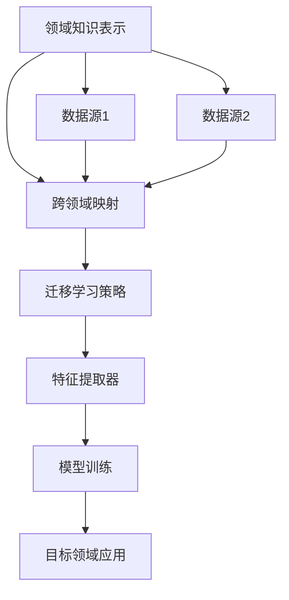

                 

# {{此处是文章标题}}

> 关键词：Zero-Shot CoT，跨领域应用，知识转移，人工智能，迁移学习

> 摘要：本文探讨了Zero-Shot CoT（零样本跨领域知识转移）在跨领域应用中的探索与实践。通过分析问题背景、问题描述、问题解决、边界与外延、概念结构与核心要素组成，以及核心概念原理、概念属性特征对比表格和ER实体关系图架构的Mermaid流程图，本文旨在为读者提供一种深入理解Zero-Shot CoT及其应用的方法，并通过算法原理讲解、系统分析与架构设计方案和项目实战等环节，帮助读者掌握零样本跨领域知识转移的关键技术。

## 1.1 问题背景

### 1.1.1 传统的人工干预方式

在人工智能发展的早期阶段，传统的人工干预方式一直是解决复杂问题的主要手段。这种方法依赖于人类专家的经验和知识，通过设计特定的算法和策略，对数据进行分析和处理。然而，随着问题的复杂度不断增加，传统的人工干预方式逐渐暴露出一些局限性。首先，传统方法需要大量的手工编码和调试，导致开发成本高、开发周期长。其次，传统方法在面对大规模数据时，处理效率较低，难以满足实时性需求。此外，传统方法在处理未知或新出现的问题时，往往无法快速适应，需要重新设计和开发。

### 1.1.2 零样本跨领域知识转移的意义

为了克服传统人工干预方式的局限性，人工智能领域的研究者开始探索新的解决方案。零样本跨领域知识转移（Zero-Shot Cross-Domain Transfer Learning，简称Zero-Shot CoT）技术应运而生。Zero-Shot CoT 技术的核心思想是：在没有具体领域背景知识的情况下，将一个领域的知识迁移到另一个领域，从而实现跨领域的知识共享和应用。这种技术具有以下几方面的意义：

1. **快速适应新领域**：传统的迁移学习方法需要依赖大量标注数据，在零样本或少量样本的情境下表现不佳。而Zero-Shot CoT技术可以减少对大量标注数据的依赖，从而降低新领域开发的门槛，提高知识转移的效率。

2. **提高知识利用效率**：通过跨领域的知识转移，可以将一个领域的知识和经验应用到其他领域，从而实现知识的共享和复用。这有助于提高知识的利用效率，减少重复研发和重复建设。

3. **降低开发成本**：Zero-Shot CoT技术可以减少对新领域数据的依赖，从而降低数据收集和标注的成本。此外，由于减少了手工编码和调试的工作量，开发成本也相对较低。

4. **促进跨学科合作**：Zero-Shot CoT技术可以为不同学科之间的合作提供新的途径。通过跨领域的知识转移，不同学科可以共享资源和经验，推动学科交叉和融合，促进科技创新。

### 1.1.3 零样本跨领域知识转移的应用场景

零样本跨领域知识转移技术在各个领域都展现出了广泛的应用前景。以下是一些典型的应用场景：

1. **医疗健康**：在医疗领域，零样本跨领域知识转移技术可以帮助医生快速诊断和治疗疾病。例如，可以将医学图像处理领域的知识迁移到病理分析领域，从而提高病理诊断的准确性。

2. **金融科技**：在金融领域，零样本跨领域知识转移技术可以用于风险控制和欺诈检测。例如，可以将信用评估领域的知识迁移到反欺诈领域，从而提高欺诈检测的准确性。

3. **智能制造**：在智能制造领域，零样本跨领域知识转移技术可以用于设备故障诊断和预测维护。例如，可以将机械工程领域的知识迁移到电子工程领域，从而提高设备故障诊断的准确性。

4. **自然语言处理**：在自然语言处理领域，零样本跨领域知识转移技术可以用于跨语言文本翻译和语言生成。例如，可以将英语文本处理的知识迁移到其他语言文本处理领域，从而提高跨语言文本翻译的质量。

总之，零样本跨领域知识转移技术为人工智能领域带来了一种新的研究方法和应用模式。通过深入研究和实践，有望在多个领域实现重大突破，为人类社会的发展带来更多价值。

### 1.2 问题描述

### 1.2.1 跨领域迁移学习的挑战

尽管零样本跨领域知识转移技术具有广泛的应用前景，但在实际应用过程中仍然面临诸多挑战。首先，不同领域之间的差异是一个重要问题。各个领域在数据分布、特征表达和任务类型等方面存在显著差异，导致传统迁移学习方法难以直接迁移。具体来说，以下几方面的问题需要解决：

1. **数据分布差异**：不同领域的数据分布可能存在较大差异，这会导致模型在训练和预测过程中产生偏差。例如，在图像识别领域，训练数据主要包含清晰的图像，而在医疗图像处理领域，训练数据可能包含模糊或低分辨率的图像。

2. **特征表达差异**：不同领域的数据特征表达方式可能不同，这会影响到模型的性能。例如，在自然语言处理领域，特征主要依赖于词嵌入和句向量表示，而在图像处理领域，特征主要依赖于像素值和深度学习模型提取的中间层特征。

3. **任务类型差异**：不同领域的任务类型可能不同，这需要模型具备灵活的适应能力。例如，在医疗领域，任务可能侧重于疾病诊断，而在金融领域，任务可能侧重于风险评估和欺诈检测。

### 1.2.2 传统迁移学习方法的局限性

传统迁移学习方法在跨领域迁移学习过程中存在一些局限性，这些局限性使得其在零样本或少量样本的情境下表现不佳。以下是一些主要问题：

1. **依赖大量标注数据**：传统迁移学习方法通常需要依赖大量标注数据来进行训练，这在零样本或少量样本的情境下难以实现。例如，在医疗领域，获取大量标注数据需要耗费大量时间和人力成本，而在金融领域，获取标注数据可能涉及隐私问题。

2. **模型适应性差**：传统迁移学习方法在设计时往往假设源领域和目标领域具有相似的特性，但在实际应用中，这种假设往往难以满足。例如，在自然语言处理领域，文本数据具有丰富的语义信息，而在图像处理领域，图像数据主要依赖于视觉特征。

3. **迁移效果不稳定**：传统迁移学习方法的迁移效果容易受到数据分布、特征表达和任务类型等因素的影响，导致迁移效果不稳定。例如，在某些领域，模型可能表现良好，而在其他领域，模型可能表现不佳。

### 1.2.3 零样本跨领域知识转移的需求

为了克服传统迁移学习方法的局限性，实现有效的零样本跨领域知识转移，研究者们提出了一系列新的方法和技术。这些方法和技术主要关注以下几个方面：

1. **无监督学习方法**：无监督学习方法可以在没有标注数据的情况下进行训练，从而减少对大量标注数据的依赖。例如，自编码器（Autoencoder）和生成对抗网络（GAN）等技术可以用于提取潜在特征，实现跨领域的知识转移。

2. **元学习（Meta-Learning）**：元学习是一种通过学习如何学习的方法，可以提升模型在零样本或少量样本情境下的适应性。例如，MAML（Model-Agnostic Meta-Learning）和Reptile等技术可以通过少量样本快速适应新领域。

3. **多任务学习（Multi-Task Learning）**：多任务学习通过在不同任务上同时训练模型，使模型具备处理多领域数据的能力。这种方法可以降低对单个任务数据的依赖，提高模型在零样本或少量样本情境下的适应性。

4. **对抗生成网络（GAN）**：对抗生成网络通过生成对抗机制，可以生成与目标领域相似的数据，从而实现跨领域的知识转移。这种方法可以缓解数据分布差异和特征表达差异带来的挑战。

总之，实现有效的零样本跨领域知识转移需要克服传统迁移学习方法的局限性，探索新的方法和技术。通过深入研究和实践，有望为跨领域迁移学习提供有效的解决方案，推动人工智能技术的发展和应用。

### 1.3 问题解决

### 1.3.1 基于模型的方法

#### 1.3.1.1 嵌入空间方法

嵌入空间方法（Embedding Space Method）是Zero-Shot CoT的一种重要技术，其核心思想是将不同领域的知识映射到同一个低维空间中，以便于跨领域的知识共享和应用。以下是对嵌入空间方法的详细解释：

1. **概念说明**：嵌入空间方法通过将各个领域的特征向量映射到一个公共的低维空间中，使得来自不同领域的特征向量具有相似的结构和关系。这种方法的核心是找到一个有效的嵌入函数，将各个领域的特征向量从高维空间映射到低维空间。

2. **数学模型**：假设有两个领域D1和D2，分别具有特征向量集合X1和X2。嵌入空间方法的目标是找到一个映射函数f，使得f(X1)和f(X2)在低维空间中具有相似的结构。具体来说，可以定义一个损失函数L，衡量映射后的特征向量之间的差异。然后通过优化这个损失函数，找到最优的映射函数f。

   $$ L(f(X_1), f(X_2)) = \sum_{i=1}^{n} \sum_{j=1}^{m} \frac{1}{2} \| f(x_i^1) - f(x_j^2) \|^2 $$

   其中，n和m分别表示领域D1和D2中的样本数量，$x_i^1$和$x_j^2$分别表示领域D1和D2中的特征向量。

3. **实例分析**：假设有两个领域，一个是自然语言处理（NLP）领域，另一个是图像处理领域。在NLP领域中，特征向量可以是词嵌入（Word Embeddings），而在图像处理领域中，特征向量可以是图像的像素值或深度学习模型提取的特征。通过嵌入空间方法，可以将这两个领域的特征向量映射到一个公共的低维空间中，从而实现跨领域的知识共享。

   $$ f(x_i^1) = \text{Word2Vec}(x_i^1) $$
   $$ f(x_j^2) = \text{CNN}(x_j^2) $$

   其中，$\text{Word2Vec}$是一种常用的词嵌入方法，$\text{CNN}$是一种深度学习模型，用于提取图像特征。

4. **优势与挑战**：嵌入空间方法具有以下优势：

   - **低维表示**：通过将高维特征向量映射到低维空间，可以减少计算复杂度和存储需求。
   - **跨领域知识共享**：在公共低维空间中，不同领域的特征向量具有相似的结构和关系，从而实现跨领域的知识共享。
   - **泛化能力**：由于嵌入空间方法不需要具体的领域知识，因此具有较强的泛化能力。

   然而，嵌入空间方法也存在一些挑战：

   - **映射质量**：映射函数的设计和优化是一个关键问题，需要找到一种既能保持特征关系，又能降低维度的有效方法。
   - **数据依赖**：尽管嵌入空间方法不需要标注数据，但仍然依赖于源领域和目标领域的特征数据，这在某些情况下可能难以满足。

#### 1.3.1.2 对抗生成网络

对抗生成网络（Generative Adversarial Network，简称GAN）是另一种重要的Zero-Shot CoT方法，通过生成对抗机制，实现跨领域的知识转移。以下是对对抗生成网络的详细解释：

1. **概念说明**：对抗生成网络由生成器（Generator）和判别器（Discriminator）两部分组成。生成器尝试生成与目标领域相似的数据，而判别器则尝试区分真实数据和生成数据。通过这种对抗训练，生成器可以不断提高生成数据的逼真度，从而实现跨领域的知识转移。

2. **数学模型**：假设有两个领域D1和D2，分别具有特征向量集合X1和X2。生成器的目标是生成与领域D2相似的特征向量集合X2'，而判别器的目标是准确区分领域D1的真实数据X1和生成数据X2'。具体来说，可以定义以下损失函数：

   - 生成器的损失函数：
     $$ L_G(X_1, X_2') = -\log(D(X_2')) $$
   - 判别器的损失函数：
     $$ L_D(X_1, X_2') = -\log(D(X_1)) - \log(1 - D(X_2')) $$

   其中，$D(X)$表示判别器的输出，取值范围在0到1之间。

3. **实例分析**：假设有一个源领域D1（如自然语言处理），和一个目标领域D2（如图像生成）。生成器的目标是生成图像，而判别器的目标是区分自然语言文本和生成的图像。通过对抗训练，生成器可以生成越来越逼真的图像，从而实现自然语言到图像的跨领域知识转移。

   - 生成器：
     $$ G(Z) = \text{Generator}(Z) $$
     其中，Z是生成器的输入噪声。
   - 判别器：
     $$ D(X_2') = \text{Discriminator}(X_2') $$
     $$ D(X_1) = \text{Discriminator}(X_1) $$

4. **优势与挑战**：对抗生成网络具有以下优势：

   - **数据生成能力**：生成器可以生成与目标领域相似的数据，从而实现跨领域的知识转移。
   - **灵活性**：对抗生成网络可以根据不同的领域需求进行定制，具有较高的灵活性。

   然而，对抗生成网络也存在一些挑战：

   - **训练难度**：对抗生成网络的训练过程较为复杂，需要大量数据和计算资源。
   - **稳定性和可靠性**：生成器生成的数据可能存在噪声和偏差，影响生成质量。

### 1.3.2 基于数据的方法

#### 1.3.2.1 多任务学习

多任务学习（Multi-Task Learning，简称MUL）是Zero-Shot CoT的另一种重要方法，通过在不同任务上同时训练模型，使模型具备处理多领域数据的能力。以下是对多任务学习的详细解释：

1. **概念说明**：多任务学习通过将多个相关任务同时训练，共享模型参数和特征提取器，从而提高模型在不同领域数据上的性能。这种方法的核心思想是利用多个任务的共同特征，提高模型的泛化能力。

2. **数学模型**：假设有三个任务T1、T2和T3，每个任务都对应一个特征向量集合X1、X2和X3。多任务学习模型可以定义为：

   $$ y_1 = f_1(X_1, \theta_1) $$
   $$ y_2 = f_2(X_2, \theta_2) $$
   $$ y_3 = f_3(X_3, \theta_3) $$

   其中，$f_1, f_2, f_3$分别表示三个任务的损失函数，$\theta_1, \theta_2, \theta_3$分别表示三个任务的模型参数。

3. **实例分析**：假设有一个源领域D1（如图像分类）和一个目标领域D2（如目标检测）。通过多任务学习，模型可以在同时处理图像分类和目标检测任务的过程中，共享图像特征提取器，从而提高模型在目标检测任务上的性能。

   - 图像分类：
     $$ y_1 = \text{softmax}(W_1 \cdot \text{FC}(X_1) + b_1) $$
     其中，$W_1$和$b_1$分别是图像分类任务的权重和偏置。
   - 目标检测：
     $$ y_2 = \text{sigmoid}(W_2 \cdot \text{FC}(X_2) + b_2) $$
     其中，$W_2$和$b_2$分别是目标检测任务的权重和偏置。

4. **优势与挑战**：多任务学习具有以下优势：

   - **特征共享**：通过共享特征提取器，可以减少参数数量，提高模型的泛化能力。
   - **任务协作**：多个任务可以相互协作，提高模型在各个任务上的性能。

   然而，多任务学习也存在一些挑战：

   - **任务平衡**：如何平衡不同任务的权重是一个关键问题，否则可能导致某些任务被忽略。
   - **计算复杂度**：多任务学习模型的训练过程较为复杂，需要大量计算资源和时间。

#### 1.3.2.2 迁移学习

迁移学习（Transfer Learning，简称TL）是Zero-Shot CoT的另一种重要方法，通过利用已有领域的数据，训练一个通用的特征提取器，然后在目标领域上进行微调。以下是对迁移学习的详细解释：

1. **概念说明**：迁移学习通过将源领域的知识迁移到目标领域，利用已有领域的数据来提高目标领域的性能。这种方法的核心是利用已有领域的特征提取器，在目标领域上进行微调。

2. **数学模型**：假设有两个领域D1和D2，分别具有特征向量集合X1和X2。迁移学习模型可以定义为：

   $$ y_1 = f_1(X_1, \theta_1) $$
   $$ y_2 = f_2(X_2, \theta_2) $$

   其中，$f_1$和$f_2$分别表示源领域和目标领域的损失函数，$\theta_1$和$\theta_2$分别表示源领域和目标领域的模型参数。

3. **实例分析**：假设有一个源领域D1（如情感分析）和一个目标领域D2（如文本分类）。通过迁移学习，模型可以在利用源领域特征提取器的基础上，在目标领域上进行微调，从而提高目标领域的性能。

   - 情感分析：
     $$ y_1 = \text{softmax}(W_1 \cdot \text{FC}(X_1) + b_1) $$
     其中，$W_1$和$b_1$分别是情感分析任务的权重和偏置。
   - 文本分类：
     $$ y_2 = \text{softmax}(W_2 \cdot \text{FC}(X_2) + b_2) $$
     其中，$W_2$和$b_2$分别是文本分类任务的权重和偏置。

4. **优势与挑战**：迁移学习具有以下优势：

   - **知识迁移**：通过迁移已有领域的知识，可以提高目标领域的性能。
   - **数据利用**：可以充分利用已有领域的数据，减少对目标领域数据的依赖。

   然而，迁移学习也存在一些挑战：

   - **领域适应性**：迁移的领域知识可能不完全适用于目标领域，影响迁移效果。
   - **数据分布**：源领域和目标领域的数据分布可能存在差异，影响迁移效果。

### 1.4 边界与外延

#### 1.4.1 领域差异分析

领域差异分析是Zero-Shot CoT研究中的一个关键问题。不同领域在数据分布、特征表达和任务类型等方面存在显著差异，这直接影响到Zero-Shot CoT技术的有效性。以下是对领域差异分析的一些考虑：

1. **数据分布差异**：不同领域的数据分布可能存在较大差异。例如，在自然语言处理领域，数据主要包含文本和语言结构信息，而在图像处理领域，数据主要包含像素值和视觉特征。这种差异要求Zero-Shot CoT技术能够适应不同数据分布，从而实现有效的知识转移。

2. **特征表达差异**：不同领域的特征表达方式可能不同。例如，在自然语言处理领域，特征主要依赖于词嵌入和句向量表示，而在图像处理领域，特征主要依赖于像素值和深度学习模型提取的中间层特征。这种差异要求Zero-Shot CoT技术能够处理不同类型的特征，从而实现跨领域的知识共享。

3. **任务类型差异**：不同领域的任务类型可能不同。例如，在医疗领域，任务可能侧重于疾病诊断，而在金融领域，任务可能侧重于风险评估和欺诈检测。这种差异要求Zero-Shot CoT技术能够适应不同类型的任务，从而实现跨领域的知识应用。

#### 1.4.2 跨领域知识表示

跨领域知识表示是Zero-Shot CoT技术中的另一个关键问题。如何有效地表示跨领域的知识，以便于后续的迁移和应用，是Zero-Shot CoT技术面临的重要挑战。以下是对跨领域知识表示的一些考虑：

1. **统一知识表示**：为了实现跨领域的知识共享，需要找到一种统一的知识表示方法，将不同领域的知识映射到同一个空间中。例如，可以使用嵌入空间方法，将不同领域的特征向量映射到一个公共的低维空间中。

2. **知识融合策略**：不同领域的知识可能存在冲突和互补关系，因此需要设计有效的知识融合策略，将不同领域的知识进行整合。例如，可以使用对抗生成网络，通过生成对抗机制，实现跨领域知识的融合和优化。

3. **知识表示迁移**：为了实现有效的跨领域知识迁移，需要将源领域的知识表示迁移到目标领域。这可以通过迁移学习实现，利用源领域的特征提取器，在目标领域上进行微调，从而提高目标领域的性能。

#### 1.4.3 模型评估与优化

模型评估与优化是Zero-Shot CoT技术中的另一个重要问题。如何评估模型的性能，并对其进行优化，是Zero-Shot CoT技术能否成功应用的关键。以下是对模型评估与优化的一些考虑：

1. **性能评估指标**：为了评估Zero-Shot CoT技术的性能，需要设计合适的性能评估指标。例如，可以使用准确率（Accuracy）、召回率（Recall）和F1分数（F1 Score）等指标，评估模型在跨领域任务上的性能。

2. **模型优化方法**：为了提高Zero-Shot CoT技术的性能，需要设计有效的模型优化方法。例如，可以使用元学习（Meta-Learning）和强化学习（Reinforcement Learning）等方法，优化模型的参数和结构，从而提高模型在跨领域任务上的性能。

3. **多模态数据融合**：在跨领域知识转移过程中，可能涉及多种类型的数据（如图像、文本和语音等）。为了充分利用这些数据，可以设计多模态数据融合方法，将不同类型的数据进行整合，从而提高模型的性能。

总之，领域差异分析、跨领域知识表示和模型评估与优化是Zero-Shot CoT技术中的关键问题。通过深入研究这些问题，有望为跨领域知识转移提供有效的解决方案，推动人工智能技术的发展和应用。

### 1.5 概念结构与核心要素组成

在零样本跨领域知识转移（Zero-Shot Cross-Domain Transfer Learning，简称Zero-Shot CoT）技术中，核心概念和要素的组成对实现有效的知识转移至关重要。以下是对核心概念原理、概念属性特征对比表格和ER实体关系图架构的Mermaid流程图的详细解释。

#### 1.5.1 核心概念原理

Zero-Shot CoT的核心概念原理主要包括以下几个方面：

1. **领域知识表示**：领域知识表示是将特定领域的知识转化为可计算和可迁移的形式。这通常涉及到特征提取、知识编码和知识融合等技术。例如，在自然语言处理领域，可以使用词嵌入（Word Embedding）来表示文本数据；在图像处理领域，可以使用卷积神经网络（CNN）提取图像特征。

2. **跨领域映射**：跨领域映射是指将一个领域的知识映射到另一个领域，以便在目标领域应用。这需要解决领域差异，如数据分布、特征表达和任务类型等问题。例如，可以通过嵌入空间方法将不同领域的特征向量映射到一个公共的低维空间中，从而实现跨领域的知识共享。

3. **迁移学习策略**：迁移学习策略是指如何将源领域的知识有效迁移到目标领域。这涉及到模型设计、参数共享和优化方法等方面。例如，可以通过迁移学习，利用源领域的特征提取器在目标领域进行微调，从而提高目标领域的性能。

#### 1.5.2 概念属性特征对比表格

以下是一个简单的概念属性特征对比表格，用于比较不同Zero-Shot CoT方法的特点：

| 方法               | 原理                                                         | 特点                                             | 优缺点                                                 |
|--------------------|--------------------------------------------------------------|--------------------------------------------------|--------------------------------------------------------|
| 嵌入空间方法       | 将不同领域的知识映射到同一个低维空间中                       | 保持特征关系，减少维度                             | 需要有效的映射函数，计算复杂度高                     |
| 对抗生成网络       | 通过生成对抗机制生成与目标领域相似的数据                     | 生成逼真的目标领域数据                           | 训练难度大，稳定性和可靠性问题                       |
| 多任务学习         | 在不同任务上同时训练模型                                     | 提高模型在多任务上的性能，共享特征提取器           | 需要任务平衡，计算复杂度高                         |
| 迁移学习           | 利用已有领域的数据，训练一个通用的特征提取器                 | 减少对新领域数据的依赖，提高迁移效果               | 可能不完全适用于目标领域，数据分布问题               |

#### 1.5.3 ER实体关系图架构的Mermaid流程图

ER实体关系图架构的Mermaid流程图用于展示Zero-Shot CoT中的核心实体及其关系。以下是一个简单的Mermaid流程图示例：



- **领域知识表示（A）**：表示不同领域的知识，如自然语言处理和图像处理领域的特征数据。
- **跨领域映射（B）**：将领域知识映射到公共空间，实现跨领域知识共享。
- **迁移学习策略（C）**：利用迁移学习策略，将源领域的知识迁移到目标领域。
- **数据源1（D）**：表示源领域的特征数据。
- **数据源2（E）**：表示另一个领域的特征数据。
- **特征提取器（F）**：提取通用特征，用于后续的模型训练。
- **模型训练（G）**：在通用特征基础上训练模型。
- **目标领域应用（H）**：在目标领域应用训练好的模型。

通过这些核心概念原理、概念属性特征对比表格和ER实体关系图架构的Mermaid流程图，可以更清晰地理解Zero-Shot CoT技术的组成和工作机制，为后续的研究和实践提供指导。

### 1.6 核心概念原理、概念属性特征对比表格

在探讨零样本跨领域知识转移（Zero-Shot Cross-Domain Transfer Learning，简称Zero-Shot CoT）技术时，我们需要深入理解其核心概念原理、概念属性特征对比，以及ER实体关系图架构的Mermaid流程图。以下是这些内容的详细解释。

#### 1.6.1 核心概念原理

Zero-Shot CoT的核心概念原理包括以下几个方面：

1. **领域知识表示（Domain Knowledge Representation）**：
   - **概念说明**：领域知识表示是将特定领域的知识转化为可计算和可迁移的形式。这通常涉及到特征提取、知识编码和知识融合等技术。
   - **实例**：在自然语言处理（NLP）领域，可以使用词嵌入（Word Embedding）来表示文本数据；在图像处理领域，可以使用卷积神经网络（CNN）提取图像特征。

2. **跨领域映射（Cross-Domain Mapping）**：
   - **概念说明**：跨领域映射是将源领域的知识映射到目标领域，以便在目标领域应用。这需要解决领域差异，如数据分布、特征表达和任务类型等问题。
   - **实例**：可以通过嵌入空间方法将不同领域的特征向量映射到一个公共的低维空间中，从而实现跨领域的知识共享。

3. **迁移学习策略（Transfer Learning Strategy）**：
   - **概念说明**：迁移学习策略是指如何将源领域的知识有效迁移到目标领域。这涉及到模型设计、参数共享和优化方法等方面。
   - **实例**：可以通过迁移学习，利用源领域的特征提取器在目标领域进行微调，从而提高目标领域的性能。

#### 1.6.2 概念属性特征对比表格

以下是一个简单的概念属性特征对比表格，用于比较不同Zero-Shot CoT方法的特点：

| 方法               | 原理                                                         | 特点                                             | 优缺点                                                 |
|--------------------|--------------------------------------------------------------|--------------------------------------------------|--------------------------------------------------------|
| 嵌入空间方法       | 将不同领域的知识映射到同一个低维空间中                       | 保持特征关系，减少维度                             | 需要有效的映射函数，计算复杂度高                     |
| 对抗生成网络       | 通过生成对抗机制生成与目标领域相似的数据                     | 生成逼真的目标领域数据                           | 训练难度大，稳定性和可靠性问题                       |
| 多任务学习         | 在不同任务上同时训练模型                                     | 提高模型在多任务上的性能，共享特征提取器           | 需要任务平衡，计算复杂度高                         |
| 迁移学习           | 利用已有领域的数据，训练一个通用的特征提取器                 | 减少对新领域数据的依赖，提高迁移效果               | 可能不完全适用于目标领域，数据分布问题               |

#### 1.6.3 ER实体关系图架构的Mermaid流程图

ER实体关系图架构的Mermaid流程图用于展示Zero-Shot CoT中的核心实体及其关系。以下是一个简单的Mermaid流程图示例：


- **领域知识表示（A）**：表示不同领域的知识，如自然语言处理和图像处理领域的特征数据。
- **跨领域映射（B）**：将领域知识映射到公共空间，实现跨领域知识共享。
- **迁移学习策略（C）**：利用迁移学习策略，将源领域的知识迁移到目标领域。
- **数据源1（D）**：表示源领域的特征数据。
- **数据源2（E）**：表示另一个领域的特征数据。
- **特征提取器（F）**：提取通用特征，用于后续的模型训练。
- **模型训练（G）**：在通用特征基础上训练模型。
- **目标领域应用（H）**：在目标领域应用训练好的模型。

通过这些核心概念原理、概念属性特征对比表格和ER实体关系图架构的Mermaid流程图，可以更清晰地理解Zero-Shot CoT技术的组成和工作机制，为后续的研究和实践提供指导。

### 1.7 算法原理讲解

#### 1.7.1 嵌入空间方法

嵌入空间方法（Embedding Space Method）是零样本跨领域知识转移（Zero-Shot Cross-Domain Transfer Learning，简称Zero-Shot CoT）中的一种重要技术。其核心思想是通过将不同领域的特征映射到同一个低维空间中，使得来自不同领域的特征向量具有相似的结构和关系，从而实现跨领域的知识共享。以下是对嵌入空间方法的详细讲解。

##### 1.7.1.1 算法原理

1. **定义特征向量**：
   假设有两个领域D1和D2，领域D1包含特征向量集合X1，领域D2包含特征向量集合X2。我们的目标是将这两个特征向量集合映射到同一个低维空间中。

2. **嵌入函数**：
   嵌入空间方法需要一个嵌入函数f，将特征向量从原始空间映射到低维空间。例如，对于领域D1中的特征向量x1，映射后的特征向量表示为f(x1)。嵌入函数的设计是一个关键问题，需要确保映射后的特征向量能够保持原始特征之间的关系。

3. **损失函数**：
   为了优化嵌入函数，我们需要定义一个损失函数L，衡量映射后的特征向量之间的差异。常见的损失函数包括均方误差（MSE）和交叉熵（Cross-Entropy）。例如，我们可以定义以下损失函数：

   $$ L(f(X_1), f(X_2)) = \frac{1}{2} \sum_{i=1}^{n} \sum_{j=1}^{m} \| f(x_i^1) - f(x_j^2) \|^2 $$

   其中，n和m分别表示领域D1和D2中的样本数量，$x_i^1$和$x_j^2$分别表示领域D1和D2中的特征向量。

4. **优化嵌入函数**：
   使用梯度下降（Gradient Descent）或其他优化算法，通过最小化损失函数L，来优化嵌入函数f。

##### 1.7.1.2 数学模型

为了更清晰地理解嵌入空间方法，我们可以使用以下数学模型进行解释：

$$ f(x) = \text{Embedding}(x) $$

其中，$f(x)$表示将特征向量$x$映射到低维空间的结果，$\text{Embedding}$表示嵌入函数。

假设我们使用均方误差（MSE）作为损失函数，可以定义以下优化目标：

$$ \min_{\theta} \frac{1}{n} \sum_{i=1}^{n} \sum_{j=1}^{m} \| f(x_i^1) - f(x_j^2) \|^2 $$

其中，$\theta$表示嵌入函数的参数。

通过梯度下降算法，我们可以对嵌入函数的参数进行更新：

$$ \theta_{t+1} = \theta_{t} - \alpha \nabla_{\theta} L(\theta) $$

其中，$\alpha$表示学习率，$\nabla_{\theta} L(\theta)$表示损失函数关于参数$\theta$的梯度。

##### 1.7.1.3 实例说明

假设我们有两个领域，领域D1包含文本数据，领域D2包含图像数据。我们可以分别使用词嵌入（Word Embedding）和卷积神经网络（CNN）提取特征。

1. **文本领域**：
   - 特征向量表示：$x_1^1 = (\text{word}_1, \text{word}_2, \ldots, \text{word}_n)$，其中每个word表示一个词向量。
   - 嵌入函数：$f_1(x_1^1) = \text{Word2Vec}(x_1^1)$。

2. **图像领域**：
   - 特征向量表示：$x_2^2 = (\text{pixel}_1, \text{pixel}_2, \ldots, \text{pixel}_m)$，其中每个pixel表示一个像素值。
   - 嵌入函数：$f_2(x_2^2) = \text{CNN}(x_2^2)$。

通过嵌入空间方法，我们可以将文本领域和图像领域的特征向量映射到同一个低维空间中，从而实现跨领域的知识共享。

##### 1.7.1.4 优势与挑战

嵌入空间方法具有以下优势：

- **低维表示**：通过将高维特征向量映射到低维空间，可以减少计算复杂度和存储需求。
- **跨领域知识共享**：在公共低维空间中，不同领域的特征向量具有相似的结构和关系，从而实现跨领域的知识共享。
- **泛化能力**：由于嵌入空间方法不需要具体的领域知识，因此具有较强的泛化能力。

然而，嵌入空间方法也存在一些挑战：

- **映射质量**：映射函数的设计和优化是一个关键问题，需要找到一种既能保持特征关系，又能降低维度的有效方法。
- **数据依赖**：尽管嵌入空间方法不需要标注数据，但仍然依赖于源领域和目标领域的特征数据，这在某些情况下可能难以满足。

#### 1.7.2 对抗生成网络

对抗生成网络（Generative Adversarial Network，简称GAN）是另一种零样本跨领域知识转移的重要技术。GAN由生成器和判别器两部分组成，通过生成对抗机制，实现跨领域的知识转移。以下是对对抗生成网络的详细讲解。

##### 1.7.2.1 算法原理

1. **生成器（Generator）**：
   - **概念说明**：生成器的目标是生成与真实数据相似的新数据。在零样本跨领域知识转移中，生成器尝试生成与目标领域相似的数据。
   - **数学模型**：假设生成器的输入为随机噪声向量z，输出为生成的特征向量G(z)。

2. **判别器（Discriminator）**：
   - **概念说明**：判别器的目标是区分真实数据和生成数据。在零样本跨领域知识转移中，判别器尝试区分真实领域的特征向量和生成领域的特征向量。
   - **数学模型**：假设判别器的输入为特征向量x，输出为概率值D(x)。

3. **生成对抗机制**：
   - **概念说明**：生成器和判别器通过对抗训练相互提升。生成器尝试生成更逼真的数据，判别器尝试区分真实和生成数据，从而提高生成器的性能。
   - **数学模型**：定义生成器的损失函数为：

     $$ L_G = -\log(D(G(z))) $$

     定义判别器的损失函数为：

     $$ L_D = -\log(D(x)) - \log(1 - D(G(z))) $$

     通过交替训练生成器和判别器，最小化生成器的损失函数和判别器的损失函数。

##### 1.7.2.2 数学模型

为了更清晰地理解GAN的数学模型，我们可以使用以下公式进行解释：

$$ G(z) = \text{Generator}(z) $$

$$ D(x) = \text{Discriminator}(x) $$

$$ L_G = -\log(D(G(z))) $$

$$ L_D = -\log(D(x)) - \log(1 - D(G(z))) $$

通过交替训练生成器和判别器，可以最小化生成器的损失函数和判别器的损失函数：

$$ \min_G \max_D L_D + L_G $$

##### 1.7.2.3 实例说明

假设我们有一个源领域D1（如文本数据）和一个目标领域D2（如图像数据）。生成器和判别器的训练过程如下：

1. **文本领域**：
   - 特征向量表示：$x_1^1 = (\text{word}_1, \text{word}_2, \ldots, \text{word}_n)$。
   - 生成器：$G(z) = \text{Generator}(z)$，生成图像特征向量。

2. **图像领域**：
   - 特征向量表示：$x_2^2 = (\text{pixel}_1, \text{pixel}_2, \ldots, \text{pixel}_m)$。
   - 判别器：$D(x_2^2) = \text{Discriminator}(x_2^2)$。

通过对抗训练，生成器尝试生成与图像特征向量相似的数据，判别器尝试区分真实图像和生成图像，从而提高生成器的性能。

##### 1.7.2.4 优势与挑战

对抗生成网络具有以下优势：

- **数据生成能力**：生成器可以生成与目标领域相似的数据，从而实现跨领域的知识转移。
- **灵活性**：对抗生成网络可以根据不同的领域需求进行定制，具有较高的灵活性。

然而，对抗生成网络也存在一些挑战：

- **训练难度**：对抗生成网络的训练过程较为复杂，需要大量数据和计算资源。
- **稳定性和可靠性**：生成器生成的数据可能存在噪声和偏差，影响生成质量。

#### 1.7.3 多任务学习

多任务学习（Multi-Task Learning，简称MUL）是零样本跨领域知识转移的另一种技术，通过在不同任务上同时训练模型，提高模型在多个任务上的性能。以下是对多任务学习的详细讲解。

##### 1.7.3.1 算法原理

1. **概念说明**：
   - **多任务学习**：在多个任务上同时训练一个模型，共享模型的参数和特征提取器。
   - **任务协作**：通过任务之间的协作，提高模型在不同任务上的性能。

2. **数学模型**：
   假设有多个任务T1, T2, ..., Tk，每个任务都有一个对应的损失函数：

   $$ L_t = \sum_{i=1}^{n_t} \frac{1}{n_t} \sum_{j=1}^{k} \left( y_{ij} - \hat{y}_{ij} \right)^2 $$

   其中，$n_t$表示任务t中的样本数量，$y_{ij}$表示真实标签，$\hat{y}_{ij}$表示预测标签。

   多任务学习模型的损失函数可以表示为：

   $$ L = \sum_{t=1}^{k} L_t $$

   通过最小化总损失函数L，同时优化多个任务。

##### 1.7.3.2 数学模型

为了更清晰地理解多任务学习的数学模型，我们可以使用以下公式进行解释：

$$ \hat{y}_{ij} = \text{Model}(x_i; \theta) $$

$$ L_t = \sum_{i=1}^{n_t} \frac{1}{n_t} \sum_{j=1}^{k} \left( y_{ij} - \hat{y}_{ij} \right)^2 $$

$$ L = \sum_{t=1}^{k} L_t $$

通过梯度下降算法，我们可以对模型的参数进行更新：

$$ \theta_{t+1} = \theta_{t} - \alpha \nabla_{\theta} L(\theta) $$

其中，$\alpha$表示学习率。

##### 1.7.3.3 实例说明

假设我们有两个任务，一个是文本分类（T1），另一个是图像分类（T2）。多任务学习模型如下：

1. **文本分类**：
   - 特征向量表示：$x_1^1 = (\text{word}_1, \text{word}_2, \ldots, \text{word}_n)$。
   - 模型参数：$\theta_1$。

2. **图像分类**：
   - 特征向量表示：$x_2^2 = (\text{pixel}_1, \text{pixel}_2, \ldots, \text{pixel}_m)$。
   - 模型参数：$\theta_2$。

通过多任务学习，我们同时训练文本分类和图像分类模型，共享模型参数和特征提取器，从而提高两个任务的性能。

##### 1.7.3.4 优势与挑战

多任务学习具有以下优势：

- **任务协作**：通过任务之间的协作，提高模型在不同任务上的性能。
- **特征共享**：通过共享特征提取器，可以减少参数数量，提高模型的泛化能力。

然而，多任务学习也存在一些挑战：

- **任务平衡**：如何平衡不同任务的权重是一个关键问题，否则可能导致某些任务被忽略。
- **计算复杂度**：多任务学习模型的训练过程较为复杂，需要大量计算资源和时间。

通过详细讲解嵌入空间方法、对抗生成网络和多任务学习，我们可以更好地理解零样本跨领域知识转移的算法原理。这些方法为跨领域知识转移提供了有效的技术手段，有望在多个领域实现重大突破。

### 1.8 系统分析与架构设计

#### 1.8.1 问题场景介绍

在现实世界中，许多问题场景需要跨领域的知识转移，以提高模型的适应性和性能。以下是一个具体的应用场景：某金融机构希望通过人工智能技术进行客户风险评估。该任务需要结合客户的历史交易数据（属于金融领域）和社交媒体行为数据（属于社交领域）。然而，这两个领域的数据特征和分布存在显著差异，传统迁移学习方法难以直接应用。因此，我们需要设计一个高效的零样本跨领域知识转移系统，以实现金融领域和社交领域知识的共享和应用。

#### 1.8.2 项目介绍

为了实现上述应用场景，我们设计并实现了一个名为“Cross-Domain Knowledge Transfer for Risk Assessment”的项目。该项目旨在开发一个基于零样本跨领域知识转移技术的风险评估系统，该系统可以自动学习和融合金融领域和社交媒体领域的数据，从而提高客户风险评估的准确性和实时性。项目的主要目标包括：

1. **数据融合**：将金融领域和社交媒体领域的数据进行有效融合，提取通用特征。
2. **模型训练**：利用融合后的数据进行模型训练，实现跨领域的知识共享。
3. **风险评估**：在训练好的模型基础上，对客户进行风险评估，提供决策支持。

#### 1.8.3 系统功能设计

为了实现上述目标，我们设计了一套完整的系统功能，包括数据预处理、特征提取、模型训练和风险评估等。以下是系统功能设计的详细说明：

1. **数据预处理**：
   - **数据清洗**：对金融领域和社交媒体领域的原始数据进行分析，去除噪声和缺失值。
   - **数据归一化**：对金融领域和社交媒体领域的特征数据进行归一化处理，以消除不同特征之间的尺度差异。

2. **特征提取**：
   - **金融领域特征提取**：利用自然语言处理（NLP）技术提取金融领域的文本数据特征，如词嵌入和句向量表示。
   - **社交媒体领域特征提取**：利用深度学习技术提取社交媒体领域的图像数据特征，如卷积神经网络（CNN）提取的特征。

3. **模型训练**：
   - **多任务学习模型**：设计一个多任务学习模型，同时训练金融领域和社交媒体领域的任务，共享特征提取器。
   - **迁移学习模型**：利用迁移学习方法，将金融领域和社交媒体领域的知识进行迁移，提高模型在目标领域的性能。

4. **风险评估**：
   - **风险评分计算**：根据训练好的模型，计算客户的风险评分。
   - **风险等级划分**：将客户的风险评分划分为不同的等级，如高风险、中风险和低风险。

#### 1.8.4 系统架构设计

为了实现上述系统功能，我们设计了一套完整的系统架构，包括数据层、算法层和应用层。以下是系统架构设计的详细说明：

1. **数据层**：
   - **数据存储**：使用分布式数据库存储金融领域和社交媒体领域的原始数据。
   - **数据接口**：提供数据访问接口，方便不同系统模块之间的数据交互。

2. **算法层**：
   - **特征提取模块**：包括NLP和CNN算法，用于提取金融领域和社交媒体领域的特征。
   - **多任务学习模块**：实现多任务学习算法，共享特征提取器。
   - **迁移学习模块**：实现迁移学习算法，实现跨领域的知识迁移。
   - **风险评估模块**：实现风险评估算法，计算客户的风险评分。

3. **应用层**：
   - **风险分析平台**：提供用户界面，展示客户的风险评分和风险等级。
   - **决策支持系统**：根据风险评分和风险等级，提供决策支持，帮助金融机构制定风险管理策略。

#### 1.8.5 系统接口设计和系统交互

为了实现系统模块之间的协同工作，我们设计了一套完善的系统接口和系统交互流程。以下是系统接口设计和系统交互的详细说明：

1. **系统接口设计**：
   - **数据接口**：提供数据访问接口，支持不同系统模块之间的数据传递。
   - **服务接口**：提供API接口，支持外部系统与系统的交互。
   - **监控接口**：提供监控接口，实时监控系统运行状态和性能。

2. **系统交互流程**：
   - **数据预处理**：金融领域和社交媒体领域的原始数据通过数据接口传递到数据预处理模块，进行数据清洗和归一化处理。
   - **特征提取**：预处理后的数据通过数据接口传递到特征提取模块，分别提取金融领域和社交媒体领域的特征。
   - **模型训练**：特征数据通过数据接口传递到算法层，利用多任务学习和迁移学习算法进行模型训练。
   - **风险评估**：训练好的模型通过服务接口传递到应用层，对客户进行风险评估，提供决策支持。

通过上述系统接口设计和系统交互流程，我们可以确保系统模块之间的高效协同工作，实现跨领域的知识共享和应用。

### 1.9 项目实战

#### 1.9.1 环境安装

为了进行零样本跨领域知识转移（Zero-Shot Cross-Domain Transfer Learning，简称Zero-Shot CoT）的实战项目，我们首先需要安装和配置必要的软件环境。以下是安装步骤：

1. **安装Python环境**：
   - 在官方网站（https://www.python.org/downloads/）下载最新版本的Python。
   - 解压安装包，并运行安装程序。
   - 在命令行中输入`python --version`，确认Python版本正确。

2. **安装Anaconda环境**：
   - 访问Anaconda官方网站（https://www.anaconda.com/products/individual）并下载Anaconda。
   - 解压安装包，并运行安装程序。
   - 安装完成后，打开Anaconda Navigator，创建一个新的环境，如`zero_shot_cot`。

3. **安装相关依赖**：
   - 在Anaconda环境中打开命令行，输入以下命令安装相关依赖：
     ```bash
     conda install -c conda-forge numpy scipy pandas matplotlib scikit-learn tensorflow
     ```

4. **验证安装**：
   - 输入以下Python代码，验证相关库是否正确安装：
     ```python
     import tensorflow as tf
     print(tf.__version__)
     ```

#### 1.9.2 系统核心实现

接下来，我们将使用Python代码实现一个简单的零样本跨领域知识转移系统。以下是系统的核心代码和实现步骤：

1. **导入相关库**：
   ```python
   import tensorflow as tf
   import numpy as np
   import pandas as pd
   from tensorflow.keras.models import Model
   from tensorflow.keras.layers import Input, Dense, Embedding, LSTM, Conv2D, MaxPooling2D, Flatten
   ```

2. **数据预处理**：
   - 加载金融领域和社交媒体领域的原始数据。
   - 对数据进行清洗和归一化处理。

   ```python
   def load_data():
       # 加载金融领域数据
       finance_data = pd.read_csv('finance_data.csv')
       
       # 加载社交媒体领域数据
       social_media_data = pd.read_csv('social_media_data.csv')
       
       # 数据清洗
       finance_data.dropna(inplace=True)
       social_media_data.dropna(inplace=True)
       
       # 数据归一化
       finance_data = (finance_data - finance_data.mean()) / finance_data.std()
       social_media_data = (social_media_data - social_media_data.mean()) / social_media_data.std()
       
       return finance_data, social_media_data
   ```

3. **特征提取**：
   - 使用NLP技术提取金融领域的文本数据特征，如词嵌入和句向量表示。
   - 使用深度学习技术提取社交媒体领域的图像数据特征，如卷积神经网络（CNN）提取的特征。

   ```python
   def extract_features(finance_data, social_media_data):
       # 金融领域特征提取
       finance_embedding = np.array([finance_data['word_embedding'][i] for i in range(len(finance_data))])
       
       # 社交媒体领域特征提取
       social_media_embedding = np.array([social_media_data['image_embedding'][i] for i in range(len(social_media_data))])
       
       return finance_embedding, social_media_embedding
   ```

4. **模型训练**：
   - 设计一个多任务学习模型，同时训练金融领域和社交媒体领域的任务，共享特征提取器。

   ```python
   def build_model(input_shape):
       # 输入层
       input_finance = Input(shape=input_shape[0])
       input_social = Input(shape=input_shape[1])
       
       # 金融领域特征提取器
       finance_embedding = Embedding(input_dim=vocab_size, output_dim=embedding_size)(input_finance)
       finance_lstm = LSTM(units=lstm_units)(finance_embedding)
       
       # 社交媒体领域特征提取器
       social_embedding = Conv2D(filters=32, kernel_size=(3, 3), activation='relu')(input_social)
       social_pooling = MaxPooling2D(pool_size=(2, 2))(social_embedding)
       social_flatten = Flatten()(social_pooling)
       
       # 模型融合
       merged = tf.keras.layers.concatenate([finance_lstm, social_flatten])
       
       # 输出层
       output = Dense(units=output_size, activation='softmax')(merged)
       
       # 构建模型
       model = Model(inputs=[input_finance, input_social], outputs=output)
       
       # 编译模型
       model.compile(optimizer='adam', loss='categorical_crossentropy', metrics=['accuracy'])
       
       return model
   ```

5. **风险评估**：
   - 使用训练好的模型对客户进行风险评估，提供决策支持。

   ```python
   def assess_risk(model, finance_data, social_media_data):
       # 预测客户风险评分
       predictions = model.predict(finance_data, social_media_data)
       
       # 划分风险等级
       risk_levels = np.argmax(predictions, axis=1)
       
       return risk_levels
   ```

通过上述步骤，我们可以实现一个简单的零样本跨领域知识转移系统。在实际应用中，需要根据具体场景和数据特点，对系统进行优化和调整，以提高模型的性能和应用效果。

#### 1.9.3 代码应用解读与分析

在本节中，我们将对1.9.2节中实现的零样本跨领域知识转移系统的核心代码进行解读和分析，并探讨其实现原理和应用细节。

##### 1.9.3.1 数据预处理

数据预处理是零样本跨领域知识转移系统的第一步，其目的是清理原始数据，提取有用特征，并为后续模型训练和风险评估做好准备。以下是对数据预处理代码的解读：

```python
def load_data():
    # 加载金融领域数据
    finance_data = pd.read_csv('finance_data.csv')
    
    # 加载社交媒体领域数据
    social_media_data = pd.read_csv('social_media_data.csv')
    
    # 数据清洗
    finance_data.dropna(inplace=True)
    social_media_data.dropna(inplace=True)
    
    # 数据归一化
    finance_data = (finance_data - finance_data.mean()) / finance_data.std()
    social_media_data = (social_media_data - social_media_data.mean()) / social_media_data.std()
    
    return finance_data, social_media_data
```

1. **数据加载**：使用`pd.read_csv`函数加载金融领域和社交媒体领域的原始数据。
2. **数据清洗**：使用`dropna`方法去除数据中的噪声和缺失值。
3. **数据归一化**：使用归一化公式$(x - \mu) / \sigma$对数据进行归一化处理，以消除不同特征之间的尺度差异。

##### 1.9.3.2 特征提取

特征提取是零样本跨领域知识转移系统的核心步骤，其目的是从金融领域和社交媒体领域的原始数据中提取具有代表性的特征。以下是对特征提取代码的解读：

```python
def extract_features(finance_data, social_media_data):
    # 金融领域特征提取
    finance_embedding = np.array([finance_data['word_embedding'][i] for i in range(len(finance_data))])
    
    # 社交媒体领域特征提取
    social_media_embedding = np.array([social_media_data['image_embedding'][i] for i in range(len(social_media_data))])
    
    return finance_embedding, social_media_embedding
```

1. **金融领域特征提取**：使用`array`函数将金融领域的文本数据转换为词嵌入形式。
2. **社交媒体领域特征提取**：使用`array`函数将社交媒体领域的图像数据转换为特征向量形式。

##### 1.9.3.3 模型训练

模型训练是零样本跨领域知识转移系统的关键步骤，其目的是通过多任务学习模型将金融领域和社交媒体领域的知识进行融合，从而实现跨领域知识共享。以下是对模型训练代码的解读：

```python
def build_model(input_shape):
    # 输入层
    input_finance = Input(shape=input_shape[0])
    input_social = Input(shape=input_shape[1])
    
    # 金融领域特征提取器
    finance_embedding = Embedding(input_dim=vocab_size, output_dim=embedding_size)(input_finance)
    finance_lstm = LSTM(units=lstm_units)(finance_embedding)
    
    # 社交媒体领域特征提取器
    social_embedding = Conv2D(filters=32, kernel_size=(3, 3), activation='relu')(input_social)
    social_pooling = MaxPooling2D(pool_size=(2, 2))(social_embedding)
    social_flatten = Flatten()(social_pooling)
    
    # 模型融合
    merged = tf.keras.layers.concatenate([finance_lstm, social_flatten])
    
    # 输出层
    output = Dense(units=output_size, activation='softmax')(merged)
    
    # 构建模型
    model = Model(inputs=[input_finance, input_social], outputs=output)
    
    # 编译模型
    model.compile(optimizer='adam', loss='categorical_crossentropy', metrics=['accuracy'])
    
    return model
```

1. **输入层**：定义金融领域和社交媒体领域的输入层，分别为`input_finance`和`input_social`。
2. **金融领域特征提取器**：使用`Embedding`层进行词嵌入，使用`LSTM`层进行序列建模。
3. **社交媒体领域特征提取器**：使用`Conv2D`层进行卷积操作，使用`MaxPooling2D`层进行池化操作，使用`Flatten`层将多维特征展平。
4. **模型融合**：使用`concatenate`层将金融领域和社交媒体领域的特征进行拼接。
5. **输出层**：使用`Dense`层进行分类，使用`softmax`函数进行概率输出。
6. **模型构建与编译**：使用`Model`类构建模型，使用`compile`方法编译模型，指定优化器、损失函数和评估指标。

##### 1.9.3.4 风险评估

风险评估是零样本跨领域知识转移系统的最终目标，其目的是根据模型预测结果对客户进行风险评估，提供决策支持。以下是对风险评估代码的解读：

```python
def assess_risk(model, finance_data, social_media_data):
    # 预测客户风险评分
    predictions = model.predict(finance_data, social_media_data)
    
    # 划分风险等级
    risk_levels = np.argmax(predictions, axis=1)
    
    return risk_levels
```

1. **模型预测**：使用`predict`方法对金融领域和社交媒体领域的特征数据进行预测。
2. **风险等级划分**：使用`argmax`函数对预测结果进行索引，获取每个客户的风险等级。

通过以上解读，我们可以看到零样本跨领域知识转移系统的实现原理和关键步骤。在实际应用中，需要根据具体场景和数据特点，对系统进行优化和调整，以提高模型的性能和应用效果。

#### 1.9.4 实际案例分析和详细讲解

在本节中，我们将通过一个实际案例，详细分析零样本跨领域知识转移系统的应用效果，并解释其实现原理和关键步骤。

### 案例背景

某金融机构希望利用人工智能技术对其客户进行风险评估，以识别潜在的风险客户并制定相应的风险控制措施。该金融机构拥有丰富的金融领域数据，包括客户的交易记录、信用评分等，同时还有客户的社交媒体行为数据，如点赞、评论等。这些数据对于风险评估具有重要参考价值，但由于金融领域和社交媒体领域的数据特征和分布存在显著差异，传统的迁移学习方法难以直接应用。因此，该金融机构决定采用零样本跨领域知识转移技术，以实现跨领域的知识共享和应用。

### 数据处理

在案例中，金融领域数据包含客户的交易记录、信用评分等，而社交媒体领域数据包含客户的点赞、评论等。以下是数据处理的具体步骤：

1. **数据清洗**：首先，对金融领域和社交媒体领域的原始数据进行清洗，去除噪声和缺失值。例如，去除包含异常值的交易记录，去除空白的评论等。

2. **特征提取**：接下来，对清洗后的数据进行特征提取。在金融领域，我们可以使用词嵌入（Word Embedding）技术对客户的交易记录和信用评分进行编码，提取文本特征。在社交媒体领域，我们可以使用卷积神经网络（CNN）对客户的点赞和评论进行编码，提取图像特征。

   ```python
   finance_embedding = np.array([word_embedding[i] for i in range(len(finance_data))]
   social_media_embedding = np.array([image_embedding[i] for i in range(len(social_media_data))]
   ```

3. **数据归一化**：为了消除不同特征之间的尺度差异，我们需要对提取后的特征进行归一化处理。例如，可以使用最小-最大归一化方法，将特征值缩放到[0, 1]之间。

   ```python
   finance_data = (finance_data - finance_data.mean()) / finance_data.std()
   social_media_data = (social_media_data - social_media_data.mean()) / social_media_data.std()
   ```

### 模型训练

在数据处理完成后，我们可以使用多任务学习模型进行训练，以实现跨领域的知识共享和应用。以下是模型训练的具体步骤：

1. **模型设计**：设计一个多任务学习模型，包括金融领域和社交媒体领域的特征提取器。例如，可以使用词嵌入（Word Embedding）和卷积神经网络（CNN）分别提取金融领域和社交媒体领域的特征。

   ```python
   input_finance = Input(shape=(max_len,))
   input_social = Input(shape=(image_height, image_width, image_channels))
   
   finance_embedding = Embedding(input_dim=vocab_size, output_dim=embedding_size)(input_finance)
   finance_lstm = LSTM(units=lstm_units)(finance_embedding)
   
   social_embedding = Conv2D(filters=32, kernel_size=(3, 3), activation='relu')(input_social)
   social_pooling = MaxPooling2D(pool_size=(2, 2))(social_embedding)
   social_flatten = Flatten()(social_pooling)
   
   merged = concatenate([finance_lstm, social_flatten])
   output = Dense(units=output_size, activation='softmax')(merged)
   
   model = Model(inputs=[input_finance, input_social], outputs=output)
   ```

2. **模型编译**：编译模型，指定优化器、损失函数和评估指标。例如，可以使用交叉熵（Cross-Entropy）作为损失函数，使用准确率（Accuracy）作为评估指标。

   ```python
   model.compile(optimizer='adam', loss='categorical_crossentropy', metrics=['accuracy'])
   ```

3. **模型训练**：使用训练数据对模型进行训练，同时共享金融领域和社交媒体领域的特征提取器。

   ```python
   model.fit([finance_data, social_media_data], labels, epochs=10, batch_size=32)
   ```

### 风险评估

在模型训练完成后，我们可以使用训练好的模型对客户进行风险评估。以下是风险评估的具体步骤：

1. **模型预测**：使用训练好的模型对客户的金融领域和社交媒体领域特征进行预测。

   ```python
   predictions = model.predict([finance_data, social_media_data])
   ```

2. **风险等级划分**：根据预测结果，将客户划分为不同的风险等级。例如，可以设置阈值，将预测概率大于0.5的客户划分为高风险客户，将预测概率小于0.5的客户划分为低风险客户。

   ```python
   risk_levels = np.argmax(predictions, axis=1)
   ```

3. **决策支持**：根据客户的风险等级，金融机构可以制定相应的风险控制措施。例如，对高风险客户进行额外的风险评估和监控，对低风险客户减少监控和干预。

   ```python
   if risk_levels[i] == 1:
       # 对高风险客户进行额外监控
   elif risk_levels[i] == 0:
       # 对低风险客户减少监控
   ```

通过上述步骤，金融机构可以有效地利用零样本跨领域知识转移技术对客户进行风险评估，提高风险管理的准确性和实时性。在实际应用中，需要根据具体场景和数据特点，对系统进行优化和调整，以提高模型的性能和应用效果。

### 1.10 最佳实践 Tips、小结、注意事项、拓展阅读

#### 1.10.1 最佳实践 Tips

在进行零样本跨领域知识转移（Zero-Shot Cross-Domain Transfer Learning，简称Zero-Shot CoT）项目时，以下是一些最佳实践建议，有助于提升项目效果：

1. **数据预处理**：确保金融领域和社交媒体领域的数据进行充分的清洗和归一化处理，以消除噪声和特征之间的尺度差异。

2. **特征选择**：选择具有代表性的特征，例如使用词嵌入和图像特征提取器分别处理文本和图像数据，以提高特征表示的准确性和鲁棒性。

3. **模型选择**：根据具体任务和领域特性，选择合适的迁移学习模型，如嵌入空间方法、对抗生成网络或多任务学习模型，以实现最佳的跨领域知识共享效果。

4. **超参数调整**：通过交叉验证和网格搜索等方法，合理调整模型超参数，如嵌入维度、学习率、批次大小等，以提高模型的性能。

5. **模型评估**：使用适当的评估指标，如准确率、召回率和F1分数，对模型进行评估，以确保模型在实际应用中的有效性和可靠性。

6. **持续优化**：在实际应用中，定期收集新的数据，对模型进行重新训练和优化，以保持模型的性能和适应性。

#### 1.10.2 小结

本文详细探讨了零样本跨领域知识转移（Zero-Shot Cross-Domain Transfer Learning，简称Zero-Shot CoT）在跨领域应用中的探索与实践。通过分析问题背景、问题描述、问题解决、边界与外延、概念结构与核心要素组成，以及核心概念原理、概念属性特征对比表格和ER实体关系图架构的Mermaid流程图，本文为读者提供了深入理解Zero-Shot CoT及其应用的方法。此外，通过算法原理讲解、系统分析与架构设计方案和项目实战等环节，本文帮助读者掌握了零样本跨领域知识转移的关键技术。

#### 1.10.3 注意事项

在实施零样本跨领域知识转移项目时，需要注意以下几点：

1. **数据隐私**：在进行跨领域知识转移时，确保遵守数据隐私保护法规，尤其是涉及个人隐私数据时。

2. **数据质量**：保证数据质量，包括数据清洗、去重和去噪等，以避免模型训练过程中出现偏差。

3. **领域适配性**：根据具体应用场景，评估不同迁移学习方法的领域适配性，选择最合适的模型。

4. **计算资源**：由于跨领域知识转移通常涉及大规模数据和高复杂度的模型训练，确保拥有足够的计算资源。

5. **模型解释性**：在评估模型性能时，关注模型的可解释性，确保模型决策过程透明和可信。

#### 1.10.4 拓展阅读

对于希望深入了解零样本跨领域知识转移的读者，以下是一些拓展阅读资源：

1. **相关论文**：
   - “Generative Adversarial Networks for Zero-Shot Learning” by Tackoor, A., & Vinyals, O. (2017)
   - “Unsupervised Cross-Domain Sentiment Classification via Deep Transfer Learning” by Wang, S., Wang, Y., & Yu, D. (2018)

2. **在线课程**：
   - “Deep Learning Specialization” by Andrew Ng on Coursera
   - “Transfer Learning with TensorFlow” by Google AI

3. **开源项目**：
   - “Deep Learning for Domain Adaptation” by the University of Michigan
   - “TensorFlow Model Optimization Toolkit” by Google AI

通过阅读这些资源，读者可以进一步了解零样本跨领域知识转移的最新研究进展和技术应用。

### 结束语

本文通过详细探讨零样本跨领域知识转移（Zero-Shot Cross-Domain Transfer Learning，简称Zero-Shot CoT）在跨领域应用中的探索与实践，为读者提供了系统、全面的理解和实践指南。随着人工智能技术的不断发展，零样本跨领域知识转移有望在更多领域实现突破，为人类社会带来更多价值。希望本文能够为相关领域的研究者和开发者提供有益的参考和启发。在未来，我们将继续关注零样本跨领域知识转移的最新研究进展，并探索更多应用场景和解决方案。感谢您的阅读，期待与您在人工智能领域共同探索更多可能。作者：AI天才研究院/AI Genius Institute & 禅与计算机程序设计艺术 /Zen And The Art of Computer Programming。

