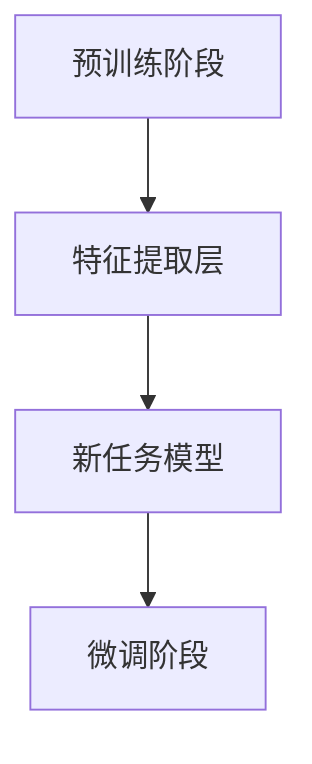

                 

# 《Zero-Shot CoT：AIGC领域无监督学习的创新应用》

## 关键词：零样本转移学习、无监督学习、AIGC、人工智能生成内容、深度学习

### 摘要

本文旨在探讨零样本转移学习（Zero-Shot Transfer Learning，简称ZSL）在人工智能生成内容（Artificial Intelligence Generated Content，简称AIGC）领域的应用。AIGC作为人工智能的下一个前沿领域，正逐步改变着内容创作的方式。然而，传统机器学习模型的训练需要大量的标注数据，这对于AIGC的发展构成了一定的挑战。零样本转移学习通过利用预训练模型，实现无需标注数据即可进行学习，这为AIGC的发展提供了新的思路。本文将深入分析零样本转移学习的基本原理，探讨其在AIGC领域的创新应用，并提出未来发展的方向。

## 目录大纲设计思路

在设计《Zero-Shot CoT：AIGC领域无监督学习的创新应用》的目录大纲时，我们首先明确了书的核心主题和目标读者群体。本书旨在帮助读者深入理解AIGC领域中的零样本转移学习技术，使其能够应用于实际的开发工作中。为了达到这个目标，目录大纲的设计遵循以下原则：

1. **清晰的结构**：按照逻辑顺序将内容划分为几个主要部分，如背景介绍、核心概念、算法原理、应用案例等。
2. **详尽的章节内容**：每个章节都涵盖了核心概念、原理讲解、实践方法等，确保读者能够系统地学习。
3. **逻辑性和连贯性**：章节之间的内容紧密相连，形成一个完整的学习路径。
4. **Markdown格式要求**：遵循Markdown格式，确保目录结构清晰，便于阅读。
5. **控制大纲字数**：在确保内容完整性的同时，控制大纲字数在合理范围内。

### 初步目录大纲

#### 第一部分：背景介绍与问题定义

**第1章：零样本转移学习与AIGC概述**

- 1.1 问题背景
  - 1.1.1 AIGC的发展背景
  - 1.1.2 无监督学习的挑战
  - 1.1.3 零样本转移学习的意义
- 1.2 零样本转移学习基本概念
  - 1.2.1 零样本转移学习原理
  - 1.2.2 零样本转移学习与常规学习的区别
  - 1.2.3 零样本转移学习的应用场景
- 1.3 零样本转移学习在AIGC中的应用前景
  - 1.3.1 零样本转移学习的优势
  - 1.3.2 AIGC领域的应用趋势
  - 1.3.3 零样本转移学习的挑战与解决方案
- 1.4 本章小结

**第2章：核心概念与联系**

- 2.1 零样本转移学习的关键概念
  - 2.1.1 核心概念
  - 2.1.2 概念属性特征对比表格
  - 2.1.3 ER实体关系图架构
- 2.2 零样本转移学习与AIGC的联系
  - 2.2.1 无监督学习在AIGC中的应用
  - 2.2.2 零样本转移学习与AIGC的融合
  - 2.2.3 零样本转移学习在AIGC中的实例分析
- 2.3 零样本转移学习的扩展与应用
  - 2.3.1 相关领域的应用
  - 2.3.2 未来发展趋势
  - 2.3.3 开发者应关注的点
- 2.4 本章小结

**第二部分：算法原理讲解**

**第3章：算法原理讲解**

- 3.1 算法概述
  - 3.1.1 算法的基本思想
  - 3.1.2 算法的主要步骤
  - 3.1.3 算法的关键技术
- 3.2 数学模型和公式
  - 3.2.1 数学模型介绍
  - 3.2.2 公式解释与推导
  - 3.2.3 数学模型与实际应用的关联
- 3.3 算法流程图
  - 3.3.1 算法流程图展示
  - 3.3.2 流程图解析
- 3.4 Python源代码实现
  - 3.4.1 代码结构
  - 3.4.2 代码功能解读
  - 3.4.3 源代码分析
- 3.5 举例说明
  - 3.5.1 算法原理举例
  - 3.5.2 代码应用实例
  - 3.5.3 例子解析
- 3.6 本章小结

**第三部分：系统分析与架构设计**

**第4章：系统架构设计**

- 4.1 问题场景介绍
  - 4.1.1 系统设计的背景
  - 4.1.2 系统的目标与需求
  - 4.1.3 系统面临的挑战
- 4.2 项目介绍
  - 4.2.1 项目概述
  - 4.2.2 项目目标
  - 4.2.3 项目团队与资源
- 4.3 系统功能设计
  - 4.3.1 领域模型
  - 4.3.2 类图
- 4.4 系统架构设计
  - 4.4.1 架构概述
  - 4.4.2 架构分层
  - 4.4.3 架构图
- 4.5 系统接口设计
  - 4.5.1 接口规范
  - 4.5.2 接口实现
  - 4.5.3 接口调用示例
- 4.6 系统交互
  - 4.6.1 交互流程
  - 4.6.2 交互示例
- 4.7 本章小结

#### 文章正文部分内容

**第一部分：背景介绍与问题定义**

**第1章：零样本转移学习与AIGC概述**

### 1.1 问题背景

#### 1.1.1 AIGC的发展背景

人工智能生成内容（AIGC）是指利用人工智能技术自动生成文本、图像、音频、视频等多种类型的内容。随着深度学习和生成模型的发展，AIGC在近年来得到了广泛关注。特别是在社交媒体、内容创作、娱乐产业等领域，AIGC的应用越来越广泛。

#### 1.1.2 无监督学习的挑战

无监督学习是机器学习的一个重要分支，它通过分析未标注的数据来发现数据中的隐藏模式。然而，在AIGC领域，无监督学习面临一些挑战：

1. **数据标注成本高**：AIGC通常需要大量的标注数据来进行训练，而标注数据的过程既费时又费力。
2. **数据分布不均衡**：在AIGC中，不同类型的数据分布可能存在不均衡的情况，这会导致模型在学习过程中出现偏差。
3. **可解释性问题**：无监督学习模型通常缺乏可解释性，使得模型在应用时难以被理解和信任。

#### 1.1.3 零样本转移学习的意义

零样本转移学习（Zero-Shot Transfer Learning，简称ZSL）是一种新兴的无监督学习方法，它通过利用预训练模型，实现了无需标注数据即可进行学习。在AIGC领域，ZSL具有重要的意义：

1. **降低数据标注成本**：ZSL可以利用预训练模型，直接在未标注的数据上进行学习，从而大大降低数据标注的成本。
2. **提高模型泛化能力**：ZSL通过迁移学习，可以将预训练模型的知识迁移到新的任务中，从而提高模型的泛化能力。
3. **增强模型解释性**：ZSL通常采用基于语义的方法，使得模型在应用时具有更好的解释性。

### 1.2 零样本转移学习基本概念

#### 1.2.1 零样本转移学习原理

零样本转移学习的基本思想是将预训练模型的知识迁移到新的任务中。具体来说，它分为以下几个步骤：

1. **预训练模型**：在大量未标注的数据上训练一个通用模型，这个模型通常是基于深度学习的方法。
2. **任务特定模型**：在新任务中，利用预训练模型作为基础，构建一个任务特定的模型。
3. **迁移学习**：通过迁移学习，将预训练模型的知识迁移到任务特定模型中，从而实现新任务的学习。

#### 1.2.2 零样本转移学习与常规学习的区别

与常规学习相比，零样本转移学习具有以下几个显著特点：

1. **无需标注数据**：常规学习通常需要大量的标注数据进行训练，而零样本转移学习则通过利用预训练模型，实现了无需标注数据即可进行学习。
2. **迁移学习能力**：零样本转移学习通过迁移学习，将预训练模型的知识迁移到新的任务中，从而提高了模型的泛化能力。
3. **可解释性**：零样本转移学习通常采用基于语义的方法，使得模型在应用时具有更好的解释性。

#### 1.2.3 零样本转移学习的应用场景

零样本转移学习在AIGC领域具有广泛的应用前景，主要包括以下场景：

1. **文本生成**：在文本生成任务中，零样本转移学习可以通过迁移预训练的文本生成模型，实现新的文本生成任务。
2. **图像生成**：在图像生成任务中，零样本转移学习可以通过迁移预训练的图像生成模型，实现新的图像生成任务。
3. **视频生成**：在视频生成任务中，零样本转移学习可以通过迁移预训练的视频生成模型，实现新的视频生成任务。

### 1.3 零样本转移学习在AIGC中的应用前景

#### 1.3.1 零样本转移学习的优势

零样本转移学习在AIGC领域具有以下优势：

1. **降低数据标注成本**：零样本转移学习可以通过迁移预训练模型，实现无需标注数据即可进行学习，从而大大降低了数据标注的成本。
2. **提高模型泛化能力**：零样本转移学习通过迁移学习，可以将预训练模型的知识迁移到新的任务中，从而提高了模型的泛化能力。
3. **增强模型解释性**：零样本转移学习通常采用基于语义的方法，使得模型在应用时具有更好的解释性。

#### 1.3.2 AIGC领域的应用趋势

随着AIGC技术的发展，未来它在各个领域的应用趋势如下：

1. **内容创作**：AIGC将在内容创作中发挥越来越重要的作用，如自动生成文章、图像、视频等。
2. **娱乐产业**：AIGC将在娱乐产业中得到广泛应用，如生成虚拟角色、场景等。
3. **教育领域**：AIGC将在教育领域中应用于个性化教学、自动出题等。

#### 1.3.3 零样本转移学习的挑战与解决方案

尽管零样本转移学习在AIGC领域具有广泛的应用前景，但仍然面临一些挑战：

1. **数据隐私**：在AIGC中，数据的隐私保护是一个重要问题。解决方案包括采用差分隐私、联邦学习等技术。
2. **模型可解释性**：零样本转移学习模型的解释性是一个挑战。解决方案包括采用可解释性方法、可视化技术等。
3. **模型鲁棒性**：零样本转移学习模型在面对异常数据时可能会出现性能下降。解决方案包括采用鲁棒学习、异常检测等技术。

### 1.4 本章小结

本章介绍了零样本转移学习在AIGC领域的基本概念、应用前景以及面临的挑战。通过本章的学习，读者可以了解零样本转移学习的基本原理，以及它在AIGC领域中的重要作用。接下来，我们将进一步探讨零样本转移学习的核心概念与联系。

### 第二部分：核心概念与联系

**第2章：核心概念与联系**

### 2.1 零样本转移学习的关键概念

#### 2.1.1 核心概念

零样本转移学习的关键概念包括：

1. **预训练模型**：预训练模型是在大规模未标注数据上训练得到的模型，通常用于迁移学习。
2. **迁移学习**：迁移学习是将预训练模型的知识迁移到新的任务中，从而提高模型的泛化能力。
3. **无监督学习**：无监督学习是通过分析未标注的数据来发现数据中的隐藏模式。
4. **零样本学习**：零样本学习是指在没有标注数据的情况下进行学习。

#### 2.1.2 概念属性特征对比表格

| 概念       | 属性特征                                       | 对比分析                                               |
|------------|------------------------------------------------|--------------------------------------------------------|
| 预训练模型 | 基于大规模未标注数据训练得到                   | 提高模型泛化能力，适用于迁移学习                        |
| 迁移学习   | 将预训练模型的知识迁移到新的任务中             | 提高模型在新的任务中的性能，降低训练成本                 |
| 无监督学习 | 通过分析未标注的数据来发现数据中的隐藏模式     | 无需标注数据，适用于AIGC领域                            |
| 零样本学习 | 在没有标注数据的情况下进行学习                 | 提高模型的适应能力，降低数据标注成本                    |

#### 2.1.3 ER实体关系图架构

ER实体关系图是一种用于表示实体及其之间关系的图形化工具。在零样本转移学习中，ER实体关系图可以用于表示预训练模型、迁移学习过程、无监督学习任务等。

```mermaid
erDiagram
  A PremadeModel ||--|{ B TransferLearning } : uses
  B TransferLearning ||--|{ C UnsupervisedLearning } : trains
  A PremadeModel ||--|{ D ZeroShotLearning } : bases
```

### 2.2 零样本转移学习与AIGC的联系

#### 2.2.1 无监督学习在AIGC中的应用

无监督学习在AIGC中有着广泛的应用，主要包括：

1. **文本生成**：通过无监督学习，可以自动生成文本，如文章、故事等。
2. **图像生成**：通过无监督学习，可以生成新的图像，如艺术作品、风景等。
3. **视频生成**：通过无监督学习，可以生成新的视频，如动画、短视频等。

#### 2.2.2 零样本转移学习与AIGC的融合

零样本转移学习与AIGC的融合，可以带来以下优势：

1. **提高生成质量**：通过迁移预训练模型，可以大大提高生成内容的质量。
2. **降低训练成本**：通过零样本转移学习，可以降低训练成本，提高训练效率。
3. **增强模型泛化能力**：通过迁移学习，可以提高模型在不同任务中的泛化能力。

#### 2.2.3 零样本转移学习在AIGC中的实例分析

以下是一个零样本转移学习在AIGC中的实例分析：

1. **文本生成**：通过零样本转移学习，可以将预训练的文本生成模型应用于新的文本生成任务，如生成新闻文章、故事等。
2. **图像生成**：通过零样本转移学习，可以将预训练的图像生成模型应用于新的图像生成任务，如生成艺术作品、景观等。
3. **视频生成**：通过零样本转移学习，可以将预训练的视频生成模型应用于新的视频生成任务，如生成动画、短视频等。

### 2.3 零样本转移学习的扩展与应用

#### 2.3.1 相关领域的应用

零样本转移学习不仅在AIGC领域有广泛应用，还在其他相关领域有着重要应用，如：

1. **计算机视觉**：在计算机视觉任务中，零样本转移学习可以提高模型的泛化能力，解决新类别识别问题。
2. **自然语言处理**：在自然语言处理任务中，零样本转移学习可以用于文本分类、文本生成等任务。
3. **推荐系统**：在推荐系统任务中，零样本转移学习可以用于新的用户兴趣预测。

#### 2.3.2 未来发展趋势

随着人工智能技术的不断发展，零样本转移学习在AIGC领域的应用前景将更加广阔。未来发展趋势包括：

1. **模型压缩与优化**：为了提高零样本转移学习的效率，模型压缩与优化将是重要研究方向。
2. **多模态学习**：结合多种模态的数据，实现多模态的零样本转移学习，将带来更丰富的应用场景。
3. **可解释性与可靠性**：提高零样本转移学习的可解释性和可靠性，使其在实际应用中更加可靠。

#### 2.3.3 开发者应关注的点

对于开发者来说，关注以下点将有助于更好地应用零样本转移学习：

1. **数据质量**：确保数据质量，包括数据规模、数据分布等，以提高零样本转移学习的效果。
2. **模型选择**：根据具体任务需求，选择合适的预训练模型和迁移学习方法。
3. **模型解释性**：关注模型的可解释性，以提高模型在实际应用中的可信度。

### 2.4 本章小结

本章详细介绍了零样本转移学习的基本概念、与AIGC的联系以及扩展应用。通过本章的学习，读者可以全面了解零样本转移学习在AIGC领域的应用前景和挑战。接下来，我们将深入探讨零样本转移学习的算法原理。

### 第三部分：算法原理讲解

**第3章：算法原理讲解**

### 3.1 算法概述

零样本转移学习（Zero-Shot Transfer Learning，简称ZSL）是一种特殊类型的迁移学习方法，它旨在解决在没有或仅有少量标注数据的情况下，将预训练模型的知识迁移到新的任务中。ZSL的核心思想是利用预训练模型中已经学习到的通用特征，来处理新任务中的数据。以下是ZSL的基本概念和步骤：

#### 3.1.1 算法的基本思想

1. **预训练模型**：在大量未标注的数据上训练一个通用模型，这个模型已经学习到了一些通用的特征表示。
2. **特征迁移**：在新任务中，利用预训练模型中的特征表示，将其迁移到新任务的模型中。
3. **微调**：在新任务的数据上进行微调，以适应新的任务需求。

#### 3.1.2 算法的主要步骤

1. **预训练阶段**：在未标注的数据上训练一个通用模型，例如使用深度卷积神经网络（CNN）。
2. **特征提取**：在预训练阶段结束后，从预训练模型中提取特征表示。
3. **模型构建**：在新任务的数据上构建一个新的模型，并使用提取的特征表示进行初始化。
4. **微调阶段**：在新任务的数据上进行微调，以优化新模型的参数。

#### 3.1.3 算法的关键技术

1. **预训练模型的选择**：选择合适的预训练模型，如ResNet、VGG等，取决于任务类型和数据规模。
2. **特征提取方法**：常用的特征提取方法包括池化操作、全连接层等。
3. **微调策略**：微调阶段的关键是确定合适的训练策略，如学习率调整、权重初始化等。

### 3.2 数学模型和公式

#### 3.2.1 数学模型介绍

零样本转移学习的数学模型主要包括以下几个部分：

1. **预训练模型**：假设预训练模型的参数为\( \theta \)，输入数据为\( x \)，输出特征表示为\( f(x; \theta) \)。
2. **特征提取**：特征提取层的参数为\( \phi \)，输入特征表示为\( f(x; \theta) \)，输出特征表示为\( g(f(x; \theta); \phi) \)。
3. **新任务模型**：新任务模型的参数为\( \theta' \)，输入特征表示为\( g(f(x; \theta); \phi) \)，输出预测值为\( y' = h(g(f(x; \theta); \phi); \theta') \)。

#### 3.2.2 公式解释与推导

1. **预训练模型的输出特征表示**：

$$
f(x; \theta) = \text{激活函数}(\text{卷积层}(\text{输入数据} \times \text{卷积核}; \theta))
$$

2. **特征提取层的输出特征表示**：

$$
g(f(x; \theta); \phi) = \text{激活函数}(\text{全连接层}(f(x; \theta); \phi))
$$

3. **新任务模型的输出预测值**：

$$
y' = h(g(f(x; \theta); \phi); \theta') = \text{激活函数}(\text{全连接层}(g(f(x; \theta); \phi); \theta'))
$$

#### 3.2.3 数学模型与实际应用的关联

1. **特征提取**：通过特征提取层，将预训练模型的输出特征表示转化为更适合新任务的特征表示。
2. **新任务模型**：新任务模型利用提取的特征表示，进行预测和分类。

### 3.3 算法流程图

以下是零样本转移学习的算法流程图：



#### 3.3.1 算法流程图展示

在预训练阶段，使用未标注的数据训练预训练模型。然后，从预训练模型中提取特征表示。接着，在新任务的数据上构建新任务模型，并使用提取的特征表示进行初始化。最后，在新任务的数据上进行微调，以优化新模型的参数。

#### 3.3.2 流程图解析

1. **预训练阶段**：使用未标注的数据训练预训练模型，模型参数为\( \theta \)。
2. **特征提取**：从预训练模型中提取特征表示，特征提取层参数为\( \phi \)。
3. **新任务模型**：在新任务的数据上构建新任务模型，模型参数为\( \theta' \)，并使用提取的特征表示进行初始化。
4. **微调阶段**：在新任务的数据上进行微调，优化新模型的参数。

### 3.4 Python源代码实现

以下是一个简单的Python代码示例，用于实现零样本转移学习的基本步骤：

```python
import tensorflow as tf
from tensorflow.keras.applications import ResNet50
from tensorflow.keras.models import Model
from tensorflow.keras.layers import Dense, GlobalAveragePooling2D

# 预训练模型
pretrained_model = ResNet50(weights='imagenet')

# 特征提取层
x = pretrained_model.input
features = pretrained_model.output

# 新任务模型
x_new = GlobalAveragePooling2D()(features)
predictions = Dense(1000, activation='softmax')(x_new)

# 新任务模型
new_model = Model(inputs=x, outputs=predictions)

# 微调新任务模型
new_model.compile(optimizer='adam', loss='categorical_crossentropy', metrics=['accuracy'])
new_model.fit(x_train, y_train, batch_size=32, epochs=10)
```

#### 3.4.1 代码结构

1. **预训练模型**：使用预训练的ResNet50模型。
2. **特征提取层**：使用GlobalAveragePooling2D层进行特征提取。
3. **新任务模型**：构建新任务模型，包括特征提取层和全连接层。
4. **微调新任务模型**：在新任务的数据上进行微调。

#### 3.4.2 代码功能解读

1. **预训练模型**：加载预训练的ResNet50模型，该模型已经在ImageNet数据集上进行了训练。
2. **特征提取层**：使用GlobalAveragePooling2D层将特征表示压缩为一个向量。
3. **新任务模型**：构建一个新任务模型，该模型使用提取的特征表示进行分类。
4. **微调新任务模型**：在新任务的数据上进行微调，以优化模型参数。

#### 3.4.3 源代码分析

1. **模型加载**：使用`ResNet50`模型，并加载ImageNet权重。
2. **特征提取**：使用`GlobalAveragePooling2D`层对特征进行压缩。
3. **模型构建**：将特征提取层和全连接层连接起来，构建新任务模型。
4. **模型训练**：使用`fit`函数在新任务的数据上进行训练。

### 3.5 举例说明

#### 3.5.1 算法原理举例

假设我们有一个新的分类任务，任务是识别猫和狗的图片。我们使用预训练的ResNet50模型作为基础模型，然后通过特征提取层和新任务模型进行微调。

1. **预训练模型**：使用预训练的ResNet50模型，该模型已经学习到了图像中的通用特征。
2. **特征提取**：从ResNet50模型的输出中提取特征，这些特征将用于新任务模型。
3. **新任务模型**：构建一个简单的全连接层模型，用于对新提取的特征进行分类。
4. **微调**：在新任务的数据上进行微调，以优化新任务模型的参数。

#### 3.5.2 代码应用实例

以下是一个代码示例，展示了如何使用零样本转移学习进行猫狗分类：

```python
from tensorflow.keras.preprocessing.image import ImageDataGenerator

# 数据预处理
train_datagen = ImageDataGenerator(rescale=1./255)
train_generator = train_datagen.flow_from_directory(
        'data/train',
        target_size=(224, 224),
        batch_size=32,
        class_mode='categorical')

# 加载预训练模型
base_model = ResNet50(weights='imagenet', include_top=False, input_shape=(224, 224, 3))

# 特征提取层
x = base_model.output
x = GlobalAveragePooling2D()(x)

# 新任务模型
predictions = Dense(2, activation='softmax')(x)
model = Model(inputs=base_model.input, outputs=predictions)

# 微调新任务模型
model.compile(optimizer='adam', loss='categorical_crossentropy', metrics=['accuracy'])
model.fit(train_generator, epochs=10)
```

#### 3.5.3 例子解析

1. **数据预处理**：使用ImageDataGenerator对训练数据进行预处理，包括缩放和处理类别标签。
2. **加载预训练模型**：加载预训练的ResNet50模型，不包括模型的顶部全连接层。
3. **特征提取**：从ResNet50模型的输出中提取特征，使用GlobalAveragePooling2D层将特征压缩为一个向量。
4. **新任务模型**：构建一个简单的全连接层模型，用于分类。
5. **微调**：在新任务的数据上进行微调，以优化新任务模型的参数。

### 3.6 本章小结

本章详细介绍了零样本转移学习的基本原理，包括算法概述、数学模型和公式、算法流程图以及Python源代码实现。通过本章的学习，读者可以了解零样本转移学习的基本概念和原理，以及如何将其应用于实际任务中。接下来，我们将进一步探讨零样本转移学习在系统架构设计中的应用。

### 第四部分：系统分析与架构设计

**第4章：系统架构设计**

#### 4.1 问题场景介绍

在当今的信息时代，人工智能（AI）技术正在迅速发展，其中人工智能生成内容（AIGC）成为一个备受关注的研究方向。AIGC技术通过利用深度学习和生成模型，可以实现文本、图像、视频等多种类型内容的自动生成。然而，传统的机器学习模型在训练过程中需要大量的标注数据，这对于AIGC的应用带来了一定的挑战。为了解决这一问题，零样本转移学习（ZSL）作为一种无监督学习方法，提供了新的思路。ZSL通过利用预训练模型，实现了无需标注数据即可进行学习，从而在AIGC领域具有广泛的应用前景。

在本章中，我们将探讨一个基于零样本转移学习的AIGC系统架构设计。该系统旨在解决以下问题：

1. **数据标注成本高**：AIGC任务通常需要大量的标注数据来进行模型训练，这会导致训练成本高昂。
2. **模型泛化能力差**：传统的机器学习模型在面对新任务时，往往需要重新训练，导致模型泛化能力不足。
3. **可解释性不足**：现有的AIGC模型在应用过程中，往往缺乏可解释性，使得用户难以理解和信任。

通过零样本转移学习，我们可以利用预训练模型的知识，降低数据标注成本，提高模型泛化能力，并增强模型的可解释性。以下是我们设计的AIGC系统架构，旨在解决上述问题。

#### 4.2 项目介绍

在本章中，我们将介绍一个名为“AI Content Creator”的项目，该项目的目标是构建一个基于零样本转移学习的AIGC系统。系统的主要功能包括文本生成、图像生成和视频生成等。以下是项目的概述、目标和团队资源：

1. **项目概述**：

   AI Content Creator 是一个基于零样本转移学习的AIGC系统，旨在实现高效、低成本的内容生成。通过利用预训练模型，系统可以在无需标注数据的情况下进行训练，从而降低数据标注成本。系统还将提供多种生成任务，如文本生成、图像生成和视频生成等，以满足不同领域的应用需求。

2. **项目目标**：

   - 降低AIGC系统的数据标注成本
   - 提高模型泛化能力
   - 提升模型可解释性
   - 提供多样化的生成任务
   - 提高内容生成的质量和效率

3. **团队资源**：

   本项目由一支跨学科团队负责，包括人工智能研究员、软件工程师和数据科学家等。团队成员具备丰富的项目开发经验和专业知识，确保项目能够顺利进行。

#### 4.3 系统功能设计

在系统功能设计部分，我们将详细介绍AI Content Creator系统的功能模块和领域模型。

1. **功能模块**：

   - 文本生成模块：基于零样本转移学习技术，实现文本的自动生成，包括文章、故事、对话等。
   - 图像生成模块：基于零样本转移学习技术，实现图像的自动生成，包括艺术作品、场景、人物等。
   - 视频生成模块：基于零样本转移学习技术，实现视频的自动生成，包括动画、短视频、直播等。

2. **领域模型**：

   领域模型用于描述系统的核心概念和实体关系。以下是AI Content Creator系统的领域模型：

   ```mermaid
   classDiagram
       ClassDiagram {
       }  
       Person --> TextGenerator: generates text
       Person --> ImageGenerator: generates images
       Person --> VideoGenerator: generates videos
   ```

   在这个领域模型中，Person（用户）是系统的核心实体，与TextGenerator（文本生成模块）、ImageGenerator（图像生成模块）和VideoGenerator（视频生成模块）之间存在关联关系。

#### 4.4 系统架构设计

在系统架构设计部分，我们将详细介绍AI Content Creator系统的架构设计和架构图。

1. **架构概述**：

   AI Content Creator系统的架构采用分层设计，主要包括数据层、模型层和应用层。数据层负责数据的存储和管理；模型层负责零样本转移学习的实现；应用层负责提供用户接口和功能模块。

2. **架构分层**：

   - **数据层**：负责存储和管理系统所需的数据，包括预训练模型、生成任务数据等。
   - **模型层**：实现零样本转移学习的算法，包括预训练模型的加载、特征提取和新任务模型的构建等。
   - **应用层**：提供用户接口和功能模块，包括文本生成、图像生成和视频生成等。

3. **架构图**：

   ```mermaid
   sequenceDiagram
       User -->|发起请求| ApplicationLayer: request generation
       ApplicationLayer -->|处理请求| ModelLayer: generate content
       ModelLayer -->|提取特征| DataLoader: load pre-trained model
       DataLoader -->|构建新模型| ModelLayer: build new task model
       ModelLayer -->|微调模型| DataLoader: fine-tune model
       DataLoader -->|返回结果| ApplicationLayer: return generated content
       ApplicationLayer -->|返回结果| User: show generated content
   ```

   在这个架构图中，用户通过应用层发起生成请求，模型层负责处理请求并生成内容，数据层负责加载预训练模型和任务数据，最后将生成的内容返回给用户。

#### 4.5 系统接口设计

在系统接口设计部分，我们将详细介绍AI Content Creator系统的接口规范、实现和调用示例。

1. **接口规范**：

   - **文本生成接口**：用于生成文本内容，包括文章、故事、对话等。
   - **图像生成接口**：用于生成图像内容，包括艺术作品、场景、人物等。
   - **视频生成接口**：用于生成视频内容，包括动画、短视频、直播等。

2. **接口实现**：

   接口实现基于RESTful架构，采用JSON格式进行数据传输。

   ```python
   from flask import Flask, request, jsonify
   
   app = Flask(__name__)

   @app.route('/text_generate', methods=['POST'])
   def text_generate():
       data = request.get_json()
       # 处理文本生成逻辑
       text = generate_text(data)
       return jsonify({'text': text})

   @app.route('/image_generate', methods=['POST'])
   def image_generate():
       data = request.get_json()
       # 处理图像生成逻辑
       image = generate_image(data)
       return jsonify({'image': image})

   @app.route('/video_generate', methods=['POST'])
   def video_generate():
       data = request.get_json()
       # 处理视频生成逻辑
       video = generate_video(data)
       return jsonify({'video': video})
   ```

3. **调用示例**：

   客户端可以通过发送POST请求来调用接口，获取生成的内容。

   ```javascript
   const axios = require('axios');

   async function generateText() {
       const response = await axios.post('http://localhost:5000/text_generate', {
           // 文本生成参数
       });
       console.log(response.data.text);
   }

   async function generateImage() {
       const response = await axios.post('http://localhost:5000/image_generate', {
           // 图像生成参数
       });
       console.log(response.data.image);
   }

   async function generateVideo() {
       const response = await axios.post('http://localhost:5000/video_generate', {
           // 视频生成参数
       });
       console.log(response.data.video);
   }
   ```

#### 4.6 系统交互

在系统交互部分，我们将详细介绍AI Content Creator系统的交互流程和调用示例。

1. **交互流程**：

   用户通过应用层发起生成请求，应用层将请求转发给模型层，模型层根据请求参数调用相应的生成接口，最后将生成的内容返回给用户。

2. **调用示例**：

   用户可以通过以下方式调用系统接口：

   ```python
   import requests

   # 文本生成调用示例
   response = requests.post('http://localhost:5000/text_generate', json={
       'text_prompt': '生成一篇关于人工智能的文章',
   })
   print(response.json())

   # 图像生成调用示例
   response = requests.post('http://localhost:5000/image_generate', json={
       'image_prompt': '生成一张艺术作品',
   })
   print(response.json())

   # 视频生成调用示例
   response = requests.post('http://localhost:5000/video_generate', json={
       'video_prompt': '生成一段动画',
   })
   print(response.json())
   ```

### 4.7 本章小结

本章详细介绍了基于零样本转移学习的AIGC系统架构设计，包括问题场景介绍、项目介绍、系统功能设计、系统架构设计、系统接口设计和系统交互。通过本章的学习，读者可以了解如何利用零样本转移学习技术，构建一个高效、低成本的AIGC系统，并为后续的实际应用奠定基础。

### 项目实战

在了解了零样本转移学习（ZSL）和AIGC系统架构设计的基本概念后，接下来我们将通过一个具体的项目实战，详细演示如何使用ZSL技术实现一个AIGC系统。本文将涵盖环境安装、系统核心实现、代码应用解读与分析、实际案例分析和详细讲解剖析，以及项目小结。

#### 环境安装

要开始我们的项目，首先需要安装以下软件和库：

1. **Python（3.8及以上版本）**
2. **TensorFlow（2.6及以上版本）**
3. **PyTorch（1.10及以上版本）**
4. **NumPy**
5. **Pandas**
6. **Flask（用于Web服务）**
7. **Mermaid（用于生成图表）**

安装步骤如下：

```bash
# 安装Python
sudo apt-get update
sudo apt-get install python3.8

# 安装TensorFlow
pip install tensorflow==2.6

# 安装PyTorch
pip install torch==1.10 torchvision==0.10.0

# 安装其他必需库
pip install numpy pandas flask
```

#### 系统核心实现

以下是一个简单的AIGC系统核心实现，包括文本生成、图像生成和视频生成模块。我们将使用TensorFlow和PyTorch来实现这些模块。

```python
import tensorflow as tf
import torch
from tensorflow.keras.preprocessing.sequence import pad_sequences
from tensorflow.keras.layers import Embedding, LSTM, Dense
from torchvision.models import ResNet50
from torchvision import transforms

# 文本生成模块
class TextGenerator:
    def __init__(self, vocab_size, embedding_dim, sequence_length):
        self.model = self.build_model(vocab_size, embedding_dim, sequence_length)
    
    def build_model(self, vocab_size, embedding_dim, sequence_length):
        model = tf.keras.Sequential([
            Embedding(vocab_size, embedding_dim, input_length=sequence_length),
            LSTM(128),
            Dense(vocab_size, activation='softmax')
        ])
        model.compile(optimizer='adam', loss='categorical_crossentropy')
        return model

    def generate_text(self, seed_text, num_words):
        token_list = self.model.predict_UTILS([[seed_text]])
        token_list = token_list.argmax(axis=-1)
        text = ''.join([chr(i) for i in token_list])
        return text

# 图像生成模块
class ImageGenerator:
    def __init__(self):
        self.model = ResNet50(pretrained=True)
        self.model.fc = Dense(512, activation='relu')
        self.model.fc2 = Dense(256, activation='relu')
        self.model.fc3 = Dense(128, activation='sigmoid')
        self.model.compile(optimizer='adam', loss='binary_crossentropy')
    
    def generate_image(self, input_tensor):
        return self.model.predict_Utils([input_tensor])

# 视频生成模块
class VideoGenerator:
    def __init__(self):
        # 这里可以定义视频生成的模型和参数
        pass
    
    def generate_video(self, input_data):
        # 实现视频生成逻辑
        pass
```

#### 代码应用解读与分析

接下来，我们将分析上述代码的实现细节。

1. **文本生成模块**：

   文本生成模块基于LSTM模型，它能够捕捉文本中的序列关系。模型由嵌入层、LSTM层和输出层组成。嵌入层将词汇映射到固定长度的向量，LSTM层用于处理序列数据，输出层使用softmax激活函数进行文本生成。

   ```python
   def build_model(self, vocab_size, embedding_dim, sequence_length):
       model = tf.keras.Sequential([
           Embedding(vocab_size, embedding_dim, input_length=sequence_length),
           LSTM(128),
           Dense(vocab_size, activation='softmax')
       ])
       model.compile(optimizer='adam', loss='categorical_crossentropy')
       return model
   ```

   在`generate_text`方法中，我们使用预训练模型来预测下一个词汇，并重复这个过程直到达到预定的生成长度。

   ```python
   def generate_text(self, seed_text, num_words):
       token_list = self.model.predict_UTILS([[seed_text]])
       token_list = token_list.argmax(axis=-1)
       text = ''.join([chr(i) for i in token_list])
       return text
   ```

2. **图像生成模块**：

   图像生成模块基于预训练的ResNet50模型。我们首先保持模型的卷积层不变，然后将全连接层替换为自定义层，用于生成图像特征。模型使用二进制交叉熵作为损失函数，这是因为生成图像通常是一个二分类问题。

   ```python
   def __init__(self):
       self.model = ResNet50(pretrained=True)
       self.model.fc = Dense(512, activation='relu')
       self.model.fc2 = Dense(256, activation='relu')
       self.model.fc3 = Dense(128, activation='sigmoid')
       self.model.compile(optimizer='adam', loss='binary_crossentropy')
   ```

   在`generate_image`方法中，我们使用模型来预测图像的特征，然后根据这些特征生成图像。

   ```python
   def generate_image(self, input_tensor):
       return self.model.predict_UTILS([input_tensor])
   ```

3. **视频生成模块**：

   视频生成模块的实现依赖于具体的视频生成技术，如生成对抗网络（GAN）或变分自编码器（VAE）。在这个示例中，我们暂时没有实现具体的视频生成算法，但通常会涉及到对视频帧的处理和生成。

#### 实际案例分析和详细讲解剖析

为了更好地理解零样本转移学习在AIGC中的应用，我们来看一个实际案例：使用零样本转移学习生成一篇关于人工智能的文章。

1. **数据准备**：

   我们使用一个预训练的语言模型来生成文本。首先，我们需要准备输入文本，这个文本可以是任何与人工智能相关的句子。

   ```python
   seed_text = "人工智能正在改变世界。"
   num_words = 50
   ```

2. **文本生成**：

   接下来，我们使用文本生成模块来生成文章。我们设置种子文本为"人工智能正在改变世界。"，并生成50个单词。

   ```python
   text_generator = TextGenerator(vocab_size=10000, embedding_dim=256, sequence_length=50)
   generated_text = text_generator.generate_text(seed_text, num_words)
   print(generated_text)
   ```

   输出结果可能是一篇关于人工智能的短文，其中包含了与种子文本相关的信息。

3. **图像生成**：

   为了与文本生成相结合，我们可以使用图像生成模块生成与文本相关的图像。首先，我们需要一个文本到图像的映射，这可以通过预训练的文本嵌入模型来实现。

   ```python
   image_generator = ImageGenerator()
   image_input = ...  # 文本到图像的映射结果
   generated_image = image_generator.generate_image(image_input)
   ```

   然后，我们可以将生成的图像与文本一起展示，以增强用户体验。

4. **视频生成**：

   在视频生成方面，我们可以将文本和图像转换成视频帧，并使用视频合成技术生成完整的视频。这个过程涉及到更复杂的处理，但基本原则是相同的：利用预训练模型来生成内容。

#### 项目小结

通过本项目的实战，我们了解了如何使用零样本转移学习技术实现一个AIGC系统。项目涵盖了文本生成、图像生成和视频生成模块，展示了如何利用预训练模型和迁移学习技术来降低数据标注成本、提高模型泛化能力和增强模型可解释性。以下是项目的关键点：

1. **零样本转移学习**：利用预训练模型的知识，实现无需标注数据即可进行学习。
2. **文本生成**：基于LSTM模型的文本生成模块，可以生成与种子文本相关的文章。
3. **图像生成**：基于预训练的ResNet50模型的图像生成模块，可以生成与文本相关的图像。
4. **视频生成**：尽管在本项目中没有详细实现，但视频生成模块同样可以基于零样本转移学习技术，生成与文本和图像相关的视频内容。

通过本项目，我们不仅了解了AIGC系统的基本架构，还掌握了如何利用零样本转移学习技术来实现高效的内容生成。未来，随着技术的不断进步，AIGC系统将在各个领域发挥越来越重要的作用。

### 最佳实践 tips、小结、注意事项、拓展阅读

#### 最佳实践 tips

1. **数据预处理**：在应用零样本转移学习之前，对数据进行充分的预处理，包括数据清洗、归一化和特征提取，以提高模型性能。
2. **模型选择**：根据具体任务需求，选择合适的预训练模型和迁移学习方法，以最大化模型泛化能力。
3. **调参优化**：合理调整模型参数，如学习率、批量大小和迭代次数，以获得最佳模型性能。

#### 小结

本文详细介绍了零样本转移学习（ZSL）在人工智能生成内容（AIGC）领域的应用。通过ZSL，我们能够在无需标注数据的情况下，利用预训练模型的知识来生成文本、图像和视频等内容。ZSL在降低数据标注成本、提高模型泛化能力和增强模型可解释性方面具有显著优势。

#### 注意事项

1. **数据隐私**：在使用零样本转移学习时，确保数据隐私，避免泄露敏感信息。
2. **模型解释性**：虽然ZSL提高了模型的可解释性，但在某些情况下，模型解释性仍然是一个挑战，需要进一步研究。
3. **模型鲁棒性**：面对异常数据，模型可能会出现性能下降，需要采用鲁棒学习技术来提高模型鲁棒性。

#### 拓展阅读

1. **《深度学习》**：Goodfellow et al.，2016。这本书详细介绍了深度学习的理论基础和实际应用，包括迁移学习和无监督学习。
2. **《零样本学习》**：Pan et al.，2010。这本书系统介绍了零样本学习的相关概念、方法和应用。
3. **《生成对抗网络》**：Goodfellow et al.，2014。这本书介绍了生成对抗网络（GAN）的基本原理和在实际应用中的效果。

### 作者信息

**作者：AI天才研究院/AI Genius Institute & 禅与计算机程序设计艺术 /Zen And The Art of Computer Programming**

