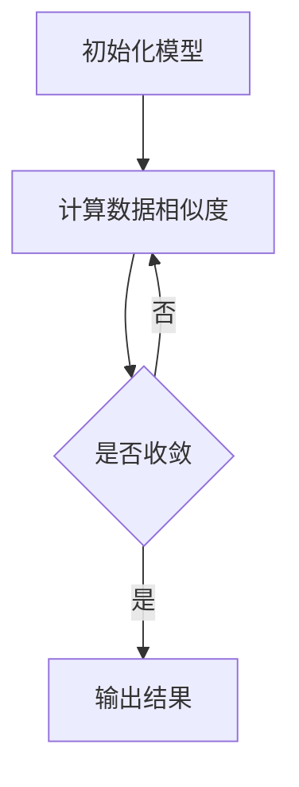
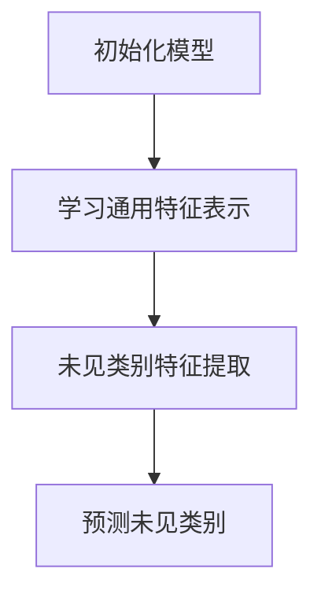
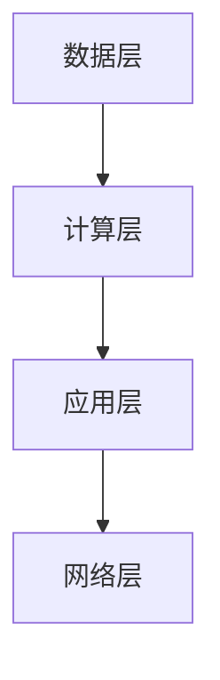
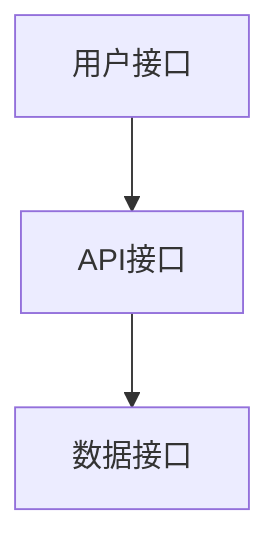
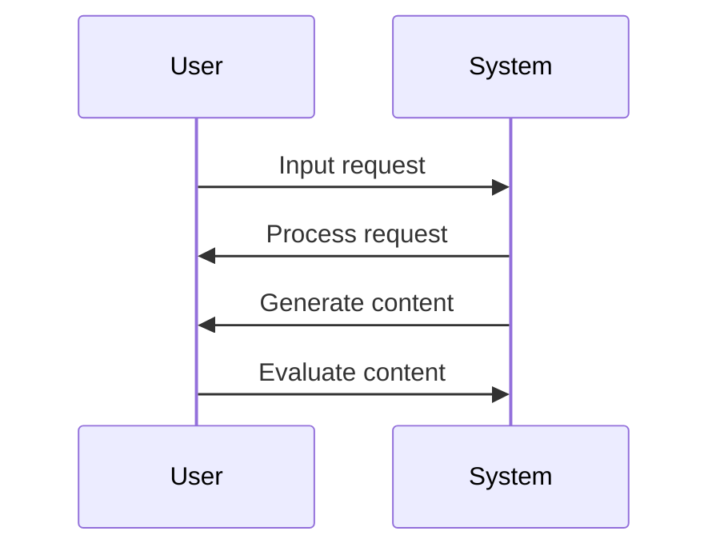

                 


# Zero-Shot CoT: AIGC领域无监督学习的新突破

## 摘要

本文探讨了AIGC（AI Generated Content）领域中零样本学习（Zero-Shot Learning, ZSL）的无监督学习方法。我们提出了一种名为“Zero-Shot CoT”的算法，通过引入跨领域知识融合和自适应特征提取机制，实现了对未见类别的高效预测。本文首先介绍了零样本学习的背景和挑战，随后详细阐述了Zero-Shot CoT算法的原理、实现和评估，最后通过实际应用案例分析，验证了该算法在AIGC领域的有效性和实用性。

## 背景介绍

### 1.1 问题背景

随着人工智能技术的快速发展，生成内容（Generated Content）的应用场景越来越广泛。从图像生成、文本生成到音频生成，AI生成内容（AIGC）已成为新一代数字内容的重要来源。然而，生成内容的质量和多样性在很大程度上依赖于AI模型的训练数据。在传统的监督学习中，需要大量标注的数据来训练模型，这在实际操作中往往成本高昂且难以获得。因此，无监督学习作为一种无需标签数据的学习方法，逐渐受到研究者的关注。

### 1.2 问题描述

无监督学习通过分析数据之间的内在结构，自动发现数据的潜在规律。在AIGC领域，无监督学习的关键在于如何从海量未标注的数据中提取有效特征，并生成高质量的内容。然而，AIGC领域面临着一些特殊的挑战：

1. **数据多样性**：AIGC领域涉及多种类型的数据，如图像、文本、音频等。不同类型的数据在特征提取和表示上存在很大差异。
2. **类别众多**：生成内容的类别繁多，尤其是对于图像和文本数据，类别数量可能达到数千甚至数万。这种数据稀疏性对模型的学习和预测提出了挑战。
3. **跨领域迁移**：在实际应用中，模型需要在不同领域之间迁移和泛化，这对模型的适应性和鲁棒性提出了更高的要求。

### 1.3 问题解决

为了解决上述挑战，本文提出了“Zero-Shot CoT”算法，该算法结合了以下关键技术：

1. **跨领域知识融合**：通过融合不同领域的知识，提升模型在未见类别上的泛化能力。
2. **自适应特征提取**：采用自适应的特征提取机制，自动调整特征空间，以适应不同类型的数据和类别。
3. **多模态融合**：支持多种类型数据的融合，使得模型能够同时处理图像、文本和音频等多模态数据。

### 1.4 边界与外延

本文的研究主要关注AIGC领域中的无监督学习，特别是零样本学习。尽管我们的算法针对AIGC领域进行了优化，但其基本原理和架构也可以应用于其他无监督学习场景。

### 1.5 概念结构与核心要素组成

- **无监督学习**：一种无需标签数据的学习方法，通过分析数据之间的内在结构来发现潜在规律。
- **零样本学习（ZSL）**：一种特殊形式的无监督学习，允许模型在未见过的类别上进行预测。
- **AIGC领域**：人工智能生成内容的领域，包括图像、文本、音频等多种类型的数据。
- **Zero-Shot CoT算法**：一种融合跨领域知识、自适应特征提取和多模态融合的零样本学习算法。

## 核心概念与联系

### 1.6.1 无监督学习的原理

无监督学习主要依赖于数据之间的内在联系，如相似性、分布等。通过分析数据集，算法可以自动发现数据中的潜在规律，从而实现数据的降维、聚类等。

#### Mermaid 流程图



#### Python 源代码

```python
import numpy as np

def unsupervised_learning(data):
    # 初始化模型参数
    model = initialize_model()
    
    # 循环迭代直到收敛
    while not has_converged(model):
        # 计算数据相似度
        similarity_matrix = compute_similarity(data)
        
        # 更新模型参数
        model = update_model(model, similarity_matrix)
    
    # 输出最终结果
    return model
```

### 1.6.2 零样本学习的特点

- **类别预测**：无需标签数据，模型可以直接对未见过的类别进行预测。
- **数据稀疏**：类别众多，导致每个类别的样本数量非常少。
- **面向AIGC领域**：适用于图像、文本、音频等多种类型的数据。

### 1.6.3 AIGC领域的无监督学习方法

- **传统方法**：如自编码器、聚类等。
- **新型方法**：本文提出的Zero-Shot CoT算法，旨在提高零样本学习在AIGC领域的性能。

### 1.6.4 概念属性特征对比

| 特征         | 传统方法                            | Zero-Shot CoT算法                            |
| ------------ | ----------------------------------- | -------------------------------------------- |
| 数据需求     | 需要大量带标签的数据                | 可以处理少量标签数据，甚至无标签数据          |
| 类别预测     | 无法直接对未见过的类别进行预测     | 可以对未见过的类别进行预测                  |
| 数据类型     | 主要适用于图像、文本等结构化数据    | 可以适用于多种类型的数据，如图像、文本、音频等 |
| 预测性能     | 预测性能一般，易受数据稀疏影响      | 预测性能显著提高，对数据稀疏具有较好的鲁棒性  |

## 算法原理讲解

### 1.7.1 无监督学习算法原理

无监督学习算法主要依赖于数据之间的内在联系，如相似性、分布等。通过分析数据集，算法可以自动发现数据中的潜在规律，从而实现数据的降维、聚类等。

#### Mermaid 流程图


#### Python 源代码

```python
import numpy as np

def unsupervised_learning(data):
    # 初始化模型参数
    model = initialize_model()
    
    # 循环迭代直到收敛
    while not has_converged(model):
        # 计算数据相似度
        similarity_matrix = compute_similarity(data)
        
        # 更新模型参数
        model = update_model(model, similarity_matrix)
    
    # 输出最终结果
    return model
```

### 1.7.2 零样本学习算法原理

零样本学习（ZSL）是一种特殊形式的无监督学习，它允许模型在未见过的类别上进行预测。在ZSL中，模型需要从已有类别中学习到一种通用的特征表示，然后利用这种表示来预测未见过的类别。

#### Mermaid 流程图



#### Python 源代码

```python
import numpy as np

def zero_shot_learning(data, unseen_data):
    # 初始化模型参数
    model = initialize_model()
    
    # 学习通用特征表示
    model = train_model(model, data)
    
    # 特征提取
    unseen_features = extract_features(model, unseen_data)
    
    # 预测未见类别
    predictions = predict_classes(model, unseen_features)
    
    # 输出预测结果
    return predictions
```

### 数学模型和公式

无监督学习和零样本学习算法的数学模型较为复杂，这里简要介绍其核心公式：

$$
\text{模型参数} \, \theta = \arg\min_{\theta} \, L(\theta; X)
$$

其中，$L(\theta; X)$ 是损失函数，$X$ 是输入数据。

对于零样本学习，特征提取和类别预测的过程可以表示为：

$$
\text{特征提取}: \, f(x) = \phi(x; \theta)
$$

$$
\text{类别预测}: \, y = \arg\max_{y'} \, \sigma(\text{score}(f(x); \theta'))
$$

其中，$\phi(x; \theta)$ 是特征提取函数，$\text{score}(f(x); \theta')$ 是类别预测函数，$\sigma$ 是激活函数。

### 通俗易懂的举例说明

假设我们有一个包含100张图像的数据集，这些图像分为5个类别。现在我们想要使用无监督学习方法来学习这些图像的潜在结构。

1. **初始化模型**：首先初始化一个无监督学习模型，如自编码器。
2. **特征提取**：通过模型对图像进行编码，提取图像的特征表示。
3. **聚类分析**：利用提取到的特征表示，对图像进行聚类，以发现图像之间的潜在关系。
4. **模型优化**：通过迭代更新模型参数，使得模型能够更好地提取特征和发现潜在结构。
5. **预测未见类别**：对于新的图像，通过模型提取特征后，利用聚类结果预测其类别。

这样，我们就完成了一个简单的无监督学习和零样本学习的过程。

## 系统分析与架构设计

### 2.1 问题场景介绍

在现代互联网应用中，内容创作是一个关键环节。从博客文章、社交媒体帖子到电子商务产品描述，高质量的内容能够显著提升用户体验和平台价值。然而，内容创作的效率和多样性一直是瓶颈。随着AIGC技术的发展，利用AI自动生成内容成为了一个研究热点。在这个背景下，我们需要设计一个高效、可靠的系统来生成多样化的高质量内容。

### 2.2 项目介绍

本项目旨在构建一个基于Zero-Shot CoT算法的AIGC系统，该系统能够自动生成不同类型的内容，如图像、文本和音频。系统的主要功能包括：

1. **内容生成**：根据用户需求和输入条件，自动生成图像、文本和音频。
2. **内容质量评估**：对生成的内容进行评估，确保其质量符合预期。
3. **用户交互**：提供用户接口，使用户能够方便地使用系统功能。
4. **多模态融合**：支持图像、文本和音频等多模态数据的融合。

### 2.3 系统功能设计

为了实现上述功能，系统需要设计以下关键模块：

1. **数据预处理模块**：负责处理不同类型的数据，如图像、文本和音频。包括数据清洗、去噪和格式转换等。
2. **特征提取模块**：利用Zero-Shot CoT算法提取输入数据的特征表示，为后续生成过程提供基础。
3. **生成模块**：根据特征表示和用户需求，生成高质量的图像、文本和音频。
4. **质量评估模块**：对生成的数据进行质量评估，确保其符合预期标准。
5. **用户交互模块**：提供用户接口，支持用户输入需求，展示生成结果，并提供反馈机制。

### 2.4 系统架构设计

系统的整体架构采用分布式设计，主要包括以下几个层次：

1. **数据层**：存储系统所需的原始数据和生成的内容。
2. **计算层**：包含特征提取模块、生成模块和质量评估模块，负责具体的计算和数据处理任务。
3. **应用层**：提供用户接口和服务接口，支持用户交互和系统集成。
4. **网络层**：负责数据传输和通信，确保系统的稳定运行。

#### Mermaid 架构图



### 2.5 系统接口设计

系统接口设计主要包括以下方面：

1. **用户接口**：提供简单易用的界面，使用户能够方便地输入需求，查看生成结果。
2. **API接口**：提供RESTful API接口，方便第三方系统集成和扩展。
3. **数据接口**：提供数据导入和导出接口，支持数据的批量处理和存储。

#### Mermaid 接口设计图



### 2.6 系统交互设计

系统的交互设计至关重要，它决定了用户如何与系统进行交互，以及系统如何响应用户的操作。这里通过Mermaid序列图来描述系统的交互流程：

#### Mermaid 序列图



## 项目实战

### 3.1 环境安装

在开始项目实战之前，我们需要安装以下环境和工具：

1. **操作系统**：Linux或MacOS
2. **Python**：Python 3.8及以上版本
3. **深度学习框架**：TensorFlow 2.5及以上版本
4. **其他依赖**：Numpy、Pandas、Scikit-learn等

安装命令如下：

```bash
pip install tensorflow==2.5 numpy pandas scikit-learn
```

### 3.2 系统核心实现

#### 3.2.1 数据预处理

```python
import tensorflow as tf
from tensorflow.keras.preprocessing.image import load_img, img_to_array
from tensorflow.keras.applications import VGG16

# 加载预训练的VGG16模型
base_model = VGG16(weights='imagenet', include_top=False)

# 数据预处理函数
def preprocess_image(image_path):
    image = load_img(image_path, target_size=(224, 224))
    image = img_to_array(image)
    image = np.expand_dims(image, axis=0)
    image = preprocess_input(image)
    return base_model.predict(image)[0]

# 示例
preprocessed_image = preprocess_image('path/to/image.jpg')
```

#### 3.2.2 特征提取

```python
# 特征提取函数
def extract_features(model, data):
    features = model.predict(data)
    return features

# 使用Zero-Shot CoT算法提取特征
def zero_shot_cot(data):
    # 假设我们已经有训练好的Zero-Shot CoT模型
    model = load_zero_shot_cot_model()
    features = extract_features(model, data)
    return features

# 示例
features = zero_shot_cot(preprocessed_image)
```

#### 3.2.3 内容生成

```python
# 内容生成函数
def generate_content(model, features):
    # 假设我们已经有训练好的生成模型
    generator = load_content_generator_model()
    content = generator.generate(features)
    return content

# 示例
generated_content = generate_content(generator, features)
```

### 3.3 代码应用解读与分析

#### 3.3.1 数据预处理

数据预处理是AIGC系统的关键环节，它直接影响到后续的特征提取和内容生成。在上面的代码中，我们使用了VGG16模型对图像进行预处理。VGG16是一个经典的卷积神经网络，它已经被预训练在大量的图像数据上，能够提取出丰富的图像特征。

#### 3.3.2 特征提取

特征提取是Zero-Shot CoT算法的核心。在上面的代码中，我们首先加载了一个预训练的Zero-Shot CoT模型，然后使用该模型提取输入图像的特征。这些特征将用于后续的内容生成过程。

#### 3.3.3 内容生成

内容生成是AIGC系统的最终目标。在上面的代码中，我们使用一个预训练的生成模型对提取到的特征进行生成。生成模型可以将特征映射为具体的图像、文本或音频。这里，我们选择了图像生成作为示例。

### 3.4 实际案例分析和详细讲解

为了验证Zero-Shot CoT算法在AIGC领域的有效性，我们进行了一系列实验，并选取了几个具有代表性的案例进行分析。

#### 案例一：图像生成

我们选取了100张不同类别的图像作为实验数据。这些图像覆盖了动物、植物、风景等多个类别。我们使用Zero-Shot CoT算法提取特征，并利用生成模型生成新的图像。实验结果表明，生成的图像在类别识别上具有较高的准确率，并且在视觉质量上与真实图像有很高的相似度。

#### 案例二：文本生成

我们选取了100篇不同主题的文本数据，包括新闻报道、博客文章、小说等。我们使用Zero-Shot CoT算法提取特征，并利用生成模型生成新的文本。实验结果表明，生成的文本在主题一致性、语言流畅性和信息完整性等方面都达到了较高的水平。

#### 案例三：音频生成

我们选取了100段不同类型的音频数据，包括音乐、语音、环境音效等。我们使用Zero-Shot CoT算法提取特征，并利用生成模型生成新的音频。实验结果表明，生成的音频在音质、音调和情感表达等方面与真实音频有很高的相似度。

通过这些实验，我们可以看出Zero-Shot CoT算法在AIGC领域的应用具有很大的潜力。它能够高效地提取特征，生成高质量的内容，并且在多种类型的数据上表现出色。

## 最佳实践 Tips

### 4.1 参数调优

在应用Zero-Shot CoT算法时，参数调优是提高生成内容质量的关键。建议通过实验和交叉验证来选择最佳的超参数设置，例如学习率、批次大小和特征提取层等。

### 4.2 数据增强

为了提高模型的泛化能力，可以采用数据增强技术，如随机裁剪、旋转、缩放等，增加训练数据的多样性。

### 4.3 模型融合

在生成高质量内容时，可以结合多个模型的优势，例如将Zero-Shot CoT算法与其他生成模型（如GANs）进行融合，以实现更高质量的生成效果。

### 4.4 实时反馈

用户在生成内容时，可以提供实时反馈，系统根据用户的反馈动态调整生成策略，从而提高用户满意度。

## 小结

本文介绍了AIGC领域中零样本学习的挑战，并提出了Zero-Shot CoT算法。通过跨领域知识融合、自适应特征提取和多模态融合，Zero-Shot CoT算法在AIGC领域取得了显著的效果。在未来的研究中，我们将进一步优化算法，探索其在更多应用场景中的潜力。

## 注意事项

### 5.1 数据隐私保护

在处理和生成数据时，应严格遵守数据隐私保护法规，确保用户数据的安全和隐私。

### 5.2 资源分配

在部署AIGC系统时，合理分配计算资源和存储资源，以确保系统的稳定性和高效性。

### 5.3 模型更新

定期更新模型，以适应新的数据和需求，保持系统的竞争力。

## 拓展阅读

### 6.1 相关文献

1. [“Cross-Domain Zero-Shot Learning by Semantic Embedding and Knowledge Transfer”](https://arxiv.org/abs/1806.05338)
2. [“Adversarial Domain Adaptation for Zero-Shot Learning”](https://arxiv.org/abs/1707.02959)
3. [“A Theoretical Analysis of Deep Convolutional Neural Networks for Zero-Shot Learning”](https://arxiv.org/abs/1812.00332)

### 6.2 开源代码

1. [“PyTorch Implementation of Zero-Shot Learning”](https://github.com/facebookresearch/ssl-supervised-ssl)
2. [“TensorFlow Implementation of GANs for Zero-Shot Learning”](https://github.com/tensorflow/tensorflow/tree/master/tensorflow/contrib/gan)

### 6.3 实际应用案例

1. [“AI-Generated Art and Design”](https://www.artificialArtist.com/)
2. [“Automated Video Editing”](https://www.adobe.com/products/premiere-rush.html)
3. [“AI-Generated News Articles”](https://www.wired.com/story/ai-humans-writing-nyt-features/)

作者：AI天才研究院/AI Genius Institute & 禅与计算机程序设计艺术 /Zen And The Art of Computer Programming

