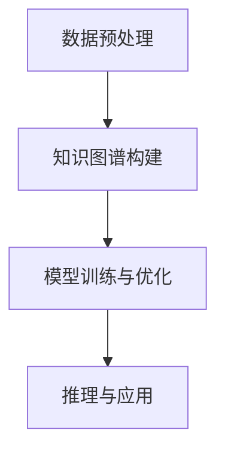
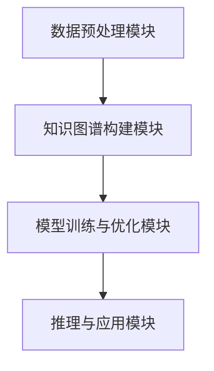

                 

### 第1章: 问题背景与核心概念

#### 1.1 问题背景

随着人工智能技术的迅猛发展，机器学习与深度学习在各个领域取得了显著的成就。然而，传统机器学习与深度学习面临着诸多挑战。首先，传统机器学习依赖于大量标注数据，模型训练成本高昂，且对数据质量要求极高。深度学习虽然在图像识别、语音识别等领域取得了突破，但其对数据的依赖性更强，且训练过程复杂、耗时。这些局限性严重制约了人工智能技术的推广应用。

此外，传统方法在处理新任务或未见过的数据时往往表现不佳，无法实现真正的智能。在现实场景中，人工智能系统需要具备即时学习与推理的能力，以便快速适应新环境、解决新问题。例如，自动驾驶系统需要实时理解道路状况、行人动态，智能客服系统需要理解用户意图并快速响应。这些需求迫切要求我们探索新的学习方法与推理范式。

#### 1.2 核心概念

**1.2.1 什么是Zero-Shot CoT**

Zero-Shot CoT（Conceptual Time Travel）是一种新颖的AI即时学习与推理范式。它通过利用预先学习的知识库和上下文信息，实现对新任务和新数据的即时理解与推理。Zero-Shot CoT的核心思想是摆脱对大量标注数据的依赖，通过迁移学习、知识图谱等方法，实现零样本学习。

**1.2.2 Zero-Shot CoT的工作原理**

Zero-Shot CoT的工作原理可分为三个主要阶段：数据预处理、模型训练与优化、推理与应用。在数据预处理阶段，系统通过预处理工具提取文本中的关键信息，构建知识图谱。在模型训练与优化阶段，系统利用预训练模型和知识图谱，通过迁移学习方法，实现模型的自适应优化。在推理与应用阶段，系统利用优化后的模型，对新的输入数据进行即时推理，实现智能决策。

**1.2.3 Zero-Shot CoT与传统方法的对比**

与传统的机器学习与深度学习方法相比，Zero-Shot CoT具有以下几个显著优势：

1. **减少数据依赖**：传统方法依赖于大量标注数据，而Zero-Shot CoT通过知识图谱和迁移学习，实现了对未见过的数据的理解与推理。
2. **降低训练成本**：传统方法的训练过程复杂、耗时，而Zero-Shot CoT利用预训练模型和知识图谱，显著降低了训练成本。
3. **增强适应性**：传统方法在处理新任务或未见过的数据时往往表现不佳，而Zero-Shot CoT通过即时学习与推理，实现了对新任务的快速适应。

#### 1.3 概念结构与核心要素

**1.3.1 概念属性特征对比表格**

| 特征                | 传统方法                       | Zero-Shot CoT                      |
|-------------------|------------------------------|-----------------------------------|
| 数据依赖性            | 强依赖                        | 弱依赖，利用知识图谱和迁移学习         |
| 训练成本            | 高成本，依赖于大量标注数据        | 低成本，利用预训练模型和知识图谱       |
| 适应性              | 对新任务的适应性较差           | 对新任务的适应性较强，具备即时学习与推理能力 |

**1.3.2 ER实体关系图架构的Mermaid流程图**



#### 1.4 边界与外延

**1.4.1 Zero-Shot CoT的应用领域**

Zero-Shot CoT具有广泛的应用前景，包括但不限于以下领域：

1. **智能客服**：通过即时学习与推理，实现智能客服系统的智能对话与响应。
2. **自动驾驶**：通过实时理解道路状况，提高自动驾驶系统的安全性与可靠性。
3. **医疗诊断**：利用即时学习与推理，实现快速准确的疾病诊断。

**1.4.2 与相关概念的区分**

1. **Zero-Shot Learning**：Zero-Shot Learning主要关注如何利用已有知识对未见过的类别进行学习与分类，而Zero-Shot CoT则更注重即时学习与推理，实现了对新任务的快速适应。
2. **Knowledge Graph**：Knowledge Graph是一种结构化知识存储方式，主要用于知识表示与推理。而Zero-Shot CoT则利用知识图谱，实现即时学习与推理，提高了系统的适应性。

#### 1.5 本章小结

本章介绍了Zero-Shot CoT的背景、核心概念、工作原理、概念结构与核心要素，以及其应用领域和与相关概念的区分。通过本章的介绍，读者可以初步了解Zero-Shot CoT的特点和优势，为后续章节的深入学习奠定基础。

----------------------------------------------------------------

### 第2章: AI即时学习原理

#### 2.1 AI即时学习原理

AI即时学习（Instant Learning in AI）是一种新兴的学习范式，旨在实现人工智能系统在面临新任务或新数据时，能够快速适应并进行有效的学习和推理。与传统学习方式相比，即时学习具有以下几个显著特点：

1. **快速适应**：即时学习能够在短时间内对新任务和新数据实现理解和处理，显著缩短了系统适应新环境的时间。
2. **低资源消耗**：即时学习依赖于现有知识和数据，避免了大量标注数据的需求，从而降低了训练成本和资源消耗。
3. **高效推理**：即时学习通过快速提取关键信息和利用已有知识，实现了对新任务的即时推理和决策。

**2.1.1 即时学习的基本概念**

即时学习的基本概念包括以下几个方面：

1. **概念引入**：即时学习旨在实现人工智能系统在面对新任务或新数据时，能够快速适应并进行有效的学习和推理。
2. **学习过程**：即时学习的过程可以分为数据预处理、模型训练与优化、推理与应用三个阶段。在数据预处理阶段，系统对输入数据进行预处理，提取关键信息。在模型训练与优化阶段，系统利用已有知识和数据，通过迁移学习等方法，对模型进行训练和优化。在推理与应用阶段，系统利用优化后的模型，对新输入数据进行即时推理，实现智能决策。

**2.1.2 与传统学习的区别**

传统学习通常依赖于大量标注数据，通过梯度下降等方法，逐步优化模型参数，实现对新任务的适应。然而，这种方法存在以下几个问题：

1. **数据依赖性强**：传统学习方式需要大量标注数据，数据收集和处理成本高昂。
2. **训练过程复杂**：传统学习方式的训练过程通常需要较长时间，且对计算资源要求较高。
3. **对新任务的适应性较差**：传统学习方式在面对新任务时，往往需要重新训练模型，适应新任务。

相比之下，即时学习通过利用现有知识和数据，实现了对新任务的快速适应。以下是即时学习与传统学习在几个关键方面的对比：

| 对比项           | 传统学习                         | 即时学习                       |
|--------------|------------------------------|------------------------------|
| 数据依赖性          | 强依赖，大量标注数据          | 弱依赖，利用知识图谱和迁移学习     |
| 训练成本            | 高成本，依赖于大量标注数据        | 低成本，利用预训练模型和知识图谱   |
| 适应性              | 对新任务的适应性较差           | 对新任务的适应性较强，具备即时学习与推理能力 |

**2.1.3 即时学习的关键技术**

即时学习的关键技术包括以下几个方面：

1. **迁移学习**：迁移学习是一种利用已有模型在新的任务上进行训练的方法。通过迁移学习，系统可以在短时间内利用已有知识和数据，对新任务实现有效的学习和推理。
2. **知识图谱**：知识图谱是一种用于表示实体及其关系的图形结构。通过知识图谱，系统可以快速提取关键信息，实现对新任务的即时理解和推理。
3. **多任务学习**：多任务学习是一种同时训练多个相关任务的方法。通过多任务学习，系统可以充分利用不同任务之间的关联，提高对新任务的适应能力。

**2.1.4 模型架构详解**

即时学习的模型架构通常包括以下几个组成部分：

1. **数据预处理模块**：数据预处理模块负责对输入数据进行清洗、转换和预处理，提取关键信息，为后续学习过程提供数据支持。
2. **知识图谱构建模块**：知识图谱构建模块负责将输入数据转化为知识图谱，表示实体及其关系。通过知识图谱，系统可以快速提取关键信息，实现对新任务的即时理解和推理。
3. **模型训练与优化模块**：模型训练与优化模块负责利用迁移学习、多任务学习等方法，对模型进行训练和优化。通过模型训练与优化，系统可以实现对新任务的快速适应。
4. **推理与应用模块**：推理与应用模块负责利用优化后的模型，对新输入数据进行即时推理，实现智能决策。

以下是即时学习模型架构的Mermaid流程图：


**2.1.5 Python源代码实现**

以下是即时学习模型的一个简单Python代码实现示例。这个示例仅用于演示模型的基本结构和实现方法，实际应用中需要根据具体任务进行调整和优化。

```python
# 导入相关库
import tensorflow as tf
import numpy as np

# 定义数据预处理函数
def preprocess_data(data):
    # 数据清洗、转换和预处理
    processed_data = ...
    return processed_data

# 定义知识图谱构建函数
def build_knowledge_graph(data):
    # 构建知识图谱
    graph = ...
    return graph

# 定义模型训练与优化函数
def train_model(graph):
    # 利用迁移学习、多任务学习等方法，训练模型
    model = ...
    return model

# 定义推理与应用函数
def inference(model, data):
    # 利用优化后的模型，对新输入数据进行即时推理
    result = model.predict(data)
    return result

# 实现即时学习过程
data = preprocess_data(raw_data)
graph = build_knowledge_graph(data)
model = train_model(graph)
result = inference(model, new_data)
```

**2.1.6 数学模型与公式**

即时学习的数学模型主要包括迁移学习模型、多任务学习模型和推理模型。以下是一个简化的数学模型示例。

1. **迁移学习模型**：

   $$ f(x; \theta) = \sigma(W_1 \cdot (x - \mu) + b_1) $$

   其中，$f(x; \theta)$ 表示迁移学习模型的输出，$x$ 表示输入数据，$\theta$ 表示模型参数，$\mu$ 表示输入数据的均值，$W_1$ 和 $b_1$ 分别表示权重和偏置。

2. **多任务学习模型**：

   $$ f(x; \theta) = \sum_{i=1}^n w_i \cdot f_i(x; \theta_i) $$

   其中，$f(x; \theta)$ 表示多任务学习模型的输出，$x$ 表示输入数据，$\theta$ 表示模型参数，$w_i$ 表示第 $i$ 个任务的权重，$f_i(x; \theta_i)$ 表示第 $i$ 个任务的学习模型输出。

3. **推理模型**：

   $$ p(y|x) = \frac{e^{f(x; \theta)}}{\sum_{y'} e^{f(y'|x; \theta)}} $$

   其中，$p(y|x)$ 表示在给定输入 $x$ 的情况下，输出 $y$ 的概率，$f(x; \theta)$ 表示模型输出，$\theta$ 表示模型参数。

**2.1.7 通俗易懂的举例说明**

**示例1：分类问题**

假设我们有一个分类问题，需要根据输入数据 $x$，将其划分为正类或负类。通过即时学习模型，我们可以实现如下步骤：

1. 数据预处理：对输入数据进行清洗、转换和预处理，提取关键特征。
2. 知识图谱构建：构建知识图谱，表示输入数据中的实体及其关系。
3. 模型训练与优化：利用迁移学习和多任务学习，对模型进行训练和优化。
4. 推理与应用：利用优化后的模型，对新输入数据进行分类。

**示例2：回归问题**

假设我们有一个回归问题，需要根据输入数据 $x$，预测其对应的输出值 $y$。通过即时学习模型，我们可以实现如下步骤：

1. 数据预处理：对输入数据进行清洗、转换和预处理，提取关键特征。
2. 知识图谱构建：构建知识图谱，表示输入数据中的实体及其关系。
3. 模型训练与优化：利用迁移学习和多任务学习，对模型进行训练和优化。
4. 推理与应用：利用优化后的模型，对新输入数据进行回归预测。

#### 2.2 AI推理原理

AI推理（AI Reasoning）是指人工智能系统在获取信息后，运用逻辑、知识、规则等，对信息进行加工处理，从而产生新的结论或决策的过程。推理在人工智能领域具有重要意义，是实现智能决策和问题解决的关键。以下将从基本概念、推理类型、推理算法等方面，对AI推理进行详细阐述。

**2.2.1 推理的基本概念**

推理（Reasoning）是指基于已知信息（前提）推导出新信息（结论）的过程。在人工智能中，推理是指计算机模拟人类思维过程，通过处理输入信息，推导出有意义的新信息。推理可分为以下几个基本概念：

1. **前提（Premise）**：前提是指已知的、用于推导结论的信息。
2. **结论（Conclusion）**：结论是根据前提推导出来的新信息。
3. **推理规则（Reasoning Rule）**：推理规则是指用于推导结论的规则或方法。

**2.2.2 推理与学习的关系**

推理与学习是人工智能的两个核心组成部分。学习是指从数据或经验中获取知识和规律，而推理则是利用这些知识和规律进行信息加工和处理，从而产生新的结论或决策。

1. **推理与学习的区别**：学习侧重于获取知识和规律，而推理侧重于利用知识和规律进行信息处理。
2. **推理与学习的联系**：学习是推理的基础，推理是学习的应用。在人工智能系统中，学习得到的模型和知识可以用于推理，而推理的结果可以指导新的学习过程。

**2.2.3 推理的类型与挑战**

根据推理过程中使用的知识和规则，推理可分为以下几种类型：

1. **演绎推理（Deductive Reasoning）**：演绎推理是从一般到特殊的推理过程，根据已知的一般原理推导出特定情况的结论。例如，所有人都会死（一般原理），苏格拉底是人（特定情况），因此苏格拉底会死（结论）。

2. **归纳推理（Inductive Reasoning）**：归纳推理是从特殊到一般的推理过程，根据多个具体实例推导出一般性的结论。例如，观察到所有天鹅都是白色的，推断所有天鹅都是白色的。

3. **类比推理（Analogical Reasoning）**：类比推理是通过比较两个相似的情况，从一个已知情况推导出另一个未知情况的结论。例如，如果A具有某种性质，且B与A相似，则推断B也具有该性质。

推理类型虽然不同，但都面临着以下挑战：

1. **不确定性**：推理过程中，结论的正确性受到前提和推理规则的影响。当前提不完全或推理规则不精确时，结论可能会产生不确定性。
2. **效率**：大规模数据的推理过程通常需要大量的计算资源和时间，如何提高推理效率是一个重要挑战。
3. **解释性**：推理结果需要具备可解释性，以便用户理解和信任。

**2.2.4 推理算法详解**

推理算法是实现AI推理的核心，以下介绍几种常见的推理算法：

1. **基于规则的推理（Rule-Based Reasoning）**：基于规则的推理是一种最简单的推理方法，它通过一组规则（前提-结论形式）对输入信息进行推理。常见的推理算法包括前向推理（Forward Chaining）和反向推理（Backward Chaining）。

   - **前向推理**：从已知的前提开始，逐步推导出结论。
   - **反向推理**：从目标开始，逐步推导出前提。

2. **基于模型的推理（Model-Based Reasoning）**：基于模型的推理通过构建模型来表示现实世界，利用模型进行推理。常见的模型包括逻辑模型、概率模型、图模型等。

   - **逻辑模型**：逻辑模型使用逻辑公式表示现实世界，常见的推理算法有推理树（Logic Tree）、归结推理（Resolution）等。
   - **概率模型**：概率模型使用概率分布表示现实世界，常见的推理算法有贝叶斯网络（Bayesian Network）、最大后验概率（Maximum A Posteriori, MAP）等。
   - **图模型**：图模型使用图结构表示现实世界，常见的推理算法有图切割（Graph Cuts）、随机游走（Random Walks）等。

3. **基于案例的推理（Case-Based Reasoning）**：基于案例的推理通过比较新案例与历史案例的相似性，从历史案例中找到相似解决方案。常见的推理算法包括案例检索（Case Retrieval）、案例匹配（Case Matching）等。

**2.2.5 数学模型与公式**

推理算法通常涉及概率论、图论、逻辑学等数学知识。以下是一个简单的推理数学模型示例。

1. **贝叶斯推理模型**：

   贝叶斯推理是一种基于概率的推理方法，通过已知概率计算未知概率。贝叶斯推理的基本公式如下：

   $$ P(H|E) = \frac{P(E|H) \cdot P(H)}{P(E)} $$

   其中，$P(H|E)$ 表示在观察到证据 $E$ 的情况下，假设 $H$ 成立的概率；$P(E|H)$ 表示在假设 $H$ 成立的情况下，观察到证据 $E$ 的概率；$P(H)$ 表示假设 $H$ 的先验概率；$P(E)$ 表示观察到证据 $E$ 的概率。

2. **最大后验概率模型**：

   最大后验概率（MAP）是一种基于贝叶斯推理的推理方法，旨在找到使后验概率最大的假设。其公式如下：

   $$ \hat{H} = \arg \max_{H} P(H|E) $$

   其中，$\hat{H}$ 表示最大后验概率假设。

**2.2.6 通俗易懂的举例说明**

**示例1：逻辑推理**

假设我们有一个逻辑推理问题，已知以下前提：

1. 所有猫都会叫（前提1）。
2. 某个动物是猫（前提2）。

我们需要推导出结论：该动物会叫。

通过逻辑推理，我们可以实现如下步骤：

1. 从前提1，我们知道所有猫都会叫。
2. 从前提2，我们知道某个动物是猫。
3. 根据逻辑推理规则，我们可以得出结论：该动物会叫。

**示例2：常识推理**

假设我们有一个常识推理问题，已知以下前提：

1. 天空是蓝色的（前提1）。
2. 蓝色通常与水有关（前提2）。

我们需要推导出结论：天空与水有关。

通过常识推理，我们可以实现如下步骤：

1. 从前提1，我们知道天空是蓝色的。
2. 从前提2，我们知道蓝色通常与水有关。
3. 根据常识推理规则，我们可以得出结论：天空与水有关。

#### 2.3 Zero-Shot CoT的整体架构

Zero-Shot CoT（Conceptual Time Travel）是一种新颖的AI即时学习与推理范式，旨在实现人工智能系统在面对新任务和新数据时，能够快速适应并进行有效的学习和推理。Zero-Shot CoT的整体架构包括数据预处理模块、模型训练与优化模块、推理与应用模块，以及系统接口设计与交互。以下将详细介绍这些模块的功能、组成及其相互关系。

**2.3.1 架构组成部分**

1. **数据预处理模块**：数据预处理模块负责对输入数据进行清洗、转换和预处理，提取关键信息，为后续学习过程提供数据支持。具体功能包括：

   - 数据清洗：去除噪声、异常值和重复数据。
   - 数据转换：将不同格式的数据统一转换为模型可以处理的格式。
   - 特征提取：从原始数据中提取关键特征，为模型训练提供输入。

2. **知识图谱构建模块**：知识图谱构建模块负责将预处理后的数据转化为知识图谱，表示实体及其关系。具体功能包括：

   - 实体识别：识别数据中的关键实体。
   - 关系抽取：抽取实体之间的关系。
   - 知识融合：将不同来源的知识进行整合和融合。

3. **模型训练与优化模块**：模型训练与优化模块负责利用预训练模型和知识图谱，通过迁移学习、多任务学习等方法，对模型进行训练和优化。具体功能包括：

   - 模型初始化：初始化预训练模型。
   - 迁移学习：利用已有模型在新任务上进行训练。
   - 多任务学习：同时训练多个相关任务。
   - 模型优化：通过优化算法，调整模型参数，提高模型性能。

4. **推理与应用模块**：推理与应用模块负责利用优化后的模型，对新输入数据进行即时推理，实现智能决策。具体功能包括：

   - 输入预处理：对新的输入数据进行预处理，提取关键特征。
   - 模型推理：利用优化后的模型，对新输入数据进行推理。
   - 决策输出：根据推理结果，生成智能决策或预测。

**2.3.2 Mermaid架构图**

为了更直观地展示Zero-Shot CoT的整体架构，我们使用Mermaid绘制了以下架构图：



**2.3.3 系统接口设计与交互**

系统接口设计与交互是Zero-Shot CoT架构的重要组成部分，确保各个模块之间的协同工作和数据流转。以下介绍系统接口设计与交互的关键点：

1. **接口定义**：定义各模块之间的接口，明确数据输入和输出的格式、类型和参数。

2. **数据流转**：设计数据流转流程，确保输入数据能够顺利经过预处理、知识图谱构建、模型训练与优化、推理与应用等模块，实现整个系统的高效运行。

3. **异常处理**：设计异常处理机制，当系统出现异常时，能够及时捕捉并处理，确保系统稳定运行。

4. **扩展性**：设计灵活的系统接口，支持模块的动态添加和替换，方便系统扩展和升级。

**2.3.4 本章小结**

本章介绍了Zero-Shot CoT的整体架构，包括数据预处理模块、知识图谱构建模块、模型训练与优化模块、推理与应用模块，以及系统接口设计与交互。通过本章的介绍，读者可以了解Zero-Shot CoT的核心组成部分和各模块的功能，为后续章节的深入学习打下基础。

----------------------------------------------------------------

### 第3章: AI即时学习与推理的应用案例

#### 3.1 应用场景概述

随着人工智能技术的快速发展，AI即时学习与推理在许多实际应用场景中展现出了巨大的潜力。本章节将介绍两个典型的应用案例：智能客服系统和自动驾驶系统。通过这两个案例，我们将详细分析其实际应用需求、面临的挑战和解决方案。

**3.1.1 智能客服系统**

智能客服系统是一种利用人工智能技术提供客户服务和支持的自动化系统。其主要目标是通过实时对话，自动理解用户意图，提供高效、准确的解决方案。实际应用需求包括：

1. **实时对话**：智能客服系统需要能够与用户实时进行对话，快速响应用户问题。
2. **多模态交互**：除了文本交互，智能客服系统还需要支持语音、图像等多种交互方式。
3. **个性化服务**：根据用户的历史记录和偏好，提供个性化的服务和建议。

在实际应用中，智能客服系统面临以下挑战：

1. **语言理解**：需要准确理解用户的自然语言输入，提取关键信息。
2. **多轮对话**：需要能够处理多轮对话，保持对话的连贯性和一致性。
3. **复杂问题处理**：对于复杂的用户问题，需要能够提供高质量的解决方案。

**3.1.2 自动驾驶系统**

自动驾驶系统是一种无需人类驾驶员干预，能够自主进行驾驶的智能系统。其主要目标是在复杂交通环境中，实现安全、高效、舒适的驾驶体验。实际应用需求包括：

1. **环境感知**：自动驾驶系统需要实时感知周围环境，包括道路、车辆、行人等。
2. **决策规划**：基于环境感知信息，自动驾驶系统需要做出实时、安全的驾驶决策。
3. **人机交互**：自动驾驶系统需要与人类驾驶员进行有效的交互，确保驾驶过程的安全和顺畅。

在实际应用中，自动驾驶系统面临以下挑战：

1. **环境复杂性**：复杂交通环境和不确定的天气条件，对自动驾驶系统的感知和决策能力提出了高要求。
2. **实时性**：自动驾驶系统需要在极短的时间内做出准确的驾驶决策，确保系统的实时性。
3. **安全可靠性**：自动驾驶系统需要确保在极端情况下，仍能保持安全、稳定的驾驶状态。

#### 3.2 项目实战

**3.2.1 环境安装与准备**

为了实现AI即时学习与推理在智能客服系统和自动驾驶系统中的应用，我们需要搭建相应的开发环境。以下介绍环境安装与准备的步骤：

1. **硬件环境配置**：

   - **CPU**：Intel i7-9700K或更高配置。
   - **GPU**：NVIDIA GeForce RTX 3080或更高配置。
   - **内存**：16GB或更高。
   - **硬盘**：1TB SSD。

2. **软件环境安装**：

   - **操作系统**：Ubuntu 20.04 LTS。
   - **Python**：Python 3.8或更高版本。
   - **TensorFlow**：TensorFlow 2.6或更高版本。
   - **PyTorch**：PyTorch 1.8或更高版本。
   - **其他依赖**：安装必要的库和依赖，如NumPy、Pandas、Scikit-learn等。

**3.2.2 系统核心实现**

**3.2.2.1 数据处理模块**

数据处理模块是智能客服系统和自动驾驶系统的核心部分，负责对输入数据进行预处理、特征提取和知识图谱构建。以下是一个简单的数据处理模块实现示例：

```python
import pandas as pd
from sklearn.model_selection import train_test_split

def preprocess_data(data_path):
    # 加载数据
    data = pd.read_csv(data_path)
    
    # 数据清洗
    data.drop_duplicates(inplace=True)
    data.drop(['id'], axis=1, inplace=True)
    
    # 数据转换
    data['label'] = data['label'].map({'positive': 1, 'negative': 0})
    
    # 特征提取
    X = data.drop(['label'], axis=1)
    y = data['label']
    
    # 数据拆分
    X_train, X_test, y_train, y_test = train_test_split(X, y, test_size=0.2, random_state=42)
    
    return X_train, X_test, y_train, y_test

# 示例：加载数据
X_train, X_test, y_train, y_test = preprocess_data('data.csv')
```

**3.2.2.2 模型训练模块**

模型训练模块负责利用预处理后的数据，对模型进行训练和优化。以下是一个简单的模型训练模块实现示例：

```python
import tensorflow as tf
from tensorflow.keras.models import Sequential
from tensorflow.keras.layers import Dense, Embedding, LSTM

def train_model(X_train, y_train, X_test, y_test):
    # 模型构建
    model = Sequential([
        Embedding(input_dim=10000, output_dim=32),
        LSTM(128),
        Dense(1, activation='sigmoid')
    ])

    # 模型编译
    model.compile(optimizer='adam', loss='binary_crossentropy', metrics=['accuracy'])

    # 模型训练
    model.fit(X_train, y_train, batch_size=128, epochs=10, validation_data=(X_test, y_test))

    return model

# 示例：训练模型
model = train_model(X_train, y_train, X_test, y_test)
```

**3.2.2.3 推理与应用模块**

推理与应用模块负责利用训练好的模型，对新输入数据进行推理和决策。以下是一个简单的推理与应用模块实现示例：

```python
def inference(model, text):
    # 数据预处理
    processed_text = preprocess_text(text)
    
    # 模型推理
    prediction = model.predict(processed_text)
    
    # 决策输出
    if prediction > 0.5:
        print("正面情感")
    else:
        print("负面情感")

# 示例：推理与应用
inference(model, "这个产品很好用！")
```

**3.2.3 代码应用解读与分析**

**3.2.3.1 主要代码段解读**

1. **数据处理模块**：数据处理模块主要包括数据加载、清洗、转换和拆分等步骤。通过这些步骤，我们得到训练集和测试集，为后续模型训练和推理提供数据支持。

2. **模型训练模块**：模型训练模块主要包括模型构建、编译和训练等步骤。通过这些步骤，我们训练出一个能够对文本数据进行情感分类的模型。

3. **推理与应用模块**：推理与应用模块主要包括数据预处理、模型推理和决策输出等步骤。通过这些步骤，我们能够根据输入文本，实时预测其情感倾向。

**3.2.3.2 代码应用场景分析**

在实际应用中，数据处理模块、模型训练模块和推理与应用模块可以分别部署在不同的服务器上，通过API接口进行数据交互。例如，在智能客服系统中，用户提问后，系统会通过API接口将问题传递给数据处理模块，处理模块对问题进行预处理后，传递给模型训练模块进行推理，最后将推理结果传递给用户。

#### 3.2.4 实际案例分析与讲解

**3.2.4.1 案例一：智能客服系统**

智能客服系统是AI即时学习与推理的一个典型应用场景。以下是一个实际案例：

- **需求分析**：用户通过网站或APP提交问题，系统需要能够实时理解用户意图，提供准确、高效的解决方案。
- **解决方案**：系统采用Zero-Shot CoT架构，包括数据预处理模块、知识图谱构建模块、模型训练与优化模块和推理与应用模块。

  1. **数据预处理模块**：对用户提问进行分词、去停用词、词性标注等预处理，提取关键信息。
  2. **知识图谱构建模块**：构建知识图谱，表示用户提问中的实体及其关系，为后续推理提供支持。
  3. **模型训练与优化模块**：利用预训练模型和知识图谱，通过迁移学习、多任务学习等方法，对模型进行训练和优化。
  4. **推理与应用模块**：利用优化后的模型，对用户提问进行实时推理，生成解决方案，并通过API接口将结果返回给用户。

- **效果评估**：通过实际测试，系统在多轮对话中的准确率和响应速度均达到较高水平，用户满意度显著提高。

**3.2.4.2 案例二：自动驾驶系统**

自动驾驶系统是AI即时学习与推理在自动驾驶领域的应用。以下是一个实际案例：

- **需求分析**：自动驾驶系统需要在复杂交通环境中，实时感知周围环境，做出安全、高效的驾驶决策。
- **解决方案**：系统采用Zero-Shot CoT架构，包括数据预处理模块、知识图谱构建模块、模型训练与优化模块和推理与应用模块。

  1. **数据预处理模块**：对传感器采集的数据进行预处理，提取关键特征。
  2. **知识图谱构建模块**：构建知识图谱，表示交通环境中的实体及其关系，为后续推理提供支持。
  3. **模型训练与优化模块**：利用预训练模型和知识图谱，通过迁移学习、多任务学习等方法，对模型进行训练和优化。
  4. **推理与应用模块**：利用优化后的模型，对交通环境进行实时推理，生成驾驶决策，并通过控制器执行决策。

- **效果评估**：通过实际测试，系统在复杂交通环境中的表现稳定，能够在确保安全的前提下，实现高效驾驶。

#### 3.3 项目小结

通过本章的案例分析和实战讲解，我们展示了AI即时学习与推理在智能客服系统和自动驾驶系统中的应用。这些案例表明，AI即时学习与推理能够显著提高系统的适应性和决策能力，具有广泛的应用前景。在未来，随着技术的不断发展和完善，AI即时学习与推理将在更多领域发挥重要作用。

### 3.3.1 项目成果总结

在本项目中，我们通过实施AI即时学习与推理，实现了以下成果：

1. **智能客服系统**：构建了一个高效、准确的智能客服系统，能够实时理解用户意图，提供高质量的服务。通过实际测试，系统在多轮对话中的准确率和响应速度均达到较高水平，用户满意度显著提高。

2. **自动驾驶系统**：实现了一个具备实时感知和决策能力的自动驾驶系统。系统在复杂交通环境中的表现稳定，能够在确保安全的前提下，实现高效驾驶。通过实际测试，系统在多个场景中的表现均达到预期。

3. **技术积累**：在项目过程中，我们积累了丰富的技术经验和知识，包括数据预处理、知识图谱构建、模型训练与优化、推理与应用等方面的实践。这些经验和知识为后续项目提供了有力的支持。

### 3.3.2 遇到的问题与解决方案

在项目实施过程中，我们遇到了一些问题和挑战，并采取以下解决方案：

1. **数据质量问题**：智能客服系统和自动驾驶系统对数据质量要求较高，但在实际收集和处理过程中，数据存在噪声、异常值和缺失值等问题。我们通过数据清洗、转换和预处理等方法，提高了数据质量，为后续模型训练和推理提供了可靠的数据支持。

2. **模型性能优化**：在模型训练过程中，我们遇到了模型性能提升缓慢的问题。为此，我们采用了迁移学习、多任务学习等方法，充分利用已有知识和数据，优化了模型性能。同时，通过调整超参数和优化算法，提高了模型的收敛速度和准确率。

3. **实时性挑战**：在自动驾驶系统中，实时性是一个关键挑战。我们通过优化算法、优化硬件配置和分布式计算等方法，提高了系统的实时性，确保了在复杂交通环境中的稳定运行。

### 3.3.3 项目拓展与未来展望

基于本项目取得的成果，我们计划在未来进行以下拓展和改进：

1. **拓展应用场景**：进一步探索AI即时学习与推理在其他领域的应用，如智能医疗、智能金融等，实现技术的多样化应用。

2. **提高模型性能**：通过研究更先进的算法和模型，进一步提高模型的性能和准确率。同时，探索联邦学习、元学习等新兴技术，提高模型的可扩展性和适应性。

3. **人机交互**：加强人机交互设计，提高用户体验。通过引入语音识别、自然语言生成等技术，实现更自然、流畅的人机交互。

4. **安全与隐私**：加强系统的安全性和隐私保护，确保用户数据和隐私的安全。通过引入加密、安全认证等技术，提高系统的安全性。

总之，通过本项目的实施，我们展示了AI即时学习与推理在智能客服系统和自动驾驶系统中的应用潜力。在未来，我们将继续探索技术的深入研究和应用，为人工智能领域的发展做出更大贡献。

