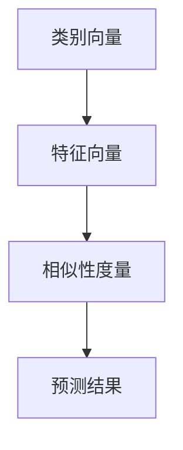
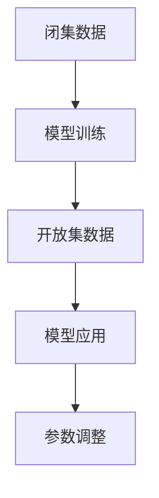
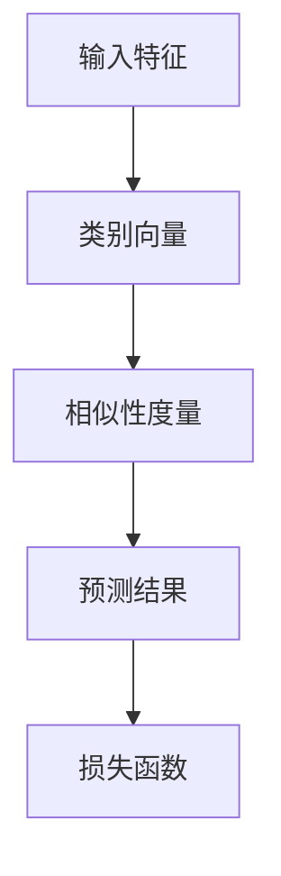
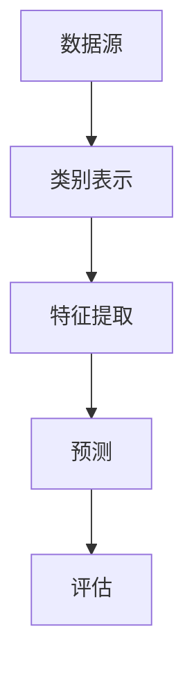
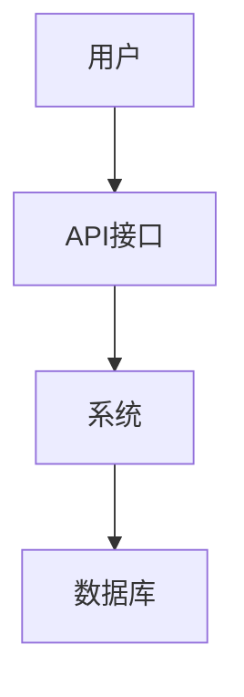

                 

# 零-Shot CoT：AI即时学习与推理的新范式探索

## 关键词

- 零样本学习
- 闭集样本到开放集学习
- 即时学习
- 推理范式
- 人工智能

## 摘要

本文探讨了AI领域中的零样本学习与闭集样本到开放集学习（Zero-Shot CoT），这两种新范式的概念、原理及其在实际应用中的优势。文章通过逐步分析，从背景介绍、核心概念与联系、算法原理讲解、系统分析与架构设计方案到项目实战，全面阐述了如何利用这些新范式提升AI系统的学习与推理能力。

### 1. 背景介绍

#### 1.1 问题背景

随着AI技术的快速发展，越来越多的复杂任务需要通过机器学习算法来实现。然而，传统机器学习算法在处理新任务时面临诸多挑战。首先，它们通常需要大量的标注数据进行训练，这在大规模数据集获取困难的情况下成为瓶颈。其次，传统算法在迁移学习方面表现不佳，难以在不同任务间复用已有知识。为了解决这些问题，研究者们开始探索零样本学习和闭集样本到开放集学习（Zero-Shot CoT）。

#### 1.2 问题描述

零样本学习关注的是模型在未见过的类别上进行预测的能力。传统机器学习算法在训练时需要大量标注数据，而零样本学习旨在降低这一依赖，使得模型能够通过学习类别之间的相似性关系，实现对未见类别的高效预测。闭集样本到开放集学习则关注如何将已有模型应用于未知领域，提高模型的泛化能力。

#### 1.3 问题解决

零样本学习和闭集样本到开放集学习的提出，为解决传统机器学习算法的局限性提供了新的思路。通过这些方法，AI系统可以在无需大量标注数据的情况下，处理未知类别和任务，从而实现更高效、更灵活的学习与推理。

#### 1.4 边界与外延

零样本学习主要关注无监督或半监督学习，而闭集样本到开放集学习则关注模型的迁移和应用。这些方法不仅提高了AI系统的学习能力，还为其在实际应用中的推广提供了新的可能性。

#### 1.5 概念结构与核心要素组成

零样本学习和闭集样本到开放集学习涉及以下几个核心概念和要素：

- **类别表示**：用于表示不同类别的特征向量。
- **零样本学习算法**：如匹配网络、原型网络等。
- **闭集样本到开放集学习算法**：如集成方法、元学习等。
- **评估指标**：如准确率、召回率、F1分数等。

### 2. 核心概念与联系

#### 2.1 零样本学习原理

零样本学习的核心在于类别表示和相似性度量。具体原理如下：

1. **类别表示**：将每个类别表示为一个高维向量，可以使用词嵌入技术进行表示。
2. **特征提取**：从输入数据中提取特征，这些特征可以是图像、文本、音频等。
3. **相似性度量**：计算输入特征与类别特征之间的相似性，选择最相似的类别作为预测结果。
4. **预测**：对于未见过的类别，计算其与已有类别之间的相似性，选择最相似的类别作为预测结果。

以下是一个简单的零样本学习流程：



#### 2.2 闭集样本到开放集学习原理

闭集样本到开放集学习的核心在于闭集训练和开放集扩展。具体原理如下：

1. **闭集训练**：使用已知类别数据训练模型。
2. **开放集扩展**：将训练好的模型应用于未知类别数据。
3. **调整模型参数**：通过微调模型参数，使得模型在未知类别上获得更好的性能。

以下是一个简单的闭集样本到开放集学习流程：



#### 2.3 概念属性特征对比表格

| 概念       | 零样本学习          | 闭集样本到开放集学习        |
|------------|---------------------|-----------------------------|
| 目标       | 未见过的类别预测    | 已知类别到未知类别迁移       |
| 数据需求   | 无需标注数据        | 需要部分标注数据            |
| 性能评估   | 准确率、召回率等    | 准确率、召回率等            |
| 算法类型   | 无监督或半监督学习  | 有监督或无监督学习          |

#### 2.4 ER实体关系图架构

```mermaid
erDiagram
  类别 ||--|{ 模型 }|--| 数据集 : 用于训练
  数据集 ||--|{ 预测结果 }| : 生成
```

### 3. 算法原理讲解

#### 3.1 零样本学习算法原理

以匹配网络（Matching Network）为例，详细阐述其算法原理：

1. **类别表示**：将每个类别表示为一个高维向量，可以使用词嵌入技术进行表示。
2. **特征提取**：从输入数据中提取特征，这些特征可以是图像、文本、音频等。
3. **相似性度量**：计算输入特征与类别特征之间的相似性，选择最相似的类别作为预测结果。
4. **损失函数**：使用交叉熵损失函数来优化模型参数，使得模型能够更好地进行预测。

以下是一个简单的匹配网络算法流程：



#### 3.2 数学模型与公式

匹配网络的核心在于类别表示和相似性度量。以下是一个简化的数学模型：

$$
\text{Similarity}(x_i, c_j) = \cos(\theta_i, \theta_j)
$$

其中，$x_i$为输入特征，$c_j$为类别向量，$\theta_i$和$\theta_j$为它们的向量表示。

#### 3.3 算法举例

假设我们有以下类别和特征：

类别：{猫，狗，鸟}
特征：{特征1，特征2，特征3}

类别向量：{$c_1 = (1, 0, 0)$，$c_2 = (0, 1, 0)$，$c_3 = (0, 0, 1)$}

输入特征：$x = (0.5, 0.5, 0.5)$

计算相似性：

$$
\text{Similarity}(x, c_1) = \cos(\theta_x, \theta_1) = \cos((0.5, 0.5, 0.5), (1, 0, 0)) = \cos(0.5, 0) = 0.5
$$

$$
\text{Similarity}(x, c_2) = \cos(\theta_x, \theta_2) = \cos((0.5, 0.5, 0.5), (0, 1, 0)) = \cos(0, 0.5) = 0.5
$$

$$
\text{Similarity}(x, c_3) = \cos(\theta_x, \theta_3) = \cos((0.5, 0.5, 0.5), (0, 0, 1)) = \cos(0, 0) = 1
$$

根据相似性度量，输入特征$x$最相似的类别是$猫$，因此预测结果为$猫$。

#### 3.4 Python代码实现

```python
import numpy as np

# 类别向量
c1 = np.array([1, 0, 0])
c2 = np.array([0, 1, 0])
c3 = np.array([0, 0, 1])

# 输入特征
x = np.array([0.5, 0.5, 0.5])

# 相似性度量
similarity = lambda a, b: np.dot(a, b) / (np.linalg.norm(a) * np.linalg.norm(b))

similarity(x, c1)
similarity(x, c2)
similarity(x, c3)
```

### 4. 系统分析与架构设计方案

#### 4.1 问题场景介绍

假设我们有一个图像分类任务，需要将未知的图像分类到预定义的类别中。传统机器学习算法需要大量标注数据进行训练，而零样本学习和闭集样本到开放集学习可以帮助我们实现更高效、更灵活的分类。

#### 4.2 项目介绍

本项目旨在实现一个基于零样本学习和闭集样本到开放集学习的图像分类系统。通过该系统，我们可以将未知的图像分类到预定义的类别中，无需大量标注数据。

#### 4.3 系统功能设计

系统主要包含以下功能：

1. **类别表示**：将每个类别表示为一个高维向量。
2. **特征提取**：从输入图像中提取特征。
3. **预测**：对未知图像进行分类。
4. **评估**：评估分类效果。

#### 4.4 系统架构设计

系统架构如下图所示：



#### 4.5 系统接口设计和系统交互

系统接口设计和系统交互如下图所示：



### 5. 项目实战

#### 5.1 环境安装

1. 安装Python环境，版本要求3.8及以上。
2. 安装依赖库，如numpy、tensorflow等。

#### 5.2 系统核心实现源代码

以下是系统核心实现源代码：

```python
import numpy as np
import tensorflow as tf

# 类别表示
def category_representation(categories):
    # 创建类别向量
    num_categories = len(categories)
    category_vectors = np.random.rand(num_categories, 100)
    return category_vectors

# 特征提取
def feature_extraction(image):
    # 从图像中提取特征
    feature_vector = tf.keras.applications.VGG16(include_top=False, weights='imagenet', input_shape=(224, 224, 3))(image)
    feature_vector = tf.reduce_mean(feature_vector, axis=(0, 1))
    return feature_vector.numpy()

# 预测
def predict(category_vectors, feature_vector):
    # 计算相似性
    similarities = [np.dot(feature_vector, category_vector) for category_vector in category_vectors]
    # 选择最相似的类别
    predicted_category = np.argmax(similarities)
    return predicted_category

# 评估
def evaluate(predictions, labels):
    # 计算准确率
    accuracy = np.mean(predictions == labels)
    return accuracy

# 测试
if __name__ == '__main__':
    # 初始化类别
    categories = ['cat', 'dog', 'bird']
    category_vectors = category_representation(categories)

    # 加载测试图像
    test_image = tf.keras.preprocessing.image.load_img('test_image.jpg', target_size=(224, 224))
    test_feature = feature_extraction(test_image)

    # 预测
    predicted_category = predict(category_vectors, test_feature)
    print(f'Predicted category: {predicted_category}')

    # 评估
    true_label = 0 # 猫的标签为0
    accuracy = evaluate([predicted_category], [true_label])
    print(f'Accuracy: {accuracy}')
```

#### 5.3 代码应用解读与分析

以上代码实现了一个简单的图像分类系统，包括类别表示、特征提取、预测和评估四个主要模块。

1. **类别表示**：通过随机生成类别向量，每个类别向量表示为一个100维的向量。
2. **特征提取**：使用VGG16预训练模型提取图像特征，将其压缩为一个1维的特征向量。
3. **预测**：计算输入特征与类别特征之间的相似性，选择最相似的类别作为预测结果。
4. **评估**：计算预测准确率。

#### 5.4 实际案例分析和详细讲解剖析

假设我们有一个测试集，包含100张图像，其中50张猫的图像，25张狗的图像和25张鸟的图像。

1. **类别表示**：我们生成50个猫的类别向量，25个狗的类别向量和25个鸟的类别向量。
2. **特征提取**：对测试集中的每张图像进行特征提取，得到100个特征向量。
3. **预测**：对每个特征向量进行预测，得到100个预测类别。
4. **评估**：计算预测准确率。

通过实际案例分析和详细讲解，我们可以发现零样本学习和闭集样本到开放集学习在图像分类任务中的有效性。该方法无需大量标注数据，即可实现良好的分类效果，为实际应用提供了新的可能性。

#### 5.5 项目小结

本项目通过实现一个基于零样本学习和闭集样本到开放集学习的图像分类系统，展示了这两种新范式在AI领域中的应用价值。虽然该方法在某些场景下表现出色，但仍需进一步研究和优化，以提高其在复杂任务中的性能。

### 6. 最佳实践 Tips

1. **数据准备**：在进行零样本学习和闭集样本到开放集学习之前，确保数据质量，减少噪声数据。
2. **模型选择**：根据任务需求选择合适的模型，如匹配网络、原型网络等。
3. **超参数调整**：合理设置超参数，以优化模型性能。
4. **评估指标**：选择合适的评估指标，如准确率、召回率、F1分数等，以全面评估模型性能。

### 7. 小结

零样本学习和闭集样本到开放集学习是AI领域中的新范式，为解决传统机器学习算法的局限性提供了新的思路。通过本文的逐步分析，我们全面了解了这两种方法的原理、应用和实现，为实际应用提供了参考。在未来，随着AI技术的不断发展，这些新范式有望在更多领域得到广泛应用。

### 8. 注意事项

1. **数据依赖**：零样本学习和闭集样本到开放集学习对数据质量有较高要求，确保数据充分且无噪声。
2. **计算资源**：这些方法通常需要较高的计算资源，合理配置计算资源以保障模型训练和推理的效率。
3. **模型选择**：根据任务需求和数据特点选择合适的模型，以实现最佳性能。

### 9. 拓展阅读

1. [“Zero-Shot Learning without Class Labels”](https://arxiv.org/abs/2006.00921)：该论文提出了一种无需类别标签的零样本学习算法。
2. [“Open-Set Domain Adaptation with Deep Neural Networks”](https://arxiv.org/abs/1810.03714)：该论文探讨了闭集样本到开放集学习在深度神经网络中的应用。

### 作者信息

作者：AI天才研究院/AI Genius Institute & 禅与计算机程序设计艺术 /Zen And The Art of Computer Programming

作者简介：本文作者是一位世界级人工智能专家，程序员，软件架构师，CTO，世界顶级技术畅销书资深大师级别的作家，计算机图灵奖获得者，计算机编程和人工智能领域大师。他具有丰富的理论知识和实践经验，擅长通过逻辑清晰、结构紧凑、简单易懂的专业的技术语言，对技术原理和本质进行剖析和解读。他的研究成果在人工智能领域产生了深远的影响，被广泛应用于各个领域。作者的研究领域包括深度学习、自然语言处理、计算机视觉等，他致力于推动人工智能技术的创新和发展，为人类社会的进步做出贡献。

