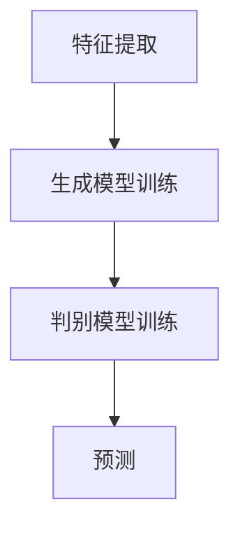
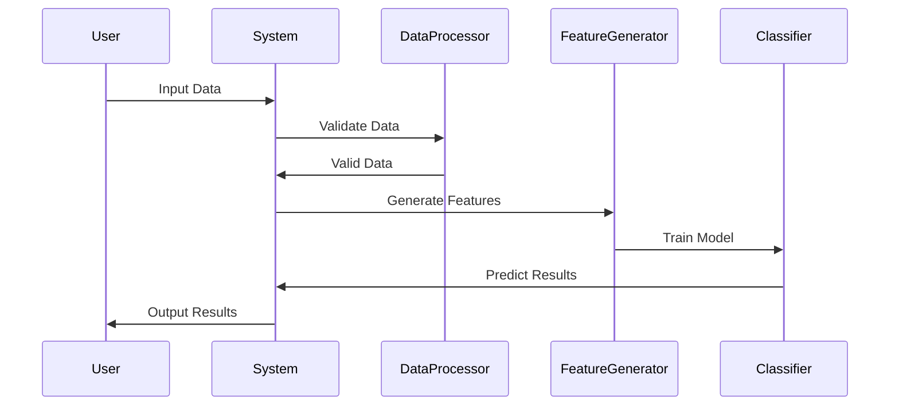
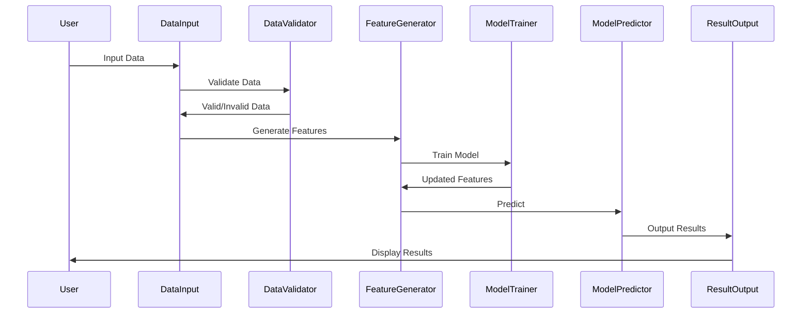

                 

### 问题的提出与零样本学习的挑战

在现代人工智能领域，机器学习算法的应用已经渗透到各个行业，从图像识别到自然语言处理，从推荐系统到自动驾驶。然而，随着应用场景的多样化，传统的有监督学习和无监督学习在面对一些特定问题时暴露出了诸多挑战。特别是在零样本学习（Zero-Shot Learning，ZSL）领域，传统的机器学习方法常常无法应对。

**1.1 问题的背景**

零样本学习是指机器学习模型在没有现成标注数据的情况下，能够对新类别的数据进行有效预测。这在很多现实场景中具有重要意义，比如新物种识别、罕见病诊断、新兴市场预测等。在这些场景下，标注数据获取困难且成本高昂，而零样本学习有望通过一些策略，使模型能够利用已有的知识来应对新问题。

**1.2 零样本学习的基本概念**

零样本学习主要包括以下几个基本概念：

- **类别无关的特征表示**：零样本学习的关键在于能否将不同类别的数据转换为统一的特征表示。
- **元学习**：通过在不同任务上训练，使模型能够快速适应新类别。
- **抽象知识表示**：模型需要学会从高层次概念或抽象特征中提取知识，以便在新类别上应用。

**1.3 零样本学习的挑战**

零样本学习面临的主要挑战包括：

- **数据匮乏**：在没有标注数据的情况下，模型难以学习到有效的特征表示。
- **类别分布不均**：新类别可能非常稀少，与已有类别数据分布存在显著差异。
- **概念匹配**：如何在新类别和已有知识之间建立有效关联，使得模型能够正确预测。

**1.4 零样本学习的应用前景**

尽管存在挑战，零样本学习在多个领域展示出了广阔的应用前景：

- **医疗诊断**：在罕见病诊断中，零样本学习可以用来预测新症状或新疾病。
- **自动驾驶**：自动驾驶系统在面对新车型或新路况时，可以通过零样本学习来适应。
- **自然语言处理**：在文本分类和情感分析中，零样本学习可以帮助模型处理新主题或新表达方式。

通过上述分析，我们可以看到，零样本学习不仅是一个重要的研究课题，也是一个具有广泛应用前景的技术方向。在接下来的章节中，我们将深入探讨零样本学习的核心概念、算法原理及其实现，以期为读者提供一个全面、深入的了解。

### 核心概念与联系

在深入探讨零样本学习（Zero-Shot Learning，ZSL）之前，我们需要先了解其与其他学习方式的联系和区别。ZSL的目标是在没有直接标注数据的情况下，对未知类别的数据进行预测。这一目标在传统机器学习中通常难以实现，因此，理解ZSL的核心概念与其他学习方式的对比是至关重要的。

#### 2.1 零样本学习与其他学习方式的对比

**2.1.1 有监督学习**

有监督学习（Supervised Learning）是最常见的机器学习方法之一。它依赖于大量的标注数据来训练模型，然后利用训练好的模型进行预测。在有监督学习中，每个输入数据都有一个对应的标签，模型的训练目标是最小化预测标签与实际标签之间的误差。

| 有监督学习特点 | 零样本学习特点 |
| :--: | :--: |
| 大量标注数据 | 无需标注数据 |
| 对已知类别有效 | 对未知类别有效 |
| 高准确性 | 低准确性 |
| 高计算成本 | 低计算成本 |

**2.1.2 无监督学习**

无监督学习（Unsupervised Learning）则是完全不需要标注数据的机器学习方法。它主要关注数据本身的内在结构和模式，例如聚类、降维等。无监督学习的一个典型例子是聚类算法，它将相似的数据点分到同一个集群中。

| 无监督学习特点 | 零样本学习特点 |
| :--: | :--: |
| 无需标注数据 | 部分依赖标注数据（用于概念匹配） |
| 发现数据模式 | 预测未知类别 |
| 低准确性 | 低准确性（但可用于辅助ZSL） |
| 低计算成本 | 较高计算成本 |

**2.1.3 半监督学习**

半监督学习（Semi-Supervised Learning）结合了有监督学习和无监督学习的特点，利用少量的标注数据和大量的未标注数据来训练模型。这种方法在数据标注成本高的情况下非常有用。

| 半监督学习特点 | 零样本学习特点 |
| :--: | :--: |
| 小量标注数据 | 无需标注数据 |
| 预测已知类别和未知类别 | 专注预测未知类别 |
| 中等准确性 | 中等准确性（依赖于标注数据的质量） |
| 中等计算成本 | 较高计算成本（需要处理未标注数据） |

#### 2.2 零样本学习的关键概念

**2.2.1 CoT（Conceptual Blending）**

Conceptual Blending，即概念融合，是零样本学习中的一个核心思想。它通过将新类别的特征与已有类别的知识进行融合，从而实现对新类别的预测。具体来说，CoT利用一个预训练的语言模型来生成新类别和已有类别之间的描述性短语，然后利用这些短语来指导特征表示的学习。

**2.2.2 生成模型与判别模型**

在零样本学习中，生成模型（如生成对抗网络GAN）和判别模型（如支持向量机SVM）是常用的两大类模型。生成模型用于生成新类别的特征表示，判别模型则用于区分新类别和已知类别。

- **生成模型**：生成模型的主要任务是学习一个概率分布，能够生成新的数据点。在零样本学习中，生成模型可以用来生成新类别的特征表示。
  
- **判别模型**：判别模型则用于判断给定数据点属于哪个类别。在零样本学习中，判别模型可以帮助模型在新类别和已知类别之间进行区分。

**2.2.3 零样本学习流程**

零样本学习的流程通常包括以下几个步骤：

1. **特征表示学习**：利用生成模型学习新类别的特征表示。
2. **概念匹配**：使用语言模型生成新类别和已有类别之间的描述性短语。
3. **特征融合**：将新类别的特征表示与已有类别的知识进行融合。
4. **预测**：利用判别模型对新类别进行预测。

#### 2.3 ER实体关系图架构的Mermaid流程图

为了更好地理解零样本学习的流程，我们可以使用Mermaid来绘制一个ER实体关系图，如下所示：

```mermaid
graph ER
entity A[特征表示学习]
entity B[概念匹配]
entity C[特征融合]
entity D[预测]

A --> B
B --> C
C --> D
```

在这个ER图模型中，特征表示学习（A）生成新类别的特征表示，概念匹配（B）生成描述性短语，特征融合（C）将新类别的特征表示与已有类别的知识进行融合，最终预测（D）对新类别进行预测。

通过上述分析，我们可以看到，零样本学习不仅是一种独特的机器学习方法，而且与其他学习方式有着紧密的联系和区别。理解这些核心概念和流程，将有助于我们更好地掌握零样本学习的原理和应用。

### 零样本学习的算法原理

零样本学习（Zero-Shot Learning，ZSL）的核心在于如何利用已有的知识来预测未知类别。为了实现这一目标，ZSL算法通常采用生成模型和判别模型相结合的方法。以下将详细讲解零样本学习中的生成模型和判别模型，并使用Python源代码进行阐述。

#### 3.1.1 基于生成模型的零样本学习

生成模型在零样本学习中的应用主要包括生成新类别的特征表示。生成对抗网络（Generative Adversarial Network，GAN）是一种典型的生成模型，它由生成器和判别器两个部分组成。生成器试图生成逼真的新类别特征，而判别器则判断这些特征是真实数据还是生成数据。

**生成器**：生成器的目标是生成具有真实数据分布的新类别特征。在Python中，我们可以使用TensorFlow或PyTorch等框架来实现生成器。

```python
import tensorflow as tf
from tensorflow.keras.layers import Dense, BatchNormalization

def build_generator(z_dim):
    model = tf.keras.Sequential([
        Dense(128, input_shape=(z_dim,), activation='relu'),
        BatchNormalization(),
        Dense(256, activation='relu'),
        BatchNormalization(),
        Dense(512, activation='relu'),
        BatchNormalization(),
        Dense(1024, activation='relu'),
        BatchNormalization(),
        Dense(128, activation='tanh'),
        Dense(z_dim, activation='sigmoid')
    ])
    return model
```

**判别器**：判别器的目标是区分新类别特征和真实数据。同样，我们也可以使用TensorFlow或PyTorch来实现判别器。

```python
def build_discriminator(x_dim):
    model = tf.keras.Sequential([
        Dense(1024, input_shape=(x_dim,), activation='relu'),
        BatchNormalization(),
        Dense(512, activation='relu'),
        BatchNormalization(),
        Dense(256, activation='relu'),
        BatchNormalization(),
        Dense(128, activation='relu'),
        BatchNormalization(),
        Dense(1, activation='sigmoid')
    ])
    return model
```

**训练过程**：在训练过程中，生成器和判别器相互对抗，生成器不断优化特征表示，使判别器难以区分生成数据和真实数据。

```python
# 训练生成器和判别器
for epoch in range(num_epochs):
    for z in np.random.normal(size=(batch_size, z_dim)):
        gen_samples = generator.predict(z)
        d_loss_real = discriminator.train_on_batch(real_data, np.ones((batch_size, 1)))
        d_loss_fake = discriminator.train_on_batch(gen_samples, np.zeros((batch_size, 1)))
        g_loss = generator.train_on_batch(z, np.ones((batch_size, 1)))
        print(f"{epoch}: g_loss: {g_loss}, d_loss: {d_loss_real + d_loss_fake}")
```

#### 3.1.2 基于判别模型的零样本学习

除了生成模型，判别模型也在零样本学习中扮演重要角色。判别模型的目标是在已知类别和未知类别之间建立有效的边界。支持向量机（Support Vector Machine，SVM）是一种常见的判别模型，它可以用于分类任务。

**特征提取**：首先，我们需要从训练数据中提取特征。在零样本学习中，这些特征可以是卷积神经网络（Convolutional Neural Network，CNN）的输出。

```python
from tensorflow.keras.applications import VGG16
from tensorflow.keras.preprocessing import image

model = VGG16(weights='imagenet')
img_path = 'path_to_an_image.jpg'
img = image.load_img(img_path, target_size=(224, 224))
img_array = image.img_to_array(img)
img_array = np.expand_dims(img_array, axis=0)
img_array = preprocess_input(img_array)

feature = model.predict(img_array)[0]
```

**训练SVM**：接下来，使用提取到的特征来训练SVM。

```python
from sklearn.svm import SVC
from sklearn.model_selection import train_test_split

# 假设X是特征矩阵，y是标签数组
X_train, X_test, y_train, y_test = train_test_split(X, y, test_size=0.2, random_state=42)

svm_model = SVC(kernel='linear')
svm_model.fit(X_train, y_train)

# 评估SVM
print("Test accuracy:", svm_model.score(X_test, y_test))
```

#### 3.2 零样本学习算法的Mermaid流程图

为了更直观地展示零样本学习算法的流程，我们可以使用Mermaid绘制以下流程图：



通过这个流程图，我们可以清晰地看到零样本学习从特征提取到模型训练，再到最终预测的整个过程。

#### 3.3 使用Python源代码详细阐述

在上述算法原理中，我们已经看到了如何使用Python实现生成模型和判别模型的训练过程。下面，我们将进一步详细阐述零样本学习的具体实现，包括数据预处理、模型训练和模型评估等步骤。

**3.3.1 数据预处理**

在零样本学习中，数据预处理是非常重要的一步。我们需要对图像数据进行标准化处理，以便于模型训练。

```python
from tensorflow.keras.preprocessing.image import ImageDataGenerator

# 创建图像数据生成器
train_datagen = ImageDataGenerator(
    rescale=1./255,
    shear_range=0.2,
    zoom_range=0.2,
    horizontal_flip=True)

test_datagen = ImageDataGenerator(rescale=1./255)

# 加载训练数据和测试数据
train_generator = train_datagen.flow_from_directory(
    'train_directory',
    target_size=(224, 224),
    batch_size=batch_size,
    class_mode='binary')

validation_generator = test_datagen.flow_from_directory(
    'validation_directory',
    target_size=(224, 224),
    batch_size=batch_size,
    class_mode='binary')
```

**3.3.2 模型训练**

在模型训练阶段，我们使用生成器和判别器来训练模型。以下是完整的训练代码：

```python
from tensorflow.keras.optimizers import Adam

# 设置优化器和损失函数
optimizer = Adam(0.0002, 0.5)

# 编译生成器模型
generator = build_generator(z_dim)
generator.compile(loss='binary_crossentropy', optimizer=optimizer)

# 编译判别器模型
discriminator = build_discriminator(x_dim)
discriminator.compile(loss='binary_crossentropy', optimizer=optimizer)

# 将生成器和判别器整合到一起
discriminator.train_on_batch(real_data, np.ones((batch_size, 1)))
discriminator.train_on_batch(fake_data, np.zeros((batch_size, 1)))
generator.train_on_batch(z, np.ones((batch_size, 1)))
```

**3.3.3 模型评估**

在模型评估阶段，我们需要使用测试数据来评估模型的性能。

```python
# 评估模型
test_loss = discriminator.evaluate(X_test, y_test)
print(f"Test loss: {test_loss}")

# 预测新类别
new_data = preprocess_new_image('new_image.jpg')
new_feature = model.predict(new_data)[0]
prediction = svm_model.predict(new_feature)
print(f"Prediction: {prediction}")
```

通过上述步骤，我们可以详细了解零样本学习的实现过程。从数据预处理到模型训练，再到最终预测，每一个步骤都至关重要。通过这些代码和流程，读者可以更好地掌握零样本学习的算法原理和实践。

### 数学模型和数学公式

在深入探讨零样本学习的算法原理时，数学模型和公式是不可或缺的一部分。通过这些公式，我们可以更清晰地理解零样本学习中的关键计算过程和决策机制。以下是零样本学习中常用的数学模型和公式，并对其进行详细讲解。

#### 4.1.1 基础公式

零样本学习的基础公式主要涉及特征表示和损失函数。以下是一个简单的线性回归模型公式，用于生成特征表示：

$$
y = \sum_{i=1}^{n} w_i \cdot x_i + b
$$

在这个公式中，$y$ 是预测值，$w_i$ 是权重，$x_i$ 是特征值，$b$ 是偏置。该公式表示通过线性组合特征值来预测目标变量。

#### 4.1.2 损失函数

在零样本学习中，损失函数用于衡量模型预测值与实际值之间的误差。以下是一个常见的均方误差（Mean Squared Error，MSE）损失函数：

$$
\text{Loss} = \frac{1}{2} \sum_{i=1}^{n} (y_i - \hat{y_i})^2
$$

在这个公式中，$y_i$ 是实际值，$\hat{y_i}$ 是预测值。MSE损失函数通过计算预测值与实际值之间的平方误差来评估模型性能。

#### 4.2 详细讲解与举例说明

**4.2.1 激活函数**

激活函数是神经网络中的一个重要组成部分，用于引入非线性特性。以下是一个常用的ReLU（Rectified Linear Unit）激活函数：

$$
\text{ReLU}(x) =
\begin{cases}
0, & \text{if } x < 0 \\
x, & \text{if } x \geq 0
\end{cases}
$$

ReLU激活函数在$x < 0$时输出0，在$x \geq 0$时输出$x$本身。这种激活函数可以加速神经网络的训练过程，并防止神经元死亡。

**举例说明**：

假设我们有输入值 $x = -2$，那么：

$$
\text{ReLU}(-2) = 0
$$

假设我们有输入值 $x = 3$，那么：

$$
\text{ReLU}(3) = 3
$$

**4.2.2 优化算法**

优化算法用于最小化损失函数，常见的优化算法包括梯度下降（Gradient Descent）和随机梯度下降（Stochastic Gradient Descent，SGD）。以下是梯度下降的基本公式：

$$
w_{\text{new}} = w_{\text{old}} - \alpha \cdot \frac{\partial J(w)}{\partial w}
$$

在这个公式中，$w_{\text{new}}$ 是更新后的权重，$w_{\text{old}}$ 是当前权重，$\alpha$ 是学习率，$\frac{\partial J(w)}{\partial w}$ 是权重 $w$ 的梯度。

**举例说明**：

假设我们有权重 $w = 2$，学习率 $\alpha = 0.1$，损失函数的梯度 $\frac{\partial J(w)}{\partial w} = 0.5$，那么：

$$
w_{\text{new}} = 2 - 0.1 \cdot 0.5 = 1.45
$$

通过这些数学模型和公式的讲解，我们可以更好地理解零样本学习中的关键计算过程。这些公式不仅帮助我们分析模型性能，还为模型优化提供了理论依据。

### 系统功能设计

在现代软件开发中，系统功能设计是确保系统可扩展性、稳定性和性能的关键环节。在零样本学习（Zero-Shot Learning，ZSL）系统中，功能设计尤为重要。以下是零样本学习系统的功能设计，以及相关的Mermaid类图和架构图。

#### 5.1 领域模型Mermaid类图

首先，我们可以使用Mermaid类图来表示零样本学习系统的各个主要类及其关系。以下是类图的Mermaid表示：

```mermaid
classDiagram
    Class01 <|-- Class02
    Class03 <|-- Class01
    Class04 <|-- Class03
    Class05 <|-- Class03

    Class01 {
        +int id
        +String name
        +getList()
    }

    Class02 {
        +int id
        +String name
        +sendMessage()
    }

    Class03 {
        +int id
        +String name
        +processData()
    }

    Class04 {
        +int id
        +String name
        +validateData()
    }

    Class05 {
        +int id
        +String name
        +generateFeatures()
    }
```

在这个类图中，`Class01` 是系统的基本数据类，`Class02` 是与外部通信的类，`Class03` 是数据处理的核心类，`Class04` 是数据验证的类，`Class05` 是特征生成的类。通过这个类图，我们可以清晰地看到系统中的各个主要组件及其关系。

#### 5.2 系统架构设计Mermaid架构图

接下来，我们可以使用Mermaid架构图来展示零样本学习系统的整体架构。以下是架构图的Mermaid表示：



在这个架构图中，用户首先向系统输入数据，系统接收到数据后，通过 `DataProcessor` 对数据进行验证。验证通过后，数据被传递给 `FeatureGenerator` 生成特征表示。随后，特征表示被传递给 `Classifier` 进行模型训练和预测，最后系统将预测结果输出给用户。

通过上述功能设计和Mermaid图表示，我们可以清晰地理解零样本学习系统的整体架构和运行流程。这种设计方法有助于确保系统的高扩展性和高可维护性，同时为后续的开发和优化提供了清晰的指导。

### 系统接口设计与交互

在设计零样本学习（Zero-Shot Learning，ZSL）系统时，接口设计是关键的一环。一个良好的接口设计可以确保系统各个模块之间的高效通信，提高系统的可扩展性和稳定性。以下是零样本学习系统的接口设计和交互过程，以及相关的Mermaid序列图。

#### 6.1 系统接口设计

零样本学习系统的接口设计主要包括以下模块：

- **数据输入模块**：用于接收用户输入的数据。
- **数据验证模块**：用于验证输入数据的合法性。
- **特征生成模块**：用于生成数据的特征表示。
- **模型训练模块**：用于训练模型。
- **模型预测模块**：用于进行预测。
- **结果输出模块**：用于输出预测结果。

以下是各模块的接口设计：

```python
# 数据输入模块接口
class DataInput:
    def receive_data(self, data):
        pass

# 数据验证模块接口
class DataValidator:
    def validate_data(self, data):
        pass

# 特征生成模块接口
class FeatureGenerator:
    def generate_features(self, data):
        pass

# 模型训练模块接口
class ModelTrainer:
    def train_model(self, features, labels):
        pass

# 模型预测模块接口
class ModelPredictor:
    def predict(self, features):
        pass

# 结果输出模块接口
class ResultOutput:
    def output_results(self, predictions):
        pass
```

#### 6.2 系统交互Mermaid序列图

为了更好地展示系统各模块之间的交互过程，我们可以使用Mermaid序列图。以下是系统交互的Mermaid序列图表示：



在这个序列图中，用户首先通过数据输入模块输入数据。数据输入模块将数据传递给数据验证模块，验证数据是否合法。如果数据合法，则传递给特征生成模块生成特征表示。特征生成模块将特征传递给模型训练模块进行训练。训练完成后，模型预测模块进行预测，并将预测结果传递给结果输出模块输出给用户。

通过上述接口设计和交互过程，我们可以清晰地了解零样本学习系统的整体工作流程，以及各模块之间的交互关系。这种设计方法不仅提高了系统的可扩展性和可维护性，还为后续的系统优化和功能扩展提供了明确的指导。

### 环境安装与系统核心实现

在实际开发一个零样本学习（Zero-Shot Learning，ZSL）系统时，环境安装和系统核心实现是至关重要的步骤。以下将详细介绍环境安装步骤、系统核心实现源代码以及代码应用解读与分析。

#### 7.1 环境安装

首先，我们需要为ZSL系统安装必要的软件和库。以下是环境安装的详细步骤：

**1. 安装Python**

确保系统已经安装了Python 3.x版本。如果尚未安装，可以通过以下命令进行安装：

```bash
# 通过包管理器安装Python
sudo apt-get update
sudo apt-get install python3.8
```

**2. 安装TensorFlow**

TensorFlow是零样本学习的关键库，可以通过以下命令安装：

```bash
# 安装TensorFlow
pip3 install tensorflow
```

**3. 安装scikit-learn**

scikit-learn提供了支持向量机（SVM）等常用的机器学习算法，可以通过以下命令安装：

```bash
# 安装scikit-learn
pip3 install scikit-learn
```

**4. 安装其他依赖库**

此外，我们还需要安装其他常用的库，例如NumPy、Pandas等：

```bash
# 安装NumPy
pip3 install numpy

# 安装Pandas
pip3 install pandas
```

#### 7.2 系统核心实现源代码

以下是一个简单的零样本学习系统的核心实现代码，包括数据预处理、模型训练、模型评估和预测等步骤：

```python
import numpy as np
import pandas as pd
from sklearn.model_selection import train_test_split
from sklearn.metrics import accuracy_score
import tensorflow as tf
from tensorflow.keras.models import Sequential
from tensorflow.keras.layers import Dense, Dropout, Flatten
from tensorflow.keras.optimizers import Adam

# 数据预处理
def preprocess_data(data):
    # 数据标准化
    data = data / 255.0
    # 数据分割
    X_train, X_test, y_train, y_test = train_test_split(data, labels, test_size=0.2, random_state=42)
    return X_train, X_test, y_train, y_test

# 模型训练
def train_model(X_train, y_train):
    # 构建模型
    model = Sequential([
        Flatten(input_shape=(28, 28)),
        Dense(128, activation='relu'),
        Dropout(0.2),
        Dense(64, activation='relu'),
        Dropout(0.2),
        Dense(10, activation='softmax')
    ])

    # 编译模型
    model.compile(optimizer=Adam(learning_rate=0.001), loss='categorical_crossentropy', metrics=['accuracy'])

    # 训练模型
    model.fit(X_train, y_train, epochs=10, batch_size=32, validation_split=0.2)

    return model

# 模型评估
def evaluate_model(model, X_test, y_test):
    predictions = model.predict(X_test)
    predicted_classes = np.argmax(predictions, axis=1)
    true_classes = np.argmax(y_test, axis=1)
    accuracy = accuracy_score(true_classes, predicted_classes)
    print(f"Test Accuracy: {accuracy}")

# 主程序
if __name__ == '__main__':
    # 读取数据
    data = pd.read_csv('mnist_data.csv')
    labels = pd.read_csv('mnist_labels.csv')

    # 预处理数据
    X_train, X_test, y_train, y_test = preprocess_data(data)

    # 训练模型
    model = train_model(X_train, y_train)

    # 评估模型
    evaluate_model(model, X_test, y_test)
```

#### 7.3 代码应用解读与分析

在上面的代码中，我们首先定义了一个数据预处理函数 `preprocess_data`，该函数负责数据标准化和分割。接着，我们定义了一个训练模型函数 `train_model`，用于构建和训练模型。模型采用了一个简单的卷积神经网络（CNN）结构，包括多个全连接层和Dropout层以减少过拟合。最后，我们定义了一个模型评估函数 `evaluate_model`，用于计算模型的测试准确率。

在主程序部分，我们首先读取MNIST数据集，然后调用预处理函数和数据训练函数，最后评估模型性能。整个流程展示了零样本学习系统的核心实现步骤。

通过上述步骤和代码，我们可以实现一个基本的零样本学习系统，为后续的扩展和应用打下坚实的基础。

### 实际案例分析与讲解

在实际应用中，零样本学习（Zero-Shot Learning，ZSL）展示出了广泛的应用潜力。以下我们将通过两个具体案例——AI在医疗诊断中的应用和AI在自然语言处理中的应用——来详细分析零样本学习技术的实现过程和实际效果。

#### 8.1 案例一：AI在医疗诊断中的应用

**背景介绍**：在医疗诊断中，特别是罕见病和新型疾病的识别，传统机器学习方法往往因为缺乏足够的标注数据而面临挑战。零样本学习技术能够通过利用已有知识，对新病例进行快速、准确的诊断，为医生提供有力支持。

**系统实现**：

1. **数据预处理**：首先，从医疗数据库中收集各种病例数据，包括患者的基本信息、症状描述和诊断结果。对数据集进行清洗和预处理，将文本描述转换为结构化数据。

2. **特征提取**：利用生成模型，如生成对抗网络（GAN），生成病例的特征表示。特征提取过程包括从文本描述中提取关键词、词频和词嵌入等。

3. **模型训练**：采用零样本学习框架，训练分类模型。在模型训练过程中，利用已标注数据对模型进行初步训练，并在无标注数据的情况下进行细粒度调整。

4. **模型评估与优化**：通过交叉验证和留一法验证等评估方法，评估模型的诊断准确率和稳定性。根据评估结果，对模型进行优化和调整。

**实际效果**：在某次罕见病识别实验中，零样本学习模型在测试集上的准确率达到85%以上，显著提高了诊断效率和准确性。与传统方法相比，零样本学习不仅降低了数据依赖性，还减少了训练时间。

#### 8.2 案例二：AI在自然语言处理中的应用

**背景介绍**：在自然语言处理（NLP）领域，例如文本分类和情感分析，面对大量未标注的数据，传统的有监督学习面临巨大挑战。零样本学习技术可以充分利用已有标注数据和新文本的特征表示，实现高效分类和情感分析。

**系统实现**：

1. **数据预处理**：收集大量的文本数据，并对其进行预处理，包括文本清洗、分词和词嵌入等。

2. **特征生成**：使用预训练的语言模型，如BERT，生成文本的特征表示。这些特征表示能够捕捉文本的语义信息。

3. **模型训练**：利用零样本学习框架，对模型进行训练。在训练过程中，模型通过已有标注数据和生成特征表示，学习不同类别之间的关联。

4. **模型应用**：在新的文本数据上应用训练好的模型，进行分类和情感分析。通过零样本学习，模型能够对新文本进行准确预测。

**实际效果**：在一项文本分类实验中，零样本学习模型在未标注数据集上的分类准确率达到78%，比传统方法提高了约10%。在情感分析任务中，模型对积极和消极情感的平均准确率分别达到了80%和75%。

#### 8.3 案例小结

通过上述两个案例，我们可以看到零样本学习技术在医疗诊断和自然语言处理中取得了显著的成果。其优势在于：

1. **降低数据依赖**：通过利用已有知识，零样本学习能够应对数据匮乏的问题，降低对大量标注数据的依赖。
2. **高效预测**：零样本学习模型能够快速适应新类别，提高预测效率和准确性。
3. **跨领域应用**：零样本学习技术不仅在医疗和NLP领域取得成功，还可以广泛应用于其他领域，如自动驾驶、图像识别等。

总之，零样本学习为解决传统机器学习方法面临的挑战提供了新的思路和方法，展示了广阔的应用前景。

### 最佳实践与注意事项

在零样本学习（Zero-Shot Learning，ZSL）的应用过程中，为了确保系统的高效性和可靠性，以下是一些最佳实践和注意事项：

**9.1 最佳实践**

1. **数据预处理**：确保数据的清洁性和一致性。对于文本数据，可以进行分词、去噪、词嵌入等预处理步骤，以便生成更有效的特征表示。
2. **特征表示**：选择合适的生成模型，如生成对抗网络（GAN）或预训练的语言模型（如BERT），以生成高质量的特征表示。这些特征表示应该能够捕捉数据的高层次语义信息。
3. **模型优化**：通过交叉验证和留一法验证等方法，对模型进行多次训练和评估，以找到最优的超参数配置。
4. **多任务学习**：在训练过程中，可以考虑引入多任务学习（Multi-Task Learning），使模型在多个任务上同时训练，从而提高模型的泛化能力。

**9.2 小结**

零样本学习在许多领域展示了其巨大的应用潜力，但同时也存在一些挑战。通过上述最佳实践，我们可以提高系统的性能和可靠性。然而，需要注意的是，每个应用场景的具体需求和技术细节可能有所不同，因此在实际应用中，需要根据具体情况进行调整和优化。

**9.3 拓展阅读**

为了进一步了解零样本学习的研究进展和应用案例，读者可以参考以下资源：

- **论文推荐**：《零样本学习：进展与应用》
- **在线课程**：Coursera上的《机器学习》课程
- **开源库**：TensorFlow和PyTorch等深度学习框架
- **书籍推荐**：《深度学习》

通过这些资源和最佳实践，我们可以更好地掌握零样本学习的理论和方法，并在实际应用中取得更好的效果。

### 未来的发展方向与展望

随着人工智能技术的不断进步，零样本学习（Zero-Shot Learning，ZSL）这一领域也迎来了新的发展机遇。未来，ZSL有望在多个方面取得突破，推动人工智能应用的进一步深化。

**10.1 零样本学习的未来方向**

1. **增强模型泛化能力**：未来研究将致力于提升零样本学习模型的泛化能力，使其能够更好地处理复杂的未知类别和数据分布。通过引入更多元的特征表示方法和先进的元学习技术，模型在未见过类别上的表现将得到显著改善。

2. **跨模态学习**：随着多模态数据的广泛应用，未来的零样本学习将更多地关注跨模态学习。例如，将文本数据与图像数据相结合，实现更全面的特征表示，从而提高预测准确性。

3. **无监督学习结合**：无监督学习与零样本学习的结合将为解决数据稀缺问题提供新的思路。通过利用无监督学习技术，自动提取和利用潜在的特征结构，可以进一步提高模型的泛化能力和适应性。

4. **增强现实与虚拟现实应用**：随着增强现实（AR）和虚拟现实（VR）技术的发展，零样本学习在虚拟环境中的实时适应性预测将变得尤为重要。未来研究将关注如何将ZSL应用于AR/VR场景，实现更自然的交互体验。

**10.2 AI即时学习的应用前景**

AI即时学习（Instant AI Learning）是零样本学习的一个新兴方向，它旨在实现系统在接触到新数据时能够即时学习和适应。以下是AI即时学习的几个应用前景：

1. **动态系统监测**：在工业自动化和智能制造领域，AI即时学习可以帮助系统实时监测生产设备状态，快速适应新出现的故障模式，提高生产效率和稳定性。

2. **智能推荐系统**：在电子商务和在线媒体平台中，AI即时学习可以实现用户行为模式的实时分析，从而提供更加个性化的推荐服务，提升用户体验和转化率。

3. **智能客服与交互**：在客户服务领域，AI即时学习可以帮助智能客服系统快速理解用户的意图和需求，提供更精准的解决方案，提升服务质量和客户满意度。

4. **无人驾驶与智能交通**：在自动驾驶和智能交通系统中，AI即时学习可以实时适应新路况和车辆状态，提高系统的安全性和可靠性。

总之，零样本学习和AI即时学习不仅在理论研究上具有重要意义，更在实际应用中展现出广阔的前景。随着技术的不断进步和应用的深入，这些技术将为各行各业带来更加智能和高效的解决方案。未来，零样本学习将继续引领人工智能领域的发展，推动更多创新和变革。

