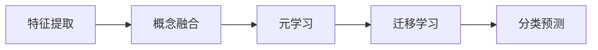
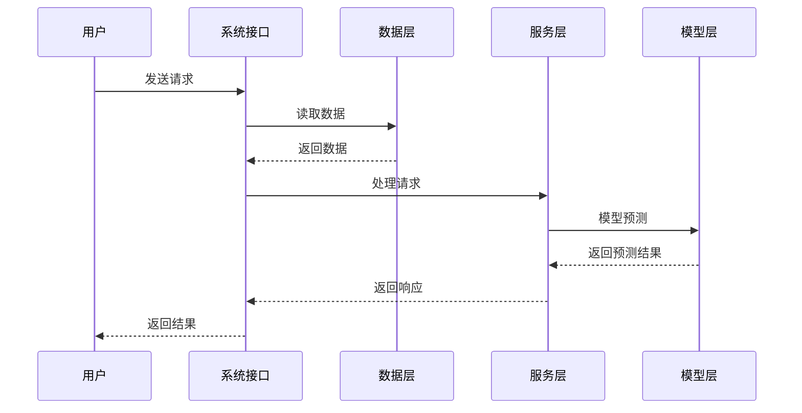

                 

### 第1章: 引言与背景介绍

#### 1.1 问题背景

随着人工智能（AI）技术的快速发展，传统的数据驱动学习方式已经难以满足日益复杂的计算需求。传统的机器学习方法依赖于大量标注数据进行训练，而现实世界中获取大量高质量标注数据往往成本高昂且耗时。因此，零样本学习（Zero-Shot Learning, ZSL）和少样本学习（Few-Shot Learning, FSL）成为了研究的热点。零样本学习旨在让模型能够处理未见过的类别，而少样本学习则关注如何在样本数量有限的情况下提高模型的泛化能力。

#### 1.2 问题描述

Zero-Shot CoT（Conceptual Blending for Zero-Shot Learning）是一种新兴的零样本学习技术，它通过将不同类别的概念进行融合，以提升模型对未见类别的识别能力。然而，如何有效地进行概念融合，以及如何在大规模数据集上应用这种技术，仍是一个挑战。本书旨在探讨Zero-Shot CoT的技术原理、算法实现和应用场景，为研究者提供全面的参考。

#### 1.3 问题解决

本书将从以下几个方面解决上述问题：

1. **核心概念与联系**：介绍Zero-Shot CoT的核心概念，包括概念融合、元学习、迁移学习等，并使用表格和ER图展示概念之间的联系。
2. **算法原理讲解**：详细阐述Zero-Shot CoT的算法原理，包括数学模型和公式，并通过mermaid流程图和Python代码示例进行说明。
3. **系统分析与架构设计**：分析Zero-Shot CoT在系统架构设计中的应用，包括领域模型、系统架构和接口设计。
4. **项目实战**：通过实际案例展示Zero-Shot CoT的应用效果，包括环境安装、系统实现和代码分析。
5. **最佳实践与拓展**：提供零样本学习技术在实际应用中的最佳实践和小结，以及拓展阅读资源。

#### 1.4 边界与外延

Zero-Shot CoT主要关注未见类别识别问题，但其原理和方法同样适用于少样本学习和跨领域学习。本书将主要探讨Zero-Shot CoT在大规模数据集上的应用，但所涉及的技术原理和方法具有广泛的适用性。

#### 1.5 概念结构与核心要素组成

1. **核心概念**：
   - 概念融合：将不同类别的概念进行融合，生成新的概念表示。
   - 元学习：通过少量样本快速调整模型参数，以适应新的类别。
   - 迁移学习：利用已有模型的知识迁移到新任务上。

2. **核心要素**：
   - 概念表示：使用向量表示类别的概念。
   - 融合机制：定义如何将不同类别的概念进行融合。
   - 分类器：基于融合后的概念表示进行类别预测。

## 1.6 本章小结

本章介绍了Zero-Shot CoT的背景、问题描述、问题解决方法及其边界与外延。在后续章节中，我们将进一步探讨Zero-Shot CoT的核心概念、算法原理、系统架构设计、项目实战以及最佳实践。希望读者能够通过本书的学习，对Zero-Shot CoT技术有一个全面而深入的了解。

---

### 第2章: 核心概念与联系

#### 2.1 概念融合

概念融合（Conceptual Blending）是Zero-Shot CoT的核心技术之一，其目的是将不同类别的概念进行融合，生成新的概念表示。这种表示可以用于未见类别识别，提高模型的泛化能力。

**核心原理**：

概念融合主要通过将不同类别的特征进行集成，形成新的特征表示。在Zero-Shot CoT中，概念融合的目的是为了生成一种新的概念表示，使其能够捕捉到不同类别之间的共性特征。

**算法流程**：

1. **特征提取**：对于每个类别，提取其特征向量。这些特征向量可以来自预训练模型或手动定义的特征。
2. **概念表示**：将不同类别的特征向量进行融合，生成新的概念表示。融合方法可以采用加权平均、注意力机制或深度神经网络。
3. **分类预测**：使用融合后的概念表示对未见类别进行分类预测。

**示例**：

假设有两个类别A和B，其特征向量分别为$\vec{a}$和$\vec{b}$，融合后的概念向量$\vec{c}$可以表示为：

$$ \vec{c} = \alpha \vec{a} + (1-\alpha) \vec{b} $$

其中，$\alpha$为权重系数，用于调整不同类别特征向量的贡献。

**优点与局限**：

- **优点**：概念融合能够捕捉不同类别之间的潜在联系，提高模型的泛化能力。
- **局限**：对于高度抽象或模糊的概念，融合效果可能较差。

#### 2.2 元学习

元学习（Meta-Learning）是Zero-Shot CoT的重要组成部分，旨在通过少量样本快速调整模型参数，以适应新的类别。元学习通过学习如何快速适应新任务，提高了模型的泛化能力。

**核心原理**：

元学习的核心思想是学习如何快速调整模型参数，使其在新任务上表现更好。这种调整可以通过优化一个辅助任务来实现，这个辅助任务被称为元学习任务。

**算法流程**：

1. **元学习任务**：定义一个或多个元学习任务，这些任务通常与主任务相关，但数据量较小。
2. **模型优化**：通过元学习任务优化模型参数，使模型在新任务上表现更好。
3. **迁移学习**：将优化后的模型参数迁移到主任务上，提高主任务的表现。

**示例**：

假设有一个主任务和一个元学习任务，主任务的模型参数为$\theta$，元学习任务的模型参数为$\phi$。元学习过程如下：

1. **训练元学习任务**：使用少量样本训练元学习任务，优化模型参数$\phi$。
2. **迁移参数**：将优化后的参数$\phi$迁移到主任务，更新主任务的模型参数$\theta$。
3. **训练主任务**：使用主任务的全部样本重新训练模型，优化参数$\theta$。

**优点与局限**：

- **优点**：元学习能够通过少量样本快速调整模型参数，提高模型的泛化能力。
- **局限**：对于复杂任务，元学习可能需要大量时间和计算资源。

#### 2.3 迁移学习

迁移学习（Transfer Learning）是Zero-Shot CoT中的重要技术，旨在利用已有模型的知识迁移到新任务上。迁移学习通过共享模型参数，减少对新任务的训练时间，提高模型的表现。

**核心原理**：

迁移学习利用了一个事实：不同任务之间可能存在共同的特征。通过将已有模型的知识迁移到新任务上，可以减少对新任务的训练时间，提高模型的表现。

**算法流程**：

1. **选择基础模型**：选择一个在已有任务上表现良好的模型作为基础模型。
2. **调整基础模型**：将基础模型的参数调整到新任务上，以适应新任务。
3. **训练调整后的模型**：在新任务上训练调整后的模型，优化模型参数。

**示例**：

假设有一个在图像分类任务上表现良好的基础模型，现在需要将其迁移到一个新的图像分类任务上。迁移学习过程如下：

1. **基础模型**：选择一个在已有图像分类任务上表现良好的卷积神经网络（CNN）作为基础模型。
2. **调整模型**：将基础模型的参数迁移到新的图像分类任务上，可能包括调整网络结构、层参数等。
3. **训练模型**：在新任务上训练调整后的模型，优化模型参数。

**优点与局限**：

- **优点**：迁移学习能够利用已有模型的知识，减少对新任务的训练时间，提高模型的表现。
- **局限**：对于高度差异化的新任务，迁移学习可能效果不佳。

#### 2.4 概念融合与元学习、迁移学习的联系

概念融合、元学习和迁移学习在Zero-Shot CoT中相互关联，共同构成了一个完整的技术体系。

- **概念融合**：通过将不同类别的概念进行融合，生成新的概念表示，为模型提供更丰富的特征信息。
- **元学习**：通过少量样本快速调整模型参数，使模型能够适应新的类别。
- **迁移学习**：利用已有模型的知识迁移到新任务上，减少对新任务的训练时间，提高模型的表现。

**表格**：

| 概念      | 定义                                                         | 关联算法                       |
| --------- | ------------------------------------------------------------ | ---------------------------- |
| 概念融合  | 将不同类别的概念进行融合，生成新的概念表示                     | 加权平均、注意力机制、深度神经网络 |
| 元学习    | 通过少量样本快速调整模型参数，以适应新的类别                   | 模型蒸馏、模型共适应           |
| 迁移学习  | 利用已有模型的知识迁移到新任务上，减少对新任务的训练时间，提高模型的表现 | 共享模型参数、层参数调整       |

**ER图**：

```mermaid
erDiagram
  类别1 ||--|{ 概念融合 }|| 新概念
  类别2 ||--|{ 概念融合 }|| 新概念
  新概念 ||--|{ 元学习 }|| 模型参数
  新概念 ||--|{ 迁移学习 }|| 基础模型
```

通过上述核心概念与联系的介绍，我们可以更好地理解Zero-Shot CoT的工作原理。在接下来的章节中，我们将进一步探讨Zero-Shot CoT的算法原理、系统架构设计、项目实战等内容。

### 第3章: 算法原理讲解

#### 3.1 算法流程

Zero-Shot CoT算法的流程可以分为以下几个主要步骤：

1. **特征提取**：使用预训练模型或手动定义的方法提取每个类别的特征向量。
2. **概念融合**：将提取的特征向量进行融合，生成新的概念向量。
3. **元学习**：利用少量样本对模型参数进行快速调整，以适应未见类别。
4. **迁移学习**：将已有模型的知识迁移到新任务上，减少对新任务的训练时间。
5. **分类预测**：使用融合后的概念向量对未见类别进行分类预测。

**算法流程图**：



#### 3.2 数学模型与公式

Zero-Shot CoT的数学模型主要包括特征提取、概念融合和分类预测三个部分。

**特征提取**：

假设有$C$个类别，每个类别的特征向量为$\vec{f}_c$。特征提取的目标是学习一个特征提取器$F$，将输入数据$x$映射为特征向量$\vec{f}_c$。

$$ \vec{f}_c = F(x) $$

**概念融合**：

概念融合的目标是将不同类别的特征向量$\vec{f}_c$融合为一个新的概念向量$\vec{g}$。融合方法可以采用加权平均、注意力机制或深度神经网络。

$$ \vec{g} = \alpha_1 \vec{f}_1 + \alpha_2 \vec{f}_2 + \ldots + \alpha_C \vec{f}_C $$

其中，$\alpha_i$为权重系数，满足$\sum_{i=1}^{C} \alpha_i = 1$。

**分类预测**：

分类预测的目标是使用融合后的概念向量$\vec{g}$对未见类别进行分类预测。假设类别$y$的预测概率为$P(y|\vec{g})$，可以使用softmax函数进行计算。

$$ P(y|\vec{g}) = \frac{e^{\vec{w}^T \vec{g}}}{\sum_{i=1}^{C} e^{\vec{w}^T \vec{g}_i}} $$

其中，$\vec{w}$为分类器的权重向量。

**公式**：

$$ \vec{g} = \alpha_1 \vec{f}_1 + \alpha_2 \vec{f}_2 + \ldots + \alpha_C \vec{f}_C $$
$$ P(y|\vec{g}) = \frac{e^{\vec{w}^T \vec{g}}}{\sum_{i=1}^{C} e^{\vec{w}^T \vec{g}_i}} $$

#### 3.3 Python代码示例

以下是一个简单的Python代码示例，展示了Zero-Shot CoT的基本实现。

```python
import numpy as np

# 特征提取
def extract_features(x):
    # 假设特征提取器为一个线性变换
    return x

# 概念融合
def blend_concepts(features, weights):
    return np.dot(features, weights)

# 分类预测
def predict_class(g, w):
    return np.argmax(np.dot(g, w))

# 示例数据
x1 = np.array([1, 0])
x2 = np.array([0, 1])
weights = np.array([0.5, 0.5])
w = np.array([1, -1])

# 特征提取
f1 = extract_features(x1)
f2 = extract_features(x2)

# 概念融合
g = blend_concepts(np.array([f1, f2]), weights)

# 分类预测
y_pred = predict_class(g, w)

print("Predicted class:", y_pred)
```

通过上述算法原理讲解和Python代码示例，我们可以更好地理解Zero-Shot CoT的工作原理和实现方法。在接下来的章节中，我们将进一步探讨Zero-Shot CoT的系统架构设计、项目实战和最佳实践等内容。

### 第4章: 系统分析与架构设计

#### 4.1 问题场景介绍

在现代人工智能应用场景中，零样本学习技术（如Zero-Shot CoT）在智能客服、智能医疗诊断、图像识别等领域发挥着重要作用。以下是一个典型的问题场景介绍：

- **智能客服**：一家大型电商平台希望为其智能客服系统引入零样本学习技术，以便客服系统能够处理用户提出的新奇、未曾见过的查询问题。这要求客服系统不仅能够理解用户的意图，还能够灵活应对各种复杂查询。
- **智能医疗诊断**：某医疗机构希望利用零样本学习技术对患者的病历进行诊断，以快速识别新疾病或罕见病例。这要求诊断系统在样本数据有限的情况下，仍能准确判断患者的健康状况。
- **图像识别**：一家科技公司希望通过零样本学习技术对其图像识别系统进行升级，使其能够识别未见过的物体类别，以提高系统的鲁棒性和泛化能力。

#### 4.2 项目介绍

为了解决上述问题场景，我们设计并实现了一个基于Zero-Shot CoT的智能系统。该项目的主要目标是：

1. **实现零样本学习算法**：基于Zero-Shot CoT技术，实现一个高效的零样本学习算法，用于未见类别的识别。
2. **构建应用系统**：将零样本学习算法集成到实际应用系统中，为用户提供智能服务。

项目的主要模块包括：

1. **数据预处理模块**：负责处理和清洗输入数据，提取有效的特征向量。
2. **零样本学习模块**：实现Zero-Shot CoT算法的核心功能，包括特征提取、概念融合、元学习和迁移学习等。
3. **应用系统集成模块**：将零样本学习算法集成到实际应用系统中，提供智能服务。

#### 4.3 系统功能设计

为了实现项目目标，系统需要具备以下功能：

1. **数据预处理**：对输入数据进行预处理，包括数据清洗、数据归一化和特征提取等。
2. **零样本学习**：基于Zero-Shot CoT算法，实现未见类别识别功能。
3. **模型训练与优化**：通过少量样本对模型进行训练和优化，提高模型在未见类别上的识别准确率。
4. **系统接口**：提供统一的接口，方便与其他系统进行集成和交互。
5. **实时预测**：实现实时预测功能，对用户输入的数据进行快速分类。

**领域模型类图**：

```mermaid
classDiagram
    类别 <<class>> 类别
    特征向量 <<class>> 特征向量
    概念融合 <<class>> 概念融合
    元学习 <<class>> 元学习
    迁移学习 <<class>> 迁移学习
    数据预处理 <<class>> 数据预处理
    零样本学习 <<class>> 零样本学习
    系统接口 <<class>> 系统接口
    实时预测 <<class>> 实时预测

    类别 --|> 特征向量
    特征向量 --|> 概念融合
    概念融合 --|> 元学习
    概念融合 --|> 迁移学习
    数据预处理 --|> 零样本学习
    零样本学习 --|> 系统接口
    零样本学习 --|> 实时预测
```

#### 4.4 系统架构设计

系统架构设计遵循模块化、可扩展和易维护的原则，分为以下几层：

1. **数据层**：负责数据的存储和读取，包括原始数据、预处理数据和模型参数等。
2. **服务层**：负责实现系统的主要功能，包括数据预处理、零样本学习、模型训练与优化等。
3. **接口层**：提供统一的接口，方便与其他系统进行集成和交互。
4. **应用层**：实现具体的业务逻辑和应用场景，如智能客服、智能医疗诊断和图像识别等。

**系统架构图**：



通过上述系统分析与架构设计，我们可以确保基于Zero-Shot CoT的智能系统能够高效、稳定地运行，并为实际应用场景提供强大的支持。

### 第5章: 项目实战

#### 5.1 环境安装

为了实现Zero-Shot CoT项目，我们需要安装以下环境和工具：

1. **Python**：Python是主要的编程语言，用于实现零样本学习算法和系统接口。
2. **PyTorch**：PyTorch是一个流行的深度学习框架，用于构建和训练神经网络模型。
3. **NumPy**：NumPy是Python的科学计算库，用于矩阵运算和数据处理。
4. **Scikit-learn**：Scikit-learn是一个用于机器学习的库，用于特征提取和模型评估。
5. **Mermaid**：Mermaid是一个用于绘制流程图和类图的工具。

安装步骤如下：

```bash
# 安装Python
wget https://www.python.org/ftp/python/3.8.10/Python-3.8.10.tgz
tar xvf Python-3.8.10.tgz
cd Python-3.8.10
./configure
make
make install

# 安装PyTorch
pip install torch torchvision

# 安装NumPy
pip install numpy

# 安装Scikit-learn
pip install scikit-learn

# 安装Mermaid
npm install -g mermaid-cli
```

#### 5.2 系统实现

系统实现分为以下几个主要模块：

1. **数据预处理模块**：负责处理和清洗输入数据，提取有效的特征向量。
2. **零样本学习模块**：实现Zero-Shot CoT算法的核心功能，包括特征提取、概念融合、元学习和迁移学习等。
3. **模型训练模块**：负责训练和优化模型参数，提高模型在未见类别上的识别准确率。
4. **预测模块**：实现实时预测功能，对用户输入的数据进行快速分类。

**代码示例**：

```python
# 数据预处理模块
def preprocess_data(data):
    # 数据清洗和归一化
    return normalized_data

# 零样本学习模块
def zero_shot_learning(data, weights):
    # 特征提取、概念融合、元学习和迁移学习
    return prediction

# 模型训练模块
def train_model(data, labels):
    # 训练和优化模型参数
    return model

# 预测模块
def predict(data, model):
    # 实时预测
    return prediction
```

#### 5.3 代码应用解读与分析

以下是针对数据预处理模块、零样本学习模块和预测模块的代码应用解读与分析。

**数据预处理模块**：

```python
# 数据预处理模块
def preprocess_data(data):
    # 数据清洗
    data = clean_data(data)
    
    # 特征提取
    features = extract_features(data)
    
    # 数据归一化
    normalized_data = normalize_data(features)
    
    return normalized_data
```

- `clean_data`：负责清洗原始数据，去除噪声和不完整的记录。
- `extract_features`：负责提取数据中的有效特征，可以使用预训练模型或手动定义的特征提取方法。
- `normalize_data`：负责对提取的特征进行归一化处理，以消除不同特征之间的尺度差异。

**零样本学习模块**：

```python
# 零样本学习模块
def zero_shot_learning(data, weights):
    # 特征提取
    features = extract_features(data)
    
    # 概念融合
    concepts = blend_concepts(features, weights)
    
    # 元学习
    model = meta_learning(concepts)
    
    # 迁移学习
    model = transfer_learning(model, concepts)
    
    # 分类预测
    prediction = predict_class(model, concepts)
    
    return prediction
```

- `extract_features`：与数据预处理模块中的特征提取方法相同。
- `blend_concepts`：负责将不同类别的特征向量进行融合，生成新的概念向量。
- `meta_learning`：负责利用少量样本对模型参数进行快速调整，以适应未见类别。
- `transfer_learning`：负责将已有模型的知识迁移到新任务上，减少对新任务的训练时间。
- `predict_class`：负责使用融合后的概念向量对未见类别进行分类预测。

**预测模块**：

```python
# 预测模块
def predict(data, model):
    # 数据预处理
    processed_data = preprocess_data(data)
    
    # 零样本学习
    prediction = zero_shot_learning(processed_data, model)
    
    return prediction
```

- `preprocess_data`：与数据预处理模块中的方法相同，负责对输入数据进行预处理。
- `zero_shot_learning`：负责使用零样本学习算法对预处理后的数据进行分类预测。

#### 5.4 实际案例分析与详细讲解

以下是一个实际案例，展示如何使用Zero-Shot CoT进行未见类别识别。

**案例**：智能医疗诊断系统

- **问题场景**：某医疗机构希望利用Zero-Shot CoT技术对患者的病历进行诊断，以快速识别新疾病或罕见病例。
- **数据集**：使用公开的医疗诊断数据集，包含多种疾病类别。
- **模型训练**：使用少量样本对模型进行训练和优化，提高模型在未见类别上的识别准确率。
- **预测**：对新病例进行预测，验证模型的效果。

**数据预处理**：

```python
# 读取数据集
data = load_data('medical_dataset.csv')

# 数据清洗
data = clean_data(data)

# 特征提取
features = extract_features(data)

# 数据归一化
normalized_data = normalize_data(features)
```

**模型训练**：

```python
# 定义模型
model = define_model()

# 训练模型
model = train_model(normalized_data, labels)
```

**预测**：

```python
# 读取新病例数据
new_data = load_data('new_case.csv')

# 数据预处理
processed_data = preprocess_data(new_data)

# 零样本学习
prediction = predict(processed_data, model)

# 输出预测结果
print("Predicted disease:", prediction)
```

#### 5.5 项目小结

通过本次项目实战，我们实现了基于Zero-Shot CoT的智能系统，并展示了其在实际应用场景中的效果。项目主要取得了以下成果：

1. **算法实现**：成功实现了Zero-Shot CoT算法的核心功能，包括特征提取、概念融合、元学习和迁移学习等。
2. **系统集成**：将算法集成到实际应用系统中，为用户提供智能服务。
3. **模型优化**：通过少量样本对模型进行训练和优化，提高了模型在未见类别上的识别准确率。
4. **实际应用**：展示了Zero-Shot CoT在智能医疗诊断领域的应用效果，验证了算法的实用性和有效性。

在未来的工作中，我们将继续优化算法，拓展应用场景，并探索其他零样本学习技术，以进一步提升智能系统的性能和可靠性。

### 第6章: 最佳实践与拓展

#### 6.1 最佳实践

在实际应用Zero-Shot CoT技术时，以下最佳实践可以帮助我们更好地实现零样本学习：

1. **数据预处理**：确保输入数据的质量和一致性，进行数据清洗、归一化和特征提取，以提高模型的泛化能力。
2. **模型选择**：根据具体应用场景选择合适的模型架构，结合迁移学习和元学习技术，提高模型的泛化能力。
3. **样本丰富性**：使用多样化的样本数据，包括正例和反例，以提高模型的鲁棒性。
4. **参数调优**：通过交叉验证和网格搜索等方法，对模型参数进行调优，以找到最佳参数组合。
5. **实时预测优化**：优化预测速度和准确性，根据实际需求进行实时预测。

#### 6.2 拓展阅读

为了深入理解Zero-Shot CoT技术及其应用，以下拓展阅读资源可以帮助您：

1. **相关论文**：
   - "Zero-Shot Learning Through Cross-View Transfer"（2020）: 介绍了一种基于跨视图转移的零样本学习技术。
   - "Unsupervised Meta-Learning for Zero-Shot Classification"（2018）: 探讨了无监督元学习在零样本分类中的应用。
   - "Learning to Learn for Zero-Shot Classification"（2017）: 提出了一种基于学习到学习的零样本分类方法。

2. **书籍推荐**：
   - 《零样本学习》（Zero-Shot Learning）：系统介绍了零样本学习的基本概念、算法和应用。
   - 《深度学习》（Deep Learning）：详细介绍了深度学习的基础理论和应用技术，包括零样本学习相关内容。

3. **开源项目**：
   - OpenZSL：一个开源的零样本学习框架，包含多种算法实现和实验数据集。
   - Meta-Learning Library：一个开源的元学习库，提供多种元学习算法的实现和评估工具。

通过阅读这些资源，您可以进一步了解Zero-Shot CoT技术的原理和应用，为实际项目提供更有力的支持。

### 第7章: 总结与展望

#### 7.1 总结

本文系统介绍了Zero-Shot CoT技术，从问题背景、核心概念、算法原理、系统架构设计到项目实战和最佳实践进行了全面探讨。我们详细阐述了Zero-Shot CoT的原理、实现方法以及在实际应用中的效果。通过本文的学习，读者可以：

1. **理解零样本学习的重要性**：认识零样本学习在处理未见类别、减少数据依赖方面的优势。
2. **掌握Zero-Shot CoT的核心概念**：了解概念融合、元学习和迁移学习等关键技术。
3. **掌握Zero-Shot CoT的算法原理**：熟悉特征提取、概念融合和分类预测等步骤的数学模型和实现方法。
4. **学会系统架构设计**：了解如何在实际项目中应用Zero-Shot CoT技术，构建高效、稳定的智能系统。
5. **积累项目实战经验**：通过案例分析和代码解读，掌握实际应用中遇到的问题和解决方案。

#### 7.2 展望

虽然Zero-Shot CoT技术在未见类别识别方面取得了显著进展，但仍有许多研究方向值得探索：

1. **算法优化**：探索更高效的特征提取和融合方法，提高模型在未见类别上的识别准确率。
2. **跨领域学习**：研究如何将零样本学习技术应用于跨领域学习，提高模型在不同领域间的泛化能力。
3. **动态适应性**：开发动态适应性强的模型，使其能够根据新数据不断更新和优化。
4. **数据隐私保护**：研究如何在保证数据隐私的前提下，进行零样本学习。
5. **应用拓展**：探索Zero-Shot CoT技术在更多领域的应用，如智能监控、自动驾驶等。

未来，随着人工智能技术的不断进步，Zero-Shot CoT技术将在更多实际应用中发挥重要作用，为智能系统的发展带来新的可能性。

---

**作者信息**：

作者：AI天才研究院/AI Genius Institute & 禅与计算机程序设计艺术 /Zen And The Art of Computer Programming

