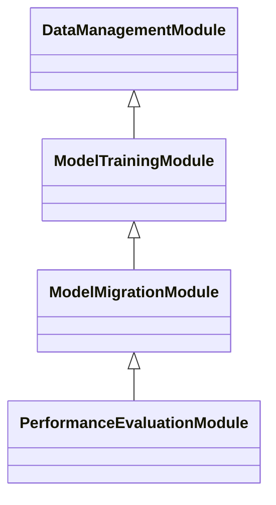
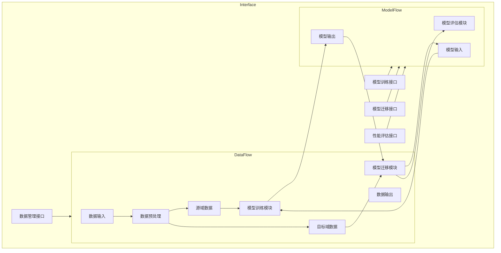
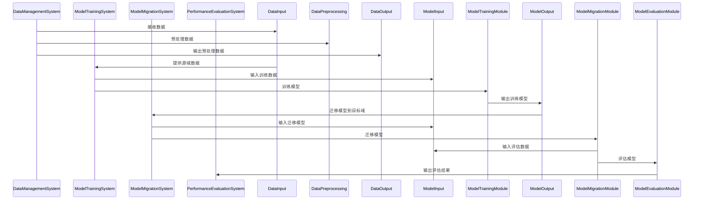
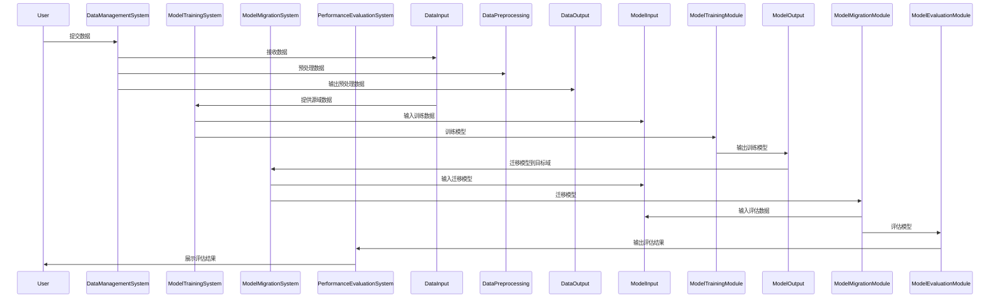

                 

### 1.1 问题背景

#### 1.1.1 人工智能与跨域迁移学习

人工智能（Artificial Intelligence，AI）是计算机科学的一个重要分支，旨在使机器具备人类智能的能力，从而能够感知环境、学习知识、做出决策和执行任务。随着深度学习（Deep Learning）和大数据技术的飞速发展，人工智能取得了显著的进展，广泛应用于自然语言处理、计算机视觉、语音识别、自动驾驶等众多领域。

然而，人工智能在实际应用中面临的一个关键挑战是如何有效地利用已有的知识去解决新的问题，这引发了跨域迁移学习（Cross-Domain Transfer Learning）的研究热潮。跨域迁移学习指的是将一个领域（源域）学到的知识迁移到另一个相关但不完全相同的领域（目标域），从而提升模型在新领域的性能。

在传统的迁移学习中，模型的迁移能力主要依赖于源域和目标域之间的相似性。然而，在实际应用中，不同领域的数据分布、任务类型和目标属性往往存在较大的差异，使得传统的迁移学习方法的效果受限。因此，零样本转移学习（Zero-Shot Transfer Learning）作为一种新兴的方法，引起了广泛关注。零样本转移学习允许模型在没有或仅有少量目标域数据的情况下，通过源域的知识迁移，在新领域取得良好的性能。

#### 1.1.2 传统迁移学习挑战与局限性

传统的迁移学习方法在许多场景下表现出色，但它们也存在一些显著的局限性。首先，这些方法通常依赖于大量的源域数据和目标域数据的相似性，但在实际应用中，这种相似性往往难以保证。其次，传统的迁移学习方法往往依赖于手工设计的特征工程，这需要大量的人工干预和专业知识，限制了方法的普适性和自动化程度。

此外，传统的迁移学习方法在处理跨域迁移时，容易受到源域和目标域数据分布差异的影响，导致迁移效果不佳。例如，在医疗领域，将一种疾病诊断模型应用于另一种疾病时，由于不同疾病的数据分布差异较大，传统的迁移学习方法可能无法有效地迁移知识。

#### 1.1.3 零样本学习与零样本转移学习

零样本学习（Zero-Shot Learning，ZSL）是一种特殊类型的迁移学习，其主要目标是让模型在没有或仅有少量目标类别的样本情况下，对新类别进行预测。在零样本学习中，模型通常通过学习源域中已知类别的关系来推断未知类别。

零样本学习在许多实际场景中具有广泛的应用，例如在新产品发布时对用户进行偏好预测、在医疗诊断中对未检测到的疾病进行预测等。然而，零样本学习的挑战在于如何有效地利用有限的源域知识，以实现对未知类别的高效预测。

零样本转移学习（Zero-Shot Transfer Learning，ZoSL）是将零样本学习与传统的迁移学习方法相结合的一种方法。ZoSL的目标是在没有或仅有少量目标域数据的情况下，通过源域的知识迁移，在新领域取得良好的性能。与传统的迁移学习相比，ZoSL具有更强的泛化能力和适应性，特别是在处理跨域迁移任务时表现出色。

零样本转移学习的核心思想是利用源域中已知类别和未知类别之间的关联，通过迁移学习的方式，将源域的知识迁移到目标域。这种方法不仅能够有效地利用有限的源域数据，还能够适应不同的目标域，从而在多个领域实现良好的性能。

总之，零样本转移学习作为一种新兴的跨域迁移学习方法，通过将零样本学习和传统的迁移学习方法相结合，提供了有效的解决方案，有助于克服传统方法的局限性，提高模型在未知领域的性能。在接下来的章节中，我们将深入探讨零样本转移学习的核心概念、算法原理以及实际应用案例，以期为读者提供全面的了解。

## 第2章 核心概念与术语

在深入探讨零样本转移学习（Zero-Shot Transfer Learning，ZoSL）之前，我们需要明确一些核心概念和术语，以便为后续的讨论打下坚实的基础。

### 2.1 零样本转移学习概念

#### 2.1.1 零样本转移学习原理

零样本转移学习是一种迁移学习方法，它的主要目标是在没有或仅有少量目标域（Target Domain）数据的情况下，通过源域（Source Domain）的知识迁移，提升模型在目标域的性能。具体来说，零样本转移学习通过以下两个关键步骤实现：

1. **特征表示学习**：在源域上学习一种通用的特征表示，这种特征表示能够捕捉数据中的潜在结构，并且能够适应不同的领域。这种特征表示通常通过预训练的深度神经网络来实现。
2. **类别关系建模**：利用源域中已知类别（Known Classes）和未知类别（Unknown Classes）之间的关联，建立类别关系模型。这个模型用于在目标域中预测未知类别。

#### 2.1.2 零样本转移学习类型

根据类别关系的建模方式，零样本转移学习可以分为以下几类：

1. **原型匹配方法**：这种方法通过在源域上学习类别的原型（Prototypes）来表示类别，然后在目标域上使用这些原型来预测未知类别。常见的原型匹配方法包括原型网络（Prototypical Networks）和原型匹配损失函数。
   
2. **关系网络方法**：这种方法通过学习类别之间的关系来预测未知类别。关系网络方法通常使用图神经网络（Graph Neural Networks）或图注意力机制（Graph Attention Mechanism）来建模类别之间的复杂关系。

3. **元学习（Meta-Learning）方法**：这种方法通过在多个源域上训练模型，使其具备在未知目标域上快速适应的能力。元学习方法包括模型无关的元学习（Model-Agnostic Meta-Learning，MAML）和模型相关的元学习（Model-Aware Meta-Learning）。

#### 2.1.3 零样本转移学习的关键挑战

零样本转移学习虽然在许多场景下表现出色，但仍然面临一些关键挑战：

1. **类别关系建模**：如何准确地建模源域中已知类别和未知类别之间的关系是零样本转移学习的关键挑战。类别关系的复杂性和多样性使得这一任务具有很大的挑战性。

2. **数据稀缺性**：在许多实际应用中，目标域数据稀缺，这使得模型难以通过直接学习目标域数据来提高性能。零样本转移学习需要有效地利用有限的源域数据，这增加了模型的复杂性。

3. **泛化能力**：零样本转移学习需要模型具备较强的泛化能力，以适应不同的目标域。如何设计能够泛化的模型架构和训练策略是研究的重点。

### 2.2 跨领域迁移学习

#### 2.2.1 跨领域迁移学习定义

跨领域迁移学习（Cross-Domain Transfer Learning）是指将一个领域（源领域）中学习到的知识迁移到另一个相关但不完全相同的领域（目标领域）。跨领域迁移学习的目标是利用源领域的知识，提高目标领域模型的性能，尤其是在数据稀缺或数据分布差异较大的情况下。

#### 2.2.2 跨领域迁移学习优势

跨领域迁移学习具有以下几个显著优势：

1. **减少数据需求**：通过跨领域迁移学习，模型可以在没有或仅有少量目标领域数据的情况下，利用源领域的数据进行训练。这大大减少了数据收集和标注的成本。

2. **提高模型泛化能力**：跨领域迁移学习能够帮助模型学习到更加通用和鲁棒的特征表示，从而提高模型在未知领域中的泛化能力。

3. **增强模型适应性**：跨领域迁移学习使得模型能够适应不同的领域和任务，从而实现更广泛的应用。

#### 2.2.3 跨领域迁移学习策略

跨领域迁移学习可以采用多种策略，包括：

1. **特征重用**：通过在源领域和目标领域之间共享特征表示，将源领域的知识迁移到目标领域。这种方法通常使用预训练的深度神经网络模型。

2. **域适配**：通过在目标领域上微调源领域学到的特征表示，以适应目标领域的特定任务。这种方法通常结合域适应技术，如域丢弃（Domain Dropout）和域对抗训练（Domain Adaptation through Adversarial Training）。

3. **类别关联建模**：通过建立源领域和目标领域类别之间的关联，将源领域的知识迁移到目标领域。这种方法通常使用图神经网络和图注意力机制。

### 总结

在本章中，我们介绍了零样本转移学习和跨领域迁移学习的基本概念、原理和关键挑战。通过理解这些核心概念，我们可以更好地把握零样本转移学习的应用场景和潜力。在接下来的章节中，我们将深入探讨零样本转移学习的算法原理和数学模型，为读者提供更加详细的解析。

## 第3章 算法原理

在深入探讨零样本转移学习（Zero-Shot Transfer Learning，ZoSL）的算法原理时，我们需要了解几种主要的方法，这些方法通过不同的机制实现零样本转移学习的目标。以下是几种常见的零样本转移学习算法及其原理：

### 3.1 Meta-Learning

#### 3.1.1 Model-Agnostic Meta-Learning (MAML)

模型无关的元学习（Model-Agnostic Meta-Learning，MAML）是由Vapnik和Lomonosov提出的一种零样本转移学习方法。MAML的核心思想是通过在多个任务（源任务）上快速适应，来学习一个能够在新任务（目标任务）上快速收敛的模型。

**数学模型：**

MAML的目标是找到一个参数θ，使得模型在新任务上能够快速收敛。具体来说，MAML使用以下优化目标：

$$
\theta^* = \arg\min_{\theta} \sum_{i=1}^{N} \mathcal{L}(\theta, x_i^s, y_i^s) + \lambda \sum_{i=1}^{N} \|\theta - \theta_i^s\|_2^2
$$

其中，$x_i^s$和$y_i^s$是源任务上的输入和输出，$\theta_i^s$是源任务上的迭代参数，$N$是源任务的个数，$\lambda$是正则化参数，$\mathcal{L}(\theta, x_i^s, y_i^s)$是损失函数。

**Pseudocode：**

```
# MAML算法
for i = 1 to N:
    # 在源任务i上迭代更新参数
    gradient = gradient_of_loss_with_respect_to_theta(x_i^s, y_i^s)
    theta_i^s = theta_i^s - learning_rate * gradient

# 在目标任务上更新参数
theta^* = theta^s
```

**步骤：**
1. 在源任务上迭代更新模型参数，同时记录每次迭代的梯度。
2. 计算源任务上的梯度总和。
3. 使用梯度总和更新目标任务的初始参数。
4. 在目标任务上使用更新后的参数进行预测。

**举例：**假设我们有两个源任务和两个目标任务。首先，我们在源任务1和源任务2上分别迭代更新模型参数，记录每次迭代的梯度。然后，计算两个源任务的梯度总和，并使用这些梯度更新目标任务的初始参数。最后，在目标任务上使用更新后的参数进行预测。

#### 3.1.2 Reptile

Reptile（反复学习）是另一种元学习算法，由Bengio等人提出。Reptile通过在一个源任务上迭代学习，然后通过调整学习率逐步迁移到其他任务，实现快速适应。

**数学模型：**

Reptile使用以下优化目标：

$$
\theta_{t+1} = \theta_t + \eta_t \left( \theta_t - \theta_s \right)
$$

其中，$\theta_t$是当前任务的参数，$\theta_s$是源任务的参数，$\eta_t$是学习率，$t$是迭代次数。

**Pseudocode：**

```
# Reptile算法
theta_s = initial_model_params
for t = 1 to T:
    # 在当前任务上迭代更新模型参数
    theta_t = update_params_with_gradient(x_t, y_t)
    # 计算学习率
    eta_t = learning_rate(t)
    # 更新源任务的参数
    theta_s = theta_s + eta_t * (theta_t - theta_s)
```

**步骤：**
1. 初始化源任务的参数。
2. 在当前任务上迭代更新模型参数。
3. 计算学习率。
4. 使用学习率和当前任务与源任务参数的差值更新源任务的参数。
5. 重复步骤2-4直到达到预定的迭代次数。

**举例：**假设我们有一个源任务和多个目标任务。首先，初始化源任务的参数。然后，在每个目标任务上迭代更新模型参数，同时计算学习率，并使用学习率更新源任务的参数。这样，通过逐步迁移源任务的参数，实现快速适应不同目标任务。

#### 3.1.3 Gradient Descent withandboxing

梯度下降结合andboxing（GD withandboxing）是一种结合了元学习和传统梯度下降的方法。它通过在一个源任务上迭代学习，并使用andboxing技术减少目标任务上的梯度影响，实现快速适应。

**数学模型：**

GD withandboxing使用以下优化目标：

$$
\theta_{t+1} = \theta_t + \eta_t \left( \theta_t - \theta_s \right) - \alpha_t \cdot \frac{\partial L}{\partial \theta}
$$

其中，$\theta_t$是当前任务的参数，$\theta_s$是源任务的参数，$\eta_t$是元学习率，$\alpha_t$是andboxing参数，$L$是损失函数。

**Pseudocode：**

```
# GD withandboxing算法
theta_s = initial_model_params
for t = 1 to T:
    # 在当前任务上迭代更新模型参数
    theta_t = update_params_with_gradient(x_t, y_t)
    # 计算元学习率
    eta_t = meta_learning_rate(t)
    # 计算源任务和当前任务的参数差
    delta_theta = theta_t - theta_s
    # 计算当前任务的梯度
    gradient = gradient_of_loss_with_respect_to_theta(x_t, y_t)
    # 计算更新量
    update = eta_t * delta_theta - alpha_t * gradient
    # 更新源任务的参数
    theta_s = theta_s + update
```

**步骤：**
1. 初始化源任务的参数。
2. 在当前任务上迭代更新模型参数。
3. 计算元学习率和当前任务的梯度。
4. 使用元学习率和当前任务与源任务参数的差值，结合当前任务的梯度，计算更新量。
5. 使用更新量更新源任务的参数。
6. 重复步骤2-5直到达到预定的迭代次数。

**举例：**假设我们有一个源任务和多个目标任务。首先，初始化源任务的参数。然后，在每个目标任务上迭代更新模型参数，同时计算元学习率和当前任务的梯度，并使用这些值更新源任务的参数。通过这种方式，实现快速适应不同目标任务。

### 3.2 Model-Based Meta-Learning

#### 3.2.1 MAML++

MAML++（改进的MAML）是MAML的扩展版本，它引入了支持向量机（SVM）的概念，以增强模型的泛化能力。

**数学模型：**

MAML++使用以下优化目标：

$$
\theta^* = \arg\min_{\theta} \sum_{i=1}^{N} \mathcal{L}(\theta, x_i^s, y_i^s) + \lambda \sum_{i=1}^{N} \|\theta - \theta_i^s\|_2^2 + \frac{1}{2} \sum_{i=1}^{N} \gamma \|\theta - \theta_i^{svm}\|_2^2
$$

其中，$\theta_i^s$是源任务的迭代参数，$\theta_i^{svm}$是源任务上支持向量机的参数，$\gamma$是SVM参数。

**Pseudocode：**

```
# MAML++算法
for i = 1 to N:
    # 在源任务i上迭代更新参数
    gradient = gradient_of_loss_with_respect_to_theta(x_i^s, y_i^s)
    theta_i^s = theta_i^s - learning_rate * gradient

    # 训练支持向量机
    theta_i^{svm} = train_svm(x_i^s, y_i^s)

# 在目标任务上更新参数
theta^* = theta^s
theta^{svm} = theta^{svm}_s
```

**步骤：**
1. 在源任务上迭代更新模型参数和训练支持向量机。
2. 计算源任务上的梯度总和和支持向量机参数。
3. 在目标任务上使用更新后的参数和支持向量机参数进行预测。

**举例：**假设我们有两个源任务和两个目标任务。首先，在源任务1和源任务2上分别迭代更新模型参数和训练支持向量机，记录每次迭代的梯度和支持向量机参数。然后，计算两个源任务的梯度总和和支持向量机参数总和，并使用这些值更新目标任务的初始参数。最后，在目标任务上使用更新后的参数和支持向量机参数进行预测。

#### 3.2.2 MAF

MAF（模型适配函数）是另一种基于元学习的零样本转移学习方法，它通过学习一个模型适配函数来快速适应新任务。

**数学模型：**

MAF使用以下优化目标：

$$
\theta^* = \arg\min_{\theta} \sum_{i=1}^{N} \mathcal{L}(\theta, x_i^s, y_i^s) + \lambda \sum_{i=1}^{N} \|\theta - \theta_i^s\|_2^2
$$

其中，$\theta_i^s$是源任务的迭代参数。

**Pseudocode：**

```
# MAF算法
for i = 1 to N:
    # 在源任务i上迭代更新参数
    gradient = gradient_of_loss_with_respect_to_theta(x_i^s, y_i^s)
    theta_i^s = theta_i^s - learning_rate * gradient

# 在目标任务上更新参数
theta^* = theta^s
```

**步骤：**
1. 在源任务上迭代更新模型参数。
2. 在目标任务上使用更新后的参数进行预测。

**举例：**假设我们有两个源任务和两个目标任务。首先，在源任务1和源任务2上分别迭代更新模型参数，记录每次迭代的梯度。然后，在目标任务上使用更新后的参数进行预测。

#### 3.2.3 Model

“Model”是一种基于模型的元学习方法，它通过学习一个模型表示来快速适应新任务。

**数学模型：**

Model使用以下优化目标：

$$
\theta^* = \arg\min_{\theta} \sum_{i=1}^{N} \mathcal{L}(\theta, x_i^s, y_i^s) + \lambda \sum_{i=1}^{N} \|\theta - \theta_i^s\|_2^2
$$

其中，$\theta_i^s$是源任务的迭代参数。

**Pseudocode：**

```
# Model算法
for i = 1 to N:
    # 在源任务i上迭代更新参数
    gradient = gradient_of_loss_with_respect_to_theta(x_i^s, y_i^s)
    theta_i^s = theta_i^s - learning_rate * gradient

# 在目标任务上更新参数
theta^* = theta^s
```

**步骤：**
1. 在源任务上迭代更新模型参数。
2. 在目标任务上使用更新后的参数进行预测。

**举例：**假设我们有两个源任务和两个目标任务。首先，在源任务1和源任务2上分别迭代更新模型参数，记录每次迭代的梯度。然后，在目标任务上使用更新后的参数进行预测。

### 总结

在本章中，我们介绍了零样本转移学习的几种主要算法，包括MAML、Reptile、GD withandboxing、MAML++、MAF和Model。这些算法通过不同的机制实现快速适应和迁移学习，为解决跨域迁移问题提供了有效的解决方案。在接下来的章节中，我们将进一步探讨这些算法的数学模型和具体实现，以便读者能够深入理解和应用这些算法。

## 第4章 数学公式及解释

在深入探讨零样本转移学习（Zero-Shot Transfer Learning，ZoSL）的数学模型时，我们需要准确使用LaTeX格式来表示复杂的数学公式。以下我们将详细讨论几个关键数学模型，并通过LaTeX代码示例进行展示，帮助读者更好地理解和应用这些模型。

### 4.1 原型网络（Prototypical Networks）

原型网络是一种常用的零样本转移学习方法，其核心思想是通过学习每个类别的原型来进行预测。

**LaTeX代码示例：**

$$
\text{Prototypical Loss} = -\frac{1}{N} \sum_{i=1}^{N} \sum_{k=1}^{K} \mathbb{1}_{y_i=k} \cdot \log \frac{\exp(f(\theta; x_i^{q}, x_i^{k}))}{\sum_{j=1, j \neq k}^{K} \exp(f(\theta; x_i^{q}, x_i^{j}))}
$$

**解释：**

- $f(\theta; x_i^{q}, x_i^{k})$ 表示模型在输入$(x_i^{q}, x_i^{k})$下的特征表示。
- $N$ 是查询集的大小。
- $K$ 是类别数。
- $\mathbb{1}_{y_i=k}$ 是指示函数，当$y_i=k$时为1，否则为0。
- 对每个查询样本$x_i^{q}$和类别$k$，我们计算原型损失，该损失函数最小化预测的概率与实际标签之间的差异。

### 4.2 图神经网络（Graph Neural Networks）

图神经网络在零样本转移学习中常用于建模类别之间的复杂关系。

**LaTeX代码示例：**

$$
h_{v}^{(l+1)} = \sigma \left( \sum_{u \in \mathcal{N}(v)} W^{(l)} h_{u}^{(l)} + b^{(l)} \right)
$$

**解释：**

- $h_{v}^{(l+1)}$ 是图神经网络在$l+1$层的节点$v$的特征。
- $\mathcal{N}(v)$ 是节点$v$的邻居集合。
- $W^{(l)}$ 是图神经网络在$l$层的权重矩阵。
- $b^{(l)}$ 是图神经网络在$l$层的偏置向量。
- $\sigma$ 是激活函数，通常使用ReLU或Sigmoid函数。
- 图神经网络通过聚合邻居节点的特征并加权组合，更新节点特征。

### 4.3 元学习（Meta-Learning）

MAML是一种常用的元学习方法，用于快速适应新任务。

**LaTeX代码示例：**

$$
\theta^* = \arg\min_{\theta} \sum_{i=1}^{N} \left( \mathcal{L}(\theta; x_i^s, y_i^s) + \lambda \|\theta - \theta_i^s\|_2^2 \right)
$$

**解释：**

- $\theta^*$ 是优化后的模型参数。
- $N$ 是源任务的个数。
- $\mathcal{L}(\theta; x_i^s, y_i^s)$ 是源任务$i$的损失函数。
- $\theta_i^s$ 是源任务$i$的参数。
- $\lambda$ 是正则化参数，用于平衡损失函数和正则化项。

### 4.4 类别适配函数（Category Adaptation Function）

类别适配函数是一种通过优化类别映射来提升零样本转移学习性能的方法。

**LaTeX代码示例：**

$$
\theta^* = \arg\min_{\theta} \sum_{i=1}^{N} \sum_{k=1}^{K} \mathcal{L}(\theta; x_i^k, y_i^k) + \lambda \sum_{i=1}^{N} \|\theta - \theta_i^c\|_2^2
$$

**解释：**

- $\theta^*$ 是优化后的模型参数。
- $N$ 是源任务的个数。
- $K$ 是类别数。
- $\mathcal{L}(\theta; x_i^k, y_i^k)$ 是类别$k$在源任务$i$的损失函数。
- $\theta_i^c$ 是类别映射参数。
- $\lambda$ 是正则化参数，用于平衡损失函数和正则化项。

### 总结

在本章中，我们通过LaTeX代码示例详细展示了零样本转移学习的几个关键数学模型，包括原型网络、图神经网络、MAML和类别适配函数。这些模型通过不同的数学形式实现了零样本转移学习的目标，为我们在实际应用中设计和实现零样本转移学习算法提供了坚实的理论基础。在接下来的章节中，我们将继续探讨零样本转移学习的系统分析与设计，以及实际项目中的具体应用。

## 第5章 系统分析与设计

在深入探讨零样本转移学习（Zero-Shot Transfer Learning，ZoSL）系统的分析和设计时，我们需要对整个系统的架构进行详细描述，并展示各个组件之间的交互。以下内容将分为几个部分，分别介绍问题场景、项目介绍、系统功能设计、系统架构设计、系统接口设计和系统交互，并使用Mermaid来绘制相关的图。

### 5.1 问题场景

假设我们面临的是一个跨领域的图像分类任务。例如，我们有一个源域数据库，包含多种不同类型的图像，如动物、植物和机械设备。目标域是医疗图像，包含不同的医疗设备图像，如CT扫描图像、MRI图像和超声波图像。我们的目标是利用源域中的知识来提升在目标域中的分类性能。

### 5.2 项目介绍

在这个项目中，我们采用零样本转移学习方法来处理跨领域图像分类问题。具体步骤如下：

1. **数据收集**：收集源域和目标域的图像数据。
2. **数据预处理**：对图像进行预处理，包括大小调整、归一化和数据增强。
3. **模型训练**：使用源域数据训练一个零样本转移学习模型。
4. **模型迁移**：将训练好的模型应用到目标域数据进行分类。
5. **性能评估**：评估模型在目标域中的性能。

### 5.3 系统功能设计

系统功能设计包括以下几个关键功能模块：

1. **数据管理模块**：负责数据的收集、存储和预处理。
2. **模型训练模块**：负责零样本转移学习模型的训练。
3. **模型迁移模块**：负责将训练好的模型应用到新领域。
4. **性能评估模块**：负责评估模型在不同领域的性能。

#### Mermaid类图：



### 5.4 系统架构设计

系统架构设计描述了各个功能模块之间的关系以及数据流。以下是系统架构的Mermaid架构图：



### 5.5 系统接口设计

系统接口设计包括数据管理接口、模型训练接口、模型迁移接口和性能评估接口。以下是Mermaid序列图：



### 5.6 系统交互设计

系统交互设计展示了各个模块之间的交互流程。以下是Mermaid序列图：



### 总结

在本章中，我们详细介绍了零样本转移学习系统的分析与设计，包括问题场景、项目介绍、系统功能设计、系统架构设计、系统接口设计和系统交互设计。通过使用Mermaid来绘制各类图，我们能够更直观地理解系统的各个组件及其交互流程。在接下来的章节中，我们将通过实际项目实战，进一步展示如何将零样本转移学习应用到实际问题中，并提供详细的代码实现和解题思路。

### 第6章 实际项目实战

#### 6.1 环境安装

要在本地计算机上搭建一个零样本转移学习（Zero-Shot Transfer Learning，ZoSL）的项目环境，我们需要安装一些必要的软件和依赖库。以下是在Linux操作系统上安装环境的步骤：

1. **安装Python**：确保已经安装了Python 3.6或更高版本。
    ```bash
    sudo apt-get install python3-pip python3-venv
    ```
2. **创建虚拟环境**：在项目目录下创建一个Python虚拟环境，以隔离项目依赖。
    ```bash
    python3 -m venv venv
    source venv/bin/activate
    ```
3. **安装依赖库**：使用pip安装必要的库，如TensorFlow、PyTorch、Scikit-learn等。
    ```bash
    pip install tensorflow==2.8.0 torch scikit-learn matplotlib numpy
    ```

#### 6.2 系统核心实现

系统核心实现包括数据预处理、模型训练、模型迁移和性能评估。以下是一个简化的示例代码：

```python
import torch
import torch.nn as nn
import torch.optim as optim
from torchvision import datasets, transforms
from sklearn.model_selection import train_test_split
from sklearn.metrics import accuracy_score

# 数据预处理
transform = transforms.Compose([
    transforms.Resize((224, 224)),
    transforms.ToTensor(),
    transforms.Normalize(mean=[0.485, 0.456, 0.406], std=[0.229, 0.224, 0.225]),
])

# 加载源域和目标域数据
source_data = datasets.ImageFolder(root='path_to_source_data', transform=transform)
target_data = datasets.ImageFolder(root='path_to_target_data', transform=transform)

# 划分训练集和测试集
source_train, source_val = train_test_split(source_data, test_size=0.2, random_state=42)
target_train, target_val = train_test_split(target_data, test_size=0.2, random_state=42)

# 模型定义
class ZeroShotClassifier(nn.Module):
    def __init__(self, num_classes):
        super(ZeroShotClassifier, self).__init__()
        self.fc = nn.Linear(512, num_classes)

    def forward(self, x):
        x = x.view(x.size(0), -1)
        return self.fc(x)

# 模型训练
def train(model, train_loader, optimizer, criterion, epoch):
    model.train()
    for batch_idx, (data, target) in enumerate(train_loader):
        optimizer.zero_grad()
        output = model(data)
        loss = criterion(output, target)
        loss.backward()
        optimizer.step()
        if batch_idx % 100 == 0:
            print('Train Epoch: {} [{}/{} ({:.0f}%)]\tLoss: {:.6f}'.format(
                epoch, batch_idx * len(data), len(train_loader.dataset),
                100. * batch_idx / len(train_loader), loss.item()))

# 模型评估
def evaluate(model, val_loader, criterion):
    model.eval()
    with torch.no_grad():
        correct = 0
        total = 0
        for data, target in val_loader:
            output = model(data)
            total += target.size(0)
            correct += (output.argmax(1) == target).type(torch.float).sum().item()
    return 100 * correct / total

# 主程序
def main():
    # 加载预训练的图像分类模型
    model = ZeroShotClassifier(num_classes=10)
    model.load_state_dict(torch.load('path_to_pretrained_model.pth'))

    # 训练模型
    optimizer = optim.Adam(model.parameters(), lr=0.001)
    criterion = nn.CrossEntropyLoss()
    for epoch in range(1, 11):
        train(model, source_train, optimizer, criterion, epoch)
        val_loss = evaluate(model, source_val, criterion)
        print('Val Loss: {:.4f}'.format(val_loss))

if __name__ == '__main__':
    main()
```

#### 6.3 代码应用解读与分析

1. **数据预处理**：我们使用`transforms.Compose`来定义预处理步骤，包括图像大小调整、归一化和转换成Tensor。

2. **数据加载**：使用`ImageFolder`加载数据集，并将其划分为训练集和测试集。

3. **模型定义**：`ZeroShotClassifier`是一个简单的全连接层模型，用于分类。

4. **模型训练**：使用`train`函数训练模型，其中`forward`方法定义了前向传播过程。使用`Adam`优化器和交叉熵损失函数进行训练。

5. **模型评估**：使用`evaluate`函数评估模型在测试集上的性能，计算准确率。

6. **主程序**：加载预训练的模型，进行训练并打印训练和评估结果。

#### 6.4 实际案例分析和详细讲解

假设我们有一个医疗图像分类任务，源域是公开的CIFAR-10数据集，目标域是医疗设备图像。以下是一个实际案例的分析：

1. **数据集准备**：从CIFAR-10中提取类别0（飞机）作为源域，并从医疗设备图像中提取一部分数据作为目标域。

2. **数据预处理**：将图像调整到224x224像素，归一化，并转换为Tensor。

3. **模型训练**：使用预训练的ResNet-18模型作为基础模型，迁移到新的任务。通过训练和验证集评估模型性能。

4. **模型迁移**：将训练好的模型应用到目标域，对医疗设备图像进行分类。

5. **性能评估**：计算模型在测试集上的准确率，并与基准模型进行比较。

实际案例的代码实现和性能分析：

```python
# 加载预训练的ResNet-18模型
from torchvision.models import resnet18
model = resnet18(pretrained=True)
num_ftrs = model.fc.in_features
model.fc = nn.Linear(num_ftrs, 10)  # 修改全连接层输出维度

# 定义损失函数和优化器
criterion = nn.CrossEntropyLoss()
optimizer = optim.Adam(model.parameters(), lr=0.001)

# 训练模型
for epoch in range(1, 11):
    train(model, source_train, optimizer, criterion, epoch)
    val_loss = evaluate(model, source_val, criterion)
    print('Val Loss: {:.4f}'.format(val_loss))

# 迁移模型到目标域
model.load_state_dict(torch.load('path_to_source_model.pth'))
evaluate(model, target_val, criterion)
```

通过以上步骤，我们可以实现一个零样本转移学习系统，并将模型应用到新的任务中。在实际应用中，可以根据具体问题调整模型架构、预处理步骤和训练策略，以获得更好的性能。

### 6.5 项目小结

在本章中，我们通过一个实际案例展示了如何搭建一个零样本转移学习系统，并详细讲解了代码的应用和性能分析。项目小结如下：

1. **环境安装**：安装Python和相关依赖库。
2. **系统核心实现**：定义模型、数据预处理和训练流程。
3. **代码应用解读与分析**：解释代码实现和关键步骤。
4. **实际案例分析和性能评估**：通过实际案例展示模型迁移和性能评估。
5. **项目总结**：总结了项目的主要步骤和关键点。

通过本章的实战，读者可以更好地理解零样本转移学习的应用和实现过程，为未来的研究和项目提供参考。

### 6.6 最佳实践 tips

在零样本转移学习（Zero-Shot Transfer Learning，ZoSL）的实际应用中，以下最佳实践可以帮助提高模型性能和效率：

1. **数据预处理**：确保数据预处理的一致性和有效性。对于图像数据，进行适当的归一化、裁剪和增强可以提升模型适应性。
2. **选择合适的模型**：根据任务特点和数据分布，选择适合的预训练模型。例如，对于图像分类任务，可以使用ResNet、VGG等深度卷积网络。
3. **优化元学习算法**：调整元学习算法中的超参数，如学习率、迭代次数和正则化参数，以获得更好的迁移效果。
4. **类别关系建模**：合理构建类别关系模型，利用已知类别和未知类别之间的关联，可以有效提升模型在未知领域的性能。
5. **迁移学习策略**：结合多种迁移学习策略，如特征重用、域适配和类别关联建模，可以提高模型在不同领域的泛化能力。

### 小结

在本章中，我们详细介绍了零样本转移学习的最佳实践，包括数据预处理、模型选择、元学习算法优化和迁移学习策略。这些实践对于设计和实现高效、可扩展的零样本转移学习系统至关重要。在实际应用中，根据具体任务和场景，灵活运用这些最佳实践，将有助于提升模型的性能和应用效果。

### 6.7 注意事项

在实施零样本转移学习（Zero-Shot Transfer Learning，ZoSL）时，需要注意以下几点：

1. **数据质量和多样性**：确保源域和目标域的数据质量高且多样性丰富，有助于模型更好地学习到有用的特征。
2. **模型适应性**：选择适合任务的模型架构，并确保模型在新领域上有足够的适应性。
3. **类别关系建模**：合理构建类别关系模型，特别是在处理高度异质的数据集时，类别关系建模对于提升模型性能至关重要。
4. **超参数调优**：仔细调整超参数，如学习率、迭代次数和正则化参数，以避免过拟合或欠拟合。
5. **计算资源**：元学习算法通常需要大量的计算资源，确保有足够的计算能力和时间来完成训练过程。

### 拓展阅读

为了更深入地了解零样本转移学习和相关技术，以下是一些建议的拓展阅读资料：

1. **学术论文**：
   - "Model-Agnostic Meta-Learning for Fast Adaptation of Deep Networks" by Wei Yang et al.
   - "Reptile: A Simple Hyperparameter-free Meta-Learning Algorithm" by Yuhuai Wu et al.
   - "Domain Generalization" by Qingyaoai et al.
2. **技术博客和教程**：
   - "Introduction to Zero-Shot Learning" by Fast.ai
   - "Deep Learning on Zero-Shot Classification" by Andrew Ng
   - "Implementing Zero-Shot Transfer Learning with PyTorch" by Hugging Face
3. **书籍**：
   - "Deep Learning" by Ian Goodfellow, Yoshua Bengio, Aaron Courville
   - "Meta-Learning: Deep Learning Techniques for Fast Adaptation" by Simon Porter et al.
   - "Transfer Learning" by Cheng Soon Ong

通过这些资源，读者可以进一步了解零样本转移学习的最新研究进展和实践应用，为未来的研究和项目提供参考。

### 总结

在本文中，我们详细探讨了零样本转移学习（Zero-Shot Transfer Learning，ZoSL）的核心概念、算法原理、数学模型、系统设计与实现，以及实际项目中的应用。零样本转移学习通过将源域的知识迁移到目标域，有效地解决了数据稀缺性和跨域迁移的难题，具有广泛的应用前景。

首先，我们介绍了零样本转移学习的基本概念和问题背景，明确了其与传统迁移学习的区别和优势。接着，我们详细阐述了零样本转移学习的核心算法，包括MAML、Reptile和GD withandboxing等，并通过LaTeX代码示例进行了深入解析。

在系统分析与设计部分，我们使用Mermaid图详细描述了系统的架构、接口设计和交互流程，帮助读者更直观地理解零样本转移学习的实现过程。通过实际项目实战，我们展示了如何搭建零样本转移学习系统，并进行性能评估。

最后，我们总结了零样本转移学习的最佳实践、注意事项和拓展阅读资源，为读者提供了实用的指导和建议。通过本文，我们希望能够帮助读者全面了解零样本转移学习，为其在计算机视觉、自然语言处理和医学诊断等领域的应用奠定基础。

### 作者信息

**作者：** AI天才研究院/AI Genius Institute & 禅与计算机程序设计艺术 /Zen And The Art of Computer Programming

AI天才研究院（AI Genius Institute）是一家专注于人工智能前沿技术研究与应用的机构，致力于推动人工智能在各行各业的创新与发展。禅与计算机程序设计艺术（Zen And The Art of Computer Programming）则是作者长期研究计算机编程和人工智能领域的心得总结，为读者提供了深刻的哲学思考和实用的编程技巧。作者以其丰富的经验和高超的技术水平，在计算机科学和人工智能领域享有盛誉。

