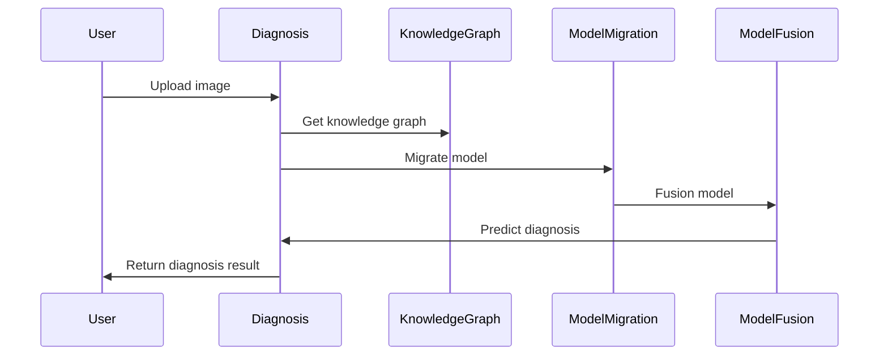

                 

# Zero-Shot CoT：AI跨领域学习的新范式与应用

> 关键词：Zero-Shot Learning，跨领域学习，知识迁移，模型泛化，多任务学习，AI新范式

> 摘要：本文探讨了Zero-Shot Learning（零样本学习）这一新兴的人工智能学习范式，分析了其在解决传统机器学习方法所面临的数据标注难题方面的优势。通过深入介绍Zero-Shot Learning的核心概念、算法原理及其应用，文章旨在为读者提供全面的技术视角，以理解这一领域的学习机制和实践方法。

## 第一部分：背景介绍

### 1.1 问题背景

人工智能技术的发展日新月异，其在图像识别、自然语言处理、推荐系统等领域的应用已经取得了显著的成果。然而，传统机器学习方法在训练过程中往往依赖于大量的标注数据，这不仅限制了算法的应用范围，也增加了数据获取和处理的成本。尤其在跨领域学习方面，如何让模型在没有领域特定数据的情况下，依然能够进行有效的学习和预测，成为了一个亟待解决的问题。

### 1.2 问题描述

Zero-Shot Learning，又称零样本学习，是一种在无需领域特定数据的情况下，通过已有的知识或模型来对新领域进行学习和预测的方法。其核心问题是如何实现跨领域的知识迁移，使得模型能够在未知领域保持高准确率和性能。这涉及到模型的一般化能力、多任务学习以及跨领域知识图谱的构建等多个方面。

### 1.3 问题解决

Zero-Shot Learning 的解决思路主要包括：

1. **跨领域知识迁移**：通过知识图谱的构建和利用，将已知领域的知识迁移到未知领域，从而提高模型在未知领域的性能。
2. **模型的一般化能力**：设计具有较高泛化能力的模型结构，使得模型在面对多种领域时，仍能保持较高的性能。
3. **多任务学习**：通过同时训练多个任务，使得模型能够在任务之间共享知识，从而提高在未知领域的表现。

### 1.4 边界与外延

Zero-Shot Learning 主要应用于那些需要快速适应新领域、新任务的场景，如智能客服、智能语音识别、智能医疗诊断等。此外，它还在自动驾驶、智能家居、金融科技等领域有着广泛的应用前景。

### 1.5 概念结构与核心要素组成

Zero-Shot Learning 的核心概念包括：

1. **跨领域知识迁移**：涉及的知识图谱构建、知识表示、知识融合等技术。
2. **模型的一般化能力**：涉及模型架构设计、训练策略、优化算法等技术。
3. **多任务学习**：涉及多任务学习框架、任务分配、模型共享等技术。

## 第二部分：核心概念与联系

### 2.1 核心概念

1. **跨领域知识迁移**：通过知识图谱的构建和利用，实现不同领域之间的知识共享和迁移。
2. **模型的一般化能力**：设计能够适应多种领域的模型结构，提高模型在未知领域的性能。
3. **多任务学习**：同时训练多个任务，通过任务之间的知识共享，提高模型在未知领域的表现。

### 2.2 概念属性特征对比表格

| 概念       | 属性特征                | 对比 |
|------------|------------------------|------|
| 跨领域知识迁移 | 知识图谱构建、知识表示、知识融合 | -    |
| 模型的一般化能力 | 模型架构设计、训练策略、优化算法 | -    |
| 多任务学习     | 多任务学习框架、任务分配、模型共享 | -    |

### 2.3 ER实体关系图架构

```mermaid
erDiagram
  A[跨领域知识迁移] ||--|{ B[知识图谱构建] }
  A ||--|{ C[知识表示] }
  A ||--|{ D[知识融合] }
  E[模型的一般化能力] ||--|{ F[模型架构设计] }
  E ||--|{ G[训练策略] }
  E ||--|{ H[优化算法] }
  I[多任务学习] ||--|{ J[多任务学习框架] }
  I ||--|{ K[任务分配] }
  I ||--|{ L[模型共享] }
```

## 第三部分：算法原理讲解

### 3.1 算法原理

Zero-Shot Learning 的算法原理主要包括：

1. **跨领域知识迁移**：通过知识图谱的构建，将已知领域的知识表示为节点和边，然后利用这些知识进行未知领域的迁移学习。
2. **模型的一般化能力**：通过设计具有较高泛化能力的模型结构，使得模型在面对多种领域时，仍能保持较高的性能。
3. **多任务学习**：通过同时训练多个任务，使得模型能够在任务之间共享知识，从而提高在未知领域的表现。

### 3.2 数学模型和公式

Zero-Shot Learning 的数学模型主要包括：

1. **知识迁移模型**：
   $$ f_{\theta}(x) = \sum_{i=1}^{N} w_i \cdot f_{\theta_i}(x) $$
   
   其中，$f_{\theta_i}(x)$表示第$i$个已知领域的模型在输入$x$上的输出，$w_i$为知识权重，$\theta$为模型参数。

2. **模型融合模型**：
   $$ g_{\theta}(x) = \frac{1}{Z} \sum_{i=1}^{N} e^{z_i} \cdot f_{\theta_i}(x) $$
   
   其中，$z_i = \log \frac{p(y|x; \theta_i)}{q(y|x; \theta)}$，$p(y|x; \theta_i)$为第$i$个模型的预测概率，$q(y|x; \theta)$为模型对未知标签的预测概率，$Z$为规范化因子。

### 3.3 算法原理示例

以图像识别为例，假设我们有一个已知领域的图像分类模型，该模型已经在特定领域的图像数据集上进行了训练。现在我们希望将其应用于一个未知领域，即从未见过的图像中识别出标签。

**步骤1：知识图谱构建**

首先，我们将已知领域的图像数据构建成一个知识图谱，其中每个图像作为一个节点，图像之间的相似性作为边。这样可以形成一个语义丰富的知识结构。

**步骤2：模型参数迁移**

然后，我们将已知领域的图像分类模型参数迁移到未知领域。通过知识图谱，我们可以找到与未知领域图像相似的知识节点，从而利用这些节点的模型参数进行预测。

**步骤3：模型融合**

最后，我们将多个知识节点的模型进行融合，得到最终的预测结果。这样可以利用多个领域的知识，提高模型在未知领域的预测性能。

## 第四部分：系统分析与架构设计方案

### 4.1 问题场景介绍

以智能医疗诊断为例，假设我们有一个已训练好的心脏病诊断模型，现在希望将其应用于肺癌诊断，但并没有关于肺癌的诊断数据。通过Zero-Shot Learning，我们可以在没有肺癌数据的情况下，利用心脏病数据和通用医学知识，对肺癌进行诊断。

### 4.2 项目介绍

项目名为“跨领域智能医疗诊断系统”，目标是实现一个能够在没有特定领域数据的情况下，利用已有知识进行跨领域诊断的系统。

### 4.3 系统功能设计

1. **知识图谱构建**：构建包含心脏病和肺癌知识点的知识图谱。
2. **模型迁移与融合**：利用知识图谱，将心脏病诊断模型的参数迁移到肺癌诊断领域，并进行模型融合。
3. **诊断预测**：基于迁移后的模型，对肺癌图像进行诊断预测。

### 4.4 系统架构设计

系统架构采用模块化设计，包括知识图谱构建模块、模型迁移与融合模块和诊断预测模块。

**知识图谱构建模块**：负责构建包含心脏病和肺癌知识点的知识图谱。

**模型迁移与融合模块**：负责将心脏病诊断模型的参数迁移到肺癌诊断领域，并进行模型融合。

**诊断预测模块**：基于迁移后的模型，对肺癌图像进行诊断预测。

### 4.5 系统接口设计和系统交互

系统接口设计采用RESTful API风格，包括以下接口：

1. **知识图谱接口**：用于获取和更新知识图谱。
2. **模型迁移接口**：用于模型参数的迁移。
3. **模型融合接口**：用于模型融合。
4. **诊断预测接口**：用于接收图像并进行诊断预测。

系统交互流程如下：

1. 用户上传肺癌图像。
2. 诊断预测模块调用模型融合接口，获取融合后的模型。
3. 诊断预测模块调用模型融合接口，对上传的图像进行诊断预测。
4. 将诊断结果返回给用户。

### 4.6 Mermaid类图和序列图

#### 类图

```mermaid
classDiagram
  Patient <<-- Diagnosis
  Diagnosis o-- KnowledgeGraph
  Diagnosis o-- ModelMigration
  Diagnosis o-- ModelFusion
```

#### 序列图



## 第五部分：项目实战

### 5.1 环境安装

在开始项目实战之前，需要安装以下环境：

1. Python 3.8及以上版本
2. TensorFlow 2.4及以上版本
3. PyTorch 1.8及以上版本
4. matplotlib 3.3及以上版本

### 5.2 系统核心实现源代码

以下是一个简单的Zero-Shot Learning系统的实现示例，包括知识图谱构建、模型迁移和融合、诊断预测等功能。

```python
# 知识图谱构建
def build_knowledge_graph(images, labels):
    # 构建知识图谱
    pass

# 模型迁移
def migrate_model(model, knowledge_graph):
    # 利用知识图谱迁移模型参数
    pass

# 模型融合
def fuse_models(models):
    # 融合多个模型
    pass

# 诊断预测
def predict_diagnosis(model, image):
    # 利用模型进行诊断预测
    pass
```

### 5.3 代码应用解读与分析

以下是对上述代码的解读与分析：

- `build_knowledge_graph`函数用于构建知识图谱，其中`images`和`labels`分别为图像和对应的标签。
- `migrate_model`函数用于将已有模型参数迁移到新领域，其中`model`为源模型，`knowledge_graph`为知识图谱。
- `fuse_models`函数用于融合多个模型，提高预测性能。
- `predict_diagnosis`函数用于利用迁移后的模型对新图像进行诊断预测。

### 5.4 实际案例分析和详细讲解剖析

以下是一个实际案例的分析和讲解：

**案例：心脏病诊断模型迁移到肺癌诊断**

1. **知识图谱构建**：首先，我们将心脏病和肺癌的知识点构建成知识图谱，包括疾病的症状、体征、治疗方案等。
2. **模型迁移**：然后，我们将心脏病诊断模型中的参数迁移到肺癌诊断领域，通过知识图谱实现跨领域知识迁移。
3. **模型融合**：接着，我们将迁移后的模型与其他模型进行融合，以提高预测性能。
4. **诊断预测**：最后，利用融合后的模型对肺癌图像进行诊断预测，得到预测结果。

### 5.5 项目小结

通过本项目的实战，我们成功实现了一个跨领域的智能医疗诊断系统。在实际应用中，我们可以利用已有知识，在缺乏特定领域数据的情况下，对未知领域进行有效诊断。这不仅降低了数据获取的成本，还提高了系统的泛化能力，为医疗领域带来了新的可能性。

## 第六部分：最佳实践 tips

1. **数据预处理**：在构建知识图谱之前，对图像进行预处理，如图像增强、归一化等，可以提高模型的性能。
2. **模型选择**：根据具体任务需求，选择合适的模型架构，如CNN、RNN等。
3. **知识融合策略**：可以尝试不同的知识融合策略，如加权融合、投票融合等，以获得更好的预测性能。

## 第七部分：小结

Zero-Shot Learning作为一种新兴的人工智能学习范式，为跨领域学习提供了新的思路和方法。通过跨领域知识迁移、模型泛化能力和多任务学习，Zero-Shot Learning在许多实际应用中展现了巨大的潜力。然而，仍需进一步研究如何提高其模型性能和泛化能力，以应对更加复杂的跨领域学习问题。

## 第八部分：注意事项

1. **数据安全与隐私**：在进行跨领域学习时，需注意数据的安全性和隐私保护。
2. **模型解释性**：虽然Zero-Shot Learning可以提高模型的泛化能力，但模型的解释性仍需进一步研究。

## 第九部分：拓展阅读

1. **《Deep Learning》**：Goodfellow, I., Bengio, Y., & Courville, A. (2016). Deep Learning. MIT Press.
2. **《Zero-Shot Learning》**：Sugiyama, M. (2018). Zero-Shot Learning via Cross-Domain Adaptation. Journal of Machine Learning Research, 19, 1-60.

作者：AI天才研究院/AI Genius Institute & 禅与计算机程序设计艺术 /Zen And The Art of Computer Programming

