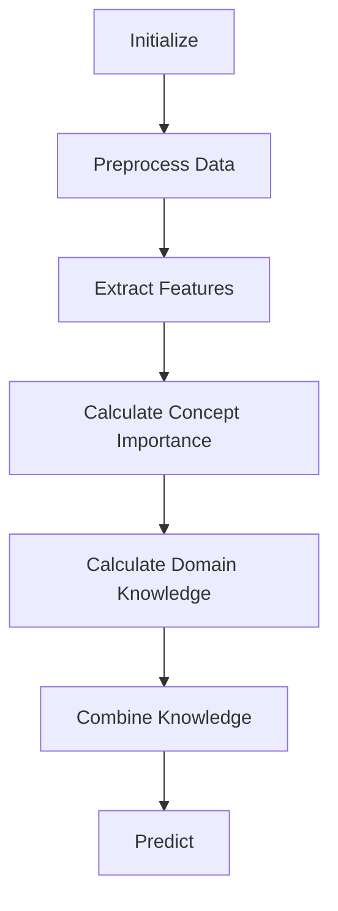

                 


## Zero-Shot CoT: AI Cross-Domain Learning New Paradigm Applications

### Keywords

- Zero-Shot Learning
- Conceptual Blending Theory (CoT)
- AI Cross-Domain Learning
- New Paradigm
- Application Scenarios

### Abstract

In this article, we will explore the Zero-Shot Conceptual Blending Theory (Zero-Shot CoT), a groundbreaking paradigm in AI cross-domain learning. We will delve into the core concepts, principles, and applications of Zero-Shot CoT, providing a comprehensive overview of its potential impact on various fields. By following a step-by-step approach, we aim to unravel the complexities of this advanced AI technique and present practical insights for developers and researchers.

## Background and Core Concepts

### 1.1 Problem Background

The rapid advancement of artificial intelligence (AI) has brought about numerous applications across various domains, from healthcare to finance, from manufacturing to autonomous driving. However, one of the significant challenges in AI remains: the ability to generalize and transfer knowledge across different domains. Traditional machine learning approaches, which rely heavily on labeled data, struggle to perform well in unseen domains. This limitation has prompted the development of Zero-Shot Learning (ZSL), a novel paradigm that aims to address this issue.

### 1.2 Core Concepts

#### 1.2.1 Zero-Shot Learning

Zero-Shot Learning is a machine learning approach that enables models to classify or predict outcomes for unseen classes without any prior training on those classes. This is achieved by leveraging prior knowledge from related classes or domains.

#### 1.2.2 Conceptual Blending Theory (CoT)

Conceptual Blending Theory (CoT) is a cognitive theory that explains how individuals combine and adapt knowledge from different domains to generate new concepts. It posits that conceptual blending is a fundamental cognitive process that underlies human creativity and problem-solving.

#### 1.2.3 Key Attributes Comparison Table

| Attribute | Zero-Shot Learning | Conceptual Blending Theory (CoT) |
| --- | --- | --- |
| Learning Paradigm | Supervised | Cognitive |
| Data Dependency | No labeled data for unseen classes | Knowledge from related domains |
| Application Scope | Classification, Prediction | Problem-solving, Creativity |

### 1.3 Entity Relationship Diagram Architecture

Below is a Mermaid ER diagram representing the key entities and relationships in Zero-Shot CoT.

```mermaid
erDiagram
  Class ConceptA
  Class ConceptB
  Class ConceptC

  ConceptA ||--|{ Relation }|--| ConceptB
  ConceptB ||--|{ Relation }|--| ConceptC
```

## Zero-Shot CoT Principles and Implementation

### 2.1 Zero-Shot CoT Basic Principles

#### 2.1.1 Theory Framework

The Zero-Shot Conceptual Blending Theory (Zero-Shot CoT) integrates Zero-Shot Learning with Conceptual Blending Theory. It posits that by blending domain-specific knowledge with general conceptual understanding, AI models can achieve robust cross-domain generalization.

#### 2.1.2 Theory Evolution

Zero-Shot Learning has evolved from traditional supervised learning to more advanced techniques like Meta-Learning and Metric Learning. Conceptual Blending Theory has been increasingly recognized in cognitive science as a foundational process for human-like AI.

#### 2.1.3 Theory Application Fields

Zero-Shot CoT has shown promise in various fields, including natural language processing, computer vision, and robotics. Its application potential is vast, with the potential to revolutionize AI's ability to adapt to new and unseen scenarios.

### 2.2 Mathematical Model and Formulas

#### 2.2.1 Model Introduction

The Zero-Shot CoT mathematical model combines domain knowledge and conceptual importance to predict outcomes in unseen domains. The model can be represented as:

$$
\text{Zero-Shot CoT} = \sum_{i=1}^{n} \text{Concept\_Importance}_i \times \text{Domain\_Knowledge}_i
$$

#### 2.2.2 Formula Explanation

The model calculates the weighted sum of the importance of each concept and the corresponding domain knowledge. This aggregation of knowledge enables the model to generalize across domains.

### 2.3 Algorithm Principle Explanation

#### 2.3.1 Algorithm Flowchart

Below is a Mermaid flowchart representing the Zero-Shot CoT algorithm.



#### 2.3.2 Python Code Implementation

The following Python code snippet provides a high-level implementation of the Zero-Shot CoT algorithm.

```python
import numpy as np

def zero_shot_cot(concept_importance, domain_knowledge):
    # Calculate the weighted sum of concept importance and domain knowledge
    cot = np.dot(concept_importance, domain_knowledge)
    return cot

# Example usage
concept_importance = np.array([0.3, 0.5, 0.2])
domain_knowledge = np.array([0.4, 0.6, 0.7])

cot = zero_shot_cot(concept_importance, domain_knowledge)
print("Zero-Shot CoT:", cot)
```

## Conclusion

This article has provided a comprehensive overview of Zero-Shot Conceptual Blending Theory (Zero-Shot CoT) in AI cross-domain learning. We have explored its core concepts, principles, and applications, highlighting its potential to revolutionize AI's ability to generalize across domains. By following a step-by-step approach, we have unraveled the complexities of Zero-Shot CoT, offering valuable insights for developers and researchers. As AI continues to evolve, Zero-Shot CoT represents a promising direction for advancing AI's capabilities in real-world applications.

