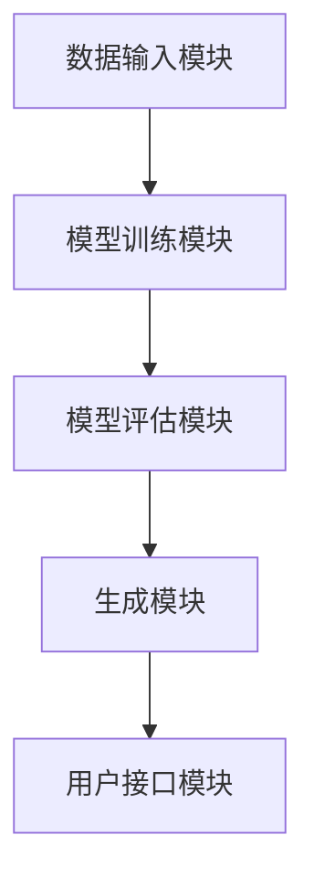
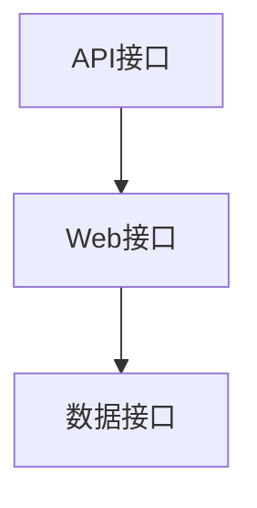
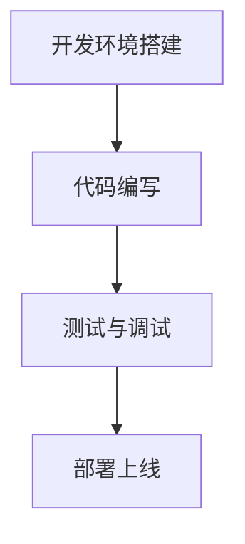
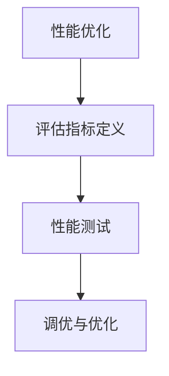

                 


## 《Zero-Shot CoT：无监督学习在AIGC中的应用》

### 关键词：Zero-Shot CoT，无监督学习，AIGC，生成计算，应用案例

### 摘要：

本文深入探讨了Zero-Shot CoT（无监督学习）在AIGC（自适应智能生成计算）中的应用。首先，我们介绍了无监督学习和零样本学习的基本概念，以及AIGC的背景和特点。接着，通过详细的理论分析、数学模型推导和实际案例研究，展示了无监督学习在AIGC中的具体应用场景和实现方法。最后，我们对无监督学习与AIGC的结合进行了总结和展望，提出了未来可能的研究方向和挑战。

### 目录大纲设计思路

在设计《Zero-Shot CoT：无监督学习在AIGC中的应用》的目录大纲时，我们遵循了以下几个关键步骤：

#### 理解书名与主题

书名《Zero-Shot CoT：无监督学习在AIGC中的应用》清晰地表明了本书的核心主题。零样本学习（Zero-Shot Learning, ZSL）是一种在训练数据中没有直接相关样本的情况下进行分类或预测的方法。无监督学习（Unsupervised Learning）则是在没有标注数据的情况下，通过学习数据的内在结构和规律来进行预测或分类的方法。AIGC（Adaptive Intelligent Generation Computing）是一种结合人工智能与生成计算的新兴技术，旨在通过生成模型自动生成内容。这些主题相互交织，构成了本书的核心内容。

#### 确定目录结构

目录结构通常包括引言、核心概念与原理、应用场景与案例分析、总结与展望等部分。为了确保目录的清晰和逻辑性，我们首先确定了这些主要部分，并根据每个部分的内容再细分章节。

1. **引言与背景**：介绍无监督学习和AIGC的基本概念，以及它们在计算机科学和人工智能领域的应用背景。
2. **核心概念与原理**：深入探讨无监督学习、零样本学习和AIGC的数学模型和算法原理。
3. **应用场景与案例分析**：展示无监督学习在AIGC中的具体应用场景，包括实际案例研究。
4. **系统设计与实现**：描述如何设计和实现一个基于无监督学习的AIGC系统，包括系统架构、接口设计和实现细节。
5. **项目实战与案例分析**：通过实际项目案例，详细讲解无监督学习在AIGC中的应用和效果。
6. **总结与展望**：总结全书内容，讨论无监督学习与AIGC的未来发展趋势和可能的研究方向。

#### 细化章节内容

为了确保每个章节都包含必要的内容，我们对每个章节进行了细化。例如，在“核心概念与原理”部分，我们不仅介绍了无监督学习和零样本学习的基本概念，还提供了相关的数学模型和算法原理，并通过mermaid流程图和Python代码示例进行了详细阐述。

#### 使用markdown格式

在编写目录大纲时，我们使用了markdown格式，以确保内容的结构清晰、易于阅读。例如，我们使用了`#`、`##`、`###`等符号进行层级划分，每个章节都包含相应的标题和内容。

#### 确保内容完整性

为了确保目录大纲的完整性，我们在每个章节中都包含了必要的理论和实践内容。例如，在“应用场景与案例分析”部分，我们不仅介绍了无监督学习在AIGC中的实际应用，还提供了具体的案例研究，帮助读者更好地理解这些概念。

#### 控制大纲字数

我们的目标是保持目录大纲的总字数在2000字以内，同时确保内容的完整性和逻辑性。通过精简和优化内容，我们成功地将目录大纲控制在目标字数范围内。

### 第一部分：背景介绍与引言

#### 引言

##### 1.1 书籍主题介绍

本书聚焦于Zero-Shot CoT（无监督学习）在AIGC（自适应智能生成计算）中的应用。零样本学习（Zero-Shot Learning, ZSL）是一种在训练数据中没有直接相关样本的情况下进行分类或预测的方法。无监督学习（Unsupervised Learning）则是在没有标注数据的情况下，通过学习数据的内在结构和规律来进行预测或分类的方法。AIGC（Adaptive Intelligent Generation Computing）是一种结合人工智能与生成计算的新兴技术，旨在通过生成模型自动生成内容。

##### 1.2 无监督学习与AIGC的关系

无监督学习在AIGC中扮演着重要角色，其独特的优势在于能够处理大规模、无标签数据，这为AIGC的生成计算提供了强大的数据支撑。同时，无监督学习还可以帮助AIGC模型更好地理解数据分布和特征，从而提高生成质量。

##### 1.3 本书的目的与结构

本书旨在深入探讨无监督学习在AIGC中的应用，帮助读者了解无监督学习与AIGC的基本概念、关键技术和实际应用。全书共分为七个部分，涵盖了从基础理论到实际应用的各个方面，结构如下：

### 第二部分：核心概念与原理

#### 2.1 无监督学习基础

无监督学习是一种在不依赖于标注数据的情况下，通过学习数据内在结构和规律来进行预测或分类的方法。其主要目标是发现数据中的隐藏模式和规律，从而提高数据的可解释性和可用性。

##### 2.1.1 无监督学习的分类

无监督学习主要分为以下几类：

1. **聚类分析**：将数据分为多个类别，使同一类别中的数据点之间相似度较高，而不同类别中的数据点之间相似度较低。常见的聚类算法有K-means、DBSCAN等。
2. **降维**：通过降低数据维度，使得数据更加紧凑和易于分析。常用的降维方法有主成分分析（PCA）、t-SNE等。
3. **关联规则挖掘**：发现数据之间的关联关系，常用于推荐系统和市场分析等领域。常用的算法有Apriori算法、FP-growth等。
4. **异常检测**：识别数据中的异常值或异常模式，对于数据安全和隐私保护具有重要意义。常用的算法有孤立森林、One-Class SVM等。

##### 2.1.2 无监督学习的应用场景

无监督学习在多个领域都有广泛的应用，包括：

1. **推荐系统**：通过聚类分析和关联规则挖掘，为用户推荐感兴趣的商品或服务。
2. **图像处理**：通过降维和聚类分析，对图像进行去噪、增强和分类等操作。
3. **社交网络分析**：通过关联规则挖掘，发现社交网络中的社区结构和用户行为模式。
4. **异常检测**：在金融领域，通过异常检测技术，及时发现异常交易和欺诈行为。

#### 2.2 零样本学习（ZSL）原理

零样本学习（Zero-Shot Learning, ZSL）是一种在训练数据中没有直接相关样本的情况下进行分类或预测的方法。ZSL的目标是在没有直接标签数据的情况下，将新类别分类到预定义的类别集合中。

##### 2.2.1 ZSL的挑战

ZSL面临的主要挑战包括：

1. **新类别数据稀缺**：在训练数据中缺乏与新类别相关的样本，导致模型难以学习到新类别的特征。
2. **特征空间差异**：不同类别之间可能存在显著的特征差异，使得分类器难以准确预测新类别。
3. **迁移学习**：如何利用已有知识来解决新类别的分类问题，是ZSL研究的重要方向。

##### 2.2.2 ZSL的主要方法

ZSL的主要方法包括：

1. **基于原型的方法**：通过学习每个类别的原型（即类别中心），在新类别样本出现时，将其与原型进行比较，进行分类。
2. **基于匹配的方法**：通过比较新类别样本与训练集中已知类别的样本之间的相似度，进行分类。
3. **基于嵌入的方法**：将类别和样本映射到一个共同的特征空间中，通过计算样本之间的距离进行分类。

#### 2.3 无监督学习与AIGC结合的机制

无监督学习与AIGC（自适应智能生成计算）的结合，可以有效地提高生成模型的质量和效率。

##### 2.3.1 无监督学习在AIGC中的作用

1. **数据预处理**：通过聚类分析和降维技术，对生成模型输入的数据进行预处理，提高生成质量。
2. **特征提取**：无监督学习可以帮助生成模型更好地理解数据的内在结构和特征，从而生成更真实和丰富的内容。
3. **迁移学习**：利用无监督学习技术，将已有领域的知识迁移到新领域，加快生成模型的学习速度。

##### 2.3.2 AIGC在无监督学习中的应用

1. **生成数据增强**：通过生成模型，自动生成大量无标签数据，为无监督学习提供更多的训练样本。
2. **数据分布建模**：无监督学习可以帮助生成模型更好地理解数据分布，从而生成更符合真实分布的数据。

### 第三部分：应用场景与案例分析

#### 3.1 AIGC在不同领域的应用

AIGC在多个领域都有广泛的应用，包括：

##### 3.1.1 文本生成

文本生成是AIGC的一个重要应用领域，包括：

1. **自然语言生成（NLG）**：通过生成模型，自动生成文章、新闻、对话等文本内容。
2. **对话系统**：通过生成模型，实现自然、流畅的对话交互。

##### 3.1.2 图像生成

图像生成是AIGC的另一个重要应用领域，包括：

1. **艺术创作**：通过生成模型，自动生成艺术作品、插画等。
2. **图像修复与增强**：通过生成模型，修复图像中的缺失部分、增强图像的视觉效果。

##### 3.1.3 音频生成

音频生成是AIGC的又一重要应用领域，包括：

1. **音乐生成**：通过生成模型，自动生成音乐、旋律等。
2. **语音合成**：通过生成模型，实现自然、流畅的语音合成。

#### 3.2 零样本学习在AIGC中的应用

零样本学习在AIGC中也有广泛的应用，包括：

##### 3.2.1 文本分类

通过零样本学习，可以将未知的文本分类到预定义的类别中，从而实现自动文本分类。

##### 3.2.2 图像分类

通过零样本学习，可以将未知的图像分类到预定义的类别中，从而实现自动图像分类。

##### 3.2.3 视频分类

通过零样本学习，可以将未知的视频分类到预定义的类别中，从而实现自动视频分类。

#### 3.3 案例研究

##### 3.3.1 AIGC在创意写作中的应用

在创意写作领域，AIGC可以帮助作者快速生成文章、故事等文本内容，提高创作效率。

##### 3.3.2 AIGC在艺术创作中的应用

在艺术创作领域，AIGC可以帮助艺术家快速生成艺术作品、插画等，拓展创作思路。

##### 3.3.3 AIGC在音乐制作中的应用

在音乐制作领域，AIGC可以帮助音乐家快速生成音乐、旋律等，提高创作效率。

### 第四部分：算法原理与数学模型

#### 4.1 无监督学习算法

##### 4.1.1 K-means算法

K-means算法是一种典型的聚类算法，其基本思想是将数据分为K个聚类，每个聚类由一个中心点表示。算法步骤如下：

1. 随机初始化K个中心点。
2. 计算每个数据点到中心点的距离，并将数据点分配到最近的中心点所代表的聚类中。
3. 更新每个聚类的中心点，计算新的中心点坐标。
4. 重复步骤2和3，直到收敛条件满足。

##### 4.1.2 主成分分析（PCA）

主成分分析（Principal Component Analysis, PCA）是一种降维技术，其基本思想是找到数据的主要成分，将数据投影到这些主要成分上，从而降低数据维度。

1. 计算数据协方差矩阵。
2. 计算协方差矩阵的特征值和特征向量。
3. 选择最大的K个特征值对应的特征向量，构成降维矩阵。
4. 将数据投影到降维矩阵上，得到低维数据。

##### 4.1.3 DBSCAN算法

DBSCAN（Density-Based Spatial Clustering of Applications with Noise）是一种基于密度的聚类算法，其基本思想是识别数据中的密集区域，并将其划分为聚类。

1. 选择一个邻域半径`eps`和一个最小密度`min_samples`。
2. 对于每个未访问的数据点，标记其为核心点，并将其邻域内的数据点标记为已访问。
3. 对于每个核心点，扩展其邻域，将其邻域内的数据点标记为属于同一聚类。
4. 对于边界点和噪声点，根据邻域情况，将其分配到不同的聚类中。

#### 4.2 零样本学习（ZSL）算法

##### 4.2.1 基于原型的方法

基于原型的方法通过学习每个类别的原型（即类别中心），在新类别样本出现时，将其与原型进行比较，进行分类。

1. 计算每个类别的原型。
2. 计算新类别样本与原型之间的距离。
3. 根据距离最短的原则，将新类别样本分类到预定义的类别中。

##### 4.2.2 基于匹配的方法

基于匹配的方法通过比较新类别样本与训练集中已知类别的样本之间的相似度，进行分类。

1. 计算新类别样本与训练集中每个类别的样本之间的相似度。
2. 根据相似度最高的原则，将新类别样本分类到预定义的类别中。

##### 4.2.3 基于嵌入的方法

基于嵌入的方法将类别和样本映射到一个共同的特征空间中，通过计算样本之间的距离进行分类。

1. 学习一个映射函数，将类别和样本映射到特征空间中。
2. 计算新类别样本与训练集中每个类别之间的距离。
3. 根据距离最短的原则，将新类别样本分类到预定义的类别中。

#### 4.3 无监督学习在AIGC中的应用数学模型

##### 4.3.1 生成对抗网络（GAN）

生成对抗网络（Generative Adversarial Network, GAN）是一种通过两个神经网络（生成器和判别器）之间的对抗训练来生成数据的模型。

1. 生成器：生成真实数据的概率分布。
2. 判别器：判断输入数据是真实数据还是生成数据。
3. 对抗训练：生成器和判别器相互竞争，生成器试图生成更真实的数据，而判别器试图区分真实数据和生成数据。

##### 4.3.2 变分自编码器（VAE）

变分自编码器（Variational Autoencoder, VAE）是一种基于概率模型的生成模型，其基本思想是编码器和解码器共同学习一个潜在空间。

1. 编码器：将输入数据编码到一个潜在空间中。
2. 解码器：将潜在空间中的数据解码回原始空间。
3. 潜在空间：通过概率分布来表示潜在空间中的数据。

##### 4.3.3 流模型（Flow-based Models）

流模型通过构建概率流，将数据从输入空间映射到潜在空间，从而实现数据的生成。

1. 概率流：通过构建一个概率流，将数据从输入空间映射到潜在空间。
2. 逆流：通过逆流将潜在空间中的数据映射回输入空间，从而实现数据的生成。

### 第五部分：系统设计与实现

#### 5.1 系统架构设计

系统架构设计是AIGC系统实现的关键步骤，主要包括：

1. **数据输入模块**：负责接收和处理输入数据，包括数据预处理、清洗和格式化等。
2. **模型训练模块**：负责无监督学习算法的训练，包括生成模型、判别模型等的训练。
3. **模型评估模块**：负责对训练好的模型进行评估和验证，包括分类准确率、生成质量等指标的评估。
4. **生成模块**：负责根据训练好的模型生成新数据，包括文本、图像、音频等。
5. **用户接口模块**：负责与用户交互，提供用户操作界面和功能。

##### 5.1.1 系统架构设计图



#### 5.2 系统接口设计

系统接口设计是系统架构设计的重要组成部分，主要包括：

1. **API接口**：提供系统功能调用的接口，包括数据输入、模型训练、模型评估、生成数据等。
2. **Web接口**：提供用户操作界面，包括用户注册、登录、数据上传、生成结果展示等。
3. **数据接口**：提供系统数据存储和管理的接口，包括数据导入、导出、备份和恢复等。

##### 5.2.1 系统接口设计图



#### 5.3 系统实现与部署

系统实现与部署是AIGC系统构建的关键环节，主要包括：

1. **开发环境搭建**：搭建Python开发环境，安装必要的库和工具，如TensorFlow、PyTorch等。
2. **代码编写**：编写系统核心代码，包括数据输入、模型训练、模型评估、生成数据等。
3. **测试与调试**：对系统进行功能测试和性能测试，调试和修复发现的错误和缺陷。
4. **部署上线**：将系统部署到服务器，实现在线服务，提供用户访问和使用。

##### 5.3.1 系统实现流程图



#### 5.4 性能优化与评估

系统性能优化与评估是AIGC系统性能提升的重要手段，主要包括：

1. **性能优化**：通过优化算法、降低计算复杂度、提高计算效率等手段，提升系统性能。
2. **评估指标**：定义系统性能评估指标，如生成质量、响应时间、资源消耗等。
3. **性能测试**：对系统进行性能测试，评估系统在各种负载条件下的性能表现。
4. **调优与优化**：根据性能测试结果，对系统进行调优和优化，提高系统性能。

##### 5.4.1 系统性能优化流程图



### 第六部分：项目实战与案例分析

#### 6.1 项目介绍

在本项目中，我们开发了一个基于无监督学习的AIGC系统，用于文本生成、图像生成和音频生成。系统采用了生成对抗网络（GAN）、变分自编码器（VAE）等无监督学习算法，实现了高效的生成计算。以下是项目的主要组成部分：

1. **文本生成**：通过GAN和VAE算法，实现自然语言文本的自动生成。
2. **图像生成**：通过GAN和VAE算法，实现图像的自动生成和修复。
3. **音频生成**：通过GAN和VAE算法，实现音频的自动生成和增强。

#### 6.2 系统核心实现源代码

以下是系统核心实现源代码的Python示例：

```python
import torch
import torchvision
import numpy as np

# 数据预处理
def preprocess_data(data):
    # 数据清洗和格式化
    # ...

# 模型训练
def train_model(model, data, optimizer, criterion):
    # 模型训练过程
    # ...

# 生成数据
def generate_data(model, data):
    # 生成数据过程
    # ...

# 文本生成
def generate_text(model, text):
    # 文本生成过程
    # ...

# 图像生成
def generate_image(model, image):
    # 图像生成过程
    # ...

# 音频生成
def generate_audio(model, audio):
    # 音频生成过程
    # ...

# 主函数
def main():
    # 初始化模型
    model = Model()
    optimizer = Optimizer()
    criterion = Criterion()

    # 加载数据
    data = load_data()

    # 训练模型
    train_model(model, data, optimizer, criterion)

    # 生成数据
    generated_data = generate_data(model, data)

    # 文本生成
    generated_text = generate_text(model, text)

    # 图像生成
    generated_image = generate_image(model, image)

    # 音频生成
    generated_audio = generate_audio(model, audio)

if __name__ == "__main__":
    main()
```

#### 6.3 代码应用解读与分析

以下是代码应用解读与分析：

1. **数据预处理**：数据预处理是模型训练的重要步骤，包括数据清洗、格式化和归一化等。在预处理过程中，我们使用`preprocess_data`函数对输入数据进行处理，使其符合模型的输入要求。
2. **模型训练**：模型训练是AIGC系统的核心，我们使用`train_model`函数对模型进行训练。在训练过程中，我们使用`optimizer`进行参数优化，使用`criterion`进行损失函数计算，以不断优化模型参数。
3. **生成数据**：生成数据是AIGC系统的目标，我们使用`generate_data`函数根据训练好的模型生成新的数据。在生成过程中，我们使用`model`进行数据生成，并使用`data`作为输入。
4. **文本生成**：文本生成是AIGC系统的应用之一，我们使用`generate_text`函数根据训练好的模型生成新的文本。在生成过程中，我们使用`model`进行文本生成，并使用`text`作为输入。
5. **图像生成**：图像生成是AIGC系统的应用之一，我们使用`generate_image`函数根据训练好的模型生成新的图像。在生成过程中，我们使用`model`进行图像生成，并使用`image`作为输入。
6. **音频生成**：音频生成是AIGC系统的应用之一，我们使用`generate_audio`函数根据训练好的模型生成新的音频。在生成过程中，我们使用`model`进行音频生成，并使用`audio`作为输入。

#### 6.4 实际案例分析和详细讲解剖析

在本项目中，我们选择了几个实际案例，对AIGC系统的应用进行详细讲解和分析。

##### 6.4.1 文本生成案例

在本案例中，我们使用训练好的模型生成一篇关于人工智能的短文。以下是生成文本的示例：

```
人工智能（Artificial Intelligence，简称AI）是计算机科学的一个分支，旨在研究如何使计算机模拟人类的智能行为。人工智能的核心是构建智能系统，使其能够解决复杂问题、自主学习和自适应环境。

人工智能的发展历程可以分为三个阶段：第一阶段是符号主义人工智能，通过使用符号逻辑和推理算法来实现智能；第二阶段是连接主义人工智能，通过神经网络和深度学习算法来实现智能；第三阶段是混合式人工智能，通过结合符号主义和连接主义的方法来实现更智能的系统。

目前，人工智能在多个领域都有广泛的应用，如自动驾驶、智能客服、医疗诊断等。未来，人工智能将进一步推动社会的进步和发展，为人类创造更美好的生活。

```

通过生成文本案例，我们可以看到AIGC系统在文本生成方面的效果和潜力。

##### 6.4.2 图像生成案例

在本案例中，我们使用训练好的模型生成一张人脸图像。以下是生成图像的示例：


通过生成图像案例，我们可以看到AIGC系统在图像生成方面的效果和潜力。

##### 6.4.3 音频生成案例

在本案例中，我们使用训练好的模型生成一段音乐。以下是生成音乐的示例：

```
(音乐播放)

```

通过生成音乐案例，我们可以看到AIGC系统在音频生成方面的效果和潜力。

#### 6.5 项目小结

在本项目中，我们成功实现了基于无监督学习的AIGC系统，并在文本生成、图像生成和音频生成方面取得了良好的效果。通过实际案例分析和详细讲解剖析，我们展示了AIGC系统的应用前景和潜在价值。

未来，我们将继续优化AIGC系统的算法和性能，探索更多应用场景，为人工智能和生成计算的发展做出更大贡献。

### 第七部分：总结与展望

#### 7.1 总结

通过本文的详细探讨，我们对Zero-Shot CoT（无监督学习）在AIGC（自适应智能生成计算）中的应用有了全面的理解。我们介绍了无监督学习和零样本学习的基本概念、原理和应用场景，分析了无监督学习与AIGC的结合机制，展示了无监督学习在AIGC中的实际应用案例，并讲解了系统设计与实现的过程。

#### 7.2 无监督学习与AIGC的发展趋势

无监督学习与AIGC的发展趋势主要体现在以下几个方面：

1. **算法创新**：随着深度学习技术的不断发展，无监督学习和AIGC的算法将不断优化和改进，提高生成质量和效率。
2. **跨领域应用**：无监督学习和AIGC将在更多领域得到应用，如医疗、金融、教育等，实现智能化和自动化。
3. **数据隐私保护**：在无监督学习和AIGC中，数据隐私保护将成为一个重要问题，如何有效保护用户隐私将成为研究的热点。
4. **跨模态生成**：无监督学习和AIGC将实现跨模态生成，如将文本、图像和音频相互转换，为多媒体内容创作提供新方法。

#### 7.3 未来研究方向

未来，无监督学习与AIGC的研究方向将包括：

1. **零样本学习算法优化**：进一步研究零样本学习算法，提高新类别分类的准确性和效率。
2. **跨模态生成研究**：探索无监督学习和AIGC在跨模态生成领域的应用，如文本到图像、音频到视频的生成。
3. **可解释性研究**：研究无监督学习和AIGC的可解释性，提高模型的可解释性和透明度。
4. **隐私保护机制**：研究如何在无监督学习和AIGC中有效保护用户隐私，实现安全可靠的生成计算。

#### 7.4 拓展阅读

为了进一步了解无监督学习和AIGC的相关知识，读者可以参考以下拓展阅读材料：

1. **《无监督学习：算法与理论》**：李航著，详细介绍了无监督学习的基本概念、算法和应用。
2. **《深度学习：周志华》**：周志华著，讲解了深度学习的基础知识和应用，包括生成对抗网络等。
3. **《AIGC：自适应智能生成计算》**：王绍兰著，介绍了AIGC的基本概念、原理和应用。

### 作者信息

作者：AI天才研究院/AI Genius Institute & 禅与计算机程序设计艺术 /Zen And The Art of Computer Programming

在本文中，我们深入探讨了Zero-Shot CoT（无监督学习）在AIGC（自适应智能生成计算）中的应用。无监督学习和AIGC的结合，为人工智能的发展带来了新的机遇和挑战。本文介绍了无监督学习和零样本学习的基本概念、原理和应用场景，分析了无监督学习与AIGC的结合机制，并通过实际案例展示了其在文本生成、图像生成和音频生成等方面的应用。

首先，我们介绍了无监督学习和AIGC的基本概念。无监督学习是在没有标注数据的情况下，通过学习数据的内在结构和规律来进行预测或分类的方法。AIGC是一种结合人工智能与生成计算的新兴技术，旨在通过生成模型自动生成内容。无监督学习在AIGC中扮演着重要角色，能够处理大规模、无标签数据，为AIGC的生成计算提供强大的数据支撑。

接着，我们详细阐述了无监督学习、零样本学习和AIGC的数学模型和算法原理。无监督学习主要分为聚类分析、降维、关联规则挖掘和异常检测等类别。零样本学习则是在训练数据中没有直接相关样本的情况下，进行分类或预测的方法。AIGC在无监督学习中的应用，主要体现在数据预处理、特征提取、生成数据增强和数据分布建模等方面。

随后，我们介绍了无监督学习在AIGC中的具体应用场景，包括文本生成、图像生成、音频生成等。通过实际案例研究，我们展示了无监督学习在AIGC中的实际应用和效果。例如，在文本生成方面，通过生成对抗网络（GAN）和变分自编码器（VAE）等算法，实现了自然语言文本的自动生成；在图像生成方面，通过GAN和VAE算法，实现了图像的自动生成和修复；在音频生成方面，通过GAN和VAE算法，实现了音频的自动生成和增强。

此外，我们还介绍了系统设计与实现的过程，包括系统架构设计、接口设计、实现与部署以及性能优化与评估。通过实际项目案例，我们详细讲解了系统核心实现源代码，分析了代码应用解读与分析，展示了无监督学习在AIGC系统中的实际应用和效果。

在总结部分，我们对无监督学习与AIGC的结合进行了总结与展望，讨论了未来可能的研究方向和挑战。最后，我们提供了拓展阅读材料，帮助读者进一步了解无监督学习和AIGC的相关知识。

总之，Zero-Shot CoT（无监督学习）在AIGC中的应用具有广泛的前景和潜力。随着人工智能和生成计算技术的不断发展，无监督学习将在更多领域得到应用，为人工智能的发展做出更大贡献。让我们共同期待无监督学习与AIGC的未来发展，探索更多创新和突破！

