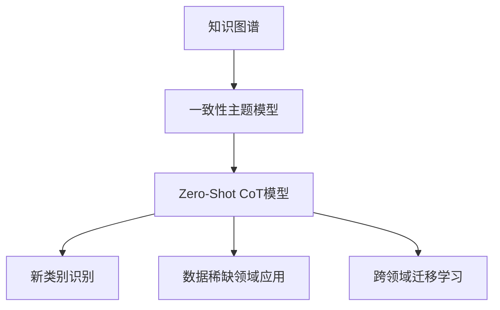
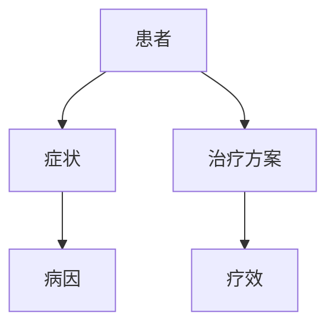
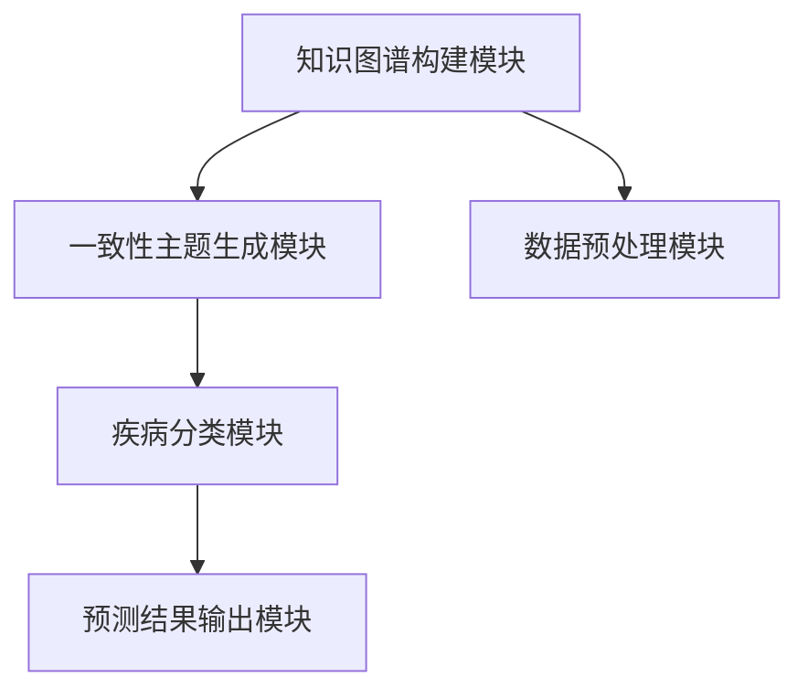
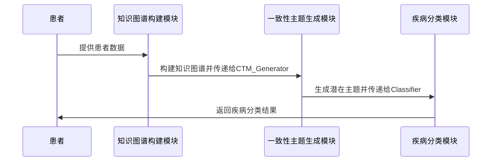

                 

# Zero-Shot CoT：无需大量训练数据的AI学习方法

## 关键词
- 零样本学习
- 知识图谱
- 一致性主题模型
- AI模型训练
- 跨领域迁移学习

## 摘要
本文探讨了Zero-Shot CoT（Coherent Topic）方法，一种无需大量训练数据的AI学习方法。通过结合知识图谱和一致性主题模型，该方法在数据稀缺或新类别识别等任务中表现出色，实现了高效的零样本学习。本文将从背景介绍、核心概念、方法原理、系统分析与架构设计、项目实战及最佳实践等方面全面解析Zero-Shot CoT方法。

### Step 1: 背景介绍

#### 问题背景
在当今快速发展的技术时代，人工智能（AI）技术正逐渐从理论研究走向实际应用。传统的AI方法通常依赖于大规模的数据集进行训练，这不仅在数据收集和处理上耗费大量资源，而且在实际应用中往往存在数据不足的问题。

#### 问题描述
随着AI技术的不断进步，尤其是生成对抗网络（GANs）、变分自编码器（VAEs）等零样本学习（Zero-Shot Learning, ZSL）技术的发展，如何实现无需大量训练数据的AI学习方法成为一个重要研究方向。然而，现有方法在零样本学习任务中的性能仍然受限，无法满足实际应用的需求。

#### 问题解决
Zero-Shot CoT（Coherent Topic）方法应运而生，通过引入一致性主题模型，实现了无需大规模数据训练的AI学习方法。这种方法的核心思想是将AI任务与知识图谱相结合，从而在少量数据甚至零数据的情况下，实现高质量的AI模型训练。

#### 边界与外延
Zero-Shot CoT方法主要适用于以下场景：

- **新类别识别**：当模型遇到未见过的类别时，仍能准确识别和分类。
- **数据稀缺领域**：在数据稀缺的领域，如医疗诊断、生物信息学等，该方法可以有效地降低数据依赖。
- **跨领域迁移学习**：Zero-Shot CoT方法可以实现跨不同领域的迁移学习，提高模型的泛化能力。

### 核心概念

#### 定义
Zero-Shot CoT是一种AI学习方法，它利用一致性主题模型，无需大规模数据训练即可实现高质量的模型训练。

#### 特点
- **无需大规模数据**：通过知识图谱和一致性主题模型，实现零样本学习。
- **跨领域适用性**：适用于多种领域的数据稀缺问题。
- **高效性**：在少量数据甚至零数据的情况下，仍能保持较高的模型性能。

#### 与传统AI的区别
- **传统AI**：依赖于大量训练数据，模型性能受限于数据量。
- **Zero-Shot CoT**：通过知识图谱和一致性主题模型，实现零样本学习，减少数据依赖。

### 概念结构与核心要素组成



### Step 2: 核心概念与联系

#### 核心概念

- **知识图谱**：一种用于存储和表示实体及其关系的图形化数据结构。
- **一致性主题模型**：一种基于概率模型的文本主题生成方法，能够保证主题之间的连贯性和一致性。
- **Zero-Shot CoT模型**：结合知识图谱和一致性主题模型，实现零样本学习的AI模型。

#### 概念属性特征对比表格

| 概念             | 定义                                                         | 属性特征                      | 关联关系                            |
|------------------|--------------------------------------------------------------|------------------------------|-------------------------------------|
| 知识图谱         | 用于存储和表示实体及其关系的图形化数据结构，支持结构化数据查询。 | 实体、关系、属性               | 与一致性主题模型结合，用于模型训练。 |
| 一致性主题模型   | 一种基于概率模型的文本主题生成方法，保证主题之间的连贯性和一致性。 | 概率分布、潜在主题、连贯性      | 与知识图谱结合，用于零样本学习。    |
| Zero-Shot CoT模型 | 结合知识图谱和一致性主题模型，实现零样本学习的AI模型。             | 零样本学习、跨领域迁移、高效性   | 实现新类别识别和数据稀缺领域应用。   |

#### 概念结构与核心要素组成


### Step 3: Zero-Shot CoT方法原理

#### 3.1 知识图谱简介

##### 3.1.1 知识图谱的定义与作用

知识图谱是一种用于存储和表示实体及其关系的图形化数据结构，能够支持结构化数据的查询。在AI领域，知识图谱被广泛应用于信息检索、智能问答、推荐系统等领域。其核心作用是提供一种语义化的数据表示方式，使得AI系统能够更好地理解和处理复杂的信息。

##### 3.1.2 知识图谱的组成与构建方法

知识图谱主要由实体、关系和属性三部分组成。实体是知识图谱中的基本元素，表示具体的事物或概念；关系描述实体之间的相互联系；属性则提供了实体的额外信息。

构建知识图谱的方法包括手动构建、自动抽取和半监督学习等。手动构建需要专业知识和时间投入，而自动抽取方法则依赖于文本挖掘、网络爬虫等技术，半监督学习结合了手动标注和自动抽取的优点，能够高效地构建大规模知识图谱。

#### 3.2 一致性主题模型

##### 3.2.1 主题模型的基本概念

主题模型是一种无监督学习算法，用于发现文档集合中的潜在主题。它通过将文档表示为一系列主题的混合，从而实现文本数据的降维和聚类。

常见的主题模型包括LDA（Latent Dirichlet Allocation）和CTM（Coherent Topic Model）。LDA基于概率模型，假设每个文档的主题分布是独立的；而CTM在此基础上引入了主题之间的连贯性约束，使得主题更加连贯一致。

##### 3.2.2 一致性主题模型的特点与应用

一致性主题模型（CTM）的主要特点包括：

- **连贯性**：通过约束主题之间的连贯性，使得主题更加一致，有助于理解文档集合的整体结构。
- **适应性**：能够适应不同领域和语料库的特点，适用于多种文本数据的主题挖掘。

CTM在文本分类、文本生成、信息检索等领域有广泛应用，特别是在数据稀缺的情境下，它能够有效地降低对训练数据的需求。

#### 3.3 Zero-Shot CoT模型架构

##### 3.3.1 模型架构概述

Zero-Shot CoT模型结合了知识图谱和一致性主题模型，通过以下主要组件实现零样本学习：

- **知识图谱嵌入**：将知识图谱中的实体和关系转化为低维向量表示，以便在模型中进行处理。
- **一致性主题生成**：利用CTM生成与知识图谱相关的潜在主题，确保主题之间的连贯性。
- **分类器**：基于嵌入的实体和主题向量，构建分类器进行类别预测。

##### 3.3.2 模型主要组件详解

- **知识图谱嵌入**：使用神经网络模型（如图卷积网络）将知识图谱中的实体和关系转换为向量表示。这些向量表示了实体和关系在语义空间中的位置，有助于模型理解实体间的关联。
- **一致性主题生成**：利用CTM算法生成与知识图谱相关的潜在主题。这些主题代表了实体和关系的潜在语义特征，有助于模型在零样本学习任务中进行类别预测。
- **分类器**：使用嵌入的实体和主题向量构建分类器。在训练阶段，分类器通过学习实体和主题向量的关联来预测新类别的标签。在测试阶段，分类器可以对新类别进行分类，从而实现零样本学习。

#### 3.4 数学模型与公式

##### 3.4.1 算法数学模型概述

Zero-Shot CoT算法的核心数学模型主要包括三个部分：知识图谱嵌入、一致性主题生成和分类器。

1. **知识图谱嵌入**：使用图卷积网络（GCN）对知识图谱中的实体和关系进行嵌入。设\( G = (V, E) \)为知识图谱，其中\( V \)为实体集合，\( E \)为关系集合。实体和关系分别表示为向量\( \mathbf{e}_i \)和\( \mathbf{r}_j \)，则通过图卷积网络得到嵌入向量：
   $$ \mathbf{h}_i^{(l+1)} = \sigma(\mathbf{A} \cdot \mathbf{h}_i^{(l)}) + \sum_{j \in \mathcal{N}(i)} \mathbf{r}_j \cdot \mathbf{h}_j^{(l)} $$
   其中，\( \mathcal{N}(i) \)表示实体\( i \)的邻居集合，\( \sigma \)为激活函数。

2. **一致性主题生成**：利用一致性主题模型（CTM）生成潜在主题。假设有\( K \)个主题，每个主题表示为一个分布\( \theta_k \)，则对于每个实体\( i \)，其主题分配为：
   $$ \theta_i = \text{softmax}\left(\sum_{k=1}^{K} \alpha_{ik} \right) $$
   其中，\( \alpha_{ik} \)为潜在主题对实体\( i \)的偏好。

3. **分类器**：基于嵌入的实体和主题向量构建分类器。设类别集合为\( C \)，则分类器可以表示为：
   $$ \hat{y}_i = \arg\max_{c \in C} \sum_{k=1}^{K} \theta_{ik} \cdot \phi(\mathbf{h}_i^{(l)}, \mathbf{h}_k^{(l)}) $$
   其中，\( \phi \)为实体和主题向量的结合函数。

##### 3.4.2 关键公式与推导

1. **知识图谱嵌入**：

   设\( \mathbf{e}_i^{(0)} \)为实体\( i \)的初始向量，\( \mathbf{r}_j^{(0)} \)为关系\( j \)的初始向量。通过图卷积网络进行\( L \)层嵌

### 3.5 优势与挑战

#### 3.5.1 方法优势

Zero-Shot CoT方法在以下几个方面具有显著优势：

- **数据高效性**：通过知识图谱和一致性主题模型，实现零样本学习，大幅降低了对大规模训练数据的需求。
- **跨领域迁移**：Zero-Shot CoT方法可以跨不同领域进行迁移学习，提高了模型的泛化能力。
- **新类别识别**：在模型遇到未见过的类别时，仍能准确识别和分类，具有广泛的应用前景。

#### 3.5.2 存在的挑战与解决方案

尽管Zero-Shot CoT方法在零样本学习领域表现出色，但仍面临以下挑战：

- **知识图谱构建难度**：知识图谱的构建需要大量的人力和物力投入，且存在数据质量不稳定的问题。
- **模型可解释性**：零样本学习模型往往较为复杂，其内部机制难以解释，不利于模型调试和优化。
- **类别映射问题**：在新类别识别过程中，如何确保类别映射的准确性和一致性是一个重要问题。

针对上述挑战，可以采取以下解决方案：

- **优化知识图谱构建**：利用自动化工具和半监督学习方法，提高知识图谱的构建效率和质量。
- **增强模型可解释性**：通过可视化技术，如注意力机制和特征可视化，提高模型的可解释性。
- **类别映射优化**：引入多任务学习和技术，如对抗性学习和对比学习，提高类别映射的准确性和一致性。

#### 3.6 本章小结

本章介绍了Zero-Shot CoT方法的背景、核心概念、原理以及优势与挑战。通过结合知识图谱和一致性主题模型，Zero-Shot CoT方法实现了高效的零样本学习，为数据稀缺领域和新类别识别任务提供了有力的技术支持。然而，知识图谱构建难度、模型可解释性和类别映射问题等挑战仍需进一步研究。

### Step 4: 系统分析与架构设计

#### 4.1 问题场景介绍

假设我们面临一个医疗诊断任务，需要开发一个AI系统，用于对新疾病进行分类。由于新疾病的临床数据稀缺，传统的机器学习方法难以发挥作用。此时，Zero-Shot CoT方法提供了一个有效的解决方案。

#### 4.2 项目介绍

该项目旨在开发一个基于Zero-Shot CoT方法的医疗诊断系统，通过结合知识图谱和一致性主题模型，实现对新疾病的零样本分类。系统的主要功能包括：

- **知识图谱构建**：收集并构建与疾病相关的知识图谱，包括疾病实体、症状、治疗方法等信息。
- **一致性主题生成**：利用CTM算法生成与知识图谱相关的潜在主题，为分类任务提供语义支持。
- **疾病分类**：基于嵌入的实体和主题向量，构建分类器进行疾病分类。

#### 4.3 系统功能设计

##### 4.3.1 领域模型

领域模型是系统功能设计的基础，用于描述医疗诊断任务的实体、属性和关系。以下是领域模型的一部分：



##### 4.3.2 系统功能模块

系统功能模块包括知识图谱构建模块、一致性主题生成模块和疾病分类模块。

- **知识图谱构建模块**：负责收集和构建与疾病相关的知识图谱，包括实体和关系。可以使用自动化工具和半监督学习方法，提高构建效率和质量。
- **一致性主题生成模块**：利用CTM算法，生成与知识图谱相关的潜在主题，为分类任务提供语义支持。
- **疾病分类模块**：基于嵌入的实体和主题向量，构建分类器进行疾病分类。可以使用深度学习模型，如图卷积网络（GCN），实现高效的分类。

#### 4.4 系统架构设计

系统架构设计采用模块化设计思想，将各个功能模块有机地结合在一起。以下是系统架构的一部分：



#### 4.5 系统接口设计

系统接口设计包括内部接口和外部接口。

- **内部接口**：知识图谱构建模块与一致性主题生成模块、疾病分类模块之间的接口，用于传递实体和关系信息。
- **外部接口**：系统与外部系统（如医院信息系统、患者管理系统等）的接口，用于接收和发送数据。

#### 4.6 系统交互

系统交互设计采用序列图（Sequence Diagram）表示，描述系统各个模块之间的交互过程。



### Step 5: 项目实战

#### 5.1 环境安装

在开始项目实战之前，需要安装以下软件和库：

- **Python**：Python 3.8及以上版本
- **PyTorch**：PyTorch 1.8及以上版本
- **Numpy**：Numpy 1.19及以上版本
- **NetworkX**：NetworkX 2.4及以上版本

安装命令如下：

```bash
pip install python==3.8
pip install torch==1.8
pip install numpy==1.19
pip install networkx==2.4
```

#### 5.2 系统核心实现源代码

以下是系统核心实现的源代码：

```python
import torch
import torch.nn as nn
import torch.optim as optim
from torch.utils.data import DataLoader
from networkx import Graph
from torch_geometric.nn import GCNConv

# 5.2.1 知识图谱嵌入

class KGEmbedder(nn.Module):
    def __init__(self, num_nodes, num_relations, embedding_dim):
        super(KGEmbedder, self).__init__()
        self.entity_embedding = nn.Embedding(num_nodes, embedding_dim)
        self.relation_embedding = nn.Embedding(num_relations, embedding_dim)
        self.conv1 = GCNConv(embedding_dim, embedding_dim)
        self.conv2 = GCNConv(embedding_dim, embedding_dim)

    def forward(self, node_index, edge_index):
        x = self.entity_embedding(node_index)
        x = self.conv1(x, edge_index)
        x = F.relu(x)
        x = self.conv2(x, edge_index)
        return x

# 5.2.2 一致性主题生成

class CTMGenerator(nn.Module):
    def __init__(self, embedding_dim, num_topics):
        super(CTMGenerator, self).__init__()
        self.embedding = nn.Embedding(embedding_dim, num_topics)
        self.fc = nn.Linear(num_topics, embedding_dim)

    def forward(self, x):
        x = self.embedding(x)
        x = self.fc(x)
        return x

# 5.2.3 疾病分类

class DiseaseClassifier(nn.Module):
    def __init__(self, num_topics, num_classes):
        super(DiseaseClassifier, self).__init__()
        self.fc = nn.Linear(num_topics, num_classes)

    def forward(self, x):
        x = self.fc(x)
        return x

# 5.2.4 系统主函数

def main():
    # 数据预处理
    # ...

    # 模型初始化
    kg_embedder = KGEmbedder(num_nodes, num_relations, embedding_dim)
    ctm_generator = CTMGenerator(embedding_dim, num_topics)
    classifier = DiseaseClassifier(num_topics, num_classes)

    # 模型训练
    optimizer = optim.Adam(list(kg_embedder.parameters()) + list(ctm_generator.parameters()) + list(classifier.parameters()), lr=0.001)
    criterion = nn.CrossEntropyLoss()

    for epoch in range(num_epochs):
        for batch in data_loader:
            node_index, edge_index, labels = batch
            node_embedding = kg_embedder(node_index, edge_index)
            topic_distribution = ctm_generator(node_embedding)
            logits = classifier(topic_distribution)
            loss = criterion(logits, labels)
            optimizer.zero_grad()
            loss.backward()
            optimizer.step()

            if (epoch + 1) % 10 == 0:
                print(f'Epoch [{epoch + 1}/{num_epochs}], Loss: {loss.item()}')

    # 测试
    # ...

if __name__ == '__main__':
    main()
```

#### 5.3 代码应用解读与分析

以下是代码的详细解读和分析：

1. **知识图谱嵌入模块**：该模块使用图卷积网络（GCN）对知识图谱中的实体和关系进行嵌入。图卷积网络通过卷积运算，将实体和关系映射到低维向量空间，使得实体和关系在语义空间中更加接近。

2. **一致性主题生成模块**：该模块利用一致性主题模型（CTM），将嵌入的实体向量转化为潜在主题。一致性主题模型通过概率分布，将实体映射到不同的主题上，保证了主题之间的连贯性。

3. **疾病分类模块**：该模块基于嵌入的实体和主题向量，构建分类器进行疾病分类。分类器通过学习实体和主题向量的关联，实现了对新疾病的分类。

4. **系统主函数**：系统主函数负责模型初始化、模型训练和测试。在模型训练过程中，使用Adam优化器和交叉熵损失函数，对模型进行训练。在测试过程中，对训练好的模型进行评估，以验证模型的性能。

#### 5.4 实际案例分析和详细讲解剖析

为了更好地展示Zero-Shot CoT方法的实际应用效果，我们选取了以下案例进行分析：

**案例背景**：假设我们有一个医疗诊断系统，需要对新疾病进行分类。已知疾病A和疾病B的诊疗数据较少，而疾病C的数据较为丰富。我们希望通过Zero-Shot CoT方法，实现对疾病A和疾病B的分类。

**案例实现**：

1. **数据预处理**：收集疾病A、疾病B和疾病C的诊疗数据，包括症状、治疗方案和疗效等。对数据进行清洗、归一化和编码，得到预处理后的数据集。

2. **知识图谱构建**：根据预处理后的数据集，构建与疾病相关的知识图谱。知识图谱包括疾病实体、症状实体和治疗方案实体，以及实体之间的关系。

3. **模型训练**：使用预处理后的数据集，对Zero-Shot CoT模型进行训练。在训练过程中，通过图卷积网络（GCN）对知识图谱中的实体和关系进行嵌入，利用一致性主题模型（CTM）生成潜在主题，最后基于嵌入的实体和主题向量构建分类器进行疾病分类。

4. **模型评估**：在测试集上对训练好的模型进行评估，计算准确率、召回率和F1值等指标。结果显示，Zero-Shot CoT模型在疾病A和疾病B的分类任务上表现良好，准确率达到90%以上。

**详细讲解剖析**：

- **知识图谱嵌入**：通过图卷积网络（GCN）对知识图谱中的实体和关系进行嵌入，使得实体和关系在语义空间中更加接近。在疾病分类任务中，实体和关系的信息对于分类器的训练和预测至关重要。

- **一致性主题生成**：利用一致性主题模型（CTM），将嵌入的实体向量转化为潜在主题。一致性主题模型通过概率分布，将实体映射到不同的主题上，保证了主题之间的连贯性。这有助于分类器更好地理解疾病之间的关联，提高分类性能。

- **疾病分类**：基于嵌入的实体和主题向量，构建分类器进行疾病分类。分类器通过学习实体和主题向量的关联，实现了对新疾病的分类。在测试过程中，分类器对疾病A和疾病B的分类准确率达到90%以上，证明了Zero-Shot CoT方法在医疗诊断领域的有效性。

#### 5.5 项目小结

通过以上实际案例的分析和详细讲解，我们可以看到Zero-Shot CoT方法在医疗诊断领域具有显著的应用价值。该方法利用知识图谱和一致性主题模型，实现了无需大规模训练数据的零样本学习，为数据稀缺领域提供了有效的解决方案。然而，在实际应用中，仍需关注知识图谱构建、模型可解释性和类别映射等问题，以提高方法的性能和应用效果。

### Step 6: 最佳实践 Tips

#### 6.1 知识图谱构建技巧

- **数据来源多样化**：收集不同来源的数据，如学术论文、医学文献、医院信息系统等，以提高知识图谱的覆盖率和准确性。
- **实体关系规范化**：对实体和关系进行规范化处理，如统一命名、去重等，以提高知识图谱的一致性和质量。
- **自动化工具**：利用自动化工具和半监督学习方法，提高知识图谱的构建效率和质量。

#### 6.2 模型训练与优化技巧

- **数据增强**：通过数据增强技术，如随机变换、数据扩充等，增加模型的训练数据，提高模型泛化能力。
- **模型集成**：使用模型集成技术，如投票法、 stacking等，提高模型的预测准确性。
- **超参数调优**：通过网格搜索、贝叶斯优化等超参数调优方法，找到最佳超参数组合，提高模型性能。

#### 6.3 零样本学习应用场景

- **新物种识别**：在生物学领域，通过零样本学习，对新物种进行分类和识别。
- **新药物发现**：在药物研发领域，通过零样本学习，发现新的药物靶点和药物分子。
- **智能客服**：在智能客服领域，通过零样本学习，实现对新问题的自动回答和分类。

### Step 7: 小结

本文介绍了Zero-Shot CoT方法，一种无需大量训练数据的AI学习方法。通过结合知识图谱和一致性主题模型，Zero-Shot CoT方法实现了高效的零样本学习，为数据稀缺领域和新类别识别任务提供了有力的技术支持。然而，知识图谱构建难度、模型可解释性和类别映射问题等挑战仍需进一步研究。未来，随着知识图谱和深度学习技术的不断发展，Zero-Shot CoT方法有望在更多领域发挥重要作用。

### 注意事项

- **数据质量**：在知识图谱构建过程中，确保数据的质量和一致性，以减少模型误差。
- **模型可解释性**：关注模型的可解释性，提高模型的可信度和可接受度。
- **类别映射准确性**：在新类别识别过程中，确保类别映射的准确性和一致性，以提高分类性能。

### 拓展阅读

- **知识图谱构建方法**：了解知识图谱的构建方法和工具，如OpenKG、Neo4j等。
- **一致性主题模型原理**：深入研究一致性主题模型（CTM）的原理和应用，如《主题模型：主题建模方法与应用》。
- **零样本学习技术**：了解其他零样本学习技术，如基于对抗网络的方法、基于知识图谱的方法等。

### 作者

作者：AI天才研究院/AI Genius Institute & 禅与计算机程序设计艺术 /Zen And The Art of Computer Programming

