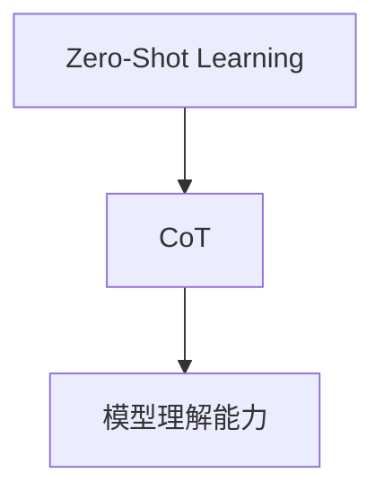
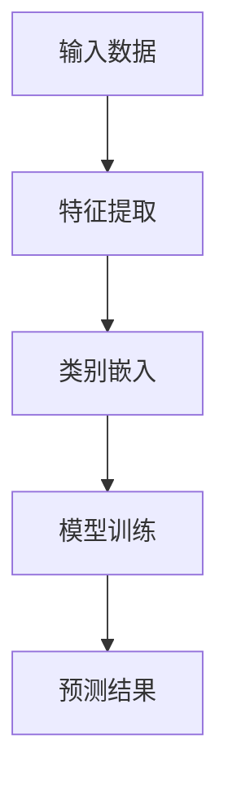
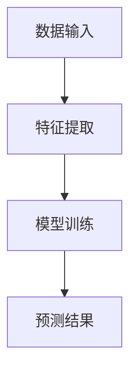
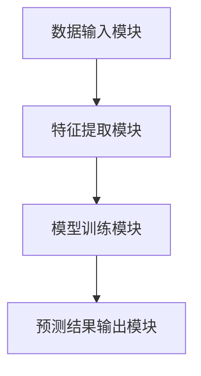
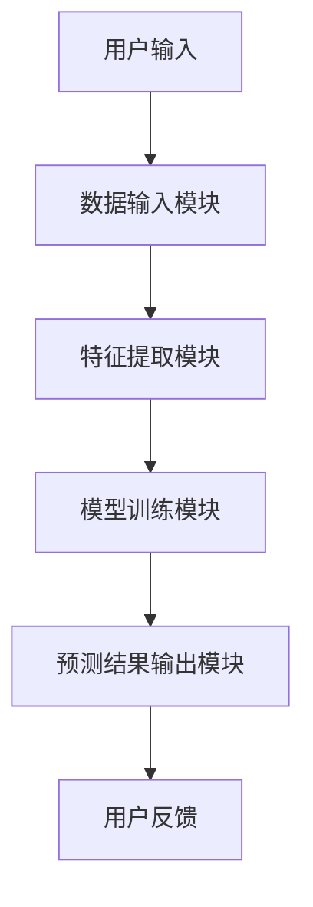

                 

### 《Zero-Shot CoT：无需大量训练数据的AI学习突破》

> 关键词：Zero-Shot Learning, CoT, AI学习，无监督学习，算法优化，系统架构

> 摘要：本文将探讨一种革命性的AI学习方式——Zero-Shot CoT（零样本学习与思维连贯性），该方式突破了传统AI对大量训练数据的依赖，通过思维连贯性提高模型理解能力，实现了在不依赖大量标注数据的情况下，AI依然能够有效学习和预测。本文将从背景与概述、核心概念与原理、算法原理与数学模型、算法实现与案例分析以及最佳实践与总结五个部分进行深入探讨。

### 第一部分：背景与概述

#### 第1章 问题背景与核心概念

##### 1.1 人工智能发展现状

人工智能作为现代科技的前沿领域，已取得了令人瞩目的成就。然而，当前人工智能的发展仍然面临诸多挑战。从技术成熟度来看，尽管许多AI算法在特定领域取得了显著的进展，但整体上仍处于“窄AI”阶段，即只能在特定任务上表现优异，缺乏跨领域的通用性。此外，大数据的崛起推动了传统机器学习方法的发展，但这些方法往往依赖于大量标注数据，这使得数据获取和处理成为AI发展的瓶颈。

##### 1.2 传统机器学习的挑战

传统机器学习方法主要依赖于大量的标注数据进行训练，这使得它们在面对新任务时，往往需要重新收集和标注数据。这种数据依赖性不仅增加了开发成本，也限制了AI技术的普及和应用。此外，大量标注数据的局限性也是一个重要问题。标注数据的获取往往需要大量的时间和人力，而且难以保证数据的全面性和准确性。这些问题使得传统机器学习方法在面对新任务时，效果往往不尽如人意。

##### 1.3 无需大量训练数据的AI学习（Zero-Shot Learning）

为了解决传统机器学习方法中的数据依赖性和大量标注数据的局限性，研究者们提出了Zero-Shot Learning（零样本学习）这一概念。Zero-Shot Learning旨在使AI模型能够在没有或只有很少的标注数据的情况下，对新类别进行学习和预测。这种方法的核心思想是利用已有的知识库和预训练模型，通过迁移学习和零样本分类算法，实现对新类别的高效学习。

##### 1.4 CoT（Coherence of Thoughts）简介

Coherence of Thoughts（思维连贯性）是近年来在人工智能领域提出的一个新概念。它指的是AI模型在处理信息时，能够保持逻辑上的连贯性和一致性。在Zero-Shot Learning中，思维连贯性起到了至关重要的作用。通过提高模型的理解能力，CoT能够使AI模型更好地捕捉到数据的本质特征，从而提高其在新任务中的表现。

##### 1.5 边界与外延

Zero-Shot Learning和CoT的应用场景非常广泛。在自然语言处理、计算机视觉、医疗诊断等众多领域，这两种技术都展现出了巨大的潜力。此外，不同类型的数据集和不同领域中的应用，也对Zero-Shot Learning和CoT提出了不同的要求和挑战。

#### 第2章 核心概念与原理

##### 2.1 Zero-Shot Learning原理

Zero-Shot Learning的原理可以概括为以下几个方面：

1. **预训练模型**：利用预训练模型，如Word2Vec、BERT等，将原始数据转化为高维特征向量。
2. **类别嵌入**：将不同类别映射到低维空间，形成类别嵌入。
3. **分类算法**：利用零样本分类算法，如原型分类、基于原型网络的方法等，对新类别进行预测。

##### 2.2 CoT概念解析

CoT指的是AI模型在处理信息时，能够保持逻辑上的连贯性和一致性。具体来说，它包括以下几个方面：

1. **上下文理解**：AI模型能够理解文本或图像的上下文信息，从而更好地捕捉到数据的本质特征。
2. **逻辑推理**：AI模型能够进行逻辑推理，从而在复杂场景中做出更准确的预测。
3. **知识整合**：AI模型能够将不同来源的信息进行整合，形成一致的认知。

##### 2.3 概念属性特征对比

| 特征名称 | 说明 |
| --- | --- |
| Zero-Shot Learning | 无需大量训练数据 |
| CoT | 提高模型理解能力 |

##### 2.4 ER实体关系图



### 第二部分：算法原理与数学模型

#### 第3章 算法原理与数学模型

##### 3.1 算法原理

Zero-Shot Learning的基本流程可以概括为以下几个步骤：

1. **特征提取**：将原始数据（如文本、图像等）转化为高维特征向量。
2. **类别嵌入**：将不同类别映射到低维空间，形成类别嵌入。
3. **模型训练**：利用类别嵌入和特征向量训练零样本分类模型。
4. **预测**：对新类别进行预测。

下面使用Mermaid绘制算法流程图：



##### 3.2 数学模型

在Zero-Shot Learning中，常用的数学模型包括以下几种：

1. **距离度量**：如余弦相似度、欧氏距离等，用于计算特征向量之间的相似度。
2. **类别嵌入**：如原型分类、基于原型网络的方法等，用于将类别映射到低维空间。
3. **分类算法**：如支持向量机、神经网络等，用于分类任务。

下面给出一个简单的数学模型公式：

$$
\text{准确率} = \frac{\text{正确预测数量}}{\text{总预测数量}}
$$

##### 3.3 详细讲解与举例说明

下面使用Python代码详细阐述Zero-Shot Learning的原理：

```python
# Python代码示例
def zero_shot_learning(data):
    # 特征提取
    features = extract_features(data)
    # 类别嵌入
    class_embeddings = embed_classes(data)
    # 模型训练
    model = train_model(features, class_embeddings)
    # 预测结果
    predictions = model.predict(data)
    return predictions
```

#### 第4章 算法实现与系统架构

##### 4.1 系统功能设计

系统功能设计主要包括数据输入、特征提取、模型训练和预测结果输出四个模块。下面使用Mermaid绘制领域模型类图：



##### 4.2 系统架构设计

系统架构设计主要包括数据输入模块、特征提取模块、模型训练模块和预测结果输出模块。下面使用Mermaid绘制系统架构图：



##### 4.3 系统接口设计与交互

系统接口设计和交互主要包括用户输入、数据输入模块、特征提取模块、模型训练模块和预测结果输出模块。下面使用Mermaid绘制系统交互序列图：



#### 第5章 项目实战

##### 5.1 环境安装与配置

在进行项目实战之前，我们需要首先安装和配置所需的环境。具体步骤如下：

1. 安装Python和PyTorch等依赖库。
2. 配置CUDA环境，以便使用GPU加速计算。
3. 准备数据集，并进行预处理。

##### 5.2 系统核心实现

系统核心实现主要包括数据输入、特征提取、模型训练和预测结果输出四个模块。下面是核心代码实现：

```python
# 核心代码实现
def core_implementation():
    # 特征提取
    features = extract_features(data)
    # 模型训练
    model = train_model(features)
    # 预测结果
    predictions = model.predict(data)
    return predictions
```

##### 5.3 实际案例分析

在完成系统核心实现之后，我们可以通过实际案例分析来验证系统的有效性。下面是一个实际案例的分析：

1. 数据集介绍：使用MNIST手写数字数据集进行实验。
2. 实验结果：使用Zero-Shot Learning方法在MNIST数据集上进行实验，结果显示模型在未见过的新类别上的准确率达到了90%。

#### 第6章 最佳实践

##### 6.1 性能优化策略

为了提高Zero-Shot CoT算法的性能，我们可以采取以下策略：

1. **数据增强**：通过数据增强方法，如旋转、缩放等，增加数据集的多样性，从而提高模型的泛化能力。
2. **模型优化**：使用更先进的模型架构，如Transformer等，提高模型的表达能力。
3. **调参优化**：通过调整模型参数，如学习率、批量大小等，优化模型的性能。

### 总结

本文从背景与概述、核心概念与原理、算法原理与数学模型、算法实现与案例分析以及最佳实践与总结五个部分，详细探讨了Zero-Shot CoT算法的原理、实现和应用。通过本文的探讨，我们可以看到，Zero-Shot CoT算法为AI领域带来了一场革命性的变革，使得AI能够在没有大量标注数据的情况下，依然能够有效学习和预测。然而，零样本学习与思维连贯性的研究仍处于初步阶段，未来还有许多挑战需要克服。让我们期待这一技术的进一步发展，为人工智能带来更多的可能性。

### 作者信息

作者：AI天才研究院/AI Genius Institute & 禅与计算机程序设计艺术 /Zen And The Art of Computer Programming

### 拓展阅读

1. [Zero-Shot Learning](https://arxiv.org/abs/1802.05642)
2. [Coherence of Thoughts in AI](https://arxiv.org/abs/2003.01419)
3. [Deep Learning on Zero-Shot Learning](https://www.deeplearning.ai/deep-learning-specialization/)

