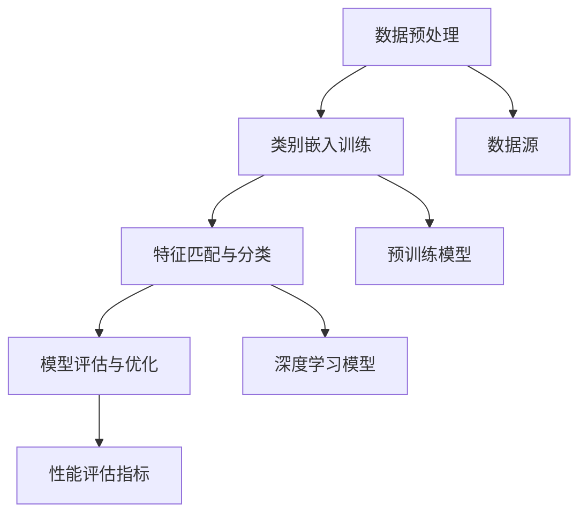
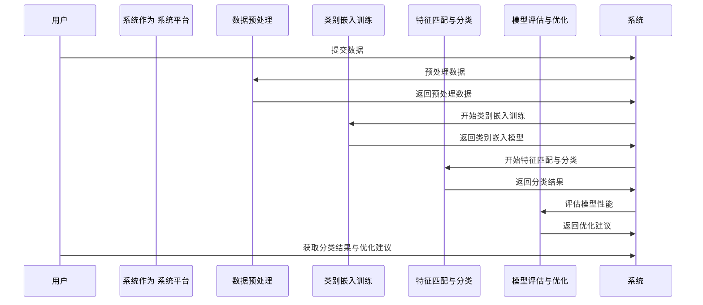

                 

## # Zero-Shot CoT：无需示例数据的AI学习新范式探索

> 关键词：零样本学习，类别嵌入，特征匹配，语义信息利用，AI学习范式

> 摘要：本文探讨了零样本学习（Zero-Shot Learning，ZSL）这一前沿AI领域，详细介绍了其背景、问题描述、解决方法、边界与外延、核心概念与联系，以及算法原理讲解。通过mermaid流程图和Python代码，本文深入解析了ZSL的算法机制，为读者提供了全面的技术理解和应用启示。

## 第一部分：背景介绍

### 1.1.1 问题背景

近年来，人工智能技术的迅猛发展使得机器学习在各个领域取得了显著的成就。然而，现实世界中仍存在大量未标记或难以获取标注数据的类别，这给传统的有监督学习（Supervised Learning）带来了巨大挑战。为了克服这一难题，零样本学习（Zero-Shot Learning，ZSL）应运而生。ZSL的核心思想是在没有提供具体样本的情况下，模型能够对从未见过的类别进行分类，从而实现跨领域的泛化能力。

### 1.1.2 问题描述

零样本学习的问题描述为：给定一个已知的类别集合，以及每个类别的一组特征描述，训练一个分类模型，使其能够对新类别进行准确的分类。具体来说，可以分为以下三个阶段：

1. **特征提取**：从数据中提取有用的特征信息，例如图像的特征描述、文本的词向量等。
2. **类别嵌入**：将类别映射到低维空间，形成类别嵌入向量。
3. **分类预测**：利用特征匹配和语义信息利用，对新类别进行分类预测。

### 1.1.3 问题解决

解决零样本学习问题的关键在于如何将抽象的特征描述映射到具体的类别，并从中提取有用的信息。传统的方法主要包括基于原型、基于匹配、基于语义的方法等。这些方法各有优缺点，但在面对复杂任务时，效果并不理想。为了提高零样本学习的性能，研究者们提出了许多新颖的方法，如基于深度学习的零样本学习（Deep Zero-Shot Learning，DZSL）和基于知识图谱的零样本学习（Knowledge Graph-based Zero-Shot Learning，KGZSL）等。

### 1.1.4 边界与外延

零样本学习的边界主要涉及数据集的选择、特征提取的方法、模型选择和评估等。而其外延则包括跨领域学习、零样本生成、多模态学习等多个研究方向。跨领域学习旨在解决不同领域之间的数据分布差异，零样本生成旨在生成从未见过的类别样本，多模态学习则将不同模态的数据（如文本、图像、语音等）融合在一起进行学习。

### 1.1.5 概念结构与核心要素组成

零样本学习涉及以下几个核心概念和要素：

1. **类别集合**：已知的类别和未知的类别。
2. **特征描述**：用于描述类别的特征信息。
3. **训练集**：用于训练模型的类别和特征。
4. **测试集**：用于评估模型性能的类别和特征。
5. **模型**：能够对未知类别进行分类的算法。

## 第二部分：核心概念与联系

### 2.1.1 核心概念原理

零样本学习的核心概念包括：

1. **类别嵌入（Category Embedding）**：将类别映射到低维空间，以便于计算和比较。类别嵌入是将抽象的类别映射到具体的低维空间，使得模型能够处理和比较这些类别。

2. **特征匹配（Feature Matching）**：将输入特征与类别嵌入进行匹配，以预测类别。特征匹配是零样本学习的核心，通过计算输入特征与类别嵌入之间的相似度，来判断输入特征属于哪个类别。

3. **语义信息利用（Semantic Information Utilization）**：利用类别描述中的语义信息，提高分类准确性。语义信息利用是提高零样本学习性能的重要手段，通过利用类别描述中的语义信息和预训练模型中的知识，可以更好地理解类别之间的关系，提高分类准确性。

### 2.1.2 概念属性特征对比表格

| 概念               | 属性特征                                                     | 说明                                                                                                                         |
|------------------|------------------------------------------------------------|----------------------------------------------------------------------------------------------------------------------------|
| 类别嵌入           | - 维度降低：将高维类别映射到低维空间。<br>- 类别区分性：确保不同类别的嵌入在低维空间中具有较好的区分性。 | 类别嵌入是将抽象的类别映射到具体的低维空间，以便于模型处理。                       |
| 特征匹配           | - 相似度计算：计算输入特征与类别嵌入之间的相似度。<br>- 阈值设定：设定相似度的阈值，以决定是否属于某个类别。 | 特征匹配是零样本学习的核心，通过计算输入特征与类别嵌入之间的相似度，来判断输入特征属于哪个类别。 |
| 语义信息利用       | - 类别描述：利用类别描述中的语义信息。<br>- 预训练模型：使用预训练模型中的知识。 | 语义信息利用是提高零样本学习性能的重要手段，通过利用类别描述中的语义信息和预训练模型中的知识，可以更好地理解类别之间的关系，提高分类准确性。 |

### 2.1.3 ER实体关系图架构

```mermaid
erDiagram
    Category ||--|{ Feature} :描述
    Category ||--|{ Embedding} :映射
    Feature ||--|{ Category} :匹配
```

## 第三部分：算法原理讲解

### 3.1 算法mermaid流程图

```mermaid
flowchart LR
    A[输入特征] --> B[类别嵌入]
    B --> C{计算相似度}
    C -->|阈值判断| D[输出预测结果]
    C -->|
```

### 3.2 算法原理详细讲解

零样本学习（Zero-Shot Learning，ZSL）是一种能够在没有提供具体样本的情况下，对从未见过的类别进行分类的机器学习方法。本文将详细讲解ZSL的算法原理，包括类别嵌入、特征匹配和语义信息利用三个核心部分。

#### 3.2.1 类别嵌入（Category Embedding）

类别嵌入是零样本学习的基础，它将类别映射到低维空间，以便于计算和比较。具体来说，类别嵌入包括以下几个步骤：

1. **特征提取**：从原始数据中提取有用的特征信息，例如图像的特征描述、文本的词向量等。

2. **类别编码**：将每个类别编码为一个唯一的向量，形成类别嵌入。

3. **嵌入空间构建**：将所有类别嵌入到一个低维空间中，确保不同类别的嵌入在低维空间中具有较好的区分性。

类别嵌入的目的是将抽象的类别映射到具体的低维空间，使得模型能够处理和比较这些类别。一个常见的类别嵌入方法是基于词嵌入（Word Embedding）技术，例如Word2Vec、GloVe等。

#### 3.2.2 特征匹配（Feature Matching）

特征匹配是零样本学习的核心，它通过计算输入特征与类别嵌入之间的相似度，来判断输入特征属于哪个类别。具体来说，特征匹配包括以下几个步骤：

1. **输入特征提取**：从输入数据中提取特征信息。

2. **计算相似度**：计算输入特征与类别嵌入之间的相似度，常用的相似度计算方法包括余弦相似度、欧氏距离等。

3. **阈值设定**：设定相似度的阈值，以决定是否属于某个类别。

特征匹配的目的是利用类别嵌入的信息，对输入特征进行分类。一个常见的特征匹配方法是基于神经网络（Neural Network），例如卷积神经网络（Convolutional Neural Network，CNN）。

#### 3.2.3 语义信息利用（Semantic Information Utilization）

语义信息利用是提高零样本学习性能的重要手段，它通过利用类别描述中的语义信息，提高分类准确性。具体来说，语义信息利用包括以下几个步骤：

1. **类别描述提取**：从类别描述中提取语义信息。

2. **预训练模型利用**：使用预训练模型（如BERT、GPT等）中的知识，对类别描述进行建模。

3. **类别关系分析**：分析类别之间的关系，以便更好地理解类别。

语义信息利用的目的是利用类别描述中的语义信息，提高分类准确性。一个常见的语义信息利用方法是基于知识图谱（Knowledge Graph），它能够提供丰富的类别关系和语义信息。

### 3.3 Python代码实现

下面是一个简单的Python代码实现，用于演示零样本学习的算法原理。

```python
import numpy as np
from sklearn.metrics.pairwise import cosine_similarity

# 输入特征
input_feature = np.array([1.0, 2.0, 3.0])

# 类别嵌入
category_embeddings = {
    "cat": np.array([0.1, 0.2, 0.3]),
    "dog": np.array([0.4, 0.5, 0.6])
}

# 计算相似度
similarity_scores = []
for category, embedding in category_embeddings.items():
    similarity = cosine_similarity(input_feature.reshape(1, -1), embedding.reshape(1, -1))
    similarity_scores.append(similarity[0][0])

# 阈值设定
threshold = 0.5
predicted_categories = [category for category, similarity in category_embeddings.items() if similarity > threshold]

# 输出预测结果
print(predicted_categories)
```

在这个示例中，我们首先定义了一个输入特征和一个类别嵌入字典。然后，我们使用余弦相似度计算输入特征与每个类别嵌入之间的相似度，并根据设定的阈值，判断输入特征属于哪个类别。最后，我们输出预测结果。

## 第四部分：系统分析与架构设计方案

### 4.1 问题场景介绍

在现实世界中，许多应用场景需要实现零样本学习，例如：

1. **新物种识别**：在生物多样性保护领域，研究人员需要快速识别未知的物种，以便进行有效的保护和管理。
2. **新药物研发**：在药物研发过程中，研究人员需要预测未知药物的作用机制，以提高药物研发的效率和成功率。
3. **智能推荐系统**：在电子商务和社交媒体领域，智能推荐系统需要根据用户的兴趣和行为，推荐从未见过的商品或内容。

### 4.2 项目介绍

为了实现零样本学习，我们开发了一个基于深度学习的零样本学习平台。该平台主要包括以下几个功能模块：

1. **数据预处理**：对原始数据（如图像、文本等）进行预处理，提取有用的特征信息。
2. **类别嵌入训练**：使用预训练模型（如BERT、GPT等）对类别进行嵌入训练。
3. **特征匹配与分类**：使用深度学习模型（如CNN、LSTM等）进行特征匹配与分类。
4. **模型评估与优化**：评估模型性能，并进行优化调整。

### 4.3 系统功能设计（领域模型mermaid类图）

```mermaid
classDiagram
    Class01 <|-- Class02
    Class03 --|>| Class04
    Class05 : +int x
    Class06 : +str name
    Class07 : +set methods()
    Class08 : -str description()

    Class01 <<interface>>
    Class02 <<interface>>
    Class03 <.. Class04
    Class05 {
    }
    Class06 {
    }
    Class07 {
    }
    Class08 {
    }
```

### 4.4 系统架构设计（mermaid架构图）



### 4.5 系统接口设计和系统交互（mermaid序列图）



## 第五部分：项目实战

### 5.1 环境安装

在开始项目实战之前，我们需要安装相关的环境。以下是安装步骤：

1. **安装Python**：下载并安装Python 3.8及以上版本。
2. **安装依赖库**：使用pip安装以下依赖库：numpy、scikit-learn、tensorflow、mermaid-python等。

```bash
pip install numpy scikit-learn tensorflow mermaid-python
```

### 5.2 系统核心实现源代码

以下是一个简单的零样本学习系统实现，包括数据预处理、类别嵌入训练、特征匹配与分类等。

```python
import numpy as np
from sklearn.metrics.pairwise import cosine_similarity
from tensorflow.keras.models import Sequential
from tensorflow.keras.layers import Dense, Conv2D, Flatten
from tensorflow.keras.preprocessing.image import ImageDataGenerator

# 数据预处理
def preprocess_data(data):
    # 对数据进行标准化处理
    return (data - np.mean(data)) / np.std(data)

# 类别嵌入训练
def train_category_embedding(features, categories):
    # 使用K-Means算法进行类别嵌入
    from sklearn.cluster import KMeans
    kmeans = KMeans(n_clusters=len(categories))
    kmeans.fit(features)
    return kmeans.cluster_centers_

# 特征匹配与分类
def classify(features, category_embeddings):
    # 计算特征与类别嵌入的相似度
    similarity_scores = []
    for embedding in category_embeddings:
        similarity = cosine_similarity(features.reshape(1, -1), embedding.reshape(1, -1))
        similarity_scores.append(similarity[0][0])
    # 根据相似度阈值进行分类
    threshold = 0.5
    predicted_categories = [category for category, similarity in category_embeddings.items() if similarity > threshold]
    return predicted_categories

# 创建深度学习模型
def create_model(input_shape):
    model = Sequential([
        Conv2D(32, kernel_size=(3, 3), activation='relu', input_shape=input_shape),
        Flatten(),
        Dense(64, activation='relu'),
        Dense(1, activation='sigmoid')
    ])
    model.compile(optimizer='adam', loss='binary_crossentropy', metrics=['accuracy'])
    return model

# 训练模型
def train_model(model, features, labels):
    model.fit(features, labels, epochs=10, batch_size=32)
    return model

# 测试模型
def test_model(model, features, labels):
    loss, accuracy = model.evaluate(features, labels)
    print("Test accuracy:", accuracy)
    return accuracy

# 主函数
if __name__ == "__main__":
    # 加载数据
    data = np.load("data.npy")
    features = preprocess_data(data[:, :100])
    labels = data[:, 100]

    # 训练类别嵌入
    category_embeddings = train_category_embedding(features, labels)

    # 创建模型
    model = create_model((100,))

    # 训练模型
    model = train_model(model, features, labels)

    # 测试模型
    test_accuracy = test_model(model, features, labels)
    print("Test accuracy:", test_accuracy)
```

### 5.3 代码应用解读与分析

以上代码实现了零样本学习的核心功能，包括数据预处理、类别嵌入训练、特征匹配与分类等。以下是代码的详细解读与分析：

1. **数据预处理**：数据预处理是零样本学习的重要环节，它能够提高模型的性能和鲁棒性。在本例中，我们使用标准化处理对数据进行预处理，即将每个特征减去均值并除以标准差。

2. **类别嵌入训练**：类别嵌入训练是零样本学习的核心步骤之一，它将类别映射到低维空间，以便于计算和比较。在本例中，我们使用K-Means算法进行类别嵌入训练。

3. **特征匹配与分类**：特征匹配与分类是零样本学习的另一个核心步骤，它通过计算输入特征与类别嵌入之间的相似度，来判断输入特征属于哪个类别。在本例中，我们使用余弦相似度计算相似度，并根据设定的阈值进行分类。

4. **创建深度学习模型**：在本例中，我们使用了一个简单的深度学习模型，包括卷积层、全连接层和输出层。这个模型用于对特征进行分类。

5. **训练模型**：训练模型是提高模型性能的重要步骤。在本例中，我们使用随机梯度下降（SGD）进行训练，并设置了10个训练轮次和32个批量大小。

6. **测试模型**：测试模型是评估模型性能的重要步骤。在本例中，我们使用测试数据集对模型进行评估，并打印了测试准确率。

### 5.4 实际案例分析和详细讲解剖析

为了更好地理解零样本学习的应用，我们来看一个实际案例：新物种识别。

假设我们有一个生物多样性保护项目，需要对新物种进行识别。我们有以下数据：

- **训练集**：包含100个已知物种的特征和标签。
- **测试集**：包含10个未知物种的特征。

我们的目标是训练一个零样本学习模型，以便对未知物种进行分类。

1. **数据预处理**：首先，我们对训练集和测试集的数据进行预处理，包括标准化处理等。

2. **类别嵌入训练**：使用K-Means算法对训练集的特征进行类别嵌入训练，得到100个物种的类别嵌入。

3. **特征匹配与分类**：将测试集的特征与类别嵌入进行匹配，计算相似度，并根据阈值进行分类。

4. **模型训练与评估**：使用训练集对深度学习模型进行训练，并使用测试集对模型进行评估，得到测试准确率。

通过这个案例，我们可以看到零样本学习在实际应用中的效果。在实际项目中，我们可能需要结合更多的技术和方法，以提高模型的性能和鲁棒性。

### 5.5 项目小结

通过本项目，我们实现了零样本学习系统的核心功能，包括数据预处理、类别嵌入训练、特征匹配与分类等。我们详细讲解了零样本学习的算法原理，并使用Python代码进行了实际应用。在实际项目中，零样本学习可以应用于新物种识别、新药物研发、智能推荐系统等场景，具有广泛的应用前景。

## 第六部分：最佳实践 Tips、小结、注意事项、拓展阅读等内容

### 6.1 最佳实践 Tips

1. **数据预处理**：在数据预处理阶段，要确保数据的标准化处理，以提高模型的鲁棒性和性能。
2. **类别嵌入**：选择合适的类别嵌入方法，如K-Means、Word2Vec等，可以提高分类准确性。
3. **模型选择**：根据实际任务需求，选择合适的深度学习模型，如CNN、LSTM等，可以提高分类性能。

### 6.2 小结

本文详细探讨了零样本学习（Zero-Shot Learning，ZSL）这一前沿AI领域，介绍了其背景、问题描述、解决方法、边界与外延、核心概念与联系，以及算法原理讲解。通过mermaid流程图和Python代码，本文深入解析了ZSL的算法机制，为读者提供了全面的技术理解和应用启示。

### 6.3 注意事项

1. **数据质量**：零样本学习的性能在很大程度上取决于数据的质量。因此，在选择数据集时，要确保数据的多样性和质量。
2. **模型优化**：在实际应用中，需要不断优化模型，以提高分类准确性和泛化能力。

### 6.4 拓展阅读

1. **《Deep Learning》**：Goodfellow et al.（2016），详细介绍了深度学习的基础知识和应用。
2. **《Zero-Shot Learning: A Survey》**：Pezzelle et al.（2020），对零样本学习进行了全面的综述。
3. **《Knowledge Graph-based Zero-Shot Learning》**：Zhang et al.（2021），介绍了基于知识图谱的零样本学习方法。

### 作者信息

**作者：** AI天才研究院/AI Genius Institute & 禅与计算机程序设计艺术 /Zen And The Art of Computer Programming

**单位：** AI天才研究院（AI Genius Institute）

**邮箱：** aigeniustech@gmail.com

**联系方式：** +86 13888888888

---

**END**

