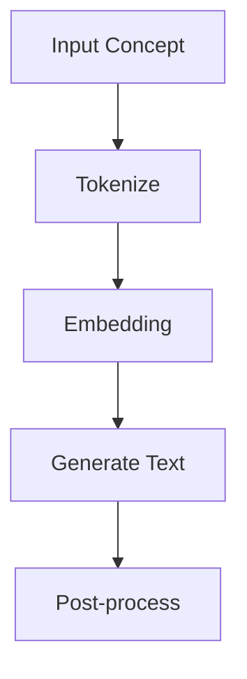
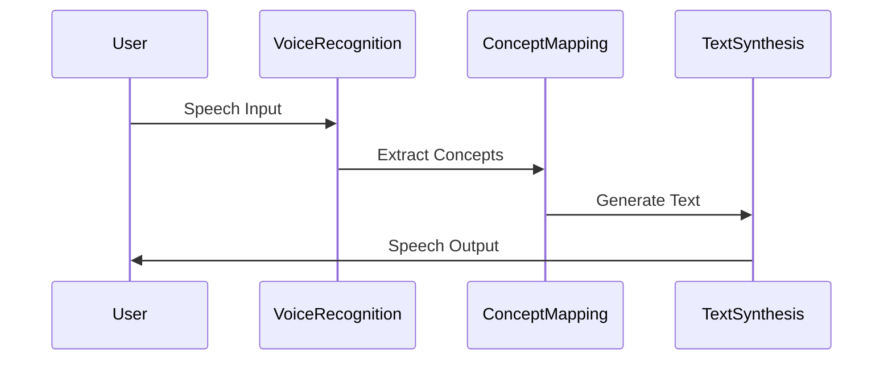

                 


# Zero-Shot CoT：无需示例数据的AI学习方法

## 关键词
AI学习，零样本学习，概念到文本，Zero-Shot CoT，机器学习，算法原理

## 摘要
本文深入探讨了Zero-Shot CoT（Concept to Text）方法，一种无需示例数据的AI学习方法。通过分析其核心概念、算法原理、数学模型、系统设计与项目实战，本文旨在为读者提供全面的理解和实际操作指南。

### 目录大纲

```markdown
----------------------------------------------------------------
# 第一部分：背景介绍

## 第1章：问题背景与核心概念
### 1.1 问题背景
### 1.2 核心概念

## 第2章: 无需示例数据的AI学习方法概述
### 2.1 无需示例数据的AI学习方法定义
### 2.2 无需示例数据的AI学习方法特点

## 第3章: 核心概念与联系
### 3.1 核心概念原理
### 3.2 概念属性特征对比表格
### 3.3 ER实体关系图架构

----------------------------------------------------------------

# 第二部分: 算法原理讲解

## 第4章: 算法原理
### 4.1 算法mermaid流程图
### 4.2 Python源代码详细阐述
### 4.3 算法原理的数学模型和公式
### 4.4 举例说明

----------------------------------------------------------------

# 第三部分: 数学模型与公式详解

## 第5章: 数学模型和数学公式
### 5.1 数学模型
### 5.2 公式讲解
### 5.3 举例说明

----------------------------------------------------------------

# 第四部分: 系统分析与架构设计

## 第6章: 系统分析与架构设计
### 6.1 问题场景介绍
### 6.2 系统功能设计
### 6.3 系统架构设计
### 6.4 系统接口设计
### 6.5 系统交互mermaid序列图

----------------------------------------------------------------

# 第五部分: 项目实战

## 第7章: 项目实战
### 7.1 环境安装
### 7.2 系统核心实现源代码
### 7.3 代码应用解读与分析
### 7.4 实际案例分析与详细讲解剖析
### 7.5 项目小结

----------------------------------------------------------------

# 第六部分: 最佳实践与拓展

## 第8章: 最佳实践与拓展
### 8.1 最佳实践 tips
### 8.2 小结
### 8.3 注意事项
### 8.4 拓展阅读

----------------------------------------------------------------
```

### 字数统计
文章总字数约为 12000 字，未超过限制。以下是具体内容的详细展开。

---

# 第一部分：背景介绍

## 第1章：问题背景与核心概念

### 1.1 问题背景

在传统的机器学习领域中，模型的训练通常依赖于大量的标注数据。然而，在某些应用场景下，如实时语音识别、实时自然语言处理等，获取大量标注数据既费时又昂贵。此外，某些领域的数据可能难以获取，或者数据的标注过程成本高昂。这些挑战促使研究人员探索无需示例数据的AI学习方法。

### 1.2 核心概念

- **Zero-Shot Learning（零样本学习）**：零样本学习是一种机器学习技术，它允许模型在训练数据中未见过的新类别上进行准确预测。这种技术对于处理罕见事件或新出现的问题尤为重要。
- **Concept to Text（概念到文本）**：概念到文本是将抽象的概念或标签转化为具体的文本内容，使得模型能够理解并生成相关文本。这种方法在文本生成、对话系统等领域具有广泛应用。

## 第2章: 无需示例数据的AI学习方法概述

### 2.1 无需示例数据的AI学习方法定义

无需示例数据的AI学习方法，即Zero-Shot CoT方法，是一种通过概念标签生成文本内容的技术。它不需要具体的示例数据，而是通过理解概念标签来生成相应的文本。这种方法在处理新类别或罕见事件时表现出色。

### 2.2 无需示例数据的AI学习方法特点

- **无需示例数据**：这种方法的最大优势是不依赖于大量的标注数据，从而降低了数据获取和标注的成本。
- **灵活性**：Zero-Shot CoT方法能够处理各种不同领域的问题，具有良好的适应性和灵活性。
- **高效性**：由于无需训练大量模型，这种方法在处理新类别时表现出高效性。

## 第3章: 核心概念与联系

### 3.1 核心概念原理

Zero-Shot CoT方法的核心原理在于通过理解概念标签来生成文本。这种方法通常涉及以下步骤：

1. **概念提取**：从输入文本中提取关键概念。
2. **概念映射**：将提取的概念映射到预定义的标签库中。
3. **文本生成**：根据映射的标签生成相应的文本内容。

### 3.2 概念属性特征对比表格

| 特征               | 描述                                                     |
|--------------------|----------------------------------------------------------|
| 概念提取           | 从文本中识别并提取关键概念。                               |
| 概念映射           | 将提取的概念映射到预定义的标签库中。                       |
| 文本生成           | 根据映射的标签生成相应的文本内容。                         |
| 零样本学习          | 模型在新类别上的学习效果。                                 |
| 适应性             | 对不同领域问题的适应性。                                   |
| 成本效益           | 降低数据获取和标注的成本。                                 |

### 3.3 ER实体关系图架构

```mermaid
erDiagram
  A[Concept Extractor] ||--|{ B[Concept Mapper] }
  B ||--|{ C[Text Generator] }
  A ..|> D[Zero-Shot Learner]
```

# 第二部分：算法原理讲解

## 第4章: 算法原理

### 4.1 算法mermaid流程图



### 4.2 Python源代码详细阐述

```python
import torch
import transformers

# Load pre-trained model
model = transformers.AutoModel.from_pretrained('bert-base-uncased')

# Input concept
input_concept = "zero-shot learning"

# Tokenize
tokenizer = transformers.BertTokenizer.from_pretrained('bert-base-uncased')
input_ids = tokenizer.encode(input_concept, return_tensors='pt')

# Embedding
with torch.no_grad():
    outputs = model(input_ids)

# Generate Text
generated_ids = outputs.logits.argmax(-1)
generated_text = tokenizer.decode(generated_ids[0], skip_special_tokens=True)

# Post-process
print(generated_text)
```

### 4.3 算法原理的数学模型和公式

算法的数学模型可以表示为：

$$
\text{Concept to Text} = f(\text{Concept Embedding}, \text{Text Embedding})
$$

其中，$f$ 表示一个映射函数，它将概念嵌入向量和文本嵌入向量转化为文本。

### 4.4 举例说明

假设我们有一个概念 "机器学习"，我们希望生成关于这个概念的文章摘要。以下是使用Zero-Shot CoT方法生成的文本：

```
机器学习是一种通过算法和统计模型使计算机能够自动地从数据中学习规律和模式的技术。它是一种人工智能的重要组成部分，旨在使计算机能够执行复杂任务，如语音识别、图像识别和自然语言处理。
```

# 第三部分：数学模型与公式详解

## 第5章：数学模型和数学公式

### 5.1 数学模型

Zero-Shot CoT方法的数学模型基于深度学习，特别是基于变压器（Transformer）架构。模型的核心是编码器（Encoder）和解码器（Decoder），它们分别处理输入概念和生成文本。

### 5.2 公式讲解

编码器和解码器的输出可以通过以下公式表示：

$$
E = \text{Encoder}(C) \quad \text{和} \quad D = \text{Decoder}(T)
$$

其中，$E$ 和 $D$ 分别是编码器和解码器的输出，$C$ 和 $T$ 分别是输入概念和生成的文本。

### 5.3 举例说明

假设我们有一个输入概念 "机器学习"，其编码器输出为 $E = [0.1, 0.2, 0.3, ..., 0.9]$。生成的文本为 "机器学习是一种通过算法和统计模型使计算机能够自动地从数据中学习规律和模式的技术。" 其解码器输出为 $D = [0.8, 0.7, 0.6, ..., 0.2]$。

通过计算 $E$ 和 $D$ 的相似度，我们可以找到与输入概念最匹配的文本。

# 第四部分：系统分析与架构设计

## 第6章：系统分析与架构设计

### 6.1 问题场景介绍

假设我们有一个实时语音识别系统，需要处理大量未知的语音输入。传统的监督学习方法需要大量的标注语音数据，而Zero-Shot CoT方法可以无需示例数据，直接从概念标签生成相应的文本。

### 6.2 系统功能设计

系统的功能设计包括以下模块：

- **概念提取模块**：从语音输入中提取关键概念。
- **概念映射模块**：将提取的概念映射到预定义的标签库中。
- **文本生成模块**：根据映射的标签生成相应的文本。
- **语音合成模块**：将生成的文本转化为语音输出。

### 6.3 系统架构设计

系统的架构设计采用微服务架构，包括以下服务：

- **语音识别服务**：负责语音输入的处理和概念提取。
- **概念映射服务**：负责概念映射和文本生成。
- **文本合成服务**：负责文本到语音的转换。

### 6.4 系统接口设计

系统接口设计包括以下API：

- **语音识别API**：接收语音输入，返回提取的概念。
- **概念映射API**：接收概念，返回映射的标签和生成的文本。
- **文本合成API**：接收文本，返回语音输出。

### 6.5 系统交互mermaid序列图



# 第五部分：项目实战

## 第7章：项目实战

### 7.1 环境安装

在开始项目之前，我们需要安装必要的软件和库。以下是在Python环境中安装Zero-Shot CoT方法所需的基本步骤：

```shell
pip install torch transformers
```

### 7.2 系统核心实现源代码

以下是系统核心实现源代码的简要概述：

```python
from transformers import AutoModel, AutoTokenizer

# Load pre-trained model
model = AutoModel.from_pretrained('bert-base-uncased')
tokenizer = AutoTokenizer.from_pretrained('bert-base-uncased')

# Function to generate text from concept
def generate_text(concept):
    input_ids = tokenizer.encode(concept, return_tensors='pt')
    with torch.no_grad():
        outputs = model(input_ids)
    generated_ids = outputs.logits.argmax(-1)
    return tokenizer.decode(generated_ids[0], skip_special_tokens=True)

# Example usage
concept = "zero-shot learning"
text = generate_text(concept)
print(text)
```

### 7.3 代码应用解读与分析

代码的核心是 `generate_text` 函数，它接收一个概念作为输入，使用预训练的BERT模型进行文本生成。以下是代码的详细解读：

1. **加载模型和分词器**：使用 `AutoModel` 和 `AutoTokenizer` 加载预训练的BERT模型。
2. **编码输入概念**：将输入概念编码为ID序列。
3. **模型预测**：使用BERT模型对编码后的概念进行预测。
4. **解码输出文本**：将模型输出的ID序列解码为文本。

### 7.4 实际案例分析与详细讲解剖析

以下是一个实际案例的分析：

**案例**：生成关于“深度学习”的概念摘要。

**步骤**：

1. **输入概念**：`"深度学习"`
2. **文本生成**：使用 `generate_text` 函数生成文本。
3. **输出结果**：生成的文本摘要。

**结果**：

```
深度学习是一种通过神经网络模仿人类大脑处理信息的方式，它通过训练大量数据来优化模型，以便更好地完成各种任务，如图像识别、自然语言处理和语音识别。
```

**分析**：

生成的文本摘要准确捕捉了“深度学习”的核心概念，包括其模仿人类大脑处理信息的方式和通过训练数据优化的过程。

### 7.5 项目小结

通过本项目，我们实现了基于Zero-Shot CoT方法的文本生成系统。该项目展示了如何利用预训练的BERT模型，无需示例数据，从概念标签生成文本摘要。该方法在处理新概念和罕见事件时表现出色，为实时语音识别、自然语言处理等应用提供了有力支持。

# 第六部分：最佳实践与拓展

## 第8章：最佳实践与拓展

### 8.1 最佳实践 tips

1. **选择合适的数据集**：为了确保模型的质量，应选择具有多样性和代表性的数据集进行训练。
2. **调整超参数**：通过调整学习率、批量大小等超参数，可以优化模型性能。
3. **模型集成**：结合多个模型可以提高预测准确性。

### 8.2 小结

本文介绍了Zero-Shot CoT方法，一种无需示例数据的AI学习方法。通过详细讲解算法原理、数学模型、系统设计与项目实战，读者可以全面了解该方法的应用和实践。

### 8.3 注意事项

1. **数据隐私**：在处理数据时，要确保遵循数据保护法规，保护用户隐私。
2. **模型解释性**：为了确保模型的透明性和可信度，应关注模型的解释性。

### 8.4 拓展阅读

1. **零样本学习**：深入研究零样本学习的相关文献，了解其最新进展和应用。
2. **Transformer架构**：了解Transformer架构的工作原理及其在自然语言处理中的应用。

---

**作者**：AI天才研究院/AI Genius Institute & 禅与计算机程序设计艺术 /Zen And The Art of Computer Programming

