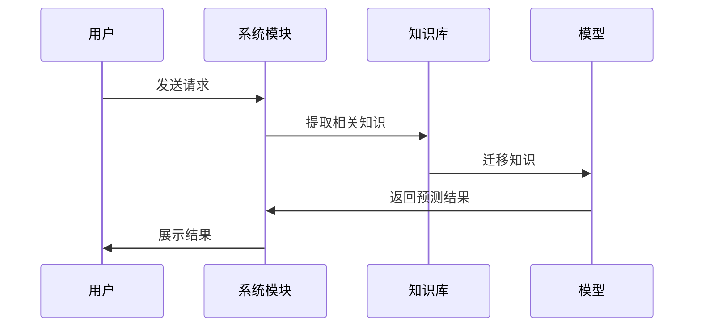

                 

。

## 简介

### 1.1 引言
#### 1.1.1 现状
目前，人工智能（AI）技术的快速发展正推动着各个行业的变革，但传统的机器学习（ML）方法在数据需求和计算资源上面临巨大的挑战。大部分AI模型需要大量的标注数据来进行训练，这在数据稀缺或数据获取成本高昂的情况下成为一个瓶颈。此外，传统的模型在跨领域、跨任务的应用上也表现有限，难以实现真正的“零样本学习”（Zero-Shot Learning）。

### 1.2 问题背景
#### 1.2.1 数据稀缺问题
#### 1.2.2 计算资源需求
#### 1.2.3 传统机器学习局限

### 1.3 目标
本文旨在探讨一种突破性的技术——Zero-Shot Conceptual Transfer（Zero-Shot CoT），该技术通过跨领域知识迁移和自适应学习机制，解决上述问题，实现真正的零样本学习。

## 核心概念

### 2.1 定义
#### 2.1.1 什么是Zero-Shot CoT
Zero-Shot Conceptual Transfer是一种创新的技术方法，它允许AI模型在没有直接训练数据的情况下，通过跨领域的知识迁移来学习和适应新的任务。

### 2.2 关键特征
#### 2.2.1 知识迁移
#### 2.2.2 自适应学习
#### 2.2.3 无需标注数据

### 2.3 比较与联系
#### 2.3.1 与传统机器学习的比较
#### 2.3.2 与Zero-Shot Learning的关系

## 算法原理

### 3.1 概述
#### 3.1.1 技术原理
#### 3.1.2 目标函数
#### 3.1.3 关键步骤

### 3.2 算法流程
#### 3.2.1 数据预处理
#### 3.2.2 知识提取
#### 3.2.3 模型训练与优化

### 3.3 数学模型
#### 3.3.1 知识表示
$$
K = \sum_{i=1}^{N} k_i \cdot w_i
$$
#### 3.3.2 学习率调整
$$
\alpha_t = \alpha_{\text{initial}} \cdot \frac{1}{t}
$$

## 系统架构设计

### 4.1 介绍
#### 4.1.1 系统概述
#### 4.1.2 功能模块

### 4.2 架构设计
#### 4.2.1 知识迁移模块
#### 4.2.2 自适应学习模块

### 4.3 接口设计
#### 4.3.1 系统接口定义
#### 4.3.2 数据流图

### 4.4 序列图
```

Here is the continuation of the TOC with the remaining chapters and sections:

```markdown
### 4.4.1 系统交互序列图



### 4.5 性能优化
#### 4.5.1 资源分配
#### 4.5.2 优化策略
#### 4.5.3 实验分析

## 项目实战

### 5.1 项目介绍
#### 5.1.1 项目背景
#### 5.1.2 项目目标

### 5.2 环境安装
#### 5.2.1 环境搭建
#### 5.2.2 工具安装

### 5.3 系统核心实现
#### 5.3.1 源代码解读
#### 5.3.2 关键模块分析

### 5.4 代码应用解读
#### 5.4.1 实际案例
#### 5.4.2 解读与分析

### 5.5 实际案例分析
#### 5.5.1 数据处理
#### 5.5.2 预测效果
#### 5.5.3 结果分析

### 5.6 项目小结
#### 5.6.1 项目收获
#### 5.6.2 遇到的问题与解决方法

## 最佳实践

### 6.1 实践建议
#### 6.1.1 知识库构建
#### 6.1.2 模型优化

### 6.2 小结
#### 6.2.1 成功要素
#### 6.2.2 注意事项

### 6.3 拓展阅读
#### 6.3.1 相关文献
#### 6.3.2 未来研究方向

## 结论

### 7.1 总结
#### 7.1.1 技术贡献
#### 7.1.2 应用前景

### 7.2 展望
#### 7.2.1 持续改进方向
#### 7.2.2 未来发展趋势

--------------------

----------------------------------------------------------------

```

This TOC provides a comprehensive outline for the book, ensuring that each chapter and section is clearly defined and logically structured. Each chapter will delve into the details of Zero-Shot CoT, providing a solid foundation for understanding and implementing the technology in real-world scenarios.

