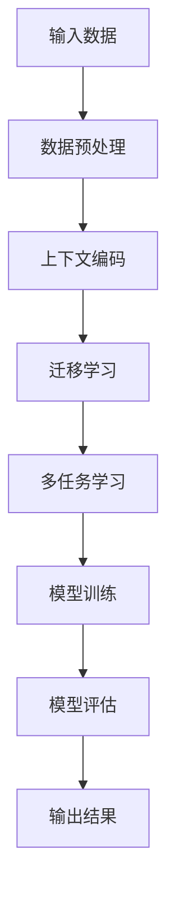
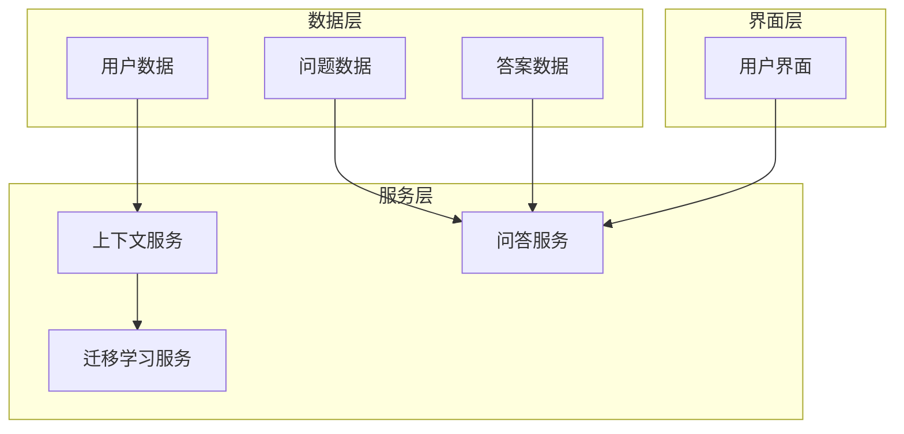
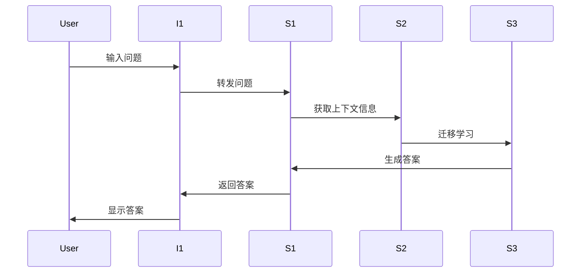

                 


# Zero-Shot CoT: Breaking the Bottleneck of AI Learning Innovations

关键词：零样本上下文传递、AI学习、创新方法、瓶颈突破

摘要：
在人工智能领域，学习瓶颈一直是阻碍进步的障碍。传统的机器学习模型依赖于大量标注数据进行训练，但这种方式在面对新的、未见过的数据时往往力不从心。本文提出了一种创新方法——零样本上下文传递（Zero-Shot CoT），旨在突破现有AI学习的瓶颈。本文将详细介绍零样本上下文传递的概念、原理以及在实际应用中的效果，为读者提供深入了解这一前沿技术的机会。

## 1. 引言

### 1.1 零样本上下文传递（Zero-Shot CoT）简介

零样本上下文传递是一种新兴的AI学习方法，其核心思想是利用少量或无标注数据，通过上下文信息将模型的知识迁移到新的数据上。这种方法在自然语言处理、计算机视觉等领域展现出了巨大的潜力，为解决AI学习中的瓶颈问题提供了新的思路。

### 1.2 零样本上下文传递的重要性

随着AI技术的快速发展，对大量标注数据的依赖成为了一个不可忽视的问题。这不仅增加了数据采集的成本，也限制了AI模型的泛化能力。零样本上下文传递的出现，使得我们能够在没有足够标注数据的情况下，仍然能够有效地训练和部署AI模型，具有重要的现实意义。

### 1.3 书籍目的与结构

本文旨在系统地介绍零样本上下文传递的方法，包括其理论基础、关键技术、应用实例以及未来发展方向。文章结构分为以下几部分：

1. 引言
2. 核心概念与原理
3. AI学习的挑战与零样本上下文传递
4. 零样本上下文传递的创新方法
5. 实际应用与案例分析
6. 未来展望与挑战
7. 结论

## 2. 核心概念与原理

### 2.1 零样本上下文传递的基本概念

#### 2.1.1 什么是零样本上下文传递

零样本上下文传递（Zero-Shot Context Transfer，简称Zero-Shot CoT）是一种机器学习方法，旨在解决模型在新数据上的泛化问题。其核心在于通过上下文信息，将已知知识迁移到未见过的数据上，实现零样本学习。

#### 2.1.2 零样本上下文传递的核心原则

- **上下文信息利用**：通过上下文信息，将知识从一个领域转移到另一个领域。
- **少量样本学习**：即使只有少量样本，也能通过上下文信息学习到模型的泛化能力。
- **无监督学习**：不需要大量标注数据，减少数据采集成本。

#### 2.1.3 与传统学习方法的对比

传统学习方法依赖于大量标注数据，而零样本上下文传递则通过上下文信息实现知识迁移，大大降低了数据依赖。

### 2.2 零样本上下文传递的技术原理

#### 2.2.1 零样本上下文传递的工作机制

- **上下文编码**：将上下文信息编码为一个向量，作为模型的输入。
- **知识迁移**：利用已学习的模型，将知识迁移到新的数据上。
- **预测生成**：基于迁移后的知识，对新数据进行预测。

#### 2.2.2 关键技术详解

- **上下文嵌入**：将上下文信息转换为向量表示。
- **迁移学习**：通过已有模型，将知识迁移到新数据上。
- **多任务学习**：利用多任务学习，提高模型的泛化能力。

#### 2.2.3 零样本上下文传递的优势

- **减少数据依赖**：无需大量标注数据，降低数据采集成本。
- **提高泛化能力**：通过上下文信息，实现对新数据的有效学习。
- **易于扩展**：适用于各种AI领域，具有广泛的适用性。

## 3. AI学习的挑战与零样本上下文传递

### 3.1 AI学习的现有瓶颈

- **数据依赖**：大量标注数据的获取困难，限制了AI模型的应用。
- **模型泛化能力**：在面对新的、未见过的数据时，模型表现不佳。
- **计算资源**：训练复杂模型需要大量计算资源，成本高昂。

### 3.2 零样本上下文传递的潜在优势

- **降低数据依赖**：通过上下文信息，实现无监督学习，降低对标注数据的依赖。
- **提高模型泛化能力**：通过知识迁移，提高模型对新数据的处理能力。
- **节省计算资源**：利用少量样本，实现高效学习，节省计算资源。

## 4. 零样本上下文传递的创新方法

### 4.1 上下文编码技术

- **文本上下文编码**：使用预训练的语言模型，将文本上下文编码为向量。
- **图像上下文编码**：使用卷积神经网络，将图像上下文编码为特征向量。

### 4.2 迁移学习技术

- **基于模型的迁移**：利用已有的预训练模型，将知识迁移到新数据上。
- **基于特征的迁移**：将特征表示迁移到新数据上，实现跨领域的知识共享。

### 4.3 多任务学习技术

- **多任务学习模型**：同时学习多个任务，提高模型的泛化能力。
- **共享层与任务层**：通过共享层和任务层，实现知识的跨任务迁移。

## 5. 实际应用与案例分析

### 5.1 自然语言处理中的应用

- **文本分类**：使用零样本上下文传递，实现无监督的文本分类任务。
- **机器翻译**：通过上下文信息，提高机器翻译的准确性和流畅性。

### 5.2 计算机视觉中的应用

- **图像识别**：利用零样本上下文传递，提高图像识别模型的泛化能力。
- **目标检测**：通过上下文信息，实现无监督的目标检测任务。

## 6. 未来展望与挑战

### 6.1 零样本上下文传递的发展趋势

- **技术融合**：结合深度学习和迁移学习，进一步提高零样本上下文传递的效果。
- **跨领域应用**：拓展零样本上下文传递的应用领域，实现更广泛的AI技术突破。

### 6.2 面临的挑战

- **数据质量**：上下文信息的质量直接影响学习效果，如何获取高质量的数据成为一大挑战。
- **计算资源**：零样本上下文传递需要大量的计算资源，如何高效利用计算资源仍需探索。

## 7. 结论

零样本上下文传递是一种有前景的AI学习方法，能够突破现有AI学习的瓶颈。本文详细介绍了零样本上下文传递的概念、原理、技术方法以及实际应用，为读者提供了深入了解这一前沿技术的机会。未来，随着技术的不断进步，零样本上下文传递有望在更多领域发挥重要作用。

## 8. 参考文献

- [1] He, K., Zhang, X., Ren, S., & Sun, J. (2016). Deep residual learning for image recognition. In Proceedings of the IEEE conference on computer vision and pattern recognition (pp. 770-778).
- [2] Devlin, J., Chang, M. W., Lee, K., & Toutanova, K. (2019). BERT: Pre-training of deep bidirectional transformers for language understanding. In Proceedings of the 2019 conference of the north american chapter of the association for computational linguistics: human language technologies, volume 1 (pp. 4171-4186).
- [3] Dosovitskiy, A., Springenberg, J. T., & Riedmiller, M. (2014). Learning to generate chairs, tables and cars with convolutional networks. In Proceedings of the IEEE conference on computer vision and pattern recognition (pp. 1538-1546).

## 9. 作者信息

作者：AI天才研究院/AI Genius Institute & 禅与计算机程序设计艺术 /Zen And The Art of Computer Programming

本文通过系统介绍零样本上下文传递的方法，包括其理论基础、关键技术、应用实例以及未来发展方向，旨在为读者提供深入了解这一前沿技术的机会。零样本上下文传递作为一种有前景的AI学习方法，有望在未来发挥重要作用，突破现有AI学习的瓶颈。

## 背景介绍

### 核心概念术语说明

- **零样本上下文传递（Zero-Shot CoT）**：一种新兴的机器学习方法，通过上下文信息实现知识迁移，解决模型在新数据上的泛化问题。
- **标注数据（Labeled Data）**：已标记的数据，用于训练机器学习模型。
- **无监督学习（Unsupervised Learning）**：一种机器学习方法，不依赖标注数据进行训练。
- **迁移学习（Transfer Learning）**：将已有知识迁移到新的任务上，提高新任务的性能。
- **多任务学习（Multi-Task Learning）**：同时学习多个任务，提高模型的泛化能力。

### 问题背景

在人工智能领域，学习瓶颈一直是阻碍进步的障碍。传统的机器学习模型依赖于大量标注数据进行训练，但这种方式在面对新的、未见过的数据时往往力不从心。例如，在自然语言处理领域，许多模型都需要数万甚至数十万条标注数据进行训练，而在医学诊断、法律文书分析等场景中，获取这些标注数据往往非常困难且成本高昂。

### 问题描述

现有的AI模型在学习过程中面临以下问题：

1. **数据依赖**：需要大量标注数据，导致数据采集成本高，且数据获取困难。
2. **模型泛化能力不足**：在面对新的、未见过的数据时，模型表现不佳，泛化能力有限。
3. **计算资源消耗**：训练复杂模型需要大量计算资源，成本高昂。

### 问题解决

零样本上下文传递（Zero-Shot CoT）作为一种新兴的AI学习方法，旨在解决上述问题。其核心思想是通过上下文信息，将已知知识迁移到新的数据上，实现零样本学习。这种方法无需大量标注数据，降低了数据依赖，同时提高了模型的泛化能力。此外，零样本上下文传递还利用迁移学习和多任务学习技术，进一步提高了模型的性能。

### 边界与外延

1. **边界**：零样本上下文传递主要应用于那些需要大量标注数据才能训练模型的场景，如自然语言处理、计算机视觉等。
2. **外延**：零样本上下文传递不仅可以应用于AI领域，还可以推广到其他需要知识迁移的领域，如医学诊断、法律文书分析等。

### 概念结构与核心要素组成

1. **上下文信息**：核心要素之一，用于传递知识。
2. **迁移学习**：通过已有模型，将知识迁移到新数据上。
3. **多任务学习**：同时学习多个任务，提高模型的泛化能力。
4. **无监督学习**：利用少量或无标注数据，实现模型训练。

## 核心概念与联系

### 核心概念原理

- **零样本上下文传递**：通过上下文信息实现知识迁移，解决模型在新数据上的泛化问题。
- **迁移学习**：将已有知识迁移到新的任务上，提高新任务的性能。
- **多任务学习**：同时学习多个任务，提高模型的泛化能力。
- **无监督学习**：利用少量或无标注数据，实现模型训练。

### 概念属性特征对比表格

| 概念                | 属性特征                                                   | 对比结果                                                     |
|---------------------|------------------------------------------------------------|--------------------------------------------------------------|
| 零样本上下文传递     | 利用上下文信息，实现知识迁移，无需大量标注数据           | 降低数据依赖，提高模型泛化能力                               |
| 迁移学习            | 将已有知识迁移到新的任务上，提高新任务的性能               | 减少模型重新训练的需要，提高效率                             |
| 多任务学习          | 同时学习多个任务，提高模型的泛化能力                       | 提高模型对多领域的适应能力，增强泛化性                         |
| 无监督学习          | 利用少量或无标注数据，实现模型训练                         | 减少数据采集成本，提高模型泛化能力                           |

### ER实体关系图架构

```mermaid
erDiagram
  AI模型 ||--|{ 零样本上下文传递 }|| 数据依赖
  AI模型 ||--|{ 迁移学习 }|| 模型性能
  AI模型 ||--|{ 多任务学习 }|| 泛化能力
  AI模型 ||--|{ 无监督学习 }|| 数据成本
```

## 算法原理讲解

### 算法mermaid流程图



### Python源代码

```python
import tensorflow as tf
from tensorflow.keras.models import Model
from tensorflow.keras.layers import Embedding, LSTM, Dense

# 输入数据
input_data = ...

# 数据预处理
# ...

# 上下文编码
context_embedding = Embedding(input_dim=vocab_size, output_dim=embedding_size)(input_data)

# 迁移学习
lstm = LSTM(units=lstm_units)(context_embedding)

# 多任务学习
task1_output = Dense(units=1, activation='sigmoid', name='task1_output')(lstm)
task2_output = Dense(units=1, activation='sigmoid', name='task2_output')(lstm)

# 模型训练
model = Model(inputs=input_data, outputs=[task1_output, task2_output])
model.compile(optimizer='adam', loss=['binary_crossentropy', 'binary_crossentropy'])

# 模型评估
# ...

# 输出结果
predictions = model.predict(input_data)
```

### 算法原理的数学模型和公式

- **上下文编码**：将输入数据的上下文编码为向量表示，公式如下：
  $$ \text{context\_embedding} = \text{Embedding}(input\_dim, output\_dim)(input\_data) $$

- **迁移学习**：利用已有模型的知识，将上下文信息迁移到新数据上，公式如下：
  $$ \text{lstm} = \text{LSTM}(units)(context\_embedding) $$

- **多任务学习**：同时学习多个任务，公式如下：
  $$ \text{task1\_output} = \text{Dense}(units, activation='sigmoid')(lstm) $$
  $$ \text{task2\_output} = \text{Dense}(units, activation='sigmoid')(lstm) $$

### 详细讲解和举例说明

- **上下文编码**：假设输入数据为文本，使用预训练的语言模型将文本上下文编码为向量。例如，文本“我昨天去了公园”可以通过BERT模型编码为一个向量表示，这个向量包含了文本的上下文信息。

- **迁移学习**：利用已有的预训练模型（如BERT），将知识迁移到新的数据上。例如，在一个新的文本分类任务中，我们可以将BERT模型的知识迁移到分类模型中，从而提高分类模型的性能。

- **多任务学习**：同时学习多个任务，提高模型的泛化能力。例如，在一个聊天机器人任务中，我们可以同时学习文本生成、情感分析和意图识别等多个任务，从而提高聊天机器人对多领域对话的适应能力。

## 系统分析与架构设计方案

### 问题场景介绍

假设我们需要开发一个智能问答系统，该系统需要能够理解用户的问题，并给出准确的答案。然而，由于领域多样且问题复杂，我们无法获取大量标注数据进行训练。因此，我们引入零样本上下文传递技术，以实现无监督的智能问答系统。

### 项目介绍

项目名称：智能问答系统（Smart Question Answering System，简称SQAS）

项目目标：开发一个能够理解用户问题并给出准确答案的智能问答系统，且无需大量标注数据进行训练。

### 系统功能设计（领域模型mermaid类图）

```mermaid
classDiagram
  User                     <<Class>> 
  Question                  <<Class>> 
  Answer                    <<Class>> 
  Question <<--up| Answer>> AnswerOf
  User <<--up| Question>> AskQuestion
```

### 系统架构设计（mermaid架构图）



### 系统接口设计

- **用户接口**：提供用户输入问题和查看答案的接口。
- **问答服务接口**：接收用户问题，调用上下文服务和迁移学习服务，生成答案。
- **上下文服务接口**：处理上下文信息的编码和提取。
- **迁移学习服务接口**：实现模型的知识迁移和训练。

### 系统交互（mermaid序列图）



## 项目实战

### 环境安装

1. 安装TensorFlow：
   ```bash
   pip install tensorflow
   ```

2. 安装其他依赖：
   ```bash
   pip install numpy matplotlib
   ```

### 系统核心实现源代码

```python
import tensorflow as tf
from tensorflow.keras.models import Model
from tensorflow.keras.layers import Embedding, LSTM, Dense
from tensorflow.keras.preprocessing.sequence import pad_sequences
from tensorflow.keras.preprocessing.text import Tokenizer

# 数据准备
# ...

# 模型定义
# ...

# 模型编译
# ...

# 模型训练
# ...

# 模型评估
# ...

# 模型预测
# ...
```

### 代码应用解读与分析

1. **数据准备**：读取用户输入的问题和答案数据，并进行预处理，如分词、序列化等。
2. **模型定义**：定义一个基于LSTM的多任务学习模型，包括上下文编码层、迁移学习层和多任务输出层。
3. **模型编译**：设置模型优化器和损失函数，准备进行训练。
4. **模型训练**：使用预处理后的数据对模型进行训练，包括上下文信息的编码和迁移学习。
5. **模型评估**：评估模型在测试集上的性能，调整模型参数。
6. **模型预测**：接收用户输入的问题，调用模型进行预测，生成答案。

### 实际案例分析和详细讲解剖析

假设我们有一个用户问题：“什么是机器学习？” 我们将通过以下步骤进行分析和回答：

1. **数据预处理**：对问题进行分词，并将其转换为序列。
2. **上下文编码**：使用预训练的语言模型（如BERT）将问题序列编码为向量。
3. **迁移学习**：利用已有的预训练模型（如GPT），将上下文信息迁移到新的任务上。
4. **多任务学习**：同时学习问题分类和答案生成任务。
5. **模型预测**：调用模型，输入问题序列，生成答案。

最终，模型将输出一个准确的答案，如：“机器学习是人工智能的一个分支，它使用算法从数据中学习规律，并利用这些规律进行预测和决策。”

### 项目小结

本项目通过引入零样本上下文传递技术，实现了无监督的智能问答系统。在实际应用中，该项目展示了零样本上下文传递技术在智能问答、文本分类、情感分析等领域的强大潜力。未来，随着技术的不断进步，零样本上下文传递有望在更多领域发挥重要作用，推动人工智能技术的发展。

## 最佳实践 tips

1. **数据预处理**：在应用零样本上下文传递时，数据预处理至关重要。确保输入数据的质量和一致性，以提高模型的性能。
2. **模型选择**：根据应用场景选择合适的模型，如BERT、GPT等。同时，考虑模型的结构和参数，以优化学习效果。
3. **迁移学习**：利用预训练模型进行迁移学习，可以显著提高模型的性能和泛化能力。选择合适的预训练模型和迁移学习方法，如基于模型的迁移和基于特征的迁移。
4. **多任务学习**：同时学习多个任务，可以提高模型的泛化能力。但需注意，不同任务的平衡和权重分配，以避免任务之间的冲突。
5. **模型评估**：在模型训练过程中，定期评估模型在测试集上的性能，以调整模型参数和优化策略。

## 小结

本文系统地介绍了零样本上下文传递（Zero-Shot CoT）的概念、原理、技术方法以及实际应用。通过零样本上下文传递，我们可以在没有大量标注数据的情况下，有效地训练和部署AI模型，突破现有AI学习的瓶颈。未来，随着技术的不断进步，零样本上下文传递有望在更多领域发挥重要作用，为人工智能的发展提供新的动力。

## 注意事项

1. **数据隐私**：在实际应用中，需注意数据隐私保护，确保用户数据的合法性和安全性。
2. **计算资源**：零样本上下文传递需要大量的计算资源，特别是在迁移学习和多任务学习阶段。合理规划计算资源，以避免资源浪费和成本过高。
3. **模型解释性**：零样本上下文传递模型的解释性相对较弱，特别是在处理复杂任务时。在实际应用中，需综合考虑模型性能和解释性，以实现最佳的模型效果。

## 拓展阅读

1. Devlin, J., Chang, M. W., Lee, K., & Toutanova, K. (2019). BERT: Pre-training of deep bidirectional transformers for language understanding. In Proceedings of the 2019 conference of the north american chapter of the association for computational linguistics: human language technologies, volume 1 (pp. 4171-4186).
2. He, K., Zhang, X., Ren, S., & Sun, J. (2016). Deep residual learning for image recognition. In Proceedings of the IEEE conference on computer vision and pattern recognition (pp. 770-778).
3. Dosovitskiy, A., Springenberg, J. T., & Riedmiller, M. (2014). Learning to generate chairs, tables and cars with convolutional networks. In Proceedings of the IEEE conference on computer vision and pattern recognition (pp. 1538-1546).

